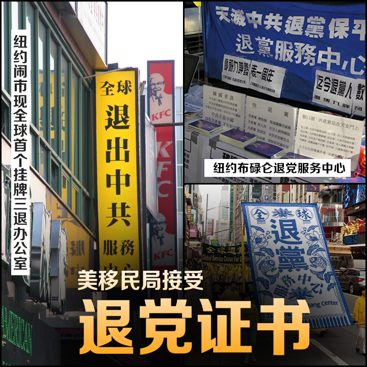
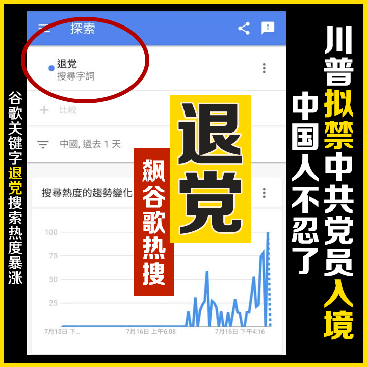

<!--<h3 align="center"><a href="http://61.228.179.169/300">每个人都有知道真相的权利  翻墙必看 http://61.228.179.169/300 </a> </h3> -->

<h3>请收藏网址(新闻视频)  https://bit.ly/3ezRQKo 随时连上最新即时IP</h3>
 

<h3><b>最新评论、热门视频 https://bit.ly/2A4uPQb </h3></b>
 

 
<h3>看更多真相 https://bit.ly/2RQM1hX </h3>

 
 
<h4>网页若出现〝你的连现不是私人连线″，点→进阶，再点→继续前往...，就可以看到视频了。 </h4> 

<h4 align="center"><a href="https://git.io/ykykyk"> “四•二五”上访真相  https://git.io/ykykyk </a> </h4>

<h3>https://bit.ly/2CkkFMu</h3>

<table>
 
<!--<tr>
 <td>
 <a href="https://git.io/pamja">如何 “ 三退保命 ”</a>，<b>连上面→免翻视频 IP http://61.228.179.169/300 </b> →点 【三退大潮】--为什么要退党？ 可留言三退或用翻墙软件自己办理三退</td></tr>  -->

<tr>
 <td> <h3 align="center">➤ 退党、退团、退队（三退）方法 ( 可使用真名、化名、小名退 )</h3>

 <a href="https://git.io/pamja"> 如何 “ 三退保命 ”</a>，请点击翻牆网站  https://bit.ly/3asSXIA  下载 { 翻牆软件 }→找 { 大紀元網站 }  ( http://www.dajiyuan.com ) 三退</td>
</tr>

  </table> 

 </a>

美国彻底追究人权迫害者 在美共产党员将成亡命之徒

“法轮大法明慧网”日前发表文章，征集已经进入美国参与迫害法轮功学员的人员名单，并准备将名单递交给美国移民与海关执法局，要求美方将这些人抓捕遣返。https://youtu.be/qt7DZRcpkws

<h2 align="center">➤  遭举报迫害法轮功的恶人</h2>

<a href="https://git.io/sos">( 美正在积极制裁宗教迫害者</a>&nbsp;  
<a href="https://git.io/8fqfq">对严重侵犯宗教自由者追责</a>&nbsp;   
<a href="https://git.io/ssbbaaa">迫害人权者应受制裁 )</a>

 <a href="#b28-2">被举报者的退路在哪里？</a>

 

<a href="#b28-1">奉劝被举报者抓紧时机将功赎罪</a>

<a name=list-2><b>目录</b>

<table>

<tr>
<td width=650>
<a href="#b29">➤ 迫害法轮功　河北三河市政法委书记崔浩泉被举报 </a></td>
<td width=250>   明慧网 2019年12月21日  </td></tr> 

<tr>
<td width=650>
<a href="#b28">➤ 长春市公安局国保支队副大队长陈龙被举报 </a></td>
<td width=250>   明慧网 2019年12月17日  </td></tr> 

<tr>
<td width=650>
<a href="#b27">➤  佳木斯市向阳区法院宋涛和检察院李利锋被举报 </a></td>
<td width=250>   明慧网 2019年12月15日  </td></tr> 

<tr>
<td width=650>
<a href="#b26-1">➤ 海风：“恶人榜”成了阎王爷的“生死簿” </a></td>
<td width=250>   大纪元 2019年12月14日  </td></tr> 

<tr>
<td width=650>
<a href="#b26">➤  山东淄博市公安局张南分局原610主任罗忠被举报 </a></td>
<td width=250>   明慧网 2019年12月10日  </td></tr> 

<tr>
<td width=650>
<a href="#b25">➤  甘肃省原“610”头目庞波被举报 </a></td>
<td width=250>   明慧网 2019年12月10日  </td></tr> 

<tr>
<td width=650>
<a href="#b24">➤  原哈尔滨市阿城区政法委书记王云飞被举报 </a></td>
<td width=250>   明慧网 2019年12月06日  </td></tr> 

<tr>
<td width=650>
<a href="#b23">➤  十万行恶者上恶人榜 震慑中共人权迫害者 </a></td>
<td width=250>   大纪元 2019年12月01日  </td></tr> 

<tr>
<td width=650>
<a href="#b22">➤  齐齐哈尔富裕县二道湾派出所董伟被举报 </a></td>
<td width=250>   明慧网 2019年12月01日  </td></tr> 

<tr>
<td width=650>
<a href="#b21">➤  吉林省榆树市610头目王帅被举报 </a></td>
<td width=250>   明慧网 2019年12月01日  </td></tr> 

<tr>
<td width=650>
<a href="#b20">➤  新一批恶人名单递交美加英澳新国政府 </a></td>
<td width=250>   明慧网 2019年11月29日  </td></tr> 

<tr>
<td width=650>
<a href="#b19">➤  四川凉山州维稳办主任宋光明被举报 </a></td>
<td width=250>   明慧网 2019年11月25日  </td></tr>  

<tr>
<td width=650>
<a href="#b18">➤  吉林省图们市公安局国保大队长全勇哲被举报 </a></td>
<td width=250>   明慧网 2019年11月25日  </td></tr>  

<tr>
<td width=650>
<a href="#b17">➤  原辽宁省锦州市公安局反邪教支队支队长陆昊被举报 </a></td>
<td width=250>   明慧网 2019年11月25日  </td></tr>  

<tr>
<td width=650>
<a href="#b16">➤  湖北公安县国保大队副大队长廖学圣被举报 </a></td>
<td width=250>   明慧网 2019年11月24日  </td></tr>  

<tr>
<td width=650>
<a href="#b15">➤  参与迫害二十年　山东莱州国保大队刘敬兵被举报 </a></td>
<td width=250>   明慧网 2019年11月24日  </td></tr>  

<tr>
<td width=650>
<a href="#b14-3">➤   山东省茌平县公安局国保大队队长马瑞金被举报</a></td>
<td width=250>  大纪元 2019年11月22日  </td></tr>

<tr>
<td width=650>
<a href="#b14-2">➤   河北香河县公安局国保队长杨永利及610张国被举报</a></td>
<td width=250>  大纪元 2019年11月22日  </td></tr>

<tr>
<td width=650>
<a href="#b14-1">➤   甘肃省原610头目、省政法委书记泽巴足被举报</a></td>
<td width=250>  大纪元 2019年11月21日  </td></tr> 

<tr>
<td width=650>
<a href="#b14">➤   李铭：十万恶人榜 罪行无所逃 </a></td>
<td width=250>  大纪元 2019年11月6日  </td></tr>  

<tr>
<td width=650>
<a href="#b13">➤   迫害法轮功　辽宁610头目姜庆明被举报 </a></td>
<td width=250>  明慧网 2019年10月31日  </td></tr>  

<tr>
<td width=650>
<a href="#b12">➤   追查纳粹战犯 加95岁前纳粹翻译面临遣返 </a></td>
<td width=250>  大纪元 2019年05月08日  </td></tr>  

<tr>
<td width=650>
<a href="#b11">➤   李铭：一朝行恶 终生难逃法网   </a></td>
<td width=250>  大纪元 2019年10月26日  </td></tr>  

  <tr>
<td width=650>
<a href="#b10">➤   唐恩：法网紧收 恶人难逃   </a></td>
<td width=250>  大纪元 2019年10月01日  </td></tr>  
 
 <tr>
<td width=650>
<a href="#b9">➤   王立军助手 江苏省公安厅长王立科被举报   </a></td>
<td width=250>  大纪元 2019年09月13日  </td></tr>  
 
 <tr>
<td width=650>
<a href="#b10">➤   法轮功将向美移民局提供在美恶人名单   </a></td>
<td width=250>  明慧网 2019年09月10日  </td></tr> 
 
 <tr>
<td width=650>
<a href="#b1">➤   枉判11法轮功学员 北京法官孙国立遭举报   </a></td>
<td width=250>  大纪元 2019年08月28日  </td></tr>  

<td width=650>
<a href="#b3">➤   长春副市长兼公安局长吕锋 被民众举报   </a></td>
<td width=250>  大纪元 2019年08月23日  </td></tr>  

<td width=650>
<a href="#b2">➤   迫害电视插播法轮功学员 前吉林高官被举报   </a></td>
<td width=250>  大纪元 2019年08月22日  </td></tr>  

<td width=650>
<a href="#b8">➤   法轮功学员将恶人名单递交美国国务院   </a></td>
<td width=250>  大纪元 2019年07月21日  </td></tr>    

<td width=650>
<a href="#b7">➤   参与迫害法轮功 中共驻瑞典大使被举报到美国   </a></td>
<td width=250>  大纪元 2019年07月11日  </td></tr>    

<td width=650>
<a href="#b6">➤   北京通州区法院法官蒋为杰被举报   </a></td>
<td width=250>  大纪元 2019年07月06日  </td></tr>    

<td width=650>
<a href="#b4">➤   广东恩平市政法委吴奕贤被举报   </a></td>
<td width=250>  大纪元 2019年06月21日  </td></tr>   

<td width=650>
<a href="#b5">➤   河北唐山曹妃甸区610主任吴晓玲被举报   </a></td>
<td width=250>  大纪元 2019年06月20日  </td></tr>   

</table>

<a name=list-1><b>目录</b>
<table>
 
<tr>
<td width=650>
<a href="#a0028">➤   【思想领袖】中共内部承认正走向解体（四）</td>
</tr> 

<tr>
<td width=650>
<a href="#a0027">➤   【思想领袖】中共内部承认正走向解体（三）</td>
</tr> 

<tr>
<td width=650>
<a href="#a0026">➤   【思想领袖】中共内部承认正走向解体（二）</td>
</tr> 

<tr>
<td width=650>
<a href="#a0025">➤   【思想领袖】中共内部承认正走向解体（一）</td>
</tr> 

<tr>
<td width=650>
<a href="#a0024">➤   极度恐惧“天灭中共”标语 中共派人急遮挡</td>
</tr> 

 <tr>
<td width=650>
<a href="#a0023">➤   美国宣布对新疆侵犯人权官员实施签证限制</td>
</tr> 
 
 <tr>
<td width=650>
<a href="#a0022">➤   王友群：“天灭中共”前 赶紧退出中共</td>
</tr>  
 
<tr>
<td width=650>
<a href="#a0021">➤   汪志远：全民反共反迫害开始了</td>
</tr>  
 
<tr>
<td width=650>
<a href="#a0020">➤   内忧外患 北京圈内人士：中共撑不了几年</td>
</tr>    
  
<tr>
<td width=650>
<a href="#a0019">➤   程晓容：9月新闻透警讯 中共动手侵吞民企</td>
</tr>    
  
 <tr>
<td width=650>
<a href="#a0018">➤   中共外专局高官纽约被抓 专家：里程碑案例</td>
</tr>    
 
 <tr>
<td width=650>
<a href="#a0017">➤   美重量级参议员 要求中共停止迫害法轮功</td>
</tr>   
 
 <tr>
<td width=650>
<a href="#a0016">➤   道中人：明月现异象 中共红魔亡</td>
</tr>  
 
<tr>
<td width=650>
<a href="#a0015">➤ 神秘录音流出 官员泄露中共陷统治危机 <a href="https://github.com/awwkk/usdom/blob/master/vidio/bbaaw23ssa.aac?raw=true"> ➤【录音下载.aac】</a></a></td>
</tr>   
 
 <tr>
<td width=650>
<a href="#a0014">➤   申请入境或福利 美将查社交媒体账号内容</td>
</tr>  
 
 <tr>
<td width=650>
<a href="#a0013">➤   美ICE逮39侵犯人权嫌犯 含4名中共计生官员</td>
</tr>  

 <tr>
<td width=650>
<a href="#a0012">➤   专访班农：美中贸易战 中共谎话连篇（下）</td>
</tr>  
 
 <tr>
<td width=650>
<a href="#a0011">➤   七国首脑联合肯定《中英联合声明》   </a>( 香港抗争出路正汇入全球灭共大潮 )</td>
</tr>  
  
 <tr>
<td width=650>
<a href="#a0010">➤   美重量级议员吁制裁迫害法轮功的中共官员   </a></td>  
</tr> 
 
 <tr>
<td width=650>
<a href="#a009">➤   美重量级议员：美正在积极制裁宗教迫害者  </a></td>
 </tr> 
 
 <tr>
<td width=650>
<a href="#a008">➤   程晓容：中共代理人海外行不义 下场可悲   </a></td>  
  </tr> 
 
 <tr>
<td width=650>
<a href="#a007">➤   专访班农：香港若重演六四 中共将灭亡(上)   </a></td>  
 </tr> 
 
<tr>
<td width=900>
<a href="#a006">➤   道中人：历史巨变 惊涛骇浪誓将吞没中共  </a></td></tr>   

<tr>
<td width=900>
<a href="#a004">➤   迫害法轮功者 美拒发签证 新制裁震慑中共  </a></td></tr>   

 <tr>
<td width=900>
<a href="#a003">➤  接见宗教受迫害者 川普询问法轮功学员情况  </a></td></tr>  
 
 <tr>
<td width=900>
<a href="#a002">➤  【特稿】欢迎举报江泽民等人权恶棍美国资产 </a></td></tr> 
 
 <tr>
<td width=900>
<a href="#a001">➤  追查公告 全面收集中共迫害法轮功的犯罪者名单和罪证 </a></td></tr> 
 
 <tr>
<td width=900>
<a href="#a00">➤ 【特稿】中共覆灭在即 勿依赖中共保权 </a></td></tr> 
 
 <tr>
<td width=900>
<a href="#a0">➤ 【特稿】天命昭昭 美国觉醒 共产末日近 </a></td></tr> 
 
 <tr>
<td width=900>
<a href="#a">➤ 【禁闻】收集名单 美将严审侵犯人权者签证</a></td></tr>  

<tr>
<td width=900>
<a href="#a1">➤ 【禁闻】美拟拒迫害者入境 请法轮功学员提供名单</a></td></tr>  

<tr>
<td width=900>
<a href="#a2">➤ 美国将对迫害法轮功者 拒发签证 拒入境</a></td></tr>

<tr>
<td width=900>
<a href="#a3">➤ 张明健：中国将发生世纪大事件？川普打出致命牌</a></td></tr>

<tr>
<td width=900>
<a href="#a4">➤ 反恶法效应 18万港人出席六四烛光集会</a></td></tr>

<tr>
<td width=900>
<a href="#a5">➤ 美驻华使馆发人权问责法 震慑中共人权恶棍</a></td></tr>

<tr>
<td width=900>
<a href="#a6">➤ 美颁新规 有反美言论者赴美签证或将被拒</a></td></tr>

<tr>
<td width=900>
<a href="#a7">➤ 中共邪党的解体正在到来</a></td></tr>

<tr>
<td width=900>
<a href="#a8">➤ 提交迫害者名单：让罪恶无处逃遁</a></td></tr>

<tr>
<td width=900>
<a href="#a9">➤ 美中谈判纳入人权议题 江家资产面临清算</a></td></tr>

<tr>
<td width=900>
<a href="#a10">➤ 【6.9反送中】自己香港自己救 港人上街怒吼反恶法</a></td></tr>

<tr>
<td width=900>
<a href="#a11">➤ 组图3：空拍香港6‧16反送中 声势浩大</a></td></tr>

</table>

 

<a name=list><b>目录</b>
<table>
 
<tr>
<td width=900>
<a href="#002">➤ 证人揭中共活摘器官 律师将证据送联合国</a></td></tr>  

 <tr>
<td width=900>
<a href="#001">➤ 曾亲手活摘未成年人器官 中国医院前实习生曝真相</a></td></tr>  
 
 <tr>
<td width=900>
<a href="#00">➤ 受害者还活着：专家揭中共强摘器官计划</a></td></tr>  
 
  <tr>
<td width=900>
<a href="#01">➤ 从“魔窟”中走出来的中国商人 ——于溟采访录(上)</a></td></tr> 
 
  <tr>
<td width=900>
<a href="#02">➤ 超越生死的惊天壮举 ——于溟采访录(下)</a></td></tr> 
 
 <tr>
<td width=900>
<a href="#002">➤ 一个活摘器官幸存者死里逃生的故事</a></td></tr> 
 
  <tr>
<td width=900>
<a href="#003">➤ 张林: 中共活摘人体器官是普遍现象</a></td></tr> 
 
<tr>
<td width=900>
<a href="#004">➤ “610”官员坦白的一起活摘案例</a></td></tr>  
 
<tr>
<td width=900>
<a href="#005">➤ 【独家】沈阳陆军总院实习医生亲历活摘器官</a></td></tr>  

<tr>
<td width=900>
<a href="#006">➤ 一个武警的觉醒==披露中共活摘法轮功学员器官的事实</a></td></tr> 

 <tr>
<td width=900>
<a href="#007">➤ 渝妇被活摘器官时逃生 背后隐藏中共最惊人秘密（上）</a></td></tr> 
 
 <tr>
<td width=900>
<a href="#008">➤ 渝妇被活摘器官时逃生 背后隐藏中共最惊人秘密（中）</a></td></tr>
 
 <tr>
<td width=900>
<a href="#009">➤ 渝妇被活摘器官时逃生 背后隐藏中共最惊人秘密（下）</a></td></tr>
 
  <tr>
<td width=900>
<a href="#03">➤ 云南劳教所的罪恶 抹不掉的“烙印”（上）</a></td></tr> 
 
  <tr>
<td width=900>
<a href="#04">➤ 云南劳教所的罪恶 抹不掉的“烙印”（下）</a></td></tr> 
 
 <tr>
<td width=900>
<a href="#05">➤ 亲人相见难相识　多少酷刑加身（上））</a></td></tr> 
 
 <tr>
<td width=900>
<a href="#06">➤ 亲人相见难相识　多少酷刑加身（中） ）</a></td></tr>  
 
<tr>
<td width=900>
<a href="#07">➤ 亲人相见难相识　多少酷刑加身（下）</a></td></tr>  
 
 <tr>
<td width=900>
<a href="#08">➤ 在中国　有一群老人被冷冻、殴打</a></td></tr>  
 
 <tr>
<td width=900>
<a href="#09">➤ 她们在“妇女节”被迫害致死（图）</a></td></tr>   
 
<tr>
<td width=900>
<a href="#10">➤ 武汉市“安康医院”的罪恶</a></td></tr> 
 </table>
 

<a href=#list-2><h4 align="right">回目錄</a></h4>

 
<a name=b28-2><h2>迫害法轮功　被举报者的退路在哪里？</h2>
 

【明慧网二零二零年一月三十日】二零二零年一月二十八日，曾经残酷迫害法轮功学员的原河北省鸡泽县公安局长马金献、政法委书记杨芹芳被当地民众举报。（见《河北邯郸市鸡泽县原公安局长马金献、政法委书记杨芹芳被举报》）马金献和杨芹芳是儿女亲家，关系密切，两人都积极追随中共与江泽民流氓集团的迫害政策，在鸡泽县滥用职权，组织、领导、胁迫本县恶警迫害当地的法轮功学员。

明慧网在二零一九年五月三十一日发表《通告》，美国政府将严格审核赴美签证，对人权及宗教迫害者、迫害法轮功者，拒发签证，拒绝入境。这标志着国际社会已从对中共停止迫害法轮功的呼吁，走向实质性的具体拒签行动。

随后，在明慧网上被举报的参与迫害法轮功的中共政法系统官员越来越多，他们的家人的信息也被在网上公布，他们的罪行已经在美国、台湾等国家和地区记录在案。迫害法轮功的这些人，一旦出国将四处碰壁。

目前，河北省邯郸地区已有多位参与迫害法轮功学员的地方官员在明慧网被举报，对于这些被举报者来说，他们的退路在哪里？

马金献，男，汉族，1958年6月出生，永年广府镇北马庄村人。1980年参加工作。曾任：肥乡县公安局局长；鸡泽县公安局局长（1999～2005）；峰峰矿区公安分局局长；武安市公安局局长；丛台区公安分局局长；邯郸市公安局副局长。

杨芹芳，女，汉族， 1959年12月出生，现家庭住址在鸡泽县城关镇城里南街（自盖二层楼独院）；杨芹芳原任鸡泽县政法委书记（2000～2010）；现任鸡泽县人大副主任。 住宅电话、手机、家庭成员情况（明慧网有备案）

一九九九年七月二十日中共迫害法轮功后，邪党政法委、610是传达命令、布置作恶、胁迫各机构单位参与迫害法轮功学员的主要凶手。马金献时任职鸡泽县原县公安局长、杨芹芳是政法委书记，二人相互勾结，阴谋策划、领导和推动鸡泽县对法轮功的迫害，在他俩人亲自领导指挥下，鸡泽县法轮功学员被非法关押、洗脑、骚扰、抄家45以上人次；其中有8人在酷刑和高压下被迫害致死；5人次被非法劳教，1人被迫害致精神失常。

在马金献、杨芹芳的唆使下，当地警察不但酷刑残酷迫害法轮功学员，还经常不断敲诈勒索，骗取学员家人的钱财，据不完全统计约有54万元。鸡泽县本来就是个贫困县，人民生活都非常的拮据，加上马金献、杨芹芳对法轮功学员的敲诈勒索和骗取，使他们的生活更加艰难。

<b>个案举例</b>

从马金献的个人资料上发现，其曾经在邯郸市、肥乡县、武安市等地任职过公安局局长，而这些地方又是邯郸地区法轮功学员被迫害情况比较严重的县市，许多法轮功学员被绑架、抄家、关押与判刑，以至有的家破人亡与巨大财产损失，可以说这些冤案的发生作为公安局局长的马金献负有不可推卸的罪责，其就是迫害元凶。个案举例：

●陈振宇一家五口遭绑架，被抢劫勒索近五十万元

马金献和杨芹芳这对儿女亲家（马金献的儿媳妇是杨芹芳大女儿苏琪）也把迫害法轮功学员当作升官发财的门路，两人都知道法轮功学员陈振宇夫妇家里很有钱（孩子有在银行上班的、有经商的），他们就阴谋策划制定抓捕方案：即绑架迫害法轮功学员陈振宇夫妇，同时进行抄家搜刮钱财。

终于，恶人们认为的时机成熟了。二零零五年正月十五日夜间十一点，马金献带领政保股长陈淑萍、黄辰善等十多人闯入陈振宇家，将陈振宇夫妇和不修炼的儿子、儿媳妇共五口人绑架，抄家，抢劫现金三十六万；两台打印机和几部电脑（有孩子们工作和学习用的电脑）纸张、资料和大法书籍。陈振宇家是个大家族，他们有四个儿子四个儿媳，孩子们的钱财物都在家里放着。当时在家的是二儿子、二儿媳、四儿子和陈振宇夫妇。恶警们对不修炼的儿子们拳打脚踢，把家里所有的钱和值钱的财物抢劫一空。三个不修炼的孩子也被非法关押，敲诈勒索近六万才放孩子回家。

陈振宇的妻子被非法关押在鸡泽县看守所，警察们给陈振宇的妻子灌不明药物、打骂，正月寒冬天气，一个六十多岁的老太太被扒光衣服羞辱，往身上倒结了冰的冷水。非法关押摧残迫害了半个月，勒索五、六万元警察才放她回家。

●张玲玲被马金献直接带人抓捕，警察实施多种酷刑摧残

二零零二年腊月十二日，九名法轮功学员在张玲玲家学法，鸡泽县公安局长马金献、副局长郝永光、政保股长陈淑萍、黄辰善带领多个警察把张玲玲、刘书香等九名法轮功学员全抓走，非法关押到看守所实施酷刑。

张玲玲被当成迫害的重点，郝所长对其多次毒打，警察孟樊红对张玲玲一边打耳光一边侮辱人格扒光她衣服，警察揪住张玲玲头发将头往墙上地上撞，导致张玲玲头发被揪掉一把一把的，十冬腊月天，警察还用冰水将张玲玲从头灌到脚，并戴手铐后用电棍电击身体的各个部位，戴背铐等用多种刑具酷刑折磨张玲玲。非法关押半年，后绝食抗议，人被迫害得奄奄一息，行走都很困难才被释放。

●安金红被迫害致精神失常

二零零零年二月，鸡泽县法轮功学员安金红进京上访，没到信访办就被鸡泽县公安抓回。随后，马金献和政保股长陈淑萍将安金红非法关押到鸡泽县看守所，在看守所期间警察裴付海伙同其他教官，逼迫安金红放弃修炼写三书，不放弃就对安金红进行毒打，多人对安金红拳打脚踢，毒打对安金红来说就成了他们的家常便饭，迫害3个月，毒打次数都数不清，直到把安金红迫害精神失常，向家人勒索5000元才被释放。

<b>参与迫害者的下场</b>

无数的事实证明，为中共卖命不会有什么好下场的，马金献之流者应该认清这个大势所趋。中共迫害法轮功已经走入穷途末路，以周永康、徐才厚、薄熙来、郭伯雄、李东生为首的一大批替中共、江泽民流氓集团疯狂迫害法轮功的元凶被以贪腐的名义法办，或死或抓，纷纷遭恶报锒铛入狱。善恶有报是天理，以下三则恶报是邯郸的真实案例，引人深思。

●邯郸市邯山区政工科长党殿军积极为中共卖命，他参与迫害法轮功学员时心狠手辣，当时是何等的狂妄嚣张，但很快得癌症暴死。他曾口口声声叫喊：“我是共产党员、无神论者！我就是不怕遭报！”然而当天理真的应验于他时，他依靠的党是根本靠不住，也不见了踪影，在恶报面前他显的是那样的凄惨与可怜，后悔不该当初，可是已经晚了！

●邯郸县公安局一科科长张新国，主抓迫害法轮功，在一次绑架法轮功学员时，张新国将法轮功学员家里的汽车开到他自己家里使用。在清明节那天，他开着这辆车回老家给父母上坟，中途回来时开车撞到电线杆上当场死亡，当时他才三十多岁，儿子才十来岁。

●其实，只要参与迫害法轮功的恶人就会被列入明慧网恶人榜，终究面临人间法律的制裁，除此之外，这些恶人们还会遭受天谴，会有许多恶报在等着他们，他们的家人有的也会因为他们犯下的罪恶而遭受各种各样的报应，这就是他们在作恶时为家人种下的恶果啊。不信请看：

韩清林，曲周县公安局副局长。在二零零一年至二零零四年期间韩清林主管迫害法轮功，曾多次非法抄家、抓捕、绑架、毒打法轮功学员，手段非常凶狠、残忍。多位法轮功学员被迫害得奄奄一息时也不让家属探望。

二零零七 年十二月二十六日晚，韩清林的儿子和几个人一起到当地一家知名大饭店去吃晚饭，吃完后和另一位局长的女儿一起开车回来时，与一辆大货车相撞，韩清林儿子当场死亡，另一局长的女儿脑袋被撞下来了，死状惨不忍睹。韩清林儿子刚结婚不久，二十多岁的小伙子，妻子有身孕。另一位局长的女儿也很年轻。明白真相的人们都说这是韩清林迫害法轮功而殃及家人。

●李武其〈音〉，男，五十岁上下，武安市大同镇兰村小学校长。一九九九年七月二十日后，李武其积极追随中共迫害政策，不分青红皂白，想借迫害法轮功讨好上级，趁机捞取政治资本。李武其创作编造诬蔑、诽谤法轮功的歌曲让本村小学生演唱。栽赃造谣，毒害世人。害人终害己，李武其终遭现世报应，在一次车祸中李武其腿被撞骨折。报应还祸及其家人，女儿被地痞流氓拐走一去不返。污蔑大法者遭报应反遭人嗤笑。

善恶有报，这里所列举的恶报案例只是邯郸地区发生的极少一部份。

<b>被举报者的退路在哪里？</b>

善恶必报。二零二零年，我们看到中共邪党正在向地狱裸奔。天网恢恢，疏而不漏，上天在均衡着这一切。对于那些因为参与迫害法轮功而被举报的中共政法委人员而言，以后只要出国就可能会四处碰壁，如不及时悔改，终将罪责难逃，恶报上身。那么，退路在哪里昵？只有马上醒悟，立即停止作恶，将功赎罪，才可挽回即将面临的悲惨下场。如不弃暗投明，万事休也！

<a href=#list-2><h4 align="right">回目錄</a></h4>

 
<a name=b29><h2>迫害法轮功　河北三河市政法委书记崔浩泉被举报</h2>
 

【明慧网二零一九年十二月二十一日】（明慧网通讯员河北报道）河北三河市政法委书记崔浩泉自二零一四年初接任这个职位后，就在当地主导迫害法轮功至今。六年以来，为了迎合上级，他积极推行中共迫害法轮功的密令，推动、组织、策划、指挥了对三河市法轮功学员的残酷迫害。

五月三十一日，明慧网发布《通告》，美国政府将严格审核赴美签证，对迫害人权及宗教的人、迫害法轮功的人，拒发签证，拒绝入境。据评论，国际社会已从对中共停止迫害法轮功的“呼吁”，走向实质性的“拒签行动”。现在，因崔浩泉迫害法轮功已被举报。

因其卖力迫害法轮功，崔浩泉早已上国际互联网法网恢恢恶人榜，恶人编号E000090657，并被追查迫害法轮功国际组织立案追查。在其任职的六年期间，三河市法轮功学员遭遇的被迫害致死、判刑、洗脑班、罚款、抄家等迫害、诸多不幸，崔浩泉本人负有不可推卸的直接责任。

一、崔浩泉个人和家庭信息 

崔浩泉

崔浩泉（Cui，HaoQuan），男，出生日期：一九六三年八月十日；出生地：天津市蓟县（现称蓟州区）；工作单位名称：河北省三河市政法委；职务：书记；家庭住址：三河市富达西侧长城公寓3-5-32。手机13503268008。

妻子马伯秋，出生日期：一九六五年九月九日，工作单位：三河市出版局，已退休；儿子崔乐群，出生日期：一九八七年十二月四日。崔浩泉手机13503268008。 

<b>二、崔浩泉参与迫害法轮功学员的事实简述</b> 

二零一四年三月初，崔浩泉任职河北三河市政法委书记，主导、命令、推动迫害法轮功至今将近六年。 

据不完全统计， 在其任职的六年来，至少有七名法轮功学员被迫害致死，五人被枉法判刑；四人被非法拘禁到廊坊洗脑班；被绑架到拘留所、派出所至少四十五人次；无故被骚扰的至少一千人次。这些恶性事件的不断发生，其罪责昭然若揭，无法推卸。 

<b>主动施压　推动迫害　大举骚扰民众 </b> 

二零一九年十一月以来，特别是全国各地都没有大面积骚扰的情况下，崔浩泉主动向六一零、国保施压，推动迫害，直到各个镇政府、街道办、派出所以及各村街、居委会等，层层施压，大面积骚扰法轮功学员，不法人员私闯民宅、强行拍照录像、逼迫签字、剥夺公民信仰自由。 

被骚扰的学员有：皇庄镇的唐素华、李景荣、葛秀云、李连清、孙立婷、韩淑萍等；东方小区孟庆香、孟庆云；北城的刘桂芬、张海凤、郭春英，刘星军、刘星云及八十多岁母亲和另一位老年同修；泃阳镇兰各庄的赵秀荣、小田母亲等三人；南城的谢宝凤、刘静、八十多岁且双目失明的杨慧荣等；段甲岭镇政府及高家庄、十百户村的十二位法轮功学员，等等。

<b>操控司法　滥用职权　枉法重判好人</b> 

二零一四年以来，崔浩泉施压六一零、公安国保，对法轮功学员王占青、文杰、马维山、康景泰进行非法抓捕、非法拘禁。在明知违法的情况下，仍签署拘留证、取保候审决定、起诉意见书等一系列文件；特别是在康景泰血压高达二百二、身体很虚弱的情况下，直接违反规定、签署文件，强令三河市看守所收押。致使康景泰病中的老母亲忧急交加，急得吃不下饭、睡不好觉，经受不住这巨大打击，仅仅十天就悲惨的离开了人世；在四位当事人已经签署监视居住的情况下，将他们全部劫持到廊坊市拘留所二层，非法拘禁了两个多月。

同时，崔浩泉作为三河市迫害法轮功最高职位者，直接推动、策划、指挥五次非法庭审，明知没有庭审法律根据、没有任何一条法律被四人破坏实施、没有受害者、没有犯罪证据，明知王占青等人的无辜，却滥用职权、故意制造冤狱，对上述四人非法重判，制造了王占青六年、马维山和文杰各五年、康景泰判三缓三的重大冤案，罪责难逃。 

<b> 打压律师　破坏法律　浪费民脂民膏 </b> 

2015年6月19日至9月9日，在崔浩泉的施压下，三河法院对王占青等人的五次非法庭审，每次都劳民伤财，耗费了大量人力、物力。 

二零一五年六月十九日一大早，阴云密布，天空中小雨下个不停。三河市六一零头目崔浩泉亲自到现场督阵、指挥。动用公安、交警、特警、法警、防暴大队、派出所警察、便衣，各乡镇政法委、综治办人员约三、四百人；警车三十余辆、特警车十几辆、计生委救护车一辆、杂牌车能辨认出来的二十几辆；排队行走、穿黑衣的特警三队，每队三十多人；此外还借调了廊坊市及香河县等外地警力。在三河市法院东大门两侧，拉起大约二百米警戒线，驱散附近民众，三步一岗，五步一哨，如临大敌。

五次非法庭审，每次崔浩泉大清早就在法院门口亲自督阵，很长时间都站在法院门口。 

6月19日，三河市政法委书记崔浩泉（左二黑衣倒背手）在非法庭审法院东大门外

7月2日，第二次非法开庭，崔浩泉（左三）到现场

在崔浩泉的施压下，每次非法庭审都极力压制依法辩护的维权律师，甚至发生了将女律师王宇暴力拖出法庭，象扔包袱一样扔到马路上的恶性事件。

文杰的辩护人王宇律师，因山西大同南郊区法院也将在同日开庭，南郊区法院要求她递交三河法院书面开庭通知，三河法院拒绝开具通知，她多次与三河法院电话沟通、一次专程赶到三河法院，未果。七月二日，三河法院第二次开庭时，王宇律师要求审判长马成河开具、送达出庭通知书，休庭一个多小时再开庭，法庭仍没给出合法的处置与答复，王宇律师坚持自己合法要求。马成河恼羞成怒，一声令下“将王宇律师驱逐法庭！！！”王宇律师被身高均约一米八五、体重都在一百公斤以上的众多法警，暴力拖出法庭，从三楼一直拖拽至一楼，又被从一楼拖下十几层台阶，穿过几十米法院的院子，她被像扔包袱一样，扔在了法院前边的马路上。这一场景，正好被赶过来声援的天津刘连贺律师，及现场周围部份声援的民众亲眼目睹。

王宇律师被拖出法庭、扔到马路上后，刘连贺（左一）律师陪同去三河市检察院控告。稍后，胡贵云（左二）、冯延强（右一）律师一同去检察院看望王宇律师（右二），做完笔录四律师留影。

非法的庭审，阴森恐怖，审判长法槌连敲不停，无论当事人的律师说什么都被强行制止、打断。胡贵云律师说：法官不遵守法庭纪律、不让人说话有人给做主，我遵守纪律一直举手不让我说话，谁给我做主？董前勇律师说：为什么我一说话审判长就设置种种限制，公诉人发言却不受任何限制？为什么我一说话审判长就处处质疑，公诉人却不受任何质疑？为什么我一说话审判长就打断，公诉人却什么时候都可以随便说？！老律师李静林无奈的身子向后一仰，摊开双臂仰头长叹：唉！这哪是庭审呐！庭审辩论中，马维山的辩护词没让念，文杰的辩护词念不到一半被强行制止，整个庭审过程没有一个程序合法地、完整地走完，就强行草率的向下推进。

主审法官马成河、石少林和公诉人芮爽等人，有着十几年审案经验，却常常被律师和当事人问得理屈词穷，哑口无言，尴尬万分。

<b>色厉内荏再行绑架崔浩泉恐惧正义彰显</b>

五次非法开庭，在崔浩泉的施压下，国保大队长石连东及其手下每次都到法院外面监控现场声援民众，造成一位外地民众被打、被抓，一位法轮功学员被绑架并劫持到三河市看守所非法拘留多天。

法轮功学员康景泰来到现场看看，正赶上国保教导员乔春江带领曹爱博、小胖子和司机，开车四处转圈拍照、录像，司机跳下车瞪眼说：“你还想进去怎么的！”小胖子走近前搜身，抢走了康景泰手机。

第一次非法庭审，一个外地五十多岁戴眼镜的男士，来到现场准备去旁听声援。到南门办理旁听，大门已关闭，武警骗他说：“已经办完了”，他义正词严的指出：“说好开庭前给办，现在离开庭还有半小时，竟然就不给办了。” “炼法轮功的碍你们什么事啦，不就是一群好人吗？！你们就是流氓和骗子。”四个警察围上来，一把抓掉眼镜，扇了他三个耳光，卡住脖子，两脚把他踹上警车，劫持到泃阳镇派出所，非法拘禁七个多小时，才被国保送到燕郊。

第三次非法庭审，廊坊市法轮功学员杨建坡，因为穿一件前面写着“真、善、忍好”，后面写着“法轮大法好”的T恤衫，在三河法院现场，被贾志学等叫来北城派出所警察，将杨建坡绑架并劫持到三河看守所直接刑事拘留。他绝食反迫害，十几天后被放。

2015年8月28日早晨8点，崔浩泉施压六一零、国保、巡警、特警和相关派出所，动用百余警力，在三河城区和燕郊镇区，抄家抓人，劳民伤财，制造恐怖。绑架白玉文，警察翻墙跳院，如土匪打家劫舍；绑架刘永禄（75岁），不顾家人病重，骚扰、抢劫十小时；绑架宋建国老师，不管补习班学生，直接抄家抓人；绑架李素伶老太太，平房、楼房全部抄抢；绑架唐瑞珍老太太，大法书、笔记本电脑、打印机等私人物品全都抢劫；绑架周再田医生，对十几位输液的病患置之不理，整个诊所翻个底朝天；绑架可伟，他因公出差躲过一劫，厂子被非法查抄，住宅被警察找来修锁工撬坏锁芯、破门进入，抢劫、抄家。

这次大绑架，是对法轮功学员非法庭审、打压迫害的延续。以上被绑架的法轮功学员，不是曾经去法院旁听，就是去法院附近声援且被拍照。崔浩泉想借“北京阅兵”安保之名，报复他们的正义举动。这和将王宇律师扔到大街上，如出一辙。

<b>打压善良，毫无人性，将八十岁老人投入监狱</b>

马维山等四位法轮功学员被枉法重判，一审五次非法庭审后签字时，马维山写下“庭审无效，判决作废”，签上名字。马维山认为自己修炼法轮功、讲述大法真相，没有任何过错，更没有触犯法律，根本不承认被非法判刑。二年多来一直在家中正常生活，学法、炼功、讲真相。不知什么时候被有关部门弄成“网上追逃”，被非法通缉。

马维山，男，今年整整八十岁。二零一八年九月二十八日，在燕郊行宫市场讲真相时，被西城派出所两个警察绑架，劫持到三河看守所，三天后被劫持到冀东第二监狱第五监区，现在已经一年多。

中共是一个邪灵，它存在的终极目的是毁灭人类。目前，香港的局势已经让世界更加看清了中共的真实面目，对中共有清醒的认识的国家越来越多，彻底清除中共邪灵的局面正在形成，天灭中共是历史的必然。奉劝那些至今执迷不悟仍在追随中共为中共卖命的人，审时度势，不再做恶，为自己留一条后路。

举报崔浩泉，是想让他良心发现、迷途知返、幡然醒悟，是想制止他继续犯罪，是希望他悬崖勒马，抓住最后的机会将功赎罪。千万不要越陷越深，甘心充当江泽民的打手，走上一条不归之路。

附件：

据不完全统计， 在崔浩泉任职期间，至少有七名法轮功学员被迫害致死，四十五人在迫害中离世，五人被枉法判刑；四人被非法拘禁到廊坊洗脑班；被绑架到拘留所、派出所至少四十五人次；无故被骚扰的至少一千人次。

<b>一、七人被迫害致死</b>

1、魏书侠，女，泃阳镇兰各庄村人。多次被非法拘禁在泃阳镇政府、三河市看守所、廊坊洗脑班，被非法劳教两次。二零零零年七月，魏书侠去北京为法轮功和平上访，后被当地警察接回，被非法拘禁在泃阳镇政府。泃阳镇政法委书记康福利，综治办主任石立军，和一个二十多岁头发烫成黄色（大伙叫他黄毛）的小伙子，逼迫魏书侠脱光所有衣服，他们找来一个洗衣服的搓板儿，强迫魏书侠一丝不挂跪搓板很长时间。这件事魏书侠一直很纠结、不敢曝光，主要因为中共迫害的血腥与残暴，特别是连坐、株连家人，她的丈夫、儿子、女儿出自于对迫害的惧怕，都反对她修炼。魏书侠怕她的家人知道后，不敢反对邪党和施恶的坏人，反而对她的修炼徒增魔难。直到离世的两年前，才与同修诉说、曝光。

二零零一年，她被绑架三河民政局到洗脑班，二零零三年被绑架到廊坊洗脑班迫害。

二零零一年，魏书侠被非法劳教三年。

二零零七年六月四日下午，泃阳镇兰各庄村委会人员到魏书侠家，要她到村委会去，欲绑架她去廊坊洗脑班，魏书侠到村委会一看情况不对快速走脱，绑架未遂。

二零零九年四月二十九日下午，魏书侠和同修杨泽梅在南关铁路桥附近，给一名中年妇女讲真相时，被其向110恶意举报，而遭绑架，魏书侠家于当天晚上被非法抄家，二人先后被劫持到三河市看守所及廊坊洗脑班，魏书侠被廊坊洗脑班迫害血压高达二百多，石连东仍将其投入石家庄女子劳教所，被非法劳教一年半。在劳教所，魏书侠被迫害的血压高达二百七，且长期高压不下，呼吸困难，劳教所不得不提前两三个月放人。

回家后，魏书侠经常遭到村委会、镇政府、派出所等人员上门骚扰，在精神与肉体的巨大承受与压力下，于二零一四年五月二十六日离世，终年六十二岁。

霍淑香

2、霍淑香，女，康宝亨老伴，性格温和，善良慈爱，是街坊邻里公认的好人。

一九九九年中共无理打压迫害后，独子康景泰只因坚持按真、善、忍做好人，在三河市中医院很长时间被监视工作，二零零零年被非法劳教二年，刑事拘留三次、行政拘留一次、非法拘禁一次，非法劳教回家后工作被停止；儿媳方春艳被劫持、绑架进三河南城派出所二次，被强制看管在教育局一次，在哺乳期间仍被学校骚扰；霍淑香孙子康新宇自从出生后，父母一直被迫害，长大后，在学校遭精神困扰。由于非法劳教、拘禁、洗脑、看管，不让康景泰和妻子方春艳正常上班，致使全家造成严重的经济损失和精神伤害，直接经济损失就达三十余万元。

二零零三年二月，三河公安以康景泰涉及“河北环京五号案”为由，三河市公安局副局长张尚林等人把霍淑香老伴、儿媳都非法拘禁在南城派出所，同时三个女儿都被非法抄家，其中两个女儿被绑架到三河市看守所。期间，公安以将康景泰判刑为要挟，家人被勒索一万元。

霍淑香老伴儿，三河市中医院著名老中医康宝亨，因儿子、儿媳、女儿被绑架、关押迫害，长期担惊受怕，于二零一三年十月二十七日离世。

二零一四年四月二十二日，康景泰、方春艳被绑架，家中被抄抢，正在病中的老人忧急交加，几天见不到儿子，急得吃不下饭、睡不好觉，再也经受不住这巨大打击，儿子被抓后仅仅十天就离开人世，终年七十八岁。

详见明慧网二零一六年三月三十一日《河北医生遭非法劳教　夫妻共同起诉江泽民》

刘星敏

3、刘星敏，女，1974年12月出生。河北三河市水电五局员工，从小体弱多病，且胆小，性格内向。1997年得法修炼，身体的各种病痛不翼而飞，人也变得开朗、快乐，最重要的是懂得做事考虑别人。

一九九九年七二零，大法遭到迫害后，刘星敏三次进京上访为大法说句公道话。第一次她去北京上访被抓，拉到石景山体育馆，然后接回三河。水电五局书记范勇让她到办公室看报纸，写“保证”，被拒绝。单位领导又在办公楼办“学习班”，每天“学习”，逼迫本单位法轮功学员放弃修炼，并收缴大法书和身份证。因她不放弃修炼，本单位派人在小区门口值班，二十四小时监控她，不许法轮功学员出大门，谁出大门就打电话给派出所来抓人。

二零零零年二月十二日，刘星敏去天安门为法轮功鸣冤，被绑架，送回三河看守所，非法关押三十天；因恶党开“两会”，怕人去北京上访，又无理加了十五天。她随身带的二百多元钱被搜走，家人来接时被勒索罚款二千元（没开收据），还让家人写了“保证”。北城派出所的闫建树去她家抄走了大法书和单放机。

二零零零年六月二十九日，再次上访被三河驻京派出所接回，被非法关押在三河看守所。路途中派出所宅姓警察让她写保证不再进京，刘星敏拒绝写，姓翟的警察就猛烈的扇她耳光，扇完后导致她的耳朵嗡嗡响，听不清。送回看守所后因绝食，看守所狱警刘辉又对她毒打，她绝食六天放回。

二零零零年十月六日，她又一次上访被公安机关治安拘留，她绝食一周后放回。

二零零零年十二月，因她多次进京上访，被单位开除公职。

二零零零年四月十四日早晨，刘星敏和十几个法轮功学员在户外炼功，被北城派出所的警察在身上狠踹一脚，到派出所后，警察逼迫她们跪下，用电棍电击每个人，还说了很多难听话，到晚上才被放回。

二零零零年，水电五局领导张卫民、安忠找她“谈话”，用允许她上班（这之前因坚持修炼法轮功，单位非法逼她下岗失业了），利诱她放弃修炼。因不放弃修炼，她被非法开除工职。当时她才二十多岁，单身，给她个人生活和家庭造成严重伤害和影响，也制造了家庭矛盾。

二零零零年十二月三十日，水电五局领导配合北城派出所闫建树，在小区门口蹲坑将她绑架，没有出示证件，没有合法手续。因她抵制迫害，被放回。

二零零一年六月八日，她在街上被开车路过的闫建树截住，并打电话叫来警察，将她绑架，送往唐山开平劳教所，非法劳教二年。没有出示证件，没有合法手续，也没有通知家属。在劳教所，刘星敏绝食抗议这种违法行为，为此被“关小号”迫害，并有两个犯人看管。期间被强制洗脑、高压恐吓、体罚、野蛮灌食、不许睡觉、打骂、利用恢复工职（谎言）等手段逼迫放弃修炼。

二零零八年奥运期间，水电五局领导李华、吴利铭、李娟、马来喜等人积极配合北城派出所，街道办人员于七月十九日晚十一点半到她家骚扰，强行收缴身份证，企图绑架。她坚决抵制这种违法行为，第二天执法人员才撤离。

二零一二年十一月八日到十一月二十五日，恶党十八大期间，水电五局领导派两人值班监控她和本单位法轮功学员。二十年来，几乎每年的所谓“敏感日”，她和本单位法轮功学员就会被骚扰。因为持续二十年的迫害，绑架、殴打、限制人身自由、威胁、恐吓，身心受到严重伤害，经济遭到截断，在巨大的压力下，刘星敏于二零一七年十二月十日离世，时年仅仅四十三岁。详见明慧网二零一三年七月十七日，《河北省三河市刘星敏曾经遭受的迫害》

4、刘翠荣，女，李旗庄镇河屯村法轮功学员。二零零六年正月初八，刘翠荣与同修一起去邻县香河公安局，要求释放被非法抓捕的法轮功学员，被当地警察绑架，很快被劫持到三河市看守所，期间被逼写“保证书”、被逼做奴工劳动，并被非法劳教一年。随后，被三河市看守所警察送往唐山开平劳教所、保定劳教所等，皆因身体体检不合格劳教所拒收，最后把她劫持到石家庄女子劳教所，非法拘禁、强迫做奴工劳动等等迫害，直到劳教期满回家。以后每年的所谓敏感日，她都遭到李旗庄镇政府、派出所不法人员的骚扰、恐吓等。

二零一六年四月上旬，不法人员又到刘翠荣家里骚扰，逼她签字，承认是诬告江泽民等等。遭这次迫害之后仅仅十几天，就含冤离世，年仅五十七岁。

5、刘瑞海，男，三河市燕郊镇诸葛店村法轮功学员。刘瑞海于一九九七年十月开始修炼法轮功不久，多种疾病不治而愈，同时他按法轮功要求的“真善忍”原则做人，不仅家庭和睦了，原来不和的邻里关系也好了。

一九九九年中共迫害法轮功的这些年中，先后八次被绑架到看守所、洗脑班等地非法关押，遭受熬鹰、电刑等酷刑迫害，家中几次被抄，中共所豢养的暴徒不分白天黑夜随时会闯入家中骚扰、恐吓、逼迫，时时面临被绑架、关押、酷刑迫害，甚至被迫害致死的危险。

一九九九年十月三十日晚，村书记扬春平把刘瑞海叫到大队，镇政府来的人问：“你为什么炼法轮功？现在上边不叫炼了，你还炼不炼？” 刘瑞海和妻子都说炼，他们晚饭还没吃，就被送到燕郊分局非法关押，五天后又把他们转到三河市看守所非法拘留。

二零零零年元旦、过年期间，三河市燕郊分局都有人监视他家，严重干扰了家人的正常生活。

二零零零年四月十九日晚九点多钟，燕郊镇政府政法委书记张子华、陈景忠、吕文生、崔巧燕（六一零成员），燕郊公安分局田曙光、沈建华伙同村干部扬春平等十人跳墙进入院中，要把刘瑞海和妻子绑架到镇政府办的洗脑班迫害。他们强行闯入屋里，给他们讲法轮功的真相，他们不听。夜里一点多钟，公安分局两个小伙子把刘瑞海从炕上拽下来，和妻子一起被强行绑架到镇政府。夫妻二人绝食抗议这种违法行为，第八天被放回家。当时刘瑞海十六岁的儿子也被带到公安分局，铐了一夜，次日才放回。

同年六月二十五日，刘瑞海去天安门打坐炼功，以这种特殊的方式为法轮功说句公道话。刚刚几分钟警察就把他推上警车，送往北京天安门派出所。刘瑞海和另外几名同修被警察接回，到分局把我铐在铁柱子上，铐了三个多小时后带到二楼审问，期间遭田曙光就用电棍电击，把他电倒在地，满地打滚，共电了两次。半个多小时后，刘瑞海被送到三河市看守所，非法关押一个月才放回家。

二零零零年十二月十九日，刘瑞海和妻子去北京证实法，被绑架后送回当地，和其他法轮功学员关在燕郊镇政府大会议室内，男女混关了十多天。期间还被挟持到派出所，把人吊在铁柱子上、大门上，脚尖似着地不着地，手都给吊紫了，直到十二月三十日才放回家。

回家后，村里派了七十多个人监视本村的法轮功学员，一天二十四小时看着，一点人身自由都没有。十二月三十一日那天，监视我们的人二十四小时不断的开门到屋里看人是否在家，尤其夜里吵得夫妻俩无法休息，就又去了北京。刚到广场边就被镇政府周文东等人看见，又被带回镇政府，一直非法拘禁到正月初一才放回家。

二零零一年二月份，恶人要办洗脑班，刘瑞海不得不离家出走。五月三十一日，刘瑞海和妻子又被绑架到公安分局，被铐了一天一夜，第二天，刘瑞海被送到看守所非法关押八天，妻子被放回家。

二零零三年秋收，刘瑞海和妻子正在家剥玉米，燕郊分局中队长田曙光又把他们夫妻绑架到公安分局好几天才放回，家中大堆的玉米都发芽了，损失很大。

二零零六年五月至八月，刘瑞海从家中被绑架到三河拘留所，后转到廊坊洗脑班被非法关押、迫害两个月。

二零零七年五月十九日下午两点，刘瑞海被警察周文珍（音，多次参与绑架）绑架。

二零零零年至二零零八年奥运会前，每年四·二五、七·二零、开两会、节假日等中共所谓的敏感日，都到刘瑞海家骚扰，大约有过二十多次的骚扰，有时白天，有时夜里一两点钟来骚扰。

由于常年被中共人员残酷迫害，常年生活在这种高压恐怖中，刘瑞海身心受到严重摧残及伤害，于二零一六年十二月二十九日含冤离世，终年六十七岁。

详见明慧网二零一七年一月十一日，《屡遭迫害　河北三河市刘瑞海含冤离世》；明慧网二零零四年4月16日，《我和妻子因为说真话几年来屡遭迫害》 。

张春华

6、张春华，女，河北省三河市新集镇李庄村人，曾四次去北京证实大法，为法轮功说句公道话，因此四次被非法刑事拘留，并被非法罚款六千多元。她的丈夫潘振芳，多次遭到新集镇派出所所长王振东等人的打骂，有一次在大冬天，被扒光衣服、只剩一个裤头，赤脚蹲着踩在雪地上，铐在马路边的广告牌子上冻了好几个小时。

二零零零年黄历正月初八，张春华去天津蓟县侯家营乡的妹妹家，被警察劫持到侯家营派出所非法关押一天一宿，后被当地警察接回，把她背铐铐在院内水泥柱子上，第二天送三河看守所非法拘留四十天。

二零零零年四月二十四日，镇政法委书记杨少林带多个警察，把张春华和她丈夫潘振芳从家中绑架到镇派出所非法拘禁三天，二十七日把张劫持到三河市看守所，二十八日送唐山开平劳教所，劳教一年。

二零零一年二月十五日一大早，张春华劳教回家没几天，镇派出所警察将潘振芳强行绑架，直接送廊坊万庄劳教所，劳教三年。两三个月后，潘振芳被转到河北高阳劳教所，受尽了残酷迫害，三年来劳教所不许家人探视。他被双手分开在身体两侧铐在水泥地环上，只准半蹲的姿势，整整十六天十五宿，白天地表温度高达四、五十度，晚上蚊子成群的在脸上身上叮咬，到白天看身边地上有许多被撑死的蚊子，被蚂蚁拖着走；在强制转化中，被四根电棍同时电击十几分钟，昏死过去后，被狠命掐人中、用烟头烫脚心，二十分钟才慢慢苏醒过来。一次，他被叫去和几个人一起去所外的河滩上挖一个埋死人的坑。休息时，一位姓齐的队长把他叫去谈话。齐对他说：“来到这里，要老实，听话，如果不老实，不听话，把你整死了，挖个坑埋了，给局里打个正常死亡报告，你们家属来找的话，我们就说没见过你，没有接收过你，你就没了，永远消失了。”

二零零一年十月，新集镇政府办洗脑班，他们根本不顾她丈夫正在劳教、家中老人孩子没人管，非要抓她去镇里洗脑，逼得她流离失所好长时间。镇政府、派出所人员还经常到家中骚扰、强抢大法书籍，干扰家人的正常生活，连大年三十都不放过。在严重迫害以及巨大精神压力下，张春华于二零一九年三月六日离世，时年六十一岁。详见明慧网二零一六年一月十二日，《遭铐地环、电棍电、烟卷烫　河北三河市潘振方控告江泽民》 。

7、李凤霞，女，家住三河市康居小区。她曾患有类风湿关节痛、贫血、低血压、风湿性皮炎、附件炎等多种疾病，她修炼了大法，身体所有的病痛不治而飞，大法给她及她的家人带来了美好。

二零零零年过年，她去北京天安门证实大法，被广场上的公安抓捕，当地公安接回被劫持在三河看守所三十天，因开“两会”，又以扰乱社会秩序罪续押十五天。仅二零零零年一至八月份，她就被抓五次，非法关押共六十天，罚款二次，共计三千元人民币。

二零零零年四月，因电视播放北京军事博物馆污蔑大法，她就来到了军博，被三河驻京办刘富强等拉回，被皇庄派出所所长黄义铐住双手，一路骂声不停，拉回后被铐在派出所门前的电线杆上，一直到晚上九点多才解下来，再铐上双手拉到一间牢室。黄义上来一把抓住她的头发狠命用力一拉，将她拉倒在地，满口污言秽语强迫李凤霞骂师父，她坚决不从，黄义气急败坏的拿出大电棍电她，电棍没有电着李凤霞却电着了黄义自己，一连三次，最后一次竟把审讯桌上的电话击坏。黄义逼迫李凤霞下跪，并用穿着皮鞋的双脚踩她的双脚腕，又令手下用李的皮腰带狠劲抽打她的臀部两侧（当时只准她穿内衣内裤），后皮带被抽断。黄义又让手下用麻拧成绳，前端系上大疙瘩抽打，一个人打累了再换一个，一直到深夜三点多才收手。警察把她的一只手铐在床上，一直到天明，又把她送到市看守所非法拘押三十天。

二零零一年五月十一日下午，李凤霞去同修家串门，与同修一同被绑架，被非法拘留十几天。

二零零一年的夏季，警察绑架李凤霞未遂，她的丈夫被公安局副局长张尚林等，以“干扰公务”罪名拘留十五天。十六岁的儿子因为信仰真善忍，被三河市第一中学开除学籍。

二零零三年二月二十四日上午，李凤霞被绑架，家中被抄抢，将人送市看守所，第二天送唐山开平劳教所，非法劳教二年。回家后经常被居委会、派出所等骚扰，在巨大的压力下，李凤霞于二零一九年十月二十六日突然离世，时年六十一岁。详见明慧网二零零零年九月二日文章《河北省三河市迫害法轮大法学员暴行实录》；明慧网二零零四年三月二十日《河北三河市大法弟子李凤霞一家屡遭迫害的经过》。

<b>四十五人惨痛离世</b> ，他们是周秀莲、张桂芬、周碧方、宁凤臣、刘淑香、杨贵、侯庆华、尹岁平、刘庆丰、金坤一、周宗田、李淑兰、林桂英、刘淑芳、王永贤、赵瑞宝、魏亚馨、李秀敏、杨茂辉、雷玉婷、王起荣、陈淑、唐书华、赵桂兰、张秋英、牛宝革、蒲秀兰、白萃云、陵振芝、马彩霞、胡宝军、张秀芳、彭万兰、冯玉红、郝兴敏、姜淑芳、张秀华、肖某某、屈广林、张秀英、杨树海、梁桂霞、孙艳华、张爱梅、甘玉梅。 

<b>五位法轮功学员被非法判刑四位法轮功学员被枉法冤判六年、五年、三年 </b> 

二零一四年四月二十二日，法轮功学员康景泰、王占青、马维山和文杰，被三河刑警、国保、派出所等人绑架。大法书籍、汽车、电脑、群发短信机、手机等私人物品被抢劫；马维山现金一万三千元、文杰现金卡约一万五千元丢失。康景泰血压高达二百二，看守所拒收，国立臣强令收押；案卷曾两次被市检察院退回，但国立臣等人无视宪法和法律，不断施压，力主对四人枉法重判。 

王占青，三十九岁，原第三中学美术教师，他不仅工作兢兢业业，对学生也认真负责。学生家长暗地给他送钱，请求多照顾一下自己的孩子，他说，“我会对每一个孩子负责，我不能收这钱。”

文杰，五十多岁，齐齐哈尔市民族中学教师，曾经被非法判刑九年，累计被关押十一年，遭受了多种酷刑折磨。二零一一年出狱后被迫流离失所，辗转来到三河，到马维山家做保姆。

马维山，七十四岁，曾经做过村干部、私企经理，修炼以后变得淡泊名利。二零一二年老马不小心把一辆轿车划了个痕迹，主动找到车主要给修车，车主老王不肯，老马只好硬塞给他五百块钱。二零一三年过年之前，马维山骑电动车出门，一辆载重物大卡车飞驰而来，一头扎进马路牙里边的地上，老马被撞倒，腿撞伤了，电动车的一半撞碎了。司机吓坏了，老马安慰他说：“你不要害怕，我是学法轮功的，没事的，不叫你负责任，我更不会讹你，我休息一会，你就走。”司机把他抱到土地上，给老板打电话。老板来了，要拉他去医院治疗、买电动车。老马说：“什么都不要，司机不是有意的，你把我送回家就行了。”车老板把老马送回家要给钱，老马坚决不要，说：“你记住真善忍好就行了。”

康景泰，四十三岁，毕业于河北中医学院，原三河市中医院内科医生。他按照“真善忍”要求自己，善良、谦和、孝顺，视病人如亲人，在同事和患者中口碑极佳。曾经为一个家里困难的人看病长达一年，病人欠药费约六千元，他从来不催还钱，患者非常感动。

在四位当事人已经签署监视居住的情况下，六一零、国保等将他们劫持到廊坊市拘留所二层，非法拘禁两个多月；崔浩泉等明知没有法律根据、没有任何一条法律被破坏实施、没有受害者、没有犯罪证据，却滥用职权、操控司法、故意制造冤狱；四当事人一审经历五次非法庭审，二审走过场式的黑箱作业：枉法冤判王占青六年、马维山和文杰各五年、康景泰判三缓三。

王莲双，六十六岁，是王占青的母亲，王莲双修炼法轮大法后，很快一身的病都好了。中共一九九九迫害法轮功后，母子二人多次被非法拘禁在杨庄镇政府、派出所、洗脑班、劳教所迫害。

二零一六年八月二十二日夜晚十点多，贾志学、商伟等十八、九人，翻墙跳院，抢走私人物品，几个警察把老人拖了一百多米，强行抬上警车。二零一七年六月十六日，王莲双被非法庭审，公诉人赵泽峰故意大声宣读许多诬蔑不实之词，致使老人出现严重病态，庭审被迫中止；六月二十二日再次开庭，两位辩护律师做了有理有据的无罪辩护。六月二十九日，市法院对王莲双非法冤判一年。

二零一四年四月二十二日，王占青、马维山、文杰、康景泰被绑架后，在四位当事人已经签署监视居住的情况下，六一零、国保等将他们劫持到廊坊市拘留所二层，非法拘禁两个多月。

<b>被绑架到拘留所、派出所的法轮功学员，至少四十五人次</b>

二零一九年：12月4日，法轮功学员王学云，到农村讲真相救人时，被绑架、被非法拘留15天；8月9日，杨立芸被暴力绑架、戴上手铐，被恐吓及非法审讯； 4月18日，六十多岁法轮功学员李连清，被绑架及抄家。

二零一八年：

11月14日，高楼镇大法弟子于春香（72岁）、梁淑芹（78岁）讲真相、发台历被绑架，被强行送看守所、拒收；9月28日，马维山在燕郊行宫市场讲真相时被绑架，送三河看守所，两天后送冀东监狱；7月22日，刘亚琴被绑架、劫持到三河市看守所，几天后被劫持回黑龙江鹤岗；5月2日，燕郊镇两名学员被绑架到看守所，分别于5月4日、18日回家。

二零一七年：

11月7日，史瑞香被西城派出所警察绑架、抄家；10月20日，两位女性法轮功学员（一70多岁，一50多岁）到黄土庄镇艾里村讲真相救人时被绑架，被非法拘留15天； 7月6日，李翠香被绑架、抄家、拘留；6月18日早，戒兰荣被绑架、拘留；3月8日，一位约三十岁男性法轮功学员，在段甲岭镇集市讲真相救人时，被绑架、被非法拘留十五天。

二零一六年：

11月24日，李淑红、赵凤琴在讲真相时，被绑架及非法拘留；10月23日，管中凤在讲真相、送台历时，被警察绑架到东城派出所；8月22日，王莲双被警察入室暴力绑架、抄家、非法拘留；2月26日，黑龙江伊春崔雪蕾被绑架、抄家、拘留；1月6日，两名发真相资料的法轮功女学员被绑架到燕郊派出所，另一名学员去要人，被扣留半天加一晚上。

二零一五年：

12月27日，崔雪蕾在燕郊镇首尔甜城发送《神韵》光盘，被绑架到保安室，被勒索150元钱；11月2日，魏连荣、郑常立、姜桂玲、肖立华、丁海荣、李淑珍等被绑架，被非法拘留；8月28日，法轮功学员唐瑞珍、宋建国、李素伶、白玉文，几乎同时被绑架、非法抄家，75岁的刘永禄被非法抄家，人未被带走，64岁的医生周再田走脱，被非法抄家；可伟因公出差，厂子被非法搜查，住宅被警察强行撬门抄家；8月20日、25日，周再田被抄家各一次；8月7日，三河法院第三次非法庭审期间，杨建坡被绑架、被非法拘留。

二零一四年：

4月22日，王占青、马维山、文杰、康景泰被绑架、被非法拘禁在廊坊洗脑班、三河看守所；周再田被非法抄家、绑架未遂。

<b>无故被骚扰的法轮功学员，至少一千人次</b>

仅2017年就达400人次，2018年超过300人次。三河市公安局派出所有十五个（不包括单位派出所），仅北城派出所，要“敲门”的人名单就六十多人；燕郊仅中国铁路三局一个单位，要“敲门”的名单就有五十一人。近两年来，燕郊镇法轮功学员张德利，被派出所警察骚扰每个月少的两三次，多则五六次，一年就四、五十次。

<a href=#list-2><h4 align="right">回目錄</a></h4>

 
<a name=b28-1><h2>奉劝被举报者抓紧时机将功赎罪</h2>
 

【明慧网二零一九年十二月二十一日】近来在明慧网上被举报的参与迫害法轮功的中共政法系统官员越来越多，有许多他们的家人的信息也被在网上公布，他们的罪行已经在美国等国家记录在案。奉劝被举报者立即停止做恶、将功赎罪，或许可挽回可悲的下场。

在这里不妨仅举二零一九年十二月以后被举报的几个案例，以供被举报者醒悟：

案例1：王帅（Wang，Shuai），男，1969年8月25日出生，身份证号（明慧网已记录），家庭住址：吉林省榆树市。工作单位名称：吉林省榆树市政法委；职务：榆树市政法委副书记、“610”头目。

王帅二零一五年任吉林省榆树市政法委副书记、“610”头目至现在。在政法委书记金海指挥下，王帅直接操控公、检、法、司等机构残酷迫害法轮功学员：上门骚扰、勒索钱财、非法抄家、抢劫大法书籍和真相资料及现金财物、绑架、非法拘留、判刑，甚至迫害致死等等，使众多法轮功学员家庭支离破碎、妻离子散，家破人亡，给法轮功学员家人造成巨大的身心痛苦和伤害。

据明慧网不完全统计，在王帅任政法委副书记、“610”主任期间，二零一五年绑架迫害榆树市法轮功学员65人次，办洗脑班一次；二零一六年绑架迫害22人次；二零一七年绑架迫害47人次，中共邪党十九大前后敲门骚扰265人次；二零一八年一至十二月绑架迫害53人次。骚扰12人；二零一九年一至八月绑架迫害40人次，其中非法拘留23人，骚扰17人，累计迫害100多人次。

案例2：王云飞（Wang， Yunfei），男，汉族，一九五九年七月出生于黑龙江省哈尔滨市，现在家庭住址：黑龙江省哈尔滨市阿城区。二零零一年至二零一一年任阿城区政法委书记，二零一二年至二零一七年二月任阿城区检察院代检察长、检察长。他任政法委书记期间，对阿城区法轮功学员遭受的所有迫害负有不可推卸的责任；任检察长期间，对阿城区法轮功学员遭受的冤判负有重要责任。

自一九九九年七月二十日中共迫害法轮功以来，中共政法委及其牵头的610，是迫害法轮功学员的首要凶手，传达迫害命令、布置作恶、胁迫各机构单位参与迫害，甚至直接给法轮功学员定罪判刑。王云飞二零零一年～二零一一年任阿城区政法委书记期间，阿城区至少有377人遭绑架、非法关押，41名法轮功学员被迫害致伤、致残、致死或者离世；有61人被非法冤判；有137人次被非法劳教；有77人被关押洗脑；有85人遭非法抄家；21人被非法开除公职；有99人被勒索钱财，数额高达415002元。

案例3：夏玉霄，Xia，Yuxiao，一九六一年十一月出生在河南省禹州市，家庭住址（省、市、县）：河南省禹州市顺河北路，任河南省禹州市公安局国保大队大队长（二零一七年始任邪党书记一职）。夏玉霄的妻子：侯洁英，Hou， Jieying，工作单位：禹州市公安局城关派出所。夏玉霄的儿子：夏延凯，Xia， Yankai。

二十年来，被夏玉霄、耿松涛等人迫害过的法轮功学员到底有多少人，已经无法准确统计了，在恐怖高压下，因为消息闭塞和传输不便，很多迫害都不能在网上曝光。在夏玉霄任国保队长期间，遭非法判刑的法轮功学员至少有36人；遭非法劳教的法轮功学员至少有32人。遭骚扰、绑架、拘留人次达几千次以上。

案例4：庞波，Pang，Bo，笔名知田，男，汉族，一九五三年十月生，甘肃兰州人，二零零一年二月至二零零二年一月，甘肃省委政法委副书记，省“610”办公室主任；二零零二年一月至二零零五年三月，省委政法委副书记、综治办主任；二零零五年三月至二零零八年三月，甘肃省司法厅厅长、党委书记，省监狱管理局第一政委，省委政法委委员。二零零八年三月后，任甘肃省人事厅厅长、人力资源和社会保障厅厅长、省委组织部副部长（兼）等；二零一三年十月退休。

据不完全统计，庞波在职期间被迫害致死的法轮功学员有69人，被非法判刑的法轮功学员209人。甘肃省第一劳教所，又称兰州平安台劳教所，每年非法关押的法轮功学员约两百人。甘肃省榆中县和平镇柳沟河女子劳教所，每年关押法轮功学员约六十至七十人。

案例5：宋佩侠（Song Peixia），性别，女，一九五八年二月六日出生，住址：黑龙江省佳木斯市前进区保卫社区33组83号，手机：13314544858，宅电：8695052。宋佩侠丈夫王伟明，在佳木斯市百货大楼工作；儿子王宇。

宋佩侠作为佳木斯中级法院一名多年来从事司法审判工作的法官，多次参与迫害法轮功学员；阻碍律师参与诉讼，甚至参与诱骗、绑架法轮功学员。（详情请看明慧网二零一九年十二月十六日《原黑龙江省佳木斯市中级法院法官宋佩侠被举报》）

中共迫害法轮功二十年来，近亿法轮功学员被污蔑、长期监控，数百万学员被绑架、关押、劳教、判刑及关洗脑班，甚至被酷刑致死或活摘器官致死，数百万家庭被迫害得支离破碎、妻离子散、家破人亡！据法轮大法明慧网公开资料显示，被中共迫害致死、有名有姓的就有4361人。在明慧网已查证的案例中，有86050人被绑架，28143人被非法劳教，17963人被非法判刑，18838人被绑架关入洗脑班，809人被绑架进精神病院，各种酷刑迫害的总人次518940。

中共迫害法轮功二十年来，政法委及610作为中共操控、协调部门一直是镇压迫害的幕后推手；公检法司则是冲在迫害第一线的打手，它们手上血债累累，罪恶累累，罄竹难书！上述列举的几个迫害案例，他们都是手握政法委及610、公检法司权柄的官员。他们不是利用人民赋予的权力保护人民，而是骑在人民的头上作威作福、欺压迫害人民。他们实际是中共非法抓捕、冤判无辜善良民众的驯服工具，违反宪法、破坏法律实施、对善良民众实施暴政的真正罪犯。

二零一七年十二月，美国正式实施《全球马格尼茨基人权问责法》，今年，美国又相继推出了《香港人权与民主法案》和《维吾尔人权政策法案》。据悉，目前世界上许多国家已经制定或准备制定类似于美国的《马格尼茨基人权问责法》，《马格尼茨基人权问责法》授权对人权迫害者拒发签证、冻结其海外资产等项制裁。

据大纪元二零一九年十二月十三日讯：近日，美国多位政要向大纪元记者表示，支持川普政府对中共迫害法轮功者实施制裁，拒发签证、冻结其财产。

据明慧网二零一九年十一月十五日消息，更新后的明慧网恶人榜新近问世。这个网站是明慧网的副网，迄今为止，共收集了105580名参与迫害法轮功学员者的名单，并将他们的个人信息和恶行等记录在案，目的在于制止迫害、维护善良、支持正义。

中国有句俗话：善恶到头终有报，只争来早与来迟。人做恶就得偿还，这是天理，谁也改变不了！奉劝那些已被举报但报应还未上身的人，（包括那些已被举报但还未在网上公开公布犯罪事实的人）莫存侥幸心理，赶快悬崖勒马，停止做恶，悔过自新，将功赎罪，为自己留下一条生路，也为家人留个平安的未来，上天有好生之德，就看人怎么做。

古人早在千年前就提醒人：“莫以恶小而为之，莫以善小而不为。”天网恢恢，疏而不漏，老天可在看着哪！ 

<a href=#list-2><h4 align="right">回目錄</a></h4>

 
<a name=b26-1><h2>海风：“恶人榜”成了阎王爷的“生死簿”</h2>
 

中共落马百“虎”盘点：近半在迫害法轮功恶人榜上。（大纪元制图）

【大纪元2019年12月14日讯】“生死簿”是神话传说的名词，又名“生死册”，是指天地人三书之一，即“天书封神榜”、“地书山海经”、“人书生死簿”。此书乃是阴曹地府中管控众生灵寿命的名册，由著名鬼王阎罗王身边的副属判官所执掌，内容记载着人世间所有人畜的名单，包含着每个人以及其他生物的阳寿期限与阴寿期限，主要专用以控制生死之用，从出生乃至死亡的所有生命信息都众在其中。勾魂使者是阴间地狱中的黑白无常、牛头马面（鬼差鬼使）。

“恶人榜”又是什么呢？“恶人榜”是由法轮功团体的官方网站明慧网制作。该榜单主要是收集和整理参与迫害法轮功学员的中共人权迫害者个人信息，并将这些信息提供给美国、欧盟（28个成员国）、加拿大、澳大利亚、新西兰、台湾等国家，这些国家将名单上的人权侵犯者依照《马格尼茨基人权问责法》加以制裁。如：限制入境、冻结财产、禁止官员在本国进行财产交易、驱逐其子女亲属出境并取消身份等。

哪些人将会列入“恶人榜”呢？据明慧网介绍，“人权迫害者”包括但不仅局限于直接实施迫害者，也包括制定具体政策、下达命令以及协同者。如犯有下列罪行者，将列入“恶人榜”名单。如：

1. 未经法院判决为“死刑”而故意杀人；

2. 酷刑和其它残忍、不人道或有辱人格的待遇或处罚；

3. 没有刑事指控的拘押；

4. 绑架或秘密拘押而致人失踪；

5. 其它对生命权、自由权或人身安全权的公然剥夺；

6. 下令、煽动、协助或以其它方式方式参与群体灭绝。

明慧网“恶人榜”显示，截止2019年12月13日，已收集中共人权迫害者10.558万人，而且人数每天都在增加。在这份榜单中可以看到，每个上榜者的个人信息以及所犯下的罪行都有详细记载。上榜者既有像江泽民、罗干、孟建柱、傅政华等中共高官，同时也有中共基层派出所的办案警察及乡镇街办干部。

据媒体报道，预计中共权贵在国外的存款总金额超过了20万亿美元。中国财政部财政科学研究所原所长贾康2019年8月3日在微博转发：瑞士银行公布消息，100名中国人在瑞士银行的存款合计7.8万亿（人民币）。另据中共官方统计，到2018年底，中共官员在海外留学或定居的亲属达250多万。而这些人绝大多数都美国、欧盟（28个成员国）、加拿大、澳大利亚、新西兰等国家。这些官员一旦被列入制裁名单，其海外资产将会在一夜之间化为泡影，亲属也将受到牵连。

正所谓：恶有恶报，善有善报，若是没报，时候未到。如果说明慧网的“恶人榜”是阎王爷的“生死簿”，那执行《马格尼茨基人权问责法》的国家就是“人权恶棍”的勾魂使者。有网友评论：过去法轮功学员都是中共案板上的肉，想怎么斩就怎么斩，如今角色转换了，“恶人榜”已成了掌管中共恶人的“生死簿”，而中共恶人个个都成了“生死簿”上的小鬼。这就叫报应。# 

责任编辑：高义 

<a href=#list-2><h4 align="right">回目錄</a></h4>

 
<a name=b28><h2>长春市公安局国保支队副大队长陈龙被举报</h2>
 

【明慧网二零一九年十二月十七日】（明慧网通讯员吉林省报道）陈龙原是长春市绿园区分局刑警大队重案组警察，他曾在匈牙利六年，在俄罗斯两年，做间谍。一九九九年七月二十日中共开始迫害法轮功后，陈龙因参与破坏资料点，绑架多名法轮功学员，绿园分局特别为他召开一次所谓的“表彰大会”，因迫害法轮功积极卖力，陈龙被调到政保科任科长，专门迫害法轮功学员。后来，陈龙又花钱买官，到长春市局国保支队四大队任副大队长。

二零一九年五月三十一日明慧网发表《通告》，美国政府将严格审核赴美签证，对参与迫害法轮功者，拒发签证。长春市公安局国保支队副大队长陈龙，因多年来参与迫害法轮功学员，现在已被举报。

一、陈龙个人及家庭信息

陈龙，Chen，Long，男，一九七一年十二月生
工作单位：长春市公安局国保支队，也是长春市610成员，警号100502
职务：国保支队副大队长
家庭住址：吉林省长春市南关区永吉街派出所全安社区警务室0024栋3单元
宅电：0431—87979088，手机：13354302271

陈龙的妻子：陈方，Chen， Fang，一九七零年九月二十三日生
工作单位：南关区交警大队打字员
陈龙的女儿：陈莉，Chen， Li，一九九五年六月十日生

陈龙的父亲：陈炳存，Chen， Bingcun，一九四七年一月五日生
工作单位：原长春市交警支队处长，已退休

陈龙的母亲：毛辉，Mao， Hui，一九五零年三月二十七日生
工作单位：退休工人

二、迫害事实简述

二零一一年，陈龙下派到德惠市公安局所谓的挂职锻练。在德惠期间，陈龙置良心和道义于不顾，和德惠市公安局局长王华安在德惠市制造恐怖，实施绑架。七月到十月期间，多次指挥德惠国保大队和派出所参与迫害法轮功学员。

二零一一年三月四日下午，德惠市国保大队警察将在德惠市幼儿园工作的法轮功学员张俞骗到单位后绑架，后又闯到她家中，绑架她丈夫姜学富（在德惠市公安局工作），并非法抄走电脑、打印机等私人物品。

二零一一年三月四日晚六点多钟，德惠市岔路口镇派出所所长于野，带领姜跃海、张野弟、费长军、林英启、大全、大军、杜某等九个警察，闯到岔路口镇北长沟村后李家屯翟秀金家对其非法抄家。后又窜至岔路口镇岔路口村六社刘淑芬家，绑架刘淑芬，并非法抄家。

二零一一年四月十二日下午两点至四点左右，德惠市国保恶警趁农电局送变电工区职工、法轮功学员张伟下班回家时，将他堵截在他家楼下，然后闯到他家中，绑架了张伟的妻子陈静，并抢走了电脑、手机等贵重物品。陈静在次日半夜二点左右回到家中。

二零一一年四月十三日下午四点左右，德惠市国保警察在东十道街法轮功学员李军的住处将他绑架，并将他家中电脑、打印机等贵重财物抢劫一空。

二零一一年四月十四日上午九点多，德惠市公安局国保大队警察闯进林晓明的暂住处（东九道街和平小区），用万能钥匙撬开防盗门，绑架了林晓明和来他家的朋友、农安法轮功学员许兆瑞，并且把电脑和打印机等物品洗劫一空。然后，这群警察又撬开法轮功学员孙立清家的防盗门，闯进孙立清家，将孙立清绑架。

当日下午五点多，法轮功学员王云良去林晓明处，被在林晓明家蹲坑的警察绑架之后，王云良被非法劳教一年；林晓明被非法判刑三年，关押在四平市石岭监狱；许兆瑞被关押在长春奋进劳教所；孙立清被非法劳教二年，关押在长春黑嘴子女子劳教所。

二零一一年四月二十七日上午九点，长春市国保大队伙同德惠市公安局绑架了法轮功学员张求科并非法抄家，同时还绑架了张求科的父亲（隔日放回）和在他家做客的法轮功学员张云芬。绑架的过程中，警察对张求科进行殴打。五月十二日张求科被德惠市公安局国保大队和法制科非法劳教一年，被劫持到长春朝阳沟劳教所迫害。

二零一一年五月二十五日，长春国保大队和德惠国保大队警察绑架了德惠市法轮功学员曹振宇和妻子刘敏。第二天刘敏被放回，曹振宇后来也回到家中。

二零一一年六月十五日左右，吉林省德惠市大房身镇长新村七社法轮功学员季国财被大房身派出所绑架，被劫持到长春非法劳教一年。

二零一一年六月二十二日上午九点左右，德惠市大房身镇东三家子村五社居民，法轮功学员石立金，由恶人构陷，在大房身镇街里商店买东西时，被大房身镇派出所警察绑架。石立金的摩托车被派出所警察抢走。然后，警察又到东三家子村五社欲绑架法轮功学员曲荣桓，曲荣桓走脱。石立金被绑架到德惠市拘留所。

二零一一年六月二十六日晚上，德惠市国保大队和惠发派出所警察出动多辆车，强行绑架德惠市法轮功学员姜彦，抄走存折等，并动刑逼供。

二零一一年六月二十六日当天晚八点左右，德惠市国保大队伙同振兴派出所，出动三台车、十多名警察，气势汹汹地闯入曹玉珍老太太的家里，将她绑架，并抄走电脑等大量私人物品，致使室内一片狼藉。警察的暴行搅的四邻不安，吓得曹玉珍年幼的外孙女直哭，睡不着觉。

二零一一年六月二十六日当天晚上九点左右，王华安、陈龙、袁凤山、范卜等为首的警察指派光明派出所所长矫（音）健、德惠国保大队大队长王伟还有刑警队两个警察，带领光明派出所警察和德惠国保大队警察等十多名警察，动用七台车，动手殴打法轮功学员张凤秋，强行绑架，并按所谓的物品清单抄走卫星接收设备等物品，当天夜里将其非法押送长春拘留所。

二零一一年七月十三日晚上七点三十分左右，德惠市大房身镇派出所再次行恶，继六月二十二日绑架石立金后又一次对法轮功学员的绑架。大房身镇派出所所长王健带领五、六个警察到大房身镇洋草村二社刘俊成家预谋绑架在他家学法的几名法轮功学员，未得逞（当时不是学法时间）。刘俊成妻子常亚文走脱，最后警察把刘俊成带走，在没有任何手续的情况下，警察把法轮功学员家的东西乱翻乱抢，最后抢走法像两张、《转法轮》七本、还有《明慧周刊》、光碟等。翻到九点多把刘俊成绑架到派出所做笔录。然后又返回来到常亚芬家行恶，常亚芬走脱，十点多把刘俊成送往德惠市拘留所。

二零一一年九月二十四日上午，德惠市法轮功学员苏桂芝、王桂华、房淑华、郎亚心在苏桂芝家被德惠市公安局警察绑架并抄家。

二零一一年九月二十六日中午十一点三十分左右，德惠法轮功学员夏善红被绑架。

<a href=#list-2><h4 align="right">回目錄</a></h4>

 
<a name=b27><h2>佳木斯市向阳区法院宋涛和检察院李利锋被举报</h2>
 

【明慧网二零一九年十二月十五日】（明慧网通讯员黑龙江报道）法官、检察官是一个让人羡慕的职业，因为他是惩恶扬善的代表，他是站在一个伸张正义的公正之位，不受任何人或各种因素影响而依法判案。

然而在中共统治下的公检法司都是为中共服务的，当江泽民以中共的名义把法轮功推向对立面之后，那么整个司法系统都站到了中共一边，一些法官为了维护中共的统治权力和自己的利益，在对待构陷法轮功学员的所谓案件办理中执法犯法，知法犯法，伤害善良，使本来就蒙冤的法轮功学员再遭重创。

佳木斯市向阳区法院刑庭庭长宋涛、检察院公诉科长李利锋几次联手非法庭审、诬判法轮功学员，有悖法律工作者的职业道德和做人的良知底线。

二零一九年五月三十一日明慧网发表《通告》，美国政府将严格审核赴美签证，对参与迫害法轮功者，拒发签证。黑龙江省佳木斯市向阳区法院刑庭庭长宋涛、检察院公诉科长李利锋因多年来参与迫害法轮功学员，现在已被举报。

宋涛，男，出生年月：1969年2月28日出生，蒙古族，电话：13512645666
身份证：（明慧网已存档）
职称：佳木斯市向阳区法院刑庭庭长
家庭住址：向阳区光复路安民公共服务中心立新社区合作新村11号五单元302
宋涛的妻子：武颜，工作单位：食品药品监管局，电话：18903687999
长女：宋文茜

李利锋，女，1968年11月20日出生
职称：佳木斯市向阳区检察院公诉科科长
电话：1384616928133 18697098055
身份证：（明慧网已存档）
家庭住址：前进区春光社区21组9号
婚姻状况：离婚

一、佳木斯市向阳区法院刑庭庭长宋涛迫害法轮功学员的事实

（一）阻止正义律师代案阅卷

二零一一年六月十日，集贤县公安局国保大队恶警闯进集贤县一中学食堂，绑架了正在工作的法轮功学员矫龄鋆、栾秀媛、代丽霞，恶警在将矫龄鋆迫害致死后，继续勾结检察院、法院，图谋对栾秀媛、代丽霞非法判刑。而佳木斯市向阳法院刑庭庭长宋涛，百般阻挠代丽霞的律师阅览相关卷宗。

1. 代丽霞家属聘请的律师被迫中途退出

二零一一年八月二十九日早八点三十分，代丽霞家属聘请的福建律师，来到向阳区法院要递交代理手续，并要求阅卷。向阳区法院门卫不让进，让电话联系，而告诉了刑庭庭长宋涛的办公室电话。律师在一楼用电话和宋涛联系，宋涛听明来意后，称自己工作很忙，没时间接待此事，让明天再来。

八月三十日早八点三十分，律师二次来到向阳区法院，宋涛接待说：“我不是案件的承办人，这个案子不是我管，我只负责接待你们。案件的承办人是谁，不能告诉你们，到开庭的时候，你们自然就知道了。”

律师递交了代理手续后要求阅卷，宋涛说：“现在不能阅卷，（至于）什么时候能阅卷，我会打电话通知你。”他们明明知道律师是从外地赶来的，在当地停留的时间是有限的，就以这种拖延时间的方式来阻止律师介入。

家属提出要让律师尽快阅卷，并要求出庭为自己的家人做辩护，宋涛答复：“会让律师阅卷，不会是在开庭的前一天，（至于）什么时间能阅，你们等着吧。允许家属旁听，但人数要限制。”对家属出庭辩护的要求勉强答应了，让家属写份申请再说。

三十一日早八点三十分，律师和家属再次来到向阳区法院，恰好在法院门前遇见了宋涛，他说：“我要上看守所去提审，没时间接待此事，你们别在这儿等我了。”并说家属出庭辩护不行，因为当事人没有委托家属辩护，以此拒绝接待律师和家属，并驱车离开法院，扬长而去。

当天下午两点，律师和家属又一次来到向阳区法院找宋涛，宋涛在电话里接待了律师。他说：“今天下午不能阅卷，我们要把陪审员、书记员配备好，明天下午你来阅卷，顺便告诉你开庭的时间。”

宋涛一边推脱阻止律师阅卷，一边又通过司法部给律师所在的事务所施加压力。准备代理此案的律师接到了律师事务所主任的电话，让他放弃代理此案，催促他离开佳木斯，立即返回当地。在法院百般刁难之下，迫于来自层层的压力，律师不得不遗憾的与家属解除委托。

2. 栾秀媛家属聘请的律师被拒，也无奈退出了辩护

二零一一年九月二日上午，栾秀媛家属聘请委托律师为栾秀媛进行无罪辩护。律师与家属去向阳法院办理相关手续，门卫不让进入法院，宋涛也不接电话。就这样一直僵持到中午，宋涛从法院出来，进了法院附近的洗浴中心。

家属和律师一直在法院门口等到下午一点多钟，见宋涛从洗浴中心出来，家属追上去要求宋涛依法办案，告诉他为栾秀媛辩护的律师就在现场，要求阅卷。宋涛谎称“栾秀媛没有要求请律师”，家属说栾秀媛的儿子为他请了律师，宋涛又强调“她本人没有要求请律师啊。”家属又说：那家属有没有这个权利呢？宋涛无理而又无力的狡辩道：她本人没要求，你要求啥呀？之后，转身进了法院屋里。

宋涛身为法官，竟明目张胆的欺骗家属，拒绝律师介入案件，家属又找到向阳区法院信访科，接待人员互相推诿，还让去找宋涛；家属无奈，又找到院长办公室，房门却敲不开。可以看出，向阳区法院是事先串通、勾结、预谋好的。律师见状只好退出辩护。

3. 家属继续从北京请来三位律师，被宋涛以流氓手段拒之庭外

两位当事人家属聘请的律师因法院阻止介入相继退出，家属没有放弃依法维权，又从北京聘请来三位辩护律师。三位律师接到聘请时，已经是周末。与家属签完委托手续正值双休日，以致无法到法院办理相关手续和阅卷，只得在周一开庭前直接到看守所递交手续。二零一一年九月五日上午八时，律师和家属早早的等候在看守所门外，而向阳区法院刑庭庭长宋涛却再次以流氓手段，蓄意渎职侵权，再次公然拒绝了三位律师的出庭辩护。

（二）在非法庭审法轮功学员的现场 逼迫辩护律师退庭

二零一七年三月七日，佳木斯市向阳区法院第四次对王淑英女士在佳木斯看守所非法开庭。

公诉人宣读起诉书指控的两条所谓“罪名”：一是，二零一五年六月二十八日用快递向最高法院、国务院办公厅投递控告前国家领导人江泽民的刑事诉状；二是，二零一五年十月二十八日与其他法轮功学员因“建三江案”非法行为到黑龙江省检察院递交控告前国家领导人江泽民的刑事诉状。

就连普通百姓都明白，王淑英控告任何人都不犯法，控告是宪法赋予公民的权利，法律面前人人平等。

非法庭审开始时，向阳区法院刑庭庭长、所谓的审判长宋涛宣布开庭事项。辩护人王振江律师举手说，上次开庭我提出的意见，你们还没有回答我。审判长宋涛说，你们提出的意见，法庭予以驳回，你可以保留你的意见。王律师接着说，检察院方面也没给我们书面回答呀？围绕这个问题，控辩双方争论起来。在争论过程中，文东海律师举手说，宋涛，你懂得法律吗？回去好好学学法律，再来开庭；不懂法律，你没有资格坐在那儿。宋涛一听，生气的让法警把文律师带离法庭。

接着，王律师跟宋涛仍旧围绕前述问题展开论辩。王律师一看宋涛的情绪很激动，就说，宋涛，咱们都心平气和的说话，我让检察院回复我的提议，法院没有权力来替代检察院。宋涛就此向王律师提出两次警告，示意如果王律师还就此事坚持下去，就要让王律师离开法庭。在这个过程中，法警一直站在王律师身边，做出随时要把王律师撵出法庭的架势。王律师一看他们是想要将非法庭审程序强行推下去，强力阻止王律师继续再说，王律师拿起自己的物品，就离开了法庭。

两名律师被迫退出后，宋涛继续开庭。整个非法庭审过程中，宋涛发问，佳木斯市向阳区检察院公诉科科员、所谓公诉人姜茗川读案卷里的内容，针对公诉人提出的每一项非法指控，宋涛都象征性的问一下王淑英，王淑英没拒绝回答他的问题，但几次提出抗议说：我的律师不在场，我不能承认这次开庭，你们没有公开、公平、公正，我的合法权利得不到保障，我请律师来，是为我做无罪辩护的。

三月十四日，家属去佳木斯向阳法院找到刑庭庭长宋涛和法官纪忠询问王淑英案情，他们都回答说王淑英案在向阳区法院已结案，材料上报中级法院了。家属又来到向阳区检察院，找到王淑英案的公诉人姜茗川了解情况，他也说材料上报中级法院了，并告诉家属，经合议裁决王淑英三年刑期，你们家属有什么事就到中级法院去问吧。

律师和家属都认为向阳区公检法在王淑英案上没有依法办案，在多处违法的情况下强行推进司法程序，枉判好人，置法律于不顾，就针对向阳区公检法违法行为向有关部门提出控告。

（三）不通知庭审当事人开庭时间 故意拖延辩护律师进庭

法律规定，法院拟定开庭时间后，应在三日内通知案件当事人。

二零一九年十一月五日，向阳区法院在看守所对法轮功学员赵桂英女士非法开庭。律师于四日赶到佳木斯看守所会见赵桂英，告诉她明天开庭，赵桂英说法院没有通知她本人开庭一事。这是明显的违法行为。

律师来到看守所准备为赵桂英做无罪辩护，遭门岗武警拦截，法院说不负责律师进门，武警说必须有看守所出具的手续，法院人员进去后，律师到办公楼窗口要求办理手续，窗口负责会见的人员说不管，由法院负责。法院说不管，律师进不去看守所内的庭审现场，只好在外面等着，过了很久，法院人员才出来把律师领了进去。

（四）非法庭审法轮功学员李桂华

二零一九年十一月二十八日上午九点，向阳区法院在佳木斯市看守所非法庭审法轮功学员李桂华，宋涛为主审法官，向阳区检察院公诉科长李利锋为公诉人。

旁听席上都是邪党人员，只有李桂华的女儿和女婿俩人是家属。李桂华的女儿进入法庭看见妈妈时，喊了一声“妈！”被法警制止。李桂华自己写了自我辩护词，没念完，法官宋涛就不让念了。把从家里搜来的大法书籍和《共产主义的终极目的》、《九评共产党》、护身符卡片等拍成照片，作为迫害的证据。大约三十分钟，非法庭审就草草结束了。

二、佳木斯市向阳区检察院公诉科长李利锋迫害法轮功学员的事实

二零一九年，佳木斯市几名法轮功学员被非法庭审，都是向阳区检察院公诉科长李利锋担任非法庭审的公诉人，她在明知道法轮功学员无罪的情况下，仍执意对法轮功学员非法批捕，并向法院提起公诉。在已经被非法庭审的法轮功学员赵桂英（赵桂英因往树上挂法轮大法好的条幅被绑架）、李桂华（李桂华因向世人发真相资料被绑架）身上，李利锋给法院的量刑建议是四至六年。

被非法庭审的法轮功学员有：赵桂英、李桂华、张淑兰，目前还有多名法轮功学员的卷宗握在李利锋手里。从以上法轮功学员被非法庭审中看出，李利锋，身为检察官，不但不主持正义，还法律公正于民，还与公安局、法院合谋陷害法轮功学员，违背道德良知，其渎职行为，难辞其咎。

二零一九年十一月五日，向阳区法院在看守所对法轮功学员赵桂英女士非法庭审。李利锋不主持公道，故意拼凑罪证陷害法轮功学员。

法轮功学员赵桂英女士被非法关押在看守所期间，赵桂英的朋友给李利锋写了一封劝善信，告诉她：“法轮功学员没有犯罪，都是以真、善、忍要求自己的言行，是当今社会上最好的人……”让家属转交给李利锋，家属给她信时，她当时还高兴的（当时她并不知信里的内容）接过去了。事隔几天，家属再次去检察院见她时，她就追问家属这封信是谁写的，让家属找到这写信的人，想恶意举报，还告诉家属，这封信已经被她交到办案单位，即佳木斯市郊区公安分局了。在赵桂英非法庭审时，李利锋竟然把这封信也作为法轮功学员犯罪的证据之一，致使赵桂英被冤判五年。

由此看来，作为法轮功案件的所谓公诉人李利锋，非但没有起到监督公安和法院的职能作用，还纵容公安人员迫害法轮功学员，并拉着法院一起违法犯罪，严重违背了一个检察官的职业道德。

事实上，法轮功学员修炼法轮大法、按照真、善、忍做人，福益家庭社会，提升大众道德，不仅是合法的，而且应该受到表彰；法轮功学员根本就不应被抓被起诉。法轮功学员坚持正信、讲清真相，不仅是作为受害者讨还公道，也是在匡扶社会正义，维护社会良知，也是应当受到宪法与法律保护的。无论以任何名义对善良的法轮功修炼者采取惩治都是违法犯罪行为，这些伤天害理的罪行，一定会受到追诉、严惩。每个人都在这场大是大非面前检验着自己的良知底线，也将见证将来的结局。

在此，也奉劝被中共裹挟参与迫害法轮功的公检法人员，赶快了解法轮功真相，拒绝参与迫害法轮功，为自己留后路，不做替罪羊，不为这场迫害买单，能勇敢的站在正义的一边，为自己与家人选择美好的生命未来！

<a href=#list-2><h4 align="right">回目錄</a></h4>

 
<a name=a0028><h2>【思想领袖】中共内部承认正走向解体（四）</h2>
 

美国中国问题专家林蔚披露，一个习近平身边高层幕僚告知：他们每个人都清楚这个体制已经完了。（《大纪元时报》采访视频截图）

【大纪元2019年12月11日讯】（英文大纪元记者杨杰凯采访报导/高杉编译）英文《大纪元时报》资深记者杨杰凯（Jan Jekielek）近日在“美国思想领袖”节目中，对美国的中国问题专家、宾夕法尼亚大学国际关系和中国历史教授亚瑟‧沃尔德伦（Arthur Waldron，中文名林蔚）进行了专访。全文翻译如下：

在采访前，杨杰凯提出了一系列的问题：

为什么在杰出的中国问题专家林蔚看来，香港的特殊地位很可能会被永久终结？

在过去五十年里，理查德‧尼克松（Richard Nixon）和亨利‧基辛格（Henry Kissinger）等前美国领导人在与中共的关系问题上犯了哪些关键性错误？

为什么林蔚认为中国共产党政权正进入解体阶段？这种情况与前苏联的解体情况有何相似之处？

https://youtu.be/w-2cArChw5M

这里是“美国思想领袖”节目，我是杨杰凯。

今天，我们和历史学家、宾夕法尼亚大学教授林蔚坐在一起。他是国会美中经济与安全审查委员会（Congressional US-China Economic and Security Review Commission）的创始成员，也是詹姆斯敦基金会（Jamestown Foundation）的董事会成员。

******

（接上文）

杨杰凯：亚瑟，我在多年前读过你的一篇文章，我觉得非常、非常有意思。文章谈到了当时的苏联局势到底会如何，以及美国和其它的许多知识精英当时是如何根本无法想像会有一个没有了苏联共产主义强权的世界，以及这样的世界会是怎样的。但是在那篇文章中，你提到，实际上有些人在当时已经明确地说明了正在发生的事情，这些人是某些持不同政见的团体等等。我发现这一点非常吸引人。现在是不是也存在着像当年一样的“盲区”？

林蔚：是的，我认为，人们都有从众心理。心理学家认为，如果你在一个群体中，你比群体中的其他人看得更远，比如说，能够多看到5% ，甚至多看到10% ，他们会认为你是一个天才和先知。但是，如果你能比他们多看到50%或者100%以上，他们就会一直把你看作是一个非常古怪的人。

在我当年准备的时候，我差点就成为了哈佛大学研究俄罗斯问题的博士。我的意思是，我几乎学习了所有的必须课程，比如俄语等等诸如此类的课程。但我很快发现，如果你想了解真实的苏联，你就必须避免与任何同政府有关的人士接触。

我了解苏联的方式是通过了解苏联流亡者、持不同政见者、阅读持不同政见者的文学作品等等，并认真对待这些作品。当然，波兰人都知道，有一位波兰大使，他当时写了一本书，但没有能够引起任何人的注意，因为他看到了当时到底正在发生什么。

然后有一本俄罗斯的书，叫《苏联能活到1988年吗？》（Will the Soviet Union survive till 1988），书名好像是这个，有人提到过它。但这些观点都只能存在于所谓的“主流观点”范围之外。所以当我回到大学后，我尝试了这个研究方法。

我发现，即使是那些强烈反共的美国教授，举个例子，比如理查德‧派普斯（Richard Pipes），他是代表性人物之一，不久前刚刚去世，他也是我的导师之一。他是你能够找到的最反对共产主义的人。他写了一本名为《旧政权统治下的俄罗斯》（Russia Under The Old Regime）的书，这是一本非常好的书。现在，如果你写了这样一本名为《旧政权统治下的俄罗斯》的书，那很有可能会有机会再写一本姊妹篇，名为《新政权统治下的俄罗斯》（Russia Under The New Regime）。

但是那些他所讨厌的俄罗斯人在他把书写完之前就推翻了苏共。我的意思是，派普斯有着一个亮丽的职业生涯履历，但最终，他只写了一本关于十月革命和其它东西的书。像我经常说的，即使是像理查德‧派普斯这样坚定的反共人士，也无法想像到，历史的篇章会翻到那个没有了苏联的、美好的一页。

好吧，让我来告诉你，当苏共的红旗落下的时候，在1991年的圣诞节或者说是西方的1991年的圣诞节，当时就是一个冲击波，对整个知识界和教授界、所有聪明的编辑和其他人，以及苏联以外的所有共产主义政党来说，都是一个巨大的冲击波。因为如果没有了国家主体，那么政党就会大幅度地失去影响力。

让我感到震惊的是，这是一个巨大的想像力的失败。因为如果你研究历史，那么有一件事就会是非常清楚的，那就是，在历史的任何时刻，事情都有可能向许多方向发展。

我应该感谢美国海军，因为在军事学院学习的时候，我们研究过战争。在能够使失败者取得了胜利或者获胜者出现失败之前，我们都不会认为已经完成了对这场战争的研究。不是去改变双方的战略物资数量，而只是用选择不同的战略方法来改变最终结果。这使我能够反向思考，并能够意识到你很多此前不理解的东西。

这（反向思考）就像一辆汽车，我的意思是，过去美国青少年经常会把汽车拆开，然后再把它们重新组装在一起，之后他们就明白了，哦，原来，驱动轴是非常重要的，但是车上的香烟点火器就是可以被忽略的，就好像诸如此类的事情。没有人，或者说，很少有人在对待历史时，也采取这种态度，我们的人民必须学会，不要总去寻求单一的共识结论。

如果你读过，你会发现他们解密了所有关于中共的报告，不是秘密报告，而是面向普通读者的一般性报告。这些报告完全是毫无价值的。我的意思是，它们什么都不肯定，也什么都不否认，基本都是这样。之后就有了关于中共问题的所谓的“华盛顿共识”。

令我惊讶的是，仍然有一些人，尤其是商界人士，但也有一些学者，像谢淑丽（Susan Shirk）教授（译者注：前美国副助理国务卿、加州大学圣迭戈分校教授）等等，还有其他学者，还有美国兰普森公司的那些教授，他们就是没有搞明白，或者说，他们的薪水实在太高了。我的意思是，在华盛顿，他们会拿沙特的401K养老金计划和中国的401K养老金计划开玩笑。

我曾为美国外交关系委员会（Council of Foreign Relations）的成员工作，他们有一个中国工作小组（China Task Force），我也在其中。有一次，我去了豪华的会议室，先进程度超越了当时的科技水平。我坐下来，旁边的座位上面写着莫里斯‧汉克‧格林伯格先生（Mr. Maurice Hank Greenberg）。我想，我知道这些家伙都是谁了。我的意思是，他是在领薪水的。然后我环顾了一下整个会议室，我看了看所有的人，然后我说，“天哪，难道我是这里唯一一个不拿工资的人吗？”

我的导师，已故的驻华大使李洁明（James Lilley）（译者注：第四任美国驻中国大使，1989年5月8日-1991年5月10日。出版了回忆他在中国的生活经历《中国通：亚洲冒险、间谍与外交生涯九十年》一书。于81岁高龄去世。）他是20世纪最伟大的中情局特工，他出生在中国，在中国接受教育，毕业后进入了耶鲁大学成为第52届学生，后来加入了中央情报局（CIA）。当然，没人告诉我他究竟都做了什么，但是，我和他一起喝了那么多杯咖啡，相当于拿到了博士学位。

他对我说，听着，亚瑟，他们只想利用我的名声，所以我不会去那么做，但是你可以去，但是你要写一些不同意见。我无法向你们描述写这些不同意见是多么的复杂。我的意思是，美国外交关系委员会只把它当作是来自美国的某种通信沟通方式，而事实上，它只是一堆毫无价值的垃圾。

我还曾是一个委员会的成员，它负责审查中央情报局中国站的工作。我们基本上是能够看到任何我们想看的东西和所有其它的东西。

我们写了一份有着不同意见、相当负面的报告，但它被彻底压下来了。而后来的事实已经证明，这份报告是正确的。我一直记得，它就像是烙在我的脑海里一样，李洁明曾说过的，因为他是中共天安门事件时期的美国驻华大使。他对我说：“亚瑟，你必须记住，现在的中情局是一个功能失调的组织，它已经无法履行它的职能。但同时，他们却是最好的华盛顿地盘的争夺者。也就是说，它总是能够获得想要的预算。”

这是一个非常严重的问题，因为根植于美国国务院、情报机构、大学中的，是一种基辛格式的关于中共的幻想，一种认为事情本应按照他们所想像的那样去发展的信念。他们仍然……他们只是没有勇气去面对（现实）。当然这不是非常灾难性的，但仍然是一种惊人的失败和令人完全意想不到的失败。

我的意思是，当尼克松在中国的时候，他认为中共除了听话什么也不会做。但后来我们知道，中共当时要做的事情之一就是设计导弹来摧毁美国的航空母舰，杀死美国人。他们不想去相信这一点，这看起来是一个不可能的结果，但这恰恰就成了我们今天所面对的局面。

我认为，中国将会发生巨变，她将再次令我们大吃一惊。我们将再次无法及时有效地应对。尽管如此，我还是祈祷中国人能自己解决（中共）这个问题。他们已经好几次都很好地理顺了自己的问题。

但无疑，（美国当年）选择毛泽东是一个大错误。如果你读过对毛泽东的采访，比如著名的路透社在1945年对他的采访。这个采访无法在他的中文版文集中找到，但是在日文版文集中能够找到，因为日本人（办事）非常细致。

当他被要求描述他心中的中国将会是什么样子的时候，他回答说，它将会是完全民主的。所有的政党都会有完全的言论自由，所有的官员都是被选举出来的，我们会有多层选举，无记名投票等等。她将会是一个民有、民治、民享的政府等等。他是以书面的形式回答了这个问题， 所以这个回答看起来很有权威性。

因此，像乔治‧马歇尔（George Marshall）这样聪明的人离开中国时，他都觉得毛泽东是一位民主人士。而他认为无法与蒋介石相处的原因，是觉得在某种程度上，蒋介石是个独裁者。

但事实上，毛泽东早在1937年通过一个复杂的中国歇后语，就已经向埃德加‧斯诺发出了信号。我不想就此多说，但基本上，他所说的就是，我是一个“和尚打伞——无法无天”的人。这是一个由八个字组成的中文短语，就是你只要说前四个字，然后其他人就能够得出后面四个字的“歇后语”。但如果你是美国人，……

杨杰凯：你是无法理解他的……。

林蔚：对，你是无法理解他的。但是，被误认为是一个民主改革者的毛泽东，他的统治却完全是——这对中国来说，完全是一场灾难，是一场彻头彻尾的灾难。我们估计，中国共产党政权可能在没有战争、没有天灾的情况下至少造成了7000万中国人死亡。而第二次世界大战总的死亡人数才有5500万。

现在雅克夫列夫也得出估计数字，在同样的情况下，苏共统治下的苏联非正常死亡人数也是7000万。这个数字实在太可怕、太大了，所以人们会说，我们简直没法想像。

杨杰凯：亚瑟，你怎么看，根据你所知道的一切，现在和香港目前的情况，你认为事情会发展到哪一步？

林蔚：我们之前提到过赫伯特，已故的赫伯特‧斯坦（Herbert Stein）的定律，即如果某种事物不能无限期地持续下去，它就会停止。而中共现有的体制也不可能无限期地持续下去。因此，根据斯坦定律，就意味着它将在某一时刻停止。如何停止，什么时候停止，会有什么样的后果，我们不知道。而中国现在正在不断地发生着变化。我祈祷，习近平能够带来一个积极的发展，给我们带来一个惊喜。

杨杰凯：亚瑟‧沃尔德伦，很高兴能跟您交谈。

林蔚：非常感谢。我也很高兴接受您的采访。 

（全文完） 

责任编辑：叶紫微 # 

<a href=#list-2><h4 align="right">回目錄</a></h4>

 
<a name=a0027><h2>【思想领袖】中共内部承认正走向解体（三）</h2>
 

美国中国问题专家林蔚披露，一个习近平身边高层幕僚告知：他们每个人都清楚这个体制已经完了。（《大纪元时报》采访视频截图）

【大纪元2019年12月07日讯】（英文大纪元资深记者杨杰凯（Jan Jekielek）采访报导／高杉编译）英文《大纪元时报》资深记者杨杰凯（Jan Jekielek）近日在“美国思想领袖”节目中，对美国的中国问题专家、宾夕法尼亚大学国际关系和中国历史教授林蔚（亚瑟‧沃尔德伦，Arthur Waldron）进行了专访。全文翻译如下：

在采访前，杨杰凯提出了一系列的问题：

为什么在杰出的中国问题专家林蔚看来，香港的特殊地位很可能会被永久终结？

在过去五十年里，理查德‧尼克松（Richard Nixon）和亨利‧基辛格（Henry Kissinger）等前美国领导人在与中共的关系问题上犯了哪些关键性错误？

为什么林蔚认为中国共产党政权正进入解体阶段？这种情况与前苏联的解体情况有何相似之处？

https://youtu.be/w-2cArChw5M

这里是“美国思想领袖”节目，我是杨杰凯。

今天，我们和历史学家、宾夕法尼亚大学教授林蔚坐在一起。他是国会美中经济与安全审查委员会（Congressional US-China Economic and Security Review Commission）的创始成员，也是詹姆斯敦基金会（Jamestown Foundation）的董事会成员。

******
（接上文）

杨杰凯：OK

林蔚：……因为他想这么做。事实是，在1964年，法国承认了中共政权，这是一件大事。戴高乐对此非常高兴。回顾当时，我们应该做的是，等等看。法国已经承认了中共政权，我们当然也会有意在某个时候和中共建立外交关系，但是我们应该再等个10年。让法国人先去搞搞清楚那边到底发生了什么，是怎么回事儿，让他们去碰到不同的情况，而我们会在各方面去鼓励他们。

等过了那段时间之后，我们有了真正的中国问题专家，有了必要的了解和认知，以及所有法国所了解的。还有就是我应该提到的，就是英国的外交官。因为英国一直和北京有关联，那么我们可以开始制定一个符合当时实际情况的政策。

但是基辛格，他搞砸了，这也就是为什么我说，基辛格的中国政策，以及尼克松的中国政策是美国外交政策中最大的失败。我相信，事实也证明了，基辛格在他的推理过程中存在某些缺陷。他太自信了。当然，在那些日子里，哈佛的教授们对自己也非常、非常有信心。结果，他没有帮上忙，他没有做功课，他只是按照自己的想像而行动，这些想像是基于用维也纳会议对中共的类比。

现在，如果你想拿个什么对中共做个类比，维也纳会议可能不是最佳的选择。最好对中国和亚洲的历史要有一定的了解。因此，我认为，鉴于基辛格的聪明才智，考虑到人们的巨大希望，以及人们对他的崇敬，我认为，他是美国历届国务卿中最大的失败者。

我们有过一些糟糕的国务卿，而他们当中的大多数人从一开始就是平庸的。但基辛格来的时候已经有很多资历，然后他把事情搞砸了。等于是从很高的地方掉了下来。人们将会认识到这一点，虽然可能还需要一段时间。

杨杰凯：是，在这个过程中，还有另外一个重大事件，一直延续到了今天或者最近几年，就是中共获得了WTO最惠国待遇。在国际经济关系方面，出现了人权问题与经济问题脱钩的现象。

林蔚：这些都是在试图以某种方式保持与中共的关系。我们并不担心与印度的关系，或者与印度尼西亚的关系，或者与德国的关系，这些都没有被认为是一种你必须要做出让步以便继续维持下去的紧要事情。但是在中共加入世界贸易组织（WTO）这个问题上，我们基本上是放弃了世界贸易组织的那些规则。我的意思是，中共的货币是不可兑换的。如果你带一包人民币去日内瓦，可能会有人帮你把人民币兑换了，但那只会是投机商，而汇率也不是由市场决定的，汇率是由银行设定的。这就像以前的俄罗斯卢布，如果你看看汇率，它也在不断变化。

世界贸易组织是为自由市场经济而设计的，而中共没有，我们必须承认这一点，它没有自由市场经济，它没有由市场决定的货币利率。它的货币的价值不是由市场决定的，因此它不应该属于世界贸易组织。

我们把中共引进世界贸易组织这个自由市场经济的概念里，是为了以某种方式哄着他们，使他们成为尼克松和基辛格所梦想的那样，也就是说，他们会向美国学习自由和民主并开始民主化。但是他们并没有这样做。那么，另一个重要的时刻是……

杨杰凯：就是把经济关系与人权问题脱钩了……

林蔚：对，我认为这就是在自欺欺人。我经常举的一个例子是，假设你住在纽约，假设第86街那里有一家当地的熟食店。在橱窗里，他们有美味的意大利糕点，他们有上好的奶酪，精美的肉块和瓶装的稀有葡萄酒等等。如果你走进商店，能在前面看到有所有这些好东西。

但是如果你走到商店的后面，那里却有一些刚刚被冷藏的大桶，里面装有新鲜的肾脏、肝脏和心脏，以及各种能够被移植使用的人体器官。而且在这个时候，器官仍在被摘除着，人们仍在被杀害着，这样他们的器官就可以用来移植。

其中很多的器官是要提供给中共老年的领导人，或者给他们的孩子。此前一位中共领导人的儿子得了癌症，就换了许多器官。你会怎么看这家商店？难道你会说，我只是在商店前面买买东西，我不会去关注后面那些活生生的摘除器官那些事，上帝才知道这些器官都是从哪里来的？你会说，这家店在美国到底在做什么。

杨杰凯：例子很可怕，但很有说服力。

林蔚：但这正是我们近年来所做的。换句话说，在成千上万的中国人被中共政权杀害的时候，马斯克先生却在向中国投入数十亿美元。天知道还有多少维吾尔族人被杀害，大量的人被囚禁在最残酷和虐待的条件下，在那里没有法治、没有自由。你不能把这些事情分离开来，这是一个完整的体系，经济部分是政治部分运行的动力，这也是我们必须在经济上隔离中共的原因之一。

因为我们所有的贸易、资金和来自我们的养老基金（对中共）的投资，都是中国共产党能够保持运转的基础。如果他们只能依靠国有企业（那些亏损的大企业）和税收来维持运转，情况将会完全不同。所以，我认为这是一个自欺欺人的说法。

是的，的确也有过一些关于希特勒如何对待吉普赛人和犹太人的问题，当时说，德国生产超棒的徕卡相机，那么为什么我们不能够在得到这些非致命的摄影设备，继续维持（与纳粹德国的）贸易关系的同时，也宣扬说，我们不支持那个（纳粹德国）政权的政策等等。

这样做不仅是虚伪，而且实际上是不可能的，因为（人权和经济）两者之间是紧密地相互渗透和相互依赖着的。但不幸的是，美国商界巨头、摩根士丹利（Morgan Stanley）等公司的首脑成了真正最容易轻信的人。

事实上，我的一个朋友，一个真正的中国问题专家，住在那里很长时间，他是一个外交官。他说，他觉得北京的空气中有一些东西，能使得原本非常、非常老练的谈判者变成另外的样子。比如说房地产（业者），他们去了中国之后，就完全丢掉了所有的关键性（谈判）能力，也不去问一问，这个项目是否会有利可图，是否可能会无利可图，他们都不去问了。

我们必须完全摆脱这个幻想，并意识到我们所面对的，基本上这和我们当时面对苏联时的情况是一样的。所不同的是，我们在苏联没有巨大的投资，我们没有给过苏联人钱。

杨杰凯：我明白了。现在让我们来谈谈我们的现任国务卿，迈克·蓬佩奥（Mike Pompeo），当然，还有国务院与川普（特朗普）总统与前任截然不同的（对华）外交政策。你如何看待事情的发展？

林蔚：我认为这种僵局将继续下去，我认为政府应该采取尽可能强硬的路线。我认为像加拿大、瑞典和其它受中共摆布的国家应该反击。最重要的是，要把那些不受欢迎的人，把那些坏蛋，把他们赶出去，然后再把一半的间谍赶出去。

因为你不想让中共知道你已经知道他们的间谍都是谁，所以你只要赶走一半，留下一些间谍，这样他们就不会知道，他们就无法确定你是否都知道了。

我认为中共正在进入一个像前苏联的那个都在谈论解体的时期。在俄语中，这个词是“распад”（衰变）的意思，这并不是政权会崩溃、一切都会完蛋的意思。它的意思是国家依然存在，建筑依然存在，只是他们必须改变政治体制。

他们从来不用“collapse”（崩溃）这个词，只是我们都用“collapse”（崩溃）这个词。在中国所用的词应该是“Jie Ti”（解体），这个意思是相同的。这意味着，不管这个机制是什么，它已经开始瓦解了。

这就像一辆太老旧的汽车，突然之间，情况就变得不一样了，不行了。它打不着火了，这儿不工作了，那儿也不行了，某个系统也无法正常运转了。

中共现在的体制就像是临时凑合出来的似的，在查明实际情况、提出切实可行的解决方案的时候，就会出现各方面功能严重失调的情况。已经无能力再去考虑现实的解决方案，或对问题进行实际的诊断。这个政权也知道自己在国内的处境十分危险。当然，中国国内的情况可能会很好，但也可能会变得非常糟糕。

有一个人，他是一个非常高级别的顾问那样职位的人，和习近平关系非常亲近。我遇到他时，当时他非常地坦率。他对我说：“亚瑟，我们到底该怎么办？每个人都知道这个体制已经不起作用了。我们已经进到了‘Si Hu Tong’（死胡同）……”这个词的意思就是已经沿着一条街道走到了尽头，一个没有出路的街道的尽头。

他说：“这是一个死胡同，但是我们不知道下一步该怎么走，因为现在已经到处都是地雷，如果我们再走一步，我们可能就会引发一个可怕的爆炸。”所以，一个真正考验智力的问题就是，如何才能退出共产党体制。

苏联是非常幸运的，因为戈尔巴乔夫拥有一个杰出的顾问，雅科夫列夫（Yakovlev），我有幸见过他，他是一个不可思议的人，他是真正的指导戈尔巴乔夫的人。戈尔巴乔夫意识到，如果让俄罗斯继续维持那个运转不良的体制，可能就会导致数百万人的死亡，而他或许可以让情况发生改变。

我相信，尽管戈尔巴乔夫饱受鄙视，但他做了一件令人难以置信的好事，因为在苏联到俄罗斯的过渡时期，死亡的人数最多不超过200人。在他想出办法之前，他不会开枪让人们屈服。然后，戈尔巴乔夫建造了一个防火梯，让苏联全体人民都可以离开这个剧院，或者说是离开其它的什么，在它发生崩溃或发生爆炸之前离开。

因此，我认为他应该得到极大的赞誉。雅科夫列夫也是如此。有趣的是，他是共产党解体后克格勃档案馆的第一位馆长，一个了不起的人。当然，他去了档案馆之后，找到了各种各样的资料。而他做的第一件事就是完整地复制了这些档案，然后把它们发送到五个不同的大洲，这样就不可能再把它们收回来了。

所以我认为，中共正处在这个解体阶段或正在“Jie Ti”（解体）。当然，如果用中庸的眼光，你不会马上看清这种情况。

我和我们的前任驻匈牙利大使进行了一次非常有趣的谈话，内容是关于老布什和他的朋友吉姆·贝克（Jim Baker）在柏林墙倒塌后，来到布达佩斯去看望他。这位大使是一个非常、非常聪明的好人。当时他基本上把整个未来的匈牙利政府成员都召集到他的客厅里。

老布什和老吉姆去了那里，他们听到这些匈牙利人一个接一个地说，我们将会拥有民主，我们将会摆脱旧的体制等等诸如此类的话。最后，一整天差不多都过去了，所有的客人都走了，客厅里的阳光也暗了下来。所以大使说：“好吧，总统先生和贝克先生，我们一起沿着走廊送你到电梯那里。”

大使先生亲口告诉我说，当时吉姆·贝克走了过来，以“荷兰大叔”的姿态搂着他，对他说，“哦，我的，我的孩子，”我记不清当时吉姆·贝克是怎么称呼他的了，但接下来贝克对他说：“好吧，我的孩子，有一点，我想你必须非常清楚，那就是，这一切都不可能会发生，这些都不会发生！”

这说明了美国外交部门、情报部门以及其它所有政府部门，在当时都处在令人难以置信的无知状态，即使柏林墙已经被推倒，我们也无法想像东欧的现状会有什么样的改变，更不用说苏联会如何变化了。

我认为，蓬佩奥和他的手下如今所面临的最大挑战，或许就是要意识到，我们必须开始考虑中共已经进入死胡同的问题。我的那位朋友很可能与习主席有着直接的联系。他们必须作出决定，在死胡同尽头该做些什么，而我们也必须作出如何对此应对的决定。但现在没有人能想到这一点。

我们很少去关注真实情况是怎样的，因为我们已经习惯于说，好吧，无论北京说什么，我们都会照做。我们一直都是这么做的。但是，如果中共内部出现权力分裂呢，有不同的（派系的）人打电话来说，听着，蓬佩奥先生，我是你那边的人，另一个人打电话来说，不，我才是你那边的人……。在目前，搞不清楚的是……，他们还都没有把自己的势力整理好。

对于如何应对中共，我们还没有积极的想法。中国或许不是处于政治动荡之中，而是处于深刻的政治过渡之中。所以，这就是我认为它将会如何发展的。我是一个根深蒂固的乐观主义者。但是在香港事件之后，我认识的一些中国人对我说……

我一直认为我永远不会再回到中国了，我再也回不去中国了。而且我现在很确定，我不会被允许回到中国。但是，当他们看到香港的事情之后，他们发现，中共的中央政府在搞清楚到底发生了什么以及应该如何有效地应对这方面真的是完全无能的。

你不能让这样的事情持续六个月。就像我所说的，你从第一天开始就说过，我们是要解决这个问题的，这是他们说的。我现在乐观多了，我想，我有可能会再回到中国。我已经有过类似的经历。我上次去中国旅行的时候，是我的一个亲戚去世了，她很年轻，我去参加她的葬礼等等。我以为，那是我最后一次去中国。

但是现在我想，也许等我退休了，等我写完了我的书和其它东西，也许我和妻子就能够回到一个不同的中国了。就像今天你去前苏联一样，红场上的旗帜不再是共产党的红旗，事实上，“Спасская башня”斯帕斯卡亚塔也不再是克里姆林宫最被关注的焦点，都被移到了有战争纪念碑和相关这些东西的那一边。

聪明的俄罗斯人在克里姆林宫的墙边种上了一排常青树，然后又从墙边儿围过来，把列宁的坟墓围一圈儿，然后又继续种下去。可能10年后，你就再也不能看到列宁墓了。他们说，他们正在努力把红场变成一个适合家庭休闲的地方。你可以去那个老百货商店，那里现在到处都是精品店和一家一家绝对棒的俄罗斯餐厅，这真的是一个巨大的变化，这就是他们计划要做的。

现在普京的动作非常慢。在某种程度上，他们最后将不得不把那些死人从克里姆林宫的墙里拖出来，而斯大林的坟墓还在墙前面。但是我认为，这终将会发生。换句话说，他们要清除那里的所有死去的共产党人。他们已经清除了几乎所有的雕像。在莫斯科外面有一个地方，那里就像一个垃圾场，到处都是成堆的列宁铜塑像之类的东西。

我认为这种情况也会在中国发生。怎么处理毛泽东的遗体将是个最大的问题，因为毛的尸体已经经过防腐处理，他正坐在北京最重要的地点的正中心。在某种程度上，他最终将会被移走，我对此毫不怀疑。因为在今天的中国，毛不再受到广泛的敬仰。他终究会被移走，哪怕仅仅是因为他们选的地方太重要了。

如果他们决定把毛的棺木移到，比如说，移到北京西郊的一个类似公墓的地方。他可能被永远安放在那里，这不重要，因为他们已经让他成为关注焦点。然而，民意调查显示，尽可能进行的民意调查显示，他在中国那些受过教育的人中的声誉一点也不好。而且还有很多的东西已经被披露出来，还有的没有被披露出来。

有证据表明，事实上，在抗日战争期间，毛泽东实际上掌握了中方的秘密，并让人把它们卖给日本人赚钱，因为共产党总是需要钱。因此，认为毛泽东是一个爱国者是错误的，他们会称他为 “Han Jian”（汉奸），他是一个叛徒。如果有一个政权，已经有证据证明其创始人是一个叛徒，这不会是一个政权的良好的基础。

（待续）#

责任编辑：林琮文

<a href=#list-2><h4 align="right">回目錄</a></h4>

 
<a name=a0026><h2>【思想领袖】中共内部承认正走向解体（二）</h2>
 

美国中国问题专家林蔚披露，一个习近平身边高层幕僚告知：他们每个人都清楚这个体制已经完了。（《大纪元时报》采访视频截图）

【大纪元2019年12月06日讯】（英文大纪元资深记者杨杰凯（Jan Jekielek）采访报导／高杉编译）英文《大纪元时报》资深记者杨杰凯（Jan Jekielek）近日在“美国思想领袖”节目中，对美国的中国问题专家、宾夕法尼亚大学国际关系和中国历史教授林蔚（亚瑟‧沃尔德伦，Arthur Waldron）进行了专访。全文翻译如下：

在采访前，杨杰凯提出了一系列的问题：

为什么在杰出的中国问题专家林蔚看来，香港的特殊地位很可能会被永久终结？

在过去五十年里，理查德‧尼克松（Richard Nixon）和亨利‧基辛格（Henry Kissinger）等前美国领导人在与中共的关系问题上犯了哪些关键性错误？

为什么林蔚认为中国共产党政权正进入解体阶段？这种情况与前苏联的解体情况有何相似之处？

https://youtu.be/LAI-2Hpnu1s

这里是“美国思想领袖”节目，我是杨杰凯。

今天，我们和历史学家、宾夕法尼亚大学教授林蔚坐在一起。他是国会美中经济与安全审查委员会（Congressional US-China Economic and Security Review Commission）的创始成员，也是詹姆斯敦基金会（Jamestown Foundation）的董事会成员。

******
（接上文）

杨杰凯：那么中国共产党是如何对待那些觉醒的穆斯林的呢？另一个，虽然在法律定义上存在争议，但在普遍认知上，这就是种族灭绝运动。

林蔚：他们在突厥斯坦（Turkistan）建了火葬场，我不知道它们到底是干什么用的。尽管《纽约时报》最近披露了400页的中共内部文件，但我们所掌握的信息仍然很少。

我们的卫星图片上显示了这些（集中营）巨大的建筑群，人们被关押在那里。逃离那里的人们描述了一个对他们进行折磨和洗脑的政权。更糟糕的是，我确信在那里已经有人被杀害。但是他们已经有效地封锁了突厥斯坦，你不可能真正地发现（证据）。这就是我所说的两个种族灭绝项目，一个是为器官摘除，每年大概有8万人被杀，另一个是维吾尔族人的遭遇。

他们中有多少人仍然正在被折磨或杀害？我不知道。但是我们知道，仍有数以百万计的人都被关押在监狱里，至少有100万，我的意思是，我们假设只有100万吧。归根结底，是因为北京政权是个最邪恶的政权，如果我们撇开苏联不谈，从第三帝国至今，它就是个最邪恶的政权。

这给我们西方人提出了一个问题，因为你可能和我一样，是伴随着这句话长大的：“再也不会了！（Never again）”但是我们没有想到，我们真的会直接面对这么复杂的道德问题，没有人知道该怎么做，而且现在，也没有人在对此做些什么。所以我建议，我们应该简化这个口号，去掉“永远”一词，只是让它重新来过，因为在我看来……

杨杰凯：这很愤世嫉俗啊……

林蔚：我不会说这是愤世嫉俗的，我会说这是历史的经验。这就是人们的生活方式。即使是在有人被强制摘取器官、有人被（中共）杀害的时候，埃隆·马斯克（Elon Musk）和一些（美国）汽车公司之类的人，仍然在中国投资了数十亿美元。但我们是不应该这样做的，那应该是违法的。我们的经济体制和他们的经济体制应该相互分开。现在这已经很难做到了，因为30年来，我们一直在相互整合。但是，如果我们要保持美国的理念，我们就不能再去与今天的第三帝国进行合作。

杨杰凯：因此，这当然会让我们联想到美国的外交政策问题，美国的中国政策问题。而且，我们也已经看到，在最近几年，至少在过去的三年里，情况发生了很大的变化。您能谈一下您如何看待美国的外交政策，以及目前中美关系的发展吗？

林蔚：首先，我要说的是，我们在中国有外交官，他们在这里有外交官，我们在两国之间有可靠的最高级别的沟通，我们还有领事馆之类的机构，这些都是绝对必要的。但除此之外，我认为，我们应该像对待前苏联那样对待中共。我们所做的是隔离俄罗斯，同时保持一些管道，必要的沟通管道，沟通我们。

尼克松相当正确地认为我们应该与中共保持某种联系，我认为，他曾有一个中国女朋友是其中一个原因。我想她的名字应该是安娜·玛丽·王（Anna Marie Wang），她已经去世了。她是一位国民党将军的女儿，他们是在香港的希尔顿酒店（Hilton Hotel）相识的，当时他40多岁，她20岁。

她是一个鸡尾酒女招待，但这是真爱。每次尼克松去越南的时候，气氛都变得非常紧张，但他总是要在香港停留。现在你不必再到香港停留才能到达越南，但当时他总是要在香港停留。

当他搬到美国时，她也搬来了，而且她总是住得离尼克松家很近，但又不是太近。而当他死了之后，她就去看望他的坟墓。所以我想到了他的坟墓，所以我认为，这看起来可能并不重要，但是我觉得，他有一个熟悉的真正的中国人，使他对中国人的理解变得人性化。

因为我们有类似《战略迷魂》（《满洲候选人》，The Manchurian Candidate）等等这样的电影，这些电影本质上使中国的形象丧失了人性。而实际上，（在中共统治之前）中国这个国家的最核心的价值是忍耐或者是人性的善良，那才是中国社会道德的基础，

然后他让基辛格博士（Dr. Kissinger）来处理这个问题，而这是一个可怕的错误。基辛格是个聪明人，也有着所有其它优点。但问题是，要与中共打交道，你真的需要有些基本背景。让基辛格去，就有点像是，他费了很大力气才游到了中国的海滩上。中共已经知道我们试图与他们取得联系，他们故意让我们费尽周折后，才让基辛格去的。

好像是周恩来说的，他说，我知道在美国至少有20个精通中文的美国人，而且他们在中国生活了很多年，有些还是中共领导人的私人朋友。如果是今天，如果我是认真的，我就会去找那些人当中的一个。

基辛格小心翼翼地歪曲了这次任务的所有准备工作，结果他们基本上只读了一些所谓的哈佛学派的书籍。这些书中对中国的看法都是错误的，但却占据着主导地位。

基辛格去了，周恩来说：“既然他们有足够的人才和真正的中国问题专家能够展开合作，为什么还要派一个犹太裔美国大学教授、一个维也纳会议（Congress of Vienna）的专家来中国呢？这一定是个美国人的陷阱。而谁是世界上最伟大的、被美国人背叛和欺骗、而且被美国在背后捅过刀子这样的问题的专家呢？不是别人，正是我在台湾的老上司蒋介石。所以我必须和他谈谈。因为他才是唯一真正理解美国人心态的中国人。”

因此，台北和北京之间建立了秘密电话联系。这个历史事实是惊人的，但它不是很出名。尽管如此，杰伊·泰勒（Jay Taylor），这位伟大的前外交官员，退休后又成为了一名作家，他是在台湾与退休的国民党人谈话时发现的。当然，他们告诉了他是怎么回事。

在周恩来与基辛格进行了秘密会谈后，他就打电话给国民党的将军，问他：“你对这件事怎么看？”“你知道美国人在搞什么鬼？”等等，问他是怎么回事。

在这件事中，我在其中也扮演了一个小角色。因为我觉得我可以从中共那边来对此进行验证，而且我也做到了。我认识一个人，他知道关于周恩来的一切，他是个中国人。他确认说：“是这样的，当然是这样的。”他甚至还给了我那个在香港负责这个秘密电话线路的人的名字。

如果你能明白，所有这些外交活动都是在国家和民族大义的旗号下进行的，这就给了你一个视角。我希望人们能理解这一点。中国的整个历史的战略传统，从2500年前的孙子开始，就是欺骗和间谍，都是在玩心理战。所以，如果你对中国有所了解，再从他们的角度去看看基辛格的行动，你就会说，基辛格他们是在试图渗透进来。

如果你读他的回忆录就能知道，当时台湾许多跟他交谈过的人都知道他的计划和正在做什么，以及他要去什么地方等等情报。而那些人所面临的巨大挑战就是如何在他面前保持一副很正直、很坦率的面孔。而轻信的他所面对的只是一个接一个的弥天大谎。

基辛格的想法，最初是一个战略上的想法。因为在维也纳会议（Congress of Vienna）上，塔列朗（Talleyrand）设法成功地分裂了反拿破仑联盟，让他们互相争斗，这给了法国一个决定性的等待。所以这个策略的关键，就是决定性的等待。在两者之间摇摆，就能得到自己想要的结果。他认为，如果我们能够和中共合作，那么这将会给苏联带来压力。而如果中共在未来出了问题，那么我们就可以和苏联合作对付他们。

这基本上就是一个白日梦的幻想。结果他没有得到任何他想要的东西。他希望得到（中方）帮助，并从越南撤离，但结果是他什么也没得到。因为中共他们知道他在乞讨。而且，他们知道基辛格和尼克松之间的所有通讯联系内容，和尼克松的机密通信内容。

所以，从本质上讲，我们曾经有过一个时期，认为从战略上，利用中共去抵消苏联的影响是有意义的，直到1991年苏联解体，让世界各地的苏联问题专家都感到惊讶。

在俄语和汉语中，对之所使用的词汇都是“解体”。但实际上，它并没有崩溃倒塌。俄罗斯仍然在那里。所有的改变都只是组织体系的改变。

基辛格没有意识到会发生这种情况，以及在事情发生后，他应该做些什么事情。他只是说，好吧，这个安排不再有战略上的需要了，所以我们没有必要再去讨好中国人了，人们开始去（中国）赚钱了。我们不用再谈论战略平衡，而是开始谈论所谓的两国关系，我们必须和中国保持良好的关系。如果你读了基辛格关于中国的书，书中的所有结论就是，中共和美国可以合作建设新世界。

嗯，是要建设新世界，但是如果美国能够和欧洲合作，或者美国能够和印度合作，那就太好了。这并不是说中国没有什么特别之处，只是基辛格从来没有超越这个认知特殊性的阶段。他只注意到了在中国的每个人都是中国人，他们的表现都与他略有不同。他不了解中共政治的复杂性，也不知道中国社会的相互关系。我的意思是，他，他头脑非常简单。

有一位英国精神病学家写了一本书叫做《超越中国人的面孔》（Getting Beyond the Chinese Face），我在教学过程中也发现，很难让人们意识到的一点就是，尽管某某人有中国人的外表特征，但这并不意味着他与其他14亿中国人的观点都是一样的。事实上，他们各自对事情的看法可能完全不同。

但是，本来应该让与中共的关系降温时，我们却继续进行投入，直到天安门事件之前，我们都一直在为中共建造武器系统。而在1989年天安门事件之后，当我们对其还有一些影响力的时候，布什总统在电视上发表了关于我们会如何应对的演讲，但是他在撒谎，他背后派人去告诉邓小平，当时的邓小平就像是中国的黑手党头子，告诉邓小平说，我们爱你，还有其它的一些话。

结果最后，我认为是从本世纪初开始，就很明显了，中共根本就没有推广自由制度。如果说有了什么变化的话，那就是现在的共产党政权比毛时代更加严密、更加有组织。毛造成了巨大的破坏，他（的统治）完全是无序的。然而这些人是有系统的，他们在令人难以置信地监控着一切，甚至有语音识别什么的。

我的意思是，如果你因为想要逃跑而来到北京火车站，因为你的身份证上有一个芯片，（买票时）警察马上就可以出现。如果他想找到你，只要打开他的监控魔杖，五分钟后，他就会站到你旁边了，因为他能随时找到你。这是非常非常险恶的。

我们最终意识到，（中共）他们实际上是想尽快恢复一个想像中的世界上最强大的国家的地位。而事实上，在中国的大部分历史中，她都是一个封闭的国家，她很高兴自己有这么大，但她从来都没有参与过国际政治，甚至都没有真正参与过亚洲政治。这有些夸张，但是中共现在说，我们曾经是（世界）第一，他们对历史知之甚少，我们现在必须迎头赶上，因为我们发现我们被欺骗了。

中共关于美国人的一个认识就是“你可以欺骗他们，你也能够骗了他们”。有一次，比尔·克林顿（Bill Clinton，美国前总统）的一位亲密顾问在一次演讲中对他说，比尔，（中共）它不可能永远说谎。甚至当中共单方面吞并南中国海，而后被递交海牙国际法庭，被判决违反了它曾签署并通过的海洋法时，仍有越来越多的人在不断重复着这句话，

他们后来只是说：“好吧，现在我们不会再去关注这个问题了。”现在人们开始觉醒了。尽管在奥巴马政府时期，我们有一个名叫埃文·马德罗斯（Evan Madeiros）的人，他现在是卡内基国际和平基金会（Carnegie Endowment）的成员。我就是想不通，为什么他会说，我们在中国应该做的就是去支持中共，努力帮助中共，这就是我们交朋友的方式。我是说，这简直就是一场灾难。

因此，中共对比地中海还大一半的地区的土地掠夺或者叫做水域掠夺，并没有引起我们的任何反应。我认为，我们的这种毫无反应已经很多很多年了。因为很明显，中共不应该这样做，但是人们以跟中共做生意赚钱为主。当然，这些人也正在失去自己的知识产权和其它的一切。

所以当川普（特朗普）上任的时候，他挑选了非常有资格的中国问题顾问，而且他们不是那些相信中美关系会稳定的人。现在让我总结一下，人们会说：“沃尔德伦，你真正要说明的意思是，尼克松犯了一个大错误。”我认为，他确实犯了大错误，他的错误是他操之过急。他们太急迫了。

（待续）#◇

责任编辑：林琮文

<a href=#list-2><h4 align="right">回目錄</a></h4>

 
<a name=b26><h2>山东淄博市公安局张南分局原610主任罗忠被举报</h2>
 

【明慧网二零一九年十二月十日】罗忠从1999年7月至2012年左右，任山东铝业公司公安处（后更名为淄博市公安局张南分局）“610”办公室主任。期间，积极追随江泽民的迫害政策，疯狂对辖区内法轮功学员实施绑架关押、非法抄家、送洗脑班、精神病院、劳教所，造成至少几十人被先后迫害、被迫流离失所，对被迫害者本人和家人造成了无法弥补的身体及精神上及经济上的严重迫害，有的被害人已含冤去世。

罗忠（Luo， Zhong），性别：男
出生日期：1968年 7月 12日。
出生地：山东省淄博市。
工作单位名称：淄博市公安局张南分局。
职务：前610主任。
家庭住址：山东省淄博市张店区南定镇山泉居委会山泉街东9号楼3单元602号。
罗忠身份证：明慧网已记录在案。
罗忠的妻子曹莉（CAO， LI），身份证（明慧网已记录在案），山东铝业公司会计
罗忠的儿子罗晓冉（LUO， XIAORAN），1994年出生。

一、对法轮功学员金振良一家的迫害

自1999年7月中共发动对法轮功的迫害以后，淄博市、张店区公安局、山东铝业公司公安处、街道管区、所在单位“610”人员经常到法轮功学员金振良家骚扰，安排人监视，电话监控、邮件扣押、限制行动自由，给全家人在精神上造成了很大的压力和痛苦。

2001年三月份，罗忠为了监视金振良的行动，强制其在三泉管区干临时工，一天下午刚上班，派人强行把他带到了离退休管理部的一个屋内非法拘禁二十多天，不让出门，失去自由，三顿饭由家属给送。非法审讯，逼他写诬蔑大法的材料、写放弃修炼的保证。罗忠还恶狠狠的说：“我弄死你，我都不解恨”。在非法拘禁期间，强制上交一万五千元保证金，说是三年退还，到期去要时，处处刁难，超期半年多。

2002年春天在罗忠的操纵下，又分别在山东铝业公司家属区西山管区、山泉管区办了多天学习班洗脑，强制写批判大法的材料。

2003年初，罗忠把金振良在山东铝业公司第二氧化铝厂上班的孩子金鑫，强行带到公安处，又把他的妻子也带到公安处；在家里全不知道的情况下，又强行将金鑫送到了淄博市法制中心（洗脑班）洗脑；又胁迫金鑫把金振良和其母亲宫玉英及86岁的老奶奶（也为法轮功学员）逼迫到淄博市法制中心进行强制洗脑，在那里每天逼迫看诬蔑大法的材料、电视。强行让他们上交4500元伙食费。

金鑫从淄博市法制中心洗脑班回到单位后，罗忠报复他，扣发了他2002年的年终奖，还多次剥夺了他评选先进的机会，在工作上受到很多歧视。

二、对法轮功学员胡永华、魏素梅的迫害

1999年黄历腊月27，法轮功学员胡永华和魏素美上北京为大法说句公道话，腊月28日在北京天安门被北京公安警察绑架到拘留所，大年初一，罗忠等四人去北京把他们接回（临去北京前到胡永华家勒索了2000元钱，见面后又强制搜身搜去了600元钱）。

在山东铝业公司公安处，罗忠审讯了她俩两天一夜，强迫她们放弃修炼。因遭到抵制、不放弃。就把胡永华和魏素梅送到了淄博市洪山精神病医院（淄博市第五人民医院），在那里，她们遭到了野蛮的对待：强迫吃迫害神经中枢的精神类药物，不吃就强行灌药，强行灌食，共强迫胡永华住了五次精神病医院，每次一个月左右，每次家人拿不上钱就不让出院。

中共迫害示意图：强制灌药

从精神病医院出来后胡永华整个身体出现了很多病症：脑子不记事，好忘事，口齿不清，反应迟钝，全身皮肤溃烂出水。出来后一直遭到居委会和邻居的监视。目前，胡永华已经含冤离世。

三、对法轮功学员孟秀清的迫害

2000年10月份，罗忠迫使孟秀清单位（山东铝业公司四分厂）的领导，胁迫孟秀清的孩子在山东铝业公司家属区苹果园管区把她非法拘禁半个月，并非法抄了她的家，把所有法轮大法书籍全部抄走了。

2000年10月底罗忠把孟秀清强行送到淄博市看守所，非法关押10多天，后被非法劳动教养两年。在淄博市劳教所一直非法关押到11月底，这时她的血压高达240，教养所不敢继续关押，实行保外就医。到家后，罗忠不断的来骚扰。

2001年8月，罗忠又把她强行押送到淄博市法制教育中心（“610”洗脑班）强制洗脑，强迫她放弃信仰，时间为20天。在这20天中，要求交过两次生活费，一次1200元，一次1300元。2002年3月，孟秀清被强制在山铝山泉小区进行洗脑10几天。

从2000年10月份到2002年10月份孟秀清被非法劳动教养两年期间，停发她的工资，大约金额在一万五千元左右。

四、对法轮功学员张俊霞的迫害

2002年6月20日12点多，罗忠带着助手和山东铝业公司医院保卫科的人突然闯到法轮功学员张俊霞家强行将她绑架，在没有任何手续的情况下，抄了她的家，抢走了所有的法轮功书籍。她的精神处于极度恐惧，8岁的儿子看到妈妈被带走，吓得直哭，整日抑郁，失去了往日天真的笑脸，性格变得内向，抑郁达几年之久，使全家人精神上备受煎熬。

他们把张俊霞非法关押在山东铝业公司医院单身宿舍楼3号，逼迫她说出其他学员，不允许洗澡刷牙换洗衣服长达28天，上厕所有人在外看着，室内没有床，黑夜只能躺在一张小桌子上迷糊一会儿。白天，罗忠还有她的单位领导不停的说着污蔑大法之词，恐吓要开除公职，送进监狱，使她身心极度痛苦。

2002年7月，又把张俊霞强制关押在淄博市劳教所里面的洗脑班，长达15天。对她进行强制洗脑，非法限制人身自由，强迫放弃信仰，给她造成了极大的精神伤害。在2002年6月将她非法拘禁的第一天晚上，罗忠和张俊霞单位的几个领导在医院食堂吃了一桌，花了800元钱，把账记在她头上，最后强迫她出的钱。

2002年8月罗忠让她交10000元现金，所谓保证金，逼迫放弃修炼，一年后才还。

五、对臧士文一家的迫害

2002年9月底，法轮功学员臧士文因为修炼法轮功在工作岗位上被工作单位（山东铝业公司氧化铝厂）保卫科干事刘勇带到厂保卫科，后被非法关押在山东铝业公司公安处（现更名为张南分局，以下同）值班室，于当晚走脱，在以后的一个多月里一直在外流离失所。

第二天一早，公安处“610”主任罗忠、警察巢贵彬、臧士文妻子单位保卫科主任赵红等人非法闯入他家。对他妻子进行了长达近一个月的监视居住。同年11月中旬，臧士文结束流离失所的生活回到单位上班，当天在单位被限制自由，随即被送到淄博市法制教育中心（地址：张店区魏家庄，洗脑班），进行了一个多月的强制洗脑，非法限制人身自由，强迫放弃信仰。被非法关押在洗脑班期间，被迫缴纳1400元伙食费，扣发了半年奖金，从家中非法没收了电脑、打印机等物品，价值八千元。他的哥哥弟弟都受到失去工作的威胁。

2002年11月下旬左右将他的妻子法轮功学员刘丽丽从课堂上直接绑架至淄博市法制教育中心（“610”洗脑班），当时年仅7岁的孩子还在小学课堂上，无人接送，无人知晓。给年幼的孩子造成了极大的心灵伤害，一直多年都为父母修炼法轮功而担心。 被非法关押在洗脑班期间，被迫缴纳一千四百元的伙食费，扣发两个月的奖金。

六、对法轮功学员胡桂香的迫害

2002年12月份被罗忠强行绑架到淄博市法制教育中心（“610”洗脑班），对她进行长达半个月的强制洗脑，非法限制人身自由，强迫放弃信仰，给她造成了极大的精神伤害，也给家庭其他成员造成难以愈合的心灵伤害，多年后他们仍为她修炼法轮功而担心和矛盾。

胡桂香被非法关押在洗脑班期间，被迫缴纳一千元的学费。还欺骗和胁迫她转化，强迫放弃信仰。非法罚款，设圈套欺骗和胁迫法轮功修炼者转化、放弃信仰，上交法轮功书籍。

七、对法轮功学员田秀芹一家的迫害

2001年初，罗忠到法轮功学员田秀芹家，威胁他们不准进京上访，并强迫她和她的丈夫写三书，否则让子女下岗失业。并罚款一万元，两年后才要回。

2002年春天在罗忠的指使下，逼迫田秀芹在山铝街道管区洗脑班强制洗脑二十多天，强制写揭批大法的材料。

八、对法轮功学员赵兰英的迫害

2002年8月的一天，罗忠和赵兰英工作单位（山东铝业公司六分厂）保卫处人员非法闯入她的住宅，进行非法抄家，抄走了所有的法轮功书籍，还抄走了收音机。并把赵兰英绑架到淄博市法制教育中心（“610”洗脑班），进行了10天的强制洗脑，非法限制人身自由，强迫放弃信仰。 被非法关押强制洗脑期间，强迫交了1500元钱。从洗脑班出来后，罗忠又强迫她交了3.1万元钱，一年后才归还这笔钱。

九、对法轮功学员车淑贞的迫害

2000年10月底，法轮功学员车淑贞被以破坏“社会秩序”莫须有的罪名非法判了两年劳动教养，因查体时身体不合格未执行，两年中骚扰不断。

2002年10月，几个警察到她家强行敲门，在没有任何手续、证件的情况下，强行把她送入淄博市法制教育中心（610），强迫洗脑半个月，逼迫写保证书，并索取1000元。

十、对法轮功学员车玉兰的迫害

2000年10月，罗忠把车玉兰强行关押了7天，并强行写保证书，从2000年10月开始扣发了她10个月的工资，没有留任何字据。

2002年10月，强行把车玉兰绑架到淄博市法制教育中心（610），强迫洗脑半个月，逼迫写保证书，并索取600元。

十一、对法轮功学员张秀芝的迫害

2002年夏天，因为张秀芝的侄子去北京为法轮功上访，加之邻居法轮功学员乔元玲也到北京为法轮功喊冤。610办公室主任罗忠说，张秀芝挑唆他们二人去北京上访的，把她非法拘禁在山铝西山管区一个下午一个晚上，一晚上没有睡觉，身心难以承受，在万般无奈之下，越墙走脱。与此同时，在她丈夫的工作单位把她丈夫也非法拘禁了，把他非法拘禁在山铝四分厂保卫科三天三夜，使他夜不能寐，身心受到极大伤害，此后停止她丈夫工作一个月。为逼迫她和她的丈夫写不炼功的保证书，索要保证金一万元，一年多后才要回。

十二、对其他法轮功学员的迫害

2002年5月法轮功学员乔元玲因为到北京上访，罗忠将乔元玲构陷至王村女子劳教所两年。

罗忠在1999年7.20以后，还先后把法轮功学员高博、齐建军非法关押在离退休管理处及淄博市法制教育中心； 把高永芳、陈永秀、蔺长荣非法强制到山泉洗脑班洗脑；把王维福非法关押在离退休管理处；把法轮功学员李世国、卜兆香、杨新华构陷至劳教所……。

还有许多至今已无法联系的法轮功学员经受了包括洗脑、非法关押、非法劳教等各种迫害，罗忠罪责难逃。

<a href=#list-2><h4 align="right">回目錄</a></h4>

 
<a name=b25><h2>甘肃省原“610”头目庞波被举报</h2>
 

明慧网二零一九年十二月十日】（明慧网通讯员甘肃报道）甘肃省原“610”头目庞波，任职期间，积极执行江泽民流氓集团对法轮功学员“名誉上搞臭、经济上截断、肉体上消灭”、“打死白打死、打死算自杀”的灭绝政策，使甘肃各地自二零零一年庞波任职开始，监狱、劳教所、洗脑班对法轮功学员实施疯狂迫害，不仅轮流反复关押，还采取各种超出人承受力的酷刑，折磨和摧残法轮功学员的身体及精神。现在庞波已被举报。

庞波

那个期间，各地看守所、拘留所也为达到强迫法轮功学员放弃信仰的目的，肆意实施酷刑。法轮功学员刘兰香、万贵福就是在兰州西果园看守所被毒打致死；侯有芳、宋彦昭在甘肃平安台劳教所被迫害致死；刘植芳、毛亚萍在兰州龚家湾洗脑班被迫害致死；何学华、魏新华在兰州监狱被迫害致死；毕文明在定西监狱被迫害致死；刘志荣在天水监狱被迫害致死；赵凤莲在甘肃女子监狱被迫害致死。 

二零零五年十二月，庞波任职甘肃省司法厅厅长期间，由其严密策划、主导，掀起对法轮功学员的迫害高潮。将武威监狱不放弃信仰的法轮功学员全部转到酒泉监狱，集中实施更为残酷的折磨和摧残。刘永春，张延荣在酒泉监狱被迫害致死。

二零零一年至二零零八年庞波任职期间，甘肃各地看守所、拘留所，特别是监狱、劳教所、洗脑班对法轮功学员实施的一切恶行，都是在庞波的策划、指使和督促中发生的惨无人道的虐杀和酷刑摧残。这七年时间里，甘肃省内各羁押场所对法轮功学员所实施的一切犯罪行为，庞波负有全部责任，要为这一切恶行承担全部罪责。

一、庞波个人信息：

庞波，Pang，Bo，笔名知田，男，汉族，一九五三年十月生，甘肃兰州人，二零零一年二月至二零零二年一月，甘肃省委政法委副书记，省“610”办公室主任；二零零二年一月至二零零五年三月，省委政法委副书记、综治办主任；二零零五年三月至二零零八年三月，甘肃省司法厅厅长、党委书记，省监狱管理局第一政委，省委政法委委员。二零零八年三月至二零零八年五月，甘肃省人事厅厅长、党组书记；二零零八年五月至二零零九年六月，甘肃省人事厅厅长、党组书记，省委组织部副部长（兼）；二零零九年六月至二零一三年一月，甘肃省人力资源和社会保障厅厅长、党组副书记，省委组织部副部长（兼）；二零一三年一月，甘肃省人大教科文卫委员会主任委员；二零一三年十月，退休。
（明慧恶人榜号码：E000026336，宅电0931-8885898，手机13909468323 ）

二、庞波在职期间的部分恶行

据不完全统计，庞波在职期间被迫害致死的法轮功学员有六十九人，他们是：刘兰香，胡清兰，宋彦昭，王生贵，张凤云，王梅，袁江，万贵福，黄立志，王立武，缪玉珍，王月英，黄志义（二零零一年二月至二零零二年一月）；闫秀林，刘百元，任延芳，欧阳伟，耿翠芳，张小鹤，郭青明，董金兰，程桂兰，许文玲，杨芬芳，张有清，侯有芳，胡玉霞，张玉玲，陈彩莲，张军武，曹凤英，徐友莲，丁银学，孙军贤，陈永财，何学华，张晓东，卯金风，梁光清，刘文瑜，赵旭东，魏新华，毕文明，付金梅，何春梅，魏旭，杨国梁，李国福，窦成仁，王桂英，杨秀芳（二零零二年一月至二零零五年三月）；杨立创，赵凤莲，贾文英，刘植芳，龙连秋，郑凤茹，路延和，刘志荣，安宏全，于进芳，苗玉兰，张华，许志刚，刘永春，尚玲，周华芳，张延荣，毛亚萍（二零零五年三月至二零零八年三月）。

据不完全统计，庞波在职期间被非法判刑的法轮功学员二百零九人。被非法劳教的有在甘肃省第一劳教所，又称兰州平安台劳教所，每年被非法关押的法轮功学员约两百人。庞波在职期间，法轮功学员近千人被非法关押在这里，他们每天被强制种地、干活，超体力的劳动。

甘肃省榆中县和平镇柳沟河女子劳教所，每年关押法轮功学员约六十至七十人，庞波在职期间，法轮功学员近三百多人被非法关押在这里。

据不完全统计，被非法关押在法制培训学校（又称洗脑班）的法轮功学员四百多人。

三、多人被绑架、判重刑的典型事件

1、甘肃省十九名法轮功学员参与插播，被非法判重刑

二零零二年八月十七、十八、十九日，甘肃兰州、天水、白银等地有线电视台插播大法真相节目，有《历史的审判》、《见证》等节目。据了解，十七日晚七点三十分左右，拥有十几万用户的白银市白银公司有线电视播放法轮功真相片《历史的审判》。对此，江泽民极度恐慌并疯狂报复，限期破案，导致与此相关联的法轮功学员至少十九人被非法判重刑。

天水市五人：二零零二年十一月二十九日天水市秦城区法院对五位参与插播的法轮功学员非法判刑：张金梅十九年；王伟平十八年；杨景春十六年；赵后雨十二年；尚君斌四年。

兰州市七人：二零零二年十月二十七日，兰州市城关区法院，以制作并利用有线电视插播法轮功真相光盘为由，对七名法轮功学员非法重判十～二十年有期徒刑，其中李文明、王鹏云、魏俊仁为二十年，孙照海十九年、强晓宜十六年、刘志荣十五年、苏安洲十年。

李文明、魏俊仁、孙照海三人至今仍在兰州监狱被非法关押。

白银市二人：白银市白银区法院以同样理由非法重判法轮功学员张广利十二年、常具斌十一年。常具斌在兰州监狱被迫害致精神失常。

嘉峪关市五人：二零零二年九月初，甘肃省嘉峪关市警察非法抓捕了十三位法轮功学员，被非法判重刑的法轮功学员有：李玉海十四年、唐平虎十三年、黄汝忠十三年、黄汝府八年、石进祥十二年六个月。

刘志荣被迫害致死

刘志荣，男，家住甘肃庆阳市西峰区秦坝岭一队家属楼小区，西峰区团结小学教师。二零零二年十月底，兰州市城关区法院以制作并利用有线电视插播“法轮功真相光盘”为由，刘志荣被非法判刑十五年。二零零三年十月底刘志荣被劫持到兰州市大沙坪监狱，同年十二月二十五日被劫持到甘肃省定西监狱。二零零五年十二月十四日，刘志荣与徐锋、关强等七名法轮功学员从定西监狱被劫持到甘肃天水第三监狱。

为逼迫刘志荣写放弃信仰的所谓“四书”（保证书、决心书、悔过书、揭批书），犯人孔凡忠（成县人）、王学明（甘谷人）、吴镇全（天水人）等七人组成了强制刘志荣放弃信仰的包夹组。他们不让刘志荣出监舍，限制上厕所，不让睡覚，并长时间罚站、坐、顶墙等各种体罚手段来折磨刘志荣。犯人们曾出工时把刘志荣捆了手脚，塞到床底下，等到下工后才放出来。七个包夹犯经常对刘志荣拳打脚踢和辱骂威胁。有一天晚上几个包夹将被打得有气无力的刘志荣抬到水房里，把刘志荣衣服脱光，用冲厕所的水管冲他。晚上冲水的声音很大，犯人们都听得到，因为影响了其它监舍的人睡觉，引来怨声一片。北方一月的天气，可以想象被冰冷刺骨的水冲打是何等滋味。

二零零六年一月九日，刘志荣已经被折磨得奄奄一息，他仍然不放弃信仰，不报数，不下蹲，警察和包夹犯就对他进行殴打。过程中刘志荣喊：“法轮大法好！”警察就给刘志荣上背铐，然后用脚踢刘志荣的脖子，捂住刘志荣的嘴，用电棍电击和抽打。二零零六年一月十日刘志荣被迫害致死，从二零零五年十二月十四日被劫持到天水第三监狱至二零零六年一月十日，仅仅二十八天。

据当时一名目击者（犯人）说：“人是被打死的，从教育办公室抬出时，刘志荣一只脚没有穿鞋，直接送往医院。”又一名目击者说：“他是狱警用皮鞋跟踹耳根部位致死的。”

刘志荣死后，经检查耳根有伤痕，颈部有刀割的伤口，颈部大动脉已被挑断。天水第三监狱为掩盖罪行，制造了自杀假现场掩人耳目，并胁迫两名犯人作伪证炮制了一套刘志荣自杀的假证明材料，大肆宣传刘志荣是自杀而死，用谎言欺骗家属和监狱里的警察及犯人。

二零零六年一月十四晚十点左右刘志荣的遗体被天水第三监狱强行在天水火葬场火化，骨灰盒被送回庆阳火葬场殡仪馆保存。二零零六年五月八日他的妻子常秀玲才为他举行了简单的送葬仪式。刘志荣被迫害死时年仅四十二岁，家中留下年迈的母亲、妻子和两个正在上学的孩子艰难度日。

2、金昌市永昌县法轮功学员十三人被非法判刑，十八人被劳教。

二零零二年三月六日，金昌市永昌县城市和农村大街小巷多处悬挂和张贴“法轮大法好”、“法轮大法是正法”、“还师父清白”、“还大法清白”和“金昌市成立法轮大法日”的金黄色、红色条幅及各种彩色纸标语，金昌市永昌县党政、公安机关在当天下午派出全市警察大肆抓捕法轮功学员。他们非法抄家、掠夺性搜查。警察拿着可笑的有错别字的“搜查证”到学员家中搜查，法轮功学员义正词严地指责他们这种野蛮的强盗行径。截至三月十三日，据政府内部人士称，永昌县已有三十几位法轮功学员被绑架，据三月九日明慧网报导，金川区已有五人被捕。迫害法轮功学员的恶行仍在继续。

警察们对非法抓捕的法轮功学员，实施了灭绝人性的酷刑，并反复用刑。采用极端邪恶手段毒打法轮功学员。警察李国玉、王某等手段极其残酷，就连六十多岁的老人都没有放过，进行毒打、逼供。

四月三十日，永昌县公安、司法部门在县体育馆开所谓的“公捕大会”。在坐满了群众的体育馆中宣读所谓的“判决”，由警察押着学员在街道上“游行”。三十多名法轮功学员被用绳索捆绑，脖子上系着绳子，一头被警察拉住为防止法轮功学员喊“法轮大法好”，双手戴着手铐，胸前挂着诬蔑大法的牌子，走完了大半个县城。当天下午就把十八名法轮功学员绑架到了兰州市平安台劳教所，其中有六十多岁有重病的老人；有需要照顾孩子的父母。在看守所门前，老人和要失去父母的孩子哭成了一片。

二零零三年一月，永昌县十三位法轮功学员被非法判刑，被判重刑的有十位：张延荣十二年；秦德悟十二年；樊永成十二年，胡尚学十二年；王泽兴十年，岳培福十年，褚大义八年，王泽芳八年，秦吉昌七年，王永芳七年。

张延荣在酒泉监狱被迫害致死，王泽兴在酒泉监狱被迫害致精神失常，回家后没能恢复，二零一六年含冤离世；樊永成、胡尚学、岳培福、褚大义均遭酒泉监狱的酷刑折磨。岳培福、王永芳、胡尚学因长期的迫害，冤狱期满回家后相继病亡。

四、对法轮大法的诽谤

二零零二年，中共邪党甘肃省政府在大、中、小学校散发诽谤大法、毒害师生的一本《在大、中、小学校预防邪教警惕纲要》的册子。该册子中诽谤法轮功，毒害教师、学生。

二零零二年十一月初在十六大召开之前，天水“610” 恐怖组织强迫所有市区中小学生观看诬陷、诽谤法轮大法的电影，来完成所谓的“政治任务”。甘肃省天水市依法治市领导小组办公室编写的二零零四年度全市干部及企业经营管理人员《普法考试学习资料》的第七十四至七十八页有十一处诬蔑法轮功。甘肃部份学校使用的课本里面有诬蔑法轮功的内容。如，初中一年级的《思想品德》（七年级上册）、《品德与社会》（五年级 上册）都有诬蔑大法的内容。《兰州晨报》二零零五年七月十六日（星期六）的A10版转载了《天津日报》的一篇报导，称天津市大港油田一法轮功练习者李艳忠（男，三十三岁），在家中用菜刀将女儿（李王月，六岁）和外甥（张鑫，六岁）杀死，随后携带作案刀具到公安大港分局港西派出所投案自首。

由中共邪党白银市组织部、市宣传部、市教育局、市文化局、政法委等部门主办的借宣传法制教育为幌子，在宣传的展板中，有诽谤大法的五、六块展板，其宣传的内容是从《转法轮》中断章取义，掐头取尾，诽谤大法不让人吃药，造谣大法骗钱敛财，尤其荒唐的是画着一个希特勒的标志并在旁边标注为“法轮大法”。

结语

“610办公室”是一个超级法外机构，其权力在一般政府部门和公检法之上。除了直接迫害法轮功外，“610办公室”还插手文化、教育、有线电视、举办展览、气功、妇联、共青团等团体、审查并决定发行海外节目、干涉律师办理有关法轮功的案件和干部任用。

庞波任职期间，积极追随江泽民流氓集团，利用“610办公室”这个非法机构的特殊权利，从文化、教育、有线电视、举办展览等等各种方式诽谤法轮大法，裹挟着各级公检法司及政府部门，参与迫害法轮功学员，利用劳教所、洗脑班、看守所、拘留所、监狱、劳改医院等场所，剥夺法轮功学员的一切权利。公检法对法轮功学员一年又一年走程序的非法判刑，充当着警察对法轮功学员“打死白打死、打死算自杀”的帮凶。庞波随后任职甘肃省司法厅厅长，使劳教所、洗脑班、监狱对法轮功学员虐杀恶行更为残酷和毫无人性，利用各种奖惩制度使参与迫害的劳教人员、刑事犯人以及公检法人员更为丧心病狂，对法轮功学员施以极端残忍的各种酷刑。对律师办理法轮功学员案件的限制，剥夺了中国《宪法》和现行法律对法轮功学员赋予的一切权利。从上述对庞波恶行的简述上就可见一斑。

庞波任职期间，甘肃省内的法轮功学员所遭受的血腥迫害，庞波负有直接责任，难以逃脱其恶行应承担的一切罪责。 

<a href=#list-2><h4 align="right">回目錄</a></h4>

 
<a name=b24><h2>原哈尔滨市阿城区政法委书记王云飞被举报</h2>
 

【明慧网二零一九年十二月六日】王云飞（Wang， Yunfei），男，汉族，1959年7月出生于黑龙江省哈尔滨市，现在家庭住址：黑龙江省哈尔滨市阿城区。2001年至2011年任阿城区政法委书记，2012年至2017年2月任阿城区检察院代检察长、检察长。他任政法委书记期间，对阿城区法轮功学员遭受的所有迫害负有不可推卸的责任；任检察长期间，对阿城区法轮功学员遭受的冤判负有重要责任。

自1999年7月20日中共迫害法轮功以来，中共政法委及其牵头的610，是迫害法轮功学员的首要凶手，传达迫害命令、布置作恶、胁迫各机构单位参与迫害，甚至直接给法轮功学员定罪判刑。王云飞2001年～2011年任阿城区政法委书记期间，阿城区至少有377人遭绑架、非法关押，41名法轮功学员被迫害致伤、致残、致死或者离世；有61人被非法冤判；有137人次被非法劳教；有77人被关押洗脑；有85人遭非法抄家；21人被非法开除公职；有99人被勒索钱财，数额高达415002元。

2012年～2017年2月，王云飞任阿城区检察院代检察长和检察长期间，检察院检察长、法院院长、公安局局长被称作“三长”，“三长”受命于阿城区610，对阿城区法轮功学员罗织罪名、定罪、冤判，以人代法、以权代法、执法犯法，践踏法律。这期间阿城区有20人被非法冤判。2011年5月22日，哈尔滨市阿城区法轮功学员张宝胜、赵玉安等人为阿城区程宝英的儿子举行婚礼，7月10日又为双城市一对新人举办了一场喜庆而祥和的婚礼。只因为他们是法轮大法修炼者，被中共人员构陷举报。中共人员在对阿城双城八名法轮功学员跟踪近四个月的时间后，由黑龙江省公安厅下令实施，2011年9月20日对阿城双城八名法轮功学员实施了绑架，后四人放回。阿城四名被害人家属请来五位北京律师为亲人做了八个多小时的无罪辩护。阿城法院仍不顾事实真相，没有任何法律依据，无理的坚持执行了“三长”提前拟定好的决定：分别枉判赵玉安七年；张宝胜五年、王金玉五年；程宝英四年。

阿城区法轮功学员遭受的迫害经历上明慧网搜索该法轮功学员的姓名均有详细报道，明慧网系列报道《中共恶人的罪恶 不会被岁月掩埋》（一）至（七）有八十三个法轮功学员及家庭被迫害的案例描述，在此就不一一列举。

王云飞到政法委任书记之前在阿城区武装部任部长，二婚，再婚后有一个孩子，小学是在阿城区实验小学上学。妻子在阿城区原四百处开一家酒行，不知道现在是否还开。

王云飞

<a href=#list-2><h4 align="right">回目錄</a></h4>

 
<a name=a0025><h2>【思想领袖】中共内部承认正走向解体（一）</h2>
 

美国中国问题专家林蔚披露，一名习近平身边高层幕僚坦言：他们每个人都清楚，中共这个体制已经完了。（《大纪元时报》采访视频截图）

【大纪元2019年12月05日讯】（英文大纪元资深记者杨杰凯（Jan Jekielek）采访报导／高杉编译）英文《大纪元时报》资深记者杨杰凯（Jan Jekielek）近日在“美国思想领袖”节目中，对美国的中国问题专家、宾夕法尼亚大学国际关系和中国历史教授林蔚（亚瑟‧沃尔德伦，Arthur Waldron）进行了专访。全文翻译如下：

在采访前，杨杰凯提出了一系列的问题：

为什么在杰出的中国问题专家林蔚看来，香港的特殊地位很可能会被永久终结？

在过去五十年里，理查德‧尼克松（Richard Nixon）和亨利‧基辛格（Henry Kissinger）等前美国领导人在与中共的关系问题上犯了哪些关键性错误？

为什么林蔚认为中国共产党政权正进入解体阶段？这种情况与前苏联的解体情况有何相似之处？

https://youtu.be/LAI-2Hpnu1s

这里是“美国思想领袖”节目，我是杨杰凯。

今天，我们和历史学家、宾夕法尼亚大学教授林蔚坐在一起。他是国会美中经济与安全审查委员会（Congressional US-China Economic and Security Review Commission）的创始成员，也是詹姆斯敦基金会（Jamestown Foundation）的董事会成员。

******

杨杰凯（Jan Jekielek）：亚瑟‧沃尔德伦，很高兴你来到《美国思想领袖》节目。

林蔚（Arthur Waldron）：非常感谢。这是我的荣幸。

杨杰凯：亚瑟，你应该是已经做了40年的中国问题专家了，我觉得，关于现在在中国和香港所发生的一切，你都提供了非常、非常有趣的视角。事情是这样的，美国参议院刚刚一致通过了《香港人权与民主法案》（Hong Kong Human Rights and Democracy Act），我注意到驻美国的中共大使馆对此做出了回应，我给你们读一下这个回应。他们说：“……

林蔚：是美国大使馆还是中国（中共）驻美国大使馆？它们都回应了。

杨杰凯：是中共驻美国大使馆。中共大使馆表示，《香港人权与民主法案》的通过令人非常失望。美国人民如此珍视的民主和人权再次被一些美国政客滥用，为暴力和混乱辩护。他们想站在暴徒一边吗？然后是均为大写字母的“悲哀”（SAD）一词。对此，你是怎么认为的？

林蔚：这是样板文章，这就是共产党人会在报纸上发表的东西。但它所说的香港问题，包括指责为“骚乱”等等，就是把一切都退回到强硬拒绝（民意的态度上）。当局绝对强硬的拒绝——这其中包括了香港政府和中共当局的共同参与——激发了香港人的不满。在此之前，中共曾经作过一系列的承诺，比如在1997年和1984年，但至今都没有履行，而现在中共又试图把秘密警察的势力扩展到香港，所以现在香港人民被迫站起来了。

如果中共遵守了自己在1997年做出的承诺，那么现在这些在香港游行抗议的民众就只会是一些去投票站投票的人了，也许只是每两年去投一次票。

杨杰凯：是这样的。

林蔚：（香港）这场危机的全部根源在于共产党政权做出了灾难性的决策，而它们未能理解这一点，并让其拖延下去。

杨杰凯：亚瑟，你可能已经知道了昨晚发生的另一件事，一些戴着面具的暴徒闯入了香港的《大纪元时报》印刷厂。他们打扮得看起来有点像抗议者，一些人还挥舞着警棍。我们有闭路电视录像，在我们谈话后我会把它放上去，这样人们就可以亲眼看到所发生的。他们真的在那里放火，要烧了那个地方。幸运的是，没有人受伤。幸运的是，工作人员把火扑灭了。根据你的经验，你对此有何看法。

林蔚：第一个问题就是，是谁干的？他们可能是糊涂的抗议者？但我们在香港所看到的戏剧化的特征之一，就是中共与黑手党，或被称为三合会（Triads）的黑恶组织之间的密切合作，这已经是很常见了。前苏联也曾经是如此。有组织犯罪团伙和苏联政府之间也有着密切的合作，特别是在处理非中央地区问题的时候。所以我怀疑这些人是三合会成员，他们是非常可恶的人。

杨杰凯：请你给我们多讲一点有关三合会的情况吧，以及他们在香港是如何运作的。

林蔚：三合会是一个秘密社团，和其它国家的犯罪组织非常相似。他们依靠的是一种血盟制度，比如黑手党的荣誉法典什么的，什么都不能对外透露和讲述，他们的组织非常、非常的严密。

杨杰凯：那么，香港当局怎么会去与三合会合作呢？

林蔚：因为三合会能够提供暴力。

杨杰凯：是的。

林蔚：香港，直到最近，（中共）一直试图以某种方式结束这个没有杀人、没有人受到伤害的局面。已经有一些事件发生，已经有人穿着白色衣服来了之后打了人等等，这就是三合会的行动。

如果统治者决定不会去遵循民众意愿的时候，那么唯一的让民众信服的办法，就是让他们害怕。这就是香港直到最近所发生的，用警察部队的适当的监管，但这并不足以让民众害怕。但是如果你让三合会的人扑向人群，去绑架人，把人打得很惨，民众就会变得很害怕。

杨杰凯：那么，鉴于我们所看到的，警察，尤其是包围那些大学的时候，针对抗议者的警察暴力出现新的升级等等，将会如何影响香港的特殊地位呢？你认为会发生什么？

林蔚：嗯，我想，（香港的）特殊地位已经结束了。我不希望会这样，但我想，它已经被终结了。我认为，重建以前所拥有的已经是不可能的了。我认为，警察队伍受到了严重的破坏，司法体系也正在受到攻击，虽然目前他们仍然有独立的司法系统。

我认为最重要的是，发生了很多战斗，发生了很多暴力事件，可能是共产党认为要使用某种形式的武力才能够镇压人民。但从本质上来说，最近这5或6个月所发生的，告诉了每一个生活在香港的人，中国共产党是危险的、可憎的，并且是绝对不可信任的。

以前，很多香港人对中国共产党持有某种同情或对现状比较满意的心态。但是现在，在香港有750万人，香港是他们的家，正如我们英语里的俗话所说的“恨之入骨”（Hate the guts），他们对中共已经是恨之入骨，他们将在自己的余生里持续地对中共恨之入骨。因为一旦你杀人了，一旦你实施了中共所实施的那种暴行，就不会被民众忘记。

我看到有一个人的照片，他被从理工学院弄出来，面容憔悴，满脸是血。我当时想，这个人可能已经有20岁了，一直到他去世的那天，他都绝对会记得这一切的。他记住了什么呢？就是对中国共产党的无法磨灭的仇恨。

所以从共产党人的角度来看，这样做是非常愚蠢的。他们应该做出妥协和让步，应该在第一天就开始谈。但无论是北京（Peking）或是北京（Beijing）一直奉行的都是远程掌控，他们完全错估了形势。所以，结果是他们建立了一个稳定的群体，而这个群体的观点也变成了对中共的鄙视和不信任。

杨杰凯：亚瑟，说到法治，香港的最高法院最近推翻了这个《禁蒙面法》，但似乎北京也在试图对此干涉。

林蔚：关于这一点一直存在着争论。香港会不会拥有自己的终审法院？换句话说，中共会在香港设立最高法院吗？大家一致认为，在某些情况下，问题可能还是要交给北京决定，交给全国人民代表大会。

杨杰凯：香港（政府）是一个政体⋯⋯

林蔚：它是一个政治机构，但它不是一个司法机构，而且现在他们说，也许北京将不得不推翻香港法院的裁决，这当然将会危及香港和香港人的法治。

因为在英国殖民时代早期，有一些案件给在香港的中国人留下了深刻的印象，他们用法律维持了正义。所以，在香港的中国人民都真诚地支持法治。你不能说，法治只是一个疯狂的来自西方的思想。（香港民众）他们真诚地支持法治。因此，攻击破坏法治将削弱中共当局所宣扬的最后一种统治合法性。

中国（香港）有一位教授说，所发生的一切表明他们在香港仍然拥有司法独立。 我不知道他现在在哪里，但这并不能使他成为朋友。而中国人民，他们知道这一点。中国民众，他们清楚地知道正在发生着什么，不是所有的中国人都知道，而是那些能够得知真实情况的人，他们知道。

杨杰凯：那么，美国国会的意义是什么，我猜是众议院通过了口头表决，然后参议院一致通过了《香港人权与民主法案》，从本质上说，是美国人民在支持香港人民。对吧？我是说，我看了（法案）以后就是这么理解的，但这对香港人有什么意义呢?

林蔚：这会损害他们的经济，也会损害他们的生活水平，因为中共想要的是，在没有任何自由的情况下经营（香港）这个地区，而同时却享有美国对香港的无法延伸到中国其它地方的特殊待遇。

但是，如果中共把它们的（集权）体系扩展到香港，那么，我想我们别无选择，只能像对待广东或中国其它地方一样去对待香港。这只是他们自己造成的局面。如果中国共产党履行了他们所承诺要做的事情，这一切都不会发生。

杨杰凯：知道美国国会已经通过了这个法案后，香港抗议者自己该怎么办?

林蔚：我认为这给了他们一种强烈的国际认同感，这是非常非常重要的一点。 我们已经被经济学弄得眼花缭乱，以至于忘记了民主、自由和人权。我们现在看到的正是对我们自己的人权历史的重新发现，那些教育了我们的人，就是其它国家的受害者。他们说，“来吧，美国，要说到做到吧！”

在整个中国，我得说的是，在这个当今世界上有着最严重的侵犯人权行为的国家，他们有两个正在进行的项目。它们可能符合也可能不符合关于种族灭绝的法律定义，但是这两个项目非常符合你我所谈到的关于灭绝种族的直观定义。这是一个有成千上万的人被合法处决的国家。

第一个项目就是人体器官摘除。人体器官主要来自家庭基督教徒、修佛者还有现在的穆斯林。这其中有很多原因，但其中一个原因就是，这些人的生活方式使得他们的血液很干净。比如如果你用犯人去做器官移植，你去测试血液时，就会发现这个人可能得了梅毒，或者他得了甲型肝炎、乙型肝炎、丙型肝炎，我的意思是，你无法去做器官移植。所以，这是一场有针对性的种族灭绝大屠杀。

但它还没有被确定为种族灭绝，它不是很合法，但这里面涉及到一个非常、非常复杂的法律定义。但是，每年都有成千上万的人因为非自愿的提供器官而被杀害，而这一点现在已经毫无疑问地得到证实。这是一个项目。

另一个项目就是反穆斯林运动，特别是在突厥斯坦（Turkistan），他们拘押了数百万人，监禁他们，然后做了一件奇怪的事情，就是试图让他们都变成（汉族）中国人，或者说，让他们变得不再是穆斯林。

（待续）

责任编辑：叶紫微 #

<a href=#list-2><h4 align="right">回目錄</a></h4>

 
<a name=b23><h2>十万行恶者上恶人榜 震慑中共人权迫害者</h2>
 

2019年11月，明慧网恶人榜问世，迄今为止，共收集了105,580名参与迫害法轮功学员者的名单。（明慧网）

【大纪元2019年12月01日讯】“我没打你们吧？我没骂你们吧？不要通报我，不能不让我家孩子出国。”黑龙江某市一看守所释放了被非法关押15天的四位法轮功学员。他们在该市散发的传单里包括了美国对人权迫害者的签证新规及移民政策等内容，看过传单的当地国保、“610”人员深感震惊。

2019年7月27日，山东寿光市侯镇两名法轮功学员外出讲法轮功真相，被潍坊市某派出所警察绑架，第二天就被放回家。该派出所警察读了他们散发的真相资料中的两个单页传单（美国审核签证的通告），明白了真相，释放了学员。

明慧网在2019年5月31日发布的《通告》指出，美国政府意在更加严格地审核签证申请、对人权及宗教迫害者拒发签证，包括移民签证和非移民签证（如旅游、探亲、商务等），已发签证者（包括“绿卡”持有者）也可能被拒绝入境。

美国国务院官员告知美国法轮功学员可以提交迫害者名单，因而《通告》中呼吁海内外法轮功学员收集、整理迫害者名单。

在法轮功学员反迫害20周年之际，即7月20日前，美国法轮功学员已将一批恶人名单递交给美国国务院，要求根据相关法律将他们列入特殊名单，对其拒发美国签证、禁止其入境。

11月15日，明慧网宣布，明慧网副网恶人榜已问世（恶人榜），迄今为止，共收集了105,580名参与迫害法轮功学员者的名单，他们的个人信息和恶行等也被记录在案。

11月底，美国、加拿大、英国、澳大利亚及新西兰的法轮功学员将最新整理出的一批迫害法轮功的恶人名单递交给本国政府，要求依法对这些恶人拒发签证，甚至冻结资产。

<b>什么人被列入“恶人榜”</b>

明慧网报导，美国国务院对迫害者名单有一个新的调整，即，对严重侵犯人权的恶行（如酷刑、殴打），一个官员只要是恶行实施单位的负责人，即可列入惩罚之列，而不需像以往那样证明此官员对某次具体恶行下达了命令或进行了指挥。

美国国务院官员还强调，他们不看重迫害案例的数量，而看重具体事实，只要某恶人有一个案例具备足够的具体事实的描述，就可将其放入特殊名单。

在过去20年的迫害中，中国大陆各地、各类、各级人员犯下严重迫害恶行的人为数众多，其中具有代表性的恶人会被收录在案。

在今年7月份法轮功学员向美国国务院提交的名单中，涉及的人员有中共宣传部门负责人，有各级政法委、“610”（专门迫害法轮功的非法机构）负责人，有涉嫌活摘法轮功学员器官的医生、监狱系统的负责人、法官、劳教所警察。既有直接实施迫害者，也有罪行策划者。例如：

<b>刘云山</b>，曾任中共中央政治局委员、中央书记处书记，中宣部部长等职务，从1999年6月起，就在江泽民一手操纵成立的中共中央处理法轮功问题领导小组（“610”办公室即为该小组执行机构）分管反法轮功宣传。

刘云山利用其掌控的宣传机器，不断用各种谎言诋毁诬蔑法轮功，煽动民众对法轮功的仇恨，配合中共的镇压，达到从名誉上搞臭法轮功的目的。

<b>黄洁夫</b>，中国器官捐献与移植委员会主任、中央保健委员会副主任、中共前卫生部副部长 ，是中共卫生系统活摘法轮功学员器官的重要组织者，他个人直接参与器官移植，数量很大，是中共大量活摘法轮功学员器官的涉案主犯之一。

<b>贾福军</b>，辽宁女子监狱现任监狱长，原是辽宁省监狱管理局办公室主任。辽宁省女子监狱是自1999年中共迫害法轮功以来最残暴、最狂虐、最血腥的“黑暗集中营”。

截至2015年为止，辽宁女子监狱已迫害死36名法轮功学员，居全国监狱之首，多人被逼疯，致残。在贾福军任职期间至少有16名法轮功学员被迫害致死。

<b>什么恶行被收录？</b>

1999年7月起，中共江泽民集团动用整部国家机器迫害法轮功，对上亿人信仰“真、善、忍”的法轮功学员进行残暴的迫害。

对法轮功学员的“转化”（放弃修炼）迫害、酷刑折磨、精神折磨遍及大陆所有省、市、县、乡、村；涉及的单位包括中共政法委、各级“610”办公室、司法局、安全情报局、国保大队、公安局、检察院、法院、看守所、拘留所、监狱、精神病院、洗脑班、黑监狱，还有中共各级企事业单位、基层社区、街道、村委会等等。

20年来，这些机构实施的犯罪行为都会被记录在案，犯罪行为包括：骚扰、监控、蹲坑、恐吓、株连、苛扣工资、开除公职、勒索钱财、劳教、绑架、关押、陷害、构陷、各种酷刑折磨、批捕、非法庭审、判刑等等。

中共使用的酷刑手段就有一百多种，如：电刑、火刑、水刑、冻刑、铐刑、坐刑、饿刑、抻刑、毒打、性虐待、药物迫害、堕胎、活摘器官，使用动物摧残等等。

为摧毁法轮功学员的意志，中共在关押迫害法轮功学员的设施里大量使用药物，所采用的方式多种多样，包括进行人体试验、让人中毒死亡、关精神医院等，许多法轮功学员被毒害致残、致疯、致死，甚至成植物人。

中共为达到让法轮功学员“转化”的目的，还极尽邪恶之能事，对女性和男性法轮功学员进行性迫害，给他们身心带来极大的摧残。

明慧网大量报导了中共对法轮功学员犯下的罪行，这些报导成为建立恶人榜的依据。

<b>天罗地网</b>

11月初，美国华盛顿一家知名人权组织透露，美国国务院的相关部门扩充人员编制，加大力度使用禁止入境及冻结财产的手段制裁其它国家的人权迫害者。

美国国务院官员受该组织的邀请向各宗教团体、人权组织进一步解释制裁手段所依据的法律条款等。美国政府在这方面有多项可引用的法律条款，有的“门坎”高，有的“门坎”则很低，他们欢迎各个团体只要有迫害事实就尽管提交恶人名单，他们会选择最适合的法律条款。

美国国务院官员还指出，有的条款不仅针对恶人本人，还可制裁其家属；而且即便恶人本人或家属已经入境美国，也可将其签证吊销、将恶人和家属递解出境。

目前有28个国家已经制定或准备制定类似于美国的“马格尼茨基法”，对人权迫害者拒发签证、冻结海外资产。

荷兰议会于11月21日通过一项动议，要求荷兰政府在2020年1月31日前准备好荷兰版的“马格尼茨基人权问责法”，如果欧盟在这个截止日期之前没能通过欧盟版的“马格尼茨基人权问责法”，荷兰政府将开始推动本国版本。

据悉，欧洲其它一些国家的政府也在积极推动相应立法，以便对人权迫害者予以拒发签证、冻结资产等制裁。

今年夏天，加拿大和英国的相关官员专程到美国国务院商讨如何加强合作，共同有力地对人权迫害者予以制裁，并听取受迫害组织的反馈、回答他们的问题。

<b>恶人的下场</b>

参与迫害者不仅仅将遭到制裁，其实他们中为数众多的人已恶运缠身。据明慧网《迫害法轮功 19年间逾两万人遭恶报》一文统计，从1999年7月至2018年7月，中共迫害法轮功以来的19年，参与迫害而遭厄运者逾两万人。

其中各级党政机关官员占4047人、市级官员304人、整个 “610”系统1,614人、检察官95人、法院和律师类338人、司法干部52人、警察4,540人。

从1999年至2018年12月12日期间遭厄运的各级政法委书记（包括副书记）共455人。

周永康，前政法委书记、公安部部长，于2015年6月被判处无期徒刑。他是江泽民集团迫害法轮功的急先锋。

苏宏章，辽宁省前政法委书记，于2017年5月19日被判14年。在其任职期，共有一百多名法轮功学员被迫害致死。

张越，河北省政法委书记，于2018年7月12日获刑15年。他曾多年受周永康庇护，一直在“610”和政法委系统身居要职，直接迫害法轮功。

⋯⋯

迫害者频遭厄运的事实昭示人们：多行不义必自毙，善恶有报是天理。

责任编辑：李洁思 #

<a href=#list-2><h4 align="right">回目錄</a></h4>

 
<a name=b22><h2>齐齐哈尔富裕县二道湾派出所董伟被举报</h2>
 

【明慧网二零一九年十二月一日】（明慧网通讯员黑龙江报道）黑龙江省齐齐哈尔市富裕县二道湾镇派出所所长董伟，从富裕县刑警队调任二道弯镇派出所任所长以来，仍追随610（江泽民一伙为迫害法轮功而专门成立的非法组织）迫害法轮功学员。现在，董伟遭民众举报。

在富裕县刑警队时，董伟用下流的手段侮辱女性法轮功学员刘艳波，非常卖命地残害法轮功学员，也因此，他爬上了二道湾派出所所长的位置。如今，他变本加厉的骚扰、绑架法轮功学员，以此捞取政治资本继续往上爬。

董伟参与迫害法轮功学员的事实：

案例一：

自二零一五年十二月四日至今，富裕二道湾镇派出所所长董伟指使、副所长杨万金亲自充当打手，驱使警察在所辖村屯几乎天天绑架、拘留、经济勒索、恐吓、骚扰法轮功学员。全镇几十名诉江法轮功学员被骚扰，有的学员家被骚扰七、八次，有的被迫离家出走。

案例二：

黑龙江省富裕县二道湾镇法轮功学员左传新，二零一六年八月中旬因诉江被迫害拘留七天后，回到浙江省原工作单位。当地公安受富裕县公安局和二道湾镇派出所的委托，借口以维护G20峰会的安全为由，继续迫害左传新。八月二十五日，当地警察对左传新住处非法抄家并抄走电脑检查，在都没有发现任何问题后，仍然给左传新所在单位领导施压开除其公职，并于八月三十日强制返回二道湾镇家中。至今二道湾派出所的警察每天都会前来监视骚扰，给家人带来极大压力和痛苦。

一个善良、品质优秀、工作兢兢业业（所带领的学科组在中考和期末考中均为全县第一名），深受县教育局认可、校领导和同事学生和家长好评的优秀教师，只因依法诉江遭到了如此荒唐和不可理喻的迫害。

案例三：

二零一七年六月二十七日下午，董伟带领两个警察，对二道湾镇的所有法轮功学员挨家挨户的骚扰，进屋就问还炼不炼法轮功，另一个警察在一边录像、录音，被骚扰的法轮功学员有：范兴芝、曾凤莲、左德秀、孟兆山、邹玉梅、邹文福、潘东亚，孙淑琴、孟祥仓、大王丽霞、小王丽霞、姜国影、李霞等，有的到法轮功学员工作单位去骚扰，有的等法轮功学员下班后再到家骚扰。

后来，以其它理由几乎挨家挨户又骚扰一次，被骚扰的共有几十人，多达近百人次，有的法轮功学员家去骚扰好几次，其中有四名法轮功学员被非法拘留。

案例四：

二零一七年十月，法轮功学员刘秋香准备去天津看儿子，被富裕县火车站派出所绑架。当晚，他们伙同二道湾镇派出所的警察到刘秋香家非法抄家，当时王玉青（刘秋香丈夫）、曾庆山、杨碟花、时革英正在刘秋香家学法，警察一边抄家一边绑架曾庆山和杨碟花。时革英心脏病犯了，在法轮功学员的强烈要求下，才让时的丈夫背回家。警察把刘秋香家的大法书籍和师父法像等都抢走。把曾庆山和杨碟花送到派出所后，二道湾派出所又派五、六个警察和两台警车，在半夜零时左右，又来到时革英家抄家绑架，她丈夫说，大夫刚走，人都这样了还要抓走，人死了咋办啊？其中一警察说死了销户口，并威胁她丈夫说：你态度不好也把你抓走。硬是把时革英带上警车。

十月十七日，二道湾镇派出所董伟又指使警察将法轮功学员王玉青绑架到富裕县拘留所，非法拘留十五天。在非法抓捕法轮功学员王玉青时，由于屋门锁着，砸碎玻璃，将门锁打开，破门而入。当把法轮功学员王玉青绑架到县医院检查身体时，医生说：身体有病（肝硬化）不符合拘留条件时，所长董伟不听医生的医嘱，并说有办法送进去，强行把法轮功学员王玉青送到拘留所，因法轮功学员王玉青身体实在坚持不了，被提前放回家。

十一月份给王玉青和刘秋香下达了取保候审通知书，并勒索了四千元的押金。

二零一八年五月三十日上午，二道湾镇派出所所长董伟给王玉青的子女打电话，让王玉青、刘秋香夫妇去富裕县检察院签个字，并且还说，他再帮忙说说好话，就能回家。但是，去了之后，警察就直接把王玉青非法关押在富裕县看守所，把刘秋香非法关押在齐齐哈尔看守所，他们面临非法庭审。九月初，富裕县法院非法判处法轮功学员王玉青有期徒刑三年，刘秋香有期徒刑两年。

董伟的个人信息：

董伟（DONG，Wei），男，一九七三年十月五日出生，工作单位：黑龙江省齐齐哈尔市富裕县二道湾派出所，职务：黑龙江省齐齐哈尔市富裕县二道湾派出所所长。
移动手机：15946283456 办：0452-3060030
家庭住址：富裕县佳合丽景7号楼
妻：宋惠敏，移动手机：13796279131，在黑龙江省齐齐哈尔市富裕县市场监督管理局工作。
女儿：董天祺，DONG，Tianqi.华侨大学泉洲校区

董伟

<a href=#list-2><h4 align="right">回目錄</a></h4>

 
<a name=b21><h2>吉林省榆树市610头目王帅被举报</h2>
 

【明慧网二零一九年十二月一日】王帅（Wang，Shuai），男，1969年8月25日出生，身份证号220105196908252255，家庭住址：吉林省榆树市。工作单位名称：吉林省榆树市政法委；职务：榆树市政法委副书记、“六一零”主任。

王帅二零一五年任吉林省榆树市政法委副书记、“六一零”头目至现在。在政法委书记金海指挥下，王帅直接操控公、检、法、司等机构残酷迫害法轮功学员：上门骚扰、勒索钱财、非法抄家、抢劫大法书籍和真相资料及现金财物、绑架、非法拘留、判刑，甚至迫害致死等等，使众多法轮功学员妻离子散，浪迹他乡，给法轮功学员家属造成身心痛苦和创伤，给老百姓造成恐慌。

根据明慧网不完全统计，在王帅任政法委副书记、“六一零”主任期间，二零一五年绑架迫害榆树市法轮功学员六十五人次，办洗脑班一次；二零一六年绑架迫害二十二人次；二零一七年绑架迫害四十七人次，中共邪党十九大前后敲门骚扰两百六十五人次；二零一八年一至十二月绑架迫害五十三人次。骚扰十二人；二零一九年一至八月绑架迫害四十人次，其中非法拘留二十三人，骚扰十七人，累计迫害一百多人次。

榆树市六十一岁的法轮功学员刘淑艳，于二零一五年十一月二十六日被榆树市刑侦大队二中队长闫国辉和管瑞川从山东绑架、构陷，被非法判刑三年，二零一七年四月二十一日被吉林省女子监狱迫害致死。宋兆恒老太太，中学退休教师，二零一八年八月二十七日被国保大队警察绑架，于二零一九年一月十四日在看守所被迫害致死。

关于王帅的犯罪事实，详见明慧网文章《吉林省榆树市610头目王帅迫害法轮功学员事实》。

<a href=#list-2><h4 align="right">回目錄</a></h4>

 
<a name=b20><h2>新一批恶人名单递交美加英澳新国政府</h2>
 

【明慧网二零一九年十一月二十九日】本周，美国、加拿大、英国、澳大利亚及新西兰的法轮功学员将最新整理出的一批迫害法轮功的恶人名单递交给本国政府，要求依法对这些恶人拒发签证、甚至冻结资产。这是继九月份递交名单之后法轮功学员的又一次多国同步行动。

十一月初，美国华盛顿一家知名人权组织透露，美国国务院的相关部门扩充人员编制、加大力度使用禁止入境及冻结财产的手段制裁其它国家的人权迫害者，该组织为此特邀美国国务院相关部门的负责官员向各宗教团体、人权组织详细解释制裁手段所依据的法律条款，以及国务院需要各个非政府组织提供怎样的帮助。

美国国务院官员鼓励与会的人权组织说，美国政府在这方面有多项可引用的法律条款，有的“门坎”高，有的“门坎”则很低，他们欢迎各个团体只要有迫害事实就尽管提交恶人名单，他们会选择最适合的法律条款。还指出，有的条款不仅针对恶人本人，还可制裁其家属。而且即便恶人本人或家属已经入境美国，也可将其签证吊销、将恶人和家属递解出境。

法轮功学员告知美国国务院官员，美国及其它西方国家这方面的制裁在中国引起很大反响，很多迫害法轮功的恶人受到震慑。有些参与迫害的部门将工作人员的照片从墙上摘下以免被举报；有些警察在释放法轮功学员时说：“我没有打你吧，不要举报我，我孩子以后还要出国。”甚至有的公安局长也开始有所顾忌：“为什么要举报我们？别人孩子出国，我们孩子也要出国啊。”听到这些反馈，国务院官员很受鼓舞，非常高兴他们的工作能为减少中国的人权迫害起到实质作用。

中共的官方公告显示，美国、加拿大、英国、澳大利亚及新西兰等五国是外逃贪官心目中的“避罪天堂”。有分析指出，这是因为中国尚未与这些国家缔结引渡条约，或者缔结了条约但尚未生效，一旦贪官在这些国家落脚，很难被遣返。然而，现在法轮功学员将迫害者名单递交五国政府，要求对其本人及家属拒发签证、甚至冻结财产，这将堵死他们通往“避罪天堂”的大门。

荷兰议会于上周四（11月21日）通过一项动议，要求荷兰政府在2020年1月31日前准备好荷兰版的“马格尼茨基人权问责法”，如果欧盟在这个截止日期之前没能通过欧盟版的“马格尼茨基人权问责法”，荷兰政府将开始推动本国版本。据悉，欧洲其它一些国家的政府也在积极推动相应立法，以便对人权迫害者予以拒发签证、冻结资产等制裁。今年夏天，加拿大和英国的相关官员专程到美国国务院商讨如何加强合作、共同有力的对人权迫害者予以制裁，并听取受迫害组织的反馈、回答他们的问题。由此可见，对于人权迫害者予以制裁，是民主国家政府的共同趋向。

从二零一九年五月底明慧编辑部《通告》发表以后，大陆学员提供了大量参与迫害的恶人信息。两周前，更新后的明慧网恶人榜上的恶人超过十万。我们将不断分批从中选取恶人，整理、翻译其迫害恶行的材料，将名单送交一些民主国家的政府要求予以制裁。

因篇幅所限，今后不再列出所提交的恶人名单。参与迫害者若想知道自己是否会被提交，只需查看明慧网的恶人榜 - https://library.minghui.org/criminal/html/lastname。所有榜上的恶人勿存侥幸心理，凡作恶者，或早或迟都将出现在这些民主国家政府的制裁名单上。

希望大陆所有相关人员引以为戒，对迫害政策不予配合、执行，不要堵死自己和家人前往西方国家定居、学习、旅游或经商之路。尚未作恶者，洁身自好、切勿作恶；已经作恶者，立即改邪归正、将功补过。

也希望大陆同修继续收集和整理恶人的迫害恶行及个人信息、将其递交明慧网，明慧网的恶人榜将不断更新，大家共同努力制止迫害。

<a href=#list-2><h4 align="right">回目錄</a></h4>

 
<a name=b19><h2>四川凉山州维稳办主任宋光明被举报</h2>
 

【明慧网二零一九年十一月二十五日】（明慧网通讯员四川报道）二零一九年五月三十一日明慧网发表《通告》，美国政府将严格审核赴美签证，对人权及宗教迫害者、迫害法轮功者，拒发签证，拒绝入境。国际社会已从对中共停止迫害法轮功的呼吁，走向实质性的具体拒签行动。现在，四川凉山州维稳办主任宋光明被举报。

宋光明（Song　Guangming），男，汉族，一九六三年八月生，四川冕宁县人，大学学历。现在工作单位：凉山州州委（西昌市三岔口南路六十六号），曾经任会东县法院院长；二零零六年十二月至二零一二年十月三十日任西昌市法院院长、中共党组书记；二零一二年十月三十日任凉山州政府副秘书长；二零一三年六月任凉山州委副秘书长兼州委防邪办、州“六一零”办（维稳办主任）至今。

一、宋光明二零零六年十二月至二零一二年十月三十日任西昌市法院院长期间，西昌市发生了自一九九九年迫害法轮功以来最惨烈的非法判刑迫害：十六名法轮功学员被非法判刑，其中胡云怀被非法庭审后冤死在看守所，何先珍在四川省女子监狱在高压转化下致死；为保所谓的“奥运平安”市国安疯狂绑架多名法轮功学员，两名老太太在法院下传票后在惊吓中含冤离世。

西昌市法院无视律师的无罪辩护，对公诉人刻意罗织所谓的证据视而不见，听命于“六一零”办的指令，执法犯法，对法轮功学员枉法诬判，给法轮功学员和家人带来深重的苦难。法轮功的案子，在西昌市法院大多都是经过审委会开会研究决定的，作为院长的宋光明负有不可推卸的责任。

案例一：高德玉、何正琼、程冬兰、何先珍四名老太太被非法判重刑

二零一零年五月十三日，高德玉、何正琼、程冬兰、何先珍等四名法轮功学员被西昌市法院非法庭审，为了陷害四名法轮功学员，把案子搞大，公诉人竟然把抄出的书和小册子等资料一页算一份材料，这样罗织出上万份传单。律师在法庭上要求展示证据，请证人出庭作证，全部被法官回绝。在构陷法轮功学员何先珍的所谓证据上，根本没有本人签字，只有办案人员的签字，律师依法指出证据不足。

二零一零年九月十四日，在证据不足的情况下高德玉等四名法轮功学员仍被西昌市法院非法判重刑：今七十岁的老人高德玉被非法判刑十二年，律师说：“全国都罕见。”程冬兰被非法判重刑十年，何先珍被非法判刑十年，何正琼被非法判刑七年。高德玉、何正琼于二零一一年四月十日被劫持到成都龙泉驿川西女子监狱。高德玉被非法判刑后，八十多岁的老伴在孤独和悲愤中离世。二零一六年，六十多岁的老太太何先珍在简阳养马河省女子监狱的强制转化高压下被迫害致死。

案例二：善良女裁缝胡芸怀被迫害致死

胡芸怀，女，个体裁缝。二零一零年五月七日被西昌国安警察以“莫须有”的罪名绑架进拓荒看守所，八月中旬，市国安将漏洞百出的黑材料报给市检察院，检察官江寿，肖慧等荒唐地将胡芸怀和另一法轮功学员同时起诉。（见西检刑诉（二零一零）第一九六号）

二零一零年九月二十日，西昌市法院非法庭审了法轮功学员胡芸怀和伍淑君。期间胡芸怀的家人向法院申请保外就医，法院不同意。十月二十一日，大概是市法院知道了胡芸云怀已病危，打电话叫家属这时去办保外就医的手续，家属欲哭无泪，申请了多次的取保手续现在才同意，但是现在的胡芸怀连氧气管都不敢拔，怎么回家？这时“取保”有什么意义？明摆着是有关部门想推脱责任嘛！

经过五个多月的非法关押折磨，在极度的精神压力和看守所非人的生活条件下，原本身体健康神采奕奕的胡芸怀身体迅速消瘦，体重从一百多斤下降到七十多斤。受尽西昌“六一零”、公、检、法折磨的胡芸怀，于二零一零年十月二十三日，含冤去世。年仅五十四岁。十二月十三日，胡芸怀遗体被市国安强行火化。

短短几个月的时间却在看守所被活活“关死”。胡芸怀的死，西昌市拓荒看守所、西昌市国安大队、市检察院、市法院、及相关的政府部门和相关领导都有不可推卸的责任！

案例三、两名法轮功学员面临非法庭审，在惊吓中离世

二零零八年奥运前的七月十二日下午，西昌市国安大队和北城派出所的众多警察，绑架了在三衙街物资局的张绍惠家十多名学法、交流的法轮功学员，大部份是六十至八十多岁的老年人。他们被强加的荒唐的罪名是：“结伙作案”！所谓法律依据是：刑法三百条“利用×教组织破坏法律实施”！

张天玉在非法关押中导致重病，被取保回家，二零零九年二月下旬收到市法院传票，要在三月二十九号非法庭审张天玉和张绍惠等法轮功学员，张天玉在惊吓中一度离开西昌避免再次遭受迫害，从看守所回家后，张天玉的身体状况每况愈下，二零零九年九月，在西昌含冤离世。

张绍惠也在非法关押中导致重病，二零零八年十二月二十五日保外就医回家，二零零九年二月二十三日收到市法院通知在三月二十九日参加非法庭审的传票后，为免受非法判刑的迫害，流离失所半年后才回到家中。这次迫害使张绍惠的身体一直没有恢复到被非法关押前的体质。二零一四年初张绍惠在病痛的折磨中含冤离世。

案例四：两位贤淑女士被诬判七年 两个完整家庭在痛苦中破碎

二零零九年，家住西昌市三零一家属区的两位五十多岁的退休女职工李映琼、左永红被西昌市法院诬判，俩人均被非法判刑七年。

李映琼的年近九十岁的老母亲因承受不住这残酷的打击在悲愤中离世。

左永红的母亲已八十八岁了，只抱养了左永红一个女儿，生活全靠左永红奉养、照管，左永红的丈夫患了喉癌，他的退休工资，几乎全部都用来买药吃。左永红的两个儿子都没有正式工作，大儿子已三十多岁了，还无钱娶媳妇。二儿子才结了婚，又添了一个孙女，因此一家四代七口人就全靠左永红一千七百余元的退休工资来维持生计。她既是家里的精神支柱，又是经济支柱。左永红被非法判刑让她的家近乎垮了，她身患绝症的丈夫在悲痛与恐惧担忧中住进了医院，本来就贫困的家更是难以支撑……

案例五：西昌法院理屈词穷 依然诬判陆远翠、夏惠琼五年

二零一零年四月二十八日，西昌市法院对法轮功学员陆远翠和夏惠琼非法庭审，在律师有力的无罪辩护下，使理屈词穷的法官最后不得不草草收场。

非法庭审是在四月二十八日上午九点进行的，法庭周围布满穿着警服的警察和便衣，如临大敌，市法院张贴了公告说是公开庭审，实际开庭时，强制要登记身份证，使许多想进去旁听的群众不能进去，有一个从西昌边远农村来的老太太央求守门的法警放她进去，法警根本不听，只说要回家去拿身份证。有一个家属因为没带身份证，也没进去。

在开庭前，律师找法院办相关手续时，刑一庭庭长和副庭长石蜀云强制复印律师的执业证书，律师叫拿出法律依据来，刑一庭庭长和副庭长说：“我们这儿是凉山州，有特殊性，不光是这件案子，对所有的案子都是这样的，都复印了律师的执业证书的。”

二零一零年九月十日，陆远翠、夏惠琼被西昌市法院非法判五年，被劫持到成都龙泉驿女子监狱遭受迫害。

案例六：家中的“顶梁柱”——被秘密庭审和秘判的赵军

赵军，女，是西昌同德建司的退休职工。二零一一年四月二十九日被西昌市法院非法秘密庭审，庭审根本没有通知家属，家属去要判决书，法院都不给。二零一一年九月二日赵军被市法院枉判三年，后被非法关押在四川省简阳养马河女子监狱遭受迫害。

案例七：异地法轮功学员苏丽娟、冯娟被非法判重刑

苏丽娟，女，四十多岁，个体户，家住四川省米易县撒莲镇。冯娟，女，三十多岁，家住四川省米易县丙谷镇。二零一零年五月十一日，苏丽娟同冯娟，在西昌邛海月色风情小镇被西昌国安便衣以手机在发法轮功短信为由绑架，非法关押到西昌市看守所，七月九日被非法逮捕。二零一零年十月十九日，苏丽娟被西昌市法院枉判六年，冯娟被枉判五年半。凉山中级法院驳回两人上诉维持原判。

二、宋光明在二零一三年六月任凉山州委副秘书长兼州委防邪办、州“六一零”办（维稳办主任）至今，凉山州法轮功学员被绑架六十六人；非法拘留五十人次；非法判刑十六人次； 迫害致死两人。

被绑架六十六人：樊银枝、蔡惠君、黄玉芬、唐德琼、刘助琼、宁国琼、杨培秀、杨世慧、雷凤英、罗洪敏、张家成、陶绍玉、丁访莲、唐忠秀、葛莎莉、林顺华、庞素芬、张家成、付爱国、杨裕群、周春霞、付世琼等。

非法关押五十人次：解德美、艾崇慧、庞素芬、张家成、付爱国、杨裕群、付世琼、谭芳、罗龙飞、许世开、许明清、周万琴、庄洪蓉、付雅会、蒋德媛夫妇等。

非法判刑十六人次：西昌市樊银枝被非法判刑（七年缓刑）、张翼被非法判刑三年并处罚金一万，廖安才被非法判刑三年并处罚金一万、郭兵被非法判刑三年并处罚金一万、罗明春被非法判刑一年。

会理县吴从美被非法判刑三年、吴敦琼（缓刑）、花晚霞被非法判刑三年三个月、崔德利被非法判刑三年、张惠琼被非法判刑三年三个月，马凌仙被非法判刑一年零四个月；沈佳凤被非法判刑一年，缓期一年执行；罗继平被非法判刑一年、董秀琼被非法判刑一年、郑琼被非法判刑一年。

越西县吴世莲被非法判刑四年。

迫害致死两人：沈佳凤和张绍慧在遭受非法关押后含冤离世。

宋光明作为州委副秘书长和迫害法轮功的“六一零”办（兼维稳办、防邪办）的主要负责人，对辖区内的迫害负有不可推卸的责任。宋光明作为多年的法院院长、法律人，却犯下利用法律迫害信仰的罪行，执法犯法、知法犯法，是中共法律人的悲哀，也是中共官员的悲哀。

<a href=#list-2><h4 align="right">回目錄</a></h4>

 
<a name=b18><h2>吉林省图们市公安局国保大队长全勇哲被举报</h2>
 

【明慧网二零一九年十一月二十五日】全勇哲（QUAN，YONGZHE），一九八一年八月二十八日生、朝鲜族，工作单位名称：吉林省图们市公安局国保大队，职务：大队长，家庭住址：图们市金盾家园一号楼五单元601室（向上街十一委，市警察公寓一号楼五单元601室）。妻子无业，家有大约十二岁的孩子。

自中共迫害法轮功以来，图们市国保大队警察全勇哲一直积极充当中共的打手，参与对多名法轮功学员的绑架、酷刑迫害，其中法轮功学员张庆军、金永男、迟耀才、张淑贤已经被迫害离世。全勇哲打人非常毒辣和下流，不择手段，大约二零一八年左右提升为图们市国保大队大队长。

<b>一、毒打七旬农妇金玉顺</b>

二零零九年三月三十日下午，图们市曲水村七十二岁朝鲜族老农妇金玉顺，遭村治保主任恶意告发，被市月宫派出所一群警察从家中绑架，在派出所遭到刑讯逼供。图们市国保大队全勇哲从当天下午一点多至晚上九点，对金玉顺老人进行了约九小时的严刑拷打，金玉顺老人脸被拷打得青紫肿胀，左耳被打聋了，牙被打松动了。

全勇哲对金玉顺老人使用的手段包括：左右开弓连连扇打老人嘴巴、上钩拳击打老人的下巴、重拳连续击打老人头部、脚踹老人腰与腿、手拽老人头发抡圈，非要逼供出谁给她的神韵光盘贴。这连扇带击，鲜血从老人嘴里流出。全勇哲还叫嚣着：凡是被我刑拷的人，都是站着进来，躺着出去。

<b>二、暴打张英兰、张庆军等六名法轮功修炼者</b>

二零零八年三月九日，全勇哲参与绑架图们市石岘镇张英兰、张庆军等六名法轮功学员，当时一老年女学员拒绝下车，全勇哲向同伙喊叫：“她再不下车，拽她头发下来。”老年女学员被拽到派出所门口时，遭全勇哲又踹又打又扇耳光。老年女学员责问全勇哲：“你凭什么打我？你警察执法犯法。”全勇哲说：“我打，谁看见了？”一副地痞无赖相。老年法轮功学员说：“我知道你打了很多法轮功学员了，打法轮功学员的都是你。”进屋后，全勇哲又暴打这法轮功学员嘴巴子，用脚踹、并在她没穿鞋的脚上踩，还往下拽头发。当时老人没穿外衣外裤，只穿了线衣线裤，光着脚，她后来发现脚和小腿的皮掉了，出了一道道的血印。

接着，全勇哲对绑架来的张庆军、张淑华、王玉霞、张英兰等多名法轮功学员大打出手，他对张庆军、张英兰等老人先后各扇了六、七个耳光，还用脚连踢带踹，打了一个多小时，直打得自己筋疲力尽，他才瘫坐在椅子上，但还恶狠狠地盯着法轮功学员骂个不停。

演示图：电棍电击

在绑架法轮功学员期间，全勇哲还用电警棍做各种下流的动作，捅女学员周桂苓的下阴部、小腹。周桂苓被高压电击得当场小便失禁，阴部与小肚子疼痛了一个星期，胳膊与大腿外侧被电击或棍打的青一块紫一块的，惨不忍睹。宫秀英被这恶警狠抽十几耳光。打完后，警察们又将周桂苓、宫秀英俩人绑架到长春黑嘴子女子劳教所加害。

法轮功学员张庆军于二零一零年九月十日被图们市石岘镇两名警察用欺骗的方式关进洗脑班，因不放弃修炼，于十天后从洗脑班转到图们市安山看守所，二零一零年十月二十二日送到臭名昭著的九台饮马河劳教所继续迫害，仅仅七天的时间被迫害致死。目前，张庆军的遗体仍存放在殡仪馆的冰柜中，每天由劳教所承担百元存放遗体的费用，而遗体上有明显的遭毒打后留下的痕迹。

<b>三、酷刑迫害刘善真、孟繁琴等法轮功学员</b>

二零零八年十二月中旬，全勇哲随图们市国保大队警察从曲水村法轮功女学员刘善真家中抢劫去所有大法书籍，真相书与资料几千册，劫走打印机两台，电脑一台，还劫走切纸刀、优盘、MP3、现金与其它财物，共装了双排座车半车。然后全勇哲等对刘善真施以酷刑，打得刘善真遍体鳞伤，一条腿当场被打折。

几天之后，刘善真被送医院接骨疗伤。为掩饰罪恶，恶警还造谣说刘善真是“自杀”跳楼摔折了腿。并勾结邪党公检法，非法判刘善真四年徒刑。长春监狱因见她伤重怕受连累，拒收押，图们市六一零恶警将刘善真带回图们，继续非法关押在市公安局安山看守所迫害一段时间。

全勇哲等先后两次将刘善真的丈夫与孩子抓到市国保大队，对他们施以恐吓、威逼、诱供等卑劣下流手段，逼刘善真家属说出刘善真常与什么人来往、和哪个法轮功学员有接触，用这种卑劣下流手段，逼家人说出了法轮功学员刘崇河与孟繁琴。几天后，全勇哲对曲水村法轮功学员孟繁琴施以长达四小时的刑讯逼供，把孟繁琴打的遍体鳞伤，面目皆非，连家人都辨认不出来了。全勇哲还用筷子猛捣孟繁琴的手，打得她手青肿。

法轮功学员刘崇河、黄福顺、刘淑云以及五工村的金龙哲，均被全勇哲等警察施以严刑毒打。

<b>四、酷刑折磨图们市五工村金永男</b>

二零零四年二月四日，朝鲜族法轮功修炼者金永男从劳教所迫害回来仅半年后，再次被图们市月宫街派出所的数名警察堵到家中，非法抄家，抄走了大法书和真相材料等。当天他被非法关在图们市国保大队的楼上，恶警们刑讯逼供资料的来源。从绑架的当天下午起，恶警连续毒打迫害老人六天六夜，不让老人睡觉，在头上扣上铁帽子，两人轮番用木棒毒打，木棒被打折了，金永男头被打破了，头上鼓起了一个大包，浑身打得没有一处好地方，身上的衣裤成了血衣血裤，一只腿被打成了残疾。恶警还用烟头烫掌心，用胶带封嘴，使金永男老人喘不上气。他们还用牙签扎打破的头部上的伤口逼问资料的来源，甚至还扬言打死了算自杀，他们不承担责任。六天六宿也没给老人一口饭吃，没给老人一口水喝。

打金永男老人最狠的是两个朝鲜族警察，其中就有全勇哲，他们对金永男边打边说：因为你不写“决裂书”我们拿不到奖金，如果不写打死你为止。受到一周连续的酷刑后，金永男根本无法自己走路，上厕所也是自己爬着去的。因金永男被折磨的奄奄一息，才送到图们市医院。金永男在医院期间碰到一个邻居家的年轻人，当时因金永男头部肿的太厉害，那位年轻人当时根本认不出来眼前的这人就是金永男。

因金永男的身体受到严重的摧残，图们市公安局没能马上把金永男送劳教，二零零四年十月才敢把金永男送到九台劳教所。金永男在九台劳教所因拒绝写“决裂书”受到更加残忍的酷刑和折磨，抻床、“荡秋千”等所有的酷刑都经历过，但始终没有放弃修炼。后因金永男出现吐血等严重现象，劳教所怕承担责任，才把生命垂危的金永男放回家。二零零八年五月三日，金永男含冤离世，双眼没有合上。

<b>五、绑架迫害退伍军人——法轮功修炼者高世林</b>

二零一二年四月十八日，法轮功修炼者高世林（当时六十一周岁）在图们市天桥市场门口送给叫牟蕊的市民一张真相光碟被构陷，当时全勇哲带来四名荷枪实弹的武警绑架了高世林。他们硬把老人拖入警车里送到国保大队审讯室。国保大队叫来一辆车硬把高世林的机动三轮车拖到图们市公安局后院，导致价值万元的机动三轮车报废。全勇哲非法搜出高世林身上的电费卡后，便带人到市郊安山村高世林的租住房抄家，搜查后才到市公安局开具了搜查证。

随后，全勇哲刑讯逼供：“这光碟是谁提供给你的？！”高世林说：“我不会做这种出卖人的缺德事的！你懂吗？！我要说出谁来，那些人就要被你们迫害了，你们搞得人家家破人亡的！”全勇哲听后很无奈，他狠狠地扇了高世林十几下嘴巴，然后垂头丧气地走出国保审讯室。

法院审判高世林时，公、检、法人员说从高家搜出五十七份真相资料，高世林说：“请拿出实证来。”公、检、法人员说啥也拿不出五十七份真相资料来。高世林在法庭上高呼：“法院陷害我！”法官不管高世林的呼救，在图们市“六一零”的指挥下，硬是判三年刑。

不久，高世林被绑架到吉林监狱继续遭迫害。他原二百来斤的体重，出狱降到一百五十斤重，满口的牙只剩零星几颗牙了，原一顿能吃两大碗饭的人，出狱后勉强才吃下一小碗饭。

<b>六、参与虐杀图们市曲水村法轮功修炼者张淑贤</b>

二零一四年八月七日立秋日这天，张淑贤忙完午饭，又拾掇地里的大蒜、土豆等农活后，因“朋友”打电话向她要真相资料，她于下午三时坐五路公交车去市内，这时她万万没想到已蹲坑多时的图们市国保大队队长吴吉龙，指挥着包括全勇哲在内的多名警察驾着小车尾随着公交车盯上了她，当张淑贤下车时，那些人一拥而上将她绑架到向上边防派出所，这帮人得意洋洋地说：“几年前，你从松林村养老院学习班（洗脑班）走脱，市‘六一零’办主任赵凯叫我们天天找你，都见不到你影，这次叫人学你朋友声音打你电话要资料，才总算……”

说完话，见张淑贤不理他们，警察与向上边防派出所武警，就扑向被绑铐的张淑贤，毫无顾忌的一通拳打脚踢，还用电棍击灼张淑贤的小腹部位，他们想用边行刑边逼供的方法弄出张淑贤等人有关做真相资料情况。

张淑贤不惧恶徒，她不但拒绝逼供，还严厉指责恶警执法犯法的行为。这时，气急败坏的恶警们加重了刑打，没出一天时间，张淑贤就被恶警们虐杀死了！

<b>七、酷刑迫害图们市石岘造纸厂法轮功学员迟耀财</b>

二零一一年九月二日上午，吉林省图们市“六一零”指挥图们市公安局国保大队警察绑架法轮功学员迟耀财，他们动用机动车多辆，开车围堵在迟耀财住宅楼下，想强行开门企图绑架迟耀财。迟耀财维护公民合法权益，坚持不开门。国保大队副队长周宏打电话调来了当地带升降梯的消防车前来破窗，非法抓捕了迟耀才，并在其家仓库里抢走了一个已经损毁的，据说可接收新唐人电视的卫星接收天线。石岘镇居民见证了图们市国保警察绑架迫害法轮功学员的流氓手段。

当天上午十点左右，法轮功学员迟耀才被劫持到市新华边防派出所，这里的一楼内有个秘密审讯室，极其隐蔽。当天全勇哲等七名警察对迟耀财施暴毒打，手段毒辣、丧失人性，为了让其说出“安大锅”有谁，先是对迟耀财上所谓的“足疗”折磨。“足疗”就是强制人平坐在审讯铁椅子上，将双腿抬至与臀部同一水平线，将鞋袜脱掉，用警棍疯狂打脚背脚底等部位。迟耀才双脚被打的肿胀、颜色青紫，不回答恶警的问题。

此次毒打致使迟耀才几乎三天无法正常行走，一周之后青紫才退了。当天晚上迟耀才笑对刑讯逼供，拒绝回答有关资料点情况，全勇哲、郑文勇等恼羞成怒，对绑铐在刑椅上的迟耀才拳打脚踢，阴险的全勇哲、郑文勇先后用膝盖死死顶在迟耀才的双侧胸胁处，他们用暗劲不断加力，迟耀才被顶的喘不上气来，他强忍疼痛不吭一声，事后，他作呕吐血多次，这次刑讯逼供，致迟耀才肠胃、肝、胆、肾、心、胰等多处内脏极度衰竭！

九月三日晚，程某、全勇哲把铁椅子打开，又用膝盖猛顶迟耀才大腿两侧、疯狂毒打，经过两天一夜毒打施暴，法轮功学员迟耀财休克、虚脱、尿失禁。这次用膝盖猛顶，导致迟耀才瘸了三天。

恶警没有达到目的，于当晚十点多将迟耀才送至图们市拘留所。后来非法劳教二年，于九月二十日送往长春市朝阳沟劳教所，在送之前例行检查中发现迟耀才高压达到195，不符合劳教条件，国保警察为了达到目的，在矿泉水里放降压药，迟耀才喝了一口水，发觉此水很苦，便质问国保警察，那帮人相互推脱搪塞。

在劳教所，迟耀财进一步遭到严重迫害，导致肠胃、肝、胆、肾、心、胰等多处内脏极度衰竭，保外就医回家后，其全身皮肤发黄、眼白发黄，过去能吃两大碗饭的壮汉，突然变的连一小碗饭也难咽下，原来身体体重为150多斤，到后来瘦弱到只有70多斤重；他腹部膨胀如鼓，发病期间，每天多次腹泻黑水状物，临终前，其不断吐黑水状物，迟耀才于二零一五年二月十一日含冤离世。

<b>八、参与绑架、迫害迟素琴、迟素玲姐妹及崔明淑、李京子等女法轮功修炼者</b>

图们市石岘镇法轮功学员迟素玲从二零一五年十二月十七日，在延吉市租住的房屋内被砸门破锁闯入室的警察绑架之后开始不断的受到骚扰。二零一六年十月三十一日晚，当时在图们市石岘镇派出所就职的全勇哲、黄哲、李爽、魏本成、刘越等闯到本地区多名法轮功学员家非法抄家，并绑架了法轮功学员迟素玲、秦玉贺等三人，后于当晚放人。

二零一七年七月二十一日，迟素琴、迟素玲姐妹收到图们市检察院起诉书；二零一七年十二月二十七日，被拉到图们法院，遭非法开庭并非法判刑三年。

二零一八年七月二日，迟素琴、迟素玲再次被图们市国保大队和石岘镇派出所绑架到延吉市，七月三日家属被告知已被送往长春监狱。这次在血压均达到二百二十以上，甚至爆表的情况下姐妹俩被强行送往吉林省女监狱，目前正在监狱遭受非法关押迫害。

图们市“六一零”三个警察二零一五年五月八日在图们市中心市场附近绑架了图们市法轮功修炼者崔明淑。由全勇哲等多人酷刑逼供崔明淑，连续酷刑逼供数小时，警察们把崔明淑打的遍体鳞伤，手臂肌肉僵硬，血压陡然升高，这种情况下，把崔明淑押到图们市公安局后安山看守所，看守所值班员看到崔明淑伤重，血压高达240.马上说，她身体这种状况，我们不敢收！这才给崔明淑的丈夫打电话租车将崔明淑接回家，这时已是第二天半夜一点半了。之后崔明淑遭到监视，不得不开始了流离失所。但在一次乘坐高铁时因身份被暴露再次被绑架、非法判刑，在吉林省女监狱被关押迫害。

二零一八年二月六日，任图们市国保大队大队长的全勇哲带着四人，来到图们市残疾的法轮功学员李京子家，当时李京子正巧不在家，是儿子给开的门，当李京子回家时，全勇哲叫李京子把真相电话拿出来，然后打开电视，看安装了新唐人，就要把电视机以及桌上的《转法轮》和电子书、手机等个人物品拿走，还让在物品明细上签字，在李京子拒绝签字的情况下，儿子求警察说：“别把我妈抓走，那样的话，我代我妈签字。”经警察同意后，儿子就不顾妈妈的劝阻边说“都快过年了，为了妈妈，我得签字。”就签了字。这时全勇哲打电话叫来了警车和几个警察，指挥警察把上述物品强行带走，同时把李京子也带到国保大队非法审讯到晚上九点，主要审问谁安装了新唐人。一看询问不出什么，就把李京子带到图们市医院体检，体检之前，警察拿不明药给她吃，体检结果心脏不好、血压很高（最高时达到210）。即使是这种情况，全勇哲、郑文勇、吴吉龙等还把李京子带到龙井拘留所，在龙井拘留所遭到拒收之后才把李京子连夜送回家。

十多年来，全勇哲参与了对图们市众多法轮功修炼者的残酷迫害，其罪血债累累，天理难容。 举报全勇哲是对其罪恶的曝光，也是对继续追随中共非法抓捕法轮功学员、非法开庭、非法审判的公检法人员的警醒，善恶必报。华盛顿特区法轮大法学会主席赖善桃博士指出：“继续跟中共走下去，当然是绝路。”“回头是岸。”“已经参与迫害的人，趁现在还有机会争取立功赎罪。” 希望全勇哲等人把握好这最后机会，争取立功赎罪。这才是真正为自己和家人负责。希望全勇哲弃暗投明、改过自新。

全勇哲十多年前的照片

<a href=#list-2><h4 align="right">回目錄</a></h4>

 
<a name=b17><h2>原辽宁省锦州市公安局反邪教支队支队长陆昊被举报</h2>
 

【明慧网二零一九年十一月二十五日】（明慧网通讯员辽宁报道）二零一九年五月三十一日明慧网发表《通告》，美国政府将严格审核赴美签证，对人权及宗教迫害者、迫害法轮功者，拒发签证，拒绝入境。国际社会已从对中共停止迫害法轮功的呼吁，走向实质性的具体拒签行动。

原辽宁省锦州市公安局反邪教支队支队长陆昊，一直卖命的跟随中共，绑架迫害法轮功学员，被民众举报，其材料将被递交美国相关政府部门。

从二零零六年起，陆昊上任锦州市公安局反×教支队副支队长后，就一直卖命的跟随中共，直接参与绑架迫害法轮功学员一百余起，导致三位法轮功学员被迫害致死，三位法轮功学员被判十年以上重刑，数十人被劳教，更多人被迫流离失所。

<b>一、个人信息</b>

陆昊，LU，Hao，
出生日期：1970年5月7日
工作单位名称：现任重庆市公安局缉原毒支队。原任辽宁省锦州市公安局反邪教支队
职务：原重庆市公安局缉毒支队支队长；原任辽宁省锦州市公安局反邪教支队副支队长
家庭住址：原住锦州市古塔区德新里康居园9-25号。现住在重庆市。

陆昊的妻子：李素娟，LI，Sujuan，女
工作单位：原锦州市太和高中语文教师
陆昊的女儿：李忻璐（曾用名：陆一鸣），女

<b>二、迫害事实简述</b>

陆昊之所以积极参与迫害法轮功学员，一是想升官，二是借机抢劫法轮功学员的钱财。

（一）

二零零八年，原公安局长王立军亲自部署大面积迫害法轮功学员，二月二十五日清晨，古塔、凌河、太和三个区的警察在同一时间绑架了市内近30名学员，非法抄家，抢劫大量物品和现金十几万元。

陆昊在太和区公安分局刑警队，亲自指挥对法轮功学员刘凤梅、曲成业、黄成进行刑讯逼供，黄成被迫坐铁椅子，连续遭电击十多个小时，造成双手骨折，左脚大筋裸露。

酷刑演示：电棍电击

对刘凤梅、崔亚宁等法轮功女学员，陆昊则欺骗谩骂、侮辱人格，以迫害好人为乐，完全丧失了良知和人性。在陆昊的指使下，这次被抓的学员大多都遭到诬判，黄成、曲成业和刘凤梅最终被监狱迫害致死。

（二）

二零零九年四月十七日，陆昊配合原锦州市政法委书记杨玖英的所谓“春雷行动”，绑架宋亚萍、王丽阁等17名法轮功学员，其中多人被送进洗脑班、劳教所和监狱迫害。

陆昊还采用跟踪等特务手段，迫害锦州市第二中学英语学科组组长王丽阁老师。秘密跟踪王老师母女二人，搜集不到证据，就强行绑架抄家。

二零零九年八月十九日，锦州市凌河区法院对王老师非法开庭，陆昊在开庭前恐吓律师韩智广，不许他为法轮功辩护。法官周军、孟莹、王锦文等人非法判王丽阁老师四年，关进辽宁女子监狱。

（三）

二零一零年一月，陆昊直接策划实施了对锦州市二十多名大法弟子的绑架，之后对这些学员进行敲诈勒索或送劳动教养。陆昊在行恶时大喊：“我就是陆昊，你们网上有我的名。”

这次被绑架的锦州法轮功学员有曹建新、王英华、李敏芝、李忠臣、姜大伟、周志宝、贾经文、董英、付艳、崔玉兰、彭英、梁丽、华玉茹、马兰、龚玉博等。同年王英华、李敏芝、周志宝、贾经文、董英、付艳、龚玉博等八人被送到马三家教养院非法劳教。

（四）

二零一零年十月二十六日晚，在陆昊等人的直接策划指挥下，锦州市公安局“六一零”人员统一行恶，非法入户抄家绑架32名法轮功学员。他们是：曲伟、曾亮、李新、夏明霞、杨玉华、孔繁荣、王云萍和艾霞（母女）、齐晓红、唐吉文、徐亚娟，徐秀云，段惠敏，杨素华，孙烨，刘占山，刘丽娟，张素芬，孔某某等，之后多名法轮功学员被送去劳教。

陆昊

<a href=#list-2><h4 align="right">回目錄</a></h4>

 
<a name=b14-3><h2>山东省茌平县公安局国保大队队长马瑞金被举报</h2>
 

【明慧网二零一九年十一月二十二日】（明慧网通讯员山东报道）二零一九年五月三十一日明慧网发表《通告》，美国政府将严格审核赴美签证，对人权及宗教迫害者、迫害法轮功者，拒发签证，拒绝入境。国际社会已从对中共停止迫害法轮功的呼吁，走向实质性的具体拒签行动。

山东省聊城市茌平县公安局国保大队队长马瑞金被民众举报，参与迫害法轮功学员至今，举报资料将提交美国政府相关部门。

茌平县公安局国保大队队长马瑞金，充当中共邪党迫害法轮功学员的打手，几乎参与了所有迫害茌平法轮功学员的恶行。马瑞金经手绑架、拘留法轮功学员数千人次，非法劳教法轮功学员达数百人次，经其手被非法劳教的法轮功学员王美英被迫害致死。从经济和身心上，马瑞金给众多善良的法轮功学员造成巨大伤害，使许多幸福的家庭妻离子散，家破人亡，白发老人为儿女担惊受怕，以致白发人送黑发人的悲剧。自一九九九年七月二十日至今，马瑞金一直参与迫害法轮功学员。

下面是民众举报中的部份迫害事实。

<b>一、马瑞金及其家庭信息</b> 

马瑞金，Ma，Ruijin，男，一九六七年七月三十日出生于山东省聊城市茌平县城关镇马庄村。
工作单位：山东省聊城市茌平县公安局国保科
职务：国保科正科长、国保大队长
家庭住址：山东省聊城市茌平县领秀苑小区

马瑞金

马瑞金的妻子：张俊华，Zhang，Junhua，
工作单位：山东省聊城市茌平冠华有限责任会计师事务所资产评估有限公司
住址：山东省聊城市茌平县领秀苑小区

马瑞金的母亲：李月兰，Li，Yuelan，女
住址：山东省聊城市茌平县领秀苑小区

马瑞金的二弟：马瑞刚，Ma，Ruigang，男
工作单位：山东省聊城市茌平县司法局

马瑞金的三弟：马瑞银，Ma，Ruiyin，男
工作单位：山东省济南市

马瑞金的女儿：马佳宝，Ma，Jiabao，女 

 <b>二、迫害事实简述 </b> 

◎山东省茌平县广播电视局法轮功学员王美英被迫害致死 

二零零九年三月十四号，山东省茌平县广播电视局法轮功学员王美英，因为发放真相光盘并向世人讲述大法真相，被茌平县振兴小区派出所便衣恶警盯梢后绑架，两天后，被秘密送到济南女子劳教所（山东省第一女子劳教所）劳教，连家人都没有通知。在济南女子劳教所（山东省第一女子劳教所）关押仅七天，三月二十三日，即被迫害致死。三月二十四日，连续阴沉的天上飘下了雪花。

期间因绝食反对迫害，王美英遭到劳教所恶警的残酷迫害，坐小凳，靠墙站立等，并三次遭受野蛮灌食，插管造成右部肺部严重受创，完全失去机能。

二零零九年三月二十二号，王美英高烧三十九度以上，恶人这才将极度虚弱、受尽折磨的她送到济南市武警医院救治，三月二十三日下午一点，才让茌平县国保大队恶警马瑞金通知家人。马瑞金在通知家人的时候就说：“反正人快死了，你爱去不去。”家人赶到医院的时候，王美英还很清醒，医院的大夫说，人送来的时候，右肺已经失去功能。家人无可奈何回家之后，立即又接到通知说王美英不行了，立刻再赶回医院时，人已经在太平间了。

劳教所通知茌平县公安局的恶警到劳教所，把情况说清楚，并办理手续，把人接回来，可是这时茌平县公安局没人敢出面，他们都互相推诿。

◎法轮功学员袁慎利在茌平看守所关押二十天，因绝食反迫害被强行灌食，之后被县公安局长孙建华、国保大队马瑞金、大桑乡派出所所长（姓名不详）送劳教判三年，在劳教所因不写“三书”被强行坐小板凳十六天，两年六个月回家。

◎二零零一年七月二十日，法轮功学员王成国在单位被绑架至茌平看守所迫害十五天，并交保证金，实施者颜景武、马瑞金；

◎二零零四年，法轮功学员王玉生被马瑞金非法关押至茌平拘留所十五天，二零零七年，被其关押在茌平看守所十五天，罚款一千元；

◎二零零一年七月，马瑞金参与迫害法轮功学员张殿良，绑架张殿良至茌平拘留所关押三十五天，罚款一千元；

◎非法拘留茌平县法轮功学员闫付芹两次，两个月，勒索现金八百元，参与者：马瑞金、颜景武；

◎二零零三年三月，绑架茌平县法轮功学员闫付芹四次关押在茌平县看守所，每次一个月至三个月，勒索现金二千五百元，参与者：马瑞金、颜景武 。

◎二零一四年八月十七日，法轮功学员崔桂华、王晶在东阿高集讲真相被高集派出所迫害，送聊城拘留所十天 。

◎二零零三年三月份，马瑞金参与绑架茌平法轮功学员徐公瑞，关押看守所一个月；

◎二零零三年四月份，马瑞金参与绑架茌平法轮功学员徐公瑞，送山东省洗脑班迫害；

◎二零零三年五月份，马瑞金参与把徐公瑞从省洗脑班接出送看守所；

◎二零零三年六月份，马瑞金、白林毅与杜郎口乡派出所所长李红伟、职员庞传平把徐公瑞送省劳教所三年 。

◎二零一一年十一月，徐公瑞被绑架至聊城看守所关押一月后劳教一年，参与迫害者：乐平派出所所长刘兆军、茌平县国保大队长马瑞金、白林毅、杜郎口乡六一零尉中华等人。

◎二零零一年四月，赵丙军绑架法轮功学员张殿生，后张殿生被茌平县马瑞金送茌平县看守所关押九十九天。

◎二零零四年四月中，刘刚等人绑架法轮功学员张殿生至茌平看守所，后张殿生被马瑞金、李红伟送济南王村劳教所关押三年 。

◎二零零一年六月，颜景武、马瑞金非法搜查法轮功学员石同英家，以印制宣传法轮功讲真相材料为由将其劫持到公安局并送至拘留所，向家属勒索现金三千多元，并勒索其女石冬梅电脑二台。

◎二零零五年十一月底，马瑞金、白林毅指挥，李士杰带队，私闯法轮功学员齐子波家，搜到一本大法书，绑架法轮功学员齐子波到看守所，在看守所关押三十天，马瑞金手铐送齐子波到王村劳教所，判一年，期间被逼迫写东西并遭刑罚 。

◎二零零二年四月十日，法轮功学员邢邦奎被马瑞金带人闯入家中，抄走所有法轮大法书籍、播放机和讲法带，把邢邦奎拘留在茌平县公安局十八天。

◎胡屯法轮功学员薛春喜带真相资料回家，被绑架关押在茌平看守所十五天，参与者：马瑞金、李士杰。后又闯入薛春喜家抄家并关押在茌平看守所四十天左右。参与者马瑞金。

◎一九九九年十月三日，法轮功学员李兵在信发集团保卫处受监管，期间看新经文，被曹新生举报给茌平县马瑞金，后李兵被马瑞金和颜景武带到拘留所拳打脚踢逼迫写保证书。

◎茌平法轮功学员孙现刚被马瑞金欺骗至茌平看守所关押三十天左右，勒索一千八百元，公司总经理杜光不让上班。

◎二零零零年，法轮功学员周淑军被绑架到茌平县派出所关押三十天，勒索现金二千元。恶警闯入家中翻箱倒柜的搜查，并企图转化她，参与者：马瑞金、徐洪之、颜景武。

◎二零零三年六月，法轮功学员刘桂平、靖淑红在齐河县王营子散发真相资料，被不明真相的人举报，绑架到齐河县人里乡派出所，遭到副所长、恶警高廷辉打骂，后被马瑞金关押到茌平看守所四十五天，勒索一千元 。

◎一九九九年七月二十日，法轮功学员李秀华去北京上访，被带回到当地派出所关押两天，又转入茌平看守所关押六个月，勒索现金一千五百元。

◎法轮功学员李兵二零零零年十月一日进京证实法，被接回茌平公安局，被颜景武毒打一顿，用湿毛巾打脖子，又把他关进看守所拘禁一个月，又被马瑞金劳教，劳教期间体罚坐小木板凳，从5：00坐到21：00，一天下来，把屁股坐破。

◎二零零四年十月二十八日，法轮功学员李兵在喷改邪恶标语的时候被蹲坑的李军绑架、殴打、审问，后又送到看守所交给马瑞金，在看守所关押一个月，马瑞金和白林毅又把李兵送王村劳教所迫害三年。

◎二零零三年五月，法轮功学员娄桂兰被迫害关押在茌平三十日，勒索二千元，后又被关押在胡屯派出所转茌平勒索二千元。二零一六年又遭到骚扰。

◎二零零八年十月十七日凌晨一点半，马瑞金伙同东昌府公安局徐营派出所四个警察将法轮功学员高恒峰绑架，并非法劳教一年。

◎二零零六年黄历九月初八，晚上在学法点绑架了李庆梅、崔凤兰、刘桂芳、周华军四位法轮功学员，并拘留十一天。 

<a href=#list-2><h4 align="right">回目錄</a></h4>

 
<a name=b14-2><h2>河北香河县公安局国保队长杨永利及610张国被举报</h2>
 

【明慧网二零一九年十一月二十二日】（明慧网通讯员河北报道）二零一九年五月三十一日明慧网发表《通告》，美国政府将严格审核赴美签证，对人权及宗教迫害者、迫害法轮功者，拒发签证，拒绝入境。国际社会已从对中共停止迫害法轮功的呼吁，走向实质性的具体拒签行动。

河北香河县国保大队长杨永利、副队长曹军英、教导员池海泉，以及“防范办”（也即“610”）副主任张国被民众举报，其材料将送美国政府相关部门。

杨永利，河北香河县国保大队长，警号078286，老家香河县刘宋镇庆功台村，他积极追随江氏集团践踏法律，对信仰真、善、忍的法轮功学员残酷迫害。近几年，杨永利与香河县“610办公室”（江氏为迫害法轮功而专门成立的非法组织）副主任张国相互勾结，与香河国保副队长曹军英、教导员池海泉一起，屡屡对善良的法轮功学员下重手，不断地犯罪。

一、个人资料

姓名：杨永利，Yang，Yongli，男
出生日期：1967年 03月16日，身份证号码：（明慧网已备存）
工作单位：河北省廊坊市香河县公安局
职务：国保大队队长
家庭住址：河北省廊坊市香河县
子女姓名：杨雪乔，出生日期：1992年9月16日，身份证号码：（明慧网已备存）

姓名：曹军英，Cao，Junying，女
出生日期：1976年 2月 14日
出生地：香河县刘宋镇庆功台村
工作单位名称：河北省廊坊市香河县公安局
职务：国保大队副队长
子女姓名：周山莉，出生日期：1997年 11月 16日

姓名：张国，Zhang，Guo，男
出生日期：1978年 1月 7日，身份证号码：（明慧网已备存）
工作单位：河北省廊坊市香河县县委防范办（又称“610”）
职务：副主任
家庭住址：河北省廊坊市香河县
妻子：孙雅娟，出生日期：1980年3月15日，身份证号码：（明慧网已备存）
子女姓名：张（孙）骞颢，出生日期：2004年10月17日，身份证号码：（明慧网已备存）

姓名：池海泉，Chi，Haiquan
出生日期：1976年 11月 27日，身份证号码：（明慧网已备存）
出生地：香河县淑阳镇后小屯村
工作单位：河北省香河县公安局
职务：国保大队指导员
家庭住址：河北省廊坊市香河县
妻子姓名：张志荣。出生日期：1977年 11月 12日，身份证号码：（明慧网已备存）

二、迫害事实简述

近几年，杨永利与香河县“610办公室”副主任张国相互勾结，与香河国保副队长曹军英、教导员池海泉一起，迫害善良的法轮功学员。他们通常采用特务手段包括：跟踪、监听、偷拍、构陷、劳教、判刑、抄家抢劫、暴力绑架、大额敲诈法轮功学员钱财等，从肉体、经济到心灵上，对法轮功学员及家属造成了难以估量的伤害。

国保是迫害法轮功的具体执行者。杨永利自二零一零年至二零一八年任职期间，操纵指使下属及派出所警察、特警，骚扰、绑架、抄家抢劫当地法轮功学员，发生的每一起迫害都有其不可推卸的罪责。从刑法角度讲，触犯了《刑法》中的“非法拘禁罪”，“抢劫罪”，“绑架罪”，“敲诈勒索罪”，“滥用职权罪”。

1、二零一八年八月五日上午约十点，杨永利、张国亲自到现场策划指挥香河国保、派出所警察及特警，在香河城内批发市场绑架法轮功学员李秀琴。随后，李秀琴家中大法书籍、电脑、打印机等私人物品被抄抢，家里给儿子准备结婚的钱、所有的积蓄，多个储蓄卡及大量现金被抢劫。抄家的同时，还将李秀琴的丈夫绑架，经过多个小时的威胁恐吓之后，才把他放回家，至今被惊吓的还少言寡语、不敢与人交谈。李秀琴被非法关押在三河市看守所已近一年零四个月，二零一八年九月四日被香河县检察院非法批捕，十一月初，李秀琴被构陷的案件移交到香河县检察院，二零一九年四月遭到非法庭审，二零一九年九月二十九日一审非法判四年，目前已经上诉。主管法官：廊坊市中级法院刑二庭李淑芬，手机号13833608391。

2、二零一七年二月十四日，安平镇高庄村郁兆霞与妯娌姐姐王建华，到同村法轮功学员荆连珍家串门。下午三点多钟，杨永利操纵国保、安平镇派出所及司法所十几个人，突然闯入荆连珍家中，将荆连珍、郁兆霞、王建华绑架劫持到三河市看守所，并非法抄抢家中私人物品。

郁兆霞的律师两次到香河国保要求会见当事人，杨永利找借口就是不准。三月十七日，郁兆霞、荆连珍被非法批捕。三人被非法拘禁整整十个月，在杨永利、张国的操控下，威胁、诱骗、套供、诱供，特别是同年十二月十五日非法开庭前，在香河县法院三人还受到严重威胁：坚持就重判，妥协就轻判。十四天后的二十九日，香河法院草草结案：郁兆霞被枉判八年，并处罚金一万元；荆连珍被枉判三年，并处罚金六千元；王建华被枉判十个月，并处罚金三千元。

二零一八年三月三十一日，郁兆霞、荆连珍、王建华的上诉案，廊坊中院并未开庭审理，即作出维持原判的枉法判决。二零一八年四月二日，郁兆霞、荆连珍被劫持到石家庄女子监狱，王建华已经回家。

3、二零一一年十月二十二日，在杨永利的直接策划指挥下，香河县公安国保、派出所警察、特警进行大抓捕，绑架法轮功学员王丽玲、王奎义、杜秀芹、关玉峰、王铮、张宪、孟宪红，张凤远、孔德平夫妇，李连弟、李秀琴夫妇共十一人。每个家庭的私人财物均被非法抄抢，多人被劫持到廊坊洗脑班，遭受强制洗脑、非法拘禁两个月左右时间不等。杨永利以劳教相威胁，敲诈勒索李秀琴、李连弟夫妇三万元、王奎义、关玉丰每人三万元，张凤远、孔德平夫妇六万元，敲诈王丽玲五万元，因家人未凑齐，她被非法劳教一年半，被送石家庄女子劳教所迫害。仅这一次迫害，杨永利就诈取善良民众十五万元血汗钱。

4、张宪，男，四十多岁，香河县新开街道办职工，毕业于河北省警察学校，原是一个警察，因工作中为百姓着想，曾被评为廊坊市优秀户籍警察。然而，这样一位按“真、善、忍”修炼的好人，在持续十九年的迫害中，不断遭到骚扰、绑架、高额勒索和三次非法劳教迫害，致使张宪及家人的身心遭到巨大伤害。

二零一一年十月二十二日，张宪被杨永利等人绑架，非法拘禁到廊坊洗脑班几天后走脱，四处漂泊，过着居无定所的生活。后来去香河邻近的三河市打工，在城建新村租房住。二零一二年七月五日下午六点多，张宪被杨永利设局绑架，被非法拘押在香河县看守所。家人依法聘请了律师，律师先后于同年七月二十六日、七月二十七日、八月十三日、八月十四日，多次前往香河县公安局提交法律手续要求会见张宪，杨永利等横竖阻拦，违法不向家属送达法律文书、拒不安排律师会见，野蛮剥夺当事人的申诉权。在杨永利的直接作用下，张宪被非法劳教，直接导致其母亲心情忧郁病情恶化，张宪最终没能见到母亲最后一面。

5、二零一四年四月二十三日，杨永利指令安平镇派出所到郁兆霞婆家，企图绑架郁兆霞，因郁兆霞没在家，绑架落空，家中的年画及大福字被撕毁。

6、二零一三年四月十二日下午六点左右，杨永利亲自带人、开十几辆警车，到安平镇高庄村，绑架法轮功学员荆连珍及不修炼的丈夫。一群人有男有女，便装，从大门开始撕对联，直到屋门对联、窗花、墙上的年画，一通乱扯乱翻。抢走了荆连珍的大法书、师父法像、笔记本电脑、打印机等等，还抢走了七百元现金，儿子的汽车也一同被他们抢走。当家人把车要回家的时候，汽车已成废铁。整个家象天塌了一样，惊恐万分，全村的人都轰动了。荆连珍被绑架到派出所，然后转廊坊洗脑班迫害。国保大队几次到洗脑班威胁、恐吓，非法审问。

7、二零一二年二月底的一天中午，香河县公安国保、钳屯乡派出所不法人员，绑架刚从劳教所回家一个多月的李文巨，劫持到廊坊洗脑班，迫害四个多月。杨永利与曹军英是迫害的主要责任人，钳屯派出所受其指使。

8、二零一二年五月二十八日，杨永利下令绑架戴尔专卖店的会计黄金磊，劫持到廊坊洗脑班，迫害多日后，又将黄金磊的父亲黄福明绑架至廊坊洗脑班迫害。

9、二零一一年十月二十二日，在杨永利的直接参与下，刘宋镇北务屯村法轮功学员王奎义被绑架，被劫持在看守所二十多天，然后非法拘禁到廊坊洗脑班，最后被勒索三万元钱，才被放回，没有任何手续。

二零一七年六月，杨永利积极配合所谓的“敲门风雷行动”，相关部门还进行了全县的参与迫害人员的“专门培训”；杨永利、张国等施压各乡镇、街道办610和各派出所，陆续的大面积的骚扰法轮功学员，对即使在迫害的压力下已放弃修炼的人也进行了骚扰。

<a href=#list-2><h4 align="right">回目錄</a></h4>

 
<a name=b14-1><h2>甘肃省原610头目、省政法委书记泽巴足被举报</h2>
 

【明慧网二零一九年十一月二十一日】（明慧网通讯员甘肃报道）二零一四年一月至二零一六年八月，泽巴足任甘肃省委常委、政法委书记、甘肃省委“六一零”组长。甘肃很多地区出现对法轮功的诽谤宣传、对法轮功学员的大规模绑架，泽巴足有不可推卸的责任。现在他已被民众举报。

二零一四年以来，在甘肃，很多地区出现对法轮功的诽谤宣传。伴随着诽谤宣传，各地出现大规模绑架法轮功学员的事件。公安实施绑架时，有的家庭，所有成员被同时绑架、非法审讯、实施酷刑；有家人因公安绑架时的暴行离世（如兰州海石湾法轮功学员关龙山的父亲）；有家人受甘肃省六一零及单位的胁迫、施压，离世（兰州法轮功学员岳普玲的丈夫）。

这一切恶行，跟当时任职甘肃省政法委书记及省委“六一零”组长的泽巴足，有直接关系。

<b>一、泽巴足个人信息</b>

泽巴足（Ze，Bazu）男，藏族，一九五六年六月生，四川若尔盖人。一九七一年四月参加工作，四川省委党校研究生学历，现代管理专业。二零一二年三月，甘肃省委常委、统战部部长；二零一四年一月至二零一六年八月，甘肃省委常委、政法委书记、甘肃省委“六一零”组长。

二、泽巴足在任期间的部份恶行

据不完全统计，泽巴足在职期间，法轮功学员被迫害致死七人，他们是：孙丽芳、赵永秀、赵永生、刘兰英、许惠仙、王喜会、张映堂。

据不完全统计，泽巴足在职期间，法轮功学员被非法判刑五十人；因诉江，二零一五年至二零一六年八月，绑架二百四十一人，非法拘留六十五人，非法起诉三十六人。

1、甘肃泾川县赵永生被看守所迫害致死

甘肃省泾川县玉都镇法轮功学员赵永生，二零一五年十二月中旬被秘密开庭，非法判刑七年，二零一五年除夕夜在泾川县看守所被迫害致死，年仅五十二岁。

赵永生无妻无子，只有两个哥哥和一个弟弟。赵永生被迫害死后的第四天，泾川县看守所才与赵永生的家人联系。

泾川县公安局以六点五万元的所谓“人命价”了事，家人询问死亡原因，警方声称是脑溢血抢救无效死亡，真实死亡原因不明。警方推脱责任，说赵永生原来就有病。家人反问，如果有病，你们就不会拉人，你们抓去不是在医院检查过身体吗？警方说：再不要，尸体我们就火化，你们就抱个骨灰盒吧。

习惯了几千年土葬的西北农民，迫于中共淫威，只好于二零一六年黄历正月初四夜，把赵永生的遗体拉回家乡埋葬。泾川县公安局害怕人们知道真相，当晚出动二十多个警察悄悄把包裹的严实的棺材护送出县城，警察说：“法轮功来，我们有枪。”

2、甘肃兰州市法轮功学员刘兰英被强制抽血致死

刘兰英，住兰州市城关区下沟，兰州市蔬菜公司退休职工。六十六岁的刘兰英，二零一五年八月十八日失踪后，经四处查找，才从邻居、派出所、医院有良知的人员口中打听得知，刘兰英已经被城关国保大队强制抽血休克，后“抢救”无效死亡。

刘兰英八月十八日上街发放光盘时，被兰州市临夏路派出所警察跟踪，后被绑架。在这期间，临夏路派出所又去刘兰英家中抄家，抢走两本大法书籍。派出所按照他们的所谓“程序”非法审讯后，将刘兰英转给城关区国保大队，在交接时，临夏路派出所所长说：要给刘兰英“打针”。刘兰英质问所长，打什么针？未答。国保大队四、五人强行对刘兰英抽血，遭抵制，就将其压倒在地，强行抽取，过程中刘兰英突然休克，四恶警就用脚踢，说是装死，两个多小时也没人管，后发现确实有问题才送去抢救，经过六天的抢救无效而死亡。

临夏路派出所给城关国保大队交接时，说刘兰英家中没什么，就两本书，国保大队恶警不放过，又返回刘家中第二次抄家，把家里翻了个一塌糊涂，抢走家中的电脑、打印机、刻录机、光盘、纸张等物品，并将刘兰英的丈夫郭学泽绑架，关进西果园看守所。

刘兰英被迫害死之后，家里人找到国保大队论理后才肯将郭学泽以取保候审的形式放出来，而且要求其女儿、女婿监视看管，且威胁不准“胡说”。

3、遭兰州女子监狱迫害　女教师许惠仙含冤离世

甘肃省镇原县太平镇退休女教师、法轮功学员许惠仙，二零一五年被非法判刑三年半，在兰州女子监狱被迫害致命危，人瘦得皮包骨头，于二零一六年六月十八日清晨一点多被送回当地，于七月八日离世，终年七十一岁。

二零一五年三月，许惠仙被庆阳市国保大队、“六一零”（专门迫害法轮功的非法组织）等绑架到庆阳市宁县看守所非法关押，后被非法判刑三年半。

二零一六年五月，甘肃省女子监狱给许惠仙家人打电话说许慧仙在女子监狱住院，流鼻血止不住，大夫下了病危通知，让家人到监狱办理保外就医手续签字，然后监狱上报，批准以后再让家人到当地县、乡政法委办手续，再让当地政法委上报监狱，监狱同意后就放人。这些手续办完后已半个多月，许惠仙家人让监狱放人时，监狱又说病情已经稳定，拒绝放人。

一个星期后许惠仙家人不放心，又去探望，发现许惠仙病情严重，连接电话的力气都没有，话都说不成，神志不清，家属要求监狱立即放人，监狱方的理由是医院得重新下病危通知。家属说人成了这样还不放人，你们要负责任。家人回家两天后，监狱打电话通知，大夫第二次下了病危通知，他们准备送人。

二零一六年六月十七日下午五点多，一辆救护车与一辆警车送许惠仙离开甘肃女子监狱，许惠仙插着氧气（据许惠仙本人说氧气早就用上了）。当晚凌晨一点多到达镇原县政法委报到，监狱准备将人放下后离开，好象他们的任务已经完成。家人看许惠仙这么严重，请求不要拔掉氧气，救人要紧，让先把人送到庆阳市医院，监狱送人的说要一千五百元他们才送，否则不行，家人只好同意。许惠仙被送进庆阳市医院急症室，人瘦得皮包骨头，她丈夫见了吓得说他活了快八十岁了，没见过这么瘦的人，不敢相信监狱把一个好端端的人迫害成这样，乡亲们看望后都说，太可怕了。

许惠仙一直处于病危状态，于二零一六年七月八日离世。

4、甘肃庆阳市王喜会女士被迫害离世

二零一三年六月二十八日上午九点多，王喜会被绑架到西峰区公安分局。在一楼的审讯室里，王喜会遭到许多人的谩骂和非法审讯。当晚因王喜会血压偏高而拒收，第二天，朱长锁等恶警就将王喜会送到庆城区看守所强行关押。

在庆城区看守所，一个胖恶警，满嘴的污言秽语。王喜会被强迫剪了头发，并脱掉了衣服，进到监室后，被吸毒犯打了两记耳光后，又抓住王喜会的头发摁倒在地，让一群吸毒犯对王喜会拳打脚踢。

第二天，王喜会拒绝出早操，那伙犯人就将王喜会的胳膊向后拧起来，推着她跑。回到监室后，她们脱掉王喜会的裤子，用早已在水里泡着的布鞋打王喜会的臀部、身上，拧耳朵，折胳膊。她们让王喜会背所谓的监规，那都是些诬蔑大法的话，王喜会坚决不背！到了晚上六点多，两个牢头开始打王喜会，一个用泡好的布鞋打，一个用衣服拧成的棒打王喜会的头脸及身上；还用脚踩王喜会没穿鞋的脚趾头……一直打到十点多钟后，她们累了，就让王喜会站着，不许休息。到了晚上十二点多，王喜会眼前一片漆黑，突然失去了知觉。

由于持续迫害，王喜会身体表现出心脏病，高血压的症状，身体每况愈下，随时有生命危险。后看守所的警察给家人打电话，叫想办法接出去。家人找到朱长锁费了好多周折才给办了所谓的保外就医手续。

二零一四年四月二十六日晚十点多，当家人赶到医院时王喜会已经深度昏迷不醒。警察一会儿说是在步行街临西大街西面的巷子里自己摔倒被人发现的，一会儿说是在西环路被人发现的，一会儿又说下午有人打电话后拉到南街派出所的，派出所发现包内有护身符，叫来朱长锁认出是王喜会。但人必须得做手术，医生说手术只有百分之二十的希望。当家人同医生商量如何抢救时，朱长锁他们看人已经成了这样就偷偷地溜走了。

王喜会出院回家后脑子非常清楚，就是不会说话，半面身子不会动弹，有时只能说两个字。当人一问她怎么成这样时，她就指公安局骂。终于有一天，她连说带比划说出是朱长锁等三个警察，把她头往墙上碰，把她打的脑出血。

二零一五年七月十六日再次脑出血，经抢救无效，于三天后的十九日上午十时含冤离世。

<b>二、在全省散布对法轮功的诽谤言论</b>

泽巴足在任职政法委书记、省“六一零”头目期间，每年都在上半年，在全省各地，散布对法轮功的诽谤言论。有政府部门在纸杯上打印“法轮功是某教”的字样；有学校在校门口放置诽谤法轮功的小型展板；社区展板以诽谤宣传为主；专门的文艺汇演、媒体报道、电子视频滚动播放；以及公交车上的电视，在节目间隙插播让市民举报、检举的提示；学生与家长要签家庭抵制邪教承诺书；有学校组织孩子搞签名活动；很多地区出现大型展板……这一诽谤宣传各级政府、机关、企事业单位以及学校、街道社区、报社、电视媒体都参与其中。还将每年的七月作为诽谤法轮功的全省活动月。

<b>三、大规模绑架</b>

二零一三年十二月二十八日，天水法轮功学员被绑架三十一人，十人被非法判刑。（虽然泽巴足在职是二零一四年一月，但是对此次绑架后的主要迫害，发生在其在职期间，故此次绑架的罪责泽巴足难辞其咎）。

二零一四年六月十九日，武威凉州区法轮功学员被绑架十二人，十人被非法判刑（一人被判管制）。

二零一四年七月四日，白银景泰县警察绑架了五名法轮功学员，三人被非法判刑。

二零一四年九月十五日，兰州市公安局出动警力，公然闯入兰州多位法轮功学员家中，将其家中私有财产抢走，将人劫持，就一天时间将十五位法轮功学员非法拘禁，后对涂玉春、焦丽丽、孟玉荣、王毓蓉、杜淑珍非法判刑。

二零一四年九月十九日，甘肃白银法轮功学员被绑架二十人，四人被非法判刑。

二零一五年，兰州市公安局在六月至七月间，绑架法轮功学员二十多人，涉及地域有兰州市城关区、安宁区、榆中县、永登县、红古区海石湾、武威天祝等地，十一人被非法判刑。

<b>四、公然剥夺法轮功学员受法律保障的权利</b>

二零一五年五月，中国大陆掀起诉江大潮。甘肃法轮功学员根据中国现行法律的规定，依法控告首恶江泽民。要求最高检察院对江泽民利用强权对法轮功学员实施的恶行，予以立案，并追究其法律责任，让其承担作恶者应承担的一切罪责。还法轮大法师父与大法公道，还自己公道。此举却遭到甘肃省内从上到下、所谓的司法机关及政府部门工作人员的公然打压与迫害。

（一）、各地派出所、街道、社区包括单位出面，多次骚扰诉江的法轮功学员。每一次的骚扰，伴随着抄家、拍照、询问、强制签字、强行抽血、按手印、写不修炼保证、被绑架、非法起诉、非法判刑等等。

（二）、阻止律师为被迫害的法轮功学员无罪辩护，不让律师阅卷、不让会见当事人、向律师所在地司法局诬告律师、扣押律师、搜查律师私人物品等。司法部门出面逼迫家属辞退律师；威逼学校让孩子辍学来逼迫家属辞退律师；将家属绑架恐吓其辞退律师。

（三）、诉江信件被截走，诉江的法轮功学员被肆意抓捕，如白银市直接从上到下一封诉江状都无法寄出。

案例1、白银市司法官员阻挠律师会见当事人

二零一五年一月十五日早晨九点三十分左右，北京律师和陈仲轩的家人来到白银市看守所，要求依法会见当事人陈仲轩。

看守所所长对律师说：“按照法律规定，律师是可以会见陈仲轩的，但是上一次来了一位北京律师，出了点事，所以现在白银地方上有一个规定，看守所不能允许北京律师会见（法轮功）当事人。”说完后又给有关单位打电话，是白银市律师协会会长、甘肃省律师协会副会长朱万润，在电话里，所长问：“不让北京律师会见当事人是哪里的规定，有没有文字性的东西？”

对方回答说是甘肃省司法厅和甘肃省政法委的规定，没有文字性的东西。律师一定要会见，需要去白银市司法局或政法委签字才可以。律师对看守所所长说：“我的当事人所犯的罪名是利用邪教破坏法律实施，但是只有政法委、“六一零”等权力机构才可能破坏法律实施。”所长没有直接应答，只是让律师及家人找当地司法局和政法委。

律师与家人打车找到白银市司法局，律管科的工作人员说他不知道这个事，也没给他打电话，让找律师协会的会长方会长。并说方会长回家了，这个事他管着哩，但是他不上班。楼道碰到一女子，听到说找方会长后，说到兰州开会去了，不在。

律师与家人又打车来到白银市政法委找白银市“六一零”办公室，市“六一零”的工作人员给律师在电话中说，他们不管，让找白银区“六一零”，白银区“防邪办”。到白银区“六一零”办公室，一姓刘的工作人员问：有没有律师证？及有关证件？律师出示之后，他仔细的看了之后，让律师坐下，他就出去了。过了一会回来说，他们不管这个事，直接找看守所所长或公安。还让律师走法律程序，他们没有接触过这种事，也不干涉这种事。律师与家人要求让批个条或打个电话（给看守所），他们说不给批条，也不打电话。当家人和律师再次赶到白银市看守所时，已经是中午十一点四十五分了。看守所的所长却说：“他们给看守所不批条也不打电话，你们再去找白银区“六一零”，让签字，不签字的话，看守所让律师会见当事人后，他们再不要对我说那些（不好听的）话了。”

律师与陈仲轩的家人只好解除委托关系。在律师离开白银后，白银市司法机关却将律师告到了该律师所在的律师事务所和北京司法局，要求律师事务所和北京司法局将律师从白银叫回去，不要介入陈仲轩的案子。

案例2、甘肃李巧莲被劫持　律师被刁难

二零一四年十月二十四日，北京律师董前勇来到甘肃省白银市，为法轮功学员李巧莲提供法律援助。下午四点左右，律师前往白银区检察院，从法律角度阐述了李巧莲信仰无罪的事实，要求解除对李巧莲的批捕手续并无罪释放。白银区检察院批捕科的人员（一男一女）百般刁难律师，要律师单位电话说要核实其身份。当拿到电话号码后，他们中有一位出去打电话了，也不知电话打通没有，他们进来说律师是假的，要检查董律师的手机并开始翻包，还要搜身。

在交涉过程中，批捕科人员还把门关起来要打电话叫法警来扣押律师，长达两个多小时，才让律师出了检察院。

在扣押律师的过程中，检察院有人员不断出来看陪同律师一起来的家属等人，有人还发现他们从检察院办公楼上在给家属摄像和拍照。

<b>结语：</b>

泽巴足在任的二零一四年一月至二零一六年八月期间，越来越多的律师来到甘肃为法轮功学员做无罪辩护。对违法操作、阻止律师会见、因诉江非法拘禁法轮功学员的直接责任人，向各级司法部门提出控告，要求追究责任人的法律责任。有警察因律师控告悄悄释放法轮功学员并告知不要说是自己抓的，从此不再参与迫害；甘肃本地律师也开始陆续的站出来在法庭上直言法轮功学员无罪、法轮功无罪。

作为泽巴足，大肆诽谤法轮大法，诋毁污蔑“真善忍”普世价值，那是人性灭失和道德无存的生命，在邪党操控下的狂妄之举。面对参与迫害者一个个的落马，神对人的启示，我们感受到：“三尺头上有神灵”真实不虚；“暗室亏心，神目如电”，是让我们守住内心最珍贵的良善，也是上天对人的垂怜和告诫——中国的传统文化才是神让人回归神性的唯一选择。敬天信神，人才能看到天地之广、神佛的威严，跟着邪党背离五千年的中国传统文化，会使人在狭隘、自私与狂妄中毁掉自己、泯灭自己的神性，这才是生命最可悲、最痛苦的选择。

<a href=#list-2><h4 align="right">回目錄</a></h4>

 
<a name=b16><h2>湖北公安县国保大队副大队长廖学圣被举报</h2>
 

【明慧网二零一九年十一月二十四日】（明慧网通讯员湖北报道）一九九九年中共刚开始迫害法轮功时，廖学圣是公安局一科警察。后来为执行中共迫害法轮功的政策，将一科升为国保大队，廖学圣则因迫害卖力，被提升为国保大队副大队长，是湖北公安县迫害法轮功学员的最残忍打手。

据明慧网二零一一年九月二十四日报道，到那时，公安县至少有五名法轮功学员遭冤判；至少有14人被非法劳教，至少有19人次被强制暴力洗脑，多人遭罚款，有数十人次被非法关押和拘留，至少八人次遭精神病院迫害，有多人在看守所里被迫害的奄奄一息才肯放人。法轮功学员刘莹、张国亮、陈孝如、倪友梅等均遭冤判。

二零一九年五月三十一日明慧网发表《通告》，美国政府将严格审核赴美签证，对人权及宗教迫害者、迫害法轮功者，拒发签证，拒绝入境。国际社会已从对中共停止迫害法轮功的呼吁，走向实质性的具体拒签行动。 而廖学圣因残酷迫害法轮功学员已被举报。

以下是廖学圣参与迫害法轮功学员的一些案例。

一九九九年十一月上旬，公安县夹竹园镇法轮功学员陈孝楼遭县“610”（江泽民一伙为迫害法轮功而专门成立的非法组织）绑架到公安局一科六楼，廖学圣恐吓他说：“我把你从这里推下去摔死了就说你自杀，你要老实点。”紧接着就打陈孝楼耳光，强迫面朝墙跪了一个多小时，不跪就拳打脚踢。然后非法审问后，把陈孝楼直接送到拘留所非法关押。拘留所恶警又指使在押人员对他殴打、折磨，强迫写不炼功的“保证”。

一九九九年九月份，法轮功学员卢业举到北京上访，回家后遭廖学圣等恶警绑架，劳教三年。后廖学圣向他家人勒索六千元，非法关押在看守所一百多天才放人。二零零三年七月，卢业举在荆州教委招待所的私设监狱里遭洗脑迫害时，廖学圣又向他单位敲诈六千元洗脑费。二零零九年五月，廖学圣将卢业举绑架到武汉洗脑班，再次在他单位敲诈一万元洗脑费。

二零零零年大约三至四月份，法轮功学员郭恒宏因进京上访被公安县“610”劫持回当地看守所超期关押。放回后“610”迫使车轿厂于二零零零年七月一日将她开除，她十年工龄只给了四千元买断费。二零零零年七月十八日，郭恒宏再次进京上访被北京公安抓捕， 国保大队杨良富向她单位敲诈一万元钱去北京劫持她，廖学圣、敖红梅（国保警察）等一路大吃大喝大用，又在就餐时多开发票在返回途中分赃，将钱挥霍一空。之后将她非法关押在看守所一个多月才放人。放出后又多次遭“610”警察绑架拘留、打骂凌辱、强制洗脑、强迫照相、不让吃饭喝水、强行灌食，戴死刑犯重脚镣、戴背铐等酷刑折磨。出来后一直过着漂泊不定的流浪生活，导致她身体虚弱，最终在二零零二年七月十三日含冤离世，年仅三十六岁。

酷刑演示：背铐

在郭恒宏死后的第二年上半年，“610”、国保大队准备抓她劳教，就挟持车轿厂保安科滕祖红，非法侵入 她哥哥郭恒才（住公安县毛家港镇军堤村）家去抓她，当时她哥嫂不在家，在确认郭恒宏已离世后才开车走了。明慧网披露郭恒宏被迫害致死的消息后，县“610”、国保人员多次去她哥哥家骚扰，并挟持军堤村治保主任逼问她亲人与哪些法轮功学员有联系，企图迫害更多法轮功学员。

二零零零年十一月二十六日，法轮功学员江虹在石首市横沟镇讲真相被绑架关押一个星期后，后被杨良富、廖学圣关押在公安县看守所。于二零零一年三月十五日秘密劫持到湖北沙洋劳教所九大队劳教迫害一年。一个吸毒人员用牙刷戮她嘴，拳打脚踢。队长龚珊秀唆使包夹的吸 毒人员：“打死法轮功的人了，也算不了啥，三天就可以收尸。”有一次，干警何××要江虹写对法轮功不敬的话，被她用正义之詞拒绝，接着就来了六、七个警察，用电棍电击她全身，用拳头打她。劳教到期时，因她不“转化”，又偷偷将她送到医院，实际上是非法超期关押，至十二月五日才放她回家。

中共酷刑示意图：多根电棍电击

在二零零一年时，廖学圣一伙在一家复印店的垃圾篓里看到法轮功资料，就将店主非法关押，勒索罚款二千元后才放人。在二零零二年时，谭立珍因遭迫害流离失所租住在王岗村。廖学圣听到音讯后就去她租住处抓捕扑了个空，就找房东罚款两千元。二零零三年五月，王显珍因张贴法轮功真相资料被斗湖堤派出所恶警绑架，又搜走她的钥匙到她家抄家抢走现金二千多元。后被廖学圣一伙非法关押在看守所二十多天。期间家里小孩及她的私家诊所均无人照管，由她妹妹出面花了一万元才得以释放（罚款五千，请客送礼五千）。

二零零一年五月，廖学圣执行陈佩德（公安局分管迫害法轮功的副局长）的恶令，在县财校招待所（现在的“盛世歌潮”）私设洗脑班黑监狱对谭祥明、谭立珍、许翠娥、郭恒宏、鞠瑾姣、董诗君、陈功玉等七名法轮功学员进行暴力洗脑。洗脑班几层铁门紧锁，门口及四周都有武警把守，不许法轮功学员与亲人见面。一间屋内放一本诬蔑诽谤法轮功的邪书，墙上贴上强制法轮功学员的所谓制度，都被法轮功学员全部撕毁。同时被克扣饭菜，七个人每顿只有两盘菜及每人约一两米饭。其中高建村谭明祥老人年近八旬，他在高温下绝食绝水六天后还遭廖学圣的司机宋善福狠狠搧耳光。廖学圣于二零零四年又秘密在县水泥局招待所私设洗脑班黑监狱，被法轮功学员识破，多人幸免于难，但还是绑架迫害了张强、王显珍等两名法轮功学员。

二零零一年七月，雷永莲到北京证实大法好，遭北京公安绑架关押，后被廖学圣劫持在公安县看守所，又移交给公安县检察院。公安县法院审判长王峰将她冤判三年劫持到武汉女子监狱加重迫害。在监狱里，雷永莲因拒绝“转化”，不写“三书”，被双反吊（仅脚尖着地）达十九天，期间不停的扇雷永莲的耳光，导致后来雷永莲上厕所，一下子晕倒到粪坑里。直到二零零四年七月十五日冤狱期满才回到家中。

中共酷刑示意图：吊背铐

二零零八年五月十三日早晨七点多钟，雷永莲刚一开门，就被蹲坑的廖学圣等一伙绑架持到武汉汤逊湖洗脑班酷刑迫害。在洗脑班，因她不“转化”，刘姓警察就狠狠的打她头部。她绝食抗议多日，又被强制灌食。到五月三十日下午，已绝食绝水九天了，胡建国、姓刘的、姓何的三个警察又对她拳打脚踢，打的她浑身上下青一块、紫一块。从洗脑班回来后，雷永莲只好到千里之外的广州市投奔还没成家的儿子。因长期遭迫害于前几年在广州含冤离世（离世日待核实）。

拳打脚踢

二零零二年五月的一天半夜十二点，廖学圣带一伙人拿着撬杠站在刘必强家门口威逼他开门后，将他绑架到县看守所非法关押十八个月，导致双目失明。因他在看守所进出门不喊报告，熊善林副所长对他手铐脚镣关小号三天三夜，铐子铐进肉里很深。刘必强的亲朋好友给他送的食品全部被看守所克扣一丁点东 西都没有给他，他在里面极度缺乏营养。在这种情况下，由他亲人全力营救才放出。可刚放出后不久，又被廖学圣整黑材料非法劳教迫害一年。在湖北沙洋劳教所超强奴役中更加重了对他身心的摧残。

中共酷刑示意图：手铐脚镣

二零零二年，荆州市松滋市青年法轮功学员裴继承在公安县人民医院学习时，因向人们揭露法轮功学员所遭受的迫害的真相，而被公安县“610”非法关押在公安县看守所长达八个多月之久，受到多种折磨：遭殴打、戴脚镣、背铐，绝食抗议时又被用胶管强行从鼻子插入胃内灌食。恶徒为增加其痛苦，将胃管固定在鼻子上不拔出来。最后，他因身体虚弱、浑身长满疥疮，被廖学圣勒索一千元后才放回。

二零零二年十月一日，三名女性法轮功学员周银莲、鞠瑾姣、李静被章庄铺镇派出所警察绑架到派出所非法关押一夜。第二天就被廖学圣劫持到县第一看守所非法关押。期间周银莲和李静绝食反迫害，大约十天后开始呕血。廖学圣就把她们二人劫持到公安县人民医院精神科，指使护士给她们输精神病的药，被护士当面拒绝。一天晚上大约八点时，同被关押在精神病科的王绍清，王先珍，张烈菊等三人成功走脱。廖学圣又将周银莲和李静劫持到看守所关押，十一月一日将周银莲、余德勤（当时也关押在年守所）劫持到沙洋劳教所九大队非法劳教两年。将李静，鞠瑾姣劫持到沙洋劳教所二大队非法劳教两年。在劳教所都受到长时间罚站、不许睡觉，逼看诬蔑大法与大法师父的录像，逼迫她们转化。在九大队，襄樊市一个三十多岁的女法轮功学员被一吸毒劳教人员用烟头烫的满脸伤疤。

二零零三年三月六日，江虹在湖北赤壁向人们讲真相，被赤壁“610”非法抓捕，没收现金三百五十元、手机一部、还有《转法轮》一 本。警察非法审问真相资料来源，江虹拒不回答，他们强行拍照，强迫她按手印。随后，廖学圣等人将江虹劫持回公安县看守所非法关押。三月二十四日，再次将她送沙洋劳教所二大队非法劳教一年。在劳教所里，因她拒绝转化，整整十 九天不许她睡觉，并遭受弯腰罚站、后背搁上盛水的盆子水不准泼出的酷刑。还经常打骂她，长期的酷刑折磨，致使江虹的听力、视力都严重下降。

二零零三年中秋节那天，廖学圣伙同荆州市国保大队三个恶警闯进毛远坤的家非法抄家，抄走电话本和身份证，抢走存摺现金一共五千多 元，其中有三千多元是他妹妹卖房子的存摺和现金。第二天，廖学圣一伙又从荆州市国保把毛远坤劫持回县“610”办公室非法审讯，恶警向小阳罚他站，还狠命打他一耳光，审讯完了还要罚款一万元。毛远坤说：“我的钱都被你们抄走了，我没钱。”廖学圣自知理亏但还是强行罚五千元，又强行带毛远坤回家威逼他妹妹去取存摺，只给了他妹妹一张“协查费”的单据回来。致使毛远坤一家三口无法在家居住，从此流离失所在外七年，过着漂泊不定的生活。

二零零三年十一月十七日，廖学圣勒令南平镇派出所将雷清林绑架到公安县看守所非法关押五十天。期间多次非法审讯、威 逼他出卖其他修炼人遭拒绝。二零零四年一月七日将他劫持沙洋劳教所非法劳教一年。雷清林在劳教所遭罚蹲、殴打、超强度劳动等迫害，给他身心造成很大伤害。期满回家后没多久，又遭邪恶追捕，致使他流离失所在外多年。

二零零五年四月二十五日下午三点 左右，公安县“610”、“国保大队”的向小阳、袁丹强、杨建文、连同黑社会的叶超，一行四人非法闯进江虹的家非法抄家、拍照、能值一点钱的东西全部抄走。又连拉带拖硬将她拽进警车劫持到武汉女子劳教所非法劳教一年。期满后又将江虹非法劫持到武汉洗脑班强制洗脑一月才放回。致使江虹被迫害致残，回家后精神一直精神恍惚，听力严重受损。

二零零六年三月十四日，廖学圣带三十多个男女警察，同时查抄原轿车厂法轮功学员刘莹的家和租住地，抢走价值二万多元的私人物品。后又到处通缉她，九月一日上午十一点多钟，刘莹遭新疆农四师国保支队绑架。九月三日上午九点多钟被廖学圣等四人劫持回当地。因找刘莹的丈夫敲诈一万元钱未遂，就将她劫持到湖北省洗脑班实施精神迫害四十多天。

二零零六年三月十四日，由国保大队、“610”、斗湖堤派出所出动约二十多辆警车，埋伏在法轮功学员李开桃的住所周围。然后先由廖学圣、敖红梅两恶警叫开李开桃家的门，紧接着廖学圣用手机呼来三十多个恶警闯进李开桃家，在李开桃家非法搜查，抄家。强行将李开桃绑架到武汉汤逊湖洗脑班迫害四十天。

二零零八年时，戴红在沙市摆地摊卖旧书刊谋生，七月十日，原夹竹园居委会主任文坤玉打电话骗他回到夹竹园，被廖学圣一伙绑架到武汉洗脑班，用他们事先了解到的情况威逼戴红当卧底，致使戴红感到极度恐怖，忆到了精神快要崩溃的边缘，感到随时都会被枪毙。 谢峰还诱逼戴红与不干净的女人发生不正当关系未遂，目的是想摧毁戴红修炼的决心和意志，进一步诱逼他当卧底。从洗脑班回来后，戴红在亲人帮助下离家到千里之外去打工，才摆脱了廖学圣和谢峰的控制。

二零零八年八月二十八日晚八时许，廖学圣带一帮恶警，同一天将藕池镇法轮功学员吴文安、赵春香、付新，邱孝珍等四名法轮功学员绑架进看守所，并在他们家翻箱倒柜进行抢劫，抢走了他们的书籍和真相资料，还抢走了吴文安的手机，抢走了邱孝珍的一千多元钱及她儿子的电脑。后邱孝珍被非法劳教一年监外执行，付新被劫持到沙洋劳教所非法劳教一年。

二零一一年六月二十二日上午十一点多钟，廖学圣带一伙恶警，有预谋地闯入斗湖堤镇高强村法轮功学员汤东华家，非法抄家、摄像，汤东华 在亲人的保护下走脱。警察在他家抢走价值两万多元的私人物品。八月十一日清晨六点钟，汤东华的妻子刚开门，被蹲坑的廖学圣一伙强行闯入，殴打他七十多岁的老母亲和他妻子，将汤东华绑架到湖北武汉板桥洗脑班迫害四十天。

二零一一年十月二十五日下午三时左右，公安县卫校毕业班许露正在校外实习，其班主任老师马琰受“610”胁迫，打电话将她骗到学校后，即被谢峰和廖学圣绑架到湖北省板桥洗脑班迫害三十四天。许露遭罚站，不许睡觉，强制洗脑等迫害，以致她回家后精神极度紧张，经常闭口不说话，没有了往日的欢乐。

姓名：廖学圣（廖学胜），Liao，Xuesheng 
出生日期：1959年 8月 19日 
出生地：湖北省公安县 
工作单位名称：湖北省公安县公安局国保大队 
职务：副大队长 
中国大陆的家庭住址（省、市、县）：湖北省公安县斗湖堤镇阳光花园七栋502号 
廖学圣电话：13607216854 15697217293 
廖学圣的妻子：潘华　13997601976

<a href=#list-2><h4 align="right">回目錄</a></h4>

 
<a name=b15><h2>参与迫害二十年　山东莱州国保大队刘敬兵被举报</h2>
 

【明慧网二零一九年十一月二十四日】（明慧网通讯员山东报道）山东莱州市国保大队的中队长刘敬兵一直充当江氏政治流氓集团和中共的恶毒打手，二十年来，他和六一零及国保的头子们互相勾结、互相利用，持续策划并参与对莱州法轮功学员的迫害。利用欺骗、突然上门强行抓捕等卑鄙手段绑架法轮功学员到店子洗脑班，用各种残酷手段逼迫放弃信仰。现在，刘敬兵被民众举报。 

刘敬兵迫害法轮功学员的残酷手段类型有：毒打/殴打、绑架/劫持、非法关押、非法劳教、送洗脑班、抄家掠夺私人物品、敲诈/破坏财物、罚蹲、上手背铐、非法拘留/审讯、长时间吊铐、人身侮辱、威胁/恐吓、背铐上大挂等等。

刘敬兵亲自参与迫害法轮功学员的例子数不胜数，仅举几例如下：

1、毒打、非法劳教法轮功学员王平

二零零六年五月八日，王平被国保副大队长刘敬兵、办公室主任徐清华（女）、史炳涛等五、六个警察强行拦车，绑架到店子黑窝，抢走了家里的钥匙，非法抄走了计算机和打印机等私有物品。抄完了家这些恶警就气势汹汹地返回店子，开始对王平进行恐吓和刑讯逼供，当时还有一位市政法委的副书记（不知姓名）也在场。

由于王平不配合他们，就让其罚站，看着王平一字都不回答，徐清华就气急败坏地拿起早已准备好的很粗的硬塑料管子朝其胯部猛抽了起来，而且还叫两个很壮实的年轻警察，一边一个拽着王平的胳膊不让动，其余五、六个警察（其中有刘敬兵）轮流抽她。他们在背后抽王平，史炳涛就在前面扇耳光，边扇边辱骂，直扇得王平眼前冒金星，直到打得她心脏出现骤停的现象，他们才住手。当时王平被打得坐都坐不下了，因为臀部差一点就皮开肉绽了，一直将近一年后疼痛才消失。

王平在看守所被关押了三十七天，刘敬兵等人又让王平在劳教书上签字，王平拒签，就在没有任何合法手续的情况下，于二零零六年六月十四日强制把王平等四个女学员送到了山东第二女子劳教所（王村），王平被非法劳教一年半。

2、间接迫害法轮功学员张立田致死

二零零八年四月，法轮功学员张立田在老家朱马村，被莱州市“六一零”头目刘敬兵等恶警绑架，他身上带着的九百元钱被恶警抢走。恶警还洗劫了张立田父亲的家，刘敬兵等恶警还要将他家中仅有的一台摩托车抢走，后在家人的抵制下，未遂。

刘敬兵等恶警将张立田转交给了辽宁省锦州市公安局所谓的反×教支队（支队长王辉）和锦州市太和公安分局。直到十一月十七日，张立田被锦州监狱监区长程军、张宝志与犯人毒打致死。

3、毒打、判刑法轮功学员李玉富

二零零八年七月二十九日晚十点多，法轮功学员李玉富正在家里学法，由莱州“六一零”操纵指挥下的郭家店镇派出所恶警谢某带领十多人，翻墙进入他家院子，然后破门而入，没出示任何证件，将李玉富强行戴上手铐，抬出家门。李玉富当时只穿着背心和短裤，大喊着：“法轮大法好！”恶警做贼心虚，怕惊动邻居，竟丧心病狂地拖着李玉富在水泥地上猛跑，一直拖出好几十米远，路面坑洼不平，加上碎石瓦砾沙土，令他遍体鳞伤，沙粒都搓到皮肉里了！

恶警企图把李玉富塞进警车里，他不配合，用脚拼命蹬住车门，恶警掰着他的胳膊和手，突然间松开了，李玉富失去了重心，一下向后重重撞倒在地上，鲜血从头部流的满脸都是。恶警趁机把他塞进警车，劫持到店子洗脑班。李玉富全身是血，但是他们全然不顾他浑身的伤痛，把他绑在院子里淋雨，雨水冲下的血水流淌了一大片。这里的恶警有：“六一零”主任杨玄娣、国保中队长刘敬兵、恶警原剑刚、施炳涛、程江涛、孟某某。

后来，恶警刘敬兵把李玉富吊在屋子墙壁上，墙壁两边各钉着一串铁链子，铁链子上方各一个手铐，他被铐在手铐里，双臂高举，若手一下落，手铐会越勒越紧，时间久了，手铐已卡在骨头上了，血顺着手臂淌下来，疼痛难忍。

一天晚上，刘敬兵、原剑刚一顿酒足饭饱后，叫来几个帮凶，再一次把李玉富吊铐起来，一个恶警从后边卡住他的头，另一个捏开他的嘴和鼻子，给他灌啤酒。恶警又强迫他抽烟，姓孟的年轻恶警看他不从，就冲他脸喷烟。

还有一天晚上，恶警把李玉富铐在院子的灯下让蚊子咬。恶警刘敬兵一伙酒气熏天的回来后，竟拿小木棍抽打他的生殖器。戏耍一会儿后，把他铐在铁架子床上，蹲不下也站不直，一直铐了一宿。恶警刘敬兵龇牙咧嘴，目光凶恶，说自己就是小鬼转世，能把他怎么样？最后李玉富被非法判刑四年。

3、百般折磨法轮功学员泮玉军

二零零八年六月二十五日，莱州市土山镇北庄村法轮功学员泮玉军在土山泮家建筑公司上班时，被莱州市国保大队“六一零”人员绑架并抄家。经过两天两夜的酷刑折磨，使泮玉军脸色发青、神智恍惚、遍体鳞伤、双手麻木失去知觉，手指弯曲伸不开，身心受到很大的伤害。

在店子洗脑班，恶警把泮玉军大字形铐在墙上，脚尖刚刚接触地面，他们往泮的鼻孔里插烟让他吸，三、四个恶警有抓他头发的，有捏鼻子的，给泮灌啤酒。由于泮奋力反抗灌不进去，他们又找来一个更恶的恶警联手，那恶警用力猛击泮的腹部，在泮痛苦喘气时往里灌。在这个过程中钉在墙上的铁链子手铐被两次挣脱下来，他们又找来更粗的胀紧螺丝拧在墙上，再挣脱再换上更粗的胀紧螺丝，他们把泮玉军全身扒光，在其身上乱画乱写进行人身侮辱，更恶毒把泮玉军双腿绑起来，双手分别铐着，全身的重量在两胳膊的手腕处，来回推拉象荡秋千，造成手腕皮开肉绽，两肋被打成青紫色，不敢大口喘气，咳嗽时身体内部钻心的痛，造成内伤。

泮玉军二零零八年六月二十七日逃出黑窝后，从此流离失所、有家不能归，有班不能上。对泮的逃脱“六一零”非常震惊，尤其对他们的曝光，又震惊又愤怒，多次到泮玉军及亲属家查找其下落。

二零零八年八月八日晚，泮玉军再次被莱州市国保大队“六一零”张海峰等人绑架，当时还有一个女法轮功学员任月巧也被绑架，当晚他俩被绑架到店子洗脑班，分别呈大字形吊了起来，恶警更加残忍的迫害身体还没有恢复的泮玉军。

“六一零”队长首恶刘敬兵亲自参与，有一个恶警把铐在墙上的泮玉军的衣服往上一掀，蒙住泮玉军的头就打，恶警下手非常狠毒，当时把泮打得昏死过去，他们就用凉水泼醒再打，连续几天白天黑夜的毒打，往泮的嘴里灌啤酒，白天出日头时把泮放在太阳下暴晒，遇到下雨把泮铐在院子里淋雨，在泮的脚上打上脚镣，泮的脚脖子被磨成重伤，造成水肿；到了晚上把泮玉军铐在窗上，刘敬兵等人轮番毒打，打昏后用凉水泼醒过来再打，恶警用电刑多次折磨泮玉军，把电瓶两极接上线，两端分别夹在泮的乳头和两耳上进行折磨。泮被折磨的多次昏死过去，用凉水泼醒过来再打，恶警还用打火机烧红了的铁片往泮身上按烫。

恶徒刘敬兵多日来用小竹条抽打泮玉军。有一天他们非法审讯泮，让泮站在院子里两手伸直，手心向上，有一个坐在泮对面，边审问边用小竹条不时的抽打泮的双手手心。有一次恶警强制泮戴着手铐脚镣，手捧师父法像在院子里走，由于脚肿的穿不上鞋只有赤着脚。晚上半夜打泮的时候，泮喊：法轮大法好！刘敬兵抠着他的眼睛说：“你也知道大法好，就是不许你喊。”有一次恶警把泮玉军打得拉到裤子里，就是这样他们也没有从泮玉军嘴里得到有用信息，最后又转到看守所迫害。

泮玉军自再次被恶警绑架以来，遭受了更加残忍的迫害，一米七五米的个只有五、六十来斤，骨瘦如柴，身体极度虚弱，不能站立，只能躺在床上，大小便失禁，生活不能自理，不能大声说话，每天在极度痛苦中度过，法院、看守所一直封锁消息。

他一直绝食抗议迫害，有七个多月了，看守所恶警每礼拜对泮玉军灌一次食，几乎每次都昏死过去。在泮玉军遭受非法关押期间，老父亲在二零零九年二月含恨去世，临死没见儿子一面。

泮玉军年近八十岁的母亲，整天忧心忡忡，寝食难安，以泪洗面，本来就驼了的背更加弯曲和消瘦了，老人家顶着压力先后十多次奔走于法院看守所之间，每次往返需一百多元钱，为要求见儿一面，曾给审判员曲松涛跪下哭哭哀求，却被所谓的“人民”法官、警察一再拒绝，互相推诿，泮玉军的姐姐曾与看守所看门的人发生争执，看门人动手就打，并扬言要将其打死。

二零零九年五月二十日，山东省莱州市六名法轮功学员泮玉军、任月巧、李巧凤、任永秀、吕建国、李玉福被非法判刑，劫持往济南监狱迫害。

4、吴佳俊被山东省监狱迫害致死 刘敬兵难逃其责

二零一二年二月二十八日晚六点左右，在莱州市公安局的指使下，莱州市公安国保大队、六一零及三山岛派出所的不法人员刘敬兵、关新等十几个人，开着四、五辆车，对莱州市西由镇吴家庄子村公民吴佳俊实施了绑架犯罪，他们进门后不出示任何证件，就像土匪一样的乱翻、乱抢东西，共计抢走八台打印机，两台电脑，三块手机，刻录塔，塑封机等，大法书籍三十多本，讲法光盘、讲法带各一套，真相资料等许多私人物品。恶警们把吴佳俊绑架到店子洗脑班，之后又转到看守所进一步迫害。

在此期间，莱州公安局伙同莱州法院、检察院在家属毫不知情况下，于二零一二年九月五日秘密非法庭审吴加俊，对其非法判刑三年。并导致于二零一四年十一月二十七日被山东省监狱迫害致死。

刘敬兵的个人信息： 

姓名：刘敬兵 
出生日期：1970年 8月 9日 
工作单位名称：山东省烟台地区莱州市公安局国保大队二中队 
职务：中队长 
中国大陆的家庭住址（省、市、县）：山东省烟台地区莱州市 
亲属姓名：杨秀莲（妻子） 
子女姓名：刘芮杉（女儿）

更多刘敬兵参与迫害事实在明慧网《恶人榜》或《莱州特刊》中有具体报道。

<a href=#list-2><h4 align="right">回目錄</a></h4>

 
<a name=b14><h2>李铭：十万恶人榜 罪行无所逃</h2>
 

中共落马百“虎”盘点：近半在迫害法轮功恶人榜上。（大纪元制图）

【大纪元2019年11月16日讯】更新后的“明慧网恶人榜”最近问世。从二零一九年五月底《通告》发表以后，迄今共收集了105,580名参与迫害法轮功学员者的名单，并将他们的个人信息和恶行等记录在案，目的在于制止迫害、维护善良、支持正义。

《通告》发表后，美国政府表示将严格审核赴美签证，对人权及宗教迫害者、迫害法轮功者，拒发签证，拒绝入境。美国国务院官员透露，有28个国家已经制定或准备制定类似于美国的《全球马格尼茨基人权问责法》，对人权迫害者拒发签证、冻结资产。官员更明确告知，近年有多人因迫害人权被拒发签证，皆因参与迫害法轮功。

一个多月内，美国、加拿大、英国与澳大利亚等四国的法轮功学员将另一批迫害法轮功的恶人名单递交给本国政府，要求依法对这些恶人拒发签证、乃至冻结资产，显见国际社会已从对中共停止迫害法轮功的呼吁，走向实质性的具体拒签行动。

《通告》与“明慧网恶人榜”的作用，正如“生死簿”再现人间。俗话说举头三尺有神明，传统民间信仰的“生死簿”，是阴间鬼神对人类寿命的纪录，记载着每个人生前的一切所作所为，包括起心动念等。阎王再依照生死簿的善恶因果去做审判与处置，或升天享福，或下地狱受苦，或是投胎转世。如果行恶者在人间无法偿还业债，就必须下地狱受苦。地狱之苦不仅严厉，刑期少则数百年至数万年，乃至“无间地狱”永无出期，可怕得无法想像。

古籍《太上感应篇》有云：“祸福无门，惟人自召；善恶之报，如影随形”。法轮功学员是信仰“真、善、忍”的佛法修炼人，近年因迫害法轮功而遭恶报者频频发生，明慧网已公布了二万余实名案例，其中包括中共中央与地方官员、公安科长、“六一零”头目、派出所所长与居委会主任等。这些斑斑可考的实例，如发聩警钟，正是上苍启示世人：神目如电，因果报应不爽。

为中共卖命，就如同为虎作伥者，一概没有好下场。迫害走入末路，其实有迹可循，江氏集团已濒临覆灭：以周永康、徐才厚、薄熙来、郭伯雄、李东生为首的一大批替江泽民疯狂迫害法轮功的刽子手被以贪腐的名义法办，或死或抓，纷纷遭恶报锒铛入狱。

“人在公门好修行”。身为公检法人员，如果上司命令你参与迫害，“枪口抬高一厘米”是人类面对恶政时的抵抗与良知的自救，也是明哲保身的智慧宝典。

柏林墙倒塌两年后的一九九二年二月，一名东德卫兵因为开枪杀死偷越柏林墙的青年接受审判。二十七岁的卫兵英格．亨里奇在法庭上为自己辩护时说：“那个时候我只是在遵循法律和执行上级的命令，根本没有选择的权利，罪不在己。”法庭最终的判决是：判处开枪射杀无辜平民的卫兵亨里奇三年半徒刑，不予假释。法官当庭指出：“作为士兵，不执行上级命令是有罪的，但是枪打不准是无罪的。作为一个心智健全的人，此时此刻，你有把枪口抬高一厘米的权利，这是你应主动承担的良心义务。”

尊重生命与维护人权，是放诸四海而皆准的普世原则。因为类似的辩护，早在二战后的纽伦堡审判法西斯战犯时，已有先例：不道德的行为不能以是奉政府的命令为借口而求得宽恕。古云：“狡兔死，走狗烹”，被中共利用完了自己仍要承担苦果。往者已矣，来者可追；亡羊补牢，犹未晚也。那些短视近利的取巧之辈，给自己留条退路方为正办。

人类社会的正义，曾经将希特勒法西斯、南斯拉夫的独裁者、红色高棉的杀人魔王都押上国际法庭，也同样可以将江氏集团与中共官员押上审判台，这一时刻不日即到。应该让曾追随迫害元凶的附和之徒深思自己的未来。

天网恢恢，疏而不漏，正义终将战胜邪恶。法轮功学员将不断收集、整理迫害者的名单，要求西方国家对其拒发签证、冻结资产。同时，对已经来到海外的恶人，也会向移民局举报、要求将其驱逐出境，让迫害者更难以替自己和家人及其财产找到藏匿之处。

随着真相广泛传播，迄今在退党网站公开表明“三退”（即退出中国共产党、共青团和少先队）的人数已逾三亿四千万，中共即将解体覆亡已近在眼前。对可贵的中国民众而言，退党保平安才是明智之举。那些仍在参与迫害法轮功学员的公检法人员，应该赶快停止迫害，保护法轮功学员，收集其他人的犯罪证据，将功补过，为自己的未来预留后路，才能忏悔赎罪、将功补过。 

责任编辑：高义 

<a href=#list-1><h4 align="right">回目錄</a></h4>

 
<a name=b13><h2>迫害法轮功　辽宁610头目姜庆明被举报</h2>
 

【明慧网二零一九年十月三十一日】（明慧网通讯员辽宁报道）明慧网二零一九年五月三十一日发表《通告》，美国政府将严格审核赴美签证，对人权及宗教迫害者、迫害法轮功者，拒发签证，拒绝入境。国际社会已从对中共停止迫害法轮功的呼吁，走向实质性的具体拒签行动。多年参与迫害法轮功学员的辽宁省“610”头目姜庆明被民众举报。

<b>一、姜庆明个人信息</b>

姜庆明（JIANG，QINGMING），男，汉族，一九七三年四月出生，一九九八年五月参加工作，一九九七年一月入邪党，研究生学历，家庭住址：营口市。

二零一五年十一月之前，姜庆明曾任中共辽宁省委政法委员会调研处处长；二零一五年十一月，姜庆明任辽宁省防范办公室（即“610”）副主任；二零一七年二月至今，姜庆明任辽宁省营口市委常委、市委政法委书记。

<b>二、姜庆明在辽宁省任职期间的恶行</b>

二零一五年至二零一七年，姜庆明任辽宁省防范办公室（即“610”）副主任）期间，亲自操控对辽宁省法轮功学员的绑架、抄家、关押、判刑、洗脑等系统性迫害，积极推行迫害政策。

二零一六年七月，姜庆明所任职的辽宁省“610”伙同政法委，操控大批警察，采用跟踪、盯梢、蹲坑、定位、电话监听、网络监控等手段绑架了一百多名法轮功学员。

二零一六年至二零一七年期间，据明慧网统计，在辽宁省“610”的操控下，辽宁省有35名法轮功学员因迫害离世；400名法轮功学员被非法判刑；117名法轮功学员被非法庭审；47名法轮功学员被非法起诉；180名法轮功学员被非法批捕；49名法轮功学员取保候审；656名法轮功学员被非法抓捕、强制洗脑及超期关押；705名法轮功学员被非法行政拘留及刑事拘留；1890人次的法轮功学员被骚扰及绑架未遂。被迫害的4080人次法轮功学员中，至少有622人被非法抄家，被抢劫财物、被勒索的现金额至少为511.2万元；二零一六年遭迫害的法轮功学员为1460人次；二零一七年为2620人次。

以下是这期间法轮功学员遭迫害部份案例：

<b>◎35名法轮功学员因迫害离世</b>

2016、2017年辽宁地区部份被迫害致死法轮功学员遗照 
上排：锦州王玉泉、大连程富华、阜新高连珍、丹东邵忠业； 
中排：抚顺杜景琴、抚顺田彩英、锦州任桂霞 锦州王艳秋； 
下排：鞍山沈振兰、大连吴敬美、辽阳许桂霞、沈阳路远峰、牡丹江王桂玲 

<b>◎医院变“法院”　本溪市宋月刚被按在病床上庭审</b>

二零一六年十二月二十二日上午，溪湖法院法官赵玉兰采取毫无人道的方式，把医院当成法院，把病房当成法庭，指使法警把法轮功学员宋月刚按在病床上，在地上放了三张小桌子，就所谓的开庭。

开庭过程中，宋月刚往地上倒，法警急忙把他按住，护士给他测了血压（157/116），血糖五点三。律师看见宋月刚遭受如此的迫害，心里非常难过，也看清楚了法官就是想把这个庭开完。律师担心宋月刚太难受，把辩护时间缩短了。律师提醒法官说，你把宋判重了领导也不能说你好，你判轻了领导也不能说你坏。律师还跟法官讲了很多道理。在此期间，“法官”未打断律师的辩护。

在整个庭审过程中，法警始终就按着宋月刚，直到结束。完全可以看出来，法官和法警及医生、护士都把重心放在宋月刚身上，只要他不出意外，他们就完事大吉，年前完成任务。法庭将宋月刚被迫害当天抄收的9000元以上货款（至今这些钱也没有给他的家人），其中有4666元真相币作为所谓的违法“证据”，还将宋月刚依法控告江泽民也定性为犯罪行为，更可笑的是，编号为2016第1号搜索住宅及车辆，变成2016第165号，明显造假。

<b>◎朝阳法官粗暴对王庆二审非法开庭</b>

二零一六年六月二十二日上午九点半，北票法轮功学员王庆在北票市法院被二审非法开庭。朝阳市中级法院孟凡石担任审判长，陪审员是华政通和陶蕊。庭审过程中，孟凡石非常跋扈、嚣张，多次打断王庆的陈述，孟凡石叫嚣：“不许说法轮功”、“不许说起诉江泽民”、“不许说习近平的依法治国”，几乎王庆说的每一句话都被打断多次。

担任王庆无罪辩护律师的石伏龙，对审判长孟凡石剥夺王庆陈述权和辩护权的恶劣行为提出抗议，并义正词严地强烈要求代表检察院的检察官，对审判长孟凡石粗暴野蛮的违法行为行使监督权力。之后，孟凡石的枉法行为才有所收敛。

当提到法轮功学员王庆只是修炼法轮功、祛病健身时，石伏龙说：“公民有信仰自由，这是宪法赋予公民的基本权利，任何组织和个人无权干涉”；当提到法轮功学员王庆依法起诉江泽民时，石伏龙说：“公民有对国家机关工作人员提出批评、建议和依法诉讼、控告的权力，以任何理由抓捕依法诉江公民都是打击报复的违法行为”；当法院提到王庆在公共场所宣传法轮功时，石伏龙说：“从检方提供的证据看，对王庆非法抄家时，除了发现两把扇子、一副对联和至今没有任何证据证明是王庆本人的一个U盘外，一无所获。对联和扇子是在王庆的私人场所——居住的家中发现的，并不是公共场所，也就根本谈不上在公共场所宣传法轮功。以两把扇子、一副对联和一个说不清来源的U盘作为王庆重判五年徒刑的定罪证据，实在荒唐！纯属诬陷！”

<b>◎丹东宋桂香遭非法庭审　法官狂言越辩判越重</b>

丹东市元宝区法院于二零一六年七月七日，对法轮功学员宋桂香进行非法庭审。家属聘请的北京律师为宋桂香做了有理有据的无罪辩护。充当审判长的是元宝区法院刑事庭庭长马述和，此人曾多次对法轮功学员进行非法判刑。在此案开庭前，马述和电话通知宋桂香的丈夫，说只能让他一人旁听。他更语出惊人地对律师说：“一、不许为法轮功学员做无罪辩护，如做无罪辩护，越辩判得越重。二、不能对法轮功的定性问题进行辩护。如果律师非要辩，他就要敲法槌，辩一次敲一次，敲三次后就要将律师赶出法庭。”马述和还要律师听他的，说只能在情节上做简单辩护，不要给他找麻烦，要按照他的要求去做。

非法庭审在上午九点三十分开始，宋桂香87岁的老父亲没有听马述和的，和宋桂香的丈夫一起坐进旁听席。旁听席其他二、三十人都是被安排的政法委、“610”人员及便衣警察。庭辩阶段，律师也没有听马述和的，做的是无罪辩护。

<b>◎不骂人不让进的法庭</b>

二零一六年六月二十日，葫芦岛市绥中县法院对法轮功学员张继红非法开庭。张继红的姐姐被挡在庭外，国保警察刘唤宇问：“炼法轮功吗？”回答说“不炼”。刘唤宇要求其骂三声法轮大法师父才能进庭，张继红的姐姐拒绝，并问他：“你怎么还让人骂人？”国保大队长王宝民给张继红的姐姐拍照，张继红的姐姐也拿手机给王宝民拍照。结果手机被王保民抢下，并把张继红的姐姐扣下，数小时后张继红的姐姐才重获自由。

逼张继红姐姐骂人的是国保警察和国保大队长，这些公安怎么跑到法庭门口做这事来了？这不明摆着是公安与法院联起手来迫害好人吗？提前安排逼人骂人才能进法庭的程序，本质上暴露出中共对法庭的劫持。人们自然会想到：骂人才能进的法庭，那里面的工作人员及周围的护卫人员是不是都是用骂人作为攻击有信仰的中国人的手段了呢？骂了人才能进的法庭肯定不是一个主持正义与公平的法庭！中共为达到迫害法轮功的目的，把法庭也放倒了。在骂人才能进的法庭上，审判席上高坐的法官，公诉席上坐的检察官，那些早已被安排进去参与旁听的人，周围站立的法警，与被告席上的法轮功学员，形成的对比太强烈了。这样的庭审，不用审判，善恶已判。

<b>◎沈阳陈岩被非法开庭，公安局、检察院恐吓证人</b>

沈阳市法库县法院原定于二零一六年六月十四日，对法轮功学员陈岩非法开庭，律师通知法院，证人将出庭为陈岩作证。二零一六年六月十二日，陈岩的妻子和证人王桂芝按照主审法官孙凯的要求来到法院，办理了证人出庭的相关手续。孙凯告诉她们，由于证人出庭作证，开庭时间需要延后两天，延到六月十六号。

六月十五日晚上，陈岩妻子到王桂芝家商量出庭事宜。没想到王桂芝的丈夫向陈岩妻子大声吼叫：“你还敢上我家来，我家都被政法委、派出所监控了。”还找来他的亲属威胁陈岩妻子。当时王桂芝非常害怕，她小声说村政府的车刚走。当时陈岩的妻子对王桂芝家的亲属说：你们谁阻拦证人出庭，都要承担法律责任。这些人根本不听，还要把陈岩妻子报告给派出所。后来经核实，法库县公安局副局长侯东波亲自下令，并派人通知王桂芝家，不许王桂芝出庭作证，谁来找王桂芝出庭作证，就抓谁。

非法庭审陈岩的过程中，为使冤案成立，公诉人姚天驰只采信对陈岩不利的证词，而对当事人家属提供的对陈岩有利的证词、录音等一概不采信。法庭当庭播放了一段四年前公安提审证人法轮功学员王桂芝（指控陈岩给她的资料）的视频，没想到却露出破绽：视频显示审讯过程中没有双方的一问一答，都是调查人员自己编写，办案人员和当事人唠家常，不是与本案有关的问题。然后办案人员拿着自己编写好的材料，让不认识字的当事人王桂芝签字按手印，以此来作为抓捕陈岩的证据。律师当庭指出这种取证存在造假嫌疑，这样的证据不能采信。

<b>三、姜庆明在辽宁省营口市任职期间的恶行</b>

二零一七年二月，姜庆明被任命营口市政法委书记，又开始了对营口市法轮功学员的迫害，他亲自参与、操控当地法院对营口市法轮功学员的诬判。

<b>被非法庭审、被诬判的营口市法轮功学员</b>

◎营口市法轮功学员李秀芬，于二零一七年十二月五日，给营口市站前区新兴派出所送国家相关文件时，被警察强行扣押，被非法关押在营口市看守所。二零一八年八月六日李秀芬遭站前区法院非法庭审。在法庭上，律师为她做了无罪辩护，李秀芬自己也认为自己无罪（她被非法关押在营口市看守所九个多月）。尽管如此，家属从辩护律师处听说，李秀芬被辽宁省营口市站前区法院非法枉判三年徒刑。李秀芬被劫持到沈阳女子监狱六监区迫害。

◎营口市鲅鱼圈区法轮功学员孙桂兰二零一七年九月二十九日在盖州市陈屯镇集市上讲真相时遭陈屯镇派出所警察绑架，被非法关押在看守所。（鲅鱼圈区）法院于二零一八年六月五日上午开庭对孙桂兰进行非法庭审。

◎营口市鲅鱼圈区法轮功学员闫春香于二零一七年十一月的一天去盖州市双台子发放真相台历，被非法抓捕，关押在营口市看守所。二零一八年五月十八日鲅鱼圈法轮功学员闫春香在辽宁省营口市盖州法院被非法开庭，并非法判刑七个月。

◎营口市法轮功学员高秀华被劫入狱。高秀华，女，65岁，二零一六年六月二十八日被营口站前区公安分局、国保大队、建设派出所警察绑架，非法关押在营口市看守所。二零一七年四月二十七日遭营口市西市区法院非法庭审，二零一八年三月十九日被营口市西市区法院非法判刑两年半，被劫持到沈阳北马三家子监狱迫害。

◎二零一九年九月十日，辽宁省营口市站前区法院对辽宁省营口市鲅鱼圈区法轮功学员牟艳萍下出传票，定在九月二十三日上午八点三十分在站前区法院开庭。

◎二零一九年七月三日上午九点左右，辽宁省营口市鲅鱼圈区法轮功学员单宝贵在站前区法院遭非法庭审，当庭指出：修炼法轮大法无罪，你们所谓的“证据”都是揭露江泽民迫害法轮功，让世人了解法轮功真相的，只是我个人物品。

◎二零一八年五月二日晚八点三十分左右，辽宁省营口市老边区法轮功女学员刘兴艳、马素媛在老边区真实惠超市门前被老边区派出所、老边区公安分局、老边区特警等四个单位联合绑架。非法体检后，刘兴艳被非法关押在营口市看守所；马素媛因体检时突发心脏病，当天回家。她们被辽宁省营口市老边区法院非法判刑：刘兴艳被非法判处有期徒刑两年，马素媛因身体状况，被非法判处三年，监外执行。

以上迫害法轮功的恶行，只是冰山一角，那些迫害法轮功修炼者的中共官员，不管当时是多么的飞扬跋扈、不可一世，最终都落到悲惨的下场。

姜庆明 

<a href=#list-1><h4 align="right">回目錄</a></h4>

 
<a name=b12><h2>追查纳粹战犯 加95岁前纳粹翻译面临遣返</h2>
 

【大纪元2019年05月08日讯】（大纪元记者余平德国报导）在二战期间曾给纳粹行刑队当翻译的Helmut Oberlander目前面临被加拿大政府驱逐出境，日前他在联邦上诉法院的申诉再次被驳回。

Oberlander夫妇1954年来到加拿大，1960年入籍。加拿大1995年撤销了其国籍，自此之后的24年，他为了免于被驱逐出境，一直与联邦政府打官司。媒体4月29日报导，加拿大联邦上诉法院裁定，再次驳回现年95岁的Oberlander的上诉，维持联邦法院做出的取消其加拿大公民身份的裁决。

<b>加入纳粹行刑队就已构成犯罪</b>

加拿大政府1995年撤销其国籍时指出，他加入过纳粹行刑队本身就构成犯罪，仅仅这一点就可把他归入“战争罪犯”。他隐瞒了这段纳粹历史，他其实根本不应该获得加国国籍。

据《多伦多星报》报导，Helmut Oberlander出生在乌克兰，二次世界大战期间曾经在名为EK 10a的纳粹行刑队担任翻译。他坚称自己才17岁，是被迫加入纳粹行刑队的，不然面临被处死，而且没有证据表明他参与了任何暴行。但史料显示，Oberlander为纳粹行刑队服务了至少1年半的时间，这期间Ek 10a屠杀了近10万人（大多是犹太人）。

加拿大联邦上诉法院曾在2009年的判决中写道，Oberlander为纳粹行刑队EK 10a担任翻译，参与并支持了该组织。他吃住在行刑队，跟着一起行军，在那里全职工作。

加拿大犹太人大会前CEO、人权倡导者法伯（Bernie Farber）几年前曾在媒体上撰文称，“翻译是纳粹死人机器上不可缺少的齿轮”。例如，他帮助纳粹军官翻译，审问囚犯，“这里有多数犹太人？他们藏在哪里？他们有武器吗？”或者在执行枪决时，命令囚犯，“靠坟墓站好！脱掉衣服！不许说话！”

对于联邦上诉法院的最新裁定，法伯表示，这意味着，纳粹分子可以居留加拿大的历史将成为过去。

专门追踪纳粹战犯的国际人权组织、西蒙．维森塔尔中心（Simon Wiesenthal Centre）2014年把Oberlander定为通缉要犯。该组织表示，“纳粹行刑队EK 10a谋杀婴儿、儿童、妇女、男子以及所有被纳粹定义为身体或精神软弱无能的人群。像Oberlander这样的杀人犯必须受到惩罚。”

<b>助杀人机器运行 “小齿轮”同罪</b>

国际人权组织西蒙．维森塔尔中心于2013年7月23日发起了一项运动：悬赏追查二战纳粹战犯。

该组织的一个宗旨是，追究谋杀罪没有时限。无论时日长短，无论天涯海角，都要追究到底，将罪犯绳之以法。

这一轮追查的战犯大多都是些“小人物”，最近几年，已经有多名监狱看守、会计、厨房帮厨等被德国法庭判刑。

德国司法对前纳粹分子的量刑从2011年发生变化。之前，德国法庭只有确凿证据证明被告犯有杀人罪，才能判刑。

2011年，慕尼黑法院判前纳粹集中营看守德米扬纽克（John Demjanjuk）犯有协助谋杀罪，判刑5年。

法官表示，只要参与就有罪，就要受到制裁。因为由于这些人的参与，希特勒的死亡机器才得以运转。因此无论是从事什么工作，是否杀害过什么人，只要在集中营工作过，就可治罪。#

责任编辑：周仁

<a href=#list-1><h4 align="right">回目錄</a></h4>

 
<a name=b11><h2>李铭：一朝行恶 终生难逃法网</h2>
 

从一九九九年以来，中共江泽民为一己之私迫害法轮功，以贪腐刺激官员作恶已成为基本模式。那些曾积极迫害法轮功的官员已相继纷纷落马，薄熙来、周永康、苏荣、徐才厚、李东生、王立军、万庆良等中共高官都相继入狱，得到报应。（大纪元合成图） 

【大纪元2019年10月26日讯】日前近百岁纳粹警卫在德国受审的新闻，引人瞩目。十月十七日，汉堡法庭审理了一桩纳粹警卫的案子，93岁的老翁布鲁诺·约翰内斯·D.（Bruno Johannes D.）被指控在五千多起谋杀案中扮演了帮凶的角色。因为他18岁时在司徒特霍夫（Stutthof）纳粹集中营担任警卫，是“杀人机器上的小齿轮”。

该集中营关押过十多万名犹太人和政治犯，其中约六万五千人在该处被杀害。当时纳粹警卫的工作就是监控营地安全，以保证“由国家指使的大规模屠杀”顺利进行。布鲁诺·D.的辩护律师说，他当年不是自愿加入纳粹的，只是因为服兵役被派往集中营。“他不是这个体系的追随者，没有直接参与屠杀，为什么现在要他来承担责任呢？”

<b>纳粹警卫受审 近百岁须入狱</b>

尊重生命与维护人权，是放诸四海而皆准的普世原则。因为类似的辩护，早在二战后的纽伦堡审判法西斯战犯时，已有先例：不道德的行为不能以是奉政府的命令为借口而求得宽恕。最近十年，德国司法部门审理纳粹分子采用了新标准：只要参与就有罪，就算只是纳粹杀人机器上的一个小齿轮。因为没有这些警卫、管理员、翻译、帮厨等人的工作，这部杀人机器就无法运作。从二零零九年开始，一批没有亲自杀过人的“小人物”都因为协助谋杀罪而被判刑。

一个年近百岁的老人，必须为他七十多年前所犯下的罪行锒铛入狱，并非罕例。二零一六年六月十七日，德国西部的德摩得法院将曾在纳粹德国党卫军（SS）麾下担任奥斯威辛集中营警卫的韩宁（Reinhold Hanning）判处有罪，刑期五年。检方指控九十四岁的韩宁当时负责看管，虽非正犯，仍系奥斯威辛集中营大屠杀的帮助犯。法院宣判时指出，“他（被告）知道奥斯威辛当时的大规模谋杀，毒气室里每天都有无辜的人遭杀害”。

二零一七年十二月二十九日德国联邦宪法法院裁决，前纳粹党武装亲卫队成员奥斯卡．格吕宁（Oskar Gröning），遭法庭以协助、伙同（aiding and abetting）谋杀二战期间奥斯威辛集中营（Auschwitz concentration camp）三十万犹太人的罪名判刑四年。高龄九十六岁的格吕宁以健康理由申请“暂缓监禁”，遭到宪法法院驳回，必须入狱服刑。法院强调，特别重视该二战期间“协同谋杀”犹太人的案件，是因为格吕宁犯下了严重罪行，必须落实国家司法究责。

<b>涉卢安达屠杀 躲瑞典仍伏法</b>

犯行已逾半世纪，仍须受审判刑，也非德国独有。二零一六年五月十六日，瑞典斯德哥尔摩地方法院（Stockholm District Court）以曾参与一九九四年卢安达种族大屠杀为由，将原籍卢安达的六十一岁瑞典公民贝林金蒂（Claver Berinkindi）判处终生监禁，罪名包括种族灭绝，及在卢安达进行谋杀、谋杀未遂与绑架等国际法的严重罪行。这是瑞典第二度以这起大屠杀的罪行判刑，瑞典法院曾在二零一三年依涉及卢安达种族灭绝案，判处另一名男子终生监禁。

这些陈年案例被国际媒体广泛报导的意义在于，贝林金蒂虽然隐瞒身份加入瑞典籍，瑞典和卢安达远隔万里又时隔二十二年，凶手还是逃不过正义的审判；德国的布鲁诺·D.、韩宁与格吕宁三人都是近百岁老翁，但彼等以警卫身份“协同谋杀”犹太人的罪行，逾七十年依旧无法抹灭，他们是大规模谋杀的一环，无论首谋或从犯，若没有他们的积极参与，卢安达种族屠杀及纳粹集中营惨案就不会成真。

尽管许多人权之士认为，这些判决太轻、太迟。但这五人被判刑，却给世人指引着同一结论：迫害法轮功，一辈子也逃不掉。江泽民与中共迫害法轮功的千古冤案，迫害之严酷惨烈，丝毫不亚于卢安达种族屠杀及纳粹集中营等案，值得世人关注。

<b>迫害法轮功 天网尽收恶徒</b>

一九九九年七月起，江泽民与中共动用整部国家机器迫害法轮功，对一亿名遵循“真、善、忍”的法轮功学员进行了残暴的镇压。在江氏“名誉上搞臭，经济上截断，肉体上消灭”的灭绝政策下，无数善良无辜的法轮功学员被非法关押在劳教所与监狱中，长期遭受惨绝人寰的酷刑折磨与精神摧残，更令人发指的是活体摘取法轮功学员器官这种骇人听闻的暴行。二十年来，至少有四千三百多人被迫害致死，失踪者难以计数。

“善恶有报”是宇宙运行的法则，因果报应，如应斯响。许多积极参与迫害法轮功的党羽，诸如薄熙来、周永康、苏荣、徐才厚、李东生、王立军、万庆良等中共高官相继入狱，也预告了首恶之徒的下场。从王立军事件，到中共劳教制度废除，再到李东生、周永康这些“六一零”头目纷纷落马，“善恶终有报”的指向路径清晰而明确，迫害法轮功者必遭恶报的天理让歹徒惶恐不安，报应已直逼首恶元凶。

殷鉴不远。人类社会的正义，曾经将希特勒法西斯、南斯拉夫的独裁者、红色高棉的杀人魔王都押上国际法庭，也同样可以将江氏集团与中共官员押上审判台，这一时刻不日即到。上述多起国际判决，应该让曾追随迫害元凶的附和之徒深思自己的未来。这些判例足以让曾受中共蛊惑的人们警醒，为中共卖命就如同为虎作伥者，都没有好下场。

<b>停止迫害 退党保平安</b>

随着真相广泛传播，迄今在退党网站公开表明“三退”（即退出中国共产党、共青团和少先队）的人数已逾三亿四千万，中共即将解体覆亡已近在眼前。对可贵的中国民众而言，退党保平安才是明智之举。那些仍在参与迫害法轮功学员的公检法各级人员，应该赶快停止迫害，保护法轮功学员，收集其他人的犯罪证据，将功补过。古云：“狡兔死，走狗烹”，被中共利用完了自己仍要承担苦果，那些短视近利的取巧之辈，给自己留条退路方为正办。

责任编辑：任慧夫

<a href=#list-1><h4 align="right">回目錄</a></h4>

 
<a name=a0024><h2>极度恐惧“天灭中共”标语 中共派人急遮挡</h2>
 

香港街头标语“天灭中共”令中共极度恐惧。图为10月1日香港“没有国庆 只有国殇”游行，有抗争者在关闭的铜锣湾地铁站口布置标语牌“天灭中共”。 (Mohd RASFAN / AFP) 

【大纪元2019年10月10日讯】（大纪元记者方天亮香港报导）10月9日，在香港市民表达心声标语的街道墙上，中共派人在天黑时用黑胶袋专门挡住一则标语——用油漆喷写的“天灭中共”。

https://youtu.be/dz7SaTZz5CA

<b>“天灭中共”的由来</b>

“天灭中共”是2004年由《大纪元时报》在系列社论《九评共产党》中最早提出的，大意是，中共是危害全人类的邪灵恶党，人类只能在守住自己良知的同时，顺应天意，神佛才会帮助人类清除邪魔。15年后，“天灭中共”成了中共在香港最害怕的标语，也成了香港人游行的常用口号。

香港街头处处有“天灭中共”标语，来不及遮挡或清洗掉。（余钢／大纪元）

10月1日，在香港各区抗争游行中，“驱逐共党 光复香港”与“光复香港 时代革命”、“香港人 反抗”、“香港人 加油”、“抗共求存”等口号，时常回响在东方之珠的天地间。

2019年年初就有人提醒，中共历史是“逢九必乱”，“今年要出大事！”果不其然，除人们预测到的中美全面对抗外，从初夏开始，香港突然出现了200万人上街游行的历史盛况，不但震惊了中共，也令全世界对香港人刮目相看，心生敬意。

与掌控了全球最残暴、最恶毒的暴力镇压工具的中共相比，香港人的反抗，无论是“和理非”（和平、理性、非暴力）还是“勇武派”，都只是“鸡蛋撞高墙”。虽然明知道自己是鸡蛋，但是香港数百万市民为了自由还是义无反顾地冲撞高墙。

有中华传统文化底蕴的香港人坚信，香港不是中共逞凶的乐园，正义必将战胜邪恶。港人即使有些害怕，但不屈服、不逃避，手牵手一起对抗中共的暴政。

这次香港抗击中共，主要参与者是15至25岁的年轻人。据警方通告，目前被拘捕的2,000多人中，40%是年轻人，10%更是15岁以下的孩子。

曾经参加1989年“六四”民运的王华曾撰文指，他感觉如今这批走在香港抗争最前线的年轻人，就是当年被中共害死的同伴们，他们如今从北京转生到了香港，目的就是要完成未竟的使命。

https://youtu.be/ra6nmBx26rE

虽然这是一家之言，但却道出了很多人的共同感受：这批冲在最前面的香港年轻人纯真而坚持地站出来守护自由，绝不是中共造谣说的被煽动诱骗出来。

他们没有利益的权衡，没有人心的顾虑，没有家庭的羁绊，很多年轻人说，这是关乎香港存亡的大事，是维护香港价值观的事，是善与恶的问题，没有中间地带，哪怕是鸡蛋撞高墙，他们也要冲出去。

然而10月以来，港警拘捕了很多15岁以下的孩子。他们的哥哥姐姐被拘捕了，现在轮到他们了。

740万人口的香港，有200多万人冒着烈日或风雨，在大街上游行几小时，是什么力量在支撑男女老少们走上街头？除了人们心底良知善念，还有的就是天意，老天爷指令。可以说，市民的抗争是“天灭中共”这个天象在人间的展现。

<b>打开共产党灭亡的大门</b>

港人的反抗，6月开始还是以“反送中”（反对修订《逃犯条例》）为主题，但随着港警的暴力升级和中共的刻意打压，不知不觉中，已经从“反送中”，演变成“反极权”，最后到了“反中共”。

在8月18日和理非组织的铜锣湾维多利亚公园集会上，170万港人冒着风雨游行；很多人还争着上台发表演讲。很多演讲者表示，这是他们第一次上台讲话，演讲中多人哽咽，底下听众则给予热烈掌声鼓励并大声表示“我们一起行（走）。”

8月18日，维园170万人在风雨中集会，壮观游行队伍兵分三路，布满轩尼诗道、怡和街等。（骆亚／大纪元）

一名90后女子举着“共产党是法西斯”的标语牌上台演讲，她介绍自己是IT人，在人生的30年中觉得，“香港要争取真的民主，不推翻共产党不行的。而我觉得这次香港的运动已经正式打开了共产党灭亡的大门。香港是共产党的命脉，是共产党的咽喉，如果香港‘揽炒’（意思：大家一起死），共产党立即完蛋。”

她还强调说：“所以我今日想说共产党。我在连登看到有人发明了一个英文词汇，非常之好，China加Nazi等于Chinazi（言下之意共产党是纳粹党）。我希望大家将这个概念分享给外国朋友，海外友人就会大力地帮我们。”

https://youtu.be/A0usbKntyic

她以新疆集中营为例表示，香港人已没有回头路了，“其实在新疆集中营里面发生什么事，大家都很清楚，因为我们不用翻墙。”“如果我们失败了，香港立即变新疆。”

“十一”国殇日游行中，香港人高喊“驱逐中共 光复香港”，有游行人士说：“中共利用一切手段植入香港，控制香港，香港要想返回原来的地方，就是天灭中共。”

<b>NBA总裁挺言论自由 赛事转播遭中共封杀</b>

香港，已经成为全世界反对中共、抗击中共的最前线。

香港不是孤立的，换句话说，中共不光迫害大陆人、香港人，同样也在普世价值上迫害全世界的人。最近美国发生的两件事：NBA火箭队和《南方乐园》被禁，就能说明这一点。

10月4日，美国职业篮球赛NBA休斯顿火箭队总经理莫雷（Daryl Morey）在推特（Twitter）上表示：“为自由而战，和香港站在一起。”（Fight for Freedom. Stand with Hong Kong）中共因此不但禁止了NBA在大陆的一切活动，还要求火箭队老板费尔蒂塔（Tilman Fertitta）炒掉莫雷，即使火箭队道歉也不行。

费尔蒂塔没解雇莫雷，称他是“全联盟最好的总经理”。倒是NBA联盟屈服了。他们在10月7日发表声明，称对莫雷的言论冒犯众多中国朋友、球迷表达遗憾，强调NBA“对中国历史、文化十分尊敬”。

道歉引来美国议员等跨党派政界领袖纷纷谴责NBA在莫雷“推文事件”上的立场。美国众议院外交委员会共和党首席议员麦考尔（Michael McCaul）透过委员会党团发表声明，谴责中共针对火箭队的报复性行为。他还呼吁美国企业界，应共同抵抗中共的胁迫。

另外，多位角逐民主党总统提名人士也相继公开谴责NBA与北京。目前在民主党总统初选声势领先的参议员华伦（Elizabeth Warren）推文表示，中共正利用市场势力来压制言论自由、对北京作为的批评声音，但NBA却为了荷包，背弃自身原则与美国价值。华伦呼吁：“我们需要发声支持那些为了权利在抗争的人们。”

另一位同样来自德州的民主党总统初选参选人、前联邦众议员欧洛克（Beto O’Rourke）则强调，NBA该道歉的是“公然将利益置于人权之上”，他并直指NBA这种行为“令人难堪”。

随后，NBA总裁萧华（Adam Silver）在日本参加火箭队的季前赛活动时对媒体公开表示，NBA在华经济已受影响。但他支持言论自由，支持莫雷。

8日下午，中共喉舌中央广播电视总台央视体育频道再度发声明称，对NBA总裁萧华回应支持莫雷的言论，强烈不满和反对。央视称，决定立即暂停NBA季前赛（中国赛）目前的转播安排，并排查涉及NBA的一切合作交流。

<b>《南方公园》道歉都带刺</b>

10月1日，中共敲锣打鼓庆祝建政70年时，美国著名动画片《南方公园》（South Park，另译《衰仔乐园》、《南方四贱客》），当天播出第23季第2集“中国乐团”（Band in China），其谐音是“中国禁播”（Banned in China），因涉中共不少敏感议题，如劳改营、公安虐囚、器官摘取、言论检查，民众歌功颂德、好莱坞刻意迎合中国等，而遭到中共全面封杀。

该集并未在美国和西方国家热播，却深受香港和大陆人喜欢，很快中共就禁止该片。下面是《南方公园》两则相关画面：

1. “你也是这儿的囚犯？”

“有人说维尼长得像中国主席，所以现在我们在中国就变成非法的了。”

“上帝啊，这到底是怎样的一个疯人院。”

2. “我们刚收到一些中国审查员的反馈，他们不希望我们提到器官移植。”

“为什么？”

“他们被指控从那啥（法轮功）那里获取活体器官。没事，他们只说不许提到关于器官的事情。”

影片引发巨大反响后，10月8日，《南方公园》的作者派克（Trey Parker）与史东（Matt Stone）在推特上传“道歉文”，不改嘲讽语气，顺道挖苦NBA向中共道歉。

“我们与美国职篮（NBA）一样，非常欢迎中国检查员进驻我们的家园与心灵。我们也一样爱钱胜过自由与民主。习近平一点都不像小熊维尼（Winnie the Pooh）。本周三晚间10点，请准时收看我们的第300集！伟大的中国共产党万岁！祝今秋高粱（高粱sorghum的谐音是器官organ）大丰收！我们现在和好了吧，中国？”

1997年开播以来，《南方公园》影响美国一代人。外界认为，他们敢拍这部影片，同时在国际上广泛流传，这表明国际主流社会对中共邪恶的认识，已有非常大的改变。

<b>中共毁人方式 就是摧毁人的价值观</b>

《南方公园》在影片中谈到，要想到中国大陆挣钱，首先就得放弃你的价值观，放弃你的良知，出卖你的灵魂，只有这样，你才能在中国大陆赚到钱。

读过西方名著《浮士德》（Dr Faustus）的人都知道，凡是与魔鬼做交易的人，绝没有好下场。

《圣经》教诲世人要远离红魔。近年中共在大陆大肆焚毁教堂，禁止人们信仰基督教、佛家、道教等，比如强迫民众签署“不再信仰基督教，坚决听党的话，跟党走”的承诺书，并要求当事人亲友作证监督。

《九评共产党》揭示了，这个红魔就是中共。

《九评共产党》是一本揭示中共本质和历史的奇书，15年来被翻译成32语种版本，让世人认识中共的邪恶本质。书中谈到，中共毁灭人，除了肉体上的消灭外，还有灵魂上的屠杀，也就是在谎言和暴力的双重欺骗折磨下，让人放弃普世的价值观，成为没有灵魂的行尸走肉。

如今中共以大陆市场为诱饵，诱惑西方人放弃自己的价值观，为了短暂的荣华富贵，出卖自己的灵魂给共产魔鬼。

如今香港事件等于给全世界每个人出了一道考题：在利益与良知之间，选择哪个？#

https://youtu.be/NQGQ6-VCWNk

责任编辑：连书华

<a href=#list-1><h4 align="right">回目錄</a></h4>

 
<a name=a0023><h2>美国宣布对新疆侵犯人权官员实施签证限制</h2>
 

中共对新疆采取极端监控，新疆被指成为一个露天监狱。图为2018年2月17日，新疆和田街上巡逻的警察。(BEN DOOLEY/AFP/Getty Images)

【大纪元2019年10月09日讯】（大纪元记者高杉编译报导）新疆地区一直在发生虐待穆斯林少数民族的事件，川普（特朗普）政府周二（10月8日）针对相关中共官员实施签证制裁措施。

据美国全国广播公司财经频导（CNBC）报导，美国国务卿迈克·蓬佩奥（Mike Pompeo）周二对此透露说，这些签证限制措施所针对的是中共官员。他表示，“据信，这些中共官员对在中国西北地区拘留和虐待维吾尔人、哈萨克人和其他穆斯林少数民族成员的行为负有责任，或与责任人串通一气。”

美国政府在周一（10月7日）已宣布将28家涉嫌参与监视和拘留少数群体的中共公安实体和公司列入黑名单，并限制美国公司同它们进行业务往来。

蓬佩奥在一份声明中说，“美国呼吁北京立即停止在新疆的镇压行动，释放所有被任意拘留的人，停止强迫居住在国外的中国穆斯林少数民族成员返回中国，并面临不确定的命运。”

蓬佩奥在随后的一份推文中还表示，“中共通过野蛮、系统的行动，强行拘押了超过100万穆斯林，并正在消除新疆的宗教和文化。”

此举加剧了美国和中共之间的紧张关系。未来两天后的周四（10月10日），前景本就不明朗的美中贸易高级谈判将在华盛顿重新开始。尽管两个全球最大的经济体希望达成一项协议，以结束这场贸易战，但在本周，一些投资者对此的不安情绪有所加剧。

周二早些时候，中共方面敦促美国取消制裁。

人权组织指控中共对中国维吾尔族和其他穆斯林少数民族进行任意拘留、监视和酷刑。据多家媒体报导，北京当局在新疆地区拘留了至少100万人。

最近几天，美国加大了对中共所施加的压力，要求中共结束这种虐待少数民族的行为。美国国务院和商务部的这些举措，被认为会是中美紧张关系升级的最新迹象。

在本周，在休斯敦火箭队（Houston Rockets）总经理达里尔·莫雷（Daryl Morey）于推特上公开表示支持香港民主运动后，中共的组织和企业开始切断与美国篮球协会（National Basketball Association，简称NBA）的关系。中国共产党政权反对香港民众的民主诉求运动。#

责任编辑：林妍

<a href=#list-1><h4 align="right">回目錄</a></h4>

 
<a name=a0022><h2>王友群：“天灭中共”前 赶紧退出中共</h2>
 

2019年9月29日，全球24个国家、65个城市举行“全球连线-共抗极权”游行，图为香港游行队伍经过湾仔高喊天灭中共。（余钢／大纪元）

【大纪元2019年10月08日讯】10月1日，是中共当政70周年“大庆”。按常理，应该四海宾朋云集，君臣与民同乐。

但是，这次中共“大庆”，没邀请一位外国元首，北京及周边早早便进入“战时状态”。为何没邀请一位外国元首？因为中共在国际上已成孤家寡人；为何进入“战时状态”？因为中共满眼望去，到处都是敌人！

10月1日，一个香港黑警近距离对着一个中学生的心脏部位开枪。“呯”的一声枪响，击倒了一个少年，同时，也击穿了无数香港市民的心，引发更强烈的抗议浪潮。这一天，中央政法委遥控香港警方，发射1400发催泪弹，约900发橡胶弹、约190布袋弹、约230海绵弹，还出动水炮车，把整个香港变成了一个乌烟瘴气的战场！

英国人花了155年打造的东方明珠，仅仅22年，就被中共折腾得暗淡无光！

今年6月爆发的香港反送中运动，至今已持续近4个月。香港人的合理诉求，中共长期置若罔闻，而且以一次比又一次更野蛮、更阴险、更残忍的暴力镇压来回应，甚至假扮抗争者，到处纵火，砸公物，往死里打人，伤人，随意抓人，甚至连12岁的小孩都不放过，还有各种性侵丑闻。9月1日以来，香港突然出现大量离奇死亡案例，或浮尸大海，或吊死树上，或从高楼坠下！有人怀疑，其中不少人可能被香港黑警打死后“被自杀”！

10月1日，乌云笼罩下的香港，满街黑衣人游行，满街冥币飘洒。

悲愤难抑的香港人，高举“天灭中共”的横幅，高喊“天灭中共”的口号，为自由，为民主，为人权，继续做最后的抗争。10月1日，中共的“国庆日”，香港人的国殇日，“天灭中共”的震天怒吼，响彻香港上空，回荡天宇人间。

为什么“天灭中共”？

中国人是炎黄子孙，中共是马列子孙。

自古以来，中华民族的列祖列宗，都信神敬神，中共不信神不敬神，鼓吹无神论。

中国人根植于中华大地；中共是在国外敌对势力——苏联共产党的操控下建立的，从它成立的第一天起，就准备推翻成立仅9年的亚洲第一个民主共和国——中华民国。

今年是中共建立98周年。前28年，中共只做了一件事，不择手段颠覆中华民国；后70年，中共也只做了一件事，不择手段维持中共极权统治。

中共根本不爱中国。

1931年日本入侵中国东北三省。1931年11月7日，国难当头之际，中共在中华民国境内成立“国中之国”——中华苏维埃共和国。1949年中共建政以来，将中国东北、西北170多万平方公里的神圣国土，无条件送给俄罗斯等国；将18万平方公里的江心坡、南坎送给缅甸；将云南老山、者阴山和广西法卡山的一部分，以及南海诸岛中最大的岛——白龙尾岛送给越南；将长白山天池的一半送给朝鲜；将9万多平方公里藏南地区夺回再后撤，听任印度重新占领，等于“奉送”！

中共根本不爱中国人。

中共当政70年，发动了50多场血腥残暴的政治运动，杀害了8000多万中国人，比两次世界大战死亡人数的总和还要多，远超侵华日军、希特勒、斯大林，以及中国历史上所有的暴君。

中共根本不爱中国文化。

中共当政70年，将中华五千年神传文化毁灭殆尽。儒家学说的创始人孔子，是中国传统文化集大成者。山东曲阜的孔庙，是祭孔的场所。蒙元灭宋，孔庙无损；满清入关，孔庙无损；日本侵华，孔庙也无损。然而，孔庙却毁于中共发动的“文革”。中国的佛教、道教、基督教等所有宗教，全部被中共打压、异化。中国佛教协会副会长印顺大和尚居然说：“（中共）十九大报告就是当代佛经”！

中共信仰的是什么呢？用5个字概括，是“马克思主义”，用4个字概括，是“高压”、“欺骗”，用3个字概括，是“假、恶、斗”，用两个字概括，是“邪教”。中共要所有中国人对所有的神都不信，就信中共，中共把自己当成了“神”！

党高于一切，党大于一切，党领导一切。70年下来，中国的现状是：“上级压下级，一级压一级，一直压到种田的；下级骗上级，一级骗一级，一直骗到总书记”；“个人糊弄组织，少数糊弄多数，下级糊弄上级，全党糊弄中央”。中共运用暴力镇压最顺手；中共官员讲假话最顺口，上行下效，中国成了全世界最大的假话大国！

中共当政70年，人人应当享有的“信仰自由、言论自由、免于恐惧的自由、免于匮乏的自由”，一个也没实现。早已实现“四大自由”的台湾，成为中共不断打压的对象；曾经实现“四大自由”的香港，现在只有黑警胡作非为的自由！

中共反腐败的机构最多，官最多，会最多，却越反越腐。中共十八大以来查处的亿元贪官达60多个，原中共政治局委员、中央军委副主席郭伯雄、徐才厚，原中共军委政治工作部主任张阳，军委联合参谋部参谋长房峰辉的贪腐金额，多到中共不敢对外公布的程度，估计一公布军队会造反！

中共最好斗，与天、地、人斗，其乐无穷。斗来斗去，中国的天，成了全世界污染最严重的天，清洁的空气成了中国人的奢侈品；中国的地，成了全世界污染最严重的地，纯天然食物成了中国人的稀罕品；中国的人，极少数成了高高在上的“奴隶主”，大多数成了长跪不起的“奴隶”，最缺顶天立地的“人”。中共这部巨大的绞肉机在不断地绞杀人。

毛泽东选定的接班人刘少奇被整死，林彪机毁人亡，王洪文被判无期徒刑。毛泽东去世不到1个月，他亲自选定的接班人华国锋，将他的妻子江青抓起来。江青被判死缓，后上吊自杀。

邓小平一生3次挨整，文革中被当成“中共党内第二号走资本主义道路的当权派”批倒批臭。1978年，邓小平第3次复出后，将3任中共党魁华国锋、胡耀邦、赵紫阳全部废掉。1989年，邓小平制造了天安门“六四”大屠杀！

1989年6月，江泽民踏着“六四”学生的鲜血，登上中共权力最高位。据历史学家吕加平考证，江泽民的父亲江冠千（江世俊）和江本人都是日伪汉奸，江泽民留学苏联时又成为效力克格勃的苏俄奸细，江泽民是假冒的中共地下党员，还是个假冒的中共烈士江上青的养子。这“二奸二假”上台后，干的最大的一件坏事，就是迫害法轮功。由江泽民亲自下令、大规模活摘法轮功学员器官，被认为是“这个星球上前所未有的罪恶”。长达20年的迫害，江泽民犯下了人神共愤的群体灭绝罪、酷刑罪、反人类罪。

现任中共党魁习近平，其父习仲勋，1935年被当成“反党头目”抓起来，差点被活埋；1962年又被当成“反党集团头目”打倒，挨整16年。

习近平上台至今，暗杀、政变传闻不断。在习反腐打虎最艰难时，有人发公开信，要求习辞职，信中3处威胁习一家老小的生命安全；有人发公开信，要求罢免习的职务。反习势力一直在给习搅局。被习查办者，更是盼习出事。虽然现在习近平成为“习核心”，但是，习的处境照样凶险。只要中共这部绞肉机在，没有人是安全的！

中共当政70年，什么人都整，整地主，整资本家，整知识分子，整民主党派，整工人，整农民，整小商小贩，尤其以整自己人最狠，过河拆桥、卸磨杀驴的事干得最多。1949年前冒死为中共夺江山立下汗马功劳的中共地下党员，几乎无一例外，全部挨整，许多人被整得妻离子散、家破人亡！

为什么中共对中国、中国人、中国文化那么恨？为什么中共整人不分上、下、左、右、内、外，杀人如麻？为什么中共要迫害按照“真、善、忍”做好人的亿万法轮功学员？

2004年11月，大纪元推出系列社论《九评共产党》，第一次将中共反天、反地、反人类、反神佛的邪恶本质揭露得淋漓尽致。

2017年11月，大纪元再次推出系列社论《共产主义的终极目的》，将“共产主义来自何处，为什么宇宙中会冒出个共产党，共产主义的本质究竟是什么，结局又会怎样”这些根本问题的谜底都揭示出来了。原来，共产主义的本质是一个“邪灵”，它由“恨”及低层宇宙中的败物所构成，它仇恨且想毁灭人类。

《九评共产党》横空出世，如惊雷，响彻寰宇，引发一场全球范围的退出中共党、团、队大潮。《共产主义的终极目的》问世，将“三退”大潮推向一个新高潮。至今为止，已有3亿4千多万善良的中国人退出了中共党、团、队组织。“三退”被誉为“当代中国影响最深刻的精神觉醒运动”。

美国、加拿大、澳大利亚、日本、英国、港澳台等许多国家和地区，都举办了一系列游行、集会、研讨会，声援3亿多中华儿女退出中共党、团、队，摆脱中共的精神枷锁，推动历史巨变。

自从美国总统川普（特朗普）上任以来，一改过去几十年对中共的绥靖政策，将中共确定为美国最重要的战略对手，有人直接讲中共是美国最大的敌人。以贸易战为先导，从军事、科技、间谍、中共代理人、人权、宗教、意识形态诸方面，发动对中共的全面围堵。

在美国带头下，美、欧、亚、澳，乃至非洲一些国家都在觉醒。从地球上最后铲除共产主义的态势正在形成。

中国自古以来被称为“神州”。人是神创造的，人只有信神，才能得到神的护佑。神绝对不会保护不信神的人。

信奉无神论的中共，在过去98年里，特别是当政70年里，欠下了太多太多的血债，血债累累，罪孽深重啊。与中共为伍，就是与杀人犯为伍啊！

历史上，许多预言谈到了“天灭中共”时将出现的情景。比如，据传是明朝刘伯温所作的《金陵塔碑文》写道： 

“一气杀人千千万，大羊残暴过豺狼。  
轻气动山岳，一线铁难当。 
人逢猛虎难回避，有福之人住山庄。 
繁华市，变汪洋，高楼阁，变坭岗。 
父母死，难埋葬，爹娘死，儿孙扛。 
万物同遭劫，虫蚁亦遭殃。”

在“天灭中共”之前，也就是神最后清算中共之前，我再次奉劝所有良知尚存的中国人，尽快退出中共党、团、队组织。

三退良知醒，三退人性归，三退是非明，三退保平安！    # 

责任编辑：高义 

<a href=#list-1><h4 align="right">回目錄</a></h4>

 
<a name=a0021><h2>汪志远：全民反共反迫害开始了</h2>
 

2019年4月25日，纪念“四二五”和平上访二十周年研讨会在美国国会举办。“追查国际”主席汪志远在现场播放了取证录音。（林乐予/大纪元）

【大纪元2019年10月05日讯】10月1日是十一国殇日70周年，追查迫害法轮功国际组织主席汪志远在法轮功反迫害20周年香港集会上录音发言说，在中国大陆有三亿四千多万民众宣布三退（退出中共的党、团、队组织）与中共决裂。在海外以美中贸易战为代表的全球去共排共大潮迅猛地掀起等，都表明全民反共反迫害开始了。

以下为汪志远先生的发言全文：

中共是全人类的公敌！全民反共反迫害开始了！

事实告诉我们，中共绝不是一个理性正常的组织、政党，而是由一群犯下反人类罪行的犯罪分子操控的超级国家犯罪集团。它的思维逻辑和行事原则是反人类的，其罪行是人类从没有的邪恶罪行。

自中共成立以来，从来没有停止过对中国人的杀戮，据估计，中共导致大约8,000万中国人非正常死亡，超过了两次世界大战死亡人数的总和。

中共对法轮功学员的迫害，是中共几十年来对中国人迫害的延续。据明慧网报导，1999年7.20以来，通过民间途径能够传出消息的已有4,316名法轮功学员被迫害致死。每个所谓的敏感日，都有中共大规模的迫害。例如，4.25、7.20、10.1国殇日，中共大肆绑架骚扰法轮功学员。近2个月中共在长春、松原、吉林市绑架法轮功学员共127人，黑龙江绑架137人，四川省214人。8.15一天，仅长春市就绑架29人。

在香港所谓一国两制的环境下，公然操控员警、黑社会施暴全民。9月24日，香港法轮功学员廖秋兰在光天化日下，突遭两名蒙面黑衣人用棍棒攻击头部，顿时头破血流，血溅四周，场面触目惊心。

追查国际强烈谴责中共黑手对香港法轮功学员施暴，谴责中共对香港市民自由与基本人权的肆意践踏。本组织已经对此事件，列为重点追查案例，必将追查到底，誓将涉案凶手和中共幕后的黑手，送上法庭绳之以法！

特别是，中共大量活摘法轮功学员器官的罪恶，超越了人类有史以来的任何犯罪，是这个星球上从未有过的邪恶。中共通过洗脑和暴利操控了如此庞大的人群，将他们的人性彻底地毁灭了，用魔性替代，白衣天使变成了杀人魔鬼。过程中是在彻底地毁灭着人类道德良知。他们不仅残害法轮功学员，也危害全社会。

可以说，中共是全人类的公敌！每个与中共邪魔同在的人都处于危险之中。这是一场对全人类道德良知的摧毁，是中共主导的国家犯罪，反人类罪！

另一方面，中共已处在全世界反共去共的汪洋大海中，全民反中共迫害开始了！

在中国大陆，三亿四千多万民众不畏强权宣布三退，与中共决裂。

在海外，近年来以美中贸易战为代表的全球去共排共大潮迅猛地掀起，而且，一浪高过一浪。是因为中共在全世界的渗透和威胁，已经引起了国际社会的震惊和反击。

在香港6.16反送中的200万人游行抗议活动，将去共排共的活动推向了一个高潮！而且，在那么短的时，700万人口就有200万人勇敢地站出来反中共，反映了反共反迫害的民意已经到了，全社会一触即发的地步。

紧接着，2019年6月17日，“独立人民法庭”在伦敦的终审判决，判定中共政府对以法轮功学员为主的群体大规模活摘器官，无可置疑地犯有危害人类罪以及酷刑罪。从法律的层面，给中共定了罪。法庭还认定，中共治下的政府是一个犯罪政权。那就意味着与中共合作就涉嫌有同谋犯罪。

9月24日，川普在联合国大会上严厉批评中共。9月25日美国参、众议院外交委员会分别通过了《香港人权与民主法案》。这些都表明：全民反共反迫害开始了。

呼吁全球收集中共的罪证，为大审判做好准备。

一场人类历史上规模最大的最后大审判即将开庭，那就是：针对中共迫害法轮功的群体灭绝罪的大审判。

我们严正告诫那些参与迫害法轮功的犯罪者，共产邪灵正在解体，全面清算即将到来！中共迫害法轮功是群体灭绝罪、反人类罪，无论谁参与了，都要面对审判，都必须承担道义和法律的惩罚。自首坦白、举报他人罪恶、争取立功赎罪，是唯一的出路。当然，个别执迷不悟的人你可以不交待，但你也无法阻挡他人包括你的同伙举报揭发，只是你将失去赎罪的机会。法网恢恢，疏而不漏，善恶有报是天理。

追查国际将一如既往地履行我们的宗旨，在全球范围内彻底追查迫害法轮功的一切罪行以及相关的机构、组织和个人，无论天涯海角，无论时日长短，必将追查到底，行天理，再现公道，匡扶人间正义。这就是我们对神的承诺，我们绝不放弃。

责任编辑：钟元

<a href=#list-1><h4 align="right">回目錄</a></h4>

 
<a name=b10><h2>唐恩：法网紧收 恶人难逃</h2>
 

香港“7‧20”街头出现震撼横幅，图为：法办迫害法轮功的恶人和元凶。（宋祥龙／大纪元）

【大纪元2019年10月01日讯】近日，美国、加拿大、英国及澳大利亚的法轮功学员将又一批迫害法轮功的恶人名单递交给本国政府，要求依法对这些恶人拒发签证、乃至冻结资产。

在此次四国学员同步行动以前，去年十二月，加拿大法轮功学员将一批首恶分子的名单递交加拿大政府，要求对其根据“加拿大马格尼茨基法案”予以制裁，拒发签证并冻结财产；今年七月，法轮功学员将一批恶人名单递交美国国务院，要求对其拒发签证；几周前，加拿大和澳大利亚法轮功学员将一批恶人之名单分别递交本国政府，要求对其拒发签证。

许多西方国家服膺信仰自由的普世价值，基于保护人权的理念，誓言不让自己的国家成为人权迫害者的避风港，从而制定了相应的法律、机制，用来制裁人权迫害者、遏制在其它国家的人权迫害。美国国务院官员曾透露，有28个国家已经制定或准备制定类似于美国的《全球马格尼茨基人权问责法》，对人权迫害者拒发签证、冻结资产。官员更明确告知，近年有多人因迫害人权被拒发签证，皆因参与迫害法轮功。

二零一一年六月，美国国务院更新了非移民签证申请表DS-160，变更的内容包括新增加了六个关于“安全和背景信息”的问题，其中之一是：“你是否曾经直接参与强制移植人体器官或身体组织？”（Have you ever been directly involved in the coercive transplantation of human organs or bodily tissue?）该问题属于核查不得入境的理由类问题，即如果答案是肯定的，申请人通常不能获得签证。美国政府在非移民签证申请表上增加相关问题，被认为是对活摘器官罪行的关注和采取相应措施。

如果是中共党员，申请美国籍时隐瞒自己党员身份，靠欺骗手法入境、入籍，一旦遭到举报，随时可能被吊销绿卡，并遣返回中国大陆。二零一六年一月，美国伊利诺伊州瑞柏市（Naperville）华裔男子林路（音译，Lu Lin）因申请美国籍时隐瞒自己的共产党员身份及与中共情报部门的关系，被美国联邦政府控罪。

二零一六年解密的澳洲安全情报局（ASIO）档案显示，数百名战后欧洲老移民因为与共产党有联系而被视为澳洲国家安全的威胁，且遭长期监视居住。其中有些人几十年来申请加入澳洲籍一直被拒绝，即使他们没有犯罪记录，只要曾是共产党员或和共产党组织关系密切，就被视为威胁国家安全的危险人物。

即使曾为共党国家的波兰，也试图从瑞典引渡前著名法官米赫尼克，他曾判处一批反抗共产党的人士死刑。去年十月，波兰法院对85岁的米赫尼克下达了逮捕令。今年一月，波兰司法部门请求瑞典同意引渡现为瑞典公民的米赫尼克回波兰受审。波兰政府表示，米赫尼克犯下了反人类罪，类似罪行永远不会丧失时效。

上述美国、澳洲与波兰等案例表明，如果是共产党员、曾经参与迫害法轮功，甚至涉及活摘器官，除了入境遭拒，移民时恐将面临“天下之大，却无容身之地”的窘况。即使侥幸移民，他日也有可能被追诉罪责。二零一六年即有类似案例：该年五月十六日，瑞典斯德哥尔摩地方法院(Stockholm District Court)以曾参与一九九四年卢安达种族大屠杀为由，将原籍卢安达的六十一岁瑞典公民贝林金蒂(Claver Berinkindi)判处终生监禁，罪名包括种族灭绝，以及在卢安达进行谋杀、谋杀未遂与绑架等国际法的严重罪行。

贝林金蒂是参与种族屠杀的罪犯，是杀人机器的一份子，虽然隐瞒身份加入瑞典籍，瑞典和卢安达远隔万里又时隔二十二年，他还是逃不过正义的审判。这件判决给中国移民者的启示是：中共迫害法轮功可谓二十一世纪最严重的群体灭绝罪，残酷程度远超过卢安达种族大屠杀，无论是拟定迫害政策的首恶之徒、执行命令的从犯帮凶或仅是普通成员，即使天涯海角都难逃法律究责。

同样的，波兰追诉共产党统治时代的法官，也给世人指引着同一结论：群体灭绝罪与反人类罪的恶行重大，追诉期永不消失；迫害法轮功，一辈子也逃不掉。江泽民与中共迫害法轮功的千古冤案，迫害之严酷惨烈，犹甚于卢安达种族屠杀，更值得世人关注。

人类社会的正义，曾经将希特勒法西斯、南斯拉夫的独裁者、红色高棉的杀人魔王都押上国际法庭，也同样可以将江氏集团与中共官员押上审判台，这一时刻不日即到。瑞典法院的判决与波兰政府追诉前法官，都应让追随迫害元凶的附和之徒深思自己的未来。这些判例足以让曾受中共蛊惑的人们警醒，为中共卖命就如同为虎作伥者，都没有好下场，古云：“狡兔死，走狗烹”，被中共利用完了自己仍要承担苦果，那些短视近利的取巧之辈，给自己留条退路方为正办。

寒冬将尽，春天不远，正义终将战胜邪恶。法轮功学员将不断收集、整理迫害者的名单，要求西方国家对其拒发签证、冻结资产。同时，对已经来到海外的恶人，也会向移民局举报、要求将其驱逐出境，让迫害者更难以替自己和家人及其财产找到藏匿之处。那些仍在参与迫害法轮功学员的恶徒，应该赶快停止迫害，保护法轮功学员，收集其他人的犯罪证据，将功补过，为自己的未来预留后路，才能弥补罪愆、赎罪自救。

责任编辑：高义

<a href=#list-1><h4 align="right">回目錄</a></h4>

 
<a name=a0020><h2>内忧外患 北京圈内人士：中共撑不了几年</h2>
 

北京非常核心圈里的消息圈人士透露，中共很难撑过今年，撑不了几年。图为乌云密布的北京天安门广场。(Getty Images)

【大纪元2019年10月02日讯】（大纪元记者骆亚、张顿报导）中共的“十一”在香港警察溅血的镇压中过去，中美10月中的高级别贸易谈判即将登场，美国商务部长警告，香港事件或影响美中贸易谈判。

中国问题专家表示，中美贸易战、香港危机仍然无解，加之大陆经济大幅下挫、通货膨胀非常厉害，以及中共内部严重分裂等原因，中共政权很难撑下去。

<b>北京圈内人士：中共撑不了几年</b> 

哥伦比亚大学政治学博士、中国民主党全国委员会主席王军涛，近日对大纪元记者表示，中共不是铁板一块，内部有很多不同的声音。比如在对港政策上，中联办、中港办、港澳办官员等公开都有很多的不同的说法，在不同的时期出现不同做法。

王军涛透露，北京圈内消息非常灵通的人士对他说，“共产党撑不过今年”。

王军涛说，该名消息人士身处“北京非常核心的消息圈，对体制内外的人都非常小心、特别小心。他这一次来特别小心，他怕共产党疯狂跟来，被做（暗杀）了”。

王军涛表示：“他总觉得共产党撑不过这几年，我当然希望这是真的。”

他说，自己在十年前、二十年期也说过中共早就该垮了，但是它确实又活到了今天。不是它不该垮，要换到别的国家，早就反了，早就把它推翻了。

“我觉得就是因为中共这个党太邪恶，在所有政权里最邪恶。”他说，面对民众的反抗，“它好像容易对付过去。”

<b>习近平面临左右派的不满</b> 

华府中国问题专家石藏山也对大纪元记者表示，习近平目前面临中共党内“左右派”都不满的局面。现在中国经济出了问题，肯定有很多不满的声音。“你别说习近平了，就是毛泽东当年那么厉害，党内不满照样多得很，大跃进饿死人，他没脸，在党内七千人大会上做了检讨。”他说。

石藏山认为，中共现在这条破船已经没有了方向。中共当局现在正往“左走”，强力打压中共党内的自由派，所有的异议人士，但中共左派也不买账。如香港的送中条例（也称逃犯条例）已触犯中共红二代和中共权贵的利益，所以港人在国际上要登反送中广告时，就传出大部分广告费是红二代和中共权贵集团出的。 

<b>分析：中共撑不下去的两方面原因</b> 

石藏山表示，中共撑不下去最重要有两方面原因。第一是经济问题，其中一个是超发货币、通胀的问题，整个经济下行。中共过去这几十年的体制是维持“画经济大饼”，因为中国经济快速发展，税务比例又很高，所以当局掌握了巨大的资源去做很多的事情，连中共执法部门也可以来瓜分经济增长的红利。 

他说：“现在经济其实在往下走，我觉得是在负增长。”

中共官方数据显示，中国今年第二季度的GDP同比增长6.2%，GDP增速创27年来最低。同时，中国出口、投资、消费“三驾马车”的增速都在继续放缓。其中消费方面，汽车产/销同比下降13.7%和12.4%；乘用车产/销同比下降15.8%和14.0%。

去年底，中共人大国际货币研究所理事兼副所长向松祚曾公开披露，据一个非常重要机构的一个研究小组内部报告，中国2018年的GDP增速一种测算是1.67%，另外一种测算是负值。中共官方对外公布的2018年6.5%的GDP增速涉嫌造假。

石藏山说， 中共撑不下去的另一个原因是中共政府的收入开始遇到了问题。

他说，中共这个体制里比较有意思的是“赢者通吃”。当经济萎缩的时候，政府不会萎缩自己的开支，而是萎缩老百姓的开支。所以中国经济虽然在下行，可是政府财政还在增加。它会利用各种各样的方法找钱，到最后不行了它可以去抢夺私人企业的财富。

<b>中共开始抢夺私企 解决政府没钱的问题</b> 

石藏山表示，中共从去年到今年已开始向“社会主义原来那一套”转变，又开始抢夺私企。

迹象显示，中共已开始收归或管控私营企业。去年9月，中共御用文人呼吁私营经济已完成协助公有经济发展，“应逐渐离场”；而中共官员人社部副部长邱小平同月公开表示，民企要在“企业党组织的领导下”，共同参与企业管理，共享企业发展成果。

今年9月20日，中共浙江省政府表示，杭州政府将抽调100名机关干部，进驻阿里巴巴、吉利、娃哈哈等100家重点企业，作为“政府事务代表”，负责政府和企业间的“沟通”。 

<b>扩大内需 难以解决整个经济下行问题</b> 

石藏山表示，中国经济不行了主要是因为中国经济本身结构性的问题。包括它的产业问题，过于倚重房地产；经济分配制度的问题；政府与经济的关系、企业的关系问题等；政府拿大头，商人拿的次之，小官员也在拿等等，非常多的问题，这些全都没有解决。 

他说，这种结构想利用扩大内需来支撑经济是很难的，因为只有推动大量老百姓去消费，才能很好地扩大内需，但现在老百姓其实拿得很少很少，而大部分财富被政府、官员及商人拿走，那些钱对他们来说就是个数字，只是存在那里了，这对消费没有任何帮助。

“所以中国经济往后怎么走，其实它涉及到很多问题，包括政府机制的问题、包括经济的结构问题、包括经济制度问题，全部都是问题。”石藏山说。 

<b>中共官员的“怠政”影响经济</b> 

石藏山认为，中国经济不行了的另一个重要原因是中共官员“怠政”问题。 

他说，过去中国经济的增长，或共产党制度上的运作，它靠的是一个很根本的东西，理论上叫作“寻租”。实际上就是说任何经济的增长都跟官员有关系，当然跟官员有关系他就很愿意做，所以给官员很大的权力，“你（官员）去改革、你去推动经济，你想办法，这所有的利益都跟你有关，即使不落入你的口袋里，也是你家人、你亲戚的东西。这是很大的问题，全世界的人都知道这个是不可持续的。”

石藏山说：“现在中共把这个砍断了，砍断了它又没有建立另外一套有效的经济运行模式（即新的潜规则）。这些官员就觉得：我为什么要去推动这个经济？我为什么要执行管制？我没有任何利益啊，所以对这些官员来讲，最大的原则就是可以不做什么成绩，但是不犯错；不说话，因为政治上怕说（与中共）不一致。”

他说，因为没有利益，只有责任的时候，中共官员肯定怠政，肯定就不做嘛。所以中共各级政府普遍都是这种情况，就是过去这一套潜规则破坏掉了，新的潜规则又没有，官员不知道该怎么做，就只能停在那里等，所以中共官僚体制现在是处于这样一个状况。

<b>贸易战及香港问题也严重影响经济</b> 

石藏山还认为，中美贸易战以及香港问题也严重影响中国经济的增长，但不是主要原因。

他说，香港是中国引进外资的中间通道，如果香港一旦出问题，必然会影响中国经济。

中共全国人大财经委副主任、重庆前市长黄奇帆上月曾说，香港的地位不可取代，去年香港和中国大陆之间的贸易总额达到7,000亿美元，相当于美国与中国之间的贸易总额；这些贸易往来不是香港本身那700万人的内在需求，而是因为香港是中国大陆的世界性转口、离岸贸易的中心。 

<b>经济问题动摇中共执政地位 </b> 

石藏山表示，中国经济出问题后，就动摇了中共执政的“合法性”。 

他说，中共意识形态已经崩溃了，老百姓不反它的唯一理由就是中国经济在增长，这和中共宣称的“吃饭就是最大的人权”一样，“你今天吃一口，明天吃两口，后天吃三口，这个老百姓就认同”。

“如果倒过来越吃越少了，那中共的合法性就出问题了。现在中国在往这个（公有化）方向走，这是它整个社会基础有问题的一个前提的情况。”石藏山说。# 

责任编辑：李穹 

<a href=#list-1><h4 align="right">回目錄</a></h4>

 
<a name=002><h2>证人揭中共活摘器官 律师将证据送联合国</h2>
 

【新唐人亚太台 2019 年 09 月 26 日讯】在第74届联合国大会期间，9月25日，DAFOH医生反对强摘器官协会，在纽约举行揭露中共活摘器官罪行的新闻发布会，出席发布会的小组成员中，有两名来自中国的证人，他们的父母器官遭摘取。另外，国际独立“人民法庭”的高级律师、“人民法庭”顾问哈米德·萨比（Hamid Sabi）在日内瓦人权理事会总部发表讲话，介绍了国际独立“人民法庭”的调查结果，他表示，中共当局正以职业规模摘取和出售人体器官，他敦促联合国最高人权机构，调查中共正在谋杀法轮功修炼团体的成员并强摘他们的器官进行非法器官移植。

专家揭中共活摘器官 纽约记者会直播 

https://youtu.be/-b3iSUZzuh8

<a href=#list-1><h4 align="right">回目錄</a></h4>

 
<a name=a0019><h2>程晓容：9月新闻透警讯 中共动手侵吞民企</h2>
 

图为阿里巴巴标识。(AFP)

【大纪元2019年09月23日讯】“我们在很短的时间内就把资本家的全部财产拿过来，约计全省私营工商业的资金有1亿9000多万，现在被我们拿过来了，国家发了一笔洋财。1亿9000多万元相当于19多亿斤大米。广东年产大米是18亿斤，即几天时间被我们共了一大笔财产。”1956年2月3日，时任中共广东省委第一书记陶铸在资改工作座谈会上这样讲。

60多年前中共发动的“公私合营”，是对民族资本家的一次惊天大抢劫。今天，这一幕又要上演吗？

<b>9月新闻的震荡</b>

9月10日，马云正式卸任阿里巴巴集团主席。9月19日，陆媒报导，腾讯董事会主席兼CEO马化腾于近日卸任腾讯征信有限公司法定代表人及执行董事。同一天，英国《金融时报》发表文章，引述两位知情人士的消息说，阿里旗下的芝麻信用和腾讯征信曾拒绝与政府支持的百行征信有限公司合作，不愿意向其提供自己所掌握的大量客户贷款数据。

9月20日，杭州市政府宣布，将抽调100名机关干部，向阿里巴巴、吉利控股、娃哈哈等首批100家重点企业派驻“政府事务代表”。官方称，此举是为了服务重点企业，为企业协调解决各类政府事务等等。

另据美国律师、人权工作者韩连潮博士披露，在山西太原某区，当地政府已开始试点，派驻会计接管私企的财务。

此外，9月19日，电动汽车创业公司“拜腾”（Byton）创始人和前首席执行官毕福康（Carsten Breitfeld）对媒体透露，他之所以在今年4月离开公司，是因为中国第一汽车厂对“拜腾”投资后，中共政府对公司进行了非常严重的干预，“一汽”直接撤销了他的职权。

稍早，今年6月16日、7月31日，中共新上任的国资委主任郝鹏，分别会见了马云和马化腾，对两人都提及央企与互联网公司加强合作的混改模式。此举被中国内地媒体普遍解读为，官方要求“二马”带头实行公私合营。

如今，“二马”双双“被交班”，业内分析，这显示出官方开始全面接管垄断信贷资料。很明显，中共正在收紧对私有资产的控制，新一波公私合营的寒流已不是“天气预报”。

<b>惊悚的共产——公私合营</b>

从1953年起，中共对资本主义工商业进行大规模的“社会主义改造”，推行“公私合营”，即把私人拥有的产业划归共产党，美其名曰将资本家转化为“自食其力的劳动者”。当时，由于企业的生产原料、销售市场以及银行、铁路等关键部门全部被政府控制，加上中共的欺骗宣传和强大的政治压力，全国各地的私人业主无路可走，被迫对合营表示“拥护”，忍痛将世代财产拱手送上。

从1956年起，“国家”以“定息”制度，不论工业或商业，不论企业规模、盈亏，按照企业合营时核实的私股股额，每年支付资本家年息5%的股息（低于定期存款的年利息），一共发放了10年。至1966年9月，定息年限期满，公私合营企业最后转变为社会主义全民所有制。

就这样，未经任何合法手续，仅凭党的几份文件，私营股份被“没收”为国有，中共轻松地以所谓“赎买”之名“消灭”了整个民族资产阶级，并且埋葬了许多传统企业和品牌。据不完全统计，在这场“翻天覆地”的“革命”运动中，全国有几千工商业者被逼自杀。在上海，四个月里即有876名资本家跳楼身亡。

<b>党领导一切</b>

2011年，中共官方统计的数据显示，民营经济总量占GDP比重已经超过一半。2018年5月，根据中国著名经济学家林毅夫提供的数字：2017年，中国的个体、民营经济对税收贡献了50%以上，对城乡就业的贡献率达80%。

2018年6月15日，中共证券监督管理委员会公布了新修订的《上市公司治理准则》，新增一项“上市公司加强党建”，该版本再次强调，国有控股上市公司要“把党建工作有关要求写入公司章程”。此改变被说成是“中国特色公司治理的重要内容”。

2018年11月，中共发布了《中国共产党支部工作条例（试行）》（简称《条例》），要求凡是有3个党员以上的基层单位都需成立党支部，包括专业市场、商业街区、商务大楼等。

去年9月，有媒体报导称，中共国资委、地方国资委以及包括中央事业单位在内的“国资系”正在参与或已经完成了二十多家A股上市公司的控制权交易。“在国资作为受让方的股权转让中，近六成转让方式为无偿转让或行政划拨。”

以上信息说明了什么？中共全方位地加强党的领导，加强对全国民众，包括各类企业的控制，民企、私企、外企，都是它的刀下鱼肉。实力雄厚的民营企业被喻为“肥羊”，中共磨刀霍霍。

事实上，中共治下的“中国特色”，就是中共的偷、骗、抢、控等流氓招术。维持极权统治，维护和扩大利益，乃是其根本需要。为达此目的，所有人都是它利用、欺骗和侵害的对象。企业利润，技术创新，你的一切成果，甚至你的生命，党随时都可以夺走。

从公私合营到百分百中共党控，从在企业建立党支部到派驻党代表，从逼死资本家到逼退外商和本国商业大佬，中共的本质从未改变。中共的生意经里，不存在互利双赢的概念。即使你加入中共，向党表忠，一旦党国需要，宰割你的时候绝不会犹豫。

马云退场等一连串商界新闻是对所有人的警钟——中共漠视人的尊严，无视法治，践踏公平道义。与它共舞，必然在劫难逃。#

责任编辑：高义

<a href=#list-1><h4 align="right">回目錄</a></h4>

 
<a name=a0018><h2>中共外专局高官纽约被抓 专家：里程碑案例</h2>
 

柳忠三被捕后，案件交纽约南区联邦法庭审理。（大纪元合成图）

【大纪元2019年09月20日讯】（大纪元记者李新安采访报导）近日，中共国际人才交流协会（CAIEP）纽约办事处负责人柳忠三被指控密谋进行签证诈骗，成为目前因涉“千人计划”被逮捕起诉的最高级官员。该案被认为是美国在保护知识产权上采取法律行动的一个里程碑式的案例。

美国司法部周一（16日）宣布，中国（中共）国际人才交流协会驻纽约办事机构总代表柳忠三（Zhongsan Liu）已被捕，他被控涉嫌串谋用虚假手法欺骗美国，为中共官员获取美国签证。

柳忠三曾是中共国务院外国专家局机关工委副书记、外专局培训中心主任；后调任现职（对外专局负责），主要负责中共在美的“千人计划”，是目前中共因该计划被美方用其它理由逮捕起诉的最高级官员。

美国司法部公告指出，柳忠三由2017至2019年9月被捕时主管该会纽约分部，参与以虚假借口帮助其他中共政府雇员获取美国J-1签证（交流访客签证，多签发予访问学者）。

美东时间周一，柳忠三于曼哈顿的联邦法庭提堂。据刑事诉讼书，自2017年以来，柳前往美国主要大学寻求“高素质专家”、教授和学生到中国工作。该计划是北京执导的“千人计划”的一部分，即招募华裔美国人和其他人签署合同。

根据诉状，该合同通常要求类似于复制员工为其在美国或其他海外雇主执行的工作，从而利用员工的知识和获取从美国和外国企业以及政府实验室获得的知识产权。

其中一个案例指柳忠三向一名持证的女子发出指示，要求她抵达美国后立刻前往她申报留学的大学报到，并定期到该大学探访。

根据检察官的说法，柳忠三做出了安排，“他们知道，一旦在美国，CAIEP员工实际上并不主要代表他们的赞助大学进行研究，而是全职为CAIEP工作。”

诉状中包括截获的柳和中共官员之间电话和电子邮件的详细信息。该计划由中共政府的国家外国专家局负责，刘在招聘计划期间与华盛顿的中国（中共）大使馆和纽约的领事馆合作。

<b>中共盗窃美国科技 已达冷战高度</b>

美国国会美中经济与安全审查委员会委员迈克尔·韦塞尔（Michael Wessel）对“华盛顿自由灯塔”表示，这（柳忠三案）是中国（中共）通过非法手段获取研究的又一个令人吃惊的例子。

中央情报局前反间谍副主任马克·凯尔顿（Mark Kelton）表示，千人计划是中共对美国工商业的重大攻击的一部分。 中共对美国造成的技术和知识整体损失“危及我们的国家安全”。“（中共）对美国科技的盗窃 ，而这些科技大多是用来阻截中共和俄罗斯所偷来的军事和防御设备，已达到了冷战的高度。”

美国时事评论员横河在接受大纪元采访时表示，美国这两年对以千人计划为代表的中共有计划盗窃美国知识产权的行为非常重视，以NIH（National Institutes of Health，美国国立卫生研究院）为代表，各个相关机构都在摸底，有的已经采取了行动。据政府官员披露，现在有一千个案例在调查，政府也在采取措施进行防范。

“对于柳中三的起诉，应该是在美国保护知识产权上采取法律行动的一个里程碑式的案例。”横河说，“最近几年，绝大多数案子都是被中共网罗的直接掌握或接触知识产权的人才被起诉或行政处理，只有一个案子是江苏省国安厅的特工参与盗窃知识产权，对于专职搜罗外国人才的中共政府官员起诉，被公开的也许是第一例。”

他指出，其它案子都是针对犯罪的个人，柳中三并非个人犯罪。尽管在起诉和定罪上可能还是个人，但实际上这个案子是针对中共的政策、中共政府的行为。

<b>中共国际人才交流协会表里不一</b>

公开资料显示，中共国家外国专家局成立于1986年，前身是外国专家局（1956年成立）和国务院专家招待处（1950年成立），后长期归属人事部（人社部）。直到2018年3月中共国务院重组科学技术部，将科学技术部、外国专家局的职责整合。但对外保留外专局的牌子。

科技部和外专局都是“千人计划”工作小组的重点单位成员。原国家外专局网站早已关停，相关内容迁移至科技部门户网站。其隶属部门的转移彰显了其机构职能的转变。

2018年3月，中共科学技术部、外国专家局被重组整合。（网页截图）

据纽约法庭的刑事起诉书披露，“柳忠三领导了‘前线团队’26年”。表示“前线团队”正在招募美国科学家、学者、工程师和其他专家，以支持中共在中国发展高科技的大规模计划。

根据五角大楼最新的中共军事年度报告，“千人计划”被用来加强中共军队的军事建设。

横河指出，中共国际人才交流协会从事的并非人才交流，交流是双向的，但CAIEP只管把西方国家的人才“交流”到中国去，说好听了是挖角，说白了就是盗窃知识产权。因为美国政府过去的绥靖政策，过去几十年中共就是公开这么干的。

他表示，中共国际人才交流协会纽约代表处已经成立三十多年了，只是最近才开始遇到麻烦。“这几年美国猛醒，尤其重视知识产权被盗窃的问题，较真起来，CAIEP在美国的行动多少有点违法，根本就不可能正大光明。因为美国的觉醒，网罗人才更困难了，更需要人手，但正常的签证也更难了，这才有了签证欺诈。”#

责任编辑：孙芸

<a href=#list-2><h4 align="right">回目錄</a></h4>

 
<a name=a0017><h2>美重量级参议员 要求中共停止迫害法轮功</h2>
 

美国重量级联邦参议员莱希（Patrick Leahy）（参议院图片）

【大纪元2019年09月14日讯】（大纪元记者李辰报导）9月12日，美国重量级联邦参议员莱希（Patrick Leahy）发表声明，要求中共停止迫害法轮功。

这份声明已被列入国会记录。莱希是佛蒙特州（Vermont）民主党籍国会参议员， 任职联邦参议员44年，曾三次担任参议院司法委员会主席，并担任过参议院临时议长。

莱希参议员表示，法轮功是中国传统信仰，但中共将之视为威胁，他说，“法轮功学员打坐（炼功），以‘真、善、忍’为修炼指导原则。但是，中国共产党因恐惧无法控制任何宗教组织或团体，而将（法轮功）这一中国传统宗教视作对其生存的威胁。”

1999年7月， 前中共党魁江泽民出于妒忌和恐惧法轮功学员超过共产党员人数，下令残酷迫害。

“最近，法轮功学员纪念反对中共残酷迫害法轮功20周年。”“1999年7月20日，数百名法轮功学员在半夜被捕。据报道，在接下来的一周里，多达50,000名法轮功被拘留。自镇压以来，中国（共）政府持续残酷打压法轮功。”

莱希参议员在声明中指出，法轮功学员遭受多种酷刑迫害，并被强摘器官和迫害致死。

“法轮功学员被逮捕、被关入再教育营、被殴打、被剥夺睡眠、被强制饥饿、被性侵犯，被电击、被强迫灌食、被戴镣铐⋯⋯除非他们放弃了信仰和修炼。

“他们（法轮功学员）被命令参与诋毁法轮功宣传 ；在不自愿的情况下，被强制摘除器官；被谋杀。”

据北美明慧网不完全统计，至少 4,136 位法轮功学员被迫害致死。由于中共信息封锁，实际数字远大于此。2016年，美国国会众议院通过343号决议案，要求中共立即停止迫害法轮功，停止强摘法轮功学员等良心犯器官的非人行径。今年6月， 英国“独立人民法庭”宣判，判定中共多年来一直“大规模”强摘法轮功学员器官。

莱希在声明中说：“我们可能永远不会知道有多少无辜的人成为这些暴行的受害者，因为中国（共）政府向外界否认这些事情正在发生，同时在国内为其暴行辩护。”

声明要求中共立即停止迫害法轮功。“中国(共)政府，应立即停止对法轮功学员及其他宗教和少数民族的任意拘禁和残暴行为，从劳教中心释放政治犯，使宗教和信仰实践合法化，并允许国际人权组织和记者采访幸存者。”

“中共应该承诺结束使用酷刑，强制摘取囚犯器官，诋毁少数群体。”

莱希参议员感谢，佛蒙特州法轮功学员向其讲述法轮功真相。他说，“这些中国人民的困境，中共所实施的酷刑和谋杀的恐怖，似乎离华盛顿特区、离我的佛蒙特州很远。”

“不过，佛蒙特居民来到华盛顿，和我及工作人员见面，敦促国会代表法轮功采取行动。他们是坚持不懈的不让我们忘记法轮功和中国的其他受害者，这是对的。”

莱希呼吁国际社会共同声援法轮功，“法轮功值得铭记，他们（法轮功学员）应得到国际社会的集体行动支持。”

责任编辑：高静 

<a href=#list-2><h4 align="right">回目錄</a></h4>

 
<a name=b10><h2>法轮功将向美移民局提供在美恶人名单</h2>
 

 【明慧网二零一九年九月十日】近日，美国移民与海关执法局（ICE，Immigration and Customs Enforcement）通过在纽约、旧金山、亚特兰大、洛杉矶等十二个城市的办公室在全国范围内展开统一的“绝无藏匿之地”（No Safe Haven）行动，逮捕了三十九名在美国境内居住的涉嫌侵犯人权的外国人，其中包括四名涉及强制节育的中国人。这些人将被遣返回母国。

此前明慧已发布收集严重迫害法轮功学员的恶人名单《通告》，侧重于限制恶人入境美国，现在需要收集已经进入美国的恶人的名单。

如果有参与迫害法轮功的个人已经或即将在美国长期居住，包括合法和非法移民、较长时间的探亲访友等，希望法轮功学员和各界民众向明慧网举报，法轮功学员会将名单递交美国移民与海关执法局、要求将其抓获并驱逐出境。收集的名单包括曾在中国大陆和其它国家（尤其是美国）对法轮功学员施暴的恶人。

美国长期以来对犯下反人类罪的人权侵犯者有各种制裁措施，包括驱逐出境。最典型的例子之一，二战结束几十年后，仍然将包括当年集中营看守在内的纳粹罪犯驱逐出境。根据美国的立国原则，在世界任何地方犯下反人类罪行并试图到美国来逃避惩罚的人权迫害者都要对犯下的罪行承担责任。根据这一原则，美国移民与海关执法局于二零零八年成立了“人权迫害者及战争犯罪中心”（The Human Rights Violators and War Crimes Center，HRVWCC)，专门针对境内居民进行人权迫害方面的调查，以免美国成为人权迫害者的避风港。调查的方面包含：

- 迫害 
- 战争犯罪 
- 群体灭绝 
- 酷刑 
- 法外杀戮 
- 对宗教自由的严重侵犯 
- 等等。

鉴于人权迫害者在美国躲避惩罚不仅违反了美国法律，而且他们通常对美国怀有敌意，构成了对美国国家安全的威胁，“人权迫害者及战争犯罪中心”从二零一四年开始了“绝无藏匿之地”行动（No Safe Haven Operation)，对确认及涉嫌的人权迫害者和战争罪犯依法实施逮捕、起诉乃至递解出境。该行动自二零一四年开始，已进行五次。

近年来，美国政府对中国人权迫害者的制裁，从立法到执法都有明显的加强。“人权迫害者及战争罪犯中心”与国际法庭、各国执法机构和国际刑警组织合作识别罪犯。非政府组织在协助寻找和支持证人方面起着至关重要的作用。美国政府官员在解释如何使用现有法律制裁人权迫害者时，甚至明确告诉包括法轮功在内的受迫害团体：“我们需要你们的帮助，需要你们为我们提供线索。”

我们现在收集现居美国的、曾经在中国大陆及其它国家（尤其是美国）以各种形式参与迫害法轮功并导致较严重后果的恶人名单。我们将汇集恶人名单并递交给美国移民局，要求将其拘捕并递解出境。

对于现居美国、曾在中国大陆行恶的人，可举报的恶行包括（但不限于）： 
- 酷刑、暴打、电击、杀戮（包括命令者、实施者） 
- 司法系统非法对法轮功学员判刑或劳教导致其后来被酷刑、杀戮等（包括公检法人员） 
- 提供情报导致拘捕、酷刑及杀戮（包括举报无辜的法轮功学员的单位负责人、同事、同学、邻居、路人） 
对于现居美国、曾在美国及其它国家参与迫害的人，可举报其严重侵犯信仰自由的恶行，包括（但不限于）： 
- 在真相点侮辱、谩骂、殴打法轮功学员，抢夺、损坏学员的物品 
- 在神韵演出现场侮辱、谩骂法轮功学员

提交方式： 
可按以下方式向明慧网举报，也可直接向美国移民与海关执法局举报（https://www.ice.gov/webform/hsi-tip-form）。

如果举报人注册了明慧网站内信箱，请在站内信箱发信页面，点击“提交迫害者信息”来提交。 
如果没有注册明慧网站内信箱，请发送给以下电子邮箱（信件标题注明“绝无藏匿之地”）： 
ReportFugitive@minghui.org 
ERenBang@minghui.org

恶人基本信息（尽可能提供，信息不足无妨）： 
• 姓名（中文和中文拼音，护照姓名的英文拼写） 
• 性别 
• 出生年月（或大致年龄） 
• 近照 
• 中国大陆曾工作的单位、职务 
• 迫害者在美国所居住的州、市 
• 迫害恶行的描述

http://www.minghui.org/mh/articles/2019/9/10/法轮功将向美移民局提供在美恶人名单-392679.html

<a href=#list-2><h4 align="right">回目錄</a></h4>

 
<a name=a0016><h2>道中人：明月现异象 中共红魔亡</h2>
 

每当改朝换代时，总有天呈异象的征兆，异象的出现是上天昭告世人赶快脱离黑暗，做出光明的选择。（fotolia）

道中人撰文 
2019年08月11日 

战天灭祖宗脉断，中华罹难骨成山；国耻家破盼月圆，每逢月圆心却寒。问君可知天象变，请看明月佳音传；荡平红祸神威显，风光一新江山换。

每当改朝换代时，总有天呈异象的征兆，异象的出现是上天昭告世人赶快脱离黑暗，做出光明的选择。往往在历史的变更时，能有多少人识得天象呢？很多人都是善恶不分，死死把自身利益与腐朽堕落的政权捆在一起，最终做了它们的陪葬。

历史太久远了，许多东西都被中共破坏掉了，这里不去追溯历史上那一个个上天的昭告，只说现今出现的异象。人们都知道每逢古历十五日便是月圆之时，一直圆到十六日。在五千年历史文化的记载中，都不曾见到月亮改变过这样盈满的规律，可是从今年古历的四月，便发现月亮出现奇异，提前在十三日就已经圆满，一直圆到十六日。五月、六月，每逢十三日，月亮越发显得圆。但目前发现这一迹象的人数还不多。我是从四月开始就在注视着月亮的变化，也领会到了其中的重大意义：中国很快要改朝换代，人类将进入新的纪元。

每当一个国家或民族走过一段黑暗困难的历史，迎来光明和希望时，往往都要用“改天换地，日新月异”来赞美，但那都是一种形容，只不过是人们在仁政下能安居乐业，正常地生活了，有谁看到过月亮会在十三日圆满？可是在今天中共即将灭亡，历史巨变的最后时刻，月亮却展现出从未有过的奇异，跨越亘古的规律，穿越时空的运行，提前在十三日向人间喜报圆满。月亮在十三日圆满，这是无神论和现代科学无法解释的，而一些修炼得道者和敬奉神佛的高人却能看透其中原因，这是上天在响当当地给世人敲警钟：时间快没啦，赶快弃暗投明，提前做出善良的选择，才能在历史巨变后获得光明，阖家团圆。

人们要想弃暗投明，使生命得救，必须分清正邪善恶，才能走向光明。那么到底孰正孰邪呢？就拿月亮来说吧，月圆象征着人间的团圆，特别对中国人来说，每年八月十五的中秋节，都视为亲人团聚、欢庆的重大节日。秋天是收获的季节，到了中秋已是五谷丰登，粮米入仓，人们的生活增添富足，安居乐业，阖家欢欣。人们为感恩上天的赐予，大地的奉献，每逢中秋节都要摆上圆圆的月饼，以敬天地。游子归来，万家团聚，饮酒赏月，畅想天上的美好，祈求上天保佑。由于被中共半个多世纪无神论的洗脑毒害，如今多数人只听从中共的邪恶说辞，敬天拜地，信奉神佛，被视为封建迷信；尊崇传统，重德行善，被视为愚昧无知。虽然人们现在还维持着中秋节的一些形式，但已不懂其内涵了。

中共窃政以来就一次次大搞运动，与天斗与地斗与人斗，大肆破坏五千年传统文化，公然消灭我们的祖宗，否定神佛，否定上天的恩德，宣传宇宙中没有任何生命高于党，鼓吹只有在它的领导下人民才能过上幸福生活。中共为了让人们完全慑服于它，每搞运动都要疯狂地整人、杀人，逼迫、恫吓人们对它惟命是从，谁若反抗就会被杀。中共累次运动害死了八千万人，株连千千万万的家庭，使中华大地冤魂密布，哀号遍野。当听到全国人民高呼“党万岁”，大唱“党妈”时，中共已阴谋取代了人们心目中的天地、神佛、祖宗的位置，斩断了中华儿女与天地、神佛、祖宗密切相连的血脉，把中华儿女变成了马列子孙，使人们忘却了生命之根源，古风不存，传统不在，从此中华大地人无祖宗，明月空圆。

从上个世纪的八十年代，人们渐渐地把每年的中秋节视为拉关系、走后门送礼的节日，各级贪官每逢中秋节，就毫不脸红地坐等送礼者上门，利用中秋节发财，谁不送礼就办不成事。中秋佳节在中共腐败、黑暗的统治下，不再为佳。佳节不佳，世风就要日益下滑，天灾人祸就要接踵而来。

1989年，善于投机钻营的江泽民踏着学生的鲜血一下爬上了权力的最高位子，中共如虎添翼，二者狼狈为奸，助长各级贪官巧取豪夺，对百姓强征暴敛，敞开了各种犯罪活动的通道，为了钱人们什么坏事都敢干，促使社会道德一日千里地下滑。从江泽民上台以来，中共后期统治的30年，中国大陆被搞得遍地丑恶，空气混浊，江河污臭，毒食品假货物充满市场，坑骗敲诈成了人们的家常饭，娼妓走红，恶棍称雄，坏人风光，好人倒楣。官匪一家，警匪一家，中共的天下其实就是黑社会的天下，各个地方的黑恶势力的后台、老大，可以说都是中共和它的各级贪官。

特别在开发滥建方面，官警匪一家表现得最为突出。房地产开发是中共多年来捞钱的门路，官商勾结强占土地，强拆民房，各地都利用黑社会打人，警察抓人。很多人被抓进派出所关押，很多人被黑社会打成重伤住进医院。有的地方还出现了黑社会绑票，讹诈、恐吓不同意拆迁的百姓。眼看着几辈子辛辛苦苦建设的家园被拆毁，多少人咽不下这口气，含恨自杀。

当人们遭到中共迫害的时候，就会认识到它是多么坏，多么邪。马克思曾在《共产党宣言》中写道，一个幽灵，共产主义的幽灵，在欧洲游荡。中共就是一个西来幽灵、魔鬼，其本性就是邪恶的、害人的。

1989年，反腐请愿遭屠杀的学生们和维护腐败的中共，谁正谁邪？每个中国人心中都有数。1999年，一群为了祛病建身，修心向善的法轮功学员，无端地遭到中共和江泽民政治流氓集团的迫害，更加暴露了中共的邪恶本性。法轮功是一种古老的佛家修炼大法，叫人按照真善忍的标准去做好人，能使人类道德迅速回升，目前已传播一百多个国家和地区，所到之处造福社会，利于人民，被誉为是拯救人类的高德大法。

从对法轮功迫害开始，中共就越发以假恶斗对抗真善忍，纵容各类犯罪飙升，如今它治下的乱象、罪恶都到了登峰造极的地步，人人没有安全的保障。物极必反，越来越多的人意识到中共该灭亡了。2002年，在贵州平塘县掌布乡桃坡村风景河谷发现的从高山上落下的巨石断面处，凸现“中国共产党亡”六个大字，经专家鉴定非人工所为，乃天然形成，之后天灭中共的信息便在人间广传。好在上天慈悲，告诉曾加入过中共组织的人，退出党、团或少先队，与中共决裂，就能避免被大难淘汰。有条件的一定要在《大纪元网站》声明，加入过什么声明退出什么。没条件的暂时可将声明写在纸上贴出去，只要发自内心地退出它的组织，用真名假名都行，神在看人心。时间已不多了，千万不要耽误了生命的得救。

中共在每次运动中说打倒谁，不出三天就能打倒谁。可它倾尽国力对法轮功迫害了20年，也没有把法轮功迫害倒，最后它却招来了上天的惩罚。法轮功是佛法，尊崇的是真善忍，对社会和人类有百利而无一害。中共是魔鬼，它的理念是假恶斗，反天反地反人类反传统，对社会和人类有百害而无一利。中共迫害法轮功，让人背离真善忍，导致社会道德全面崩溃，是企图毁灭中华民族和人类。人们若能明白真相，就能分清正邪善恶，就能做出光明的选择，使生命真正得救。敬畏佛法，认同真善忍，决裂中共，上天就会把你视为好人，神佛就会保佑你躲过大难，进入美好的新纪元。听信中共的谎言，一味地仇视佛法，抵触真善忍，不肯与中共决裂，不肯退出中共的人，上天就会把你视为坏人，就要在大瘟疫中淘汰你。

今天月亮呈现奇异，是上天告诉人们快没时间了，中共要灭亡，新的朝代将登场，旧的一切都在结束中。届时中华民族这个大家庭会在普天同庆、同贺中进入盛大团圆，人人相亲、相敬。黑暗历史不复返，明月再也不空圆。#

<a href=#list-2><h4 align="right">回目錄</a></h4>

 
<a name=b9><h2>王立军助手 江苏省公安厅长王立科被举报
 </h2>
 

美国国务院告知法轮功学员，向国务院提交迫害者名单。美国将更严格地审核签证申请、对人权及宗教迫害者拒发签证。（视频截图）

【大纪元2019年09月13日讯】近日，海外明慧网收到大陆民众举报现任江苏省省长助理、江苏省公安厅厅长王立科迫害大陆百姓信仰自由的材料。

今年5月31日，明慧网发表《通告》，美国政府将严格审核赴美签证，对人权及宗教迫害者、迫害法轮功者，拒发签证，拒绝入境。

该《通告》请海内外的法轮功学员立即行动，更完整的收集、整理和向明慧网提交迫害者名单，包括迫害者本人及其亲属、子女、资产的信息，以便定位迫害者。

此后，明慧网收到大量来之中国各地的举报信，被举报人涉及中共公检法司等各领域官员，他们都是当地多年来长期迫害法轮功学员的主要责任人之一。其中包括王立科。

王立科（Wang，Like），1964年12月15日生，满族，山东蓬莱人，曾任北宁市公安局长、锦州市公安局副局长、葫芦岛市公安局局长、辽宁省公安厅副厅长、大连市公安局局长，2010年4月任大连市副市长并兼任公安局长。2013年3月，他调到江苏省任职。

<b>大连市任职期间</b>

从2009年9月到2012年12月，王立科任辽宁省公安厅副厅长到任大连市公安局局长，他亲自组织、指挥参与了对大连地区法轮功学员的从非法监控、绑架、关押、劳教、判刑、洗脑等系统的、灭绝人性的迫害。

他分管的大连市公安局的警察疯狂绑架法轮功学员、抄家、跟踪、电话监听等等。

在王立科的领导下，大连市看守所、公安局戒毒支队等部门成了暴力殴打、刑讯逼供迫害法轮功学员的黑窝。他分管的市司法局大连矫治所、大连监狱等部门是暴力强制“转化”法轮功学员放弃修炼的主要地方。

江苏省公安听厅长 （网络图片）

王立科在大连任职两年的统计：

近500名大连法轮功学员被绑架。79位法轮功学员被非法劳教。85位法轮功学员被送洗脑班迫害。23位法轮功学员被非法判刑，近30名面临非法审判。

此外至少7位法轮功学员被迫害致死，他们是：滕凤荣、鲍水珠、王艳、于桂芬、孙福弟、史红波、张桂荣。

其中，大连开发区69岁的张桂莲，2012年7月6日大清早被开发区金石滩公安、国安和金石滩庙上村有关人员入室绑架，非法关押在姚家看守所（看守所隶属大连市公安局）。

仅17天后，张桂莲出现脑出血，看守所怕承担责任，把人送回家后，8月5日含冤去世。

张桂莲原本身体健壮，29天就被迫害致死。

法轮学员王艳，2009年8月8日，她在甘井子街讲述法轮功真相被非法关押，期间，她身体出现严重病态。

参与迫害王艳的派出所、看守所警察和检察官张鑫钊互相推诿拖延，不予救治，致使王艳病情逐渐恶化，血色素含量只剩3.2克（正常人为12克），生命危险时，才匆忙将王艳推给家属。

待家属将王艳送至医院时，她的血色素含量只剩1.7克，同时发现腹部有一个8厘米大的肿瘤，生命垂危。

即使这样，张鑫钊还到王艳家中对她恐吓威胁，致使其精神彻底崩溃，病情急速恶化，于2010年2月24日含冤离世。留下一个年仅4岁的女儿。

史红波，男，原籍黑龙江省，42岁，在大连金州区开饺子馆，他待人真诚厚道，秉承“真、善、忍”为人做事，赢得了邻居和顾客们的信任和称赞，饺子馆的生意也越来越好。

2008年10月14日，史红波在家门口被西岗区日新街派出所警察绑架，劳教一年半。

酷刑演示：死人床（呈“大”字型绑在抻床上）(明慧网）

大连教养院恶警董阁奇等人用布带、胶带将史红波绑成“大” 字型固定在床上（也叫“死人床”），警察周厚明用电棍电他的后颈处。他被迫害得出现心脏病、高血压症状。

2009年9月21日，大连教养院将史红波被送到本溪市威宁营劳教所。

警察杨冬冬对手下说：“想电他哪儿就电哪儿，只要当时不电死就行。”警察用两根电棍从头电击到脚、包括肛门等处，他被电昏死过去。

2010年4月1日，威宁营劳教所害怕承担责任，让大连教养院把史红波接走。

警察王爱国对史红波说：“你可要坚持住，可别死在这里，马上送你回家。”

大连劳教所的大队长何旭东对史红波说：“你要坚持住，别死在车上，直接送你回家。”到史家门口，他们一句话不说，扔下史红波就走。

2011年2月28日清晨，史红波离世，留下75岁的老母亲悲痛不已。

<b>“6.25” “6.29”“7.6”绑架案</b>

王立科在大连任职期间为了捞政绩、讨好迫害法轮功的元凶江泽民、周永康等，制造多起恶性绑架案。

<b>“6.25”绑架案</b>

2011年，“新领军者年会”（夏季达沃斯）9月14日至16日在大连举办，中共一方面在明处向世界展现它人权状况如何的改进和提高，另一方面大连公安局却在暗地里全方位的监控民众，迫害法轮功学员，在5天之内制造了“6.25”“6.29”绑架案：

6月25日下午4点，21名法轮功学员在甘井子文体街开修炼心得交流会时，被大连公安局国保大队队长陈欣及焦健、甘井子街派出所等20多名警察绑架。

当时，陈欣等人不出示任何手续和证件，也未穿警服，闯进申姓法轮功学员家中，将法轮功学员顾淑华等21人强行绑架到大连看守所。

其中，杨吉成、杜玉荃、顾淑华、韩淑桦、王桂英、邹玉敏、尹宝君、刘玉琴、孙旭东等被强迫送抚顺市罗台山庄洗脑班迫害；顾淑华、尹宝君等被劳教。

尹宝军被劳教2年，被大连矫治所迫害成脑梗、高度昏迷、脱水；打吊瓶时，血管打不进去，不能说话；被迫害得脱相、变形、生命垂危。

<b>“6.29” 绑架案</b>

2011年6月29日7点左右。大连市金州新区公安分局、国保大队伙同各个派出所闯入26名法轮功学员家中抄家，大部分学员家的钱财被洗劫一空。

王日清家中贵重物品、工资卡、现金4、5万元和母亲的十多万元存折被洗劫。

李德会的车被扣押，他的印刷车厂无法经营。

金州汇源面条馆老板、“特一级厨师”孙正运的的银行卡、现金近万元被抢走，饭店被迫停业，每月损失近一万元。

于长顺，被抢走身份证及现金。女儿当时被北京重点大学录取，因交不起巨额学费，被迫辍学，她孤身一人到抚顺市洗脑班要人，父亲已经被迫害致瘫。

举报材料说，这些警匪抢劫时，就像拿自己家的东西一样，邪恶至极。

此外，张国祥，他家中80多岁双目失明的母亲无人照顾。村人陪老母亲拿着全村人证明张国祥是好人、要求释放他的签名和大队的盖章，千里迢迢来找金州国保大队要求放人，被拒绝。

“6.29” 绑架案中，于长顺、李德会、李轩、滕文治、赵秀兰、王慧、杨淑文、张国祥、韩继玲、杨春媚等被强迫送抚顺市罗台山庄洗脑班迫害；

秦淑兰、侯春黎被送大连市金州区龙王庙洗脑班迫害；尹明利、阎寿林被劳动教养。

阎寿林在大连矫治所（原大连教养院）被迫害致精神失常。

<b>“7.6”绑架案</b>

2012年7月6日，大连市政法委、大连市公安局针对安装海外新唐人电视台接收器，绑架了七十多名大连法轮功学员。此次迫害行动与中共前政法委书记周永康有关。

王林凯、于长顺、刘美芬、曲连喜、罗秋平、郝晶、罗金玉、刘吉庆、杜龙平、刘德喜等十名法轮功学员被非法劳教。

车忠山、潘秀清、唐丽、贾秀春等十几名法轮功学员被非法批捕。刘清涛、曲滨在看守所被迫害的生命垂危时才被放回。

看守所警察对曲滨说：“死也不会放你出去的，在这里法轮功死了白死。”

秀月街派出所警察在中山区怡和街绑架了刘新颖，他的丈夫曲辉，2001年被大连教养院迫害，导致全身瘫痪，生活完全不能自理。警察不通知家属，刘新颖13岁的女儿放学后找不到妈妈，哭了一整夜。

金州新区近70岁老人马瑞田、老伴肖桂兰一家7人先后被金州新区哈尔滨派出所警察绑架、抢劫。

警察扬言让其家破人亡，并抢走马瑞田家中现金17万、3张银行卡；抢走大女儿马爱兵现金无数（马爱兵做生意，家中周转资金不清）。

<b>王立科的“升迁”路</b>

举报材料说，这几年，大连市的公安局局长，都是因积极迫害法轮功被提拔的。从副市长，公安局局长孙广田、张继先到王立科。

王立科亲自主持、指挥了辽宁北宁市、锦州市、葫芦岛市、大连市及辽宁省的对法轮功学员的迫害。

<b>1. 协助王立军迫害锦州法轮功学员</b>

已落马的原重庆市副市长、公安局局长王立军在任辽宁省锦州副市长、公安局局长、党委书记期间（2003年5月—2008年6月），下令对法轮功学员“必须赶尽杀绝”。

其间，锦州市至少有5百多位法轮功学员先后被非法关押，71人被迫害致死，30多人被迫害致残。

锦州市公安局“现场心理研究中心”涉嫌参与活体摘取法轮功学员器官。该中心主任王立军（右）在锦州市公安局现场心理研究中心现场进行无创伤解剖研究。（追查国际）

王立军领导锦州市公安局，并成立了一个医疗机构——不明确地将其命名为“锦州市公安局现场心理研究中心”。根据2006年中共官方的一项医疗创新奖仪式上，王立军透露自己监督“现场几千例密集”的器官移植。这一年，大量法轮功学员被中共活体摘取器官的罪恶在国际社会上被爆光。

王立军任锦州市公安局局长的时候，因迫害法轮功有功被公安部授予全国公安系统“一级英雄模范”称号。此时，王立科（2002年4月—2007年3月）作为王立军的助手，锦州市公安局常务副局长，积极地参与了对当地法轮功学员的迫害。

<b>2. 迫害法轮功捞取中共的“荣誉”</b>

1999年7月，中共迫害法轮功之初，因积极参与迫害法轮功，王立科被公安部授予全国公安战线“二级英雄模范”，参加“全国公安战线英雄模范立功集体表彰大会”，先后两次受到中共迫害法轮功元凶江泽民的接见。

2011年11月16日，公安部副部长刘金国在大连市表彰公安系统应急救援处置工作大会上宣布，授予大连市公安局局长王立科全国公安系统一级英雄模范荣誉称号。

这次表彰会上，在大连积极参与迫害法轮功学员的警察都得到中共的重奖。

今年是法轮功学员反中共迫害20周年，7月份，法轮功学员已将一批迫害者名单递交给美国国务院，要求根据相关法律将其列入特殊名单，对其拒发美国签证、禁止其入境。

美国国务院官员也告知法轮功学员，名单收悉，会审核所有提交之个人，依法处理。人权迫害者的配偶、子女亦在惩罚之列。近年在中国有多人因迫害人权被拒发签证，且皆因迫害法轮功学员。

法轮功学员还会不断地、分批递交迫害者名单。每批当中，会挑出有代表性的恶人，罗列其迫害恶行。#

文字整理：陈天仪、责任编辑：孙芸

<a href=#list-1><h4 align="right">回目錄</a></h4>

 
<a name=a0015><h2>神秘录音流出 官员泄露中共陷统治危机 </h2>
 

图为今年3月12日中共举行全国人大会议第三次全体会议。(Andrea Verdelli/Getty Images）

【大纪元2019年09月05日讯】（大纪元记者李净报导）随中美贸易摩擦升级，贸易战对中国经济的负面影响越发明显。近日在网络上传出一段神秘录音，疑似一名高层官员透露出中美贸易战已引发中共的统治危机。该官员称，中共现在很多开放措施是配合中美贸易谈判做给美国人看的，谈判一旦成功这些措施或不被执行。

该官员还提到，目前中共高层有三股势力在斗争。未来当局可能恢复当年的计划经济体系，届时所有个体民营资产将全部被搞掉。为解决财政危机，当局可能会发行新货币，把（权贵阶层）地下资金全部洗出来。你看王健林很有钱，转眼就让你完蛋了。

以下是这名官员的录音内容。

“你提的这个出口加税的问题呀，我是这样理解的，美国一加税，我们左边加了税钱，右边增加流动性、印钞，还有退税，用各种办法还可以补回来，两边一个左手、一个右手，问题不是太大。

“但最大的问题是，美国一加税，在中国的外资企业就待不住了，他们何必要交这25%的税呢，他们要赚钱嘛，所以他们就要把企业迁走，迁到越南，迁到泰国，他们不是要将利润做到最大化吗？

“外资撤走了，我们在外资工作的员工大概有4,500万人，这些人可就失业了。国有企业安排不了这么大一块儿就业人口，再加上中国出口加工贸易企业，也会完的，所以这还有几千万人，可能有8,000多万人失业没有工作，这些人都供着房（贷款买房）呢，你想一想会给中国带来什么问题？

“就业的问题，其实背后牵扯的是金融的危机、地产的危机，这两个危机是统治阶级——统治的危机。所以经济硬着陆会带来中国巨大的变化，这个才是最关键的。

 

“原来管证监会的刘士余，现在干供销总社的社长，他在全国各省建立供销社，供销社是我们改革开放基本消失了的遗产，现在都在恢复。建立供销社最大的意图就是要搞统购统销。

“其实高层早就做好了这个准备了，用统购统销的计划经济、票证经济，来管理现在不断衰弱和硬着陆以后的中国经济，你说经济结构是不是要变？要彻底地变回到计划经济了，你那时候再搞个体创业，都没的创了。

“还有一个就是，到万不得已的时候可能要发行新的货币，要银行把原来的旧币收回，这样很多人藏在床底下的钱都得拿出来，不然就作废了。用这种办法可以把地下的很多资金全部洗出来，来解决现在钱不够的问题。这些办法都会用，所以大家早做准备吧。

“很多人都在拚命地捞钱，其实他们都没有弄明白，钱是什么？钱是政府给人民发的条子，这个东西呀，政府要认，它就能用，政府不认了，从新换另外的条子，那别的就都没用了。所以看上去你捞了很多钱，其实到时候政府一不认，换新钞票其它全都废了。

“所以，钱并不是真正的财富，你把钱变成其它的商品或者外汇、黄金，那才是财富呢。

“老百姓的财富，其实是政府的负债，政府要想消减自己的负债，它可以用蒸发股市的办法解决，也可以用蒸发楼市的办法解决。

“我给大家讲的两个概念，一个是钞票啊、人民币啊，这都是条子，不是财富；第二个是老百姓的财富是什么，是政府的负债，你不要以为你的东西都是你的，政府想拿过来分分钟，想搞定你也分分钟。所以说土财主、近视眼是看不懂的，你看王健林，转眼就让你完蛋。

“所以明白了这个道理，你才知道什么叫财富。真正的财富是掌控在自己手里，而且能够升值、保值，并且具有流动性的好东西才是财富。好多人玩儿了半天都没弄明白这一点。

“我在三年前就跟很多朋友讲了，你们要做好过苦日子的准备了，因为要走计划经济了，真的走向计划经济的时候，个体工商、民营资产全部都要搞掉了，计划经济不可能允许你乱搞计划之外的事情，共产党把所有的财路都揽去了，你们再想挣钱是不可能了。所有早一点想想该怎么活，这才是要紧的事情。

“再一个就是，能出去的就出去吧，不要到美国去，将来那里是敌国，你到那边财产都要被没收的，找一个中间的地方去，财产拿出去以后，你干脆就把户籍也消了，你还是中国户口，你的钱在外边你还得在国内要交税。所以真正的财富是不被政府所知道的东西，才是属于你的财富。

“另外，考虑财富的问题现在已经来不及了，下一步就是考虑我们的生存的问题了。

“估计到下半年人民币就要开始贬值了，用货币贬值来对付美国，这是第一个；第二个，我们从去年到今年，非洲猪瘟（蔓延）这么多省，今年下半年猪瘟会越来越厉害，加上进口（猪肉）也有困难了，猪肉会很贵，猪肉带动整个CPI（中国居民消费价格指数）的上升，大家都会感觉到通货膨胀转眼到身边了，钱不好用了，将来吃什么东西也是个问题，可能会带来很多新的认识。

“再有一个就是，我们现在所做的所有事情，都不可能改变中国现在的根本状况，因为（中共）高层还在激烈的斗争，斗争会越演越烈，将来究竟花落谁手，这么的一个摊子，谁来接都说不定。所以老百姓是顾及不过来的，看不到这个大盘的反应。

“我估计，下周连美国股市的指数也可能会跌，因为带来的变化是巨大的。美国已经开始考虑另外3,250亿美元商品25%的关税了，如果中国（中共）出台比较强硬的反制措施的话，美国就会把中国定为汇率操纵国，这样就不是25%的关税了，就要上升到40%到45%了，到那时候就彻底断交了，那我们就重新回到毛时代了。

“现在是（中共高层）三个势力在斗争，当然也有不走计划经济的力量，但是能不能成气候还不一定，现在讨论哪一路上台，这对我们很危险，所以不去议论这事。

“现在（中共当局）很多开放措施是做给美国人看的，它是配合中美贸易谈判的。其实谈判成功了，这些措施不一定照着办了，中国人什么时候有诚信啊，你还以为政府发了文件了就照着办了，没有那事情……”

<b>中美贸易战下 中共现统治危机</b>

目前还无法获知上述录音的具体情况。不过，梳理当前中美贸易战下的中国时局，上述录音所述并非危言耸听。

记者发现，上述录音谈话的时间点或在今年5月美国政府发布计划对3,250亿美元中国商品加征25%关税的公告之前。

5月5日，美国总统川普（特朗普）宣布对另外价值约2,000亿美元，合共2,500亿美元的中国输美商品征收25%的关税。在白宫发布的声明中，美国两党议员均表示，不能继续容忍中共盗窃知识产权等行为，以及中共屡次毁约、违背承诺的行为。

在贸易战影响之下，中国股市近来连续下跌。据数据显示，4月22日至5月9日期间，A股市值蒸发7.73万亿人民币。5月10日中国股市跳水下跌，随后“国家队”资金入市“维稳”。

5月13日，中共当局宣布自6月1日起对原产于美国价值600亿美元的部分进口商品提高到加征5%至25%的关税。次日，中国沪指、深成指、创业板持续下跌，其中沪指跌下2900点大关。外资净流出达109亿人民币，创下历史单日净流出次高。

8月1日，因不满中共当局对美国农产品的购买进程，川普在推特宣布将在9月1日起，对余下价值3,000亿美元的所有中国输美商品征收10%的关税。

8月5日，人民币兑美元汇率跌破7关口。同日，美国财政部宣布将中国列为汇率操纵国。

8月23日，中共宣布对750亿美元的美国商品加征报复性关税。美国总统川普美东时间下午做出回应，提高5,500亿美元中国商品的关税税率。

美国商会2019年2月针对314家在华美国企业进行的调查显示，近2/3的企业表示，中美贸易紧张局势影响他们对中国市场的投资计划，还有近1/4企业已延缓在中国的投资。此外，约1/5企业已经或正在考虑把生产线移出中国，而关税和成本高涨是最主要的两个原因。

目前，美中贸易战对中国不利的影响愈来愈明显：包括外资流入中国股市的资金速度大幅减缓；过度依赖海外市场的企业承受重压；对汇率敏感的企业，如房地产企业和航空公司也深受其苦。

海外评论人士文小刚表示，在美国关税压力之下，中共当局真的害怕了。中共担心关税会对中国的企业尤其是出口型企业造成冲击，进而工厂订单减少，最后不得不关门，再加上外资将工厂迁出中国，这些都会造成大量工人失业以及农民工因失业滞留城市。一旦这种情况出现，这些没有收入的农民工肯定会造成社会不稳甚至动荡，最后冲击中共的统治，中共就真的离垮台不远了。

此外，自去年8月初，在沈阳发现首宗非洲猪瘟疫情以来，疫情横扫整个中国大陆。持续的猪瘟疫情重创养猪业，导致生猪数量、猪肉供给大幅下降，猪肉价格暴涨。

8月21日，中共国务院常务会议，出台规定各省市分配养猪任务。这是非洲猪瘟爆发后，中共官方首次承认出现猪肉供应危机。

英国《金融时报》9月3日报导，该报获得中共内部的一份讲话，中共副总理、政治局委员胡春华在一次会议上对中共高层官员表示，增加猪肉产量是一项“重大的政治任务”。

时政评论员石实表示，中共把猪肉产量作为一项“重大的政治任务”，可能是出于“维稳”目的，防止民变，中共担心人民起来反对暴政。#

责任编辑：李穹

<a href=#list-1><h4 align="right">回目錄</a></h4>

 
<a name=a0014><h2>申请入境或福利 美将查社交媒体账号内容  </h2>
 

9月4日，美国国土安全部在联邦公报中公布收集移民申请者的社交媒体信息的通知。(PAUL J. RICHARDS/AFP/Getty Images) 

【大纪元2019年09月08日讯】（大纪元记者林南综合报导）美国国土安全部（DHS）9月4日发出联邦公报，邀请公众和其它联邦机构对拟议的新信息收集提供评论意见。这些新信息包括社交媒体用户账号（用户名）等，由申请者在相关移民申请表格上提供。DHS可查看该账户在社交媒体平台上的五年记录，进行资格筛选和审查。

DHS定义了公开可用的社交媒体信息，包括基于网络的社区和网页寄存服务，社交网站，视频和照片共享网站，博客，虚拟世界，社交书签和其它新兴技术等。

联邦公报说，根据1995年的“文书工作减少法”（Paperwork Reduction Act），收集新信息的通知，须在联邦公报中公布，旨在针对拟修改的有关国土安全部移民与外国旅行的某些表格，获得公众评论意见。这些信息收集必须符合行政命令13780第5节“避免外国恐怖分子进入美国来保护国家”的规定，以建立筛选和审查标准和程序，使DHS能够评估外国人是否有资格获得前往美国、或被美国接纳、或从国土安全部获得与移民相关的福利等。

公报还说，此数据收集还用于验证申请人的身份信息，并确定此类人旅行（入境美国）或发放福利，是否会对美国构成执法方面或国家安全风险。

公报表示，这些信息还可用于识别潜在的欺骗、欺诈或以前未确定的国家安全或执法问题，例如当犯罪分子和恐怖分子通过社交媒体提供了当局之前无法获得的信息时，有关当局即可确定他们的真实意图，包括支持恐怖组织。

DHS强调，他们不会收集社交媒体用户密码。DHS人员将以与申请人在这些平台选择采用的隐私设置一致的方式，审查社交媒体平台上的信息。只有那些账户持有者允许公开共享的信息，才能被DHS查看到。

美国国土安全部（DHS）负责美国境内的边境管制、情报统筹、紧急应变以及防止恐怖活动。下设机构包括：美国公民及移民服务局（USCIS，简称，移民局）、美国海关及边境保卫局、联邦紧急事务管理署、美国海岸警卫队、美国移民及海关执法局、美国特勤局和运输安全管理局。

川普（特朗普）总统一直呼吁对移民进行更严格的身份审查。8月30日，USCIS发布了一项新政策，针对申请绿卡、公民身份或其它移民福利的移民，审查其公共社交媒体账户。

过去，尽管USCIS决定谁符合资格留在美国或者谁可以成为公民，但由于移民局不是一个执法机构，其审查移民背景的能力受到限制。例如，如果当地警方怀疑某人正在处理毒品，他们将被允许创建一个虚构的Instagram账户，以查看该人是否公开发布其毒品业务。但到目前为止，USCIS没有权力像警方这样做。

USCIS希望通过社交媒体搜索，发现可能的潜在的欺诈行为。如果USCIS官员怀疑申请人可能在撒谎（比如，申请人不知道其未婚夫的地址），移民官员可以将案件提交给USCIS的欺诈办公室。新的社交媒体规则允许欺诈办公室使用虚构的Facebook或Instagram账户，来检查申请人的公开帖子。

但USCIS仍然不被允许与其正在研究的任何账户交朋友或进行互动。任何私密信息也不会被USCIS看到。

USCIS只能访问公共信息。如果出于隐私原因，有人担忧政府对自己的事情了解太多的话，最适合的做法是，不要将相关文字或图片放到网络上。#

责任编辑：林妍

<a href=#list-1><h4 align="right">回目錄</a></h4>

 
<a name=a0013><h2>美ICE逮39侵犯人权嫌犯 含4名中共计生官员  </h2>
 

在一次全国性的搜捕非法移民行动中，美国移民与海关执法局（ICE）逮捕了39名曾经侵犯人权的嫌疑人。 (Getty Images) 

【大纪元2019年09月06日讯】（大纪元记者高杉编译报导）在一次全国性的搜捕非法移民行动中，美国移民与海关执法局（U.S. Immigration and Customs Enforcement，ICE）逮捕了39名曾经侵犯人权的嫌疑人。

据美国军事新闻网站（Americanmilitarynews）报导， 8月27日至28日，美国移民和海关执法局的人权侵犯者和战争罪行中心（U.S. Immigration and Customs Enforcement’s Human Rights Violators and War Crimes Center）在12个城市发起了非法移民扫荡行动，并抓获了30名男性和9名女性逃犯。

美国移民与海关执法局的一份新闻稿详细介绍了这次被称为“无安全港五号行动”（Operation No Safe Haven V.）的突袭行动。据透露，所有39名被捕者都拥有有效的驱逐令，他们将被遣返回原籍国，其中包括中国、萨尔瓦多、危地马拉、利比里亚、柬埔寨、乍得、智利、哥伦比亚、科特迪瓦、加纳、海地、洪都拉斯、牙买加、尼加拉瓜、塞拉利昂和苏丹。

在逮捕行动中，移民与海关执法局抓获了四名中国人。据称，他们均为中共的计划生育领域的官员，涉嫌帮助中共政府对中国民众实施了强制堕胎和绝育手术。但执法部门没有透露他们的官职和姓名等个人信息。目前尚不清楚被捕的这四名中国人是否会被美国移民和海关执法局移交给中共政府羁押、审理。

此外，在被捕嫌犯中，美国执法人员还发现了四名来自西非国家的人权犯罪嫌疑人，他们因“一系列包括屠杀平民、肢解、招募儿童兵、法外处决的暴行和其他侵犯人权行为”而受到通缉。

国际刑事法院已经将招募儿童兵以及杀害和残害平民的行为列入了其战争罪的定义中。

此次的逮捕行动还涉及了其它14起与侵犯人权行为有关的中美洲案件，如涉嫌拘捕平民，之后“这些平民遭到虐待，在某些情况下还遭到殴打、电击和杀害”。

这次逮捕还发现了16名曾在美国犯罪的外国公民，所犯罪行包括家庭暴力、酒后驾车和毒品指控、车辆盗窃和鲁莽危害，以及抢劫、欺诈和盗窃。

美国移民和海关执法局代理局长马修‧阿尔本斯（Matthew Albence）在一份声明中说：“移民与海关执法局不会允许战犯和侵犯人权者利用美国作为避风港。”

阿尔本斯还表示，移民与海关执法局将继续执行搜寻藏匿在美国的涉嫌侵犯人权的被通缉嫌疑人的任务。

据透露，此次搜捕行动同时在亚特兰大、巴尔的摩、芝加哥、达拉斯、休斯顿、洛杉矶、迈阿密、新奥尔良、纽约市、纽瓦克、盐湖城和旧金山进行，突袭行动共逮捕了39人，该逮捕人数是2014年9月第一次代号为“无安全港”行动的两倍以上。

据移民与海关执法局提供数据，自2003年以来，已有超过415人因涉嫌侵犯人权而被捕。在同一时期，移民和海关执法局还完成了针对990多名侵犯人权嫌疑人的驱逐令，并协助其它机构驱逐了另外152名侵犯人权嫌疑人。

移民与海关执法局还透露说，他们收到了1600多条关于曾经侵犯人权的嫌犯的线索，移民与海关执法局已对其中170名涉嫌侵犯人权的嫌疑人进行了积极的调查。

移民与海关执法局的新闻稿还指出，外国侵犯人权者可能会使用伪造证件和假名、别名进入美国。但该局没有说明是否有任何此次行动的被捕者使用了这些手段，也没有说明他们是如何进入美国的。#

责任编辑：叶紫微

<a href=#list-2><h4 align="right">回目錄</a></h4>

 
<a name=b8><h2>法轮功学员将恶人名单递交美国国务院  </h2>
 

 要求对其拒发签证
 

【明慧网二零一九年七月二十一日】在反迫害二十周年之际，法轮功学员近日将一批恶人名单递交美国国务院，要求根据相关法律将其列入特殊名单，对其拒发美国签证、禁止其入境。

国务院官员告知，名单收悉，会审核所有提交之个人，依法处理。还告知，近年在中国有多人因迫害人权被拒发签证，且皆因迫害法轮功学员。国务院官员肯定明慧网是可信赖、可引用的信息来源，称赞法轮功学员递交的材料详细、清晰，是各国受迫害信仰团体中做的最好的，欢迎提交更多迫害人的名单。

国务院官员还说明，人权迫害者的配偶、子女亦在惩罚之列。还强调，他们不看重迫害案例的数量，而看重具体事实，只要某恶人有一个案例具备足够的具体事实描述，就可将其放入特殊名单。

国务院官员还透露新近的一个调整，即，对于严重侵犯人权的恶行（如酷刑、殴打），一个官员只要是恶行实施单位的负责人，即可列入惩罚之列，而不需象以往那样证明此官员对某次具体恶行下达了命令或进行了指挥。

国务院官员称，相关办公室的人员已扩充一倍，以便加大力度审核、限制各国人权迫害者的签证申请。而且，目前有28个国家已经制定或准备制定类似于美国的“马格尼茨基法”，对人权迫害者拒发签证、冻结海外资产。

今年早些时候美国国务院官员告诉一些宗教及信仰团体，他们意在更加严格的审核签证申请、对人权及宗教迫害者拒发签证，包括移民签证和非移民签证（如旅游、探亲、商务等），已发签证者（包括“绿卡”持有者）也可能被拒绝入境。国务院官员还告知美国法轮功学员，可以向他们提交迫害者名单。

在过去二十年的迫害里，中国全国各地、各类、各级人员犯下严重迫害恶行的人为数很多，法轮功学员会不断的、分批递交迫害者名单。每批当中，会挑出有代表性的恶人，罗列其迫害恶行。

在最近递交的名单中，有中共宣传部门负责人，有各级政法委、610负责人，有涉嫌活摘法轮功学员器官的医生，有监狱系统负责人，有法官，有劳教所恶警。既有直接实施迫害者，也有制定政策者及下达命令者。见附录。

希望大陆所有相关人员引以为戒，对迫害政策不予配合、执行，不要堵死自己和家人前往美国及其它西方国家定居、学习、旅游、经商之路。

关于美国有关禁止入境的主要法律及总统公告，请见：美国国务院将对迫害法轮功者严格审核签证

<b>附：递交的部份名单</b>

以下20个仅为所交名单上的部份恶人，在此选出刊载，只为说明递交之名单会涵盖各个地区、各个行业及各个级别的恶人。

<b>（1）　刘云山</b>

男，1947年7月生，祖籍山西省忻州市，出生于内蒙古自治区土默特右旗，原中共中央政治局常委。

1993-1997：中共中央宣传部副部长
1997-2002：中宣部副部长，中央精神文明建设指导委员会办公室主任
2002-2012：中共中央政治局委员，中央书记处书记，中宣部部长
2012-2017：中央政治局常委，中央书记处书记，中宣部部长，中共中央精神文明建设指导委员会主任。

自1999年7月，中共及江泽民集团开始对法轮功实施群体灭绝性迫害以来，刘云山利用其掌控的宣传机器，不断用各种谎言诋毁诬蔑法轮功，煽动民众对法轮功的仇恨，配合中共的镇压，达到从名誉上搞臭法轮功的目的。

从1999年6月起，刘云山就在江泽民一手操纵成立的中共中央处理法轮功问题领导小组（610办公室即为该小组执行机构）分管反法轮功宣传。由于刘云山积极执行中共及江泽民集团对法轮功的镇压政策，于 2002年被提升为中宣部部长。这期间正是中共迫害法轮功的高峰期，全国有无数法轮功学员被绑架、关押、劳教和判刑迫害，众多法轮功学员因遭受酷刑而被致伤、致残、致死，更有大量法轮功学员被以活体摘取器官的方式屠杀。这与刘云山主持的反法轮功舆论宣传有直接关系。2012年，刘云山晋升为主管意识形态的中共中央政治局常委，仍继续兼任中宣部部长，并继续在全国范围内推行对法轮功的诬蔑宣传。

以下是刘云山在中宣部和中央文明办任职期间发表的有关诬蔑和攻击法轮功的讲话、文章和报告等的部份例证。（略）

<b>（2）赵飞</b>

男，1964年1月生，湖北沙洋人。

1999.05 ——2002.04 湖北省荆门市公安局党委副书记、副局长（正县级）
2002.04 ——2003.03 湖北省荆门市检察院检察长
2003.03 ——2005.01 湖北省黄石市检察院检察长、党组书记
2005.01 ——2011.08 湖北省公安厅党委委员、副厅长
2011.09 ——2014.07 湖北省武汉市委常委、政法委副书记，市公安局党委书记、局长
2014.07 ——2017.04 天津市政法委副书记（主持工作），市公安局党委书记、局长
2017.04 ——2017.07 天津市政法委书记，市公安局党委书记、局长
2017.07—，天津市委常委、政法委书记

赵飞在2011和2014年指挥武汉市政法委、“610”、公、检、法迫害体系，3次大规模的非法抓捕当地法轮功学员，致使张苏、张伟杰、熊炜明、崔海、沈学武、王学明（云萧）等多名法轮功学员被非法抓捕，抄家、关押，遭受酷刑，据不完全统计，在赵飞任职武汉市公安局局长期间，超过30名法轮功学员被非法判刑，10余人被迫害致死，多人被酷刑致残或精神失常。

（具体案例说明略）

<b>（3）冯征</b>

男，1969年12月出生，天津市人。

1998年4月任山西省监狱管理局党委委员、副局长兼政治部（警务处）主任（处长）、局直机关党委书记；
2003年6月任省政法委委员，省监狱管理局党委书记、局长；
2008年3月任省政法委委员、司法厅党委委员、副厅长，省监狱管理局党委书记、局长
2011年5月任中共晋城市委常委、常务副市长；
2013年4月任山西省委副秘书长、省防范办主任；（山西省防范办，即610办公室）（2013.4-2018.1）
2018年1月任山西省食品药品监督管理局党组书记、局长

2003年6月至2011年5月，在冯征任山西省监狱管理局局长的8年间，山西监狱系统暴力推行对法轮功学员的强迫“转化”（强迫放弃信仰），法轮功学员刘志斌、康治国、栾福生、郭菊庭等4人被晋中监狱迫害致死，法轮功学员曹双梅被山西省女子监狱迫害致死。
（具体案例说明略）

<b>（4）刘宏</b>

男，1965年12月出生。

原任辽宁省维护社会稳定工作（辽宁省防范和处理邪教问题）办公室副主任（副厅级），2011年任中共辽宁省委政法委副书记，辽宁省维护社会稳定工作（辽宁省防范和处理邪教问题）办公室主任（兼）。（辽宁省维稳办即防范办，即610办公室。）
辽宁省610办公室是中共辽宁省委迫害法轮功的指挥和执行机构。作为省610办公室的主任，需对在任期间（2011年至2017年）在辽宁省范围内发生的对法轮功学员的迫害、酷刑、致死、致残等严重罪行负主要责任。以下收集的是这个期间的严重迫害案例。
（具体案例略。）

<b>（5）单成繁</b>

男，1956年6月出生。

2012.02 - 2016.01 辽宁省司法厅副厅长、党组副书记，辽宁省监狱管理局局长、党委书记（正厅级）。

辽宁省是迫害法轮功最惨烈的省份之一，迫害致死人数，非法抓捕、判刑人数，在全国都“名列前茅”，在监狱、劳教所里，更是发生了多起震惊世界的酷刑迫害案例。辽宁省各地的多所监狱、劳教所沦为中共迫害法轮功的黑窝，如臭名昭著的“马三家女子劳教所”，沈阳监狱城（包括辽宁省女子监狱，沈阳第一监狱等多所监狱），盘锦监狱，大连南关岭监狱，本溪溪湖监狱、沈阳东陵监狱等。每个监狱对法轮功学员的迫害手段都如出一辙，都毫无人性。

截至2015年末，辽宁法轮功学员遭非法判刑后，在监狱里因为坚持信仰，拒不转化，而被迫害致死的有90多人，其中在非法关押期间被直接迫害致死的52人，保外或释放后死亡的47人，且有114名辽宁法轮功学员在迫害致死前遭受过监狱系统的酷刑折磨。

“沈阳监狱城”里的辽宁省女子监狱是中共迫害法轮功以来最残暴、最狂虐、最血腥的“黑暗集中营”。在那里，只有权力，没有法律；只有凶残，没有人性；为了逼迫法轮功学员放弃对神的信仰，监狱对法轮功学员扇耳光、上大挂、关小号、电棍电、背铐吊床、冷水泼、热水烫、熬鹰、高强度奴役……

在单成繁2012年2月上任以来，辽宁省被非法关押的法轮功学员近20人被迫害致死、多名法轮功学员被迫害致残、致疯。
（具体案例略。）

<b>（6）黄洁夫</b>

性别：男

出生日期：1946年3月
出生地：江西吉安。
职务：中国器官捐献与移植委员会主任、中央保健委员会副主任、中共前卫生部副部长 、中国人体器官移植技术临床应用委员会（OTC）主任（2006年7月） 、中国人体器官捐献委员会（CODC）主任委员（2008年） 、中山大学附属第一医院器官移植科名誉主任，北京协和医院肝脏外科主任 。

提要：黄洁夫是中共卫生系统活摘法轮功学员器官的重要组织者，他任职的医院移植量巨大，多名医生承认用了法轮功学员的器官。他个人直接参与器官移植，数量很大。如自述2012年一年就做肝移植500多例。2005年9月28日黄洁夫一台肝移植手术，涉嫌用三个活人做备用肝供体。是中共大量活摘法轮功学员器官的涉案主犯之一。

（一）黄洁夫是中共卫生系统活摘法轮功学员器官的重要组织者

黄洁夫在2001年10月至2013年初的近12年间，是中共卫生部/卫计委分管器官移植的主要负责人，这期间也正是江泽民集团活摘法轮功学员器官发展的高峰。他推动大批医院成立了器官移植中心，连不具备条件的市级中医院、乡镇医院、基层军队医院都开展了大量器官移植手术。最多的时候，据中共OPO器官获取联盟主席叶启发称有1000多家移植医院 。这些医院中，被追查国际查获立案的器官移植的医院就有891家。其中，实施肾移植的医院由2001年的106家增加到2006年的368家。这些医院2001至2006年公开的肾移植数量至少有三万多例次，相当于1999年前40年的总和，移植器官数量暴增无法用死囚和捐献器官解释。

（二）黄洁夫本人涉嫌直接参与活摘法轮功学员器官

（A）2005年9月28日黄洁夫一台肝移植手术，用三个活人做备用肝供体

据中共官方媒体新华网转载《新疆新闻在线》、新浪网转载《乌鲁木齐晚报》、和《当代护士》 杂志及《凤凰周刊》报导，2005年9月28日下午，中共卫生部副部长黄洁夫在随同中共政法委书记罗干参加新疆自治区成立五十周年活动时，顺便在新疆医科大学第一附属医院演示了一场自体肝移植手术。为了以防手术不测，他让广州中山大学、重庆的第三军医大学的附属医院和新疆分别准备了一个备用肝。

这次手术暴露如下三个问题：

1）三个备用肝供体是活人
（细述略）

2）有一个游离于司法体系之外的特殊在押活人供体器官库存在
（细述略）

3）活人供体器官库涉嫌遍布全国各地，且库存数量庞大。
（细述略）

（B）黄洁夫2012年一人就做了500多例肝移植手术，其中仅有一例是捐献器官

黄洁夫作为肝移植医生，2013年3月亲口对《广州日报》记者说，他2012年一个人就做了500多例肝移植手术，其中只有一例是捐献的 。

（C）黄洁夫任名誉主任的广州中山大学附属第一医院，有多名医生承认使用法轮功学员供体。
（细述略）

（D）中山大学附属第一医院有“脑死亡中心”
（细述略）

<b>（7）郑树森</b>

性别：男

出生日期：1950年1月
出生地：浙江省衢州市龙游县

职务：杭州树兰医院院长，曾任浙江大学医学院附属第一医院院长，现任该院移植中心主任，中国器官移植大会前主席、中国器官获取组织联盟（OPO）主席 。 2007年至2017年，郑树森曾任中共迫害法轮功的重要机构——浙江省反邪教协会的前副理事长、理事长 。

提要：根据郑树森被《国际肝移植》撤下的论文和另一篇论文存在的问题，以及对浙大医学院附一院多个医生的调查录音等证据，显示郑树森所在的医院是涉嫌活摘法轮功学员器官的重要基地，其本人还是中共大规模活摘法轮功学员器官的重要组织者和迫害法轮功学员的执行者。此外，有证据表明，郑树森任执行主席的OPO的成员单位和个人也涉嫌活摘法轮功学员器官。

（A）郑树森是中共迫害法轮功的省级区域负责人之一

郑树森是专为迫害法轮功而成立的浙江省反邪教协会的前任理事长（2007 – 2017年）。“中国反邪教协会”是由具有宗教或者科技身份的中共党政高级官员成立的组织。该协会的所有活动，都是通过中共党政机构及其媒体的参与，用其成员的宗教或者科技身份，向国内和国际社会发布和解释中共当局镇压法轮功的理由，向中国当局建议镇压法轮功的措施，制造反法轮功的理论，并直接参与包括转化法轮功修炼者在内的各种迫害活动 。

浙江省反邪教协会2002年成立，受成立于2000年11月的中国反邪教协会领导，主要工作就是迫害法轮功 ，对外声称是自发的民间公益组织，但是机构开支均由中国政府列支。官方网站http://www.cnqjc.com.从官方网站以及中国反邪教协会对浙江省的报道看，其完成的工作包括：贯彻中共反法轮功的方针政策，执行浙江省委省政府，包括中共专为迫害法轮功建立的指挥链中心610办公室的相关任务；出版反对法轮功的理论书籍；用研讨会、讲座、网络、社交媒体等方式宣传敌视法轮功的言论；用举办骨干培训班、组织高校活动、辅导下属县市协会工作等方式，建立和加强反法轮功的相关组织；协助610办公室，对法轮功修炼者实施转化洗脑（强迫放弃信仰），如走访劳教、监狱等单位，积极参与教育转化工作和“回归社会工程”，等等。绝大多数被迫害致死、致残、被酷刑的法轮功学员都是因为拒绝所谓“教育转化”的结果。 中国反邪教协会不仅为中共镇压法轮功提供理论支持，还向政法系统提供系统的镇压方案。

郑树森本人亲自组织或参与的迫害法轮功的活动有：

1）参加各种反法轮功会议，并发表讲话，会上同时有迫害法轮功的610办公室负责人出席并讲话。

2007年11月，以浙江省反邪教协会副理事长的身份参加在杭州举行的全国反邪教协会年会。

2009年12月，以浙江省反邪教协会理事长身份在浙江省反邪教协会基层组织现场会开幕式上讲话。

2010年以浙江省反邪教协会理事长身份，出席浙江省高校反邪教协会学生干部培训班暨表彰先进大会开幕式并在开幕式上致词。 该培训的目的是培养迫害法轮功的骨干。

2012年以浙江省反邪教协会理事长身份，出席浙江省反邪教协会秘书长联席会议并在会议上做主要讲话。

2）主持反法轮功的研究出版工作

郑树森任编委会主任的《新时期邪教防治研究——学术论文精选》2009年由中国科学技术出版社出版。

3）为镇压法轮功提供报告或建议

浙江反邪教协会的工作内容包括所谓的“密切注意社会上邪教活动情况及动态，向政府有关部门提出报告或建议”。

（B）郑树森关于急诊移植的论文暴露其活摘证据

郑树森2005年发表的一篇论文 ，显示他所在的医院从2000年1月至2004年12月做了46例急诊肝移植。这篇论文虽然从器官移植数量上看似较小，但从医学角度分析，恰恰是郑树森所在医院涉嫌参与活摘法轮功学员器官的重要证据，原因如下：
（细述略）

（C）郑树森实际急诊移植规模比他的论文报告的数量更大
（细述略）

（D）郑树森所在医院的更多活摘法轮功学员器官的证据
（细述略）

<b>（8）沈中阳</b>

性别：男

出生日期：1962年11月
出生地：辽宁省沈阳市

职务：天津市第一中心医院器官移植中心主任，天津市器官移植研究所所长，武警总医院器官移植研究所所长，天津市第一中心医院院长 。

提要：截至2014年12月10日，官方报道沈中阳带领团队已完成肝移植近万例” 。据追查国际调查结果显示，2006年后每年手术超过5，000例，高峰期达每年8000例。2015年1月，《今晚传媒集团》称：“在沈中阳的指导下，昔日的小大夫各自独立完成肝移植手术均近千例” 。

（A）1999年后天津第一中心医院年度移植量爆长几百至上千倍
（细述略）

（B）天津第一中心医院一天之内做过24台肝脏和肾脏移植手术
（细述略）

（C）沈中阳任职医院2015年后依旧有大量移植手术
（细述略）

（D）沈中阳任职单位多名医生承认使用法轮功学员供体
（细述略）

<b>（9）陈新国</b>

男，1964年出生。主任医师（肝移植），硕士研究生导师。北京武警总医院（解放军总医院第三研究中心）肝移植研究所移植外科副主任，北京市医学会器官移植专业委员会常委，北京医师协会器官移植专家委员会委员，中国研究型医院学会器官移植专业委员会常委，中国研究型医院学会心肺复苏专业委员会委员。

陈新国2002年2月师从沈中阳做肝脏移植临床，在近6年时间里参加了800多例肝脏移植手术，其中亲体肝脏移植30余例。独立完成了300多例供体切取，300多例肝脏移植手术。参与了国内首例多米诺肝移植，肝肾联合移植、三次肝移植、中期孕妇肝移植、年龄最大肝移植、零输血亲体肝移植等高难度手术 。陈新国2002年从事肝脏移植临床工作以来，还协助京内外10余家单位开展肝脏移植手术。

另据《武警总医院远程网站》2005年9月5日报道，武警总医院肝移植中心自2003年5月成立以来，短短的两年多时间内，创造了年度手术总例数、手术成功率、患者年龄最大、最小等多项全军和全国之最 。

陈新国任职单位移植量大，多名医生承认使用法轮功学员供体，调查案例如下：
（略）

<b>（10）彭志海</b>

性别：男

出生日期：1958年8月
出生地：山东

职务：中国医师协会器官移植医师分会副会长、中国医师协会器官移植医师分会第一届移植管理专业委员会主任委员、原上海市第一人民医院副院长，现任厦门大学医学与生命科学学部副主任、厦门大学附属翔安医院普外科主任医师、博士生导师 。

2017年4月，厦门174医院肝胆外科医生李文岗说，彭志海已经做了5000多例肝移植，前几年每年能做400多。

彭志海涉嫌活摘法轮功学员器官，调查录音如下：
（略）

<b>（11）刘学普</b>

男，1957年10月生，重庆石柱人。

2008--2008 重庆市政府副市长、党组成员，市委政法委副书记（兼），重庆市渝中区委书记
2008--2011 重庆市政府副市长、党组成员，市委政法委副书记（兼）
2011--2012 重庆市政府副市长、党组成员
2012.06 - 2012.08 重庆市政法委书记，市政府副市长、党组成员
2012.08 - 2017.01 重庆市政法委书记，2015.04兼市法学会会长
2017.01 - 2017.05 重庆市政法委书记，市法学会会长（兼）
2017.05 - 至今 重庆市人大常委会副主任、党组副书记

二零一二年，据明慧资料不完全统计，重庆地区法轮功学员被迫害的案例有161起，有何发纯等5人被迫害致死；有郭锡珍夫妇等136人被绑架、抄家、强制洗脑；有王荣等5人被庭审判刑；有程仲中等15人失踪。

二零一三年，据明慧资料不完全统计，重庆地区法轮功学员被迫害的案例有183起，被非法抓捕、强迫洗脑的法轮功学员有124人；遭非法判刑和庭审的有28人；被迫害致死的有3人；被“610”抄家骚扰的有17人；被离家或失踪的有11人。

二零一四年，据明慧资料不完全统计，重庆地区法轮功学员被迫害的案例有299起。其中，有5人被迫害致死；有141人被绑架、非法抄家；有68人被强迫洗脑；有46人被骚扰；有27人被非法庭审、判刑；有10人被迫流离失所与失踪；有2人被强行灌毒药及超期羁押。

二零一五年，据明慧资料不完全统计，重庆地区法轮功学员被迫害的案例有577起。其中，有335人被绑架、非法抄家、强迫洗脑，有8人被迫害致死，有50人被非法庭审、判刑，有130人被多次骚扰，有19人被迫流离失所与失踪，有12人乘火车遭受中共利用身份证搞的迫害，还有法轮功学员的家属受株连迫害的案例23起。

二零一六年一月至二零一七年七月，从明慧网资料不完全统计汇总后，写了《重庆市法轮功学员2016年1月至2017年7月被迫害综述》，这一年多时间遭迫害的案例有994起，其中被迫害致死的有6人，另有最新统计的36人；被非法判刑的有29人；被非法批捕、庭审的有41人；被非法拘留、长期关押迫害的有193人；453人遭骚扰；154人被非法强制洗脑；被经济迫害的案例有31起，被勒索的资金上百万元；搞身份证迫害的案例有11起；流离失所的有37人；失踪4人。

迫害致死案例略。

<b>（12）滕晓光</b>

男，1956年3月出生，辽宁凤城人。

2010年6月起任黑龙江省司法厅副厅长、党委委员，省监狱管理局党委书记、局长；
2015年2月起任黑龙江省司法厅副厅长、党委委员，省监狱管理局党委副书记、局长；
2015年7月至2016年4月，任司法厅党委委员、副厅长。

滕晓光在任黑龙江省监狱管理局长、省司法厅副厅长期间，黑龙江省监狱系统发生数起针对法轮功学员的命案，秦月明、于云刚、刘传江、李洪奎、白霜 、慈海 、李雅茹等十多名法轮功学员被迫害致死，滕晓光对此负有全部的责任。

具体案例略。

<b>（13）蒋春</b>

女，1974年4月5日生，湖南祁阳人

1999 -2015.11湖北省武汉女子监狱党委委员、副政委
2015.12 –现任 湖北省汉口监狱政委、党委副书记。

由于其迫害法轮功，尤其是对法轮功学员的洗脑转化，蒋春多次获中共全国和省级奖励：如“全国五一劳动奖章”、“全国同‘法轮功’邪教组织斗争先进个人”、“司法行政系统二级英模”、“全国监狱系统个别教育能手”、“湖北省十大青年岗位能手”、第四届“湖北省杰出青年卫士”等。

自2000年3月非法关押第一位法轮功学员张珂起，武汉女子监狱成为中共迫害法轮功的重要据点。其中蒋春是迫害法轮功学员的急先锋。她强制转化40多名法轮功学员，写出10余万字相关的经验交流，在省级报刊杂志上发表论文10多篇。获“中国十大杰出青年卫士”等称号，并以全国司法系统唯一女性身份出现在2008年北京奥运闭幕式观看代表团中。
具体案例略。

<b>（14）屈申</b>

男，1958年生，湖北省武汉市人，湖北省武汉市江汉区防范和处理邪教问题办公室（“610办公室”）主任科员、副主任，江汉区“洗脑班”负责人。

屈申原是武汉市江汉区检察院的一个警察。1999年7月中共迫害法轮功后，他被抽调到江汉区“610办公室”，专门负责在江汉区 “洗脑班”内给法轮功学员 “洗脑”，强迫法轮功学员放弃对“真、善、忍”的信仰。

屈申因极端仇视法轮功，且不遗余力地迫害法轮功学员而被中共官方美化成“教育转化能手”，并树为“先进”典型。2015年，屈申被评为“武汉市劳动模范”，2016年又被评为“全国防范处理邪教系统先进工作者”，其所谓“先进”事迹，还在媒体上被连篇累牍地大肆报导 ……

主要罪行：

根据明慧网2014年3月《洗脑班虐杀法轮功学员调查报告》 ，湖北省武汉市江汉区“洗脑班”迫害法轮功学员致死人数在全国排名第4。据不完全统计，自1999年底至今，先后在江汉区“洗脑班”被非法关押过的法轮功学员至少有上千人次。其中，被江汉区“洗脑班”和屈申直接或间接迫害致死的法轮功学员至少有17人；被迫害致疯的至少有5人；致伤、致残难以计数 。据中共官方媒体报导，经屈申之手被强迫转化的法轮功学员达300余人。

屈申作为“洗脑班”的头目，不仅是台前迫害法轮功的打手，也是幕后的策划人、操纵人。与中共对屈申的美化宣传正好相反，屈申实际上是一个阴险狡诈和残忍狠毒之徒。人前装得一本正经，背地里却是满口污言秽语，下作不堪，而且用尽残酷手段迫害坚持信仰的法轮功学员。“洗脑班”迫害法轮功学员的手段有：侮辱谩骂、暴力殴打、剥夺睡眠、烈日暴晒、强制洗脑、长期面壁罚站、吊铐、野蛮灌食、不给吃饱饭、强行打毒针、在食物中添加有毒药物等。

（具体案例略。）

<b>（15）贾福军</b>

男，年龄不详。

辽宁女子监狱现任监狱长。2014年1月任职。原是辽宁省监狱管理局办公室主任。

主要罪行：

辽宁省女子监狱是自1999年中共迫害法轮功以来最残暴、最狂虐、最血腥的“黑暗集中营”。2003年，辽宁省女子监狱被中共授予“国家部级监狱”。如同沈阳马三家劳教所一样，是中共专门树立的对女性法轮功学员实施残酷迫害的邪恶黑窝。该监狱分10个监区，共关押3000人，仅2006年就非法关押了近640名来自辽宁各市区的法轮功学员。

据明慧报道，到2015年为止，辽宁女子监狱已迫害致死36名法轮功学员，居全国监狱之首，多人被逼疯，致残。在贾福军任职期间至少有16名法轮功学员被迫害致死，贾福军应负全部责任。

（迫害致死案例略。）

<b>（16）李超</b>

男，1960年4月出生。

1997.11 - 2005.03辽宁省盘锦市公安局
2005.03 - 2009.04辽宁省大洼县副县长、大洼公安局党委书记、局长
2009.04 - 2010.11辽宁省盘锦市政法委副书记
2010.11 - 2013.02辽宁省盘锦市公安局副书记、副局长
2013.02 - 2013.05 辽宁省盘锦市公安局党委书记、副局长
2013.05 - 2016.07 辽宁省朝阳市政府副市长、市公安局局长、党委书记
2016.07 - 2018年12月末 鞍山市副市长，市公安局局长、党委书记

主要罪行：
2013年李超任朝阳市公安局长初期
案例一：对法轮功学员孙宝英的迫害（细节略）
案例二：对法轮功学员张玉琢的迫害（细节略）
案例三：对法轮功学员赵洪利的迫害（细节略）

2015年迫害依法起诉江泽民的法轮功学员
案例一：对法轮功学员姜伟的迫害（细节略）
案例二：对法轮功学员刘殿元的迫害（细节略）

<b>（17）孙永波</b>

男，1956年10月生，浙江省诸暨市人。

2008.06--2008.07 任黑龙江省委政法委副书记，省公安厅党委书记，省委防范和处理邪教问题　领导小组副组长
2008.07--2012.08 黑龙江省政府副省长，省公安厅厅长、党委书记，省委政法委副书记，省委防范和处理邪教问题领导小组副组长
2012.08--2016.05黑龙江省政府副省长，省公安厅厅长、党委书记，省委政法委副书记，省委防范和处理邪教问题领导小组副组长
2016.05--2016.12 黑龙江省政府副省长、党组成员，省委政法委副书记，省委防范和处理邪教问题领导小组副组长
2017.01—至今 黑龙江省人大常委会副主任，省政府党组成员，省委政法委副书记，省委防范和处理邪教问题领导小组副组长

孙永波调任黑龙江省以后，长期担任省委政法委副书记、省公安厅厅长和省委防范和处理邪教问题领导小组副组长等职务，专门负责迫害法轮功。在他担任上述职务期间，黑龙江省对法轮功的迫害严酷程度位居全国前列，使得该省大量法轮功学员被非法抓捕、劳教和判刑迫害，至少有67人被迫害致死。
具体案例略。

<b>（18）张国钧</b>

男，1952年3月出生，河北元氏县人。

1999年6月- 2005年7月任中共河北省委副秘书长、政法委副书记、省委610办公室主任。
2005年起至今任省政府法制办公室主任、党组书记。省政协常委，省纪委委员。
现已退休。

张国钧作为中共河北省委610办公室主任，省委政法委副书记，和赵世居一起出席河北省组织“十万青年”反法轮功的“誓师大会” ；在河北省社科院宗教与反邪教研究中心成立大会上就河北省反“法轮功”的形势做主题报告 ；在河北省人大会议上发言强调特别要加强同法轮功的斗争和进一步做好教育转化工作 ；直接参与对法轮功学员的“转化”。2003年6月12日，张出席河北省“反邪教协会”成立会并发表讲话支持。2004年6月23日，以省委政法委副书记、省610办主任的身份出席涿州市反邪教协会成立会，发表长篇讲话诬蔑诽谤并部署进一步镇压法轮功 。在2004年11月25日举行的全省反邪教协会建设经验交流会上再次讲话攻击法轮功 。

张国钧作为省委610办公室主任，对任职期间河北全省范围对法轮功学员的迫害负有直接责任。

河北省是全国迫害法轮功最严重的省份之一。截至2005年11月17日，据明慧网公布的资料，被证实迫害致死的法轮功学员达379名，居全国第一。

其中的一个典型案例，一家六口全部修炼法轮功，其中五人被迫害致死，只有大女儿幸存，其中大弟陈爱忠、小妹陈洪平和二弟陈爱立都被迫害致死于张国钧任期。

<b>（19）姜铁良</b>

男，1962年2月出生，北京市人。

曾任东城区法院审判庭书记员、助理审判员、审判员、副庭长、庭长、审判委员会委员，2008年至今任北京市东城区司法局党组成员、副局长。

主要罪行：

自1999年7月 江泽民集团开始镇压法轮功以来，中共检察院和法院竭力追随江泽民，对法轮功修炼群体实施非法抓捕，无罪判刑，执法犯法，制定相关法律“决定”等。 20年来，众多无辜的法轮功学员被非法劳教、判刑，甚至被迫害致死。作为法官执法犯法，需要对自己的所为负全部责任。

2001年8月17日。北京市东城区法院非法审判2000年12月31日在天安门打99米写有法轮大法好和18首《洪吟》诗的横幅的25名法轮功学员。审判长是东城区法院法官姜铁良，罪名是“利用邪教组织破坏法律实施罪”。被非法判刑的法轮功学员有：

邵强10年（山东青岛人，在济南的山东省监狱非法关押期间，头部被毒打致突发性精神病）
邱秀欣10年（山东青岛人，被关押在山东省女子监狱）
索振江8年
修海峰8年（山东聊城人）
王健7年（山东高密人）
卜繁伟8年（黑龙江塔河县人，被非法关押在哈尔滨监狱）
李晓勇7年（新疆维吾尔族自治区昌吉市人）
王焕平3年6个月（山西省沁源县人）
彭立忠4年（辽宁省抚顺市人，被非法关押在辽宁省凌源第一监狱）
李贵友3年6个月（辽宁省抚顺市人，辽宁省凌源第一监狱）
赵鸿铭3年6个月（吉林省敦化市人，辽宁省凌源第一监狱）
梁德仁3年6个月（辽宁省北宁市人，辽宁省凌源第一监狱）
隋英华3年6个月（辽宁省抚顺市人，辽宁省凌源第一监狱）
张述良1年6个月（湖北省武汉市人）
张大奎3年（湖北省武汉市人）
于澜涛3年（湖北省武汉市人）
周波4年（辽宁省抚顺市人，辽宁省凌源第一监狱）
王英里3年6个月（辽宁省抚顺市人，辽宁省凌源第一监狱）
马福月3年（辽宁省盘锦市人）
周绍堂4年（辽宁省盘锦市人，辽宁省凌源第一监狱）
刘子巍3年（吉林省白山市人，已于2004年12月13日在长春朝阳沟劳教所被迫害致死）
汪溥4年（辽宁省抚顺市人，辽宁省凌源第一监狱）
郎新华3年（辽宁省抚顺市人，辽宁省凌源第一监狱）
李德相4年（辽宁省抚顺市人，辽宁省凌源第一监狱）
梁锦春4年（广东省茂名市人）。

<b>（20）杨波</b>

男，1962年生，黑龙江省人。

1999年8月-2000年10月：黑龙江省绥化劳教所出入所教育大队警察
2000年11月-2003年11月：绥化劳教所二大队（法轮功专管大队）教导员
2003年12月-2004年8月：调往黑龙江省劳教局专管迫害法轮功，职务由副科级被特批转为正科级
2004年9月-至今：黑龙江省国保总队国保副处长，继续专管迫害法轮功。

主要罪行：

1.2000年11月～2003年10月

2000年11月，绥化劳教所成立了专门迫害法轮功的二大队，杨波被调往该大队任指导员。在此期间，杨波残酷迫害劳教所内被非法关押的法轮功学员，以下为部份迫害案例：

2002年11月，在强制法轮功学员放弃信仰而发起的所谓“攻坚战”中，杨波伙同警察高中海、范晓东、曾令军、李健等人，对法轮功学员潘兴坤、李树文、殷忠良等20人实施长达10天的毒打、电击、上吊铐、坐老虎椅等酷刑迫害。

2003年3、4月间，在实施由中共劳教系统发起的针对法轮功学员的“集中转化行动”，即“春雷行动”中，杨波等人动用各种酷刑迫害法轮功学员。如采用打镇静药、电棍电、坐“老虎凳”、拔牙（用钳子把好牙硬性拔掉）、强行灌粪便等残忍手段迫害法轮功学员，他还指使劳教所犯人王荣、马春利等6人，对法轮功学员郑树忠轮番不停地毒打，将他打成重伤。

法轮功学员郭怀龄，男，60岁，黑龙江省集贤县丰乐镇太源村村民。于2002年3月在家中被丰乐镇警察绑架，2002年6-7月间被非法关押到黑龙江绥化劳教所劳教，在劳教所二大队二中队期间，被二大队警察毒打。2002年底被送到二大队三中队严管迫害，于2003年7月18日在被酷刑迫害致死。

七台河市法轮功学员刘在祥，男，于2003年10月份在绥化劳教所二大队遭受迫害后死亡。

杨波在迫害法轮功学员时，还有恃无恐地公开说，“如果不转化、不揭批法轮功，只有死路一条。” 、“上级有令，可以采取任何方式达到转化目的，打死了法轮功学员算自杀。”

据中共CCTV的报道，“绥化劳教所教育转化大队指导员杨波，从事转化工作以来，利用业余时间自学心理学、教育学、宗教学等，写下十几万字的读书笔记，并用之于实践。三年来，仅他转化的法轮功痴迷者达百余人。”　对法轮功的迫害是对信仰的迫害，转化就是迫害的核心。所有受酷刑、被迫害致残致死的法轮功学员都是因为拒绝被转化。

2.2004年9月至今：黑龙江省公安厅国保总队国保处副处长

杨波因迫害法轮功得力，2004年9月被调往黑龙江省公安厅，担任国保总队副处长，负责全省范围内对法轮功学员的迫害。此后黑龙江省发生的多起针对法轮功的大规模抓捕和迫害事件几乎都有杨波的参与。以下为杨波参与迫害的部份案例：

2011年11月13日，黑龙江省公安厅和哈尔滨市公安局出动100多名特警，闯到双城市一位法轮功学员家中，将参加修炼心得交流会的56名法轮功学员非法抓捕，导致其中36名法轮功学员被非法劳教，7人被非法判刑。其中：康昌江、岳宝庆、姜晓燕、田晓萍分别被非法判刑14年，洛艳杰被非法判刑13年，葛欣被非法判刑11年。

2013年 3月29日晚，杨波参与了由黑龙江省公安厅、哈尔滨市及依兰县、方正县、通河县联合发起的针对法轮功学员的非法大抓捕行动，导致60多名法轮功学员被非法抓捕，其中14人被非法判刑，64岁的费淑芹被非法判刑13年，莫志奎、张惠娟被非法判刑12年。

2015年2月2日，黑龙江省东宁县7位法轮功学员被非法抓捕、关押，杨波是本案主要的责任人。

2015年10月28日，曾在建三江青龙山“洗脑班”遭受迫害的法轮功学员联名控告“青龙山洗脑班”及其负责人，并联名控告迫害法轮功的元凶江泽民。黑龙江省政法委“610”、省公安厅为此成立了所谓的“10.28专案组”，并发出密令，要对参与控告的法轮功学员立案追查，严厉打击。杨波等人以“专案组专家”的身份，对因此事被绑架的法轮功学员进行非法审讯和精神折磨。

2015年7月16日，黑龙江省绥棱县孙传通、修忠臣、申庆云、孟昭华等12名法轮功学员被非法抓捕，杨波负责督办此案。

2016年1月21日，黑龙江省佳木斯市法轮功学员陈静被非法抓捕。在杨波的唆使下，陈静被30多次提审，并遭酷刑逼供。杨波还在陈静家人中煽动仇恨、挑拨离间等等。后来，陈静被佳木斯郊区法院非法判刑5年。

2017年3月21日，黑龙江省齐齐哈尔市法轮功学员李顺江、高福平、张福海、田勇等15人被非法抓捕，其中11人被非法判刑。杨波曾两次到庭审现场外围坐镇指挥。

2017年3月22日，在杨波等人的指使下，黑龙江省大庆市公安局乘风分局非法抓捕了法轮功学员郝明媚。杨波等人多次非法提审郝明媚，并唆使法院将郝明媚非法判刑4年。

2018年11月9日，在杨波等人的策划、指挥下，黑龙江省哈尔滨市各区县及大庆市有100多名法轮功学员被非法抓捕，目前已知有20多人被非法庭审。

<a href=#list-1><h4 align="right">回目錄</a></h4>

 
<a name=a0012><h2>专访班农：美中贸易战 中共谎话连篇（下）  </h2>
 

</a>

班农接受新唐人专访，他表示， 镇压香港将使中共垮台。（新唐人）

   

【大纪元2019年08月22日讯】在香港的民主运动进行得如火如荼、美中贸易谈判处在十字路口之际，新唐人《世事关心》节目记者萧茗采访了白宫前首席战略顾问史蒂夫· 班农先生。班农谈论了香港的未来，美中贸易战的前景，各有关方面的利益所在，还有首当其冲的这场大冲突的本质，同时还赞扬了《大纪元》的巨大影响力。
 

班农认为，香港人的抗争在全世界独一无二，堪比美国开国者。而中共因恐惧自由民主在大陆蔓延，对香港恐吓、欺诈、警黑暴力等无所不用其极，让西方国家越来越看清其本质，正在形成共识，中共是个恐怖组织。他表示，如果武力镇压香港抗议者，共产党将覆灭。

对于中美贸易战，班农表示，中共谎话连篇，而川普是近几十年来第一个向中共说不的总统，中共为所欲为的日子结束了。美国一直喜欢中国人，但从香港事件再次看到中共残酷对待人民，而北京不思悔改。他认为，黑帮才害怕法治，而中共就是黑帮心态。
   

</a>
  

以下是访谈录：
接上文：专访班农：香港若重演“六四”中共将灭亡(上)

萧茗：让我们谈谈美国中国的贸易战。你知道，嗯，我的笔记。那么你对美国中国贸易战的根本想法是什么？你认为这会重新平衡两国之间的贸易关系，还是会重新调整美中关系？

<b>中共谎话连篇 川普：不会继续下去</b>

史蒂夫·班农：这是休战，中共和全球的金融界和商界精英沆瀣一气，在过去的20到25年里，一直在和工业化的民主国家打经济战。现在休战，这就是为什么原来谈了一年多的协议涵盖了七个方面，其中包括对国有企业的补贴，有关于网络入侵，强制技术转让等问题，所有这些都是很艰深的技术性议题。

这就是为什么贸易代表莱特希泽、首席经济顾问彼得.纳瓦罗与刘鹤以及其他中方谈判团队成员谈了超过一年的原因。

这个文档长度超过200页，在很多方面都做了技术上的高要求。比如要求完全透明，责任明确和完全可执行。它与过去美中之间的协议都不同，也不再是西方过去搞的那种充满谎言的对华贸易协定。让我们在这里彻底坦诚。

中共每次开口讲话就一定是谎话连篇。过去他们曾经对西方的承诺没有一个实现的。他们告诉你他会如此这般，结果是按他们自己的意愿为所欲为。川普是第一位美国总统表示我们不会这样继续下去。

莱特希泽也足够聪明。回顾过去，双方有协定。这个协定就是将中国的经济融入世界经济体，并且脱离像奴隶般使用中国劳力。中国就是这样对待他们劳工的。他们打击压制中国劳动者。
中美贸易就是在这样的基础下起步的。这就使得中共的强硬派以为，尤其是在他们开启一带一路以后，像王岐山这类政客更加认为他们成功蒙骗了美国。

<b>中共想成世界霸主 川普第一个说不</b>

史蒂夫·班农：中共觉得有一带一路，有中国2025， 还有华为。中共认为这些可以令他成为世界霸主， 在世界上处于经济领先地位。然而，（面对）世界主流，中共审定世界主流的标准很简单。

中共认为西方资本家给他们提供了资金，公司企业提供技术。世界不在乎中共如何对待法轮功。世界不在乎中共如何对待地下基督教组织。世界不在乎中共如何对待达赖喇嘛，西藏人士，佛教徒。这些西方主流很贪婪， 不是吗？中共觉得西方主流给他们想要的，然后西方主流就会让步。

中共认为，到时候中共就可以成为世界霸主，而主流国家都要让步。川普总统是第一位出来说不的人。这就是我们要从这个协议的根子上梳理源头的原因。这次的协议谈判已经超过一年了。

史蒂夫·班农：习和这些人知道整个事件的来龙去脉， 我想在这个世界上，刘鹤是个有智慧的人。他从不对其他人隐瞒什么。这是众所周知的，一直如此，但是最后，当中共终于明白了协议的内容的时候，其强硬派就讲了：“没门。我们宁愿与西方社会对抗，就是现在。”你已经看到中国经济发生了什么。

<b>中共为所欲为的日子结束了</b>

史蒂夫·班农：所以这场战争，这场经济战有三个主要方面，贸易战只是其中一个。还有科技战和货币战。就在今天早上，当我们开始采访时，川普总统原本一直在谈论要全面废掉华为。 但是美国商务部刚刚宣布将再给华为90天，另外90天延期。

然而华为只是贸易战中的技术部分。还有货币。两周前我在CNBC接受采访时说过，人民币贬值已经破七，突破了人们的一个心理防线。首先，在9月1号，假如我们不推迟这个日期，中国出口货物将100%被加关税。这在人们的心理上是个阻碍。现在我们将这个问题摆上桌面。

其次是货币，人民币对美元贬值。在人民币贬值破七之前两天我就说过，人民币会突破最后心理防线实现破七。所以我认为我们现在正处在货币战争的开启阶段。我们也在技术争端的开启阶段。我们已经身处贸易战。

我之前就对中国人说过，中共是无法在贸易战中获胜的。之所以中共能撑到现在就是因为西方的一些资本家，华尔街，伦敦，以及部分大企业主，一些精英人士，我把这些人统称为达沃斯派系（著名的达沃斯会议Davos），是他们一直在出资金扶持中共。也是他们给中共提供了西方技术。

史蒂夫·班农：这一切都结束了。在美国的这些人会看到，大限将至。人们已经开启讨论如何限制资本市场给中共注入资金，不是吗？人们也开始讨论给技术设限制。中共为所欲为的日子结束了。

萧茗：在你继续谈之前我有太多问题要问。 我会忘记我的问题。 所以当你说话时，你不必那么礼貌。

史蒂夫·班农：西方记者会问到我。好吧。

<b>中共不会改革 2020大选前达不成协议</b>

萧茗：我认为你提出了一个非常重要的问题，是贸易谈判的一方面，中共没意识到他们同意了什么，他们说“哦，这没关系”。 就像，去年年底阿根廷G20期间，习近平几乎全盘接受了美方在谈判中提出的条件，甚至谈到了细节，然后他们反悔了。 对。 所以我的问题是，你认为中共真的会做出美国所要求的结构性改变吗？

史蒂夫班农：不会。这就是为什么我说，我都说了一年多了，尤其是今年年初的采访中，我说2020大选之前，我们达不成协议。

萧茗：大选以后呢？

史蒂夫班农：如果（中共）经济形势变得足够困难，也许大选以后能达成协议。我认为他们对川普有所了解，现在舆论有利于川普，政治上的变化就是民主党有舒默，共和党有卢比奥，汤姆寇顿和泰德克鲁兹这样的人。这些人都倾向于保守……

川普总统是……首先，他是对中共最厉害的总统。 但是他周围这些人比川普更保守。 而且我认为政治权谋，就像我说的那样，是唯一一个把美国团结起来的事情，除此之外没有别的事能把美国团结起来。

这就是共产党给自己找的麻烦。因为他们就是用别人不能想像的方式表现自己。中国人记得一件重要的事。总统奥巴马和拜登刻意去迁就中共，想从中共那里得到好处，他们走到了——拜登在2013年去了北京想讨好他们，换来的的却是中共在南海的大肆军备扩张。不是吗？奥巴马想阻止中共的网络入侵和技术盗窃。他们和中共在白宫玫瑰园举行了盛大的签字仪式。奥巴马总统很得意，觉得那是他的巨大成就。习近平的国事访问……最后证明被中共骗了。

我们后来才知道在那之后不久，中共军队事实上变本加厉的搞网络入侵，这实在是，实在是……

<b>美国一直喜欢中国人 而中共残酷对待人民</b>

史蒂夫·班农：在香港问题上同样是谎话连篇，是吧？中共自己的行为把它带到现在的处境。世界上……理由是这样的。居住在美国的中国人大概有一千五百万。然后还有五百万到七百五十万左右的中国人居住在世界各地。

无论中国人走到哪里，他们都非常受欢迎。他们努力工作。他们是自主创业的企业家。他们开启新的生意，也是很好的社区成员。他们有家庭观念。

所以美国人从20世纪初就对中国人非常有好感，也愿意与中国人结交，是吧？别忘了，在二战中我们还是盟友。否则想独自打败日本还不容易。是因为与中国人民结盟才战胜了日本军。

所以说中美是盟友。美国一直都很喜欢中国人民。改变这一切的是中国共产党，尤其是那些极端的党魁，是他们把中国管理成了独裁国家， 一个人民时刻被监督的国家。这是20年前人们始料未及的。

为什么我们一直迁就中共呢？我认为是我们太傻了，做出了错误的判断所以才一直迁就中共。很多时候是出于善意以及期待中国变得更加自由开放。 （我们期待）中国有信仰自由，言论自由。现在看来（这些想法）很荒唐。管理这个国家的是独裁者。

香港就是最鲜明的例子。香港发生的事情是中共蓄谋已久的。如果你不相信中共会将那些香港年轻领导者带走……那些年轻人一直在外抗议。你不认为中共会将他们带走投入监牢吗？我们都知道中共想怎样处置他们。

史蒂夫·班农：中共会拷打折磨他们，然后杀了他们。好吧。人们能了解这些。人们明白中共准备好了用怎样的残酷手段对待他们。然而这些（香港人）还是这样选择。

我想现在西方世界明白了。我认为中共一直享受的免费午餐结束了。

<b>美政界已看清中共 北京持续误判</b>

史蒂夫·班农：我不清楚贸易谈判是否能达成一个结果。我只是在我们之前所谈论的层面上思考，这是经过近两年谈判的经济战争中的停战。那个协议，我觉得不可能在2020前达成。中共的一个错误判断是，他们期待除了川普之外的任何人当选。

中共希望是民主党人当选，比如拜登。但是我愿意在这个节目上公开讲，我之前也说过，拜登不可能赢得民主党内的初选， 因为拜登对中国让步，他的家人与中国有经济往来，而他对这些信息有所隐瞒，不愿开诚布公地讨论。

拜登儿子从中国银行贷款15亿美元。其中部分被用来投资监控公司，就是那些用于监控无辜中国百姓的公司。这令人愤怒。

看一下其他人选。你知道Kyle Bass, 当前危险委员会的重要成员，我也非常尊敬的一位人士说过，他宁可支持Elizabeth Warren。而最主要的原因就是（Bass认为）她在中国问题上比川普更强硬。

我倒不觉得（她比川普强硬）。但是关键点在于在美国政界，如何抵制中共已经是一个持续升温的问题。

我认为中共，王岐山，习近平做出了一个根本性的错误判断，认为美国还会有所妥协。我认为美国人现在正非常专注的关注此事。我觉得香港问题是引发美国深切关注的主要事件。

<b>川普坚持北京结构性改革 美经济不会受伤害</b>

萧茗： 你说你不确信贸易战谈判会有一个结果，但是我想美国人希望知道。川普总统的底线是什么，在要求中共进行结构性改革这一点上，他会放弃吗？他的立场会软化吗？

史蒂夫·班农：我认为不会。我不认为他会在要求结构性改革方面放松。也许在谈判过程中会有些许变动，在具体关税项目上。具体的我不清楚。但是我认为（在结构性改革让步）可能性非常小。但是川普的确受华尔街挟持。

我觉得经济在增长，而且增长强劲。川普在做正确的事，而且表现得很好。对他达成贸易协议的压力是巨大的。我觉得他立场坚定。我知道这是他总统施政的重要一部分。最根本的两个问题就是移民政策和中国问题，是吧。这两个是他施政的基本点。这将是他的政治遗产。

萧茗：但是经济问题，贸易战的另外一方面就是美国经济。如果经济受到伤害……

史蒂夫·班农：但是我不认为经济会受到伤害。我觉得经济……其实我觉得太杞人忧天了。数据上没有显示。数据显示的是经济还在增长。我觉得我们现在处境还可以。

那些反对川普的人，要求替换川普的人，你知道的，华尔街那些人每天都在讨论经济增长会减缓。会减缓，但是还没有减缓，只是将来会减缓。他们都是在预测而已。我觉得那不是事实。

萧茗：我上周与Steve Moore谈过，他说美国央行需要降低利率。不是等到9月1号，而是现在就需要降息。我们上周讨论的时候他说，如果不立刻降息，他认为美国经济，乃至世界经济都有进入衰退的风险。

史蒂夫·班农：Steve Moore是经济学家，而我不是。所以我们还是要考虑专家的意见。我认为央行做错了，至少他们高估了美元。不降息是错误的。我觉得经济……我们要记得有华尔街，还有实体经济。

我认为实体经济还是充满活力的。我相信央行在考虑再次降息，让我们的利率更有竞争力。我认为会有人关注这个问题的。总之，我觉得经济的基本面上很好的，而且会越来越好。

<b>没有美中贸易协定 川普也能连任</b>

萧茗：所以归根结底，没有贸易协定川普总统也能连任？

史蒂夫·班农：是的，没有贸易协定川普总统也能连任。如果美国人看到川普总统勇敢地面对中共、要求他想要的结构改革，并开始恢复供应链，将一些供应链和制造业带回美国，或者重建我们的制造基地……

这正是为什么美国人、中西部给他投票的人、工人阶层和中产阶级中给他投票的人希望看到他连任并保持强势的原因。他承诺过他会这样做。

他们都是成熟的人，他们明白要花30年的时间才能达到目标，需要25到30年才能走到这一步。这不是一夜之间能得到解决的事，但川普总统已经开始着手来解决这个问题。

人们关注的核心问题是：18个月以来，中共和美方一直在协商如何对中国经济进行根本的结构性的改革，才能让它更符合资本主义和自由市场的原则，并给人们更多自由。这就是改革的目的。当中共意识到这种后果的时候，他们就拒绝改革。

<b>把中国人当傻子 中共怕法治 是黑帮心态</b>

史蒂夫·班农：迫使中共进行改革是川普总统努力的方向。这就是为什么它如此重要。中共拒绝对经济进行结构性的改革，原因是中国共产党只能搞独裁统治。如果有人……为什么他们有防火墙？对吧？他们像对待傻子一样对待中国人。

萧茗：是的，（这是）他们唯一知道的，他们唯一知道的统治方法。

史蒂夫·班农： 他们用铁腕统治。是的。我们正处在一个信息开放的时代，一个人们能够跨越国界获取信息的时代。人们可以获得世界上所有的信息。看看香港。香港同样充满精神和活力…… 它在一个没有资源的小岛上。

香港是如此的充满活力，因为它是中国人民的精神、坚韧、家庭价值观和纯粹的勇气。是的。拥有英国普通法和法治的香港人民，你把这两者加在一起就什么都挡不住中国人民；中共明白：一旦他们允许法治，先不说民主，民主可能要晚点到来，一旦他们允许法治，他们就完蛋了。

因为他们是黑帮。这是一个黑帮…… 他们的心态和三合会（华人黑社会）一样。

萧茗：那麽你认为中国共产党能从根本上改变吗?

史蒂夫·班农：不可能，它不可能从根本上改变，这是个极权主义专政。他们可以尝试改革，那就会像苏联一样（解体）。你不可能改造一个黑帮的运作。

<b>贸易战什么目标？中国自己决定命运</b>

萧茗：这样说来，经济战争的最终目标是什么?

史蒂夫·班农：我认为经济战争的目标是有一个停战协议，停止战争，并让中国经济与世界经济、世界公认的资本主义制度接轨。

之后发生的事情要看中国人民。记住，我的这个观点是不可动摇的。中国的未来掌握在中国人民手中。我们在台湾看到了这一点。今天我们在香港也看到了。

但是中国大陆人…… 归根结底，中国会发生什么不会由华盛顿决定，不会由伦敦决定，不会由罗马、柏林、巴黎或者沙特阿拉伯决定，而是由中国人民来决定他们的未来。我恰好认为中国人民的未来最终是自由和繁荣的。

萧茗：好。我只是想确定我百分之百地理解你…… 你说的那个词是什么? 这是否意味着选择去做，我说经济战的最终目标是什么……

史蒂夫·班农：我认为经济战争是要达成一个协议, 并将中国经济带到世界经济体系中来。好。在此之后，中国人民将自己决定他们的命运和未来。如果他们对中国共产党感到满意，那是他们的决定。

如果他们像香港那样感到不满意，你也看到了中国共产党在打压这一问题上所做的，他们已经向世界展示了自己的真面目。

你在中国共产党的宣传中看不到这些…… 他们在纽约和华盛顿的富人中所有的啦啦队长，所有的领导者，所有的百人委员会的成员，你知道，所有想整我的人，他们现在都躲起来了。

他们都在躲起来，因为他们为中国共产党所做的一切宣传，以及中国共产党本身，都被揭露出是谎言。

<b>香港对中国经济至关重要 北京很清楚</b>

史蒂夫·班农：香港揭露了那是一个谎言。好。这就是为什么…… 听着，这将是一场漫长的斗争，但我认为川普总统一开始，就提出了这个真能给中国经济带来结构性变革的方案。

萧茗：我在采访史蒂夫.摩尔的时候，他提到，你知道，我想回头谈谈史蒂夫·摩尔。我们在中国谈论过美中贸易战。他提到一件事：就是中共领导人可能没有意识到中国经济是何等脆弱。他们还没有意识到他们的资产，他们中国资产是以美元计价。所以史蒂夫.摩尔说如果美国采取措施，中国经济会一落千丈。您同意吗？

史蒂夫·班农： 只有一点我不同意。我觉得中共对此非常了解。中共， 王岐山和其他人， 比方说习近平是聪明绝顶。不是他们不懂。我认为他们对此非常懂。

我认为随着时间的推移，这一点会变得越来越明显。 我认为这是中国经济下行的原因。所以我认为他们明白这一点。一切资产是按美元计价。

你知道中共需要美元。我认为这是最近几天，中共在香港问题上调门变软的原因之一。他们懂得香港是进入全球资本市场获得美元的管道。

<b>卷入货币战 中国经济可能全盘崩溃</b>

萧茗：货币战可能都包括什么？意味着什么？

史蒂夫·班农：我觉得是竞争性贬值。有些话我不想说，你了解，我们不能……那就太不幸了。我认为美国不应该卷入货币战。在这个问题上我们必须十分，十分谨慎。但你一定会看到中共的反应，不是吗？ 中共将如何？我是说，美国刚宣布中共为货币操纵国。

我知道一部分，这部分是中国大陆的观众们应该理解的。本届政府从一开始就提出要这样做。2017年1月的一个周末，我和川普总统，财政部长在白宫有过一次激烈辩论。

川普总统想在与习近平打交道时稳健行事，决定先在海湖山庄见习，并且又一次推迟了这项政策。总统迁就了中共方面，选择了与习近平合作，直到最近不得不宣布中共为货币操纵国。你知道的，几个星期以前才宣布。

但是伯尼. 桑德斯在那之前6个星期就在竞选时宣布，如果他赢得大选，在宣誓就职后的第一件事，就是宣布中共为货币操纵国。所以我们对于货币战这个情况必须非常谨慎。我认为值得人们好好研究。

中共必须明白，如果他们卷入货币战，那可能就会全盘崩溃。

<b>从国家安全方面 美国应立即关闭华为</b>

萧茗：你认为川普总统会对谷歌做些什么？ 此外，对华为的制裁推迟了90天， 你认为，推迟对美国来说是一个好的举措吗？

史蒂夫·班农：我认为这是很坏的举措。 我认为华为就是中共军队。 他们告诉西方的一切以及他们所说的一切都是谎言。 是这样。 我认为他们是世界上最危险的公司之一。从国家安全方面讲，我认为应该立即在美国关闭华为。

大概在8周前，我在南华早报上曾经说过，处理华为问题要比处理其它贸易问题重要十倍。 我认为必须要做。 我想商务部一直是，就像我一贯的批评，在处理华为方面做得很糟糕。

我想，当我昨晚听到川普总统关于华为的言论时，我希望，今天华为所有的执照都被取消。 而且我不想听到，美国公司认为制裁华为会让他们更难做生意的说法。

我理解这一点，但你必须要……资本主义顺应其变。你将不得不顺应这种情况。在谷歌方面……我是彼得·泰尔（Peter Thiel）论点的大力支持者。

彼得·泰尔，中国观众应该明白，他不是一个随便讲话的人。他是我们硅谷最精明的风险投资家之一。他是第一位支持川普总统的风险资本家，更重要的是他是贝宝的创始人之一，也是脸书的创始人之一。

我的意思是，他是做早期投资，并创造数千亿美元的财富的人。他知道他自己在说什么。

<b>与中共合作的科技公司 都将受审查</b>

史蒂夫·班农：泰尔指责谷歌和其它一些公司实际上是叛国，并与中共做交易的公司，而且他们拒绝与西方国防部门合作。我认为这一切都将会暴露。但我今天刚才听说，推特实际上在收钱刊登中共反对香港抗议者的广告。

他们在删除一些香港的抗议活动人士的帖子。 这一切都会被揭露。 人们必须理解一点，那些高科技，特别是那些帮助中共建立防火墙的技术，都将在未来受到大量审查。 免费乘车的日子或者说人们视而不见的情况已经结束。

因此，我认为华为是第一家。所有那些与中国共产党合作的科技公司，他们对维吾尔族，地下福音派，法轮功，天主教会，以及达赖喇嘛和西藏佛教徒所做的那一切，都将被揭露。

萧茗：讲的很好。还有什么补充的吗？

<b>香港事件将对世界产生巨大影响</b>

史蒂夫·班农：没有了。我认为，现在世界上发生的事情，没有比香港更重要的了。 在世界政治中，这是焦点，未来几天和几周内会发生什么，它将会对未来十年，二十年，三十年，四十年，或五十年的世界产生巨大影响 。

所以，我很自豪的是，我们现在已经在告诉人们在未来几个月，必须专注香港。过去两周，三周，全世界都已经在关注。

好。谢谢你！

谢谢！感谢光临！谢谢！

新唐人《世事关心》制作组  #

责任编辑：李昊

<a href=#list-2><h4 align="right">回目錄</a></h4>

 
<a name=b7><h2>参与迫害法轮功 中共驻瑞典大使被举报到美国   </h2>
 

</a>

瑞典政治周，学员在法轮功展棚全天展示功法，并开设每天两次中国问题研讨时段，不少人慕名而来深入了解真相。（明慧网）

   

【大纪元2019年07月11日讯】七月初是瑞典一年一度的政治周（Almedalen），也叫民主周，今年活动期间，当地法轮大法学会公布了伦敦独立人民法庭有关中共强摘器官的裁定，受到瑞典政要和媒体的关注。

此外，中共驻瑞典大使作为迫害信仰者，被法轮大法学会举报到美国政府。同时，瑞典政府也在酝酿《马格尼茨基人权问责法》的实施。

明慧网报导，7月5日，在东南部的哥特兰岛首府威斯比（Visby），瑞典国会副议长洛塔‧约翰松‧福拿尔维（Lotta Johnsson Fornarve）来到集会现场演讲，并声援法轮功。

她在演讲中历数中共的独裁统治下的人权恶迹，尤其介绍了英国伦敦“独立人民法院”于6月17日发表的有关法轮功学员被中共强制摘取器官贩售牟利的报告。

</a>

瑞典国会副议长洛塔‧约翰松‧福拿尔维（右）在法轮功学员集会上演讲。（明慧网）

 

福拿尔维说，当她会见中国当局的代表（中共大使）时，他们一口否认，说他们没有做错事。“但现实当中却不是这样。”
 

活摘器官的罪行是福拿尔维做议员以来一直在跟踪关注的问题。

“多年以来，我会见了许多调查人士、医生、人权活动人士、律师，亲自听取了证人的证词，这些人都在指证在中国存在着大量非法器官交易。”她说。

福拿尔维质疑，如果他们（中共）真的没有做错什么，为什么不让独立的国际调查团进入中国进行调查呢？

作为议员，福拿尔维已向议会递交议案，批评中共的人权问题，并敦促中共允许国际独立调查团进入中国调查这些器官交易，“不论他们怎么说，我们都会继续关注这个问题。”
 

</a>

国会议员阿尔梅在政治周的法轮大法展棚前接受采访（明慧网）

 

负责立法和北欧理事会的国会议员安索菲‧阿尔梅（Ann-Sofie Alm）也来了到法轮功展棚前。她刚刚看过伦敦民间独立法庭的报告。

6月17日，调查中共强制活摘器官的国际独立“人民法庭”于在伦敦宣判结果，判定中共强摘良心犯器官的行为已存在多年，并仍然存在，法轮功学员是器官供应的最主要来源。

该独立法庭由“终止中国（中共）移植滥用国际联盟（ETAC）”发起。 仲裁法庭在过去八个月中一直从医学专家，人权调查员和其他人那里获取证据。判决书称“法庭以多种形式来鉴别证据，并根据与每个案例的证据进行个别处理，然后得出一系列结论，这些结论不受中国（中共）人权恶名或其它偏见的影响。”

阿尔梅说：“这份报告应该引起更多人的关注，广而告之。很多证人指证在中国有很多良心犯被关押，器官移植手术等待时间非常短，而且器官移植中心的位置和那些大监狱的位置是相吻合的，这些绝非偶然，任何人都能看出其中的关联。”

“这是非常可怕的事情，非常可怕的罪行。我们必须把它提到（与中共）对话日程上来。瑞典政府应该表态，我们绝不能接受这样的罪恶。”她说。

在政治周开始的第二天，瑞典国家电视台网页登出了法轮大法学会的文章，公布伦敦“独立人民法院”发表的有关法轮功学员被中共强制摘取器官贩售牟利的报告和犯反人类罪的裁定。

同时，电视台还公布当地法轮大法学会已经将中共驻瑞典桂姓大使的个人信息提供给美国政府。理由是该大使在瑞典输出迫害，在瑞典媒体和在瑞典的中文媒体上造谣抹黑法轮功，是主动积极参与中共迫害法轮功的人权迫害者。

电视台报导，桂姓大使还多次对瑞典法轮功学员在中共使馆前的和平抗议活动进行骚扰，已经构成对瑞典公民言论和集会自由的破坏。这早已被法轮功学员告到瑞典外交部并被媒体报导。

瑞典法轮大法学会的托马斯‧彭佩（Thomas Pompe）对新唐人电视台说： “我们已经把中共驻瑞典大使桂从友吿到美国政府，因为他积极主导把中共迫害法轮功输出到瑞典。”

5月31日，明慧网发表通告： 在美国的一些宗教及信仰团体日前被告知，美国政府意在更加严格地审核签证申请、对人权及宗教迫害者拒发签证，包括移民签证和非移民签证，已发签证者也可能被拒绝入境。美国国务院官员并告知美国法轮功学员可以提交迫害者名单。

继美国开始实施《全球马格尼茨基人权问责法》后，欧盟和瑞典等国也开始审议相关立法。

国会议员及欧洲议会瑞典代表团主席博丽安娜‧奥贝尔（Boriana Åberg）表示：“研讨会上我们讨论了《马格尼茨基人权问责法》， 它不针对整个国家，而是针对那些迫害人权的个体、针对中国（中共）权利中心的少数人，冻结他们的财产，不接受他们到国外去享受从人民身上掠夺到手的巨大的财富，这非常有效。”

国会议员安索菲·阿尔梅说：“我希望瑞典能够实施《马格尼茨基人权问责法》，我们正在商讨中， 尽管目前还没达成决议，但是我希望它能很快出台。因为对于人权的迫害，无论是哪里犯的，都必须得到应有的惩罚。 ”

<b>人权迫害者将付出沉重代价</b>

2016年12月美国国会通过《全球马格尼茨基法案》，将原来的马格尼茨基法扩大到所有外国官员，根据法律规定，凡有以下行为者均可受到美国政府的制裁：

1. 对揭露政府官员不法行为或追求人权自由的人实施迫害，比如酷刑或虐待致死等。
2. 实施迫害行为的打手。
3. 负责或参与重大腐败行为的政府官员或高级助理，包括为谋取私利而豪夺私人或公共资产、利用政府合同或自然资源的开采谋取私利、贿赂、或将腐败所得的利益转移到外国司法管辖区。
4. 为上述活动提供物质上或财务上的帮助、物质或技术支持，或提供商品及服务。

美国财政部长姆钦说：“财政部将冻结他们的资产，公开谴责他们犯下的恶行，他们将为其劣迹付出沉重代价。”#

责任编辑：高静

<a href=#list-2><h4 align="right">回目錄</a></h4>

 
<a name=b6><h2>北京通州区法院法官蒋为杰被举报    </h2>
 

【大纪元2019年07月06日讯】近日，北京市通州区法院刑事审判第一庭法官蒋为杰被举报到海外明慧网，近几年他枉判法轮功学员庆秀英、夏红、李业亮、张桂芬等多人，其中庆秀英被枉判10年。

蒋为杰，中文姓名拼音：Jiang， Weijie；出生日期：1979年 3月 4日；工作单位：北京市通州区法院刑事审判第一庭；职务：法官；家庭住址（省、市、县）：北京市通州区永顺镇齐庄东区2号院34号楼822号。

以下是明慧网列举他非法判刑法轮功学员的事实。

<b>枉判庆秀英、夏红、李业亮</b>

通州区国保警察2016年1月21日非法闯入张家湾镇太玉园小区的法轮功学员庆秀英的家，把在现场一起读法轮功书的17名法轮功学员和庆秀英的丈夫杨文光绑架到了张家湾派出所，后劫持到通州分局。

2017年9月7日上午9点半，构陷法轮功学员庆秀英、夏红、李业亮的所谓“案子”在通州区法院被所谓庭审。通州检察院公诉人黑建桐声称以两高的所谓“司法解释”，对非法抄走的法轮功真相材料进行“换算”，根据所谓“换算”，庆秀英家里的250本法轮功书籍，换算为1,000份材料；多少个挂坠、多少个条幅就算多少份传单；加上夏红因租住她的房子，其屋里的三百多份法轮功真相材料也算庆秀英共有，所以给庆秀英算出七千余份材料，由此量刑7至10年；据夏红屋内的三百多份材料量刑为3到5年；李业亮屋里没有多少材料，按所谓“累犯”计算，量刑也是3到5年。

2017年9月20日下午，北京通州法院非法对三名法轮功学员庆秀英、夏红、李业亮宣判，庆秀英被枉判10年、夏红4年、李业亮3年。

蒋为杰作为法官，把庆秀英个人用于学习法轮功的教人修心向善、做好人的书籍，当成所谓的“罪证”，并把当事人冤判10年重刑。

与庆秀英相依为命的丈夫杨文光，61岁，右腿因工伤高位截肢，平时靠庆秀英照顾日常生活。在庆秀英被非法关押1年后，他因生活自理维艰，悲苦交加，于2017年大年初一，在家中凄然离世。

<b>枉判农村妇女张桂芬</b>

张桂芬，女，58岁，北京通州区张家湾镇高营村人，一位善良的农村妇女、家中主妇，不但要挣钱养家，还要照顾家中病重的老人。2018年3月13日，被通州“610”（专门迫害法轮功的非法组织）、通州分局、牛堡屯派出所警察以有人举报为借口，闯入家中绑架并抄家；4月18日，被非法批捕；5月5日，被构陷到检察院。

2018年9月12日上午，通州法院非法庭审张桂芬。

针对所谓“利用x教组织破坏法律实施”的罪名，律师辩护说：“张桂芬是修炼‘ 真、善、忍 ’的，这样的好人怎么会破坏法律实施呢？法庭提供不了任何证据证明张桂芬破坏法律实施；相反，政府的执法人员在蒐查过程中却是违法的；在对于查抄物品通过通州鉴定中心所谓的鉴定，所收鉴定费23,400元。昂贵的费用，这种鉴定实质已成为一种交易。”

法庭提出张桂芬家中存有带字的钱是违法证据。律师提出要求，请法庭把人民币上的字念一下，看看字究竟写的是什么？法庭只发一张看不清字迹的照片。

2018年12月，法官蒋为杰非法判刑张桂芬2年。#

 文字整理：李洁思，责任编辑：高静

<a href=#list-2><h4 align="right">回目錄</a></h4>

 
<a name=b5><h2>河北唐山曹妃甸区610主任吴晓玲被举报    </h2>
 

【大纪元2019年06月20日讯】（大纪元记者罗琼综合报导）明慧网6月13日消息，河北省唐山市曹妃甸区五农场“610”主任吴晓玲被河北省法轮功学员举报到明慧网，她20年来几乎参与了所有对该农场法轮功学员的迫害，至今仍干着恶事。

 
5月31日，明慧网公告：“在美国的一些宗教及信仰团体日前被告知，美国政府意在更加严格地审核签证申请、对人权及宗教迫害者拒发签证，包括移民签证和非移民签证，已发签证者，包括‘绿卡’持有者也可能被拒绝入境。美国国务院官员还告知美国法轮功学员可以提交迫害者名单。”

举报吴晓玲的信件说，1964年11月4日在唐山市曹妃甸区六农场出生；曾在唐山市曹妃甸区五农场任“610”（专门迫害法轮功的非法机构）主任，现为防范办主任。

唐山市曹妃甸是河北省唐山市所辖的一个市辖区，原为唐海县，于2016年成为天津自贸区。

</a>

吴晓玲

    

吴晓玲的丈夫冯连山在唐山市曹妃甸区五农场司法所任所长，儿子冯少伟在唐山市曹妃甸区华润电厂工作。

举报信说，吴晓玲在1999年7月20日前接触过法轮功，非常清楚法轮功书中讲的都是真、善、忍做好人的道理。可是，1999年7月20日，中共江泽民集团开始迫害法轮功后，她立即参与迫害，极端仇视法轮功，被单位任命为“610”办公室负责人，专职在本单位迫害法轮功学员。

吴晓玲对曹妃甸区五农场的法轮功学员遭受的迫害负有直接责任，她早已上了明慧网的恶人榜，恶人榜编号：14687。

以下是明慧网报导她参与迫害法轮功学员的部分情况。 

<b>筹划、实施迫害活动</b>

作为“610”头目的吴晓玲每个月可以多拿几百元的特殊津贴。她参与单位里所有针对法轮功学员的监视、跟踪、抓捕、办洗脑班等此类行动的策划，将法轮功学员劫持到看守所、劳教所、监狱中，并给领导出谋划策，昧着良心造谣、诬陷法轮功学员。 

每当中共的“敏感日”和两会期间，她都极力地执行其上级的迫害政策，指使下级单位监控、跟踪法轮功学员，布置人员撕毁、涂抹法轮功的真相标语。 

<b>散发诬蔑资料</b>

每年新年前，吴晓玲都会接受其上级“610”下派的内容含有诬蔑诽谤法轮功的台历和宣传材料，指使各村队分管的干部下发至村民家中，毒害百姓。 

2017年新年前，吴晓玲指使各村分管的干部将几百份诬蔑诽谤法轮功的台历和宣传材料发到村民家中，要求各村队进行宣传，只是这次她从公开的大张旗鼓变为暗地里偷偷打电话布置，同样继续干着诋毁法轮功的恶行。 

<b>经济迫害</b>

曹妃甸区五农场对法轮功学员所进行的经济上的迫害也非常严重，十几年来，在职的法轮功学员被降职、降薪；生活上困难的法轮功学员得不到低保，几次申请，都被压下来。所有能管此事的人在向上一级汇报时都是把申请人“修炼法轮功”挂在嘴上，拿上级文件来当借口，不给法轮功学员批低保。 

<b>骚扰恐吓诉江者</b>

从2015年7月至2016年5月，河北省唐山市曹妃甸区公安国保、“610”、派出所、居委会、村干部等，以询问是否控告江泽民为由，对辖区内的法轮功学员及家人进行骚扰、恐吓，强迫法轮功学员放弃修炼，甚至以株连九族式的迫害、以法轮功学员及家人的工作相要挟，强迫法轮功学员签字，保证不修炼。 

7月中旬，五农场22位法轮功学员被骚扰，他们是：王秀凤、老闫夫妇、李凤艳、王乾坤、朱玉红、李春伏、李风君、白淑艳、朱启珍、李连辉、李风花、王友梅、刘立荣、李荣芹、李春伏、白淑艳、李风君、张淑芳、常宝英、马珍等。

2016年1月5日，五农场的法轮功学员朱玉红因诉江被抓到公安局，单位要求她在不修炼的“保证书”上签字，遭到她拒绝。单位又以停止她在五农场小学的教学工作为借口来恐吓、威胁她及家人。家人被强迫为其签字后，她才被放回家。 

<b>“3.31迫害案”</b>

2016年4月，河北唐山即将举办世园会（世界园艺博览会，于2016年4月29日至10月在唐山南湖公园举办），唐山公检法机构借口“维稳”，大肆抓捕法轮功学员，制造了“3.31迫害案”。 

2016年3月31日至4月5日，在唐山公安局、“610”的统一指挥下，唐山市多个地区，包括曹妃甸区的公安局、派出所出动了一百多名警察，按黑名单对民众进行绑架、抄家。至少有36名法轮功学员及家属被骚扰、绑架，有的被迫流离失所。

4月5日，曹妃甸区五农场三位60岁左右的法轮功学员刘丽荣、赵淑花、张玉萍在唐山市滦南县奔城集市上讲法轮功真相时，被绑架。刘丽荣、赵淑花被非法拘留十天，被关押在滦南县拘留所。 

<b>“敲门行动”</b>

2017年7、8月份，中共推行了对法轮功学员的所谓“敲门行动”，即要求地毯式逐个调查所有在1999年时炼法轮功的法轮功学员是否还在炼。只要本人说还炼，就被抓、被关，并被抄家，电脑、打印机等也会被抄走。 

唐山市曹妃甸区五农场和四农场的派出所联合骚扰法轮功学员，尤其五农场辖区的片警张广强，几乎对五农场所有的法轮功学员挨家敲门，强迫他们写不炼功的保证，但都被拒绝。

警察强迫给法轮功学员拍照、录像，强迫法轮功学员作笔录、签字、按手印，登记个人及家庭成员信息等，给法轮功学员造成很大的精神伤害，也给其家属造成极大的心理恐慌。

五农场被骚扰的法轮功学员共有九人，他们是：李荣芹、刘立荣、刘少秀、李连辉、李恩红、白淑艳、张淑芳、李春伏、张淑华。

这一切都是在五农场党委及“610”办公室的默许及操纵下进行的。 

<b>负有不可推卸的罪责</b>

中共迫害法轮功之前，河北省唐山市曹妃甸区五农场有一百多人修炼法轮功。1999年“7.20”中共开始迫害法轮功之后，截至2008年7月，曹妃甸区五农场直接迫害法轮功学员42人，对15人进行抄家，对34人进行罚款，罚金共计90,420元；非法拘留3人，将42人绑架到看守所，非法关押天数共约2,849天；将14人绑架到洗脑班，非法关押天数共约675天；非法劳教10人，非法劳教时间共16年零175天；非法判刑3人，刑期共约1,095天。 

法轮功学员被所在单位迫害的有27人，被非法关押的时间共约245天；1人被非法关押在派出所；3人被迫害得流离失所，流离的时间共约2年5个月；1人被迫害致精神失常。详情见下面数例：

2007年9月24日晚，五农场70多岁的法轮功学员吴俊士及50多岁的法轮功学员佟瑞芬、张金萍遭绑架。公安局和唐海县法院沆瀣一气，三人均被非法判刑3年半。

曹妃甸区五农场的法轮功学员李恩英于2007年1月份被绑架、非法劳教，在石家庄劳教所被迫害致病危，回家后不久即离世。

70多岁的法轮功学员吴俊仕于2007年9月24日晚被绑架，被冤判3年半，在丰南冀东监狱遭迫害多年，身心受到极大伤害。他被家人从冀东监狱抬回家后，不久含冤离世。

李恩英被迫害离世不到一年，他的妹妹李风珍从家中被劫持到当地看守所，后在唐山市所谓的“安康医院”里被输不明药物，致使精神恍惚、失去记忆、生活不能自理。

唐山曹妃甸区五农场法轮功学员所经历的一切悲惨遭遇都与担任“610”主任的吴晓玲有直接关系。# 

责任编辑：高静 

<a href=#list-2><h4 align="right">回目錄</a></h4>

 
<a name=b4><h2>广东恩平市政法委吴奕贤被举报    </h2>
 

【大纪元2019年06月21日讯】近日，知情人士向明慧网举报现任广东省恩平市政法委“防邪办”主任吴奕贤，利用职权指挥警察监控、绑架、拘留法轮功学员，并在教育系统内诬蔑法轮功，要求一些单位销毁法轮功书籍，制造仇恨。

“防x办”，又称“610办公室”，全称“中央防范和处理邪教问题领导小组办公室”，是在中共前党魁江泽民命令下、以迫害法轮功为目的、于1999年6月10日专门成立的一个非法组织；从2018年3月，归属于政法委。
吴奕贤个人和家庭信息

吴奕贤（WU，Yixian），男，现年约五十七岁，广东省恩平市人，现任广东省恩平市政法委“防x办”主任。电话：13828091913；家庭住宅地址：广东省恩平市美华东15巷6号。

吴奕贤的妻子：吴祝女（WU，Zhunyu），恩平市联谊小学教师，电话：13686976077。

吴奕贤的儿子：吴秉璋，现在广东省恩平市恩城街道办工作。

<b>吴奕贤参与迫害法轮功学员事实</b>

举报信说，吴奕贤紧跟江泽民集团的迫害政策，指挥、操控公安、国保监控、绑架法轮功学员，指使下辖派出所警察长期监听法轮功学员的电话，限制他们的人身自由，包围他们的住宅、强行抄家，并对他们进行绑架、拘留，或迫使他们流离失所。

2015年以来，法轮功学员依法起诉迫害法轮功的元凶江泽民后，吴奕贤亲自指挥，对当地诉江的法轮功学员进行打击报复，安排人员上门骚扰这些学员，有时还派全副武装的警察上门绑架迫害学员。

有五位法轮功学员被非法抄家、绑架、关押到拘留所。其中，一位男性法轮功学员被非法抄家、关押后，由于精神受到打击，一病不起、含冤离世。

迫害案例：

<b>法轮功学员胡源欢、吴爱霞夫妇</b>

胡源欢是一位学生和家长都喜爱的教师，因修炼法轮功，在中共对法轮功20年的迫害中，多次被非法关押，在三水劳教所遭受酷刑迫害。

吴爱霞，曾是民办教师，自中共迫害一开始，就被迫下岗，成为失业人员。在胡源欢被非法劳教期间，2002年初，她到同学家探访时遭绑架，后被送入三水妇教所迫害2年半。那时，她家里还有不到3岁的女儿，无人看管。

2017年9月26日，吴奕贤与恩平市国保大队长李艺龙，由绵湖管区人员引路，到吴爱霞家“敲门”骚扰，吴爱霞没有开门。吴奕贤、李艺龙叫来防暴警察，拿着撬门工具、梯子等从二楼阳台破门入屋，用手铐铐上吴爱霞，将其绑架上警车，送到恩平市看守所非法关押。

吴爱霞的女儿上初中，品学兼优，由于不敢在家住，只好飘零在外，孩子的学习和身心健康遭到严重影响。

此外，吴奕贤多次派人蹲坑、跟踪、骚扰胡源欢，让他的哥哥和嫂子专职24小时监视他一家。他去倒垃圾，也被人跟着，致使他不得不离家出走，有家不能归，有工作不能干。

为了抓捕胡源欢，吴奕贤专门成立了一个“专案组”，亲自指挥、操控公安、国保、派出所、农村治保干部，在胡源欢家门口不远处安装摄像头，派人进驻其妻吴爱霞的工作单位，对她进行跟踪、监视。

吴爱霞的摩托车几次被安装了跟踪器，其他法轮功学员车上，也发现被安装有跟踪器。

吴奕贤及其所在的政法委、公安、国保人员，至今仍在上门骚扰法轮功学员，对他们实施强行拍照等违法行为。

知情人在举报信中说，吴奕贤迫害修佛向善的法轮功学员的恶行已殃及其妻吴祝女。吴祝女是恩平市海外联谊学校的教师，本是性格热情、开朗、助人为乐的教师，因丈夫的作恶受累，两次中风，现吐字不清、行动不便、智商如幼童。

<b>在教育系统诬蔑法轮功</b>

举报人说，吴奕贤，上任“防x办”主任后，大约在2018年冬季，召集恩平地区教育系统各校领导开会，宣讲“防范”和诬蔑法轮功，在通知召开会议的内容上，不敢写任何字，只写“防”字，令人费解。

2018年年底，学校放寒假前夕，吴奕贤又强行要求学校向学生发放诬蔑法轮功的资料，要求学校办抹黑法轮功的黑板报，并要求学生在黑板报上签名。

大约在2019年年初，吴奕贤又到学校演讲，诬蔑法轮功，误导师生仇恨法轮功。

<b>指使学校、图书馆、书店销毁法轮功书籍</b>

吴奕贤还向恩平市各学校、各图书馆、各书店等单位发出通知，要求这些单位清查本单位的所有书籍，销毁法轮功书籍。

2011年3月1日，国家新闻出版总署署长柳斌杰发布了第50号令，废止了第五批规范性文件，其中包括第99条和100条两个文件，废止了法轮功出版物在大陆出版发行的禁令。

出版禁令的废止，说明从2011年3月1日开始，任何人拥有、出版法轮功书籍，都是合法的。#

文字整理：李洁思，责任编辑：高静

<a href=#list-1><h4 align="right">回目錄</a></h4>

<h3 align=center>80多天反送中运动已取得重大成果 </h3>

 
<a name=a0011><h2>七国首脑联合肯定《中英联合声明》    </h2>
 

<h3 align=center>香港抗争出路正汇入全球灭共大潮 </h3>  

<h3 align=center>王友群、晨钟</h3>  

   

</a>

七国集团峰会（G7）在法国落幕。七国领导人支持在1984年《中英联合声明》中规定的香港自治权。 (Andrew Parsons - Pool/Getty Images)

    
  
【大纪元2019年08月29日讯】已经进行了将近三个月的香港反送中运动成为了世界焦点，无论在香港或在国际社会上均取得了抗争成果。在香港，运动阻止了《逃犯条例》修订在立法会被强行通过。在国际社会方面，多个国家的政界先后发表言论支持香港人的诉求。8月18日，170万港人冒大雨，不畏中共派兵入城的威胁，进行了“流水式”的集会，除了感动世界之外，美国总统川普（特朗普）更提出了香港若出事，中美贸易就不用再谈的言论，正式把香港的抗争与贸易谈判挂钩。

最新一轮的成果就是在刚结束的G7峰会上，美国、英国、法国、加拿大、德国、意大利、日本的国家元首发表联合声明，肯定了1984年香港《中英联合声明》的存在与重要性，这是该声明所获得的前所未有国际重视，意味着若中共违反《中英联合声明》，七国将联合对付中共。

反送中运动抗争给世界展示了以道德面对强权的勇气，其出路正在汇入世界灭共的大潮中。

<b>美英法加德意日 强势力挺香港</b>

从6月9日至今，香港反送中运动已持续两个多月。在此过程中，香港人表现出的和平、理性、非暴力，赢得了全世界越来越多人的支持。8月24至26日，在法国举行的七国集团峰会上，全世界最发达的七个国家的元首，明确表达了对香港人争取自由、民主、人权、法治的支持。这是迄今为止，整个自由世界最高级别的政治领袖就香港问题发出的最强音。

尽管中共一再表示，《中英联合声明》是过时无效的历史文件，不具有任何现实意义和约束力，美国总统川普、英国首相约翰逊、法国总统马克龙、加拿大总理特鲁多、意大利总理孔特、日本首相安倍晋三，在联合声明中仍然明确表示，“七国重申1984年香港《中英联合声明》的存在与重要性，并呼吁各方避免使用暴力。”七国首脑明知中共会不高兴，甚至会提出抗议，仍坚持将《中英联合声明》搬上台面，敦促中共信守承诺，维持香港的自治，显示七国领导人都“深切关注”香港局势，支持“稳定和繁荣”的香港。

1984年12月19日，时任中共总理赵紫阳和英国首相撒切尔夫人签署的《中英联合声明》承诺，香港在1997年7月1日之后实行“一国两制，港人治港，高度自治”，50年不变。其中明确规定，“回归前香港的社会、经济制度不变；生活方式不变。各项权利、自由、私人财产、企业所有权、合法继承权以及外来投资均受法律保护。”1985年6月12日，中英两国政府把《中英联合声明》送交联合国登记备案。这个声明分别载于《联合国条约集》第1399卷和《中华人民共和国条约集》。

<b>香港问题与贸易协议挂钩</b>

七大国中的美国总统川普，最近接连不断就香港问题发表看法。8月14日，川普在推特中写道：“中国（中共）政府想要达成（贸易）协议。让他们先人道地解决香港事件！”这是川普第一次将香港问题与中美贸易协议挂钩。8月18日，川普重申，如果香港发生“天安门事件”（1989年“六四”屠杀事件），“我就很难签署（美中贸易）协议”。

8月26日，香港立法会议员叶建源接受访问时，谈到了六位香港立法会议员的美国之行。他说，现在香港的问题，联系着中美贸易战，整个美国议会对香港的关注程度史无前例。当170万香港人走上街头时，救护车在人群中穿过，美国议员非常感动，他们对香港人和平、理性、非暴力的游行感受深刻。美国民主、共和两党议员提出的《香港人权与民主法案》，如果摆上台的话，估计很快就会通过。  

  
 

</a>

8月18日，170万人参与流水式集会秩序井然，救护车通行无阻。（骆亚／大纪元）

   
  
  谈到香港问题，中共动不动就拿“不许干涉中国内政”说事。白宫前首席战略顾问班农说：“我认为这是一宗国际性事件，且我认为国际社会需要聚焦在此议题上。”“当初那份中国官方与香港人民达成共识的主权移交协议（《中英联合声明》），是大英帝国与中国之间的国际协议。为此，美国还于1992年通过了相关法律支持这一国际协议。我想，参议员马可‧鲁比奥在他个人的推特上已将此争议点诠释得淋漓尽致。”他解释说。
 
<b>国际社会空前关注香港</b>

香港反送中运动爆发以来，国际社会一直密切关注。香港发生的一切，通过互联网，迅速传遍全世界。香港特首林郑月娥顽固拒绝民众诉求，香港警察胡乱施放催泪弹，狂暴殴打手无寸铁的示威者的视频，在网上疯传。中共以及中共操控的港媒对香港示威者的抹黑、攻击、谩骂，全世界能够自由上网的人都看得一清二楚。
 

班农说：“香港这些年轻抗议群众的所作所为，是我见过最接近于1776年帮助美国独立的爱国者行为。这些抗议者拥有非凡的勇气、缜密的心思，以及严格自律的心态，他们不会被轻易打倒。他们让我联想起约翰‧亚当斯、山缪‧亚当斯、派屈克‧亨利、汤玛斯‧杰弗逊、佐治‧华盛顿、汉弥尔顿，这几位1776年坚韧不拔的爱国者，没有他们，不可能有当今独立的美国。这些香港的抗议者令我回忆起这些历史。”

8月17日，“全球支持香港联盟”北加州分会成立。之后，纽约分会、华盛顿分会、波特兰分会、西雅图分会等，一个接一个成立。

美、英、德、法、加拿大、澳洲、台湾、欧盟、联合国等政府和机构纷纷发声，关注“香港高度自治权”，支持香港人民守护自由。8月10日，英国脱欧党领袖法拉奇表示，全世界都要坚定地支持香港抗议者。
 
<b>反送中运动打开中共灭亡大门</b>

香港民众以汗水、鲜血、生命来抗争，走过了80多天，这一场抗争最终的出路在哪？香港的问题归根究底就是中共的问题。“一国两制”走到今天已经让世界看清楚，在极权政权下是不可能容得下民主的运作。共产党是威权政治，在绝对的控制下，才能确保党的管治。
 
  
  

</a>

反送中运动令香港人认清中共真面目。图为8‧18维园集会者手持“共产党=纳粹党”的标语。（叶依帆／大纪元）

   
  
 整场运动从6‧12到7‧21元朗事件，打破了香港人心中的“公义”和“安全”，香港不再是香港人认知的香港，不少香港人感到抗争步伐不能停止，因为屈从于威权，面对的将可能是更可怕的未来。
 

在8‧18维园大集会民众的发言中，他们也意识到香港的未来与中共的命运不可分割；只要中共不倒，《基本法》内保障香港人能享有的民主、自治是不可能兑现的。这是香港人在主权移交22年中，一次又一次的争取中参悟出来的真相。

不少香港人认为这次反送中运动是“最后一战”，因为一旦修例成功，香港无异于中国其它城市，“一国两制”形同虚设。所以他们尽最大的努力去抗拒强权。8‧18维园大集会上参与者的发言清楚反映他们对香港未来的认知。

一名90后的女士举着共产党是法西斯的牌子上台演讲，“香港要争取真的民主，不推翻共产党不行的。而我觉得今次香港的运动已经正式打开了共产党灭亡的大门。香港是共产党的命脉，是共产党的咽喉，如果香港‘揽炒’（玉石俱焚、两败俱伤），共产党立即完蛋。” 
 
  
  

</a>
  
 
  她以新疆集中营为例表示香港人已没有回头路了，“其实在新疆集中营里面发生什么事，大家都很清楚，因为我们不用翻墙。我们知道新疆有些女性被强行绝育、被性侵犯、消灭语言、消灭宗教、消灭民族的意识，我很肯定地跟大家说，我们这次是没有回头路了。”

“如果我们失败了，香港立即变新疆。”她说。

一名戴口罩的年轻男生上台演讲表示，他在日本参观的时候，发现日本人杀了2000万的中国人，“但是共产党掌权的时候，它杀了8000万的中国人，是日本人的4倍。面对这样残暴的中共政权，我们不得不反共，但反共就会有牺牲”。

他介绍自己有一个朋友在前线被抓了，“我听到他讲8个字‘光复香港、时代革命’，最后他的头被人打爆了，在意识开始不清楚时，他用最后一丝力量喊出‘光复香港，时代革命’。我之所以讲这个故事是希望大家珍惜为了全香港在前线的年轻人，我们应该想想怎么样保护他们。”

8‧18感动了世界，同时也将香港的抗争与中美贸易谈判挂钩。在美国，中美贸易的谈判让美国国会内变的团结，明白到中共的野心，以美国为首，世界对华为的忧虑，香港反送中运动让世界看到一个曾经文明自由的社会如何被蚕食，渐渐走向极权。如果二次世界大战是世界对纳粹，从中美贸易战到香港反送中运动就是世界对中共的决战。#

责任编辑：连书华

<a href=#list-1><h4 align="right">回目錄</a></h4>
<a name=a0010><h2 align="center">美重量级议员吁制裁迫害法轮功的中共官员</a></h2>
 

   

</a>

美国国会众议院外交委员会全球人权小组委员会主席 、国会兰托斯委员会共同主席、美国国会及行政当局中国委员会（CECC）前主席、资深联邦众议员史密斯（Chris Smith）。（李辰／大纪元）

  

【大纪元2019年07月26日讯】（大纪元记者李辰美国华盛顿DC报导）美国重量级联邦议员、众议院外交委员会全球人权小组委员会主席、国会兰托斯委员会共同主席、美国国会及行政当局中国委员会（CECC）前主席史密斯（Chris Smith）向大纪元记者表示，中共迫害法轮功犯下反人类罪，支持川普政府制裁迫害法轮功的中共官员。

史密斯议员7月25日接受采访时说，“中共政权对法轮功的迫害，是骇人听闻的人权侵犯，需要被追究责任。”

他表示，中共对善良的法轮功学员的迫害反衬了中共的罪恶和虚弱。

“对法轮功的持续迫害，显示了中共政府的虚弱。”他说，“他们难道会构成什么威胁？法轮功学员是非常、非常好的现代公民，但是他们遭到迫害。（中共）独裁政权犯下了恐怖的反人类罪。”

中共自1999年7月20日迫害法轮功以来，对法轮功学员施行毒打、灌食不明药物、吊“死人床”、“约束衣”、不让睡觉等百种酷刑折磨，甚至对其活摘器官。这场非法迫害持续20年至今。

史密斯议员认为，国际社会保持对中共的迫害行径的公开谴责和持续施压，非常重要。

“我们将在国会继续施加压力。”“我公开批评这场迫害，其他人也需要公开批评，这样一来，（对中共的）压力就会源源不断。”

他鼓励法轮功学员继续努力，“永不放弃，继续联系美国国会、各国政府和联合国，让他们公开发声。”

“总有一天，好日子会来临。”

他建议，美国政府将人权和对华贸易政策挂钩，“我认为，美国的贸易政策，应该和人权挂钩，不幸的是克林顿政府时期将两者脱钩。”

他表示，克林顿政府将人权和贸易脱钩后，极权政权国家的人权状况急转直下。

史密斯议员说，支持川普政府对迫害法轮功的中共官员予以制裁，“美国《宗教自由法案》允许对犯下这些罪行的个人予以制裁，那些迫害法轮功的人都应该进入这个名单。他们不能到美国旅行，不能到美国经商。”

他说，“美国宗教自由大使布朗巴克（Sam Brownback）、美国国务卿蓬佩奥（Mike Pompeo）非常支持宗教自由，包括法轮功。”

近日，法轮功学员向美国国务院提交一批迫害者名单，美国国务院官员告知法轮功学员：将对所有列入名单的人士，依法进行处理，并且，人权迫害者的配偶、子女亦在惩罚之列。

史密斯议员对此表示，“这非常好。我们（美国）还需要做得更多。”他建议，美国应更广泛地运用《全球马格尼茨基人权法案》对人权迫害者实施制裁。

他表示，应该就国务院的新举措“通知参与迫害法轮功的中共官员——他们将被追究责任”。

史密斯认为，世界上的其它国家应该一起来推动对中共侵犯人权官员的制裁，“我们需要让欧洲、让其它自由的国家参与进来，一起做同样的事情。”

据明慧网报导，美国国务院官员向法轮功学员透露，已大力度审核、限制各国人权迫害者的签证申请。而且，目前有28个国家已经制定或准备制定类似于美国的“马格尼茨基法”，对人权迫害者拒发签证、冻结海外资产。#

责任编辑：高静

<a href=#list-1><h4 align="right">回目錄</a></h4>
<a name=a009><h2 align="center">美重量级议员：美正在积极制裁宗教迫害者</a></h2>
 

   

</a>

美国重量级国会议员史密斯（Chris Smith）近日表示，美国正在“积极”实施和兑现《弗兰克沃尔夫国际宗教自由法案》，对侵犯宗教自由的国家、组织和个人实施制裁。图为史密斯议员。（李莎／大纪元）

  

【大纪元2019年08月12日讯】（大纪元记者李辰美国华盛顿DC报导）美国重量级国会议员史密斯（Chris Smith）近日表示，美国正在“积极”实施和兑现《弗兰克沃尔夫国际宗教自由法案》，对侵犯宗教自由的“特别关注国（CPC）”以及参与迫害的组织、个人施行制裁。 

他说，“制裁不仅针对国家，也针对参与迫害的组织和个人。”

1998年，美国通过《弗兰克沃尔夫国际宗教自由法案》，该法案授权美国对严重迫害宗教自由的外国人实施制裁。

川普政府多次表示，捍卫宗教自由是美国外交政策的重中之重。

北美明慧网近期报导，美国国务院对人权迫害者严审签证，实施制裁； 法轮功学员近日将一批迫害者名单递交美国国务院，国务院官员告知他们，名单收悉，会审核所有提交的迫害者个人，依法处理；国务院官员还说明，人权迫害者的配偶、子女亦在惩罚之列。

自1999年以来，美国国务院每年将中共列为侵犯宗教自由的特别关注国（CPC）。美国国务院在《2017人权国别报告》中，明确提到法轮功学员受到中共系统性的酷刑迫害，程度比其它群体都更严重。

7月17日，史密斯议员在美国国务院举行的推进宗教自由部长级会议的一个分会上说，“中共试图摧毁法轮功、藏传佛教、穆斯林、基督教和家庭教会。”但是，中共一旦无法达到摧毁的目的， 就试图将这些信仰群体“中国特色化”和“共产主义化”。

法轮功是以“真、善、忍”为原则的佛家修炼功法，迫害前，大陆的修炼人数达7千万至1亿人。20年前，中共前党魁江泽民出于妒忌和恐惧法轮功学员超过共产党员人数，下令残酷迫害。

史密斯议员说，大约在40年前，他读到一本对其影响深远的书，这本书让他理解到“共产主义不仅仅否认神的存在，而且仇恨神。”

“直到今天，（共产主义）对神的仇恨， 在朝鲜、越南和中国等独裁国家继续茁壮成长。”

史密斯议员认为，对迫害者采取制裁行动非常紧迫，“我们正处于一个临界点，危机增至数倍……这使得宗教自由部长级会议及其全面的后续行动变得特别必要和紧迫。”

史密斯议员是美国国会众议院外交委员会全球人权小组委员会主席、国会兰托斯委员会共同主席、美国国会及行政当局中国委员会（CECC）前主席。在国会任职数十年来以来，史密斯曾举行过68个和中国人权相关的听证会，包括专门关注法轮功在中国遭受迫害的听证。# 

责任编辑：高静 

   

<a href=#list-2><h4 align="right">回目錄</a></h4>
<a name=b3><h2 align="center">长春副市长兼公安局长吕锋 被民众举报</a></h2>
 

   

</a>

近期，美国国务院官员告诉一些宗教及信仰团体，他们意在更加严格地审核签证申请、对人权及宗教迫害者拒发签证，包括移民签证和非移民签证，国务院官员告知美国法轮功学员，可以向他们提交迫害者名单。（美国国务院脸书截图）

  

【大纪元2019年08月23日讯】近期，明慧编辑部通告，请海内外法轮功学员行动起来，更完整地收集、整理向该网提交迫害者名单之后，长春副市长兼公安局长吕锋被民众举报。
  

5月31日，明慧网《通告》说，美国政府将严格审核赴美签证，对迫害人权及宗教的人、迫害法轮功的人，拒发签证，拒绝入境。外界关注，国际社会已从对中共停止迫害法轮功的“呼吁”，走向实质性的具体“拒签行动”。

明慧网收到的举报材料，讲述了吕锋在任职期间作为策划者，操控、指挥、推动了对当地法轮功学员的迫害事实。
  
<b> 吕锋个人和任职信息</b>
  

吕锋（护照名字LYU，FENG），出生于1963年2月，吉林省吉林市人，现任职务：吉林省公安厅副厅长、长春市副市长、长春市公安局局长。
  

2010年2月起，吕锋任吉林省四平市公安局常务副局长、。

2014年10月，吕锋任吉林省公安厅刑事侦查局局长（副厅长级）；2016年12月至今，任吉林省公安厅副厅长、党委委员、长春市政府副市长、党组成员、长春市公安局局长、党委书记、督察长。
  

</a>

长春副市长兼公安局长吕锋。（网络图片）

  

吕锋任职吉林省公安厅副厅长5年、任职长春市副市长兼公安局长3年间，指挥下辖的公检法利用特务蹲坑、跟踪、盯梢、手机监听、网络监控、人脸识别等手段对法轮功学员大肆绑架、抄家、关押、诬判、迫害致死，明慧网不完全统计如下：

2017年6～12月资料统计，长春法轮功学员至少有3人被迫害离世，32人被非法判刑或非法开庭，151人次被绑架，其中25人被非法批捕，230人次遭骚扰。

2018年1～6月，长春地区法轮功学员至少有24人被非法判刑或开庭，126人被绑架（其中8人被非法批捕，15人被非法刑拘），有2人被迫流离失所，有21人被骚扰。

2018年7～12月，长春市公安局、政法委、“六一零”（专门迫害法轮功的非法机构）操控部分公检法司人员参与迫害，造成至少有法轮功学员邹向阳博士遭迫害离世，法轮功学员邵秀艳等35人被非法判刑或开庭或遭构陷，法轮功学员蒋秀莲等15人被非法刑拘，至少有法轮功学员郑炜东等139人被绑架，法轮功学员丛玉华等32人次被骚扰。

2019年1～3月，长春市法轮功学员张玉洁等9人被非法判刑或开庭，宋兆恒遭迫害致死，钟建华等31人次遭绑架，其中有刘凤宝等6人遭非法批捕，12人次遭骚扰。

在吕锋担任吉林省公安厅副厅长的2016年间，长春地区至少有法轮功学员朱海山、盛贵臻、阎景有、孙世斌被迫害离世，王淑英等24人被非法判刑或面临非法开庭，陈伟等25人被非法批捕或长期关押，郭延祥等276人被绑架，于德珍等数十人被多次骚扰。

<b>部分长春法轮功学员被迫害致死案例：</b>

<b>退休女教师宋兆恒</b>

长春榆树市76岁的退休女教师法轮功学员宋兆恒，被非法关押到榆树市看守所4个多月，并被非法庭审，于2019年1月14日，在看守所被迫害致死。

宋兆恒，中学退休教师，修炼法轮功后，身体状况很好。面对中共“自焚、自杀”等栽赃陷害法轮功，宋兆恒不辞辛苦地每天在大街上告诉人们法轮大法好的真相。

2018年8月27日，宋兆恒和同是76岁的法轮功学员刘淑岩在大街讲真相时，被榆树国保大队警察绑架。经过一番非法审讯，于晚上六点，两位老人被非法关押到榆树市看守所遭迫害。

2018年9月，构陷宋兆恒老人的“案卷”移交到榆树市法院。11月16日，宋兆恒被非法庭审。

据悉，今年1月14日，宋兆恒被非法提审。非法提审期间，榆树市法官软硬兼施，利用她女儿逼迫她放弃修炼。法官扬言称不转化就判9年。但是宋兆恒拒绝“转化”签字，坚持信仰真、善、忍没有错。当天宋兆恒回到监室后，便含冤离世。

<b>农安县霍润芝</b>

长春市农安县72岁的法轮功学员霍润芝，2016年3月被非法抓捕、判刑3年。

2016年3月，霍润芝在外贴法轮大法真相黏贴时，被农安镇黄龙派出所警察非法抓捕，被非法判刑3年，先后被关押在长春市第四看守所和吉林女子监狱。

在被非法关押期间，霍润芝在身体和精神上都受到了非人的折磨，致使身体多处受伤，全口牙齿全部被打活动了，并出现严重高血压症状，直肠肿瘤，身上多处伤疤，瘦得皮包骨，生命垂危。

2017年，家人于4月底才获悉，霍润芝被监狱迫害得身患直肠癌，狱方不肯释放，在耽误治疗的情况下，将她送外诊，当时家人也没有得到任何音讯。

2017年5月，霍润芝的儿子去吉林女子监狱看望母亲时，监狱医院怕霍润芝死在监狱担责任，让孩子给霍润芝办保外就医。因霍润芝不放弃修炼大法，狱警写好放弃修炼的保证书后，强行拽住病危的霍润芝的手签字。

2017年8月16日，霍润芝被监狱医院救护车送回家时，已神智不清，以前的记忆全无，每天除了昏睡，就是痛苦地尖叫。老人于当年11月14日晚六点钟含冤离世。

<b>邹向阳博士</b>

自1999年开始对法轮功的迫害以来，长春市法轮功学员邹向阳博士多次被非法关押及劳教迫害，饱受精神摧残和肉体折磨，出现肺结核和胸腔积液，身体一直处于虚弱状态，2018年11月29日含冤离世，年仅55岁。

1995年，邹向阳开始修炼法轮大法，不到一个月，多年的心脏病痊愈，之后20来年没犯过，再也没失过眠。

2000年10月份，邹向阳应该获评为副教授，却被以不放弃信仰为由，不被允许评职，2005年被由教师岗（讲师）强行转到实验岗（实验师）。

2018年11月初，长春工程学院党书记潘福林找邹向阳谈话，要将他由实验岗调到后勤保障处，并威胁称“送进去”。在一次次的残酷迫害和精神打压后，邹向阳于2018年11月29日含冤离世。

<b>王其家</b>

2016年3月9日，长春市法轮功学员王其家遭警察抄家、绑架，拘留，其儿子王戈被冤判3年6个月，至今被关押在公主岭监狱。王其家被放回家后，长期被长久路派出所、街道、社区人员骚扰、监控、恐吓，身心受到极大伤害。于2017年11月22日早含冤离世，终年71岁。

<b>二零一八年部分遭非法判刑法轮功学员案例</b>

    姓名 ；　判刑时间；　刑期；

1. 姚成旭；　二零一八年　二年。

2. 姜金红；　二零一八年　一年三个月

3. 韩广芝；　二零一八年　七年

4. 赵玉杰；　二零一八年　一年一个月，

5. 费　怡；　二零一八年　三年

6. 任淑霞；　二零一八年　三年

7. 郭淑学；　二零一八年　三年

8. 李香云；　二零一八年　一年六个月

9. 王建国；　二零一八年　二年

10. 杨香华；　二零一八年　五年

11. 李秀凤；　二零一八年　七年

12. 郭晓英；　二零一八年　刑期不详

13. 徐　静；　二零一八年　四年

14. 张艳华；　二零一八年　三年

15. 王　娟；　二零一八年　四年

16. 孙桂昌；　二零一八年　七年

17. 肖永芬；　二零一八年　七年

18. 孙士英；　二零一八年　二年六个月

19. 王洪艳；　二零一八年　二年六个月

20. 金　燕；　二零一八年　二年六个月

21. 车平平；　二零一八年　三年六个月

22. 陈彦华；　二零一八年　一年九个月

23. 冷凤翎；　二零一八年　六年

以上长春法轮功学员遭受迫害、残害的案例只是一部分，作为吉林省长春市迫害法轮功的主要责任人之一，吕锋负有不可推卸的责任。

此前，明慧网报导，美国国务院官员向法轮功学员透露新近的一个调整，即，对于严重侵犯人权的恶行（如酷刑、殴打），一个官员只要是恶行实施单位的负责人，即可列入惩罚之列，而不需像以往那样证明此官员对某次具体恶行下达了命令或进行了指挥。#

责任编辑：高静

<a href=#list-2><h4 align="right">回目錄</a></h4>
<a name=b2><h2 align="center">迫害电视插播法轮功学员 前吉林高官被举报</a></h2>
 

   

</a>

2019年7月18日晚，5位原籍长春的法轮功学员在华盛顿DC烛光夜悼活动中手持“3·05”插播者刘成军、雷明、梁振兴、刘海波、侯明凯的遗像，悼念英烈。（Mark Zou／大纪元）

  

【大纪元2019年08月22日讯】8月22日，中共吉林省前省委书记王云坤、前省长洪虎、前副省长杨庆才、前省政法委书记王儒林、长春市前市委书记杜学芳，被举报到明慧网。他们对迫害刘成军等15名长春“3‧05电视插播”的法轮功学员负有不可推卸的罪责。
  

2002年3月5日，吉林省长春法轮功学员成功地插播了长春有线电视网，向观众播放了法轮功真相视频。江泽民对此极度恐慌，歇斯底里地下达“杀无赦”密令。中央政法委立即执行，随后吉林省警察绑架了5,000多名法轮功学员，多人被迫害致死。

以下吉林省高官是直接推动和执行江泽民迫害命令的指挥者和领导者。

<b>王云坤</b>（WANG，YUNKUN），性别：男；出生日期：1942年12月生，江苏溧阳人；职务：原中共吉林省委书记，现任吉林省“十九大”代表；家庭住址（省、市、县）：吉林省。
  

</a>

王云坤

  

<b>洪虎</b>（HONG，HU），性别：男；出生日期：1940年6月，安徽金寨人；职务：原吉林省省长，2004年10月，被免去省长职务；家庭住址（省、市、县）：吉林省。

</a>

洪虎

  

<b>杨庆才</b>（YANG，QINGCAI），性别：男；出生日期：1946年9月；出生地：吉林省双辽市；职务：原吉林省副省长，现任吉林省海外农业开发合作领导小组组长、吉林省农业产业化协会会长；家庭住址（省、市、县）：吉林省。
 

</a>

杨庆才

  

<b>王儒林</b>（WANG，RULIN），性别：男；出生日期：1953年4月，河南濮阳人；出生地：吉林抚松；职务：原吉林省政法委书记、“十三届”全国政协常务委员；家庭住址（省、市、县）：山西省。
 

</a>

王儒林

  

<b>杜学芳</b>（DU，XUEFANG），性别：女；出生日期：1949年2月生，河北大城人；职务：原长春市委书记、2012年6月被聘任为国务院参事；家庭住址（省、市、县）：吉林省。

</a>

杜学芳

  

<b>祝国治</b>（ZHU，GUOZHI），性别：男；出生日期：1951年2月生，吉林梨树人；职务：原吉林省司法厅厅长，现任不详；家庭住址（省、市、县）：不详。

<b>迫害事实简述：</b>

2002年3月5日晚8时左右，吉林省长春市有线电视网八个频道突然播出《法轮大法洪传世界》、《是自焚还是骗局》等法轮功内容的电视片。长春有线电视网公司有用户30万，观众逾百万人。

当时正值中共召开全国人大会议期间，江泽民对电视插播者下达“杀无赦”密令，并责令限期破案。此案由公安部督办，吉林省和长春市都有专门班子负责，由长春市公安局具体执行。

当时的中共吉林省委书记王云坤亲自操控指挥，省长、副省长、市委书记、政法委书记、省司法厅厅长等赤膊上阵，开动全部的迫害机器，竭力镇压。几天之内，长春市就有5,000多名法轮功学员被非法抓捕，数名法轮功学员被迫害致死。
  

</a>

参与长春插播被中共迫害致死的法轮功学员，从左至右依次为：刘成军、梁振兴、侯明凯、雷明、刘海波。（明慧网）

  

在非法大抓捕中，长春绿园区医院医生刘海波等六位法轮功学员被迫害致死，侯明凯于2002年8月21日被捕后在两天内被折磨致死，另有15人被非法判4至20年重刑，其中刘成军、梁振兴入狱后被迫害致死。
  

刘成军是真相插播的主要参与者，遭到疯狂追捕。由公安部督办、吉林省公安厅厅长指挥，长春市公安局、松原市公安局等联合组成一群警察，于3月23日晚，动用20余辆警车包围前郭县深井子乡七棵树村山后屯，其中7辆包围刘成军藏身的姨父柳长发家。

警察将刘成军藏身的窝棚包围，纵火点燃。刘成军的手被烧伤，不得不从窝棚后面跑出来。在众目睽睽之下，警察用碗口粗的大棒对他暴打，当时警察大叫：“开枪！朝头上打，打死了不要紧！”一个叫李伯武的松原警察拔枪朝刘成军的腿上连开两枪，将他腿打残。

刘成军被绑架回长春后，遭受“老虎凳”等多种酷刑折磨迫害，腹膜被撕裂，导致小肠疝气，并曾被绑在固定床上50多天。

2002年9月18日，经过近半年的惨无人道的一次次刑讯逼供、酷刑折磨，长春市中级法院对15名法轮功学员进行了非法判刑。判刑期限分别为：周润君20年、刘伟明20年、刘成军19年、梁振兴19年、张闻18年、雷明17年、孙长军17年、李德海17年、赵健15年、云庆彬14年、刘东14年、魏修山12年、庄显坤11年、陈艳梅11年、李晓杰4年。

庭审期间，只要法轮功学员说“法轮大法好”、“大法无罪”，指出政府对法轮功的说法都是造谣与诽谤，以及列举警察对法轮功学员非法刑讯逼供的实例时，警察就把法轮功学员带出法庭，弄到单独的房间里疯狂迫害，有的法轮功学员被毒打四五次。

当天开庭结束后，警察又把几个法轮功学员分别赶到单独房间，然后七八个人手持电棍对他们进行残酷迫害。陈艳梅、梁振兴被迫害得最为严重，是被抬着进看守所的监舍的。

2002年10月，刘成军被非法重判19年后，被劫持到吉林监狱一大队。在当时的监狱长李强、副监狱长王玉范、政委刘长江、狱政科长刘伟、教育科长谭富华、教育科干事李永生、一大队大队长赵荆、一大队改造队队长王建孔、一大队直属狱警陈昕的授意下，当天六名重刑犯（李刚、郭树铁、刘某海等人）对刘成军进行了残酷的迫害。

这些罪犯将刘成军拖到水房里，用厚床板猛击他，将他的臀部打肿，血渗透了内衣，脱不下来，木板被打折了几根。罪犯贾玉彪还用腰带抽打他的脸、眼睛，使他的眼睛全都充血。

监狱为了逼他放弃信仰，每天早四五点钟，六个犯人就把他拉到铺下，按着他，用木板立起来狠命地砍他的后背、腰、臀部。他的整个后身被打得皮开肉绽，他被打得死去活来。

2003年10月下旬，刘成军被关押在五大队，大队长是林志彬。为了抵制迫害，刘成军绝食抗议，罪犯用3至5公分厚的木板将他往死里打。

2003年10月14日，家人去见他时，他还很好，可一周后，10月20日，吉林监狱来电话说人不行了，被送到吉林市中心医院，医院下了病危通知。

在吉林中心医院时，刘成军就吃力地告诉家人，他每天都被毒打，直到最后他被折磨得骨瘦如柴，心脏、肾脏都重度衰竭，咽喉部重度感染，两腿残疾，到2003年12月26日凌晨4点，这个33岁的年轻生命被迫害致死。

刘成军临死时，鼻孔、耳朵、大腿根的血管都在流血，整个后背都是瘀血。据其母说，当时地上流的全是血。当天，吉林监狱纠集大批警察，未经尸检，强行火化遗体。

吉林省成为全国迫害法轮功最严重的省份之一，截至2003年12月27日，吉林省被迫害致死的法轮功学员至少109人，居全国第二位。# 

资料来源：明慧网 

文字整理：李洁思，责任编辑：高静 

<a href=#list-2><h4 align="right">回目錄</a></h4>
<a name=b1><h2 align="center">枉判11法轮功学员 北京法官孙国立遭举报</a></h2>
 

   

</a>

明慧网陆续收到中国民众举报迫害法轮功者的举报信，其中包括对北京平谷法院法官孙国立的举报。（大纪元资料室/大纪元合成）

  

【大纪元2019年08月28日讯】近日，美国政府开始严格审核赴美签证，对人权及宗教迫害者、迫害法轮功者拒发签证，拒绝入境。这一消息发布后，明慧网陆续收到中国民众的举报信，其中包括对北京平谷法院法官孙国立的举报。 

孙国立，1971年12月26日出生，是北京市平谷区法院刑庭法官，家住平谷区永安家园。 

明慧网报导，举报信例举了孙国立参与迫害11名法轮功学员的事实，简述如下：

1. 2017年9月30日，北京市平谷区刘店镇行宫村法轮功学员张久海被平谷区法院非法判刑4年，并被勒索罚金8千元。责任法官是孙国立。

张久海曾四次被非法劳教，累计7年的时间；回家后为避免遭迫害，好几年流浪在外，不能回家。

2017年5月8日晚12点左右，张久海开车出门送东西，被警车拦截搜查，发现他车上有法轮功真相光盘资料，随即将他绑架，之后又到他家非法抄家。后张久海被非法关押在平谷区镇罗营上镇看守所。

9月19日上午九点半，平谷区法院非法庭审张久海，公诉人是廖璐，法官是孙国立，旁听席上空无一人。

律师在庭上要求法官孙国立解除张久海的刑具，孙国立回复说：“是上边的命令，不予解除。”

律师指出他们违法，可以控告法庭，随后要求休庭。而孙国立以还有下个庭审为由加以拒绝，律师要求书记员将此事记录在案。张久海在法庭上要求党员回避，孙国立加以拒绝，不予回避。

在法庭上，律师为张久海做了无罪辩护，指出平谷区检察院公诉人廖璐出具的证明材料并不能说明张久海有罪。依据法律规定，张久海修炼、传播法轮功是完全合法的。

律师对公诉人的所谓“证据”加以质疑。而廖璐保持沉默，拒绝回答。

庭审大约11点左右结束，2017年9月30日，法院下达一审判决书，张久海被冤判4年。

2. 2017年11月26日，北京市平谷区法轮功学员年近70岁的张淑香被平谷区法院非法冤判3年、罚款6千元。责任法官是孙国立。

2017年6月21日上午，家住北京市平谷区光明西小区的68岁的张淑香外出讲述法轮功真相时，被兴谷派出所四五名警察非法抓捕，后被抄家。

当时，警察没有出示任何证件，没有出示搜查证和警察证，最后给了家属一张北京市公安局盖章的刑事拘留证，上面没有署名。

10月17日上午，北京市平谷区法院对张淑香进行非法庭审。参与非法庭审的是平谷检察院公诉部的廖璐和平谷区法院刑庭的孙国立。

法官仅允许两名直系近亲属旁听，张淑香的儿女旁听了，而张淑香老伴却无法列席旁听。

北京陈律师为张淑香做无罪辩护。庭审持续了一个多小时。

2017年11月26日，张淑香被平谷区法院冤判3年、罚款6千元。

3. 2017年9月30日，北京市平谷区法轮功学员于福兰被平谷区法院非法判刑6个月，罚金2千元。责任法官是孙国立。

于福兰于1997年开始修炼法轮功。修炼前，患慢性支气管炎、过敏性支气管哮喘等病，感冒严重后就患肺气肿。修炼后，病痛消失了。

2017年5月10日，北京平谷区南独乐河镇峰台村治保王卫东、南独乐河派出所片警赵义东以社区检查的名义到于福兰家，发现家中有法轮功资料，将她非法关押到平谷看守所。

2017年9月19日上午11点30分，平谷区法院对于福兰进行了非法开庭，公诉人是廖璐，法官为孙国立。

辩护人除了陈律师之外，于福兰的女儿也作为辩护人为其母亲做了辩护。法庭上，公诉人廖璐和法官孙国立保持沉默。庭审进行了一个小时左右。

9月30日，于福兰被非法判刑6个月，罚金2千元。

4. 2017年5月9日，北京市平谷区法轮功学员理发师李小凤被北京市平谷区法院非法判刑3年6个月，并罚款7000元。责任法官为孙国立。

此前，3月14日，法院在没有通知家属的情况下，对李小凤进行了非法庭审。

5. 2016年11月4日，平谷区法院对北京市平谷区马坊镇打铁庄法轮功学员岳桂霞进行了非法判决，非法判决她2年徒刑，罚款4千元。责任法官是孙国立。

岳桂霞是北京市平谷区马坊镇打铁庄人，一个普通的家庭主妇，于2004年开始修炼法轮大法，炼功后，折磨她多年的颈椎病、严重失眠、眼干涩怕光、记忆力差、腰背痛等病没吃一粒药就全好了。

2015年9月18日，她在贴控告迫害法轮功元凶江泽民的不干胶时，被马坊派出所警察非法关押在平谷看守所。期间，她遭到被关小号、戴头盔、手铐、脚镣等手段的折磨。

2016年11月4日上午9点，平谷区法院在距城区很远的平谷区看守所草草对三位法轮功女学员——岳桂霞、张兰芝和刘凤华进行所谓宣判。

当天三位学员的家属按律师告诉的时间早早赶到这个距市中心几十里外的看守所，结果家属们没有看到法官也没听到任何消息，连看守所大门都没让进。

6. 2016年11月4日，平谷区法院对法轮功学员张兰芝和刘凤华进行了非法判决。张兰芝被非法判刑3年半、罚款7千元；刘凤华被非法判刑3年，罚款6千元。责任法官是孙国立。

7. 2016年7月20日，平谷区法院在平谷看守所内对平谷区峪口镇法轮功学员刘翠芬进行非法开庭，8月22日到平谷区看守所进行非法宣判，诬判刘翠芬3年，罚款4千元。责任法官是孙国立。

7月20日的非法开庭中，律师为刘翠芬做了有力的无罪辩护，刘本人也清晰地讲述了修炼使自己受益，大法是正的，修炼大法无罪。法官孙国立此次没有打断律师的辩词，但不断禁止刘翠芬叙述大法的美好和自己的受益情况。

8. 北京市平谷区法轮功学员王建福、贾凤芝、马占全因向当地民众赠送挂历，于2015年11月21日被平谷法院非法判刑。王建福被判刑7年半，贾凤芝、马占全分别被判2年。责任法官是孙国立。

2015年9月22日，平谷区法院非法庭审法轮功学员马占全、贾凤芝、王建福。三人都坚持修炼法轮功无罪。

辩护律师也从适用法律、事实依据、犯罪构成要素以及历史责任等角度阐述了信仰法轮功合法，持有法轮功资料合法。然而对于律师的专业辩护及当事人的事实陈述，所谓合议庭都强行不予采纳，最后法官以一句“择日宣判”草草收场。

所谓公诉人廖璐所提供的依据都是什么“通知”、“决定”、“解答”、“解释”以及已被取缔的劳教制度规定，根本不顾事实。两位律师一一回应，指出这些法轮功学员都是公认的好人，没有做过任何一件危害他人的坏事，反而经常做好事。公诉人无辩词。# 

责任编辑：高静 

<a href=#list-1><h4 align="right">回目錄</a></h4>
<a name=a008><h2 align="center">程晓容：中共代理人海外行不义 下场可悲</a></h2>
 

   

</a>

2019年7月26日，香港一批航空界职员在香港机场的接机大厅举行集会抗议。图为抗议人士以“内除傀儡林郑 外拒中共虎狼”、“还我香港”等横幅表达心声。（宋碧龙／大纪元）

  
  
  【大纪元2019年07月27日讯】近期，在中共对外渗透的多条战线上，不少红色代理人都深陷泥潭。这些负面事例带来深刻的教训，关乎道义和良知。
  
  
在香港市民“反送中”的风暴中，民心向背一目了然。特首林郑与北京站在一起，漠视港人诉求，不分良民和暴民，民众要求罢免之声不断。

亲共立法会议员何君尧因涉黑而触众怒，其办公室被毁坏且殃及家人。有网民发起“白宫联署”，要求美国政府禁止何君尧及其家人入境美国或移民，已获17万人签名。另有《香港经济日报》副社长石镜泉因反对港人示威及鼓吹暴力而深受谴责，被迫辞去副社长及公司执行董事之职。

为中共效力者，除了中共体制内各系统人员以外，还有一众外围人马，包括政客、科技工商界、文化传媒人士，以及侨团甚至黑社会等。这些人在海外积极执行中共的任务，辅助中共渗透——输出共产意识形态，宣扬中共的学说及策略，以政治献金等形式收买政要，大搞科技窃密，配合中共所需煽动仇恨、制造骚乱等等。他们的活动及破坏力引起了多国情报部门的重视，许多人已经受到或正在面临法律制裁。
  

<b>前香港高官何志平行贿罪成</b>

2019年3月25日，中共政协委员、香港前民政事务局局长何志平行贿罪成，在纽约南区联邦法院被判处3年监禁及罚款40万美元。何志平在最后陈述中表示，他没有想到在人生的最后篇章会声名尽毁。
  

何志平于2017年11月在美被捕，被控违反“海外反腐败法”、洗黑钱、串谋犯罪等多项罪，他在被拘押期间三度申请保释均被拒绝。检方指出，何志平帮助中国华信能源向利比亚、卡塔尔、南苏丹和乍得出售武器，涉嫌违反美国对伊朗的制裁，撮合武器交易和与伊朗之间的商业活动。

据媒体披露，在上个世纪80年代，何志平开始讨好中共。他经常到内地为高官诊疗眼疾，与中共高层渐渐走近。90年代，何志平获选政协委员等职，转向政界。何志平卸去官职后，更加效力中共。2007年，他推动成立“香港中华文化学院”，在海外搞统战。他还在“香港中华能源基金会”担任要职，被指充当“白手套”介入非洲石油交易。

美国法官表示，腐败是严重罪行，损害法制，导致侵犯人权，扭曲市场，并且允许有组织犯罪、恐怖主义和其它对人类安全的威胁泛滥。
  

<b>为中共作代理 前国航经理纽约认罪</b>

2019年4月17日，前中国国际航空公司经理林英（音译，Ying Lin）在纽约东区联邦法庭认罪，承认她在任职期间作为中共政府的代理人，帮助中共常驻联合国代表团的中共军方人士（国防部雇员等），将未经扫描检查的包裹，从纽约走私回中国。
  

助理总检察官德默斯（John C. Demers）表示，“这起案件是中国政府利用中国公司员工在美国从事非法活动的一个鲜明例子。隐瞒中国军方在美国土地上的竞争是犯罪行为，林英和中国军方利用商业企业逃避美国政府的合法监管。”

除了面临最高10年刑期，林英同意没收14万5千美元财产。她也被警告，如果她被发现在申请归化入籍时有所隐瞒和欺骗，政府“有可能”会取消其美国公民身份。 
   
  

</a>

前国航经理林英（音译，Ying Lin）4月17日在纽约认罪。图为林英（白外套者）。（蔡溶／大纪元）

    
  
<b>江苏国安间谍被起诉</b>

2018年9月25日，27岁的中国公民季超群在芝加哥被捕。他被控在江苏省国家安全厅一名高级情报官员的指导下，在美国境内招募工程师和科学家充当中共间谍，违反了美国“外国人代理人法案”。
  

季超群在美国获得了电气工程硕士，2016年春入伍参加美国陆军预备役。在申请参军时，季超群没有承认他与中方情报人员的联系。他在2018年5月向美国联邦调查局卧底特工承认，他在大陆上学时即被招募为间谍。

2018年4月1日，江苏省国家安全厅第六局副处长徐延军在比利时被美国联邦调查局诱捕，10月9日被引渡到美国，现已被俄亥俄州南区联邦大陪审团起诉。徐就是季超群的上线指挥官，他面对四项阴谋并试图进行经济间谍活动和窃取商业机密的指控，如果这些罪名均被判有罪，徐将面临长达25年的监禁和经济处罚。

2018年10月30日，美国联邦检方宣布了对10名中共间谍的指控，其中查荣（Zha Rong音译）、柴猛（Chai Meng音译）2人是江苏省国安厅的情报官。根据美司法部发布的起诉书，在5年多的时间里，这些中方情报员指导黑客等其他人员，多次入侵欧美私营公司的计算机系统，窃取商用喷气式客机中使用的涡轮风扇发动机机密。
  

<b>中国富商被取消澳洲永久居留权</b>

2019年2月，澳洲媒体报导，澳大利亚政府拒绝了中国富商黄向墨的入籍申请，并取消了他的永久居留权。拒绝其入籍的理由包括其品行问题，以及他在入籍面谈时回答问题的可靠性等。
  

澳大利亚《悉尼先驱晨报》说，过去5年来，黄向墨向工党和自由党捐献了大约270万美元的政治捐款。黄借此希望有关议员在南中国海问题上替中国（中共）说话。

黄向墨同中共关系密切，他是澳大利亚“大洋洲中国和平统一促进联盟”主席，此前还曾担任“澳大利亚中国和平统一促进会”会长。这两个团体都被认为是亲北京的组织。另外，黄向墨还资助了澳中关系研究所，该智库机构由澳洲前外长鲍勃·卡尔（Bob Carr）负责运营，卡尔也是亲共人士。
  

<b>澳洲亲共议员辞职退场</b>

</a>

2017年12月12日，澳洲工党参议员邓森（Sam Dastyari）宣布退出议会和辞去参议员的职务。(WILLIAM WEST/AFP/Getty Images)

    
  
  2017年12月12日，34岁的澳洲工党参议员山姆‧邓森（Sam Dastyari）宣布退出议会、辞去参议员的职务。此前，媒体曝光了邓森与中共关系密切并且影响到澳洲利益的一系列问题。邓森被指未把澳洲的利益放在首位。
    

据澳洲主流媒体“费尔法克斯”（Fairfax Media）披露，邓森可能违反了工党有关政治捐款的规定、允许中国捐赠者为他的旅行和法律诉讼买单。

2015年，邓森曾经试图阻止工党的副领袖普利波塞克（Tanya Plibersek）在香港会见民主人士郑宇硕，理由是：二人的会晤将会惹恼澳洲的华人社区。

2016年，邓森公开向中文媒体表示支持中共在南中国海政策的立场，当时中国富翁黄向墨也在场。2017年10月，邓森到黄向墨家中拜访，向他通风报信，警告黄提防手机被情报部门窃听。
    

<b>结语</b>

中共海外大举渗透，将谎言、腐败、仇恨、动乱、欺诈等丑恶输出到多个国家和地区，破坏了经济的正常运作及科技的公平竞争，损害自由法治，危害社会安定。
    

中共的本性是假、恶、暴，反天、反地、反人类。与中共交好，必然沾染邪气，走向歧途。那些跟从中共的间谍及代理人等，被眼前的名利所诱惑，为中共行不义之事，纷纷遭到了报应。他们失去了财产、事业、自由、信任。很多人身败名裂，甚至祸及家族。如果不能幡然悔过，他们将永远背负恶名，承受道义的谴责。#
    
  

</a>

2019年7月26日，香港，一群航空界职员在香港机场的接机大厅举行集会抗议。图为抗议人士表达心声。（宋碧龙／大纪元）

    

责任编辑：高义
 

<a href=#list-1><h4 align="right">回目錄</a></h4>
<a name=a007><h2 align="center">专访班农：香港若重演六四 中共将灭亡(上)</a></h2>
 

</a>

新唐人《世事关心》节目记者萧茗采访了白宫前首席战略顾问史蒂夫‧班农先生。（新唐人）

【大纪元2019年08月21日讯】在香港的民主运动进行得如火如荼、美中贸易谈判处在十字路口之际，新唐人《世事关心》节目记者萧茗采访了白宫前首席战略顾问史蒂夫‧班农先生。班农谈论了香港的未来，美中贸易战的前景，各有关方面的利益所在，还有首当其冲的这场大冲突的本质，同时还赞扬了《大纪元时报》的巨大影响力。

班农认为，香港人的抗争在全世界独一无二，堪比美国开国者。而中共因恐惧自由民主在大陆蔓延，对香港恐吓、欺诈、警黑暴力等无所不用其极，让西方国家越来越看清其本质。各国正在形成共识，中共是个恐怖组织。他表示，如果武力镇压（香港）抗议者，共产党将覆灭。

以下是访谈录：

<b>萧茗：</b>您好，班农先生，十分感谢今天您接受我们采访。

<b>史蒂夫·班农：</b>现在是8月，中午还很炎热，您来到布莱特巴特新闻办事处，做您在这里的第一次采访，所以谢谢您。

<b>香港事件让西方国家看清中共 言辞日益强硬</b>

<b>萧茗：</b>谢谢。 让我们来谈谈香港。 上周末（18日）有170万人走上香港街头。 中共驻港部队又一次保持沉默。 与此同时，中共在香港的一名代理人向全世界保证，香港不会宣布戒严令，抗议者涂抹国徽只是一个小事件，不是什么大不了的事。 很明显，与前几天相比，中共的强硬调门缓和了下来。 这是怎么回事？

<b>史蒂夫·班农：</b>我认为西方国家的言辞越来越强硬。 上周，我们在华盛顿特区，我一直在告诉华盛顿特区的政治精英们，正如我在整个过程中所说的那样——这件事把一个分歧甚大的国家拉到一起。因为我们美国在很多问题上分歧甚大，香港人的抗争把每个人团结到一起。 实际上这个国家的每个人都站到了一起， 既有政治精英又有民众。 与中共有利益关系的那些人没有站到一起， 但是其他人都在一起。

南希‧佩洛西、查克‧舒默、凯文‧麦卡锡（众议院少数党领袖）、马可‧卢比奥、总统……他们团结一致地告诉中共，这种局面是不可接受的，特别是上周（11日）警察的暴行，尤其是用橡皮子弹将那个年轻姑娘的一只眼睛打失明的事件。

每个人都团结一致，站到了一起，比如说英国首相鲍里斯‧约翰逊。 如果从他当政开始看他的话，（他一度表示得）相当糟糕，（他曾说）“我们要与中共达成协议”、“我要去中国”……

可现在他真的站起来说，嘿，1984年的《中英联合声明》必须完全落实，就像我们在1997年交还香港时那样。所有条款都得落实。

你看到了世界舆论的转变，这是因为警察的野蛮行为以及中国共产党的嚣张气焰，屯兵边境，让特首林郑月娥说抗争者“将香港推向粉身碎骨的深渊”。香港局势使世人的团结提升到这样一个高度，中共就该退缩了。

<b>习近平进退维谷 中共恐惧自由在大陆蔓延</b>

<b>史蒂夫·班农：</b>我认为习近平主席没有一个——他们（中共高层）没有一个深思熟虑的计划。 他们显然希望介入，对香港残酷镇压，他们不希望香港局势传染蔓延到中国大陆。

<b>萧茗：</b>这是您的估计：中共肯定希望介入，血腥镇压香港？

<b>史蒂夫‧班农：</b>我认为这是一些方面的考虑，不是全部。 我认为中共有不同派系。这很清楚：就像在89年的天安门一样，有不同的派系。 我认为习近平进退维谷。 我觉得习近平进退维谷。 我想他更倾向于镇压，这是王岐山以及一些强硬派的想法，他们想要进入香港展现完全支配地位。你记得，这些人是“送中条例”的后台。

这就是为什么CC，为什么香港的孩子们如此聪明。 收走你（香港人）所有权利，送中条约就是最后一步。 （送中条约）能够送你到中国，实际上就是被投入监狱， 根本没有法治。 因此，推动送中条例的强硬派和那些我认为想要进入香港镇压，向世界展示他们掌权的强硬派是一伙人。

尤其，中国大陆也卷入了这个事件。在整个事件中，有一点非常发人深省，通常情况下，中共应该让中国大陆民众发起抗议活动，以示支持。结果，他们现在在欧洲搞抗议，在澳大利亚、加拿大搞抗议，就是不允许在中国大陆举行抗议。

原因是，我认为他们害怕自由甚至会在中国大陆蔓延起来。所以我认为肯定存在一个强硬派。我不认为习有一个深思熟虑的策略。

我想川普总统会继续干预这事。川普说，“嘿，我们开个私人会议吧”，我们都知道的。然后有一天晚上，应该周六晚上吧，川普说，“你为什么不去香港和抗议者对话，你15分钟就能解决问题。”确实是这样。

而且，大家知道，所有这些类似的言论、刺激习采取行动结束这个事件。所以我认为西方在这方面做得很聪明。

我认为昨天（18日）的抗议活动，170万人走上街头，并且以和平的方式抗议，这很了不起。因为那些人星期天在街上说，我们不会在这个问题上让步。我们不能允许更多的暴力，但这件事将继续下去，我们希望这五大诉求都能得到满足。

<b>赞扬《大纪元时报》的巨大影响力</b>

<b>萧茗：</b>杨洁篪是在香港大游行的前几天，会见美国国务卿蓬佩奥。您认为他们在会议上讨论了哪些内容？这次会晤可能会对当前局势带来什么影响？

<b>史蒂夫‧班农：</b>这就是《大纪元时报》的巨大影响力了，我想这就是为什么你们是美国、是世界上最有影响力的声音之一的原因了。你可能也注意到了，美国主流媒体并没有报导此事——而此次会议又是如此重要。这也是我同意接受《大纪元》采访的原因之一。

我认为你们的报导越来越注重真实，真正地报导事件的真相，主流媒体都在追赶你们，我觉得《大纪元》比主流媒体做得好得多。

</a>

新唐人《世事关心》节目记者萧茗采访了白宫前首席战略顾问史蒂夫‧班农先生。（新唐人）

<b>杨洁篪奉中共高层指示 为何去纽约</b>

还有一个细节令我无比惊讶，杨洁篪的出访是八月中旬，当时所有中共领导人都在北戴河度假，闭门开会的时候，他却中途飞往纽约，花了一天时间与蓬佩奥会晤了。

<b>萧茗：</b>应该是北戴河会议结束后他才去的。

<b>史蒂夫·班农：</b>是的，北戴河会议已经结束了，但显然杨洁篪是奉中共高层指示去的，去纽约见蓬佩奥而不是华盛顿，很明显……

<b>萧茗：</b>去纽约而不是去华盛顿，意义何在？

<b>史蒂夫‧班农：</b>我认为他们——本来这次访问可以更正式一些，实际上，别忘了美国认为他是中国一位高级外交官。这个人我见过，而且多次见过。我认为去华盛顿会显得太过官方。所以这次是非官方的。这就是为什么它（这次会面地点）处于一个中性的，像纽约这样的中性地区，一个世界金融之都。

但我认为那次会议非常重要，而且很清楚，是传递一个信息的。这条信息就是，如果你们（美方）介入支持抗议者，我想如果你们支持抗议，情况只会变得更糟。我认为，至少从会议报导中看，国务卿蓬佩奥采取了一个非常强硬的立场，因为此事涉及到自由和民主。

<b>香港不仅是中国内部事务 也是国际性事件</b>

<b>史蒂夫‧班农：</b>最大的争议点，且我认为这个应该被搬上台面讨论的争议点，就是这到底是中国的内部事务，还是不仅仅是内部事务？我坚持认为是后者。

原因如下。当初那份中国官方与香港人民达成共识的回归协议（《中英联合声明》），是大英帝国与中国之间的国际协议。为此，美国还于1992年通过了相关法律支持这一国际协议。我想，参议员马可‧卢比奥在他个人的推特上已将此争议点诠释得淋漓尽致。

他详细说明了为何这是一个国际问题，而非单纯中国内部事务。我认为此议题是两国对话问题的核心。共产党想要将此问题仅仅视作中国内部的主权问题。我认为它（事件）超出了这一范围。

我认为这是一起国际性事件，且我认为国际社会需要聚焦在此议题上。香港这些年轻抗议群众的所作所为是我见过最接近于当年1776年帮助美国独立的爱国者行为。这些抗议者拥有非凡的勇气、缜密的心思以及严格自律的心态，他们不会被轻易打倒。

这让我想起了约翰‧亚当、山姆‧亚当、派崔克‧亨利、汤玛斯‧杰弗森、乔治‧华盛顿、汉弥尔顿，这几位1776年坚韧不拔的爱国者，没有他们，不可能有当今独立的美国。这些香港的抗议者令我回忆起这些历史。

<b>中共为控制香港局势 无所不用其极</b>

<b>萧茗：</b>香港人还有大陆人都在关注一件事：美国在多大程度上可以阻止中共对香港抗议者采取大规模的暴力行为，以及美国这样做的意愿有多大？

<b>史蒂夫‧班农：</b>中共很阴险，因此他们为了控制当今香港的情势，可以无所不用其极。他们已经派遣卧底警察、告密者，他们已经尝试混入抗议群众内部，你可以从某些“抗议者”身上看出他们其实是中共派来的卧底。这些中共派来的卧底在抗议群众中搧风点火、企图制造警民暴力冲突与意外。

中共会使用各种不同的方式。他们在推特，你知道的，在推特散播假消息，在全世界制造假抗议。中共可能使出许多让人担心的手段。我相信西方国家目前的因应方法增大了中共行恶的代价。

我认为这就是为什么你会看到目前这些，并且当我说中共让步时，我并不是说他们在各方面都让步了，他们目前做的所有事情都只是为达到最终目的的一种中间过渡手段。中共是让了几步，他们暂时修饰了他们所用的字眼，与此同时，抗议者则显示了他们不屈不挠且永不放弃的决心。

但目前，还没有出现类似之前在地铁站、机场等由警方挑起的意外事件。但我认为中共明白他们自己已经受到来自包括日本及其它西方国家的警告——这些国家不会接受天安门事件再次上演。天安门事件约在30年前发生。

我想大部分西方社会的人都同意至今我们回顾天安门事件，我们都不知道当年在天安门广场究竟有多少人遇害。中共至今为止也尚未讨论，尚未对此事件有过任何检讨，这在中国是禁忌话题。

<b>中共底线被触动 香港人不会退缩</b>

<b>史蒂夫‧班农：</b>每次与中共官方的对谈中，有两件事情中共绝不愿意讨论，一是文革，二是天安门事件，没错吧？这是禁忌话题，在中国严禁讨论。法轮功议题在中国也是被禁止讨论的。

法轮功、基督教，任何宗教相关的话题在中国都是被打压的。

但我们现在讨论的是两件在中国内部被禁止讨论的历史事件，文革与天安门。我相信这两个议题已经被大众所关注。美国总统大约在3～4周前的谈话中还用了“暴乱者”一词，但是今天他将当今的香港抗议事件拿来与天安门事件做比较。

这位总统，你知道的。现在他说当年的天安门事件可能会在香港重演。我也相信共产党明白香港是东方之珠，且人们也会没忘记香港是东方之珠。

我曾有幸走访世界许多国家，我相信香港是这世界上最棒的城市，香港人民是最好的。这也为中国人民展现了英国在香港施行的普通法是势不可挡的。

藉由香港普通法的法治精神下，香港市民凭着他们的决心、他们的努力能达成许多目标。他们很精明，他们很有智慧，他们绝不屈服，他们将香港视为自己的家园……他们能做的事情很多很多。

我认为这（香港）是进入中国的大门，无论中共多努力使上海成为国际资本市场，香港是世界第三大资本市场，仅次于纽约和伦敦市。也是中共获得美元的途径，中共沉迷于美元，它需要美元。所以我认为他们在冒着断送下金蛋的鹅的风险，所以这是……但我认为到目前为止，我认为这就是抗议的原因……

记住这个抗议活动是今天《金融时报》的头版，是Drudge的头版，它是世界上每家报纸的头版。昨天（8月18日）的抗议活动引起全世界的关注，香港人……香港人是不会退缩的。

<b>如果武力镇压抗议者 共产党将覆灭</b>

<b>萧铭：</b>您能说更具体一点吗？如果中共以武力镇压抗议者，美国会怎么做？

<b>史蒂夫‧班农：</b>我不太想去推测，因为这要看总统的决定，但我认为，当全世界都对此事密切关注的时候，中共会明白，如果他们以武力镇压，将是灾难性的。

如果他们像天安门事件那样使用大规模武力，自由运动就会在中国大陆蔓延开来，将最终导致共产党的覆灭……

如果中共对热爱自由、正派、勤劳、无辜的香港人民使用大规模武力，那将是非常可怕的事情。如果中共重蹈覆辙，中共就活到头了。

我认为中国共产党最终会解体。他们将失去统治中国的任何权力、将在全世界被遗弃、资本市场会对他们关闭、他们的银行系统将会被关闭。西方将会采取相应的举动促成这一点，中共十分清楚自身的处境。

这就是为什么我认为中共的势力在削弱，他们言辞上都收敛了许多。现在，没什么人拥护共产党了，因为这是当今世界上最邪恶的独裁政权。

中共对法轮功所做的一切，对藏传佛教、维吾尔人、地下天主教会、地下基督徒以及任何不相信唯物主义但有精神信仰的人士所做的一切，都证明了这一点。在打压方面中共绝对是惨无人道。

<b>“送中条例”对香港人性命攸关</b>

<b>史蒂夫‧班农：</b>所以我们知道中共能干出什么来。这就是为什么送中条例对香港华人来说性命攸关。尤其是许多香港华人，他们都老于世故。他们明白，法治要是完了，在中共的法庭，他们平白无故就会被投入监狱。他们明白这意味着什么。所以我相信中共明白此事赌注极高。

如果他们打算来天安门那一套，那就会……他们会，这是个非常难的……西方会非常坚定地站出来。事实上，比如马可‧鲁比奥，比如其他人……西方这些人发出推文并且已提出了……他把一项法案放到参议院面前，已经开始讨论。

我所在的“当前危险委员会”，今天我们传阅一封给总统的信，要求制裁个人，对香港政府的数位高层人士实施个人制裁。

<b>萧茗：</b>这不是《香港人权和民主法案》的一部分吗？

<b>史蒂夫‧班农：</b>对。马可‧卢比奥是推动此法案的领导人之一。我的看法是，现在西方反对力量大量集结，而且越来越多关注投向香港。还记得12周以前，没人谈这个，对吧？三四周以前，很少人谈此事；而今天，这是报纸头条，世界所有报纸的头条。

<b>萧茗：</b>我想谈谈《香港人权与民主法案》。 有些部分根本没有争议。 比如你谈到的实施个人制裁那部分。 有一部分要求撤销香港的特殊（贸易）地位。此特殊贸易地位，由国务院（撤销）。 对，法案那一部分。 如果香港政策法案被撤销，香港特殊地位被撤销了……您认为这是以牺牲香港人为代价来惩罚中共吗？

<b>史蒂夫‧班农：</b>我认为这直接影响中共。 中共需要一个充满活力的……中共绝对需要一个充满活力的香港。 他们需要香港，充满活力的资本市场。 他们需要香港作为交易（场所）……记住它是最大的……

这就是为什么机场关闭如此重要。 机场关闭，完全断了香港的货运能力。中共离不开香港，特别是在经济方面，贸易方面，中美贸易协议方面。 所以我觉得，对，这事大了。

在审查自由贸易协定时，这就是我们所说的核爆选择。自由贸易提案。 如果这个提案谈不成，对中共来说这是灾难。 我不知道中共还如何继续执政，因为我认为中国经济会进入……基本上会陷入死亡漩涡。

对。我不知道中共如何处理这个问题。但是……记住这些办法是引而不发的手段，作为潜在的讨价还价的筹码，来保证香港示威和五大诉求最终得到满足。

<b>中共是恐怖组织 恐吓中国人民</b>

<b>萧茗：</b>您认为这会诱发中共的倒台吗？

<b>史蒂夫‧班农：</b>我相信中国共产党……中共是一个恐怖组织。我认为它恐吓中国人民。我认为这是它掌权的唯一原因，是因为它能……基本上是完全彻底的……一个监控国家。这是一个极权主义的监管国家，每天都在恶化。对吧？而且每天都更狂妄。它控制中国人民就是因为这个。证明他们合法性的一件事是经济。

若中共的经济开始崩溃，这是中共咎由自取，并不是其他人的什么动作导致中共经济崩溃。我想这（经济崩溃）会使中共丧失他们执政的合法性。

我认为唯一能够摆脱中共控制人民的只有中国人自己，这我已经提过很多次了。这是中国人民必须自己去处理的问题。这也是为何我认为香港议题会如此地重要，因为这是你第一次看到类似于当年天安门事件的示威行动发生。

这种与当年天安门事件有一致性的活动，在中共日渐极权的眼皮底下发生。这就是为何我认为这能对全世界有个启发，这提醒了全世界去关注中共的极权问题。

我相信中共极权政府任何作为带来的任何成就，都会给他们自己带来反作用力，你知道的，譬如他们强健的经济，最终都会反过来伤害到中共自己。但这……也是为何……这也是有争议的部分。

<b>川普劝习去倾听抗议者声音 香港问题有解</b>

<b>史蒂夫‧班农：</b>这也是总统目前不曾谈及、且不曾拿来利用的原因之一。我是说，川普总统在这事上的拿捏已经非常稳重。

若你知道中共如何使用暴力且派遣镇暴警察、明显不是香港警察的人，换上镇暴警察的制服去威胁，如何在体育馆滋事，若你知道有大量的私人运载车与相关装备在香港边境集结，若你去观察中共如何利用这些来对抗川普，你就会知道川普至今来说已经非常理性了。

考虑到川普过往的行事方式，我想他事实上已经非常包容，这么说吧，你知道的，对我来说香港事件根本没有幕后黑手，美国并没有介入。

川普已经触碰到问题的核心，他说，我的朋友习主席、习可以在15分钟内就解决香港的问题。他只需要去倾听那些抗议者的声音。

或“将有个私人会面”，我想川普已经非常…..基本上他已释出信号，他会前往中国或香港与习主席会面。

<b>萧茗：</b>您认为这是一个好的方式吗？

<b>史蒂夫‧班农：</b>不论用什么方式来解决问题，只要是对香港人民有好处的就是好方法。

<b>港人不喜欢政治 为何坚持“五大诉求”</b>

<b>史蒂夫‧班农：</b>我认为需要达到五项诉求。我们必须回到1997年香港回归时的状态，且回到1984年所签属的协议内容。

当初西方国家透过英国与香港人民进行协商所达成的协议是大家都认可的，也就是50年之内都是一国两制。但这几年下来，共产党非常狡猾地、偷梁换柱地收回香港人民的自由。我认为这就是导致……正是这个引渡条例引发了香港原先非激进民众的不满。

就是这个（引渡条例）导致了这后续的一连串事件。对我来说最令我震惊的就是香港的中产阶级。你知道的，他们在香港拥有自己的事业、生活了这么长的时间，很了解香港。

你在全世界都找不到比香港人更不喜欢搞政治的人了，香港不是那种能搞政治的地方。人们在香港的生活就是以工作、商业、家庭为导向。你就知道香港人民的焦点并不是在政治。

中共将整体事件发生的原因导向为政治因素，且说支持这项抗议活动的大多是香港的中产阶级。昨天有170万人（上街集会）……这个比例在美国相当于有5000～6000万人上街抗议。这么高比例的民众上街抗议是超乎寻常的。

就百分比而言，这是一个巨大的，我的意思是在一个拥有700万人口的岛屿上有170万人，非常……人们可能忘了，去看录像吧，像是季风型暴雨。我的意思是整个游行期间天气都不好，让人很不舒服。天在下着大雨。所以如果天气好，去的人会更多。

<b>萧茗：</b>好像他们每次大游行期间都遇到雨季。

<b>史蒂夫‧班农：</b>嗯，它展示了香港人的坚定意志，以及为什么诉求如此重要。 所以我认为……习会这样做吗？ 习会解决此事吗？ 我不知道。 但我知道的是这个， 我认为香港人提出的五大诉求并不过分。

我认为他们提出了一个非常直截了当的计划，这是我们必须做的事情，以达成目标。 香港人比任何人都更想要和平稳定。 他们只想回去工作。 他们希望香港和以前一样。 我不认为那是，我不认为是一个了不得的要求。

<b>美国会取消香港特别贸易地位？</b>

<b>萧茗：</b>让我们回过头来，继续谈《香港关系法》。美国取消香港特别贸易地位， 我想知道香港人如何看？在何种情形下美国会采取此举动？

<b>史蒂夫‧班农：</b>在何种情况下美国会这样做……嗯，显然它会对香港产生巨大的经济影响。我认为事到了那一步才能那么干。所以，我不想推测哪种情况会导致美国这样做，但是此事已经摆到桌面上，摆到马可·鲁比奥这样的人面前。

你要知道，有的参议员关注于国内政策，有的参议员关注于国际政策。马可·鲁比奥是知名的关注于国际事务的参议员之一。两年前他可没这么关注中国。他可能是花时间关注中国的主要声音。

但我要告诉香港人，无论是舒默的民主党，还是卢比奥，大家都在关注这一点。所以取消香港特殊的贸易地位，真的有这种可能，我认为这对中共来说是一个巨大的警告。

如果美国这样做，其它国家也会这样做。是的，这不会只是单个国家孤立的行动。其它国家会跟进，但我认为这样下去……

<b>萧茗：</b>这样下去，香港就完了。从本质上讲，香港人为自由而战，他们付出了很多，而他们所拥有的所有这些特殊待遇都将失去。所以我不知道香港人对此有何真实感受。

<b>史蒂夫‧班农：</b>哦，我认为……这不是针对香港人的，是针对中共的。

<b>萧茗：</b>但香港人不得不去承受，你知道你只是大局中的一分子。只有中共——当中共消亡时，他们才能拥有真正的未来……

<b>只是警告中共 西方希望香港生机勃勃</b>

<b>史蒂夫‧班农：</b>哦，但我认为一切都因时而异。这种状态不会长此下去，将视中共的行动而动。

别忘了，西方希望香港生机勃勃。在西方，如果你问任何一个领导人，任何一个商人，资本市场上的任何一个交易员，无论是债券市场还是股票市场，他们都会一致地告诉你：我们只是希望香港回归原来的样子，对吧？

香港……这决不是要破坏香港的现状，降低它的活力。鉴于香港在亚洲所处的中心地位，世界需要一个充满活力的香港。对大公司而言，香港所拥有的区域总部的数量，强大的资本市场，以及居住在那里的人们的创业精神，亚洲的增长……在很大程度上受益于一个自由的香港的推动。

因此，这不是要把它拿走，比如，“哦，我们就是想把它大卸八块，分到其它地方去。”这只是就这个法案而言。只是那些人警告中共时才那么讲，决不是在警告香港人。

所以这只是……就像是一个核选项一样告诉中共，你不能如何如何……如果人们明白这一点，除非有一个自由而强大的香港，否则中共不会在大陆再现以往的那种增长，他们将无法进入资本市场，无法获得美元。

我相信中共内部的领导人清楚这一点。这是过去几天（中共对香港事件）降温降调的原因之一。他们明白，如果一周前势态就这样持续下去，可能就会发生灾难性的结局。就像我说的，他们最终会杀死一只会下金蛋的鹅。

<b>港人抗争 全世界独一无二 堪比美国开国者</b>

<b>萧茗：</b>您能谈谈相比台湾，美国在香港的利益是什么？我是说，除了在意识形态之外，美国还关心香港什么？您知道，这个问题……

<b>史蒂夫‧班农：</b>我认为首先是商业利益。这里有两个问题。首先这事关意识形态，更是人权问题。最令人振奋的事情之一，就是现在全世界人都看到了，也是我同意接受采访的原因，这个事我一直在讲。

就是香港人的抗争在全世界独一无二。完全是独一份。参加的主力是年轻人，特别是跨世纪的一代人。到处都有人讲跨世纪的一代是垮掉的一代。他们什么都不关心。

<b>萧茗：</b>您有一部电影——“零的一代” 是讲……

<b>史蒂夫‧班农：</b>“零的一代” ，我实际是站在千禧一代这边说话，我们留给他们的只有难题。其实我对“零的一代”充满信心，我这里有一张照片，我的女儿，她也是千禧一代，她去了西点军校，她在伊拉克服役，是101空降师上尉。

我认为千禧一代很可能会成为最伟大的一代人。我们只需要看看他们如何担负责任，应该对他们有信心。

香港的千禧一代充分证明了这一点。我不是随随便便说的，（除了他们）我从未将任何人与我们美国1776年那些爱国者相提并论。他们真的是无人可及。林肯总统和内战中的伟大领袖，与1776年那些伟大爱国者相比，仍难以望其项背。

我确实认为两者可以相提并论。香港的年轻人成熟，有道德，有原则性，他们的行动激励着所有热爱自由的人们。

首先，他们的壮举让英国人坐不住了。欧洲也动起来了。上周六我在印度裔共和党人大会上发表演讲。许多印裔美国人，信印度教的美国人为港人的抗争而感到振奋。

看到这些年轻人站出来反对强权政府，实在了不起。而且在过程中表现得文明。他们在被打、被施放催泪弹和橡皮子弹的情况下，坚持文明抗争，不破坏城市的整洁。看昨天，一百七十万人参加的抗议集会，公园里一尘不染。 #

（未完待续）

新唐人《世事关心》制作组

责任编辑：李昊

<a href=#list-1><h4 align="right">回目錄</a></h4>
<a name=a006><h2 align="center">道中人：历史巨变 惊涛骇浪誓将吞没中共</a></h2>
 

【大纪元2019年03月16日讯】盛唐雄风代代传，天策玄甲续前缘。秦琼敬德开神箭，祸国蟾妖丧鬼胆。红魔狂杀七十年，血洗中土骨成山。惊涛骇浪百姓泪，全民觉醒贼船翻。 

中共灭亡，是个严肃的话题，也是人们普遍关心的话题，现在很多百姓都在急切地盼望着中共灭亡，经常有人说：早听说天灭中共，咋还不灭呀？

得道的人能看清历史就像一个剧本，戏中谁人登场，谁人下台，是有定数的，但最终都会在善者善报，恶者恶报中收场。每当一个政权或一个人进入戏中，就看以什么样的态度去演，为君不昏不暴，为臣不奸不腐，为民不坏不乱；视苍天为尊，感神佛佑护，怀着正义、善良去演，就是正面角色，若与此背道而行，就是反面角色。一个朝代或一个政府从兴旺到衰败，该它退场时就得退场，再想继续演下去是不可能的，因为历史的剧本中没有它的戏了。不想下台就会被赶下去，那么面临的可能是战争或其它灾难，要给众多人带来不幸，而且它自己也会落个悲惨的结局。谁若看透这个剧本，谁就能做出善终的选择。

历史就是这么安排的，毁灭的是腐败堕落的政权，复兴的是强国富民的王朝。中共的腐败治国，荒淫堕落已名臭天下，其体制内的高官落马或没落马的贪污几百亿、上千亿元的不在少数，情妇几十、上百个的比比皆是。这些所谓国家之“栋梁”整天利欲熏心，淫乱作乐，怎能承担起振兴国家的重任呢？中共的官员几乎是无人不贪无人不淫，真能守住清白的只不过是凤毛麟角。这么一个庞大的贪官群，成了生长在中华民族肌体内的一群毒瘤，将给国家带来什么样的命运？再说中共有意图地给人们灌输无神论，斗争哲学，性开放，向钱看，假恶斗等歪理邪说，导致社会道德全面崩溃。失去道德的人，就变成了坏人，满社会都是这样的人，什么样的坏事、灾祸都会出现。现在的中国大陆已是人心失控，黄赌毒假铺天盖地，万恶泛滥，天灾人祸频繁，哪个人的生命财产还有保障呢？很多人都意识到了这样下去太危险了，都在考虑自己的安全。

人们渐渐地认清了中共才是万恶之源，中共的治下没有任何出路，那些高官都在拿外国护照，并纷纷把家人送到了海外，更多有钱人，有本事的人也都踊跃去海外定居。中共不亡，中国必亡，越来越多的人已看到了这个现象，因此有条件的人都在想办法逃离中国。

中共为什么是万恶之源？马克思在《共产党宣言》中提到共产主义是个幽灵。那么中共就是西来幽灵，幽灵就是魔鬼。中共这个魔鬼在中国窃政后，就叫嚣与天地人斗，一次次运动中都是杀害中华儿女，破坏中华文化，毁灭人的道德，还要消灭我们的祖先。中共总是强制地用无神论和斗争哲学给人们洗脑，让人们没有敬畏，没有道德约束，没有尊严，跟着它无法无天地干坏事，目的是把人变坏，坏到不配做人了，最终招来大难，被上天淘汰。魔鬼的本性就是邪恶的，它仇恨神佛，危害人类，与一切正的，善的，传统的，光明的都是对立的。它所喜欢的就是邪的，恶的，败坏的，阴暗的东西，为了毁灭中国，它就要败坏人的道德，制造出种种罪恶。中共的无神论，斗争哲学，金钱至上，性开放就是一切罪恶和灾祸的根源。

中国也称神州，是神特别关注的地方。虽然中国人被中共愚弄得大多不信神佛，诽谤神佛，但是神佛却没放弃中国人，还在慈悲地挽救他们。中共此时已是曲终戏尽，到了退出历史舞台的时候了。因为它是个魔鬼，一直扮演着人类有史以来最邪恶的角色，坏事干绝，罪恶滔天，上天决定把它彻底销毁。二〇〇二年贵州平塘县掌布乡桃坡村风景河谷，从高山上落下的巨石断面处凸现“中国共产党亡”六个大字，经专家鉴定非人工所为，乃天然形成。这便是上天昭告世人天灭中共的佐证，也是世间广传的天灭中共的一个重要依据。

中共在人间是个庞大的组织，它的组织里有党员、团员、少先队员，天灭中共就是灭掉这些人，没有了这些人，也就没有了中共。神佛为了拯救这些人，告诉人们在中共灭亡之前，赶快退出曾加入过的中共组织，才能避免为它陪葬。有条件的可以在《大纪元网站》声明退出党、团或少先队，下面签个名字，真名假名都行。没条件的，可以暂时把声明写在纸上贴出去，神看人心。

是退出中共做真正的中华儿女，还是跟中共走做魔鬼子孙，最后时刻人人都得做出自己的选择，没有中立。现在我们该明白了中共没有灭亡的原因：我们的亲朋好友中还有多少人没退出中共，若有人没退出中共，到中共灭亡时他们不也完了吗？无论中共把中国人搞得怎么坏，但是很多人内心深处还保存着善念和神赋予的人性，神在等待那些还有善念的人都能得救。该救的人都得救了，中共马上就完。

还有一个人们最关心的话题，就是天降大难，到底是什么样的大难？根据中外古老的预言和当今一些世间高人的预见，不少人知道了在人类道德败坏的最后时刻，会招致天惩，将有大瘟疫降临。众多法轮功学员也都知道，在中共灭亡的时刻会出现大瘟疫，淘汰那些不肯抛弃中共和完全丧失了人性的人。因不愿看到那么多被中共谎言欺骗的人在大难中丧生，法轮功学员才顶着压力把真相告诉人们，劝人们退出中共，分清善恶，站在正义一边，就能得到神佛的保佑，躲过劫难，进入未来。

法轮功是古老的佛家修炼大法，教人按照真善忍的标准去做好人，从最低层讲能使学炼者身心健康，道德迅速回升，尤其在当今人类道德普遍败坏之时，能让人明白善恶有报，自觉去做好人，完全有利于社会。法轮功目前已弘传到一百多个国家，得到各国政府和人民的厚爱，被誉为拯救人类的高德大法。

由于中共是个魔鬼，注定要与佛法作对，加之祸国蟾妖江泽民的妒忌，二者狼狈为奸，编造出各种谎言，掀起了对法轮佛法的迫害运动，并花钱雇人冒充法轮功学员恶搞“天安门自焚”嫁祸法轮功，煽动全国人民仇恨佛法，对佛法犯罪，使无数人断送未来。

中共越是接近灭亡时，毁灭中华民族的意图越明显，其一年比一年加大力度对民众的打压、盘剥和加强对民众的监视、监听、监管；监控镜头遍及全国、大数据、各类实名制，对网络信息封锁等等。中共把中国变成了一个大监狱，就像对待一群羊，把中国人关在栅栏里任意宰杀。

历史在巨变，人心在觉醒。越来越多的人认清了中共的魔鬼面目和害人的本性。现在中国无论哪个阶层的人，都在中共迫害之中，不管它暂时给你什么好处，给你官给你钱，可它最终要拉你做陪葬。凡是明真相的人都在纷纷退出中共、抛弃中共，无声地解体着中共。

不久，英勇的中华儿女还要掀起全民反迫害的壮举。反抗中共对中国人民的欺凌、打压、屠杀、剥削、宰割等以及企图毁灭中华民族的阴谋。在中共的黑暗统治下，很多人被压迫得已喘不过气来，现在已到了民声四起，民怨沸腾的地步，众多人都在议论著官逼民反。

中共存在一天，就会给中国制造一天灾难。反迫害救国，是每一个中华儿女不可推卸的责任，也是每一个中华儿女进入新的纪元，做个堂堂正正的中国人的资本和自豪！

全民反迫害，是在中共灭亡时把这场历史大戏推向高潮的最后一幕，是正义最后彻底战胜邪恶、惊天地泣鬼神誉冠天地间的悲壮而豪迈的义勇之曲。全民觉醒，人神合力围剿中共，捉拿奸贼。在这过程中，中华儿女也是在洗刷耻辱，建树功德，告慰列祖列宗的在天之灵。

届时大概有几千万勇士在神的帮助下带领反迫害，随即全国反迫害的怒潮遍地喷发，迅速汇成全民反迫害的惊涛骇浪，在天助神威中以势不可挡之势吞没中共。全民起来反迫害，加之天惩之下凶猛的大瘟疫降临，中共是没有任何办法和力量抵抗的，只有死路一条。特别是迫害佛法，罪大恶极的江泽民流氓集团，人人都得在恶报中加倍偿还。中共每搞运动迫害他人时，都要煽动全民参与，最终它也要在全民反迫害中毁灭自己。害人如害己，善恶必报的天理亘古不变。 

责任编辑：任慧夫 

<a href=#list-1><h4 align="right">回目錄</a></h4>
<a name=a004><h2 align="center">迫害法轮功者 美拒发签证 新制裁震慑中共</a></h2>

</a>

法轮功学员将迫害者名单递交美国务院，国务院官员透露，已有多人因迫害法轮功被拒发签证。 (ALASTAIR PIKE/AFP/Getty Images)

【大纪元2019年07月23日讯】（大纪元特约记者林澜、方净采访报导）法轮功学员近日将一批恶人名单递交美国国务院，要求根据相关法律对其拒发美国签证，将其列入限制入境特殊名单。国务院官员告知学员，名单收悉，会依法处理。国务院官员并透露，已有多人因迫害法轮功，被拒发美国签证。

资深中国问题专家横河接受新唐人采访时表示，这对于那些继续还在参与迫害法轮功和其他侵犯人权行为的中共官员，会有极大的震慑。同时也鼓励更多的受害者站出来揭露中共的罪行。

今年5月，据海外“明慧网”消息，美国国务院官员曾告知一些宗教和信仰团体，美国政府将严格地审核签证申请，对人权及宗教迫害者拒发移民和非移民签证（如旅游、探亲、商务等），已发签证者（包括绿卡持有者）也可能被拒绝入境。

美国国务院官员并告知美国法轮功学员，可以提交迫害者名单。

7月21日“明慧网”报导，法轮功学员近日已向国务院递交了一批迫害者名单。美国国务院官员告知，已收到名单，会进行审核并依法处理。

国务院官员并透露，不只是人权迫害者本人，连他们的配偶、子女，都在惩罚之列。美国国务院还透露，近年来中国已经有多人因为迫害法轮功学员被拒签了。

横河表示，美国国务院这次透露的信息量很大，意义也很重大。美国政府透露美国拒签的不是从法轮功学员这次提交的名单里面得到的，说明美国政府关注这件事情已经不是一天两天了。“一般情况下，美国政府不会披露拒绝签证的理由，这次是美国国务院主动告知，所以它的意义是非同小可的，就说明美国政府这次是认真的。”

国务院官员还明确提出，不看重迫害者涉及的案例数量，而看重具体事实。只要有一个案例事实充分，就可以把迫害者列入特殊名单。国务院官员还肯定，明慧网是可信赖、可引用的资讯来源。

横河对此表示，明慧网迫害案例，大多数都是受害者或者是目击者的亲身经历，经过明慧网核实的，“现在美国政府、美国国务院进一步地公开确认明慧网的信息来源，所以对于那些曾经在明慧网曝光过的迫害凶手，有极大的震慑力。”

对于国务院官员将人权迫害者的配偶、子女亦在惩罚之列。横河说，这对于迫害者的惩罚标准上也有了明确的变化。“我记得以前美国众议员、‘美国国会和行政当局中国委员会’前共同主席Chris Smith他就说过：怎么能够让一个严重迫害人权凶手的子女，到美国来留学？美国不应该是他们的安全天堂。那这次美国国务院的政策，正好反映了这个说法，把这个政策明确下来了。”

国务院官员还透露新近的一个调整，亦即对于严重侵犯人权的恶行（如酷刑、殴打），一个官员只要是恶行实施单位的负责人，即可列入惩罚之列，而不需像以往那样证明此官员对某次具体恶行下达了命令或进行了指挥。还强调，他们不看重迫害案例的数量，而看重具体事实，只要某恶人有一个案例具备足够的具体事实描述，就可将其放入特殊名单。

国务院官员称，相关办公室的人员已扩充一倍，以便加大力度审核、限制各国人权迫害者的签证申请。而且，目前有28个国家已经制定或准备制定类似于美国的“马格尼茨基法”，对人权迫害者拒发签证、冻结海外资产。

横河表示，“整个这些消息充分说明，这一届美国政府不是把人权作为一个筹码，或者是作为作秀的手段。而是把它看作美国政府必须承担的道义责任。这是建立在美国的立国原则和价值观的基础上。”他说，未来很多国家会跟进，对于那些继续参与迫害法轮功的中共官员会有极大的震慑。

<b>张而平：每个人都应觉悟 选择正义</b>

根据明慧网信息，在法轮功本次递交的迫害者名单中，有中共宣传部门负责人，有各级政法委、610负责人，有涉嫌活摘法轮功学员器官的医生，有监狱系统负责人，有法官，有劳教所恶警。既有直接实施迫害者，也有制定政策者及下达命令者。涵盖各个地区、各个行业及各个级别的恶人。包括中共宣传机构负责人刘云山、涉嫌活摘法轮功学员器官的医生黄洁夫等人。

法轮大法信息中心发言人张而平表示，“这个名单不仅仅是涉及到参与者本人，而是包括他的家属，包括他们家人前往美国要定居、要学习、旅游啊、经商啊，这些路全部都堵死了。所以这是一个很综合性的一个措举。”

“这个可能涉及的很广。因为中国大陆那些参与迫害法轮功的人，很多人他的家属是有绿卡，或甚至在海外有财产或者是在海外有各种身份啊、旅游签证啊等等，那么所有这些人如果核实的话，全部都会牵连的。”

张而平强调，中共迫害法轮功已经持续了20年，每个人都应该觉悟，选择站在正义的历史这边，对迫害政策不予配合、执行，一起把这个暴政结束。“人心在转变，整个社会都在转变，就是它迫害这个事情它维持不下去了。将来必定有一天，这些人将不仅仅受到道德法庭的谴责，也会受到人间法庭的审判。这一天不会远的。”

<b>民主人士：打开惩治中共邪恶官员的一扇窗</b>

中国民主党美国委员会美东负责人张健认为，美国国务院对中共迫害法轮功的官员依法惩治，“对中共来说是一个非常大的打击。这也是中国人民走向民主自由，对自己的信仰有一个安全保障的最好的消息。”

张健表示，“在这20多年当中，法轮功学员为了自己的信仰，遭受了史无前例的中共有组织的大屠杀。我一直在问自己，为什么中共要迫害这么好的一个人群呢？就是因为信仰，你不信仰邪的，你去信仰正的，追求真理的时候，就会遭受到迫害。”

张健强调，他非常尊敬法轮功学员，“法轮功展示给大家真、善、忍的行为，让各国人都对法轮大法有了更深刻的了解，深深的感动了这些政府，在他们身上，我看到了很多我们曾经失去的，和我们追求的一种人性的光辉。”

他同时表示，美国国务院对法轮功这封回信非常的重要，“因为这里面就是打开了惩治中共邪恶官员的一扇窗。所有的中国人，可能都会因为法轮功学员在美国得到了这样的一个高度的关注，美国政府强力出手打击迫害法轮功学员这些官员，通过这样一个政策，所有的中国人都会获益。”#

责任编辑：林诗远

<a href=#list-1><h4 align="right">回目錄</a></h4>
<a name=a003><h2 align="center">接见宗教受迫害者 川普询问法轮功学员情况</a></h2>

美国总统川普（特朗普）7月17日下午在白宫与来自中国、土耳其、朝鲜、伊朗和缅甸在内的17个国家的宗教迫害幸存者会面，其中包括法轮功学员张玉华（左一）。（白宫视频截图）

【大纪元2019年07月18日讯】（大纪元记者亦平白宫报导）周三（7月17日）下午4点半，美国总统川普在白宫椭圆形办公室会见来自17个国家的27位宗教迫害幸存者，其中包括来自中国的法轮功学员张玉华女士。这是川普总统第一次在白宫正式与遭受中共迫害的法轮功学员会见。

川普总统对到访白宫的宗教迫害幸存者说：“你们每个人都因信仰遭受了巨大的痛苦，你们受到骚扰，威胁，审判，监禁，酷刑。”“你们每个人现在都见证了在全世界推动宗教自由的重要性。”

“在美国，我们始终明白我们的权利来自上帝（神），而不是来自政府。”他说。

<b>张玉华请求总统帮助制止中共迫害 川普：我明白</b> 

  张玉华女士先向川普总统问好，并自我介绍说：“我是法轮功学员，我丈夫还在监狱里，他也是法轮功学员。”

川普总统问张玉华：“在哪个监狱？”

张玉华回答说：“江苏省苏州监狱。我很担心我丈夫，因为在这个监狱有一名法轮功学员坐牢三年，回家的第二天吐了很多血后就死了。”
  
  
 

张玉华女士向川普总统讲述法轮功学员遭受中共迫害的经历。（白宫视频截图）

 
  
  她说，就像美国营救被朝鲜关押的那个年轻人一样，他（指被朝鲜关押的美国大学生）回到美国几天后就死了。
 

她告诉川普总统，活摘法轮功学员器官仍在发生着，她请求川普总统帮助制止中共政权发动的这场迫害。

川普总统对张玉华女士连声说：“我明白。”

张玉华是原南京师范大学外国语学院俄语系系主任，南京市第12届人大代表及法制委员会委员。但是，因为信仰法轮功，她被绑架四次，其中三次劳教、一次判刑，共失去自由长达七年七个月，期间遭受过被剥夺睡眠和烈日下曝晒等多种酷刑。
  
  

7月17日，在中国遭受迫害的法轮功学员张玉华在美国国务院举行的、推动宗教自由的部长级会议上发言。(Samira Bouaou/The Epoch Times)

   
  
  她的先生马振宇是原中国电子科技集团第14研究所雷达设计工程师，曾主持过很多大型项目，设计完成过重大军工电子产品。马振宇因为坚持修炼法轮功而被中共当局长期迫害，已经多次被中共当局绑架、监禁和遭受酷刑折磨，累计坐牢七年多。2017年9月18日，马振宇第五次被中共非法绑架，只是因为给中共领导人写信讲述中共迫害法轮功的真相，他被非法判刑三年，罚款三万元人民币。
  

以下是白宫发布的川普会见宗教迫害幸存者的视频，在7分36秒开始，张玉华和川普总统开始对话。
  
  

   

<b>“我将永远与你们并肩站在一起”</b> 
川普总统在谈到捍卫宗教自由时表示，任何一位总统都不像他这样认真对待信仰自由问题。“在我看来，宗教信仰自由至关重要，真的很重要。”
   

川普对到访白宫的27位因坚持信仰遭受迫害的人士说：“你们所承受的痛苦是大多数人无法承受的，我要向你们祝贺，我很荣幸能跟你们在一起，我将永远与你们并肩站在一起。”

美国国际宗教自由大使布朗巴克（Sam Brownback）与宗教受迫害幸存者一起参与和总统的会面。参与会面的宗教迫害幸存者感谢川普总统在宗教自由方面所做的努力。

布朗巴克表示，美国政府将在18日宣布有关宗教自由努力的“额外措施”，国务卿蓬佩奥和副总统彭斯将就此发表讲话。

川普说：“世界是一个艰难的地方，我们正在取得良好进展。”

白宫提供的27名和川普会面者的名单中，包括四名中国人，除法轮功学员张玉华外，另外三名是：维吾尔族穆斯林伊尔哈姆（Jewher Ilham），藏传佛教徒尼玛拉姆（Nyima Lhamo），以及一名基督徒欧阳曼萍（Manping Ouyang）。
   

周三（7月17日）下午，美国总统川普在白宫与来自中国、土耳其、朝鲜、伊朗和缅甸在内的17个国家的宗教迫害幸存者会面。(Brendan Smialowski/AFP)

  

  在白宫的会面中，布朗巴克介绍了几名遭受宗教迫害的人士，包括一名怀孕时被关在苏丹监狱的妇女，一名遭遇新西兰基督城清真寺枪击事件的男子，以及被伊斯兰国（ISIS）扣为人质的一名妇女。
  

今年7月20日是法轮功学员和平反中共迫害20周年。法轮功学员将于7月18日在华府举行反迫害集会和大游行。前中共党魁江泽民出于妒忌和恐惧法轮功修炼人数太多，在1999年下令迫害，大陆至少四千多位法轮功学员确认被迫害致死。这场迫害持续20年至今。#
  

责任编辑：李寰宇
  
  

<a href=#list-1><h4 align="right">回目錄</a></h4>
<a name=a11><h2 align="center">组图3：空拍香港6‧16反送中 声势浩大</a></h2>

2019年6月16日，香港，由高空所见反送中的游行队伍，铜锣湾一带挤满游行人潮。（李逸／大纪元）

【大纪元2019年06月16日讯】（大纪元记者卓惠如综合报导）香港特首林郑月娥在百万人上街反对和国际压力下，6月15日宣布暂缓推动《逃犯条例》修订（又称送中条例、引渡恶法），但香港民间表明不接受暂缓，并坚决追究港府6‧12开枪暴力镇压市民的暴行。民间人权阵线今日（6月16日）再发起第四次反恶法大游行。有媒体人以大数据分析，预估这次游行可达到破纪录的144万人。

香港传媒人士李鸿彦在《立场新闻》刊出的专栏文章指出，他与团队针对“民阵（民间人权阵线）”、“6‧16游行”、“游行”、“维园”等示威关键词汇的搜寻量进行分析，并和过去6年的资料相互比对，在大数据系统中得出一套数据。

李鸿彦说，这次6‧16大游行人数显然会比6月9日的75.5万人（民阵计算103万人）还多，因为大数据系统显示今天有85%的机会破89.2万人，72%的概率达到144万人。

以下是这次从空中俯瞰6‧16香港大游行队伍的画面。#

2019年6月16日，香港反送中大游行，由高空所见，铜锣湾一带挤满游行人潮。（李逸／大纪元）

2019年6月16日，香港反送中大游行，由高空所见，参加的民众密密麻麻。(Anthony Kwan/Getty Images)

2019年6月16日，香港反送中大游行，由高空所见，参加的民众密密麻麻。(DALE DE LA REY/AFP/Getty Images)

2019年6月16日，香港反送中大游行，由高空所见，参加的民众密密麻麻。(DALE DE LA REY/AFP/Getty Images)

2019年6月16日，香港反送中大游行，由高空所见，参加的民众密密麻麻。(DALE DE LA REY/AFP/Getty Images)

2019年6月16日，香港反送中大游行，由高空所见，参加的民众密密麻麻。(DALE DE LA REY/AFP/Getty Images)

2019年6月16日，香港反送中大游行，由高空所见，参加的民众密密麻麻。(Anthony Kwan/Getty Images)

2019年6月16日，香港反送中大游行，由高空所见，参加的民众密密麻麻。(Anthony Kwan/Getty Images)

2019年6月16日，香港反送中大游行，由高空所见，参加的民众密密麻麻。(DALE DE LA REY/AFP/Getty Images)

2019年6月16日，香港反送中大游行，由高空所见，参加的民众密密麻麻。(DALE DE LA REY/AFP/Getty Images)

2019年6月16日，香港反送中大游行，由高空所见，参加的民众密密麻麻。(DALE DE LA REY/AFP/Getty Images)

2019年6月16日，香港反送中大游行，由高空所见，参加的民众密密麻麻。(DALE DE LA REY/AFP/Getty Images)

责任编辑：苏漾

<a href=#list-1><h4 align="right">回目錄</a></h4>
<a name=a10><h2 align="center">【6.9反送中】自己香港自己救 港人上街怒吼反恶法</a></h2>

香港民间人权阵线今日（6月9日）发起反对修订《逃犯条例》（又称送中条例）的反恶法大游行。（DALE DE LA REY/AFP/Getty Images)

【新唐人北京时间2019年06月09日讯】香港民间人权阵线今日（6月9日）发起反对修订《逃犯条例》（又称送中条例）的反恶法大游行，是短短三个月内第三次大型游行。中共背后力推的送中恶法，打开将人引渡回大陆受审的缺口，被指严重威胁港人的人权自由，引起本地和国际社会强烈关注和反对。

政界、法律界、学界、传媒界以至商界连日来纷纷发声和动员下，外界预料游行人数可能重现2003年反对23条大游行的规模。

由于参加人数众多，前端已抵达游行终点香港立法会，但后端的民众却尚未出发，以至于到发稿为止，游行仍未结束。

警方在网上社交平台表示，由于游行路缐沿途多处有人中途插队，令游行进度缓慢，呼吁游行人士听从警方指示和耐心忍让。

5:30pm

据大纪元香港记者站报导，民阵公布，警方初步点算有30万人上街。民阵估计，有约18万人在维园等候出发，有不少市民更改由炮台山地铁站步行至铜锣湾。

在高空可见，参加游行的市民逼满整个铜锣湾。（李逸／大纪元）

游行开始近3小时，继续有游行的市民经过铜锣湾的希慎广场附近的天桥。（余钢／大纪元）

在高空可见，参加游行的市民逼满整个铜锣湾。（李逸／大纪元）

在高空可见，参加游行的市民逼满整个铜锣湾。（李逸／大纪元）

在高空可见，参加游行的市民逼满整个铜锣湾。（李逸／大纪元）

游行开始超过2小时，市民仍源源不断地由维园出发。（李家宏／大纪元）

游行开始超过2小时，市民仍源源不断地由维园出发。（李家宏／大纪元）

与此同时，在出发点维多利亚公园的游行人士仍等待出发，等候进入维园的人潮排到铜锣湾崇光百货门外。民阵呼吁市民在波斯富街加入游行。在天后站外，参加者继续在巴士站大排长龙，有人要求警方开放更多行车线疏导人潮。

在港铁铜锣湾站内，仍然有大量市民排队等候离开，前往维园。（梁珍／大纪元）

大批市民自行从警方不开放的足球场离开维园。（梁珍／大纪元）

游行队伍经过天后。（梁珍／大纪元）

由于天后站和铜锣湾站已实施人潮管制，有不少市民改由炮台山站外加入。（林怡／大纪元）

由于天后站和铜锣湾站已实施人潮管制，有不少市民改由炮台山站外加入。（梁珍／大纪元）

由于天后站和铜锣湾站已实施人潮管制，有不少市民改由炮台山站外加入。（梁珍／大纪元）

3:30pm

游行于下午约2时半出发，至今已进行了约一小时。游行龙头约3时已过铜锣湾鹅颈桥，仍有有大批市民中途加入，3时半左右到达湾仔修顿球场。

游行队伍经过铜锣湾的希慎广场附近的天桥。（余钢／大纪元）

游行队伍经过铜锣湾的希慎广场附近的天桥。（余钢／大纪元）

游行队伍经过铜锣湾的希慎广场附近的天桥。（余钢／大纪元）

目前游行人士挤满了铜锣湾及天后一带，他们高喊反送中、撤恶法、要求行政长官林郑月娥和保安局局长李家超下台等口号，又高举各式横额标语，包括“反恶法”、“没有良好市民、只有潜在犯人”、“我要免于恐惧的自由”、“林郑月娥送你中”等等。在铜锣湾希慎广场附近，游行市民站满三条行车线，现要求警方开放第四条行车线。

希慎广场附近的天桥，市民要求警方开路。（余钢／大纪元）

至于出发点维园，仍有大批市民等候出发，他们要求警方尽快开路。还有大量市民在铜锣湾港铁站外的巴士站大排长龙，等候进入维园。维园曾一度开放14、15、16号闸，让市民经闸口加入游行队伍，但其后再次关闭。

出发点维园，仍有大批市民等候出发，他们要求警方尽快开路。（梁珍／大纪元）

大量市民在铜锣湾港铁站外的巴士站大排长龙，等候进入维园。（泰然／大纪元）

大量市民在铜锣湾港铁站外的巴士站大排长龙，等候进入维园。（泰然／大纪元）

大量市民搭地铁前往参加游行。港岛区的铜锣湾港铁站及天后站月台继续人头涌涌，要实施人潮管制，大批身穿白衣的市民由炮台山站前往维园方向。九龙区的旺角港铁站和尖沙咀站在3时左右，亦因为人太多，已实施人流管制，要分批才能进入车站及月台。

有参加游行的市民表示，下午2时半已抵达天后站，由站内开始排队前往游行起步点，离开车站后，要绕到铜锣湾港铁站外继续排队，经过超过一小时后，才进入维园，但仍未到起点的草地。

在高空可见，维园附近逼满参加游行的市民。（梁珍／大纪元）

在高空可见，维园附近逼满参加游行的市民。（梁珍／大纪元）

有参加游行的市民表示，经过超过一小时后，才由地铁站进入维园，但仍未到起点的草地。（泰然／大纪元）

有参加游行的市民表示，经过超过一小时后，才由地铁站进入维园，但仍未到起点的草地。（泰然／大纪元）

天主教香港教区荣休主教陈日君枢机，在铜锣湾中央图书馆前，带领教徒祈祷。（林怡／大纪元）

游行原订下午3时正式出发。但由于参与游行的人数众多，维园中央草坪人数已经爆满，民阵按警方要求提早出发，从维园游行至金钟立法会大楼。

与此同时，铜锣湾、天后、金钟等港铁站继续挤满了准备加入游行的市民，月台都站满人，车站已实施人流管制措施。天后站早前一列往柴湾列车不停天后站，乘客需在下一车站下车。

游行原订下午3时正式出发，但由于参与游行的人数众多，民阵按警方要求提早出发。（李逸／大纪元）

由于参与游行的人数众多，民阵按警方要求提早出发。（余钢／大纪元）

由于参与游行的人数众多，民阵按警方要求提早出发。（余钢／大纪元）

游行龙头已起步，大量参加游行的市民继续经百德新街前维园。（李逸／大纪元）

民阵已拉起反送中的向天巨型横幅，带头的议员和各界人士高喊中英文口号：“反送中，撤恶法，反对修订引渡条例，林郑月娥下台，郑若骅，李家超下台。”（林怡／大纪元）

民阵已拉起反送中的向天巨型横幅，带头的议员和各界人士高喊中英文口号：“反送中，撤恶法，反对修订引渡条例，林郑月娥下台，郑若骅，李家超下台。”（林怡／大纪元）

游行集合地点维园草地已逼满准备参与游行的市民，他们多穿着白色衣服，由于天气炎热，不少人撑起雨伞遮挡太阳，形成一片伞海。由于警方人流管制，等候入场的市民堵在喷水池。市民要绕过网球场进入草地。

游行集合地点维园草地已逼满准备参与游行的市民，警方实施人流管制，等候入场的市民堵在维园的喷水池附近。（梁珍／大纪元）

市民要绕过网球场进入草地。（梁珍／大纪元）

游行下午2时半在维多利亚公园草地集合，3时正式出发。在酷热天气下，1时许已陆续有不少身穿白衣的市民，提早来到铜锣湾准备参与游行，港铁站内也有大批“白衣人”候车前往参加。下午约1时50分，由于人数太多，铜锣湾港铁站E出口已封，要改用其它出入口。民阵呼吁市民由天后站到场，在约2时天后A出口亦封闭。

下午2时左右，维园已有大量参加游行的市民。（林怡／大纪元）

港铁港岛线的月台逼满前往维园参加游行的市民。（梁珍／大纪元）

铜锣湾E出口已暂时封闭，市民要改由D出口前往维园。（余钢／大纪元）

提早来到铜锣湾的市民李先生表示，自己是游行常客，“次次政府做得不好我们就要上街。”对于港府修订引渡条例，他指对任何人都有影响，“这是不义的，就算我们在香港犯了法，无理由要带回大陆受审。所以它（政府）做错了事，我们就要走出来。现场走出来的个个都是朋友。”

游行常客李先生。（林怡／大纪元）

铜锣湾港铁站外的记利佐治街，多个政党设街站鼓励市民参加大游行。公民党立法会议员杨岳桥接受本报采访时表示，今次游行是自2003年（反对23条）后，香港人最紧张的一次，“今次的条例对香港每个人都有影响，所以距离游行还有一个多小时，全个铜锣湾已逼满人，因为我们需要很清楚地、毫不含糊地告诉特区政府和全世界听，我们反对逃犯条例。”他相信今天游行人数不会少过03年的五十万人，应该是占中后最多人的一次，因为港人很清楚条例的问题，要用脚步清楚要求特区政府撤回条例。

公民党的街站。（林怡／大纪元）

人民力量的街站。（林怡／大纪元）

（责任编辑：王馨宇）

<a href=#list-1><h4 align="right">回目錄</a></h4>
<a name=a9><h2 align="center">【特稿】欢迎举报江泽民等人权恶棍美国资产</a></h2>

【新唐人北京时间2019年06月09日讯】在六四大屠杀30周年前一天，美驻华大使馆官方微博发布了对《全球马格尼茨基人权问责法》的介绍，此举被认为是美国政府借六四事件对中共迫害人权发声。美国国会众议院议长佩洛西也透露，川普已经把人权议题纳入美中贸易谈判。

6月3号，美驻华大使馆官方微博发布《全球马格尼茨基人权问责法》的介绍。这是针对严重侵害人权，或有贪腐行为的外国官员，美国国会授权总统及行政部门对这些官员实施制裁，比如限制他们的签证以及冻结在美资产等。

例如，前北京公安局朝阳分局局长高岩任职期间，人权活动人士曹顺利被拘禁在北京市公安局朝阳分局。2014年3月，曹顺利陷入昏迷，死于器官衰竭。高岩因此在2017年12月被川普政府列入制裁名单。

刘青：“这个既可以在经济上头对他们实行制裁，实际上这些贪腐官员，也对他们的精神造成非常大的压力。一旦他们逃往自由世界，民主社会的这种通道也存在危险，那么他们内心的恐惧和压力就是非常大。”

美国国会众议院议长佩洛西（Nancy Pelosi）6月4号接受采访时表示，她此前向川普（特朗普）总统提出，将人权和民主议题纳入美中贸易谈判，而川普回答说，已经在这样做了。

美国国务院日前也表态，希望更加严格地审核签证申请、对人权及宗教迫害者拒发签证。美国法轮功学员还被告知，可以向美国政府提交迫害者名单。

种种迹象显示，川普政府对中共的打击，已经进入人权领域。

6月5号，“追查迫害法轮功国际组织”发布公告，全面收集中共迫害法轮功的犯罪者名单。

公告呼吁，全世界所有正义人士举报、收集海内外参与迫害法轮功的凶手，特别是政法委“610”系统名单和犯罪证据，并举报这些人出国访问的信息和他们在海外的亲属，以及财产逃匿和隐藏的情况，以用于将来进行经济制裁、包括资金冻结等全面清算的措施。

六四学生领袖周锋锁：“现在最重要的， 对于中国来讲，就需要多放一些名字上去（制裁名单），这个共产党红色家族都放上去。这个影响对中共来讲，有可能是致命的。因为它不是一个一般的政权，它的利益、结构是很重要的。这些当权者都是非法的富贵。如果把这方面给它堵住，对于触动这个体系崩溃会很有意义 。”

6月6号，《大纪元》网站也刊发特稿，题为《欢迎举报江泽民等人权恶棍的美国资产》。

文章说，“江泽民于1999年7月发动了残酷的迫害法轮功运动，以升官发财为诱饵，收买和胁迫大批官员参与迫害。这些贪官构成了‘血债帮’利益集团。”

“曝光以江泽民为首的中共迫害人权高官及其家族的美国资产，将有助于美国政府排查人权迫害者。”

早在今年4月，在美国的大陆富豪郭文贵就爆料，江泽民的长孙江志成至少拥有5000亿美元资产；江泽民家族在海外控制的财富至少1万亿美元。

而江绵恒利用父亲江泽民的势力，掌控中共政、商、军界，成为名副其实“官商一体”的最高代表，建立了令人咋舌的贪腐王国，被称为“中国第一贪”。

旅美时事评论员蓝述表示，美国政府对中共官员将赃款转移到海外洗钱的调查，江泽民家族应该首当其冲。

旅美时事评论员蓝述：“他们的钱到了海外，用不正当的渠道去投资，很多东西也都是不合法的，只要一查，就很容易把这个问题查清楚，他就成为美国联邦调查局的目标。抓中共在海外的贪官，总得从大头开始，江泽民家族肯定就是最大了，所以江泽民家族就首当其冲。”

有专家表示，相信会有更多国家在中共迫害人权问题上，追随美国的脚步。那些迫害人权和信仰，窃取国家财富的人，将会无路可逃。

撰稿：嫣华

剪辑：吴慧真

<a href=#list-1><h4 align="right">回目錄</a></h4>
<a name=a002><h2 align="center">【特稿】欢迎举报江泽民等人权恶棍美国资产</a></h2>

欢迎举报江泽民等人权恶棍。（大纪元制图）

大纪元编辑部 
2019年06月06日

中共制造了举世罕见的贪官群体。自上世纪90年代初始，江泽民独揽党、政、军大权长达二十多年，大搞“腐败治国”，使得中共官场的贪腐和淫乱走向极致。几十年来，以江泽民为首的高官家族把持着全中国的经济命脉，控制着中国大部份财富，聚敛了高达天文数字的国家资财，造成社会贫富的巨大差距。

江泽民于1999年7月发动了残酷的迫害法轮功运动，以升官发财为诱饵，收买和胁迫大批官员参与迫害。这些贪官构成了“血债帮”利益集团，他们鲸吞的民脂民膏里，浸透着无数善良民众的鲜血。

近年来，中共贪官携款外逃的情况日益严重，“裸官”成风。他们首先把配偶、子女送到国外定居，继而通过在他国购置房产、银行存款、现金走私、企业投资控股、股票交易等多种方式转移财产。美国是这些人藏匿资产和出逃的首选地。

美国司法部于2010年制订了“追回盗窃资产计划”（Kleptocracy Asset Recovery Initiative），此计划由美国司法部刑事司财产没收暨洗钱科主导实施，检察官与美国联邦调查局（FBI）、国土安全部等联邦执法机构合作，搜查并没收外国腐败官员的贪腐资金，并尽力将这些非法资产部份归还涉案官员所在国家。

2015年，美国联邦调查局在全国范围内成立了“国际腐败调查行动组”，打击外国贿赂及盗窃资产的犯罪活动。

2019年2月22日，美国司法部在针对1MDB贪污案发布的文告中提示，“任何人，如有关于存放在美国境内，或经由美国洗净可能是来自外国的贪污资金的信息，应当与联邦执法部门联络，或发电邮至 kleptocracy@usdoj.gov。”

美国移民和国籍法第212条关于禁止入境美国的条款规定，侵犯宗教自由、纳粹迫害、群体灭绝或任何酷刑行为的参与者，都适用于此。江泽民集团迫害法轮功，犯下了群体灭绝罪及酷刑罪，属于美国移民法禁止入境的对象。

据明慧网2019年5月31日发布的《通告》，“在美国的一些宗教及信仰团体日前被告知，美国政府意在更加严格地审核签证申请、对人权及宗教迫害者拒发签证，包括移民签证和非移民签证（如旅游、探亲、商务等），已发签证者（包括‘绿卡’持有者）也可能被拒绝入境。美国国务院官员并告知美国法轮功学员可以提交迫害者名单。”

6月3日，美国驻华使馆微博发布了《全球马格尼茨基人权问责法》的相关介绍。法律规定，实施人权迫害的官员和打手均可受到美国政府的制裁，制裁方式包括限制其签证以及冻结其在美资产等。

江泽民家族及“血债帮”贪官转移至美国等地的巨额资产，全是非法所得，理应归还于民。因此，曝光以江泽民为首的中共迫害人权高官及其家族的美国资产，将有助于美国政府排查人权迫害者，有助于追查人权迫害及贪腐罪行，乃是伸张正义之举。

在此，新唐人电视台和《大纪元时报》欢迎各界知情人提供关于江泽民等中共迫害人权的高官及其亲属在美国及他国的房产、资产的信息，请通过如下安全平台提供信息。

电子邮件：
editor@epochtimes.com （海外） 
talkdjy@gmail.com （大陆）

大纪元网上投稿系统： 
https://luntan.epochtimes.com/tougao/gb/index.php  

新唐人电视台 
大纪元编辑部 
2019年6月6日#

<a href=#list-1><h4 align="right">回目錄</a></h4>
<a name=a8><h2 align="center">提交迫害者名单：让罪恶无处逃遁</a></h2>

文: 钟声

【明慧网二零一九年六月七日】二零一九年五月三十一日，法轮大法明慧网刊发《通告》，报道美国政府将严格审核签证申请，对人权及宗教迫害者拒发签证，包括移民签证和非移民签证（如旅游、探亲、商务等），已发签证者（包括“绿卡”持有者）也可能被拒绝入境。美国国务院官员并告知美国法轮功学员可以提交迫害者名单。
明慧网在《通告》中称：“请海内外大法弟子立即行动起来，更完整的收集、整理和向明慧网提交迫害者名单，包括迫害者本人及其亲属、子女、资产的信息，以便定位迫害者。”

这意味着，国际社会对于中共以及江泽民集团残酷迫害法轮功的反人类行为，已从“呼吁”停止迫害，演变为实质性的具体“行动”。

一九九九年七月起，中共人权恶棍江泽民动用整部国家机器迫害法轮功，对遵循“真、善、忍”的法轮功学员进行了残暴的迫害。酷刑转化、精神折磨遍及各个省、市、县、乡、村，遍及军队、企业、学校、离退休职工及农村人口。中共利用其体系中不明真相或因利欲熏心、丧失良知的人，至今还在执行这场残忍的对法轮大法信仰者的迫害，参与其中的人包括中共政法委、各级六一零办公室、司法局、安全情报局、国保大队、公安局、检察院、法院、看守所、拘留所、监狱的部份人员、以及由中共控制的精神病院、洗脑班，甚至中共基层社区、街道、村委会的部份人员也不分善恶的参与到了迫害之中。

在过去二十年里，法轮功学员始终依照“真、善、忍”普世价值，和平、理性地讲清真相，并且在艰难的环境下努力通过法律手段来维护信仰自由，揭露中共邪恶迫害。

自二零一五年五月起，逾二十万名遭受迫害的法轮功学员及家属，向中共最高检察院和最高法院控告迫害法轮功的元凶江泽民。

随着法轮功学员在海内外坚持不懈地传播真相，中共对法轮功的残酷迫害已昭然于世，二零一六年，美国通过了《全球马格尼茨基人权问责法》，对确认的人权侵犯者，针对其财富和自由进行制裁。

该法案得到了国际社会的普遍认可，马格尼茨基法案已在美国、英国立法。加拿大与澳洲重申《马格尼茨基法案》，使那些违反国际人权法律者为自己的行为负责。

二零一九年五月，美国政府开始推动《全球马格尼茨基人权问责法》的施行，而这一趋势必将在更大范围的国际社会执行。

根据明慧网颁布的“收集迫害者信息用表”，“迫害者”包括、但不仅局限于直接实施迫害者，也包括制定具体政策、下达命令以及协同者。根据美国的相关法律公告，符合拒发签证要求的恶行包括：

未经法院判决为“死刑”而故意杀人；

酷刑和其它残忍、不人道或有辱人格的待遇或处罚；

没有刑事指控的拘押；

绑架或秘密拘押而致人失踪；

其它对生命权、自由权或人身安全权的公然剥夺；

下令、煽动、协助或以其它方式参与群体灭绝。

任何一个人都要对自己的行为负责，无论是首恶，还是帮凶；无论是主导，还是协同者，都逃不过人间法律、道德法庭的审判。

有些人利用迫害法轮功得来的权力，贪赃枉法、目无法纪，将财产隐匿到海外，将子女送到海外。美国这一实质性举动将对他们进行制裁。他们不可能在中国犯罪而梦想着到海外逃之夭夭。

奉劝行恶者不要再助纣为虐，快快悬崖勒马，停止迫害，为自己和家人赎回未来。迄今在大纪元退党网站公开表明“三退”（即退出中国共产党、共青团和少先队）的人数已逾三亿三千万，天灭中共在即，作恶者应唾弃邪党，不要再参与迫害法轮功，赶快“三退”，竭力弥补罪过，才是明智保身之举！

<a href=#list-1><h4 align="right">回目錄</a></h4>
<a name=a7><h2 align="center">中共邪党的解体正在到来</a></h2>

【明慧网二零一九年六月七日】中共是一个逆天而行、反人类的邪恶政权。今天已经到了其恶贯满盈，走上被上天解体、被正义审判的时刻。

<b>中共邪党对中国人民到底犯下了多少罪恶</b> 

中共从一九四九年窃取政权后，所做的一切，都是为毁灭人类而安排、而运作的，因此窃取政权后，在历史上安排了各种逆天害人的政治运动。以镇反的名义故意杀害宗教人士破坏宗教，目的是铲除维持人类几千年道德的根基，切断世人与神的联系；以工商改造的名义逼迫资本家交出工厂，目的是侵吞资本家个人的财产；以土改的名义，把地主的个人土地，划归国有，最终变为共产党所有，从而掌控国家的所有资源；以反右的名义消灭了知识分子说话的权利，使中国人完全变成党说黑即黑、党说白即白的邪党统治天下的局面；又以反四旧的借口发动了文化大革命，摧毁中国传统文化，消除人们心中仅存的一点良知和道德；从此几千年在中国人思想中形成的传统文化道德被毁灭殆尽。

中共留给中国人的完全是与天斗、与地斗、与人斗的中共邪党文化。引导人类造下无边的罪业，从而达到毁灭人类的目的。什么是三纲五常？什么是佛？什么是道？当今的中国人已不知为何物。一九八九年中共在北京对手无寸铁的学生和市民的杀戮更凸显了中共的邪恶；一九九九年七月，中共恶性不改，发动了对法轮大法和上亿修心向善的法轮功修炼者及其家人的残酷迫害，它的行为也注定了其毁灭解体的结局。

几十年来，近上亿国人被中共害死，中共对中国人民犯下了十恶不赦的重罪，归纳起来主要有十宗重罪：

第一宗罪、引进马列，毁我中华文化；

第二宗罪、残暴无度，滥杀无辜；

第三宗罪、出卖国土，丧权辱国；

第四宗罪、战天斗地，毁我山河；

第五宗罪、篡改历史，欺骗国人；

第六宗罪、迫害宗教，败坏道德；

第七宗罪、剥夺人权，践踏法律；

第八宗罪、妄行不法，误国害民；

第九宗罪、欺诈国民，流氓本质，

第十宗罪、逆天叛道，迫害佛法。

以上十宗大罪，每一条对中共来说都是死罪，天灭中共已是历史必然。

<b>上天对中共早已下达了判决书</b> 

二零零二年六月，贵州省平塘县掌布乡桃坡村，横空出世了一块藏字奇石，上书“中国共产党亡”六个大字，经国家地质专家鉴定，该石为2.7亿年的产物。这六个大字繁简同存，中共政治局常委都到平塘观看过该石。中共媒体报道省去了一个“亡”字。

图：2002年6月，在贵州平塘县掌布乡桃坡村掌布河谷发现了“藏字石”，巨石断面内惊现六个排列整齐的大字“中国共产党亡”。

二零零五年，该县开发旅游，就把“藏字石”“中国共产党亡”印在了门票上（上图）。其实这是上天给中共的判决书，并昭告天下。警示世人赶快逃生。因为中共几十年统治，以谎言暴力为手段欺骗了无数的国人。说白了中国人已经成了它手里的人质。中共作恶多端并以众多人质为挡箭牌，妄图与天相斗，其结果只能是自取灭亡。

<b>中共解体进入倒计时</b> 

几十年来，中共对中华民族所犯下的罪恶已经罄竹难书。中共已被上天判处了死刑，然而人们在加入中共的党、团、队时，都要发毒誓，要把自己的生命献给共产邪灵，如果上天降劫中共，加入中共的众多中国人就要为其陪葬。上天为了挽救更多的被中共毒害的国人，不断地给人们认清中共而觉醒的机会。

<b>1、三退大潮是解救人质、拯救世人的诺亚方舟</b> 

从二零零五年起，法轮功学员发起的三退大潮（退党、退团、退队），就是上天挽救被中共绑架的人质的慈悲之举，截至目前已有三亿三千多万中国百姓退出了中共邪恶组织，获得了解救。中共对三退大潮的信息采取了封堵的办法，对唤醒世人的法轮功学员进行打压甚至判刑，目的是干扰阻止上天的救人。同时逼迫党员重新宣誓，以达到控制党徒的目的。近年来中共为马克思招魂的举动，要求党员下载App等都是其能量不足，让党徒给邪灵输注能量的手段。然而中共的所有顽抗都是徒劳的，天灭中共是历史的必然。

<b>2、中共官场的末日心态</b> 

中国有句古话，兵败如山倒，树倒猢狲散。今天中共官场的官员们都是一种什么心态啊，都在给自己留后路。为什么现在中共官员绝大多数都把子女送往国外定居？就是现任的大多数官员，也都有外国护照。个别的官员拥有几十本外国护照，他们是最清楚中共的真实情况，中国表面看起来很强大，实质上国家已经被他们自己掏空了，国库已经非常空虚了。很多中共官员已经知道中共要倒了，所以早就纷纷的安排家属、子女逃离了中国，只有那些头脑简单被中共欺骗的人还不知道怎么回事。中共大势已去。

<b>结语</b> 

共产邪灵应劫而生，是为毁灭人类而来，几十年来，不只是中国人怕它，外国人也怕它。过去中国人在厕所里都不敢说中共不好，生怕人听见，那是因为中共邪灵太多的缘故。今天人们可以在酒桌上、大街上、公园里都在骂中共，人们为什么不再害怕它？那是因为中共邪灵已被上天清除的所剩无几了。退党就是不给中共做陪葬，更是走向未来美好的必经之道。几千年的历史告诉我们顺天者昌，逆天者亡，这是亘古不变的真理。今天的中共罪业已是滔天，中共解体已是必然，正在快速到来，请中国人抓住这稍纵即逝的机缘吧！

<a href=#list-1><h4 align="right">回目錄</a></h4>
<a name=a6><h2 align="center">美颁新规 有反美言论者赴美签证或将被拒</a></h2>

美国国务院驻海外使领馆最近颁布签证新规，要求几乎所有类别的移民和非移民签证的申请人，在申请表上填写自己过去五年内使用过的社交平台与账户名称等信息。（Image by Pixelkult from Pixabay）

【新唐人北京时间2019年06月04日讯】美国国务院驻海外使领馆最近颁布签证新规，要求几乎所有类别的移民和非移民签证的申请人，需在申请表上填写自己过去五年内使用过的社交平台(social media)与账户名称以及电子邮箱和电话号码等信息。这或意味着，在社交媒体上分享反美内容者，有可能被大使馆拒签。

近日有中国网友发现，在填写美国签证申请表DS160时，需提交过去五年的社交账户名称，中国的微信、豆瓣、QQ、新浪微博、腾讯微博、优酷等中国主流社交平台，均被列入填表的内容。有美国政府官员表示，如果签证申请人提交的社交媒体信息被发现失实，他们可能会因此遭遇“严重后果”。

此外，俄罗斯的VK、比利时的Twoo、拉脱维亚的Ask.fm，以及美国的Facebook、Google+、Instagram、LinkedIn等主流社交平台的账号，也需如实填写。

美国务院亦要求申请人提供使用超过五年里使用过的电话号码、电子邮箱、国际旅行和驱逐出境纪录等。

6月1日，美国国务院有关官员向媒体证实了上述消息。

“国务院更新了移民签证和非移民签证的申请表格，以便询问大多数申请美国签证者的包括社交网络标识符在内的额外信息。”这名国务院官员说，“收集签证申请人的额外信息，将完善我们对这些申请人的检查过程和确认他们的身份。”

美国大使馆则提醒，中国公民申请美签，要如实填写赴美目的、提供正确申请资料；抵达美国后，也不得从事与签证类别不符的活动。

与此同时，中共驻美大使馆也特别指出，持有有效的美国签证不代表一定能进入美国，美国执法人员拥有许可入境的最终决定权。“持美国签证赴美被拒绝入境的状况十分常见”。

对此，关注签证问题的网媒AM22Tech告诫签证申请者，在社交媒体上发布反美国政府讯息的人，今后赴美申请随时可能被拒签。

其实，美国国务院早在2016年就开始收集签证申请者的社交平台资料，只不过当时的申请表中，这个项目并非必填的选项，申请者可以不提供。但现在明显强化了对这些方面讯息的收集和审查。

（记者欣然综合报导/责任编辑：东野）

<a href=#list-1><h4 align="right">回目錄</a></h4>
<a name=a5><h2 align="center">美驻华使馆发人权问责法 震慑中共人权恶棍</a></h2>

备受关注的六四屠杀30周年之际，美驻华大使馆官方微博发布了《全球马格尼茨基人权问责法》，备受关注。（微博截图）

【大纪元2019年06月05日讯】（大纪元记者凌云综合报导）备受关注的六四屠杀30周年之际，美驻华大使馆官方微博发布了《全球马格尼茨基人权问责法》。该法律主要针对犯有严重侵害人权或有贪腐行为的外国官员实施制裁，比如限制其签证以及冻结其在美资产等，备受关注。

连日来，美国政府接连就六四屠杀强硬表态，先是把“六四”定义为大屠杀，国务卿蓬佩奥在官方声明中，更是盛赞30年前发生的天安门学运是一场“英雄式的运动”，并强调直至今日，这场运动依然能时常唤醒全球热爱自由的人的良知 。

蓬佩奥还表示: “在天安门事件发生后的30年，美国期盼中国在加入国际体系后，会让社会变得更开放与包容。 然而，这些希望现在都幻灭了。 中国人民现在面临新一波的打压。”蓬佩奥呼吁中共当局公开完整的死伤名单，让所有受难者都能安息。

与此同时，6月4日，美国驻华使领馆、驻港澳总领事馆分别在推特和脸书上发布关于“六四”事件的影片。就在六四大屠杀30周年前一天，美驻华大使馆官方微博发布了针对人权恶棍的《全球马格尼茨基人权问责法》。

<b>美国：他们将为其劣迹付出沉重代价</b> 
《马格尼茨基人权问责法》最初是2012年12月通过的一项法律，当时专门针对的是迫害谢尔盖·马格尼茨基（Sergei Magnitsky）的俄罗斯官员。

马格尼茨基是俄罗斯的一名会计师，曾因揭露俄罗斯权贵的腐败不法行为而在2008年入狱，拘禁期间被折磨致死。美国国会通过了以他的名字命名的法案，禁止迫害马格尼茨基的俄罗斯官员进入美国或利用美国银行系统。

2016年12月美国国会通过《全球马格尼茨基法案》，将原来的马格尼茨基法扩大到所有外国官员，根据法律规定，凡有以下行为者均可受到美国政府的制裁：

1. 对揭露政府官员不法行为或追求人权自由的人实施迫害，比如酷刑或虐待致死等。
2. 实施迫害行为的打手。
3. 负责或参与重大腐败行为的政府官员或高级助理，包括为谋取私利而豪夺私人或公共资产、利用政府合同或自然资源的开采谋取私利、贿赂、或将腐败所得的利益转移到外国司法管辖区。
4. 为上述活动提供物质上或财务上的帮助、物质或技术支持，或提供商品及服务。

美国财政部长姆钦说：“财政部将冻结他们的资产，公开谴责他们犯下的恶行，他们将为其劣迹付出沉重代价。”

据不完全统计，自马格尼茨基法实施以来，已经有一百多名严重侵犯人权的外国官员受到了制裁。比如2018年11月15日美国国务院发表公告，冻结参与杀害沙特阿拉伯异议人士、《华盛顿邮报》专栏作家贾迈勒·卡舒吉的17名沙特阿拉伯官员的在美资产，禁止美国人与他们交易。

2018年8月17日美国财政部对缅甸军队和边防警察的6名指挥官加以制裁，原因是他们指挥、参与了缅甸若开邦的种族清洗以及克钦邦和掸邦的广泛侵犯人权的行为。

2017年，美国公布全球人权侵犯者和腐败人士的制裁名单，这也是《全球马格尼茨基法案》通过后的首份制裁名单。被点名的人权恶人之一包括前北京公安局朝阳分局局长高岩（Gao Yan）。

美国财政部发布的通告指，高岩任职局长期间，人权活动人士曹顺利被拘禁在北京市公安局朝阳分局。2014年3月，曹顺利陷入昏迷，死于器官衰竭。

<b>谁的资产最先被冻结？</b> 
备受国际关注的六四三十周年之际，美国大使馆在中文微博发布《全球马格尼茨基人权问责法》，被认为是对中共的人权恶棍发出警告。也让外界关注，谁的资产最先被冻结？

就在六四30周年前夕，在美国的一些宗教及信仰团体日前被告知，美国政府意在更加严格地审核签证申请、对人权及宗教迫害者拒发签证，已发签证者也可能被拒绝入境。美国国务院官员并告知美国法轮功学员可以提交迫害者名单给国务院。

这让外界聚焦靠六四镇压起家的中共前党魁江泽民及其家族，江泽民同时也是迫害法轮功的元凶，是过去30年来中共最惨烈的两场镇压和屠杀人民运动的主导者。

江泽民上台后以“腐败治国”，造成了中国史无前例的官场腐败，荒淫。在对修炼真善忍的法轮功群体性灭绝罪行中，中共更制造了一大批如周永康、薄熙来、罗干、曾庆红、刘京……之流的人权恶棍。

这些迫害者们既是人权罪犯，又是荒淫腐败者，江泽民家族也被坊间称为“中国第一贪”。而这些人及其家族纷纷把贪腐所得的巨额资金秘密转移到美国等西方国家。

有消息指，江泽民家族控制了巨额的“盗国”资产，包括基金、股票、银行、信托、能源股份、科技股份、黄金期货、房地产、海外控股公司、离岸公司等，资产由其孙子江志成代表江家持有，其内幕“骇人听闻”。

港媒曾报导，曾庆红家族财产遍及中国内地、香港、澳门以及澳洲、新西兰、英国等地，有数百亿之巨。中纪委网站刊登《大清“裸官”庆亲王的作风问题》一文，被认为是影射曾庆红。

分析认为，美国一旦对中共贪官资产曝光，并采取制裁措施，定会对中国社会带来巨大震动。这是中共利益集团最害怕的。#

责任编辑：孙芸

<a href=#list-1><h4 align="right">回目錄</a></h4>
<a name=a001><h2 align="center">追查公告 全面收集中共迫害法轮功的犯罪者名单和罪证</a></h2>

2019年6月5日

1999年以来，以原中共党魁江泽民为首的中共犯罪集团操控整个国家机器，包括党、政、军、武警、司法系统、宣传、外交和医疗机构，对上亿法轮功信仰者进行群体灭绝性迫害，持续20了年，至今还在继续。这场迫害，一方面，强制性的洗脑转化，逼迫法轮功学员放弃对法轮大法的信仰，对拒绝放弃信仰者酷刑、虐杀，甚至大量活摘器官进行虐杀。这是群体灭绝罪、反人类罪！另一方面，用对法轮功的仇恨和妖魔化宣传毒害全中国民众。同时，中共还把迫害输出到全世界，用经济手段迫使国际社会对迫害沉默。其真实目的，就是企图摧毁人类的道德良知，进而使人类走向毁灭。

一场人类历史上的最后大审判即将开庭！那就是：针对中共迫害法轮功的群体灭绝罪的大审判！

我们呼吁全世界所有正义人士立即行动起来，全面收集中共迫害法轮功的犯罪者名单和罪证，向追查国际举报，为即将来临的大审判全面追查和惩治中共江泽民集团的反人类罪恶提供证据！刻不容缓！这不仅仅是因为此等罪行必须惩处，更是因为要拯救人类最后的道德良知！

据追查国际全球监视追踪系统长期调查，大量涉嫌罪犯不断出国访问，或移居海外，或将其家人和非法所得资产转移海外，为其日后逃匿所用。

据明慧网2019年5月31日报道，在美国的一些宗教及信仰团体日前被告知，美国政府正在更加严格地审核签证申请、对人权及宗教迫害者拒发签证，包括移民签证和非移民签证（如旅游、探亲、商务等），已发签证者（包括“绿卡”持有者）也可能被拒绝入境。美国国务院官员并告知美国法轮功学员可以提交迫害者名单。

为了即将来临的历史性大审判做准备，追查国际呼吁全世界正义人士，立即行动起来，协助我们监视追踪，并收集海内外参与迫害法轮功，包括但不限于活体摘取法轮功学员器官的凶手、负有直接责任的中共各级官员和军警系统，参与迫害法轮功的责任人名单。特别是，政法委“610”系统名单和犯罪证据，并及时向本组织举报这些人员出国访问的信息和他们在海外亲属，及其财产逃匿和隐藏的情况。以备用于将来经济制裁，包括資金冻结、赔偿和对其家人协同犯罪的全面清算。给以全方位震慑和制裁，让邪恶无路可逃！

同时，请收集举报那些参与中共海外迫害者的个人信息，比如在神韵艺术团和神韵交响乐团演出剧场外、在法轮大法修炼心得交流会场外、法轮功真相点、及邪恶网站等场所和情况下参与中共海外迫害者；请收集举报参与中共海外迫害者的亲属、子女、资产信息。
举报内容，请注明出访嫌犯的姓名、性别、年龄、职务和主要特征（有照片最好），其已经移居、已经或将要出访的国家、城市；以及出访时间和事由；有无海外不法资产和商业活动等信息。请将这些信息直接投寄本组织的举报信箱，或通过明慧网等其他可靠渠道转交。

我们告诫参与迫害法轮功的人员：中共正在解体，全面清算即将到来。迫害法轮功是群体灭绝罪、反人类罪！任何执行命令的托词不能作为豁免的理由，所有参与者必须承担个人责任。自首坦白、揭露黑幕、争取立功赎罪，是唯一的出路！

我们的原则是：谁犯罪谁承担、集体组织犯罪个人承担、教唆迫害与直接迫害同罪。根据这一原则，所有在组织、单位、系统名义下所犯的罪行最终将落实到个人承担。所有参与迫害法轮功的责任人将被彻底追查，并被绳之以法。

追查国际一如即往，彻底追查迫害法轮功的一切罪行以及相关的机构、组织和个人，无论天涯海角，无论时日长短，必将追查到底，行天理，再现公道，匡扶人间正义。这就是我们对国际社会的承诺，我们永不放弃。

追查迫害法轮功国际组织

World Organization to Investigate the Persecution of Falun Gong

电话：347-448-5790;传真：347-402-1444

邮址：P.O. Box 84，New York, NY, 10116 USA

举报信箱：http://www.zhuichaguoji.org/node/3387

网址：http://www.zhuichaguoji.org/, http://www.upholdjustice.org/

<a href=#list-1><h4 align="right">回目錄</a></h4>
<a name=a4><h2 align="center">反恶法效应 18万港人出席六四烛光集会</a></h2>

【新唐人北京时间2019年06月05日讯】观众朋友大家好，欢迎收看新唐人全球新闻。周二，香港支联会主办六四30周年烛光悼念集会，高达18万人出席。

晚上约8时集会正式开始，万点烛光再次照亮维多利亚公园。支联会常委与数名年轻人手持花牌向“民主烈士永垂不朽”纪念碑献花，全体集会人士行三鞠躬礼，接着到台上燃点象征民主的火炬。为死难者默哀一分钟。

会上播放“天安门母亲”群体成员、六四遇难者王楠母亲张先玲的讲话，还有当年以学联代表身份上京的六四幸存者李兰菊分享亲身经历等等。

支联会主席何俊仁：“专政的魔爪一直不断伸展来香港，近日更想在港强行通过《逃犯条例》修订，企图摧毁香港的法治，威胁港人的人身安全。为香港未来，我们一定抗争到底。”

今次六四烛光悼念活动加入反送中恶法的元素，许多参加集会的人士表示会参加6月9日反恶法游行。

大学生Winky：“我觉得会很大程度影响我们的自由，包括我们的言论自由，还不断会干涉到香港的内政，这是不好的。”

大学生Emily：“想用行动告诉政府我们是反对这个条例。（逃犯条例）不单是政治，甚至影响我们的经济。”

还有不少大陆游客也反对引渡恶法。

大陆游客萧先生：“中国无法治‘逃犯条例’万不能通过，一旦通过，香港任何一个人都可以被中国政府抓住，不经过任何法律审判，直接把你弄到中国大陆去迫害折磨，因为根本没有人权。”

大陆游客桂先生：“国内司法没有独立的，是共产党政法委控制的，但是那个律师也是共产党官方指定的，不是独立的律师，独立的律师都被他们抓了，高智晟还用了刑。”

大会晚上超过10时才结束，大会宣布有超过18万人出席，并呼吁市民一起继续反对送中恶法，6月9日上街游行。

新唐人记者林秀宜香港报导

<a href=#list-1><h4 align="right">回目錄</a></h4>
<a name=a3><h2 align="center">张明健：中国将发生世纪大事件？川普打出致命牌</a></h2>

美国政府一旦公布中共高层在美国的巨额财产，他们还有心思打贸易战吗？随之而来的，中共政权可能会迅速崩解，中国人民和全世界会迎来没有共产党的新中国。图为6月4日，川普总统在伦敦出席与英国首相特雷莎•梅举行的联合新闻发布会。（Stefan Rousseau - WPA Pool /Getty Images）

【新唐人北京时间2019年06月05日讯】如果明天北京政府突然宣布“将与美国全面达成贸易协议”你不要惊讶，因为美国总统川普（特朗普）和他的执政团队，可能已经找到了在贸易战中一招毙命的要诀，或许还会随着事态的进一步向前发展，而演变成足可以惊倒你、我的“世纪大事件”。

美中贸易战爆发以来，中共拿出无赖加文攻武斗的方式回应着川普团队的攻势，也算一大奇葩。当川普打出加征关税牌时，中共就说“中国人民可以过苦日子”，当川普打出封锁高科技牌时，中共就喊“科技自力更生”，当川普做出要打金融战的姿态时，中共就摆出了要闭关锁国死硬到底的架势。

中共在国内发动文革式的反美宣传，让人有时光倒流的错觉，同时在匆忙中拆出的都是混乱的招式，而美国这边川普团队的攻势则步步为营、步步紧逼，且凌厉有序。

中国东北有句俗语叫“死猪不怕开水烫”，中共应对美国正是这种心态“我就这样，你能咋滴！”。川普的前三张牌加征关税、封锁高科技、打金融战威胁等举措，目前看中共仍在死扛。但就是现在，川普团队已经发起对中共更致命的打击……。

“我们要行动了”

“一名犯人被带了进来，手脚被捆绑着，但他分明是个活人。主刀的陆军医生将他开膛，从胸部一直到腹部肚脐处。他的两个肾脏露了出来。”——这是迄今为止，第一位直接参与活摘器官的医生，作为现场目击证人公开现身指控中共活摘器官罪行，《纽约邮报》6月1日刊登文章《前医院工作者：中国异议人士因器官而被处决》，文章中还有这样一段描述，“除了知道那名男子‘未满18岁，身体健康’之外，George（参与并指控活摘器官者）没有被告知那名被他致命地摘取肾脏的年青男子的其它任何资讯。”

这是在法轮功学员十多年来始终控诉中共活摘器官罪行后，美国主流媒体不再缄默，第一次直面邪恶，揭露中共活摘器官暴行。

在美国政府方面，川普打出第四张牌——人权牌。据明慧网报导，美国国务院官员日前告诉一些宗教及信仰团体，他们意在更加严格的审核签证申请、对人权及宗教迫害者拒发签证，包括移民签证和非移民签证（如旅游、探亲、商务等），已发签证者（包括“绿卡”持有者）也可能被拒绝入境。国务院官员还告知美国法轮功学员，可以向他们提交迫害者名单。

明慧网5月31日发出通告：请海内外法轮功学员立即行动起来，更完整地收集、整理和向该网提交迫害者名单，包括迫害者本人及其亲属、子女、资产的信息，以便定位迫害者。

不再缄默，不再旁观。关于中共活摘器官这地球上不曾有的罪恶，相信美国政府和主流媒体知道的更多，也将会做的更多。

<b>中共高层预留逃生后门</b> 

当出了名的“反美斗士”司马南的头被美国的电梯夹到后，他“暴露了”，原来他的妻小早已在美国落户生活。司马南向“伤了心”的“五毛”和“小粉红”们解释“反美是工作，赴美是生活”。

“反美是工作，赴美是生活”。不知道最早是谁，把中共的人大、政协两会形容成“美国学生家长会”。曾有一位北京知情人说，中纪委的一份调查显示：目前政协代表76.77%有外国护照，人大代表57.47%有外国护照。

另据中国民间的一项调查，有91%的中共中央委员的家人移民海外或已加入外籍；有88%的中共中纪委成员的家属子女移民海外。这份调查报告还说，按照目前的数据来推算，有84.35%的中共局级以上干部，拥有外国护照。

“春江水暖鸭先知”，如今的中共党国大员们更清楚的知道中共红朝即将崩解，上面的数据清楚的反应出，他们都在为自己留后路，把家属子女和巨额财产搬到国外，而美国是他们首先的逃匿之地。

如曾经的江派明日之星薄熙来就安排他的儿子薄瓜瓜，自11岁起在海外生活，当薄熙来被囚禁后，薄瓜瓜于2013年7月进入美国哥伦比亚大学，目前去向不明。当年8月，《北京日报》刊文说，薄瓜瓜是薄案的共犯，不管薄熙来在庭审之前，是否与中共达成保护薄瓜瓜的协议，当局都应该发布“全球通缉令”将薄瓜瓜召回。

危墙之下，不仅党国大员在跑，商界精英也在跑。超级富豪李嘉诚在1989年发生“六四”屠城后，让人意想不到的逆向而动，大举投资中国大陆，成为邓小平的座上宾“中国人民的好朋友”，到了江泽民时代，他自称是江泽民的“亲密的战友”。但从2014年开始，嗅觉敏锐的李嘉诚几乎清空了他在中国大陆的资产，把重心转到英国。

<b>山姆大叔醒了</b> 

美国2016年通过了《全球马格尼茨基人权问责法》，川普掌权后于2017年12月依据该法案签署了一项行政命令，制裁了13名侵犯人权者。

美国财政部长姆努钦说，“财政部将冻结他们的资产，公开谴责他们犯下的恶行，他们将为其劣迹付出沉重代价。财政部将继续采取果断有力的行动，对那些侵犯人权、实施腐败、破坏美国理想的人追责。”

这只是一个开始，这也意味着，反迫害的大潮已经掀起，惩罚人权恶棍的大网已经拉开。

川普政府打出第四张牌——人权牌，戳中了中国共产党的死穴。在中共内部，亢奋的要将美中贸易战打到底的中共顽固派旧势力，绝大多数发迹于江泽民当政时期，几乎个个是腐败巨贪和人权恶棍。

他们送到美国的家属子女和存到美国的贪腐巨款，完完全全握在美国手里，当川普政府在假睡时，他们可以在美中贸易战中嘴硬，但当川普政府真的抛出附带着惩罚措施的人权牌时，他们还能硬下去吗？

冒着危险贪腐来的钱可能不保，美国生活的家属子女可能被殃及，自己费心营造的逃生后路可能被堵，加上美国政府一旦公布他们在美国的巨额财产，他们还有心思打贸易战吗？这些人很可能会反过来逼迫习近平与美国签署全面贸易协议。

随之而来的，中共政权可能会迅速崩解，中国人民和全世界会迎来没有共产党的新中国。

<b>中国的巨变就在眼前。

——新唐人版权所有，转载请注明出处。（本文只代表作者的观点和陈述。）

（责任编辑：李泉）

<a href=#list-1><h4 align="right">回目錄</a></h4>
<a name=a00><h2 align="center">【特稿】中共覆灭在即 勿依赖中共保权</a></h2>

【大纪元2019年06月03日讯】中共这艘旧船即将覆灭，这一点不仅有能力的人看到了，普通中国老百姓也看到了，人人都在夺路而逃。目前中国官场和企业各界，大家都在纷纷寻找各种渠道把资金和家人送往海外避险。

<b>“红船”即将倾覆</b> 
2019春夏之交，中美贸易谈判在即将达成协议的关头，戏剧性地转变为猛烈的贸易战。还未从2018年贸易战中缓过气来的中国经济，转眼间又遭重创。随之而来的企业倒闭潮、民众失业潮，以及种种经济危机、金融风险，正在引爆中共高压社会下的阵阵“雷潮”。

在经济衰落和贸易战的内外压力下，中共的腐败、不公和司法黑暗所激发的民众维权、抗暴运动，正从星星之火爆发为燎原之势。而中共永不休止的高层内斗愈演愈烈，濒临鱼死网破的关头。

国际上，美国正在掀起淘汰共产主义的历史大潮。美国政府呼吁把社会主义“丢入历史的垃圾箱”，并领导自由社会抵制中共的“一带一路”、“2025”、“华为5G”和“孔子学院”等对政治、经济、科技和文化的渗透。

习近平去年底已预见到“未来可能遇到难以想像的惊涛骇浪”。中共这艘千疮百孔的“红船”，即将倾覆。

<b>文革式策略应对贸易战</b> 
美国总统川普2018年发起的贸易战，表面上是要减少贸易逆差，阻止中共盗窃美国技术，迫使中共施行结构性改革，实现贸易、市场、信息自由，实质效果就是要瓦解中共专制。但川普总统始终将习近平和中共区分对待，频频对习释放出善意，数次延迟增加关税。

不过，中共却以毛左意识形态指导贸易战。熟悉美国政治、经济的王岐山、李克强说不上话，江派人马王沪宁等在中南海大行其道，频频抛出各种老掉牙的文革式口号和政策，应对贸易战。

王沪宁借此兴风作浪。不久前中共还要求高级干部学习毛泽东著作，以因应与美国的贸易谈判。

中共的疯狂反应，促使美国将贸易战扩大到科技战、金融战、货币战、人权战、信息战。

北京当局目前节节败退。政治腐败无可救药，经济危机积重难返，民怨沸腾已忍无可忍；政权崩溃的这三大标志，中共已具足。

<b>“农夫与蛇”古训：除恶须务尽</b> 
7年前，在群狼环伺、刀光剑影的权斗中上位的习近平，面对的是江泽民留下来的烂摊子。尤其可怕的是，踩着六四学生尸骨上台的江泽民，20年前利用中共政权迫害“真、善、忍”的佛法修炼者，从根子上摧毁了中国人的道德和信仰，用腐败和荒淫加速侵蚀中国社会，将中华民族推向深渊。

那时，习近平顺风顺水，冒极大危险，迅速抓捕和处理了薄熙来、周永康、徐才厚、郭伯雄等中共各个系统中最具代表性的贪腐人物。一时间民望高涨，遂定于一尊。

但习近平在其一路凯歌的反腐败运动中，未顺应民心，一举拿下中国社会腐败之源、同时也是自己最大的政治对手——江泽民。

中国古训“农夫与蛇”故事，告诉人们除恶须务尽，打蛇不死定遭反噬。江泽民作为中共贪腐和保守势力的总后台，与习近平是你死我活的根本敌对关系。

习近平在反腐中拿下不少江派要员，但由于中共是体制性腐败，加上江氏经营数十载，中共内部处处都潜伏着腐败分子和江派余孽。

明枪易躲暗箭难防。习近平据说躲过了江派的多次暗杀，显然还没避开种种杀人不见血的软刀子。

从胡锦涛曾经信赖的令计划，到现今的“两面人”鲁炜；从2015年经济政变，到“朝圣梁家河”、“文革造神”等种种“低级红”“高级黑”的软刀子；习近平背后显然遭遇中共邪灵和江派鬼影双重叠加，导致中国政经形势迅速恶化，其政治形象急转直下。

其实中共泯灭人性的党性洗脑和斗争机制，就是把人变成鬼、人人都变成“两面人”或“两面不是人”。

故曰：国贼不除，国无宁日。

<b>保权不能先保党</b> 
据悉，习近平身边不少人认为权力来自于党，保权须先保党。

权力到底来源于哪里？在民主国家，权力源自社会契约，由人民投票来授权。在神传文化中，权力来自于上天的授予，天赋神授。

在中国大陆，中共的权力是靠暴力恐怖和谎言窃取并维持的。而70年的暴政已将中共的“执政基础”消磨殆尽，真相的传播更从民众心底瓦解了中共的权威。

今天的中国人，有谁加入共产党是为了“理想”？个个都是为了功名利禄、特权、腐败。今日的中国社会，从庙堂到市井，茶余饭后人人都在骂共产党。中共哪里还有丝毫的“执政的阶级基础和群众基础”？

《九评》编辑部新书《魔鬼在统治着我们的世界》早已透露天机：“中国的执政者和其他掌握权柄的人，如有意解体中共，神为其安排好了所有的一切，包括未来天赋神授的真正权柄”。

<b>权之所在，天意民心。</b> 

习当局如果以为要保住权力就必须维持中共政权，那真是犯下误国误己的致命错误。因权力无论是来自于天赋神授、还是民选民心，中共两者皆无，政权已至穷途末路。

中共高官们其实早做好了“沉船计划”，几乎人人都将贪腐来的亿万财富转移海外，并备有多国身份，预备好随时出逃。近年来中共在全国缴护照、查移民，收紧外汇，真实肇因就是企图防堵中共权贵和高层的末日大逃亡。不过，在腐朽透顶的中共政权中，任何政策最后都会变成“只许州官放火、不许百姓点灯”的瞎折腾。

无论是谁当政，若不及时抛弃中共，一定是“里外不是人”：想走民主道路的人不信任他，党内也不信任他；其权力不仅未能得到巩固，反而受保党举动的拖累，大失民心。

目前，在中共体制中，习近平收到的是由中共官僚系统，甚至亲信干将们编织的误导性的高级谎言。

例如习近平收到的汇报、资讯和内参、外媒，都是中共体制过滤、操纵、编织的信息；习近平出访视察，看到的也都是官员们安排好的场景；甚至习近平想要推行的利民政策，即便是由他所倚重的亲信执行下去，最后也都变成了宁左勿右、视民众如草芥的暴政。

但在崇尚“假、恶、暴”的中共体制中，无论是江派敌人、还是心腹亲信，都不会、不能或不敢告诉习近平真实资讯。

如果说，习近平的前任胡锦涛，是被江泽民公开地架空了权力，以至于政令不出中南海。那看似“定于一尊”的习近平，面对的则是江派余孽和体制性腐败的中共官僚系统的变相抵制，从懒政怠政到从上到下的“两面人”和“高级黑”“低级红”，最终结果，依旧是政令难出中南海。

无论习近平出于怎样的“初心”，当他想要利用中共、来保住其自以为“可以实现抱负”的权力时，实质上反而是被中共利用他的权威、铁腕和手段，来保党、支撑中共政权。

如果习近平立即抛弃中共，民心尽失的中共会即刻垮台；习近平则会得到中国人民的拥护，从而获得“天赋神授的真正权柄”；否则将面临难以想像的灾难性后果。

<b>抛弃中共 时不我待</b> 
千古一帝唐太宗说：以史为镜，可以知兴替；以人为镜，可以明得失。

以史为镜。习近平作为中共现任党魁，熟知中共的种种历史和隐秘，知晓中共对中国人民犯下多少血债和罪恶，尤其是江泽民时期开始至今的、中共在迫害法轮功中所犯下的活摘器官的罪恶，更是地球上从未有过的邪恶。如此邪恶的党，如此罪恶的政权，如何会不灭亡？其罪行又怎可能不被清算？

以人为镜。看看川普对神的正信、对使命的坚持，以及在艰难险阻中所取得的无数神迹般的成就。习近平，还能否找到自己的初心，认清自己的使命？

俗话说，最了解自己的人往往是自己的对手。这或许是川普对习近平充满信任和善意的原因所在。从某种意义上看，川普和习近平确实具有许多相同的特质：都面对着体制内外的巨大阻力，同时背负着国家、民族的前途和命运。

川普早认清了自己的天命，正在坚定践行扫除共产主义的历史使命。

习近平现在应该看到，中共这艘旧船，即将在历史的惊涛骇浪中倾覆。

当机立断，机不可失。习近平若能丢弃妄念，抛弃中共，即可直捣黄龙、斩开乱局，顺天应命，成就历史功业，还神州大地一片朗朗乾坤。

抛弃中共，只会给当权者和国家、人民带来幸福，因为人人都在等着这一天，天意民心所向，世界大势所趋。

再不抛弃中共，当权者不但保不住自己的权力，反而会接过中共历史上所有犯下的罪恶，遭到清算。

不光是当权者，中共的追随者都将在最后的过程中面临中共解体所带来的灾祸、魔难。在大纪元上声明“三退”才是保命之道。

历史，留给人的时间不多了。

<a href=#list-1><h4 align="right">回目錄</a></h4>
<a name=a0><h2 align="center">【特稿】天命昭昭 美国觉醒 共产末日近</a></h2>

【大纪元2019年04月03日讯】243年前，美国开国先父们在立国原则中昭告：成为全人类的表率与福音，是美国的使命。在天命眷顾之下、在先哲们的伟大智慧和一代代美国人的努力下，美国成为世界上最强大的国家，担负起世界灯塔和自由捍卫者的昭昭天命。

然而近百年来，共产主义邪灵为祸人间，其变异思潮肆虐全球，即使是自由世界的龙头——美国，也近乎沦陷。

美国新一届政府上台后，力挽美国遭共产邪灵侵蚀而衰败的颓势，提出“让美国再次伟大”。近期扫除“通俄门”阴霾的川普总统，终于摆脱重重掣肘，带领美国和自由世界全力践行美国的“昭昭天命”，对抗社会主义和共产主义。在这澎湃的历史大潮中，共产主义的代表——中共，已走向末路。

<b>美国的“昭昭天命”</b> 
1776年7月4日，美国开国元勋们在宣布立国的《独立宣言》中庄严宣告：“我们认定以下真理不言而喻：众生因创世主创造而人人平等；创世主亦赋予其不可被剥夺的权利，这些权利包括生命存在、自由及追求幸福。”

《独立宣言》展现了美国的立国理念、立国精神，并传递着人类的普世价值。美国，是信仰神的国度。因此，对神的正信，不但是创世主赋予人类的天赋人权，更是美国的立国之基，是创世主赋予美国需全力守护的神圣使命。

美国的建国先父们不但凝结人类的伟大智慧，设计出三权分立的政体，从制度上保障了美国的稳定和强大；更为伟大的是，先哲们铭记创立美国的初衷，并在立国原则中加以确认：美国，肩负着神赋予的以自身表率作为灯塔、引导世界的使命；美国就是神选定的，文明和道德的表率、人权和自由的捍卫者。这，就是美国坚信的、自身秉持的无可否认的神授天命，即“昭昭天命”（Manifest Destiny）。

二百多年来，美国一直奉行“昭昭天命”的立国原则。从狭义上看，在西方文明中，美国信仰西方正教，在历史上传播的是西方传统文化和价值观；但从广义上，站在全球和人类的角度，美国的确肩负并践行着“昭昭天命”，传播、守护全人类的天赋人权、普世价值和传统道德。

<b>美国遭共产主义“蚕食”</b> 
不过，在当今形势下，美国要践行其昭昭天命并不容易，因为世界已发生了改变。

27年前，在1992年美国共产党的一次会议上，一位名叫鲍尔斯（Curtis Bowers）的美国人听到了共产党人渗透美国的计划和步骤。计划包括用鼓吹同居来毁掉美国的家庭制度；用政府代管家庭教育来影响年轻一代；制定过多的规章制度来遏制企业的发展；用让美国人接受同性恋来毁掉美国建立在宗教信仰与道德之上的文化等。

2008年，时任爱达荷州众议员的鲍尔斯惊觉，共产党16年前提出的、那些当时被他视为不可能实现的目标，居然被共产党达成了。

鲍尔斯意识到自己的使命——要让人们了解共产主义的阴谋。于是，他于2010年、2015年推出纪录片《蚕食美国》，揭露了近百年来共产主义有预谋、有步骤地从政治、经济、宗教、教育、文化等多个领域对美国进行渗透和破坏的颠覆活动。

2017年11月起，大纪元发表《九评》编辑部系列社论——《共产主义的终极目的》、《魔鬼在统治着我们的世界》，揭示出共产主义的终极目的就是毁灭人类，共产主义及其变种思潮正在世界各国大行其道，美国也在共产邪灵的进攻下近乎全面沦陷。

真相，触目惊心：共产邪灵这个魔鬼，正在全球肆虐，威胁着人类的未来。共产邪灵对人类的威胁，最集中的体现，就是其在世间的代表——中共的渗透和扩张。

经济上，据美国商务部的数据，美国对中国的贸易逆差在总体贸易逆差中的占比，从2001年中国加入世界贸易组织时的20%左右，飙升至2018年的68%；这期间，美国的工厂减少了超过7万家；而1985年至今，中共从对美贸易（顺差）中获利超过5万亿美元。

共产邪灵在过去40年中，不仅假中共之手、以掠夺式贸易重创了美国经济，更通过文化变异运动破坏了美国的传统文化和道德，将美国拖入变异和堕落的境地。

《九评》编辑部在社论中指出，上世纪60年代起，共产邪灵在东西方同时开展了“文化革命”来败坏人类道德，其中在东方就是毛泽东发动的臭名昭著的“文化大革命”，而在西方则是以“先锋艺术”、“性解放”、“同性恋”、“嬉皮文化”等为标志的“反文化运动”。

美国，从经济、法律、艺术、教育，到信仰、道德、文化、家庭等，都遭到共产邪灵的渗透和侵蚀。

<b>神韵复兴传统 促使人觉醒</b> 
不过，危机中蕴藏了希望。《九评》编辑部在社论中透露玄机：“慈悲的创世主一直在看护着人类。人们因为背离神而招致灾祸，只有回归神指的路才能获得神的救度。”

回归传统，点燃希望。2006年在纽约成立的神韵艺术团，正在全球掀起复兴传统文化的热潮，引领当今世界回归传统。神韵艺术团在舞台上重现了辉煌的五千年神传文化，传播“真、善、忍”的普世价值。

2018年度神韵在全球155个城市演出近600场，其中在美国演出384场。目前六个团在全球巡回演出，一年比一年规模更大。几乎场场爆满，每年覆盖上百万观众。自由世界的名流精英争相入场，看完以后像觉醒了一般。

复兴东方神传文化的神韵演出，在西方文明的守护国——美国，发起和兴盛；抵制社会主义和共产主义的大旗，率先在美国被举起。这并非巧合，正是天命之体现、创世主的巧妙安排。

<b>清除共产邪灵乃“昭昭天命”</b> 
《九评》编辑部社论指出“神安排了中共最后的解体”，“中国的执政者和其他掌握权柄的人，如果有意解体中共，神为其安排好了所有的一切，包括未来天赋神授的真正权柄”。

如果说，在东方扑朔迷离的形势下，谁能够顺天应命、利用手中的权柄推动解体中共，尚未显出端倪；但在西方，谁赢得了天赋神授的真正权柄，已不言自明。

2017年上台的美国总统唐纳德‧川普（Donald Trump），不但正在领导美国回归对神的正信，同时已在全球发起抵制中共和社会主义渗透的全面冷战。

“让美国再次伟大”是里根总统的竞选口号，也是川普总统的竞选口号。它并非是政客们空泛的政治口号，而是践行美国的“昭昭天命”。美国新政府清醒地认识到，美国在当今时代下的昭昭天命，就是要回归对神的正信，同时抵制中共渗透，清除共产邪灵（社会主义）。

川普在2017年的多次演讲中指出：在美国，我们不崇拜政府，（而是）崇拜神。2017年5月，川普签署了“信仰自由行政令”，凸显了美国政府捍卫信仰自由的决心。

2018年7月，美国新政府在首都华盛顿主办了第一届“促进宗教自由部长级大会”，确定维护宗教信仰自由是美国政府的首要任务。

美国副总统彭斯在大会上宣告：“正如美国开国元勋的认知，这种宝贵的自由不是由政府赋予的，而是创世主赋予的。我们相信它不仅属于美国人民，它属于所有人。美国一直并将永远以我们的榜样引领世界。”

2018年9月川普在联合国大会上发表演讲，直批“共产主义到哪儿都带来灾难与毁灭”，“从苏联到古巴，再到委内瑞拉，无论采用了真正的社会主义还是共产主义，都（给国家）带来了痛苦、毁灭性的破坏和失败”，“世界上所有国家都应该抵制社会主义及其给每个人带来的苦难。”

美国新政府不但发起贸易战倒逼中共进行结构性改革，同时还带动欧洲、澳洲等自由社会一起抵制中共的“2025”、“一带一路”、“华为5G”等经济渗透。

2019年3月，在中共最高层访问欧洲、企图分化欧盟的同时，欧盟已开始讨论抵制中共渗透的强硬政策。法国总统马克龙挑明了“我们都不天真”，意味着欧洲已经觉醒，也开始抵制中共渗透。

在抵制、清除共产邪灵的全面对抗中，美国总统及其内阁顶住重重阻力，迎难而上，“让美国再次伟大”，根本目的不可能是为了现代变异政治中的所谓“霸权”，实质上正是在践行美国的“昭昭天命”。

而川普“美国优先”的施政表现，也不是出于狭隘的民族或国家利益，而是帮助美国从被共产邪灵侵蚀的伤害中恢复过来，复苏经济、恢复国力，使美国的传统文化和道德，包括对神的正信回归。

<b>四面楚歌 共产主义末日近</b> 
2018年开始，中共全面扩张共产极权的企图遭遇重挫， “2025”、“大国外交”等口号销声匿迹，“一带一路”、“孔子学院”等渗透计划被曝光，在全球遭围堵。

2019年3月25日，二十多位美国国防、政治、宗教、媒体等领域的知名人士在华盛顿成立了“应对中国（中共）当前危险委员会”，目标是帮助美国民众与决策者认清中共的威胁和危害，整合美国各方力量，全方位围剿中共。

2018年10月，美国副总统彭斯在华盛顿智库哈德逊研究所发表重要演讲，全面揭露了中共对美国的渗透。同年11月彭斯出席东盟峰会时表态：冷战与否，中共抉择。

中共如今在国际社会上，面对的不仅仅是美国跨党派的抵制，中共旧日的“老朋友们”也纷纷转向。

2018年11月，美国知名智库加州斯坦福大学胡佛研究所发布报告《中国影响力与美国利益：提高建设性警觉》，警告说中共对美国大学、媒体、智库和公司的渗透已相当严重，而多数美国人对此仍浑然不觉。

值得一提的是，联名发表该报告的有来自八个国家的32位著名“中国通”学者，其中许多人长期被认为是亲中（中共）派，过去一直主张和中共保持良好关系，不过现在对中共的态度转向警惕和怀疑。

这些“中国通”的集体觉醒表明，在美国的带领下，多年来被中共谎言蒙蔽的自由社会的精英们，如今彻底觉醒，认清了中共的邪恶本性，开始改弦易辙，转为抵制中共渗透。

美国的觉醒、自由世界对中共和共产主义的集体抵制，汇集成当今的历史洪势，中共已经四面楚歌。

<b>“推倒这堵墙” 中共随时可能解体</b> 
32年前（1987年），美国总统里根发表演讲，呼吁当时的苏共总书记：“推倒这堵墙！”里根呼吁推倒的，是象征共产主义铁幕的柏林墙。

当时里根总统的呼吁，几乎无人关注，因为人们不相信柏林墙会轻易垮掉。两年后，1989年11月，在东德官员一个“偶然错误”的推动下，柏林墙被推倒。

历史，总是出人意表，在世人难以预料的偶然中，沿着必然的趋势滚滚前行。

2018年，川普政府正式对中共发起贸易战，要求中共纠正低价倾销、高关税、补贴等不公平贸易行为，并停止盗窃知识产权。其中的重中之重是，美国明确要求中共推进经济结构改革，而结构改革正是要解体中共极权专制的经济基础，恢复市场机制和中国经济个体的自主权。美国贸易代表罗伯特‧莱特希泽（Robert Lighthizer）最近直言：要求中共进行结构性改革，就是为中国人着想。

历史，又一次走到了充满偶然或不经意的十字路口。这一次，美国总统再次向共产极权发出呼吁：推倒这堵墙！

只不过，美国总统这次是用贸易战的形式发出呼吁；要求推倒的，虽然主要是中共在贸易、经济领域修筑的高墙，然而也必定会像推倒多米诺骨牌那样，连带着推倒中共的信息高墙、网络高墙，以及禁锢中国人思想的心灵高墙。

历史正在重演。中共这堵“墙”，即将，随时，被推倒！

<a href=#list-1><h4 align="right">回目錄</a></h4>
<a name=a1><h2 align="center">美国将对迫害法轮功者 拒发签证 拒入境</a></h2>

【新唐人亚太台 2019 年 05 月 31 日讯】中共迫害法轮功学员的残暴行为，遭到国际社会的谴责。根据美国国务院的消息，将严格审查签证，对在中国迫害法轮功的人拒发签证，甚至已得到绿卡的人，也会拒绝入境。

中共已是穷途末路，很多官员想移居海外寻退路。法轮功学员将根据掌握的情况提交材料，酷刑、绑架或秘密拘押而致人失踪等恶行，都在拒发签证之列。

符合拒发签证要求的恶行包括：

．未经法院判决为“死刑”而故意杀人

．酷刑和其它残忍 不人道或有辱人格的待遇或处罚

．没有刑事指控的拘押

．绑架或秘密拘押而致人失踪

．其它对生命权 自由权或人身安全权的公然剥夺

<a href=#list-1><h4 align="right">回目錄</a></h4>
<a name=a1><h2 align="center">【禁闻】美拟拒迫害者入境 请法轮功学员提供名单</a></h2>

【新唐人北京时间2019年06月02日讯】美国国务院官员日前告诉一些宗教及信仰团体，他们将对人权及宗教迫害者拒发签证，包括移民签证和非移民签证，即使已经有签证或绿卡的也可能被拒绝入境, 因而会更加严格地审核签证申请。美国国务院官员还告诉美国法轮功学员，可以向他们提交迫害者名单。

据“法轮大法明慧网”报导，美国法轮功学员会根据美国入境、移民法律及总统公告，选取有可靠信息和确切事实的迫害者名单，提交给美国国务院，要求对这些人拒发签证、禁止入境。

报导指出，迫害者不局限于迫害的直接实施者，也包括制定具体迫害政策、下达命令以及协同迫害者。

5月31号，“明慧网”发表通告，请海内外法轮功学员立即行动，更完整地收集、整理和向该网提交迫害者名单，包括迫害者本人及其亲属、子女、资产的信息，以便定位迫害者。

法轮功人权律师团发言人朱婉琪律师：“尤其是这些残酷迫害法轮功的官员把海外当作逃犯的天堂，这是不允许的。在台湾已经有超过20个县市通过了人权提案，不欢迎不邀访人权恶棍进入台湾，尤其是迫害法轮功学员的，这一次我们看到美国国务院有这样一个表态，我们当然是非常肯定的。”

“明慧网”的通告还请美国法轮功学员同时收集和提交那些在美国参与中共海外迫害者的个人信息，包括在神韵艺术团和神韵交响乐团演出剧场外、在法轮大法修炼心得交流会场外，在纽约法拉盛、真相点、邪恶网站等场所参与中共海外迫害的人。

法轮功发言人张而平：“中共迫害法轮功在国内没有法律依据，在国际社会它的一些爪牙们很嚣张，不遵守国际惯例，人家是不允许你践踏国际社会的准则和法律的。”

法轮功人权律师团发言人朱婉琪律师说，法轮功人权律师团针对美国的这个决定有几点建议，第一，因为在中国遭受迫害的不只是法轮功学员，因而建议其他遭受迫害的群体和个人也收集迫害者的事实证据，交给美国国务院。

朱婉琪：“第二点我们认为不只是对这些人权恶棍禁止入境或者冻结财产，同时公布这些被禁止入境、被冻结财产的名单，我们觉得这个方式更有震摄的效果。”

朱婉琪认为，美国国务院的作法，还可以供其他国家效仿。

根据美国的相关法律及总统公告，符合拒发签证要求的行为包括：对宗教自由侵犯特别严重者；未经法院判决为“死刑”而故意杀人；酷刑和其它残忍、不人道或有辱人格的待遇或处罚；没有刑事指控的拘押，绑架或秘密拘押而致人失踪；其它对生命权、自由权或人身安全权的公然剥夺；以及参与、试图参与或密谋对任何平民进行广泛或系统的暴力等。

在台湾，2017年台湾陆委会就作出了禁止中共“610”成员进入台湾的决定。据朱婉琪律师透露，这几年法轮功团体还在不断的给台湾政府提供和更新迫害者名单，朱婉琪说，他们会把台湾掌握的名单分享给美国政府，也会把这次美国收集到的资料送达台湾政府。

“明慧网”在通告中也请台湾、香港、韩国、西班牙等国家和地区的法轮功学员，提供当地参与中共海外迫害者及其亲属、子女、资产的信息。

朱婉琪：“换句话讲全世界一起来，尤其是欧美的民主国家更应该积极的防堵中共的这些人权恶棍，法轮功学员在收集相关的加害者名单和事件的同时，应该不只是提供给美国国务院，也会提供给其他欧美国家，也是给中共参与迫害的人一个最重要警示。”

朱婉琪指出，禁止这些迫害法轮功的罪犯进入民主国家，以及冻结他们在海外的财产，只是最初步的惩治，对于那些活摘器官以及发起迫害，犯下反人类罪行的元凶及其追随者，将来会受到更严厉的惩罚。

朱婉琪奉劝那些还在参与迫害的人赶快悬崖勒马。

采访编辑/刘惠 后制/陈建铭

<a href=#list-1><h4 align="right">回目錄</a></h4>
<a name=a><h2 align="center">【禁闻】收集名单 美将严审侵犯人权者签证</a></h2>

【新唐人北京时间2019年06月04日讯】中共对人权的迫害引发国际关注，日前，美国国务院官员表示，美国政府将对人权及宗教迫害者拒发签证，已得到签证者也可能被拒绝入境。美国法轮功学员还被告知，可以提交迫害者名单。

美国国务院的一位发言人在答复大纪元记者的邮件中写道：“美国力求确保那些侵犯人权的个人，无法将美国当作避风港。”

对此，海外“法轮大法明慧网”5月31号发出通告，请海内外法轮功学员立即行动，更完整的收集、整理和提交迫害者名单，包括迫害者本人及其亲属、子女、资产的信息，以便定位迫害者。而“迫害者”并不局限于迫害的直接实施者，也包括制定具体迫害政策、下达命令以及协同迫害者。

纽约人权律师叶宁表示，美国移民法，包括第212条，早已针对共产党员、极权主义者、纳粹法西斯或恐怖主义者做出规定，但很多是冰柜法规，不执行，而这一次，美国采取实际行动，看似往前走一小步，实际上具里程碑意义。

纽约人权律师叶宁：“法律都在那儿，不用重新立法，但是他采取的是实际行动，他通过国务院公告，通过和法轮大法的联系，要求法轮大法在这个问题上配合协助，这是不得了的一步，这是一个历史性的，有里程碑意义的。这也是川普总统纠正四十年来美国对中共的绥靖政策。”

中共自夺取政权后就对各种宗教进行镇压，而近20年来，法轮功信仰团体受到的迫害尤为惨烈。

据“追查迫害法轮功国际组织”5月8号报导，去年10月19号到12月2号，“追查国际”调查员以四川省政法委维稳办主任副主任的身份，给亲属联系移植手术为由，对涉嫌活摘法轮功学员器官的12所医院的院长、主任、医生等责任人电话调查取证，得到17个录音，其中，11名被调查者对使用法轮功学员器官的提问，做了肯定回答，其他人虽然含糊其辞，答非所问，但没有一人否认使用法轮功学员器官。

调查表明：中共活摘法轮功学员器官的罪行从没停止，而且“活摘”罪行正向全社会蔓延。

叶宁：“（中共对法轮功学员）要从肉体上、精神上予以彻底消灭。为什么要把对法轮大法的迫害列在前面，问题就是说，对法轮大法的迫害带有群体灭绝罪和酷刑罪，这两项罪都是联合国国际公约明定必须要加以严惩的反人类的国际罪种。”

北京维权人士胡佳表示，迫害人权或宗教的，可说全是贪官酷吏，他们都想把家人送到美国，把财产转移到美国，禁止他们入境美国，能起到威慑作用。

北京维权人士胡佳：“毕竟中国的贪官酷吏最想把自己的财产转移以及家族栖身的地方就是美国。而且在这个事情上如果说卓有成效的话，这应该成为一个范例，包括五眼联盟的国家，包括其他的民主国家，都应该效仿这种方式。”

而对于法轮功学员举办游行或活动时，有一些人攻击法轮功学员或进行骚扰，叶宁指出，这些举动触及“群体灭绝罪”，并非美国宪法第一修正案“言论自由”的保护范围。

明慧网的通知中，对于那些在美​​国参与中共海外迫害者的个人信息，也请美国法轮功学员顺便收集和提交。比如那些在神韵艺术团和神韵交响乐团演出剧场外、或在法轮大法修炼心得交流会的会场外，或者是在纽约法拉盛地区、真相点、邪恶网站等场所进行骚扰或攻击的迫害者。

同时，在台湾、香港、韩国、西班牙等国家或地区的法轮功学员，也可以提供当地参与中共海外迫害者、或其亲属、子女、资产的信息。

另一方面，叶宁也希望美国出台更多的措施，奖励那些抛弃极权主义、弃暗投明者。

叶宁：“美国在随后的实践当中，应该还有更多的政策，更多的法律出台，除了惩罚以外，还应该有奖励，对于抛弃极权主义政权，对于投奔自由，弃暗投明的也要给予一定的奖励，这种战略往往能够起到比武器更有效的作用。”

叶宁表示，法轮功学员在遭受中共镇压后，进行了一波接一波的反迫害行动，从未间断，美国现在站出来伸张正义，让他感到鼓舞，他会怀着审慎乐观的态度，等待美国出台一系列相关措施。

采访/陈汉 编辑/陈洁 后制/

<a href=#list><h4 align="right">回目錄</a></h4>
<a name=001><h2 align="center">曾亲手活摘未成年人器官 中国医院前实习生曝真相</a></h2>

外媒：中国陆军医院前实习生亲历活摘器官

《纽约邮报》6月1日发表文章《前医院工作者：中国异议人士因器官而被处决》，披露了一名中国沈阳陆军总医院的实习生被迫参与活摘器官的亲身经历。（《纽约邮报》网站截图）

【新唐人北京时间2019年06月03日讯】《纽约邮报》6月1日发表文章《前医院工作者：中国异议人士因器官而被处决》，披露了一名中国沈阳陆军总医院的实习生被迫参与活摘器官的亲身经历。

文章说，中国的器官移植流水线不仅仅是谋杀，并且可能是一种种族灭绝；中共时任总书记江泽民迫害法轮功后，中国移植行业的一个尤为丰富的新鲜器官来源是法轮功学员。

以下是此文的翻译：

郑乔治——我们称呼他“George”——依然会做恶梦。他曾在中国沈阳陆军总医院实习， 被选入了一个摘取器官的团队。

一名犯人被带了进来，手脚被捆绑着，但他分明是个活人。主刀的陆军医生将他开膛，从胸部一直到腹部肚脐处。他的两个肾脏露了出来。

“切断静脉和动脉”，医生对震惊不已的实习生说。

George照着他说的做了。鲜血喷洒四处。

两个肾脏被放置在用于器官移植的容器中。

接着，医生命令George摘除那名男子的眼球。听到这里，那名垂死的犯人极度恐惧地看着他。George僵在那里，告诉医生，“我不能这么做。”于是，医生自己快速地挖出了犯人的眼球。

George对自己的所见感到如此不安，以至于他很快地辞掉了医院的工作，回家了。

他害怕自己可能成为中国强摘器官行业的下一个受害者，于是他逃到加拿大，获得了一个新身份。

可以理解，像George这样的现场见证者，是罕见的。到中国的“器官移植游客”自然而然地不被告知他们所获得的新心脏、新肝脏或者新肾脏的“捐赠者”的资讯。

专家估计，中国每年进行6万到10万例器官移植手术。将这个数字乘以肝移植（170,000美元）或肾脏移植（130,000美元）的成本，所获的结果令人瞠目——100亿至200亿美元。

这些成千上万的器官来自哪里呢？

除了知道那名男子“未满18岁，身体健康”之外，George没有被告知那名被他致命地摘取肾脏的年青男子的其它任何资讯。

伊森‧葛特曼（Ethan Gutmann）就此写了几本书，他相信，绝大多数器官来自被处以死刑的良心犯。

近年来，中国器官移植行业新鲜器官的一个尤为丰富的来源是法轮功学员。1999年，中共时任总书记江泽民将法轮功定义为异端佛教派。成千上万——甚至数以百万的法轮功学员被逮捕关押到庞大的秘密监狱系统后，失踪了。很多人再也没了踪迹，至少一部分人。

中国西部的穆斯林少数民族，显然是下一个（器官摘取的目标）。过去数年中，一百万至三百万维吾尔族和哈萨克族男子被捕，并被送往集中营——北京将之称为该地区的“职业培训中心”。

引人注目的是，所有这些良心犯不仅在入狱时被抽血，而且，还被检查了器官。很可能是因为这样，（他们的器官）可以更快地与那些愿意支付器官费用的人进行器官匹配。更不祥的是，该地区的机场开设了专用的器官移植通道，而火葬场正在附近兴建。

所有这些都表明，强摘维吾尔人、哈萨克人和藏人器官的流水作业已经在进行中。中共不仅在此过程中摆脱了那些“令人麻烦”的少数群体人士，而且从中获得巨大的利益。

尽管中共所声称的与之相反，但其移植业务正在蓬勃发展。而且，一项名为ECMO （extra-corporeal membrane oxygenation）的西方技术——体外膜氧合——已经变得更加有利可图。

20年前，只可能成功地从移植受害者身上摘取一两个器官——两个肾脏或者一个心脏 。其它的器官，比如肺和肝脏，必须被丢弃，因为它们缺氧时间太长就无法使用。

而现在，受害者被放置在ECMO机器上，这个机器可充当人工心脏和人工肺，能让每个最后的器官保持足够新鲜，以便摘取。未使用ECMO机器前，受害者的几个可摘取的器官价值可能是25万美元；有了ECMO机器，价值可能增至两三倍。

在西方社会，ECMO机器挽救了无数人的生命；在中国，却相反，它加速了对无辜人民的杀戮。

近年来，中共在国际监督下越来越多地掩盖这些罪行。2015年1月，中共宣布将只使用自愿捐赠者的器官，并禁止使用死刑犯器官。

他们甚至发表统计资料作为证据。这些统计显示，“自愿”捐赠的器官量直线上升。所以，这些完美的图片只可能是编造出来的。

至2018年，中共“官方”器官捐赠者仅升至6000人。这个数字太小，无法供应当年实际移植的数万个器官。

这个国家惊人短暂的器官等待时间，证明了对“捐赠者”的屠杀仍在继续。

在正常国家，病人等待数月或数年才能获得器官。在英国，等待时间是三年；加拿大的等待时间是其两倍。

只有在中国，器官移植游客才可在抵达后的数天或数周内进行肾脏、心脏或肝脏移植手术。

事实上，在某些情况下，患者报告说，他们的移植手术在他们到达中国之前就安排了——这种情况只能通过强制器官摘取才能实现。

这个世界开始意识到这样一个事实——即中国几乎每一例器官移植都要以牺牲无辜人类的生命作为代价。这就是为什么像以色列、西班牙、意大利和台湾这样的国家和地区已经禁止移植旅游的原因。

中国共产党这样牺牲人类生命的做法出于两个非常实际的原因： 铲除少数群体，与此同时，获得巨额的利润。

中国的器官移植流水线不仅仅是谋杀，并且可能证明是一种种族灭绝。

——转自大纪元

（责任编辑：云涛）

<a href=#list><h4 align="right">回目錄</a></h4>
<a name=00><h2 align="center">受害者还活着：专家揭中共强摘器官计划</a></h2>

【明慧网二零一九年五月二十五日】（明慧记者王英编译报道）生活新闻网（LifeSiteNews）五月二十三日刊登记者Diane Montagna的文章说，中共为了获得器官，从杀人取器官，发展到“更高级版本”：取器官杀人。

图：中国问题专家莫舍尔说，中共摘取器官的手法变得“更加先进”：先“瘫痪受害者”，在他们活着的时候摘取他们的器官。

中国问题专家、人口研究所创始人兼总裁史蒂文·莫舍尔（Steven Mosher）说，中共当局正在从活着的囚犯身上摘取器官，以满足其利润丰厚的器官移植行业的需要。

莫舍尔说，中国是世界上进行器官移植手术最多的国家，在经过了几十年杀人取器官的做法后，现在他们摘取器官的手法变得“更加先进”：先“瘫痪受害者”，在他们活着的时候摘取他们的器官。

他说，中共为获得器官而枪杀被关押者的政策“始于二十世纪九十年代，当时有几十万法轮功学员被抓捕。”“我们获得的第一手证据揭示了一个可怕现象：一些被关押者被枪杀，为的就是因为要摘取他们的器官。”

“在早期，他们做得相当粗糙”，莫舍尔解释说，“他们会迫使囚犯跪下，射击他们的后脑勺，旁边停着带有手术台的紧急车辆，他们摘取所有有价值的器官，包括心脏和眼角膜，可以卖数万美元。”

他说，然后将器官放入冷敷袋中，再带到可以进行移植的手术室。

莫舍尔解释说，最近，中国摘取器官的方式进入“更高级版本”。“受害者仍然活着，还在呼吸，但因为肌肉被瘫痪，肢体不能动，在他还活着的时候，心脏、肝脏、肾脏，任何有价值的器官都被摘走。”

“当然，器官移植业利润巨大”，他说，“中国做的器官移植手术数量比世界其他地方的总和还多。”

<b>为何等待期这么短？</b> 

莫舍尔表示，中国器官移植行业一直存在“奇特的事情”。他说，“在西方，要找到可以匹配的肾脏或是心脏，可能要等待六个月或一年，有时永远也等不到。”但是在中国，“你到达时器官已经匹配好了。”“通常一周内，有时是一、两天内，与你心脏、肾脏匹配的器官就在等着你了。”

“唯一可能做到这一步的是，在中国有一百万人被关押，命悬一线，他们的器官信息已经被输进电脑。”莫舍说。“他们将潜在买家的器官信息输入到电脑中，找到有匹配器官的人，该人被杀死，他们的器官被摘取，并立即移植到买主身上。”

<b>否认和掩盖</b> 

莫舍尔表示，中共政权“竭尽全力”否认这种情况正在发生。

他说，二零一零年，中共制定了一项计划，说是“自愿器官捐赠正在急剧增加”，并且器官是“从知情同意的人那里合法获得”。

当年第一个披露中共独生子女政策的莫谢尔表示，“知情同意”这一说法，在中国的实际含义存在疑问。他说，在独生子女政策下，中共强迫妇女“在怀孕七个月后”堕胎，同时声称她们已经“知情同意”。

他说，中共政权声称自愿捐赠器官的数量“直线上升”，这种说法是“明显捏造”的宣传。“这显然是由负责器官移植计划的医生传播的封面故事，他们想让世界相信，是的，有数百万中国人现在自愿捐献器官。”

他说：“如果你把所有这些数据放在一起——移植器官的速度，捏造的数据，被逼迫的知情同意书——你会得出丑恶的结论。”“中国仍然存在严重的侵犯人权行为。 这是一个真正为器官杀人，并从中获利的问题。”

“这是一项很大的生意。”他说。“中共官员可能从中获利，而且除非出现巨大的国际压力，否则他们不太可能放弃这种作法。”

<a href=#list><h4 align="right">回目錄</a></h4>
<a name=01><h2 align="center">从“魔窟”中走出来的中国商人 ——于溟采访录(上)</a></h2>

曾经是中国大陆成功商人的于溟先生

【希望之声2019年4月29日】（本台记者慧光综合报导）在“四.二五”事件二十周年之际，《希望之声》著名主持人子涵采访了于今年初刚刚从中国来到美国的商人、法轮功学员的于溟先生。于溟曾经是一名成功商人，二十多岁时就在中国东北的沈阳市创办了一家服装企业，企业初创时发展很快，有一百多个工人，每年的订单上千万件，然而就在他修炼法轮功以后，却因为信仰经受了严重的迫害。请看他亲自讲述的人身经历，以下内容根据采访录音整理。

问：1997年，当时你才25岁，那个时候，请问你为什么要炼法轮功呢？

于溟：当时比较迷茫，20多岁，手里有点钱了，用东北人话讲，不知道怎么嘚瑟了，就飘飘然了，不知道再应该去追求什么了。——追求金钱，有钱了，还追求什么呢？我的家庭也非常美好，我和太太的感情也比较好。我还不抽烟、喝酒、打麻将，没有这些爱好。过去包括亲朋好友都说我不会干别的，就会挣钱。但是当时思想很迷茫。

就在我迷茫的时候，突然间得到了高德大法——法轮功，教人修炼“真、善、忍”，叫人做好人，道德升华，感觉特别好，心里特别踏实。

问：炼了法轮功之后你最大的变化是什么呢？

于溟：最大的变化就是人心向善了。过去做生意，由于尔虞我诈，方方面面都是为了挣钱，脑袋都削成尖了，为了利益，为了金钱，以次充好，糊弄人家。学了法轮功以后，就知道不能那样了，不能再欺骗了。所以从生意上来讲，能做到童叟无欺。

我有很好的设计师来帮我，我的货卖得非常非常好。有时可能出现一些质量问题，或者出现产品不合适，顾客要换个号，换个色，因为我的货卖得好，不担心销售问题，就不给人家换，“爱要不要，售出不退”。后来学了法轮功，知道不能那样对人家，所以就有求必应，甚至不给钱都行。而越是这样，感觉这个生意反而越好做了。

问：1999年4月25号那一天，你都经历了什么呢？

于溟：“四.二五”当天，我有一个朋友结婚，是一位很要好的朋友，我就在参加他的婚礼。4月24号那天，我就已经去他家帮忙了，所以25日早上就没去炼功点炼功。在婚礼现场，我突然接到一个电话，是我们炼功点的一个辅导员，他给我打电话说，天津法轮功学员被打了、被抓了。我一听这个事，就觉得那还得了？怎么还能打人抓人呢？我说：“那咱们就去天津吧。”他说：“不行，现在去那边也说不清。”我说：“那怎么办？就没有说理的地方了吗？”

于是我马上从婚礼现场出来，找了一些同修商量，商量来商量去也没有个结果。我就说，那我不管你们了，我们走。我和太太还有另一个同修，买了机票就到了北京。

当时我们就去了国务院信访办那条街，那儿已经有很多人了，我们就静静的站在那儿，也没有其它的举动，大家都很静站在那儿。我感觉当时的人不少，如果全算上的话，应该不止一万人。

问：现在回过头来看“四.二五”有什么意义呢？

于溟：有很大意义。包括今天也是这样，我们今天所有的诉求其实和“四.二五”是一脉相承的，我们当时的诉求就是，给我们一个合法的炼功环境，不要打压我们。你们不了解我们，我们就要向你们诉说，我们在做好人，我们在道德回升，我们在按照“真、善、忍”的标准来要求自己，我们每个人都是这样的。你们打压我们，甚至把我们很多人抓起来，你们是错的。

一直到今天，二十年了，我们一直在做着这种事情。但是到今天，中共也没有给我们一个合理的说法，所以我们很多人一直在努力抗争，一直在努力的做着这个事情。

（编者注：在中共迫害法轮功的二十年中，于溟先后4次被抓到劳教所、监狱，他有12年的时间都是在那里面度过的。他遭受了多种酷刑，好几次死亡离他已经很近了。）

问：想请你讲一讲在监狱里或者是在劳教所里经历的最残酷的迫害是什么？

于溟：这二十年来，我身边熟悉的功友有十多个人在被迫害中失去了生命，所以说真的是很残酷、也是很残忍的迫害。今天回想起来都是不堪回忆，都是很沉重的。很多人一听我说这个，他们听着都是热泪盈眶的。其实对于我个人来讲，最残忍的倒不是身体上的痛苦，我感觉不管怎么说，生死一念间，那还好承受一些。精神上的压力，包括亲情，父母、妻子儿女这个离别，这种东西对你的摧残那真是很残忍。

第一次在团河劳教所的时候，我记着我太太抱着孩子，我女儿才两三岁，去到劳教所喊我“爸爸，爸爸。”那时真是心如刀绞一样。包括我父亲到劳教所，他也不理解我。当时劳教所强制转化，他们对我的亲人也是洗脑的。比如他们对我父亲说：“他只要转化了，只要认了，咱们马上就放他走。”

其实我已经就要到期了，我不转化，我不签那个字，他们就要给我加期。他们跟我父亲说，“就因为他不转化，就因为他不签那个字，我们就不能放他走。这属于他自己不想走。”

我父亲他就不理解我，过来就要打我，说：“你先回家嘛，回家你该炼你就炼，该怎么样怎么样，你签一个字咱就走了，这怎么就不行呢？”面对父亲的不理解我没法解释，我说“不是我不想走啊，是我到期了他们不让我走”。我父亲当时60多岁了，他就跟我抱头痛哭，这种痛苦是让人承受不了的。

问：那你为什么就不肯转化呢？

于溟：在劳教所里，在监狱里，有警察、有其他很多人，问我这个问题，我就跟他们说：“苏武牧羊”，他被搞到西伯利亚，为什么25年他就不妥协呢？文天祥写了一个《指南录》，他为什么被元人抓到蒙古大营里边，他就是不投降呢？还有于谦，有很多这样的例子。那中国人为什么就不能理解呢？包括历史上孟子也说过：“生我所欲也，义我所欲也，二者不可得兼，舍生而取义者也。”今天的中国人为什么这么难理解呢？其实这是很简单的做人道理。

作为法轮功来讲，他告诉你“真、善、忍”，他让你道德回升，净化心灵。为什么非得要说他是错的呢？为什么要揭批他？揭批他还不算，你还得辱骂他，这肯定是错的嘛。就像今天的人回过头看文化大革命的状态，那肯定是错的，当时的人都像疯了一样。

我感觉就是今天有很多人他都迷失了，他不知道人生是有大义的，当生命的压力和生命的尊严放在一起的时候，哪一个更加重要呢？我们不应该追求最高的道义和道理吗？

问：听说你在劳教所或监狱里遭受了身体上很残酷的折磨。

于溟：在那里头是家常便饭。比如说，在北京的团河劳教所，中国人可能听得懂“攻坚楼、攻坚班”的说法，就是专门搞一个地方，转化那些坚定的法轮功学员。就是不转化的那些人，给你搞到一个楼里边去，专门用酷刑迫害。

最简单的是不让睡觉，几天几夜不让睡觉，不让上厕所，规定“坐姿”，就是只准你坐着，不让你站起来。这是很简单的了，一进去就这样。几天以后，你还不转化的话，就对你施用一些刑法，比如说用抻刑啊、电棍啊等。

我曾经被全身衣服扒光，绑在床板上，从脚一直绑到头部，十多道绳子勒住。然后他们四、五个人，一个人拿两个电棍，有电脚心的，有电头顶的，有电身体其它部位的。

5万伏的电棍，电击那个牛，那牛“嘭”的就被击倒。他们用的是30万伏的电棍，这个30万伏，好像是高压的。有一天我看网上有个人留言说：“你说的30万伏是吹牛，那还不给你电焦了？”我说的不是那种交流电压，我说的是直流电压（注：警棍上就是这么标识的）。他们有5个人，多数人拿两个电棍，就是8、9个电棍同时对你电击。那个痛苦不是人能忍受的，忍受不了。

最痛苦的时候，我就想“死了总行了吧？大不了就死了”，可是他们不让你死，他们把你嘴里塞上破布，或者把嘴上勒一道绳子，怕你咬舌自尽。

我曾经被双手扣起来吊在门上，脚尖离地，能有一个多月吧；还曾经被绑在铁椅子上坐了有三个多月。

问：绑在椅子上几个月或者绑在床上几个月，那是个什么滋味啊？

于溟：那肯定不是好滋味。那种滋味，就是想说“我求你了，你让我死了吧”，感觉死了就是最美好的。

一般的酷刑我都遭受过。我现在说话嗓音有点沙哑，就是在长期绝食的时候，他们要强行给你灌食，就是给你胃里面插根管子往里面输入一些食物。而他们灌食的目的不是为了让你维持生命，而是为了让你更加痛苦。他们拿最粗的管子来回摩擦，长期这样，我的嗓子就像里面长有息肉的感觉了。

再说绝食，有人不理解，为什么要绝食呢？法轮功不是不能自杀吗？不能杀生吗？为啥你还绝食啊？你这不就等于自杀吗？其实不是。历史上，老百姓感觉自己很冤枉，遇到有大官来了，或者是你到一个地方，你跟人家说“我冤枉啊”，然后就有人给你解决问题了。可对法轮功修炼者不是，你有什么冤枉，或者你想跟谁诉说，没有人管你，就是上告无门，哭诉无路。在这种没有办法的情况下，只能用生命来抗争。其实也是很悲壮的。

<a href=#list><h4 align="right">回目錄</a></h4>
<a name=02><h2 align="center">超越生死的惊天壮举 ——于溟采访录(下)</a></h2>

曾经是中国大陆成功商人的于溟先生

【希望之声2019年4月30日】（本台记者慧光综合报导）（编者注：于溟在监狱时，在自己经受着残酷折磨的很艰难的情况下，冒着生命危险拍了很多法轮功学员被迫害的视频画面，这是法轮功被迫害20年来第一次有学员将遭受迫害的现场真实情况拍摄下来，这些材料目前还在整理中，很快就会公布于众。）

接上集：从“魔窟”中走出来的中国商人 ——于溟采访录(上)

问：请问你为什么在自己已经承受着那么多痛苦的情况下，还要想办法去拍摄法轮功学员被迫害的场景呢？

于溟：我亲眼看见在监狱或劳教所里有很多人遭受酷刑折磨，甚至有人失去生命。

我曾经看到有一个法轮功学员，他的腰脊骨被打折。打折之后，当时就把他弄走了，不知道弄哪儿去了。后来听说是弄到医院去了，我心想“不行，我必须到医院去一趟弄个究竟”。于是我就利用去卫生间的机会，在地上捡到一小块磁砖，然后背着摄像头装作洗脸的样子，在我的太阳穴边上划了一道口子，就假装滑倒了，好像脑袋磕到水池上了。他们以为我是因为地滑摔倒了，脑袋磕在水池子上碰破了，就把我拉到医院去了。其实我是故意要去医院嘛，我要去看一看这个学员到底在哪儿？去到之后想办法见到了这位学员。他当时的确是在医院，但下半身已经没有知觉了，瘫痪了。当时我心里非常着急，可是也没有办法，我无能为力。于是我就有了这个想法，我暗下决心，必须把这场罪恶记录下来，因为这简直太邪恶了。

（编者注：在监狱和劳教所那样恶劣的环境下，记者曾问于溟到底是怎样拍摄法轮功学员被迫害画面的，于溟说现在还不方便说，因为牵涉到有些人还在中国大陆，要是讲出来的话会影响到他们的安全，有的人可能会丢掉饭碗，甚至会失去生命。）

问：请问你可以告诉我们你都拍到了什么样的场景吗？

于溟：我只能简单介绍一些。已经拍到的有被施用酷刑的，比如“抻刑”，我已经把它录制下来。

还拍到有个学员，在饭堂里打饭的时候，他就喊了一声“法轮大法好”，然后就遭到毒打，脑袋被打破了，头被踢得肿了起来，肿得跟猪头似的。

还拍到监狱食堂的饭菜，其中有我们习惯称之为“白菜游泳”的，就是汤上面漂几个白菜叶，甚至于夏天菜汤里边全都是虫子。

还有生产车间的劳动场景。当时监狱工厂是给一个无线电企业生产二级管，晚上都很晚了，为了抢时间，干了一夜，甚至于连续工作几天几夜都是很正常的。大家就睡在车间的地上，一看那场景就会感到真的是很凄惨。这种产品生产出来后会卖到全世界，包括日本、东南亚、欧洲、美国。那种二级管最常见的应用就是我们平常见到的“圣诞灯”。

问：你总共录了多少内容？

于溟：那太多了，电子文件几百个是有的。具体的暂时还不想讲的太多，很快大家就会看到。

（编者注：据于溟介绍，他所拍到的资料已经交给几个世界性的主流媒体，很快就会向全世界公布。）

问：接下来还有什么样的打算呢？

于溟：只要迫害一天不停止，我就要继续呼吁全世界都来关注，都来谴责中共的恶行，让更多的人了解法轮大法被迫害的真相。目前，法轮功学员在国内还在持续遭受着迫害，我想让更多的人敢于站出来，大声向它说“不”！停止这场迫害。

其实这场迫害不仅仅是针对法轮功的。中共积攒了20年的迫害法轮功的经验，他们也将它运用到其它的社会群体中，比如像对基督教会，还有新疆同胞、西藏同胞，还包括打压正义律师群体，打压有良知的媒体记者等，很多都是运用了迫害法轮功的手段和方式方法，只要中共认为对他有威胁的群体都要进行打压。

（编者注：本台这次对于溟采访的时间比较长，内容也比较多，本文讲述的只是其中一部分。采访最后，记者也问到了于溟历经曲折来到美国后的情况。）

问：我们听说你是在今年年初来到了美国，终于与妻子和孩子团聚，当时的心情还记得吗？

于溟：记得。当时的心情肯定是很愉快的，很高兴的。那一天是1月27号，我下飞机以后，当看到一些老朋友啊，家人啊，当时是很快乐的。但当时听到了另外一些信息也让我的心情又变得很沉重，高兴之余又多了几分担忧。就是我被关押以后，有几个正义律师为我辩护，其中有王全璋、王宇等几个律师，这些辩护律师都是非常优秀的，他们为中国人权在呼吁在奔走，中共也是不会放过他们的，就要打压他们，说是要整死他们。

王全璋律师又被判刑的时间正好也是1月27号，又被中共判了4年半。我本来很高兴的心情，一下又沉重了，听到这个消息我特别难过。因为之前和王全璋律师合作过多次，他刚出道的时候我们就认识，在一起走南闯北的做了很多很多事情，是很好的朋友、很好的哥们儿，听到他又被判刑，我心情特别不好受。

问：感谢你对我们讲了这么多真实情况和亲身感受，在节目最后请问你还有什么想跟我们的听众和读者说吗？

于溟：我想对广大听众和读者说，我所谈到的中共对法轮功的群体性迫害，今天你可能认为是别人的不幸，跟你没有关系，但明天就说不定就会是你的不幸。因为中共现在的集权统治，它对人民的打压比以往更残酷，覆盖面更大了。法轮功是一种高德大法，他教给人“真、善、忍”的理念，要求修炼者做好人，能使人净化心灵，能使整个社会的道德回升，是非常好的正道大法。如果不了解的，希望能去了解了解，也希望你们多了解了解法轮功学员这20年来所遭受的残酷迫害，因为这种迫害还在继续，每天都还在发生着。

所以我在此呼吁大家，让我们共同来制止这场迫害。

怎么才能制止这场迫害呢？如果不解体中共，这场迫害就一定会延续。怎么解体它呢？用暴力吗？不是。就是我们大家都不认同它，不协同它，退出中共的一切组织（党团队），没有人协同它的时候，它自己就解体了。

历史上很多预言都在讲今天中国的情况和中国人所面临的现状，有一句话叫“天灭中共，退党（团队）保平安”，希望大家都去了解一下，这个到底是怎么回事。

我在监狱的时候，在绝食的时候，在门上被吊着一个多月，在床上被绑着、被上刑的时候，我的耳边不知道为什么，经常响起一首歌的旋律——《得度》，就是这个旋律陪伴着我度过了最艰难的时光。我想把这首歌献给大家，希望大家能上网查一查这首歌，听一听这首歌，也许会有不一样的感觉和收获。

（全文完）

<a href=#list><h4 align="right">回目錄</a></h4>
<a name=002><h2 align="center">一个活摘器官幸存者死里逃生的故事</a></h2>

飞越“活摘”魔窟

田女士踏上美国国土，得以自由炼功。（李元/大纪元）

【大纪元2015年01月04日讯】（大纪元记者杨杰美国费城报导）在美国著名历史景点费城自由钟广场，南来北往的游客总是会看到草坪上优雅的音乐声中祥和打坐的修炼人。其中一位梳着利落短发，憨厚又和蔼的阿姨，就是来自中国大陆的法轮功学员田女士。

田女士今年71岁了，硬朗的身体让她看上去比实际年龄年轻很多。在美国自由民主的发源地自由钟广场打坐炼功对她来说有着非凡的意义，因为她曾经不仅仅是失去过自由，还一度做为“货品”被投入“活摘” 魔窟，成为现今中国大陆仍在发生着的、人类有史以来最惨绝人寰的罪恶——活摘器官市场的供体。下面是田女士为我们讲述的故事。

<b>遇法轮功获新生 反迫害遭非法劳教</b> 

多年前，一场车祸使田女士头部严重受伤，导致脑震荡留下的后遗症，折磨她好多年。田女士说：“我曾经被脑震荡后遗症折磨多年，多处求医无果，每天都生活得很痛苦。直到后来有幸修炼法轮功后，多年顽疾才好了。法轮功老师李洪志先生还教导我们，要按‘真、善、忍’的原则做人，要做一个处处为他人着想的好人，我的心灵也得以巨大升华。这么好的功法，我太想和世人分享了，太想别人也能和我一样受益。”

然而1999年7月20日，中共政府对法轮功修炼人无端开始了迫害与打压，一时间，政府喉舌的造谣谎言铺天盖地。田女士说：“我和中国许多法轮功修炼人一样，朴实的相信一定是政府搞错了，这么好的功法怎么会被打压？所以我开始进京上访。然而等待我们的是被抓、被打、被关押。”田女士表示，为了让世人不被谎言蒙蔽三次去北京上访，每次都被非法抓捕。

上访之路走不通，田女士表示，眼看世人被邪恶的谎言毒害蒙蔽，决定尽自己的努力把真相告诉世人。田女士开始向世人讲法轮功学员被迫害的真相，给他们真相资料看。2006年春季的一天，田女士在散发真相资料时被非法抓捕，并被非法判劳教，投入某劳教所。然而这仅仅是噩梦的开始。

<b>魔鬼挑选的“货品”、“圈养”的供体</b> 

至今，还有善良的人不敢相信在中国大陆发生着人类有史以来最惨绝人寰的罪恶——大规模活摘法轮功学员器官的惨剧。田女士这位淳朴善良的弱女子，一个勤劳善良的中国母亲和祖母，被非法抓捕后却实实在在地经历了这一切，成为魔鬼挑选的“货品”，“圈养”的供体，几乎命丧活摘医院魔窟。

田女士说：“有一天，我在劳教所里，突然来了十几个警察，他们用黑布蒙上我的眼睛，强行把我架到警车上，押着我坐在车里。我不知道要把我带到什么地方去，就觉得汽车开了一会儿，他们就押我下车，推着我走，七手八脚架着我上楼。等他们把黑布摘下来，我发现自己到了一个像是病房的地方。他们很多人强行把我的双手铐在了病床床头，双腿铐在床尾。”

田女士就那样很痛苦地被铐在床上。后来进来一个女医生，田女士的手铐才被打开，警察在旁边看着。这个医生开始检查田女士的身体，检查完后她压低声音对警察说：“一切正常”。警察就又强行把田女士铐回床上。然后，又有一位护士进来，要给田女士打吊针，田女士对这位护士说：“我修炼法轮功，身体健康不需要输液”。这位护士同情的看看她，没有给她扎针就走了。田女士说：“我当时听到警察在问她为什么不给我打吊针，她说:‘水上不来，输不进去。’一会儿，他们换了一个护士，硬是给我开始输一种不知是什么液体。输入这种液体后我很难受。”

田女士说，在这个病房里还有一张病床，供那些24小时轮班看守田女士的女警察使用。每天早上，都会有同一个穿着白大褂、带白帽子，大概四十多岁的女医生走进来，警察就会打开田女士的手铐，她给田女士量血压、查心脏、检查身体，这也是田女士每天唯一可以获得双臂与双腿自由的时间。然后那女医生都会压低声音说一句：“一切正常”，然后把田女士铐回病床上，由护士不间断的强行给她输入那种不知名的液体。夜间，田女士被这种液体折磨得无法入眠，常处于一种昏昏沉沉的状态中。

田女士说：“当时不间断的输液让我非常难受，也让我觉得很蹊跷，既然医生每天都报告我一切正常，为什么还要把我关在这个看起来像医院的地方?还给我输液？”田女士回忆说，在这个病房有一个经常看管她的女警，高高的颧骨，三角脸型。田女士曾问她：“这里是什么地方，我为什么被关在这里？”那个女警只是冷漠的看看田女士，什么也不回答。

一次，这个女警的电话响了。电话那头似乎是一个男人，很大的声音，田女士说她听到那男人问女警：“你为什么不回家？我有要紧事要跟你说啊。”这时女警压低声音回答：“我在执行特殊任务，不能回家，你过来找我吧。”那个男的又问：“那你在什么地方啊？”女警说：“我在心脏病房，你来吧。”田女士当时非常诧异，心想：“原来这里是心脏病房，为什么把一切正常的我关在心脏病房？”

关田女士的病房狭小不见天日，她能见到的就是每天来检查身体的医生，来输吊针的护士，有时还会有来查房的医生和看守的警察，除此之外，没有见到过任何其他人进入病房。没有人回答她的问题或听她说什么。

一天，田女士从昏昏沉沉中醒来后看到病床前来了一个陌生的男人，正在左左右右地反复打量她，田女士说她当时觉得很奇怪，就问他：“你是谁啊？”那个男人似乎没想到田女士会和他讲话，愣了一下，接着闪烁其词的说：“我…..，我是个护工，来这里看护我亲戚。”田女士便开始给他讲自己是如何因为炼法轮功被非法抓捕、非法劳教，并告诉他法轮功学员都是好人，是被冤枉的，但话还没说完，就被那个女警过来大声打断，并把那男人叫走了。

他们两个人走到了病房后的阳台上，压低声音在那里讲话。田女士说，她当时在房间里听不清他们断断续续谈话的内容，但有一句话清晰地飘到她的耳中，那个女警说：“她的身体特别好，就是脑子被撞过不太好。”田女士当时想：这分明是在说我，这个陌生男人为什么这么对我感兴趣？随后那个自称护工的男人离开病房。田女士说：“他走时边走边回头用奇怪的眼神看我，他看我的眼神让我有一种说不出来的感觉，就是那种让人感到一激灵的那样的感觉，他好像不是在看一个人，而是在看一个物品。”

那天晚上，那个男人和女警的对话以及那男人的眼神让田女士无法陷入那种昏沉的睡眠中。田女士说：“那晚，我想着‘身体特别好’的我被关在这个心脏病房里，不间断地输着液体，想着这段时间发生的这些奇怪的事情。我一下想到在这次被抓进劳教所之前，听到刚刚被揭露出来的苏家屯秘密活摘法轮功学员器官的罪行，还想到数年前我认识的一位年轻健康、名叫李梅的法轮功学员，只有28岁，被非法抓捕后莫名其妙的死去，家人看到李梅时发现身上多处伤口，下颌下面的一个刀口甚至不曾缝住，当时不知是为什么，最后尸体被强行火化。”这一切让一直以来萦绕于田女士心中的疑惑似乎串成了一条线。田女士说：“想到这一切，我内心感到一种前所未有的颤栗。我难道也已成为他们活摘市场的‘货品’？被‘圈养’的供体？”

“<b>天使”与魔鬼</b> 

天使与魔鬼的距离有多远？据说撒旦曾经是天使，后来因出卖了灵魂变成魔鬼，披上了黑袍。当时光走入21世纪的今天，在东方我们这个曾经有着古老文明的国度里，天使与魔鬼的转换竟活生生的成真，不知有多少选择以救助病患为职业的白衣天使出卖了自己的灵魂，变成冷血的魔鬼在杀人卖器官，却依然披着天使的白衣。然而在魔窟深处不乏有能守住道德底线的人，智慧的面对淫威，拒绝出卖自己的灵魂。残忍血腥的活摘拷问着世人的灵魂。天使与魔鬼，人的选择或许只在一念间。

当黎明到来，被铐在心脏病房床上一夜未眠的田女士已超越恐惧，她告诉自己绝不能成为魔爪下的“货品”。早上那个医生又来给田女士检查身体。田女士说：“打开手铐后，我当时一下子就开始反抗，拚命不让他们把我铐回床上，大声喊‘他们要杀人了，活摘法轮功学员器官’。而且我当时也不知哪里来的那么大力气，一下子把病床掀起来了挡在我和警察中间，弄出了不小的动静。当时听到动静，医院的很多病人与家属，还有医生护士都被吸引过来看是怎么回事，那时候好多人都挤进病房围着看，病房里人都站满了。”

那两个女警察一看控制不住田女士，就离开病房去叫人了。

警察一走，田女士就继续大声喊：“炼法轮功的人身体健康，他们要活摘我们的器官卖钱。”田女士说：“我当时讲了很多法轮功被迫害的真相，大家都在听。我讲完后，有个医生压低声音快速地说：‘大妈，今天有什么人来让你去哪里你都不能去。今天我值班，一会儿由我来给你配药，我让护士给你输进去，你一定要接受’。”

这位医生刚说完，那两个女警就带着两个男警察回来了。田女士说，自己本来还在拚命反抗，想拿床顶在她和警察之间，可是无奈他们人多力大，自己还是被铐回去了。田女士说：“之后没多久，护士来到病房，她对我使眼色让我别反抗。为我输上了液体，我立刻感到这和之前每天输的液体不一样，这种液体让我的身体感到轻松了很多，不再有那种痛苦的感觉”。

这位护士给田女士输完液后第二天，又有医生来给田女士检查身体，只见她边检查边皱着眉头说：“昨天还好好的，今天怎么就这样了？”

紧接着呼啦啦一下子来了好多劳教所的警察、狱医。田女士说：“狱医扒开我的眼皮看， 也不知看什么，一边看一边说：‘奇怪，怎么今天就这样了’。”

就这样田女士在当天下午突然被退回女子劳教所。

<b>战胜死神</b> 

田女士被送回女子劳教所后，立刻上来许多人，他们七手八脚将田女士按住，又给她强行输入了一种液体，输入这种液体之后田女士感觉异常痛苦，两瓶液输入后，田女士浑身颤栗，腿全部肿起来，手也肿了。田女士说，那时真的感到好像死神已经降临，劳教所的狱警看田女士随时就会死亡，那个一直在医院病房看守她的警察毫无人性的对田女士说：“你赶快回家吧，刚才在医院检查说你五脏六腑都坏了，我们不要你了。”

田女士说：“我当时知道他们给我输入的是毒药，想让我回家后死在家里。后来，一位当时在劳教所参与给我强行输液人员出来后亲口对我证实了这一点。”

田女士说：“我身体健康的时候，他们把我抓进劳教所，关在心脏病医院病里，我‘五脏六腑都坏了’，他们把我从医院扔回劳教所，给我注射毒药然后让我回家，想让我死在家里。”

田女士讲述说，自己被丈夫接回家后，身体不停的颤抖，感到身体里面痛就像骨头结成冰一样，外面皮肤像火烧一样不能被触摸，两腿僵直发硬，并不时感到像突然有钢针扎来的刺痛，双眼一闭就会做噩梦。痛苦中田女士守住了一念，“我不能就这样死去”。她挣扎着开始炼功，从慢慢的挣扎着打坐开始，到后来能够炼法轮功动功，田女士用了一个月的时间通过炼法轮功五套功法终于战胜了死神。田女士回忆说：“在那段时间，我力所能及的加长炼功时间，我炼功时，会像出汗一样，从汗毛孔里往出流黄色的水。就这样，一个月后，我恢复了正常”。

<b>踏上自由国土</b> 

两年前田女士辗转来到了美国费城，得以在自由社会把她的经历讲述出来。

虽然时间遥远，田女士一直清楚记得那位医生和护士。她无比感激他们。她说：“我永远忘不了那个医生，还有那位善良的护士”！田女士表示，在对法轮功学员持续十五年迫害的漫长黑夜中，在中国大陆这样的人性之光是如此珍贵。

田女士说，来到美国这个自由社会后，能自由地修炼，开心得就像小孩子一样。虽然已过七十岁了，我不但没感觉老，还感到精力充沛，我每天出去讲真相救人，过得特别充实。在大法修炼中，我们的心越来越纯净，我也越来越感受到师父的慈悲，这一切都美好的无以言表，但是一想到还有那么多本质善良的人们尚未从恶党毒害他们的谎言中清醒过来，还有那么多我的同修在中国大陆被非法关押迫害，我又感到沉甸甸的压力。

中华古国，五千年文明曾是多么的令华人骄傲，然而近60年的执政者——共产党这个外来邪灵，在其统治下的中国可以将白衣天使变成杀人卖器官的魔鬼。我们作为华夏子孙千万要远离这个邪灵，希望曾经加入过中共组织的华人赶快退党、退团、退队，远离共产邪灵。

我多么希望可贵的中国人都能认清恶党，为自己选择光明的未来！同时也想奉劝那些至今还在参与迫害法轮功的人，参与活摘器官的人，赶快清醒，悬崖勒马，将功赎罪，为自己留条后路。“天网恢恢，疏而不漏”，“人在做，天在看”，在中国大陆目前正在发生的一切，不正在验证着善恶有报这一古训吗？

责任编辑：李源

<a href=#list><h4 align="right">回目錄</a></h4>
<a name=003><h2 align="center">张林: 中共活摘人体器官是普遍现象</a></h2>

【大纪元2018年07月31日讯】很多人质疑，中共是否活摘人体器官？我可以作证。因为我在看守所被关押时，曾经遇到过不止一个等待二审、即将被枪决的囚徒。他们一般都是器官活摘的对象。

记得有个人姓郭，当时还是我们号子的号长。警察一般喜欢让死刑犯当号长，因为可以通过这种人强迫其他囚徒日夜干活，给警察多挣钱。

有天他回来告诉我们：管号警察引诱他签署志愿捐献身体器官的文件，答应给一些好处，也就是多几包香烟，以及多一点剩菜，当然还要号房的囚徒们付账。

他害怕器官被摘，先是拒绝了。但是管号警察严厉地告诉他：别给脸不要脸！你签了字，多少还能得点好处；你不签字，到时候还不是一样先取你器官再枪毙你！

管号警察随后告诉他，不要不听话，让他为难。这是上级部署的政治任务，必须服从。迫于无奈，姓郭的最后只好答应。此后他经常魂不守舍，害怕睡觉，害怕身体器官被活摘，但是却毫无办法。幸而没几天他就被执行了。

一个曾经在看守所院子里当过二劳改的人(就是在看守所服刑的囚徒)曾经跟我们叙述过活摘人体器官的过程。

早晨把待处决囚徒拉出号房后，先用绳子捆起来，然后注射麻醉药，昏迷后抬到外面的武警医疗室，就剥掉衣服，活摘他的身体器官。然后缝上伤口，套上衣服，捆起来还给武警，再拉倒附近郊外没有人的地方枪决。

共产党员都是唯利是图的家伙，没有什么事干不出来。活摘人体器官，对他们而言，只是小事一桩。

人体器官是暴利产业，所以共产党员趋之若鹜。

我曾经被中共多次关押，印象最深的是近年来，看守所经常无端给嫌疑人体检抽血。一位资深囚徒曾经告诉我，现在频繁抽血化验的目的很可怕，是为高干寻找配型的器官，如果各方面都合适，那就增加罪名判处这个人死刑，取走他的器官。我虽然半信半疑，但还是不寒而栗。

因为我知道共产党法官都习惯于给人枉法判罪，凡是有人情的、送钱的，就网开一面，大事变小、小事变了；而对没有钱没有人说情的，就穷凶极恶。但是以前我真没想到，他们现在已经发展到这么恶毒的阶段。

但是后来我特别留意这个问题，才发现，一些的确不应该被判处死刑的人，因为年轻力壮，居然被判处死刑；而一些应该被判处死刑的人，居然只判死缓。看来背后充满了交易。

最近两次监狱经历，才使我认识到，原来死刑案件，居然有一半都是冤假错案。因为一方面，中共刑警是世界上最愚蠢无能的；另一方面，中共又要求命案必破。

责任编辑：朱颖

<a href=#list><h4 align="right">回目錄</a></h4>
<a name=004><h2 align="center">玉清心：“610”官员坦白的一起活摘案例</a></h2>

【大纪元2016年07月18日讯】2016年7月15日，在“追查国际”公布的最新调查报告中，有一例最新活摘案例：牡丹江市“610”官员朱家滨亲口承认活摘法轮功学员高一喜器官，器官“卖了”。

黑龙江省牡丹江市法轮功学员高一喜，男，45岁，2016年4月19日被牡丹江市公安局警察非法抓捕，仅10天就被迫害致死。

4月30日，高一喜16岁的女儿赶到火葬场。她在两米外看到父亲遗体：双目圆睁，双臂僵硬的向左右伸着，双腕铐痕明显，双拳紧握。胸背部肿胀很高，但是腹部却特别瘪。不到两分钟时间，她被警察拖走。

家属强烈质疑高一喜的器官已被活摘。为此，“追查国际”立案追查。调查员在对相关涉案人的调查取证中，获得涉案主要责任者之一，当地“610办公室”综合科科长朱家滨的录音证据。朱家滨直接承认活摘了高一喜的器官：“屠戮了，开肠破肚，就摘了，就卖了呗。”“追查吧，老子天下第一，老子怕啥，老子叫屠夫，专门干活摘的！”

高一喜被害案，是一起中共活摘法轮功学员器官的案例，在法律上完全可以认定。有犯罪的时间、地点、受害人、加害人，关键的活摘罪行，是由加害方朱家滨“坦白交代”的，他不但对活摘高一喜的犯罪事实供认不违，甚至还威胁调查员：“你现在要有胆量，站到我面前，我一样把你活摘了，老子外号叫屠夫！”

从被害人身份看，高一喜是法轮功学员，但有名有姓，有家庭有亲属。而中共已不限于报不报姓名，也不在乎有没有家属的追究，只要是法轮功学员，都是活摘目标。联想到近年大陆不少地区，警察对本地区法轮功学员强制抽血，甚至登门暴力抽血的现象。警察显然不怀好意！那又做什么用呢？警察只说是执行上面的命令。众所周知，被关押的法轮功学员被抽血，是为人体器官库做配型准备的。对未被关押、但在警方监控下的法轮功学员抽血，很可能也是为人体器官库做后续配型准备的，这是目前唯一能解释通的理由。

从案发地点看，也不限于法外飞地的劳教所、洗脑班。警察就从有登记制度的看守所里，把人拉去医院活摘，无所顾忌。

从案发的时间看，这是2016年发生的新案件。面对中共长期大量活摘器官杀人的残酷事实，从2006年的沈阳苏家屯事件开始，国际曝光已十年，中共并未收敛，仍旧无法无天。高一喜案在提醒人们，活摘法轮功学员器官的罪行始终没有停止，被杀害的人数在不断攀升，中共嗜血成性的本性没有改变。不解体罪恶的根源中共，活摘无法根除。

从犯罪证据看，这也是首例由“610”官员亲口承认的为了卖钱而活摘法轮功学员器官的案例。610官员朱家滨本人、非法抓捕高一喜夫妇的牡丹江市公安局先锋分局圆明社区警务室副队长吕洪峰等5人，在牡丹江第二看守所酷刑折磨高后送他去医院的刑警队副队长于洋等人，都是涉案人，哪个也逃不掉。

“610”官员朱家滨和调查员的对话录音中，朱家滨是一副杀人狂的变态，不禁令人毛骨悚然。江泽民创办的“610办公室”，确实是个十恶不赦的邪恶机构，正常人加入进去，会被变成魔鬼。各级“610办公室”，就是大大小小的魔窟，是中共犯反人类罪的桥头堡急先锋。今天的“610”，不但在继续“活摘”，而且公然叫嚣活摘，实在邪恶至极！

略有意外的是，过去“610办公室”在对法轮功的各种迫害中，总是藏在背后指挥操控。可以说，每一迫害实施，背后都少不了610的鬼影。而在高一喜案中，“610”骨干份子朱家滨，竟然自己跳出来，不打自招，直接了当承认活摘了，赤裸裸露出一副狰狞面孔，可谓“末日的疯狂”。

而这一反常举动，似乎也在预示，活摘的巨大黑幕不容再掩盖，暴行必须终结，真相必须公之于众。现在连主导活摘的“610”自己都迫不及待地跳出来，自曝黑幕。这或许表明，中共大限已到，活摘器官正成为压倒中共的最后一根稻草。#

责任编辑：高义

<a href=#list><h4 align="right">回目錄</a></h4>
<a name=005><h2 align="center">【独家】沈阳陆军总院实习医生亲历活摘器官</a></h2>

军队押送 持枪逼迫 活摘肾脏 活取眼球 我快崩溃了

旅居加拿大的乔治90年代亲历了中共活摘器官的全过程，他最近向大纪元披露了那可怕的经历。（伊铃/大纪元）

【大纪元2015年03月05日讯】（编者按：当大纪元记者伊铃如约来到采访地点时，乔治不安的表情还是让人吃了一惊。那是一种发自内心深处、压抑了许久的一种痛苦。这种表情，在采访过程中多次出现；不止一次，这种痛苦令乔治不得不停下来；也不止一次，他的脸上现出深深的恐惧。为了安全考虑，本文隐去了具体时间和受访人的细节。）

口述：乔治，采访、撰文：伊铃

事情发生在上世纪九十年代。当时我是某军医学校即将毕业的学生，正在沈阳陆军总院泌尿外科实习。有一天医院突然接到沈阳军区的电话，说是一个军事命令，要求医务人员马上上车，去执行一项军事任务。

<b>秘密军事任务</b> 

当时大概是下午时间，记得还刚吃过饭。科主任开始点名，没被点名的医生、护士要求离开；被点名的人员留下来，我也在点名之内。然后科主任命令：所有留下来的人从被点名的那一刻起，切断与外界的一切联系，包括跟亲人、朋友；任何人不能碰通讯工具，如电话机等。

出发时，我一片茫然，不知道要去干什么。我们这些被点名的医生、护士共6人，其中2个女护士（一个护士长，一个护士），其余4个男人（3名军医加我这个实习生）。然后马上集合，上了一辆被改装过的面包车。

上车时，发现医院出动了2辆同样被改装过的面包车，我们上了其中的一辆。另一辆的情况不清楚。我还看到，我们车前面有军车，军车的门还没关，里面是拿着枪的士兵。

上车以后，车子马上启动。前面有军车开路，车开出陆军总院以后，就上了高速公路，车速特别快。开路的军车打着警灯，呜呜的叫，高速路上所有的车都给我们让道。

我们坐的车内用淡蓝色的布完全封闭，一路上也不让看外面。透过布帘的缝隙，我看到副驾驶座上也是坐着带枪的士兵。

车开到一个地方停下来，我们下车，发现这个地方周围有很多山，建筑物的周围有穿军装的士兵站岗。有一个军官来接待我们，听那位军官说，这是离大连很近的一个军队监狱。

<b>活摘肾脏</b> 

当天晚上，我们住在当地军队招待所，房间外面有士兵站岗。早晨起来，一个护士跟2个军人到监狱里去取血，对血型。取血回来之后，我们全都上车，车子很快启动。也不知道到了什么地方。停下车之后，我从虚掩的门缝向外看：原来，我们车的周围全是站着拿冲锋枪的士兵，所有军人都是脸朝外，后背朝内。

我们在车上等着，不许有任何动静。这个改装车后面的门能打开，没有锁死，是虚掩的。过了不久，突然有人敲车门。推开门之后，只见4个体格强壮的军人押着一个人过来。

押上来之后，把人平放在黑色塑料袋上面。车上早就铺好了一个大概2米多长的黑色塑料袋，特别宽长，一看是特制的。我看到那个人的两只脚是用一种特制的、类似于纤维的、很细的绳捆住。这种绳勒住，一动就会陷到肉里。他双手被反绑在身后，脖子上绕了一根绳，跟后面绑着的双手连着。只要踩着他背后这根绳子，人就起不来。因为一动，就勒住脖子，人没法起来，挣扎不了。

进来之后，对面的医生告诉我，让我踩住他，不让他动。当我按住他的腿时，我能感觉到他的体温是热的。

我看到他的喉部全是血，正在流动的鲜红色的血，整个喉部被血流的模糊，看不清伤口的形状，但可以肯定有伤口。

这时，所有医护人员在护士的协助下迅速穿好手术服，包括帽子、口罩、手套，只留2只眼睛。我当时充当的角色是助手，负责剪断动、静脉、输尿管。护士长马上用剪刀把他衣服剪开，然后用消毒液在他的整个腹部到胸部，大面积消毒3遍。

这时，其中一个医生拿着手术刀，从剑突下（胸骨下）作切口，一直划到脐部，作一个大切口。当时他的腿在抽搐，他的喉部已经发不出来声音。然后医生把整个腹腔打开。当时，血啊、肠子啊一下就冒出来。一个医生把肠子往对面一推，很快就取到一侧肾脏；对面的医生负责取另一侧的肾。

只听到医生说让我去剪动、静脉。当时要求必须留出来一截做吻合用。当我用伸出去的剪刀一剪下去，血一下就喷出来，身上，手上喷的全是血。这血还在流动，证明人是活的。

医生动作非常熟练、速度非常快。当时，左右两个肾脏都取出来了，肾脏已经在医生手里了。另一个护士拿着一个恒温盒，取出来的脏器就放在恒温盒里。
活取眼球

同时，我对面的医生让我去取眼球。我当时是坐着，我向他的脸部看去……我看到，他睁着一对十分恐怖的、无法用语言表达的眼睛，看着我……恐怖，无法用语言表达的恐怖。真是看着我，他的眼皮还在动，他是活的……

我脑袋已经一片空白，全身发抖，虚弱无力，都已经不会动了。这太恐怖了！

我想起头一天晚上住招待所时，里面的一个军官来告诉我们负责人说：不到18岁，是个非常健康的活体。难道是他？活体摘除器官，太可怕了。

我告诉那个医生，我做不了。

这时，对面的医生，用左手手掌把他的头狠狠的摁在地板上，2个手指把他的上眼皮把住，右手拿止血钳一剜，整个眼球就出来了……

当时，我不能再做什么了，我在发抖，全身是汗，处于虚脱的状态……

<b>等待活体器官</b> 

这时，一个医生敲了一下隔板，副驾驶位上的军人就用对讲机呼叫，然后后面车门进来4个军人，用另一个2米多长的黑色塑料袋把那个人整个套住。此时他已经不会动了，军人把他拖到车门外停着的、一辆带蓬的军用卡车上。

这时我们的车门快速关上，启动。我们所有的手术服，手术帽，橡胶手套全都放在一起，等着回去销毁。车子在军车开道下，以特快速度往回开。

回到医院，我们把器官送到手术室。此时，手术台上已经站着另一批手术医生，他们早已准备好，在等着做器官移植手术…….

此时，我已经不能再做任何事，全身软弱无力。主任看我的情形，让我在一边休息。旁边有休息的地方，我还能看到他们在做手术。

<b>精神几近崩溃</b> 

由于极度的恐惧和惊吓，我回家以后全身无力，开始发高烧。当妈妈问起，我只是简单讲了一下缘由，妈妈以为只是普通的外科手术，并没有当回事。我不敢跟任何人说起，家里其他人都不知道。从那以后，我很快离开了沈阳陆军总院。

但是痛苦远远没有结束。一方面，这件事情太恐怖了，我承受不起再刺激，我不想再提起；我也担心被中共追杀，被灭口；加上我亲眼见到鲜活的生命遭受虐杀，内心极度不安。这种无形的精神压力，使我痛苦不堪。

很长一段时间内，无论是白天还是晚上，眼前显现的都是那个恐怖的场景：那个面包车内，所有工作人员穿着白色手术衣，白橡胶手套、白帽子、白口罩，只有2个眼睛露外面，车顶是强光灯照着，底下躺着的是一个被活体摘取器官的、我们的同类，一个活生生的生命……他的那双眼睛，那个无法用语言表达的痛苦的、恐惧的眼神，就那么恐怖的看着我……

我的心灵承受不了，没有亲身经历过的人无法体验那种痛苦。很长一段时间，我感觉都快要疯掉，人要崩溃了。这么多年过去了，经历多年的心灵挣扎，那种恐怖的记忆仍然无法抹掉。多少年来，我不想去触及，有意回避它。因为一提起这件事，我就无法自持，感觉就要崩溃。

当海外媒体曝光大陆活摘器官时，我一下就明白了：这一切都是真的，而且在中共的军队系统早已存在。只不过，镇压法轮功让他们找到一个更大的器官供应源。

加拿大独立调查员、加拿大前亚太司司长大卫∙乔高(David Kilgour)认为对中国最好的帮助就是制止中共活摘器官。

美国的资深中国问题专家葛特曼（Ethan Gutmman）2014年8月12日正式发售他的新书《屠杀》。他表示，新书中披露了大量的新证据证实中共强摘人体器官的罪恶，特别是在1999年中共镇压法轮功后，开始大规模强摘法轮功学员器官，并且这个罪恶现在还在继续。他指出，前中共政法委书记周永康在其中是一个重要人物，中共最高层都知情。

责任编辑：岳怡；复核编辑：姜斌

<a href=#list><h4 align="right">回目錄</a></h4>
<a name=006><h2 align="center">一个武警的觉醒==披露中共活摘法轮功学员器官的事实</a></h2>

国画：一个武警的觉醒

这是辽宁省锦州市的一名曾担任活摘法轮功学员器官现场的持枪警卫的证词，披露了几年前目击的一起活体摘取法轮功学员器官的事实。

事件回放。2002年，证人为辽宁省公安系统工作，参与了非法抓捕、拷打法轮功学员的行动。其中一位30多岁的女性法轮功学员，经过一个星期的严刑拷打、强暴、被强迫灌食，已经是伤痕累累。2002年4月9日，辽宁省公安厅某办公室派来两名军医，一名是沈阳军区总医院的军医，另一名是第二军医大学毕业的军医，将该名学员转移到另一场所（注一），在这名女学员完全清醒的情况下，没有使用任何麻药，摘取了她的心脏、肾脏等器官。证人当时持枪担任警卫，目击了活体摘取的全过程。

<b>部份谈话录音记录</b> 

证：手术刀在胸脯，一刀下去，血是喷溅出来的，血是喷溅出来的。问：你看到的是男的还是女的？证：女的，女的。问：年轻的么？证：30多岁吧。问：你说一下她当时是怎么说的。证：当时，我们经历了就是，得有一个星期对她的审问，严刑拷打，身上已经有无数次伤疤，并且电棍、电，她已经神智不清……神智不清，把她打的，已经就是，反正她又

不吃东西，然后我们强行的给她灌牛奶，往她的胃里，她不喝就强行的给她灌。你知道那个，把她的鼻子捏上，于是维持着。她7天瘦了将近15斤，经过体重。而这个时候不知道，可能是辽宁省公安厅某办公室，反正是一个挺保密的部门，派了两个，一个是解放军沈阳陆军总医院的一个军医，还有一个是第二军医大学毕业的，具体反正一个是岁数大的，一个年轻的，在某、某，就是给她送精神病院的一个手术室，然后进行一套东西。不打任何麻药，刀在胸脯上，他们这个手啊一点抖都不抖，要是我下手我一定抖了。别看我在武警，我端过枪，我也进行过实弹演习。但是，我也见过很多死尸，但是看到他们，我真的佩服他们这些军医，手一点也不抖，直接戴着口罩拉出来。当时我们一人拿一把手枪在旁边站岗，那个女人就嗷……大叫一声，说法轮大法好。证：说你杀了我一个人，大概意思就是你杀了我一个人，你还能杀了我们好几亿人么，为了自己真正的信仰被你们迫害的人么？这个时候，那个医生、军医犹豫了一下，然后看了我一眼，又看了我们的领导一眼，然后领导点了一个头，他还继续把血管……先摘的是心脏，还是再摘的肾。当心脏的血管剪动一下，她就进行抽搐，非常可怕的，我给你学下声音，反正我也学不好，撕裂的撕裂的那样式的，然后就啊啊……就一直张着大嘴，睁着两个眼睛，张着大嘴。哎呀……

我不想再讲下去了。……证：当时，这个人身份是一个老师啊，是一个老师，在中学教书的老师，她的儿子今年可能12岁了吧。她的老公是个没什么能耐的一个，也是一个工人吧。在这之前，她受过的羞辱更大。我们的民警有不少就是变态的那种，给她进行，用钳子、用窥视器，都是不知道哪来的仪器，反正我都亲眼所见，我当时没照照片就是遗憾，对她进行属于是猥亵，她长的有点姿色，比较漂亮，对她进行强暴……，太多了。问：就是在你所待过的那个公安局里面你就亲眼看……证：当时我没在公安局里做，是在一个就是培训中心，就在一个宾馆的后院，包了十个房间，一个小楼上，就是小别墅那块儿做的。问：黑监狱。证：差不多。问：你只有对他们逼供一次？还是很多次？证：很多次。当时王立军，现在的重庆公安局长，下死命令“必须斩尽杀绝”。……注一：在最初交谈中，证人为了不暴露自己，没有明确说出活摘器官的场所。在第二次交谈中，证人明确说出活摘器官是在沈阳军总医院15楼的一间手术室内进行。经核实，沈阳军区总医院15至17楼均为外科。

<a href=#list><h4 align="right">回目錄</a></h4>
<a name=007><h2 align="center">渝妇被活摘器官时逃生 背后隐藏中共最惊人秘密（上）</a></h2>

【新唐人2016年01月27日讯】（新唐人记者唐明采访报导）重庆远郊的普通村民邓光英，被一帮人强行绑架送到军医院，要活活的从她身上摘取器官，当医生举起手术刀的时候有幸逃生。更令人想不到的是，她还亲眼看到“活摘器官”的一幕，亲耳听到了当时的惨叫声！

邓光英还亲自听到重庆官员对她的上访回复说：“活摘器官是薄熙来他们搞的。”证实了这个惊天黑幕的存在。她还知道目前这个摘取器官的场所被转移到一个秘密的山洞。而中共活摘器官被认为是目前中国最大秘密，将直接冲击著中共执政的合法性。

<b>邓光英亲历被活摘器官的瞬间</b> 

重庆北碚区街头做水果生意的邓光英，近年有机会听到和看到许多来自民间的消息和声音，她对新唐人记者透露，重庆大量出现人口失踪现象，报案后当地公安也不管，经常有人到她的水果摊位来打听失踪的人，到处都听到在找人，到处是寻人启事，活摘器官这个大家不敢议论而又不得不议论的话题，逐渐在民间传开。

邓光英也非常担心自己的家人失踪，但万万没有想到的是她自己却被推上了活摘器官的手术台。邓光英说，那是2011年5月，她正在做水果生意期间，却被一个神秘的团伙盯上，并强迫要求其捐献人体器官。自己正是受害者之一。

邓光英：“我被活摘器官这天，这群人将我的手脚都捆绑起来，拉到重庆军方324医院的一间手术室，想动而又动不了。”

“一个医生问我：‘你是自愿捐献器官吗？’自己知道捐器官就意味着死亡，就算是自愿捐献器官，也是有个前提的，就是刚刚死亡的人或死刑犯这样的人，都是在死亡后进行，哪有向一个大活人要器官之理？我急忙回答说：‘不是自愿，我是被他们强行拉来的，我绝对不捐器官，我不想死，我要回家。’”

医生对这强烈的拒绝并没有理会，仍然把她推上了手术台。

邓光英：“他们第一步准备挖眼角膜，我被严严实实地捆绑在手术台上，医生护士都做好了准备工作，医生已经举起了手术刀。”

她当时非常明白，这一刀下去眼睛就没了，还不知道下一步又将是身体中的哪一个器官，在还没有死的情况下，从不致命的地方开始，一步一步的割下去，总之会死得很惨很惨！

就在这千钧一发之际，突然一个刑警队长急忙进到手术室说：“邓光英家里有人在政府部门当官，手术不能做，医生这才将举起的手术刀放了下来。”

<b>重庆隐藏着活摘器官的巨大黑幕</b> 

邓光英说：“在重庆有一个活摘器官的黑帮团伙，我知道有许多人被秘密绑架，我认识的都有好几人被活摘器官而死亡。”

她说，这个黑帮团伙专门寻找弱势群体下手，她当时还不到40岁，在做水果生意期间，常常听到有人被失踪的消息，有一次知道一个捡废铁的妇女被活摘器官后，信格刚烈的邓光英就常常骂北碚区的公安没人性，不知什么时候贩卖人体器官这帮人竟然盯上了她，邓光英一点也不知道她已经成为了这帮人的猎物。

有一天，这帮人突然闯进她在北碚的住宅，平白无故的对她一顿暴打，然后又抢她的物品，她被绑架到一个地方后逼她交出所有的钱。

她开始以为是黑社会的坏人，后来才知道原来都是公安。邓光英争辩自己从来就没有干过违法犯罪的事，为何如此对她？当警方给她一份文档要她签字，一看吓了她一大跳，原来是一份“自愿捐献人体器官”的签字认证书。

邓光英表示从来就没有想过要自愿捐献自己身上的器官，拒绝签字。警方则威胁说，不签字就砍手。她还是不签字，警方果然砍掉她的手指，痛得她直叫，警方说：“你还叫得出声来，声音太大了，不签字就敲掉你的牙！”她仍然拒绝签字，警方毫不手软地敲掉她7颗牙齿，当时邓光英满嘴是血，痛得她满地打滚，她依然拒绝签字。随后她的右耳被打聋，左耳被打伤骨膜，腰椎被打断，头部、手掌等多处被打成骨折。

她还记得警方说过这样的话：“谁的器官好就必须捐，这是上面说的，我们也没办法！”

警察知道遇到一个打死也不签字的硬骨头，就去邓光英的老家重庆远郊合川区找到她的家人签字。

邓光英表示，这帮人先是找她弟弟签字，弟弟坚决不答应，这帮人又找到她的哥哥签字，并用5万元作交易，哥哥得到钱后就出卖良心签字了，弟弟非常着急就找到在重庆做官的叔爷相救，这个叔爷当时是重庆市检察院的第一把手。因此她才可以从手术刀下捡回一条命。

<b>邓光英被迫上访</b> 

自己的亲戚虽然是重庆市检察院的第一把手，救了自己一命，但没有办法为其申冤，邓光英只能上访。

邓光英在重庆市相关政府部门多次诉冤和揭露这个黑幕，但一直没有结果。她了解到这个“活摘器官”的黑窝集团，背后是薄熙来、王立军等多名地方高官在直接操作和控制，因此，告状无门是肯定的了。

重庆政府有知情人曾经对此透露，这个巨大黑幕的总后台是中共政法委系统的高层官员，直接涉及到周永康掌管的中共中央政法委。

后来在绝望中她又看到一线希望，几年后控制这个黑幕的王立军、薄熙来、谷开来和雷政富等官员相继落马，包括政法委系统的最高官员周永康也被拿下了。邓光英再次去重庆市政府的相关部门上访告状。

重庆市信访办官员周洪亮对邓光英的上访多次采用了暴力手段，2012年，信访办官员在给邓光英一份反馈文书的时候，周洪亮说：“这个活摘器官的巨大的黑幕其实就是王立军、薄熙来、谷开来还有黄奇帆等等官员搞的，但是凡是涉及到薄熙来这帮官员的黑幕，遗留下来的问题和刑事案件，目前我们都暂时没办法解决，我们一路不管！”

邓光英也想不明白，重庆“活摘器官”的这帮黑窝集团的头目，差不多都被抓了，为何还是无法申冤？为何黑窝集团仍然在活动？原来周永康、薄熙来背后还有更高的总后台江泽民、曾庆红等。

她说：“活摘器官这么大的事件，竟然在重庆光天化日下进行，背后如果没有中央的某些高官撑腰，地方政府是谁也不敢这样做的。”

据此前外媒多次报导，江泽民发动了对法轮功学员的镇压运动，随后又对这个群体下达了惨无人道的“活摘器官”的指令，而执行这个邪恶指令的机构已经深入到中共体制内。

<b>去北京告状遭到保安的性强暴</b> 

在重庆告状无门，邓光英只得去北京，找中共中央有关高层部门告状。

邓光英在北京上访过程中，重庆警方闻讯追到北京，买通北京警方对邓光英进行残害。邓光英说，有一次，北京丰台朱家坟派出所一个叫阳阳的警察和几个保安，把她拉到吕村南的路边田地里。几个保安控制着她，其中一名保安强奸了她，警察竟然就在旁边拍照。

事后警察给邓光英一百元钱，邓光英拒绝接受，她知道这是阴谋，如果接了这钱，他们就会把邓光英当作卖淫来处理，把一个受害人变成一个罪人。

警方一手制造的这起光天化日之下的强奸，没有把邓光英送进监狱，却使她怀了孕。警察朱家坟开始紧张起来，强迫邓光英喝了一种饮料，导致邓光英流产。

邓光英还透露，她在北京告状常常遭到警方的监控，常常走不到告状的地方就会被警方抓走。去年11月，她一人在屋里，一青年到屋里之后，双手卡她的脖子，差点弄死她。

北京警察和保安使用了无数计谋，骗邓光英上当，都被她识破。邓光英说：“在北京被强奸杀害的女性访民很多，去年在吕村后山就发现了女性尸体和保安的衣服。”（未完待续）

中集提示：关于重庆“活摘器官”的黑幕，近年邓光英了解得越来越多。她在重庆女子劳教所听到了活摘器官时的惨叫声，同时，她也了解到“活摘器官”背后隐藏着一个巨大的黑幕，和许多被活摘器官的、惨绝人寰的案例。

责任编辑：凯欣

<a href=#list><h4 align="right">回目錄</a></h4>
<a name=008><h2 align="center">渝妇被活摘器官时逃生 背后隐藏中共最惊人秘密（中）</a></h2>

【新唐人2016年01月30日讯】（新唐人记者唐明采访报导）重庆远郊的普通村民邓光英，4年前，被一帮人强行绑架送到军医院，要活活的从她身上摘取器官，她在手术台上喊“不想死”，当医生举起手术刀的时候侥幸逃生。后来她亲眼看到有人被“活摘器官”，还亲耳听到了受害者的惨叫声！

邓光英还亲自听到重庆官员对她的上访回复说：“活摘器官是薄熙来他们搞的。”证实了这个惊天黑幕的存在。她还知道目前这个摘取器官的场所被转移到一个秘密的山洞。而中共活摘器官被认为是目前中国最大秘密，将直接冲击著中共执政的合法性。

<b>邓光英亲历受害者被活摘器官</b> 

邓光英说，2011年，她在街上摆摊卖水果的时候，城管有意制造事端，导致她被关押在重庆江北石马河女子劳教所四大队。在劳教所期间，她亲眼看到和听到活摘器官的一些铁的事实。

邓光英叙述说，有一个来自合川电力公司的法轮功学员徐真，就是被活摘器官的受害者。

邓光英：“我和徐真等人都是绝不认罪的人，被警察重点控制。我身边被安排了3个包夹。我和徐真等人常常被警察带到4楼的小间，也就是受刑、关禁闭之类的房间，在这里每晚做5千个下蹲运动。”

2011年10月20日凌晨1点多钟，邓光英被警察和包夹从3楼住房带到4楼小间，徐真也在。邓光英和徐真身上的衣物都被警察扒光，依然做下蹲运动。

邓光英：“只见他们把正在做下蹲运动的徐真拖上床，搬开她的嘴用一个铁器将嘴撑起。然后灌水和食物，有个女警察叫陶鑫（音）（警号是：5032177），控制徐真的左边，还有一个女警察价队长（警号是：5032053），控制徐真的右边。然后开始抽血，血被抽得差不多了，就开始摘取眼角膜。

在摘取眼角膜时，警察让我和包夹全部回到监舍，等我穿上衣服回到3楼就听到徐真开始不断的惨叫。在凌晨2点过7分的时候，‘啊——’一声特别大的惨叫声传来，随后徐真大声的呼喊：‘她们活挖我的眼睛啦！’”

邓光英说，当时凄惨的哭叫声响彻夜空，劳教所四大队的二三百人如果还没有睡的话，应该都听到了。之后，惨叫声突然嘎然而止，最后再也听不到徐真的声音。

邓光英相信，所有人跟她当时一样汗毛都竖了起来。当晚许多人被惊醒，都无法入睡。第2天，全队的人都知道徐真已经死亡，大家在哭泣、吃不下饭，集体绝食。结果警察谎称，昨晚是猫在叫，没有活摘器官。后来动用包夹殴打不吃饭的人。

《新唐人》记者采访到一位曾经与邓光英关在一起的胡女士，她说，徐真死亡的当天晚上她也被惨叫声惊醒，第二天警察来辟谣，不准任何人议论此事，甚至四大队的警察全部出动，每隔5分钟就来宿舍巡逻一次。

胡女士：“听说当时徐真的喊叫声令警察非常害怕，就用枕头捂住她的嘴，使她发不出声音，结果被捂死了。天亮后将尸体背出去，然后谎称因病医治无效死亡。”

<b>邓光英向监狱方质问徐真死因</b> 

有一天开大会，邓光英举手发言质问徐真的死，并要求见简大队长。邓光英和简队长私下见面后，就直截了当地质问：“你们把徐真的器官割下来卖了多少钱？”简队长竟然哭了起来，甚至哭得很伤心，呜呜地哭。

胡女士说，四大队简大队长是个二三十岁的女人，当时还是一个副职。她认为，简大队长能为这事哭，就已经回答了一切，证明活摘徐真的器官是真实的。同时，也证明她还有点良知。实际上，众所周知，活摘器官是来自中共高层的指令——江泽民集团！

据了解，徐真是一位法轮功学员，2011年9月20日，她独自一人在合川城内某小区发放法轮功真相资料，被绑架后转入重庆江北石马河女子劳教所非法劳教2年。在这里仅仅呆了20天就被迫害致死。

邓光英：“江北石马河这个监狱是薄熙来、黄奇帆专门为法轮功学员和访民设立的黑监狱，里面的一切都是非法的，出狱后也没有正规的解除劳教文书，不仅是人体器官的活体库，同时也是廉价劳工工厂，也相当于黑社会绑架的人质，叫家人拿钱取人。”

邓光英表示，自己不是法轮功学员，但这些事她一定要管。出狱后一定要揭露中共活摘器官的真相。

邓光英：“我知道活摘器官是一个非常敏感的话题，但是为了一份正义，为了救更多的人不再被活摘，为了让所有的人都了解真正的中共，所以豁出去了。”

<b>邓光英透露她知道的案例</b> 

邓光英：“他们是如何寻找器官活供体的呢？比如找岔子关进监狱、制造交通事故等等，他们也通过招工检查身体的方式，来获得器官活供体的资料，来的大都是年轻人，他们被建立档案。医院一旦发现与器官需求者配对的，这个贩卖器官的邪恶机构就会采取各种方式把这个活体搞下来，强行活摘器官。”

邓光英还列举了她知道的部分真实案例：

一、2013年3月1日，中共两会召开前夕，重庆驻京办警察在北京抓访民，邓光英和许多重庆访民被关在驻京办时，当中好几个都是因为活摘器官来京告状。她亲自看到有一个北碚区蔡家乡的妇女在伤心的哭，边哭边用头撞地，嘴里还念道：“儿子死得好惨啊！被招工的骗去检查身体，然后平白无故就消失了。”

二、还有一个曾经与邓光英一起关在黑监狱的访民徐春元（音），她的丈夫被警察叫出去就没有回来，最后在山上发现丈夫尸体，也被认为挖了器官。找警察讨说法，警察赔钱封口。

三、她在做水果生意期间，有人问她是否看到一位靠捡铁为生的妇人，后来邓光英了解到这位妇人已经被他们贩卖器官这帮人抓去，这一去就再也没有回来，至今连尸体在哪里都找不到。

四、她还告诉记者一个案例，大约在2010年，北碚区有一个22岁年轻小伙子被这帮人盯上，先是一个人假扮公司老板，说是可以帮他找一个很好的工作，介绍去检查身体，然后就被这帮人选定。

有一天，这个小伙子正在马路边行走，突然一辆小车开过来将他撞伤，随后弄去医院，然后通知小伙子的家人说他已经成了植物人，强迫小伙子的父母签字捐儿子器官。后来父母才了解到这是一个黑幕，是这个贩卖人体器官集团为了得到其儿子器官有意制造的车祸。

五、她还听到合川一位老人说，大队书记说是帮他儿子做媒，他儿子被大队书记带去相亲，结果这一去就再也没有回来。

六、她当时还看过一位重庆老大娘的告状书。书中说，在重庆西山坪劳教所有一个男青年，才28岁，因打牌入狱，在2011年满刑的头一天突然死亡。家人到火葬场看尸体，发现胸膛被剖开的，双手多有被绑架过的痕迹，就怀疑被活摘器官。后来，找到重庆公安局局长王立军讨说法，当时王立军答应赔赏死者家属15万元，以此封口了断，但死者父母不要钱，只要为儿子伸冤，老大娘直到今天都还在上访告状。

邓光英在接受新唐人记者采访中多次泣不成声，并表示以上说的案例绝对没有说假话。

 <b>2015年邓光英被300多人包夹18天</b> 

2015年，中共在北京即将召开“两会”的时候，邓光英从2月28日到3月2日就被警方关起来毒打，逼她答应不去北京告状，逼迫她承认自己是疯子。由于她不屈服，就被当地政府控制在合川老家，政府花钱买通当地几个村的村民来她家里分班看管。

接下来更令她想不到的事情发生了。2015年3月初，邓光英接到一个电话，告诉她在合川附近的铜梁县，有一个男村民38岁，有一天他的表姐叫他去检查身体，这一去就被活摘了。这位男士的表姐当时也不知道背后有这么大的黑幕，等把尸体弄回来时，家人一看简直惨不忍睹，不但被他们掏空了心肝肺，还把人皮都剐了。打电话的人叫邓光英赶快来看。

邓光英没想到自己的电话被监听了。当天，警方就来了大队人马到她家里打砸物品，并扭伤她的双手，至今都没有恢复。事后，政府竟然派了3百多人包围了她的家。第一层是她的父亲和后娘等亲人；第二层是本村生产队的村民；第三层是八队村支书带来的人马；第四层是公社带来的人；第五层是合川区政府派来的人；第六层是重庆市委派来的人，其中有大量的武警，他们荷枪实弹把住各个路口站岗和巡逻。

从合川到铜梁并不太远，但她都没办法去见证这一例活摘器官的事实，北京“两会”的告状计划也被落空。3百多人轮番看管她18天后才撤离，但父亲和后娘等人还在家里看管，她还是逃不出去。无奈之下，她就在自己的房间里挖了一个洞，到了邻居家，才逃了出去。她被迫流落外地，直到今天都没敢回家。

邓光英：“他们简直就是大炮打蚊子，政府搜刮民脂民膏来镇压百姓，干出一些无聊而又可笑至极的事，他们实际上也是在制造一种声势，要吓倒的不仅仅是邓光英，同时也是要让所有知情人都被吓倒，不准为重庆贩卖人体器官的事发声。”

据邓光英透露，到了北京后，经常被跟踪监视，只要一出门就有人跟踪，常常走不到告状的地方，就被这些黑保安殴打，材料也被抢走，在北京因出门告状被打，经历了将近20次。去年11月10日，还有人闯入屋里，双手卡著邓光英的脖子差点把她弄死。

邓光英：“北京朱家坟派出所就开警车来抓回去殴打，此外还多次遭到黑社会的人追杀，甚至还遇到过蒙面人。”

近日邓光英再次对新唐人记者透露一个重要信息：“最近几天开始，重庆平白无故的把所有访民控制在家，每一个访民都派了24个人轮班看守，二个警车，三驾普通面包车，二部摩托车，24小时不离人。大家都感到非常奇怪，是否重庆将有大事发生，或者中央高层将有什么大事情。”（未完待续）

下集提示：邓光英在2012年亲耳听到重庆政府官员周洪亮告诉她：“关于活摘器官和贩卖的事是薄熙来、黄奇帆等等人搞的。”由此肯定了重庆活摘器官的存在，令邓光英还想不到的是，自己家族的一个亲属，在北碚区也参与了雷政富他们这个贩卖器官行当；她还了解到，目前这个摘取器官的场所被转移到一个秘密的山洞。而中共活摘器官被认为是目前中国最大秘密，将直接冲击著中共执政的合法性。

责任编辑：唐睿

<a href=#list><h4 align="right">回目錄</a></h4>
<a name=009><h2 align="center">渝妇被活摘器官时逃生 背后隐藏中共最惊人秘密（下）</a></h2>

【新唐人2016年02月03日讯】（新唐人记者唐明采访报导）重庆远郊的普通村民邓光英，曾被一帮人强行绑架送到军医院，要活活的从她身上摘取器官，她在手术台上喊“不想死”，当医生举起手术刀的时候侥幸逃生。后来她亲眼看到有人被“活摘器官”，还亲耳听到了受害者的惨叫声！

邓光英还亲自听到重庆官员对她的上访回复说：“活摘器官是薄熙来他们搞的。”证实了这个惊天黑幕的存在。她还知道目前这个摘取器官的场所被转移到一个秘密的山洞。而中共活摘器官被认为是目前中国最大秘密，将直接冲击著中共执政的合法性。

<b>活摘器官团伙就在邓光英身边</b> 

从2006年至2011年这几年间，重庆失踪人口特别多，邓光英认为，这期间失踪人口基本上都是被活摘器官。被活摘器官的人，大都是被关押的法轮功学员和被失踪的普通百姓。“而这个活摘和贩卖人体器官的神秘团伙又是一群什么样的人呢？”邓光英无意中撞破了这个惊人的秘密。

邓光英披露，活摘器官这个神秘团伙其实就在她的身边，她的一个亲属就是干这个行当的。

邓光英：“我的家族有一个族长邓章信（音），他就是活摘器官这个团伙的人，他和我同一个村，重庆市合川区土场镇靖林村人，我姑妈介绍他结婚，成家后就一直在北碚区。他后来跟政府联手搞非法拆迁，用罗卜、红薯就可以雕刻一个公章，帮政府干了许多非法的坏事，赚了不少钱，政府叫他干啥就干啥，后来就干上了活摘器官这个罪恶行当。所以，我知道许多他们的黑幕。”

邓光英披露说：“邓章信就在活摘器官这个杀人的项目上挣了一千多万，他主要跟重庆市北碚区公安局的人联系。北碚区公安局的上面是北碚区区委书记雷政富在负责，包括薄熙来的亲戚合川区委书记王作安等也参与在内，再往上就是重庆市委的薄熙来、黄奇帆等官员，他们合伙开了这个‘贩卖人体器官’公司。还有王立军、谷开来都有参与，人体器官除了供应给各大医院外，还卖给英国商人艾伍德（音）。”

<b>重庆官员口头承认活摘器官的存在</b> 

邓光英还披露，邓章信与北碚区公安局阳桀（音）的关系非常好，阳桀也是干这个行当的，是雷政富的表侄，当时自己被非法绑架的时候就有阳桀参与并出手打伤自己的。

2012年，雷政富的不雅视频被曝光后，得到原重庆市委书记薄熙来和原重庆市公安局局长王立军的袒护，此案被封存起来。之后，雷政富等一些涉事官员、国企高管继续升迁。由于薄熙来为雷政富摆平淫乱视频事件，雷政富因此对薄熙来更是俯首贴耳。

邓光英在上访的举报信中写道：雷政富和重庆江北区石马河女子劳教所龚科长设立了一个活摘老百姓器官拍卖的黑恶组织，利用私权给控告人扣上罪名，进行残酷暴打、撬牙挖眼，致使控告人伤残，并用非人的酷刑折磨，让控告人写出自愿捐赠眼角膜及身体上各个器官等。

为了揭露重庆活摘器官这个团伙，邓光英多次去重庆市政府上访，其中有一次，在2012年，信访办周洪亮就直截了当的对她说：“关于活摘器官和贩卖的事是薄熙来和她的老婆薄谷开来搞的，包括重庆市委黄奇帆、人大常委胡健康，这帮人我把他们板得弯吗！”

邓光英认为这话很重要，就要求信访办写在信访反馈文书里，被周洪亮拒绝。邓光英在叙述中说：“结果我和周洪亮打斗起来。最后我被扭送到一间办公室，室内全是一帮黑社会的人，他们将我一顿毒打后扔出了信访办。”

<b>山洞里隐藏着一个为人不知的巨大秘密</b> 

据资料显示，重庆所谓的“大后方”，有西南医院（第三军医大学第一附属医院），大坪医院（第三军医大学第三附属医院），新桥医院（第三军医大学第二附属医院）还有重庆市江北324军医院等等一大批国内外有名的超大型军事编制医院。其中位于重庆市的第三军医大学西南肝胆外科医院，2005年被中共总后勤部批准成为军方肝脏移植中心，其临床肝移植始于1999年，每年开展移植手术达2400例次。

邓光英在接受《新唐人》记者采访中，又透露一个为人不知的巨大秘密。2014年，她听到重庆官方的一个朋友私下对她透露说：“现在去告324医院越来越难了，摘取器官的医生都转移到北碚区白马桥的一个秘密山洞里，外面有军队站岗，当初摘取器官的医生和部门都离开了，他们已经销毁了相关证据。”

这个山洞就在重庆市北碚区白马桥附近。记者查阅地图，发现北碚区白马桥位于中梁山脉，一条双线高速公路就在白马桥附近入洞，穿过中梁山脉就是重庆北碚主城区，沿中梁山脉的南面还有大家知晓的歌乐山。

据此前外媒报导的资料显示，2006年前后，中国最大的法轮功学员关押地在吉林，代号是672-S，关押人数超过12万，集中了全国各地的很多法轮功学员，还包括重刑犯和各种政治犯。

据海外《明慧网》2006年披露，2006年3月，中共活体摘取法轮功学员器官的暴行被揭露出来后，中共为了掩盖罪恶，将许多法轮功学员进行转移。

报导称，2006年5月，原中共政法委书记周永康流窜至重庆万州，在万州党校连续开两天秘密会议。2006年5月7日左右，有大量的身份不明的人员被武装押解到达万州，有目击者说不是穿囚服的犯人。而万州存在当年为防核弹而建造的地下军事群。

早前外媒披露，王立军逃往美领馆后，随身携带的材料里，最有价值的部分，就包括有关薄熙来、周永康活摘法轮功学员器官的黑幕和相关证据。

2012年5月，追查迫害法轮功国际组织(简称追查国际)公布关于周永康涉嫌介入活摘法轮功学员器官罪行的部分录音。周永康在录音中并不否认在战备仓库、防空洞里关押大批法轮功学员，只强调此事只能在保密电话机中谈论。

追查国际也采集到周永康、李长春、中共中央政法委办公室副主任魏建荣、辽宁省政法委副书记唐俊杰及其他政法委官员的录音，印证了中共利用战备仓库、防空洞等军事设施设立特别军事监管管理区，特别军管区，即集中营，用于关押作为器官移植供体的法轮功学员。

有分析人士认为，周永康将大量法轮功学员转运在重庆的秘密山洞，成为重庆军医院按需杀人的活体库是非常有可能的。周永康在万州党校开秘密会议，并不等于转移来的人一定关押在万州，因为万州离重庆还有300多公里，而按需杀人的军医院都在重庆主城区，运输的距离越长被曝露的安全系数就越低。因此转运而来的大量法轮功学员，被秘密关押在白马桥等地的军事禁区是完全有可能的，因为白马桥离重庆主城区的军医院仅几十分钟的车程。

<b>活摘器官将直接冲击中共的合法性</b> 

据外媒报导，薄熙来为讨好中共前党魁江泽民，积极配合镇压法轮功，在主政辽宁期间，大连最早开始活摘和盗卖法轮功学员器官。薄熙来的妻子谷开来谋杀英国人海伍德一案曝光后，当时外媒披露，谷开来涉及活摘器官、非法贩卖尸体等罪恶，薄谷夫妇担心日益与他们家庭疏远的海伍德泄露他们活摘器官及贩卖尸体的秘密，便对海伍德杀人灭口。

江泽民退位后，支撑薄熙来活摘器官的直接后台就是周永康，而背后的江泽民、曾庆红依然起著非常大的作用。据外媒报导，2013年，对活摘器官，中共前常委李长春亲口承认：“周永康具体管这个事。”由此可证明罗干及周永康具体领导、协调活摘法轮功学员器官。

2012年开始，当时操控活摘器官这个团伙的周永康、薄熙来、王立军、谷开来、雷政富等等都被拿下，但这个震惊世人的弥天大罪至今仍然没有公开。

外界分析人士认为，周永康于2006年将大量法轮功学员转移到重庆后，重庆开始出现人口大量失踪现象，中共活摘法轮功学员器官在国际社会的关注下，周永康利用地方官员对普通百姓下手，其真正目的是为了转移关注视线，也就是用另一些活摘器官的事件来掩盖江泽民等人活摘法轮功学员器官的核心问题，也是为了掩盖大量被转移到重庆的法轮功学员的真相和关注焦点。

因此雷政富之流实际上就是江泽民集团安排的替罪羊。2007年，薄熙来从中共中央商务部被贬到重庆后，继续利用雷政富之流对普通民众活摘器官。而另一方，重庆多家军方医院正在马不停蹄的活摘法轮功学员器官。

据国际人权律师大卫•麦塔斯等人的调查，至少有四万个来自法轮功学员的器官，被江泽民、薄熙来、周永康等江派人马用来换钱了。他形容活摘器官为“这个星球上前所未有的邪恶”。

成立于2003年1月，以追查迫害法轮功的罪恶为使命的国际调查组织——追查国际，2016年1月发布一份系统的深度研究报告，报告表示：中共活摘法轮功学员器官是国家犯罪；活人器官供体库最初的主体来源涉嫌是数百万被非法抓捕的上访法轮功学员；六大类证据揭示中国存在着庞大的活人器官供体库；中共涉嫌屠杀法轮功学员数量巨大等。

有评论人士说，“活摘器官”是压垮中共的最后一根稻草，而追查国际认定中共活摘法轮功学员器官是国家犯罪，仅仅这一条就将直接冲击中共政权的合法性。中共必将灭亡的命运势头谁也挡不住。

邓光英说：“中央好大一帮人都跟活摘器官有关，你想想，爹妈生出来的、好好生生的一身器官，就被他们想摘就摘去了，连麻药都不打，他们还是人吗？只要我们不被邪恶吓倒，我们的精神不垮，就必然有他们垮的一天！”

明慧焦点视频《惊天黑幕》中说：面对活摘器官这样超越了邪恶底线的罪恶，可能任何人都会有一定的心理璋碍，也许是因为太血腥，所以一般人不敢也不愿去触及，也许是因为争议太大，令人难以置信，所以有些政治家们不愿在这个问题上轻易表明态度。

但是无论有千种万种借口，其实这件事情的出现最终衡量的是很简单的事情，就是你的良知是否还能主导你，让你做出一个正确的选择。而这个选择，在这个历史的关头，无论是对一个个人，一个团体，还是一个国家，都是至关重要的。

责任编辑：凯欣

<a href=#list><h4 align="right">回目錄</a></h4>
<a name=03><h2 align="center">云南劳教所的罪恶 抹不掉的“烙印”（上）</a></h2>

【大纪元2019年04月19日讯】“现在买个‘土鸡’（农民自养的鸡）都不好买，死个劳教（人员），我买个土罐子就打发了。”云南省第二劳教所三大队副大队长普顺元在大会上公开这样说。

劳教所被中共称为处理“人民内部矛盾”的最高行政处罚机关，因为是“行政处罚”，所以不受任何法律的约束。劳教所也就成了中共江泽民集团用来任意关押迫害法轮功学员的场所。

中共的劳教制度于2013年11月16日解体，虽然已经成为了历史，但是劳教所犯下的罪恶，在民众身心上留下的伤痕烙印，却永远抹不去。

在劳教所里，警察被称为“政府”，听警察的话就是听“政府”的话，对抗警察就是对抗“政府”，这是劳教所胁迫劳教人员接受任何屈辱与刑惩的手段，因而劳教所的罪恶反映的是中共政府的罪恶。

那些进过劳教所又进过监狱的人都讲：宁愿被判刑3年，也不愿进劳教所两年。可见劳教所的黑暗更甚于监狱。

以下是云南省第二劳教所和云南省女子劳教所对法轮功学员迫害的事实。

<b>草菅人命</b> 
<b>残疾人杨苏红被迫害致死</b> 
杨苏红，24岁，昆明市西山区马街办事处积善社区农民，身高只有1.2米、体重23公斤，肢体残疾。2004年11月30日，杨苏红被绑架到云南省女子劳教所。在劳教所半年的时间内，她被迫参加与正常人一样的超强的体力劳动，被折磨得皮包骨头，奄奄一息，于2005年5月被劳教所用车送回家，仅一个多月的时间，便含冤去世。

残疾女孩杨苏红被迫害成皮包骨头，出狱一个月后离世。（明慧网）

<b>遭精神折磨 病情严重离世</b> 
陈淑秋，56岁，是从外地来昆明工作的退休工人。2001年，被关押在省女子劳教所二大队。因她抵制“转化”（放弃修炼），警察对她实施精神折磨，强迫她看劳教所里残酷的打人场面，使其精神受到严重刺激，从而导致其小便经常失禁，血压高达230。

在陈淑秋已躺在床上不能动时，警察还强逼她出工，直到医生说她的病情严重后，警察怕出问题，才打电话通知其儿子，将其保外治疗。她回去后不久便含冤离世。

<b>遭洗脑迫害 身体极度虚弱</b> 
杨素芬，52 岁，个旧市鸡街火车站铁路退休职工。杨素芬在被非法关押在云南省女子劳教所时，遭受“洗脑”迫害，身心受到极大的伤害，以致身体极度虚弱，于2007年6月被释放回家后不久就含冤离世。

<b>被洗脑 做奴工 身心遭摧残</b> 
何美华，当年40多岁，云南省红河州国营金平县农场职工。她在被非法关押在云南省女子劳教所时，每天被强迫“洗脑”，做奴工，随时被“包夹”（监管法轮功学员的刑事犯人）打骂，经常不准睡觉，被关“小号”（专门关押迫害法轮功学员的狭小的屋子），被逼迫写“三书”（所谓放弃修炼的“认罪书”、“悔过书”、 “保证书”）等，身心受到极大摧残，以致出现生命危险。劳教所警察怕承担责任，叫其家人把她接回家，不久她就含冤离世了。

<b>刘枝萍被强行堕胎</b> 
刘枝萍，时年32岁，云南省楚雄州交通集团交通宾馆员工。2000年初，刘枝萍被送到云南省女子劳教所时已怀孕。到劳教所的第二天，她因为炼功，被一大队队长马某毒打一顿，并被罚站三天（太阳晒到哪儿就叫她站哪儿）。

后来她又遭惩罚，被分到大田组（做农活）超负荷做奴工：摘豆、挖土、挑大粪、抬竹竿等。每天临睡前，警察都派人来问她：“还炼法轮功吗？”她说“炼！”警察就强迫她每晚关灯后，开始跑步，直到第二天凌晨；如果她说“不炼”，就被允许睡觉。

有一天深夜，她跑步到凌晨2点多时，就以炼功来抗议，遭到由值班的尹姓警察指使的两名吸毒人员毒打，随后又被单独关押在一个监舍里，她的只手被铐在两张上下床的栏杆上，成十字状。

酷刑演示：成十字状吊铐。（明慧网）

劳教所知道刘枝萍怀孕后，不但没有停止对她的迫害，反而通知其家人到劳教所将她强制送到医院打胎。

第一次药物打胎失效，当时刘枝萍已有5个月的身孕，按规定她可以被“保外就医”，但因她坚持不“转化”，警察就再次将她强行送到医院打催产素堕胎，一个幼小的生命就这样被残忍地毁掉，致使刘枝萍身心上遭受到极大的摧残。

<b>劳教所的管制</b> 
劳教所的管理是随心所欲的，不受任何法律的约束。在云南劳教所里90年代后被关押的劳教人员85%以上都是吸毒人员。这些人很少受到家庭的关怀，而且他们在劳教所的遭遇很少被人知晓，因此这也造成劳教所的“执法”更是“以人代法”的胡作非为。

劳教所的所谓“管理”是利用劳教人员管理劳教人员，每个大队有所谓的“民管会”，主任是由警察担任，副主任由劳教人员（牢头）担任，设有生产、生活、纪律、文艺等组织（徒有虚名）；中队里上有统计、下有组长，还设有监督岗（警察的打手）。

劳教人员一进劳教所就先进劳教所的“集训队”，被要求背《规范》、学“规矩”、搞所谓的“军训”。

除此之外，法轮功学员还要被“洗脑”，被强迫听、看一些诽谤法轮功的录音、录像。每个法轮功学员都被一些劳教人员“包夹”（专门监管法轮功学员的刑事犯人）监视，一般二人，多则四五人。法轮功学员不准跟别人讲话m包夹每天都要记录他们的一举一动，并向警察汇报。

以下是实施的主要“管理”方式：

搜身：人一进到劳教所，首先要脱光衣服，全身一丝不挂，受尽羞辱，人格尽失。警察查不到什么，也要把劳教人员脱下来的衣服拿去泡水，大冷天的也是这样。

强迫背《规范》：无论老小都要背《规范》，谁在规定的时间内不会背的，不准睡觉，有的还遭到殴打，直到会背为止。

强制“军训”：到劳教所后先在“集训队”集训一个月，主要是搞“军训”，不管刮风下雨、烈日当空，照样进行。不合格的人，要被体罚，如：金鸡独立罚站、面墙罚站、太阳下曝晒、跑步等等。

劳教人员在集训队被折磨一个月后，再分配到各个大队。在云南省第二劳教所，每个劳教人员分到大队的第一关就是进行“入所教育”，即民管主任带着一伙监督岗搜身，除“剁”掉他们所带的值钱的物品外，还要轮流对他们进行殴打。

<b>超负荷奴役</b> 
劳教所里的经济来源有50%由财政拨款，另外50%则是由劳教所自行解决。为了搞创收，劳教所想方设法地榨取劳教人员的劳动价值。“劳教”就是所谓的劳动教养，实际是以奴役为主。

在云南省女子劳教所，商家老板居然被允许到劳教所监视劳动，对手脚慢、视力不好、做工不到位的劳教人员，进行辱骂、指责、殴打。警察却视而不见、装聋作哑。

<b>奴工活</b> 
劳教人员被逼迫做的奴工有：做农活、磨宝石、做缝纫（给老板加工假冒名牌服装）、拣菌子、拣辣椒、绣花、洗萝卜、做糕点（生产名牌糕点）、造冥币（包括港币、美元，是指民间传统拜祭鬼神或祖先时火化的祭祀品之一）、做玩具、做纸件等等。

<b>没有劳动防护和安全保障</b> 
劳教所里的工作环境、生产设施、劳动防护措施都很差，车间里没有通风设备，比如：磨洗宝石用的是石灰水，在无任何防护措施的条件下，劳教人员的双手很快会红肿、指尖被磨破、化脓。

由于在强烈的日光灯下长时间作业，很多人患有多种眼疾，出现头昏眼花、视力下降、视物模糊不清、怕见光、流泪等现象。

劳教人员用手直接分拣用浓盐水泡过的菌子（云南的野生菌用盐水腌制，可长期保存），双手直接接触浓盐水，皮肤常常被泡烂，流黄水、脓血，并渗到菌子里。这样的菌子再大量销售到火锅店、高级宾馆等消费场所。

<b>没有卫生监督</b> 
劳教所可以逃避食品卫生监督，在卫生条件都很差的条件下，让劳教人员制作无商标饼干（仿造名牌）、食品、卫生筷等。他们中很多人都是吸毒者，许多是肝病病毒、艾滋病病毒的携带者、结核病患者。

<b>处罚</b> 
警察对完不成任务的人要实施处罚。每天收工回来，一进大队院子，警察就对守大门的监督岗示意，把完不成任务的人留下，让他们跪在警戒线上，下面还要放一些碎瓦片，直到吃饭时他们才能起来；有的人吃完饭后，还要继续跪，一直到睡觉前；还有的人被罚站、不准睡觉、遭殴打，他们的劳教期还会被延长。

<b>超时劳动</b> 
劳教人员早上7点就出工，傍晚6、7点才收工。农忙时，他们要到晚上10、11点才能收工。加工宝石的生产人员早上7点出工，晚上12点才收工。完不成任务的人收工后，回到监舍里还要继续干，有的人一个星期或半个月都不能着床睡觉。

2003年，在云南省第二劳教所三大队宝石厂，在一个星期内3个人累死了。大队怕再死人，才改成让生产人员晚上10点收工。

<b>劣质伙食</b> 
劳教人员干着如此繁重的劳动，吃的却是劣质米饭（多年的老仓米）、沙子米饭、南瓜、土豆（不削皮），名曰“一菜一汤”、南瓜汤、水煮白菜、白菜汤、水煮南瓜，这样的伙食一吃就是几个月。

菜里鲜见油腥，有蛆、苍蝇及小虫子等，也是司空见惯；早上吃的是冷水面条，面条煮开后泡在冷水里，可以膨胀、充数量。

另外的“加菜”要出高价，不但量少，菜里还会吃到烟头、鱼刺等，即警察吃剩的菜经常拿来当“加菜”卖。

<b>随心所欲的惩治</b> 
劳教所因为没有法律依据，就随心所欲地对劳教人员进行处罚，加劳教期，尤其对法轮功学员的迫害更是名目繁多。

<b>任意延长劳教期</b> 
任意加期主要是针对法轮功学员实施的迫害，不“转化”的法轮功学员，就被加期；对绝食者、抗工者、完不成劳动任务的人， 都要加期……

以下是法轮功学员遭受加期迫害的案例：

李先泽，男，69岁，澜沧县人。2001年6月11日，被澜沧县公安局警察绑架到县看守所关押，被关押半年后又于同年8月15日送到云南省第二劳教所。李先泽被非法劳教1年半，因不“转化”被延期217天。

吴桂有，男，40多岁，嵩明县滇源镇人，2001年9月24日，被非法劳教3年，至2005年2月5日，被劳教所非法加期132天；2009年，又被绑架，第二次被非法劳教3年。

张子建，男，30多岁，河北省石家庄人，2000年到昆明出差时，因讲真相被昆明市公安国保绑架，被非法劳教3年，被非法延长7个月。

叶保福，男，50多岁，昆明市人。因为绝食反迫害，并给上级机关写信讲真相，被加期118天。

<b>离奇的体罚</b> 
劳教所里的很多警察思想变异，毫无善念，以体罚劳教人员为乐，嘴上随时挂着“看我怎么收拾你?！”的言词，来威胁人。

<b>在田埂上走正步</b> 
云南省第二劳教所三大队，中队长普顺元（后来升至副大队长），不高兴时，就叫劳教人员在田埂上走正步。

有一天收工早，他亲自喊口令，让劳教人员在田埂上走正步一个多小时。有一个人笑了一下，普某就叫那人单独走正步，还说：“要让我盯上你，就叫你不好过。”

<b>无意义的劳动</b> 
普顺元还经常折磨劳教人员。农活干完收工早时，他常常想方设法找事叫他们干，比如拔公路边的草、沟里的草，还不准他们用镰刀割，非要用手拔。

有一次，普顺元叫劳教人员“积肥”，让人把甲地的肥挑到乙地，等大家把甲地的肥挑完后，他又叫大家将肥从乙地挑到丙地，乙地的肥挑完后，接着又叫再把肥挑回甲地。就这样来回折腾。有人问他为什么要这样干？他说：“怎么能让你们闲着？劳动教养就得这样劳动”。

<b>酒醉取乐</b> 
也是在云南省第二劳教所三大队，有一天，可能是警察聚餐，一个喝得醉醺醺的警察进到四合院，叫全体劳教人员集合，他指挥着所有人走正步，折腾了近一个小时。

<b>将头闷水</b> 
有一次，一个劳教人员外出帮助农民打工，喝多了酒，回到四合院，刚好被大普顺元看见，普先是对他罚站，后要他跳进水池（11月天，水非常冰冷），并且用脚踹他，强逼他将头闷到水里。

一个法轮功学员刚好看见，就告诉普某这样会出生命危险的。普才停止踹那个劳教人员。当时那人已面色苍白、奄奄一息，普才叫人将他送到医院抢救。

（待续）

资料来源：明慧网

文字整理：李洁思，责任编辑：高静

<a href=#list><h4 align="right">回目錄</a></h4>
<a name=04><h2 align="center">云南劳教所的罪恶 抹不掉的“烙印”（下）</a></h2>

中共劳教所惯用的一种酷刑手段：殴打（明慧网）

【大纪元2019年04月29日讯】“过去我一天不打人，手就痒痒。有一次我追着一个劳教人员打，竹竿打断了，用扁担打，扁担打断了，我就拿了一把镰刀要砍他。如果不是别人拦着，我真把他砍了。”云南劳教所一个朱姓警察如是说。

劳教所被中共称为处理“人民内部矛盾”的最高行政处罚机关，因为是“行政处罚”，所以不受任何法律的约束。劳教所也就成了中共江泽民集团用来任意关押迫害法轮功学员的场所。

中共的劳教制度于2013年11月16日解体，虽然已经成为了历史，但是劳教所犯下的罪恶，在民众身心上留下的伤痕烙印，却永远抹不去。

在劳教所里，警察被称为“政府”，听警察的话就是听“政府”的话，对抗警察就是对抗“政府”，这是劳教所胁迫劳教人员接受任何屈辱与刑惩的手段，因而劳教所的罪恶反映的是中共政府的罪恶。

以下揭露的是云南省第二劳教所和云南省女子劳教所对法轮功学员的迫害罪行。

接上文：云南劳教所的罪恶 抹不掉的“烙印”（上）

<b>精神摧残</b> 
中共江氏集团不但从“肉体上消灭”法轮功学员，还剥夺他们的信仰权利。劳教所采用非常残酷的手段，妄图通过强行洗脑来改变他们的思想，逼迫他们放弃对“真、善、忍”的信仰，接受中共“假、恶、斗”的歪理邪说。

劳教所为了建立对法轮功学员所谓“转化”（放弃修炼）的政绩，对他们强行“洗脑”，对不“转化”的法轮功学员，利用包夹（专门监管法轮功学员的刑事犯人）对他们进行围攻、打骂、捆绑、掌嘴巴、精神折磨、堕胎、连续几天不准睡觉、野蛮灌食、关禁闭、“关小号”、坐小板凳（每天让坐十多个小时，坐上几十天，屁股坐烂也不让起来）。

中共酷刑演示：坐小板凳。（明慧网）

劳教所还对法轮功学员进行各种体罚，如：站军姿、太阳曝晒、开飞机、金鸡独立站桩、学青蛙跳、做下蹲运动、面墙站、跑步、不让上厕所、不准用水、不准洗澡、不给饭吃、不准换洗衣物、不准购买卫生用品等。

同时，劳教所还搞“连坐”：如果法轮功学员受处罚，其包夹或全监室的人也跟着一样被处罚或加期，让她们把不满和怒火发到法轮功学员身上。

此外，劳教所还强迫法轮功学员干奴活，每天十五六个小时，甚至达到20个小时；胁迫他们的家人与他们闹离婚、让他们家中的老人以死相威胁，逼他们“转化”等；不让家人接见；24小时由“包夹”看守，不准法轮功学员与别人交谈、限制人身自由、扣押信件、随意延长劳教期等等。

中共酷刑演示：“开飞机”。（明慧网）

<b>被折磨了五个昼夜</b> 
苏昆，男，当年44岁，昆明法轮功学员、云南省国防技术学院电脑教师。在他被非法关押在省第二劳教所期间，2006年3月4日晚10点左右，大队长普顺元和罗仲武等警察把苏昆叫出去，让两名劳教人员拉上柴火前往距三大队几百米处的“陈家大坟”，让苏昆在坟墓前保持站立姿势，并命令两名劳教人员监督他，不准其打瞌睡，恶作剧地说，要他把死人喊醒才可休息。

就这样，苏昆在寒风中被罚站到天亮。第二天早上，他又被拖到秧田里，被泡在水中继续遭受折磨。晚上，劳教人员又把他拖到坟前罚站，还装鬼吓唬他，动手猛击他的后脑和前胸十多分钟，折磨了他整个晚上。

第三天，他们继续将苏昆拖到秧田里泡在水中。苏昆被他们这样折磨了整整五个昼夜。

<b>用拖把布捂嘴、围殴</b> 
杨鸾英，女，60多岁，法轮功学员、建水县医院退休职工。2002年8月，她被非法关进省女子劳教所，因喊“法轮大法好”、“还我师父清白”，被包夹按在地上用肮脏的拖把布捂嘴，并被拳打脚踢、遭围殴，全身多处被打伤。

酷刑演示：用拖把布捂嘴。（明慧网）

<b>被奴役</b> 
郭宏云，男，当时30多岁，昆明安宁市法轮功学员。2004年，他被绑架并关押在云南省第二劳教所一大队里。由于不“转化”，他不可以睡觉，同时被多人殴打；在他还只穿着内衣裤时，就被从床上拖起来，强制去做奴工。

<b>强行洗脑</b> 
江玉留，男，33岁，法轮功学员、昆明市第二职业中专教师。2004年7月，他被绑架后直接送进云南省第二劳教所劳教，先后遭到不让睡觉、强行洗脑、不让亲属见面等迫害。

<b>酷刑虐待</b> 
警察把劳教人员当作牛马牲口一样对待，使他们没有人的尊严，没有人的基本权利。对抗警察的人，轻者遭脚踢手打，重者被捆绑（称扎“鸡翘膀”）、关禁闭等。

<b>遭毒打</b> 
王玉兰，60多岁，昆明法轮功学员。2002年被关进昆明大板桥女子劳教所（省女子劳教所）一大队。因为炼功，王玉兰经常被警察指使、纵容劳教人员毒打，身上常常被打得青一块、紫一块。

2003年黄历新年前，因王玉兰和一位法轮功学员一起回到住处，被大队长李瑛看见了。随后李瑛叫来指导员何芝秀、狱警杨凤仙、鲁静文、马某和吸毒人员等，她们围攻王玉兰和那位法轮功学员。

几个人对王玉兰拳打脚踢差不多一小时，之后把她拖到监室推倒在地上，又把那位法轮功学员拖到外面办公室里，她的一条新裤子被拖破了几个洞。她被强迫干最脏、最累的活。

<b>被殴打致胸骨突出、脚趾骨折</b> 
法轮功学员张良，57岁，昆明钢铁总公司龙山矿区职工，先后两次被非法劳教，被警察、劳教人员殴打致胸骨突出、脚趾骨折。

2005年，他刚被关押在云南省第二劳教所四大队时，单位保卫科人员和劳教所警察，每天轮番地找他谈话，整整一个星期，逼他从早到晚看诬蔑法轮功的光碟。晚上，劳教所警戒科副科长石怀林还来看守他，不给他喝水，不让他上厕所，直到晚上睡觉的时间，才让他回去睡觉。

到劳教所七八个月时，有一次张良正在炼功，一个“包夹”，19岁的小伙子一脚跺在他的胸脯上，当时他的锁骨就给跺断了（经医院拍X片证实），以致胸骨畸形隆起。

2006年冬天，非常冷，张良有一次在炼功，一个警察和一个包夹想把他抬起来丢到旁边的水池里，可是那个警察个子小，抬不动，倒把自己的手磕在水池边，手背磕破了。那个警察就嫁祸于张良，说是他袭警造成的，为此张良被加期一个月。

2007年，有一次，张良在玉米地里炼功，一个警察冲过来，对他一掌打过来，他掉进一个1.5米深的地沟里，当场他的左脚的中指就被打断了（经医院拍X片证实），脚背肿得很高。

<b>被暴打 全口牙齿松动</b> 
昆明市晋宁县古城镇村法轮功学员李文波，男，43岁。2005年2月，他在向民众讲真相时被绑架，后被非法劳教了3年。

在云南省第二劳教所被非法关押期间，他先后辗转到四大队、三大队、一大队遭迫害，导致双眼视力下降，牙齿被打掉六颗，左腿留下20公分左右大小的伤疤。

李文波刚到劳教所四大队时，因坚持对“真、善、忍”的信仰，警察及包夹每天早上、中午、晚上集合点名时，就将他从屋子里强行拖到“四合院”，当众掐他的脖子、打嘴巴、蒙嘴，把他按翻在地，对他又踢又踩，还把他的双脚抬起来，将其头往下压，以此酷刑来折磨他。在食堂吃饭时，他经常被打得满口是鲜血。

酷刑示意图：拳打脚踢。（明慧网）

2005年9月上旬，李文波被殴打，右脚被踩伤后红肿发炎，高烧40.5度，白细胞高达27,000，被送到医院抢救，劳教所连夜通知其家人。当家人走后，包夹人员不准他炼功、不准睡觉，掐他的脖子，打嘴巴，把他从床上扯到地上折磨，这样持续了一个星期。

2006年1月20日晚，李文波炼功时被“包夹”石怀林看见，石就伙同其他劳教人员对李文波进行毒打，之后又把他拖到“四合院”门口，一群警察又继续对他拳打脚踢。李文波高喊“法轮大法好！真善忍好！”警察和包夹就用封口胶将他的嘴封住，警察袁向军在一旁用脚踢他。

2006年2月24日，劳教所警察和劳教人员又对李文波进行毒打辱骂，把他摔在地上，拽着他的两只手把他在附近的砖场地上拖，并把他塞进下水道里。恶徒暴打他后，用草席盖在他身上，并用脚踢他的身子和头部；随后又把他拖到泥水里面，让他全身泡湿，再把他拖到烧砖的窑洞里用火烤。

李文波一次一次往外冲，都被狱警和恶徒们一次一次地拦截后丢进去。之后，恶徒用手推车把已不能动的李文波推到砖场晒砖的坯沟上，强制让他坐“过山车”，然后用水把他全身冲湿，让他在砖场的坯沟上吹北风。

2007年1月1日晚12点，李文波被石怀林及其他包夹犯人打得满脸是鲜血，全口牙齿松动。同年8月7日，李文波被石怀林等人打掉三颗牙齿。

2008年4月1日，李文波被转到一大队遭受迫害。他还经常被拉到厕所里暴打，作恶者把痰盂往他头上扣。

<b>野蛮灌食</b> 
法轮功学员叶保福，50多岁，云南省林业医院副院长。2002年，他因抗议劳教所阻止其女儿探视、阻碍通信等绝食、绝水四天，被单独关押，“包夹”由二人加至五人，24小时监管他。

2003年底，因劳教期满劳教所不释放他，叶保福又开始绝食一个多月。绝食期间，劳教所指使监狱医院院长对他强行灌食。在十多个警察围观下，三大队副大队长普顺元指使十名吸毒人员按住他的四肢、头部对他强行灌食、强行输液，致使其身体一夜之间极度衰弱、血压升高、下肢关节红肿，身心受到极大摧残。

酷刑演示：野蛮灌食。（明慧网）

<b>扎“鸡翅膀”</b> 
扎“鸡翅膀”：用细绳子从人的手缠到整个手臂、再朝后背拉向头部捆绑住，最多不能超过15分钟，时间一长可导致上肢缺血坏死残废。被捆扎者会大汗淋漓、全身极度痛苦难忍，有的出现虚脱症状，时间长了可以引起上肢坏死。

2003年，劳教所三大队的一个包夹组长陈某不愿再包夹法轮功学员，认为是在干坏事，管教队长对他记恨在心。一天，管教队长问他是不是和那位被包夹的法轮功学员在一起吃饭，他回答说：“这是你同意的啊！”管教队长就说他顶撞干部，于是就和闻讯而来的普顺元副大队长一起，把他按倒在地，给他扎上了“鸡翅膀”，过后他双手无力、麻木，很长时间才恢复过来。

在劳教所被扎“鸡翅膀”致残的劳教人员不在少数。

<b>造假、捞钱</b> 
对外，劳教所里的每个大队都挂有某某学校的名称；对内，劳教所为了应付上级各种检查，从上到下都在造假。

<b>扫盲造假</b> 
每年地方政府都要到劳教所作扫盲验收考试，云南劳教所的每个大队临到考试时，就挑选初中生或者高中生代替考试，所以劳教所每年的扫盲验收都达标。

<b>应付上级检查造假</b> 
每当上级单位要来劳教所检查时，所里的大队就要做好安排：什么人参加接待，怎么样回答问题等等，事先都准备好。

劳教所特别害怕法轮功学员讲出劳教所的实情，就事先将法轮功学员锁在房间里，或者警察陪着法轮功学员去“散步”，直到检查人员离去。

有一次，上级单位搞问卷调查，有一个人填了“吃不饱饭”，事后劳教所里的警察在大会上追查，还让每个人对笔迹。

上级要检查时，劳教人员的生活就会大变样，用的是一次性餐具，吃的是三菜一汤。

有一次上午要来人检查，劳教所在头天就做好了准备，中午的伙食是四菜（加了个咸菜）一汤。下午，警察听说检查的人已走了，伙食马上恢复了原样：南瓜、白菜汤。

<b>生活条件造假</b> 
每个大队都有太阳能洗澡设施，有食品仓库，里面备有各种调料、各种咸菜，都是为了应付上级检查而备用的。劳教人员一年四季，就连生病都是洗冷水澡。劳教所里的蔬菜大部分都是自给自足，但是菜的品种很少，都是南瓜、白菜、茄子之类的，最多买点便宜的土豆。所以劳教人员吃一种菜，一吃就是一个月或者数月。

<b>小卖部卖的是假货</b> 
小卖部卖的货大部分是通过不正常渠道而来的，一般是私人小作坊生产的，有假香烟、假牙膏、假肥皂、假糖果等，很多东西都是假的。

<b>捞钱</b> 
劳教所为了完成上级下达的经济指标，多拿奖金，用各种形式搞创收。

用钱买工：有的劳教人员不愿劳动，大队就让其交钱，每个月交300元，（每天10元）照样给其记工。

用钱买“官”：在劳教所里只要当个什么“官”，哪怕是个小组长，就可以不用劳动。尤其当个“统计员”（中队里做劳教人员的头），或者监督岗，都可以出钱买。

摊派：大队里要增添什么东西，如电视机、小推车、花盆、打扫卫生的用具等都是要劳教人员捐款，或者是谁能拿出全部款项就给谁当个什么“官”。

剥削所得：在大队里搞副业本来是为了改善劳教人员生活，但是却成了大队创收的来源。劳教人员饲养的猪、羊、鸡等牲畜被宰杀后除分给警察外，其余的就卖给劳教人员，包括劳教人员种的所有蔬菜，收入都归大队。

给警察使用的食堂除了米和时鲜蔬菜自己购买外，其它的都是从劳教人员的食堂里拿，并且做成加菜卖给劳教人员。

为警察干私活：劳教人员帮助警察种地、盖房、做家务、洗车、甚至帮警察做函授作业、写论文，答考试卷、问答卷、竞赛卷，写年终总结、学习心得体会，甚至帮当书记的警察填写年终党员考评手册等等。

以上揭露出的仅仅是劳教所罪恶的冰山一角，虽然劳教制度已经取消，但劳教制度所带来的黑暗仍然在看守所、监狱甚至整个中国社会存在。

资料来源：明慧网 #

文字整理：李洁思，责任编辑：高静

<a href=#list><h4 align="right">回目錄</a></h4>
<a name=05><h2 align="center">亲人相见难相识　多少酷刑加身（上）</a></h2>

【明慧网二零一五年八月二十三日】亲人间彼此是再熟悉不过的了。可是如果一个亲人离开一段时间再和大家相见时，亲人竟然不认识的话，这中间的变故该有多大！中共在对法轮功学员的迫害中，相当一部分法轮功学员真的被摧残到连自己的亲人都认不出的程度。

<b>遭暴打面目皆非 外甥女难认舅舅</b> 

辽宁省大石桥市虎庄乡法轮功学员耿春龙，一九九九年十月份和母亲、姐姐、姐夫、外甥女依法进京上访。被大石桥市虎庄乡派出所、大石桥市官屯派出所的截访人员绑架到一个宾馆。他这样揭露自己遭到的迫害：“到了晚上，他们开始对我施暴。有个叫张海深的警察问我‘上访前在哪住的？’我就说了一句‘我不能说’。他就开始打我，用拳头猛打我的脸，还用画报纸垫在我的脸上打，说这样打我，别人看不到有伤。他不停地打我，打累了歇一会儿再打。一直打我到半夜十二点。我被打得满脸是血，满身是血，血溅了一墙，张海深就去擦。擦血的时候我看到他手都在发抖。第二天早上，我的脸已经被打的变了形，整个脸肿了起来，眼睛肿的成一条缝，眼珠子都充血了，看不到东西。第二天早上，他们竟然强行将我带到我的母亲、姐姐、姐夫和我七岁的小外甥女面前。她们一下子都惊呆了，我使劲睁眼开了一点缝，急忙笑一下说‘没有事儿’。小外甥女先前可能都没认出我，听见我说话才喊‘是我舅舅！是我舅舅！’”

<b>九年牢狱两鬓白 姐姐认不出妹妹</b> 

二零零一年四月二十六日，哈尔滨市轴承厂职工武丽君因发真相资料被绑架。后被非法判刑九年，被劫持到黑龙江女子监狱。她经受了许多种酷刑，包括：各种罚站、罚跑、罚坐，警棍、电棍，吊铐、背铐、关小号、锁铁椅子、锁地环，打耳光、拳打脚踢、头撞墙，胶带封口鼻，夏天曝晒、冬天冷冻。狱警们还在她的饭里下毒，打致病毒药……九年之后，武丽君出狱时，两鬓斑白，亲姐姐都不敢认她了。

<b>十一年牢狱酷刑重重 母亲探视认不出女儿</b> 

二零零二年，黑龙江大庆市运输公司鸿运乘风购物中心职工刘淑芬，被非法秘判十一年重刑，劫持到黑龙江省女子监狱。在黑龙江女监，刘淑芬曾被强制坐在水泥地上八天，双手背铐，脚和腿被用绳子绑上，一直从早四点折磨到晚八点半。她还被恶警关小号，不让睡觉、不让洗漱、不让上厕所；被上大挂，用背铐挂起，脚尖点地，被吊的昏死过去；她还被吊起抻腿、二十四小时背铐、上背吊铐，手铐卡在肉里；还把她的手反扭到背后，铐在床上，然后拖着床走，痛的她几乎昏死过去。

中共酷刑示意图：背吊铐

为抵制迫害，刘淑芬绝食七个多月，期间遭狱警野蛮灌食。恶警们还用开口器等坚硬的东西把她的牙齿掰伤，肆意把她的嘴、上腭和舌头弄出血。一次探监时，母亲见到她时惊呆了：眼前的人还是自己的女儿吗？只见她两眼凹陷，瘦的皮包骨头，人都脱相了。旁边的警察还说，他们是用凳子把她抬来的。母亲听了心如刀绞。

<b>孩子认不出母亲</b> 

二零一二年二月一日傍晚，家住上海普陀区甘泉路的张懿下班回家，刚到家门口，就被长宁区恶警绑架了。十一月二日至八日，张懿被长宁看守所恶警上铐长达一周，并且十一月七日到八日，两名女恶警顾思义与陶雯雯伙同一名男警，和两个犯人一起，把张懿捆绑在床上长达三十一小时。长宁区法院二零一二年十二月二十四日对她非法开庭时，家人几乎不敢认张懿了，只见她脸色苍白、面颊消瘦、面容疲倦。

二零一三年四月八日张懿被劫持到上海少管所。四月至五月，张懿被关监房整一个月，不让洗澡、不让休息。狱警安排的包夹犯人唐正会、邱央雪对她又抓头发又打脸。张懿绝食反迫害，遭强制灌食，脸上、眼睛上被打出淤伤。恶警张岚、徐春艳、吴丽花授意包夹犯折磨她，说只要不出人命就行。

张懿六岁的女儿生病了，吵着要见妈妈。家人反复交涉，才好不容易能会见，于六月十四日见到了张懿。哪知张懿女儿竟然已经认不出妈妈了，说眼前这个不是妈妈，不肯叫她。

曾任四川省广元市政府驻成都办事处干部祝艺芳女士，因修炼法轮功多次遭绑架。二零零六年十月八日，祝艺芳被非法判刑七年，劫持到成都女子监狱。在成都女监，祝世芳由于被长期锁门关押，见不到阳光，食物又严重缺乏营养，祝艺芳全身浮肿，不能行走，肚子胀起出现腹水，后背鼓出一个大包。在警官医院，每天四个男犯用布带把她的手脚绑在床的四角，把肚子和膝盖也用布带绑在床的两边。然后护士给她输入不明药物。药物输入后，她心里发慌，血管疼痛，肚子肿胀。开始每天输两小瓶，又被换成两大瓶，从两大瓶到四大瓶，后来增加到八大瓶。每天还给她打不明针剂，起初打一针，后来扎双针，臀部都被打溃烂了。就这样在医院遭受五个多月的迫害，至今臀部上还留下一百多个针眼，针眼泛绿色。

祝艺芳遭监狱药物折磨后后背鼓出一个大包

二零零九年六月，祝艺芳的妹妹和儿子去医院探望她。六月的天气，成都很闷热，可她却上身穿着棉袄，用手提着没有腰带的裤子。妹妹和儿子见到她的模样惊呆了。当时祝艺芳的儿子已经二十三岁了，他半年前见探视过妈妈，可眼前的这个女人是自己的妈妈吗？他痛哭流涕地说：“这哪是我妈呀，这人是个疯子，她不是我的妈妈。我的妈妈好漂亮，气质好高雅，是很受大家尊敬的！”从上次探视到现在，这才半年的时间啊，可是祝艺芳已被迫害得连自己的儿子都不认识了。经警察前来确认她就是祝艺芳后，孩子才认了妈妈。

<b>女儿认不出爸爸</b> 

二零零二年四月，抚顺市望花区法院冤判法轮功学员张长久四年。后被劫持到沈阳市东陵监狱遭到酷刑的摧残，被监狱给打毒针，精神、身体摧残的很严重。女儿去看望张长久时，竟然不认得他了。

二零零六年十一月十日，黑龙江哈尔滨法轮功学员于怀才被绑架，十一月二十七日被释放。第二天，于怀才到呼兰区公安分局国保大队要被扣押的钱和钥匙。国保大队长陈兆林和教导员陆文学说：“你还敢上这来要钱？！你别回去了。”就又把于怀才关押到呼兰区看守所，并无故劳教一年。二零零七年三月末，家属到医院去探望，只见一米八六的个头，原体重二百多斤的于怀才被迫害的骨瘦如柴，体重已不到一百斤，大小便失禁，生活不能自理，嗓子嘶哑，发不出声来。原本方形的脸已变形，又大又长，不堪入目。女儿看到眼前的爸爸，惊吓的大哭着跑了出来说：“这不是我爸爸，他的脑袋那么长？”

<b>女儿被吓晕</b> 

山东潍坊安丘市红沙沟镇幼儿园女教师李秀珍，先后被中共恶警绑架十九次，遭到酷刑十几种。她每天被毒打五、六次，她就以绝食抗议。恶警往她鼻子里插上液化气用的管子野蛮灌食，并二十八天不让她睡觉，四、五个人轮流打她，她还坚持喊：法轮大法好！二零零二年底，李秀珍已被迫害得骨瘦如柴不能行走，体重下降到四十多斤，在她随时都有死亡危险时，济南监狱把她推给了家人。当十三岁的女儿见到她时，竟吓得晕了过去。

<b>丈夫认不出妻子</b> 

陕西省勉县法轮功学员魏欣蓉，原在勉县粮食局工作，遭迫害后到勉县温泉镇政府林业站工作，曾两次被关入西安女子劳教所。二零零三年七月，正在上班的魏欣蓉被强行绑架，非法劳教二年，连夜劫持到陕西省女子劳教所再次迫害。恶警大队长王力，指使年轻队长张××，给魏欣蓉饭里下毒药，被魏欣蓉发现，从此后，魏欣蓉只吃馍和米饭，不吃菜喝汤。恶警恼羞成怒，就令包夹给她灌汤。这些恶人揪着魏欣蓉的头发强灌，头发被揪落一绺一绺的。灌不进口里，就往衣领里倒，灌的满身满地都是汤。她们就用魏欣蓉的衣服擦地，擦脏一件，扔掉一件。到了冬天，魏欣蓉只穿了一件毛衣，一件棉衣。

二零零四年三月底，劳教所通知她丈夫去见她，条件是配合劳教所转化魏欣蓉。她丈夫一见她，大吃一惊，不敢相认。只见她身体消瘦，面容憔悴，毛衣粘结得硬梆梆，棉袄结成硬块，浑身脏兮兮的。问她情况，才知道家里送的衣服、被褥被全部擦地扔了，一时控制不住，失声痛哭。

黑龙江省鹤岗市新华镇农妇赵淑香，因去北京上访被绑架回萝北县看守所。由于赵淑香当时有心律过速、心脏偷停的现象，警察送她劳教送不掉，就继续将她关押在看守所。赵淑香绝食抗议。八天后看守所对她进行折磨性的插管灌食，看守所所长下令灌食时要多加盐。这种灌食是非常痛苦的酷刑，插一次管，食道被拉的火烧火燎。灌进的东西使胃肠翻江倒海，有时吐，有时吐不出来，灌一次食就像过一次鬼门关似的。有一次灌食，管子上带出大量鲜血，接着赵淑香就大量吐鲜血，狱警这才紧急叫来医生。医生说，血中带有大量胃黏膜，诊断的结论是胃壁脱落，胃全部糜烂，人时刻有生命危险。

酷刑演示：野蛮灌食（绘画）

看守所所长怕她死在看守所影响自己的政绩，打电话叫来赵淑香的丈夫。赵淑香的头被剃成七零八落，人已被折磨的脱了相、说不出话，她丈夫没认出来她，以为狱警搞错了，转身走了。看守所所长怕他不接，就派人把她丈夫找回来，她丈夫一看真是妻子，当场就哭了。

原湖南省宁乡县商业系统照相馆下岗职工王钢，现在是一个个体户，他和妻子杨俊英，一起起诉江泽民的诉状中有这样一段控诉：“二零零五年四月二十五日，我和妻子被绑架后，分别被非法劳教两年。我被送到长沙新开铺劳教所，妻子被送到株洲白马垅女子劳教所。……我妻子杨俊英受的迫害比我大的多。她被送到白马垅女子劳教所时，首先严管一个月，限制上厕所、洗澡、睡觉。看污蔑法轮功的资料、录像等宣传品，由于不放弃信仰，罚站罚蹲、拳打脚踢。从早上六点至晚上十二点坐小板凳。每天强制做劳工十多小时以上。有次去车间做工，由于夹控没跟上，就说妻子有意脱控，被五个夹控暴打致伤。

“在劳教所两年里，妻子杨俊英受尽各种侮辱打骂，双脚出现麻木、血压升高。那种痛苦无法形容，最后被迫害得保外就医，提前四个月回家。记得二零零六年快过年时，我母亲和弟妹带她以‘妻妹’的名义来劳教所看我（法轮功学员不准会见）。在半个小时会见的过程中，我在想这个冒名的“妻妹”是谁啊？直到会见快结束时，我才突然认出这个又老又瘦完全脱相坐在我眼前的‘妻妹’竟是我分别不到两年的妻子。可见中共迫害她之惨烈！”

（待续）

<a href=#list><h4 align="right">回目錄</a></h4>
<a name=06><h2 align="center">亲人相见难相识　多少酷刑加身（中）</a></h2>

【明慧网二零一五年八月二十四日】（接上文）

<b>妻子认不出丈夫</b> 

二零零二至二零零三年期间，四川省广安市法轮功学员张明，在绵阳新华劳教所遭到非人摧残，头发几乎全白，体重只剩七十多斤。二零零二年年底，张明的妻子和妻妹黄志萍去新华劳教所探视张明，值班警察把他叫出来，俩人都不敢相信眼前这个憔悴的白发老翁，就是原来魁梧、英俊的张明。她们以为是值班警察叫错了人，直到张明开口叫她们，她们才经仔细辨认后相认，俩人都失声痛哭。在这次接见中，张明透露：因他们不放弃信仰，恶警不给他们饭吃，并强迫他们在六月灼热太阳下抬大石头铺路基，本应由压路机压的路面，也逼大法学员抬着大石头一下一下的夯，每天劳役时间长达十七、八个小时；冬天被弄到外边冻，直到半夜；恶警对坚定的大法学员关小号、铐手铐、电棍电是家常便饭。

酷刑演示：电棍电击

辽宁省葫芦岛市连山区法轮功学员黄立忠，二零零八年五月十二日被连山区法院非法判刑十年。随后把黄立忠绑架到盘锦监狱五监区，后转到七监区迫害。二零零九年十月二十日下午二点多，黄立忠由一名犯人搀扶着来到接见室。事后黄立忠妻子说：“我都认不出他来了，面色憔悴，身体枯瘦如柴，牙齿变形，说话有气无力，身体颤抖，仅五个月的时间，好端端的一个人变成了这个样子！四十七岁的人看起来象六十多岁。”当时，黄立忠妻子告诉他说：他们不让我见你，说你违纪。黄立忠说，说我违纪了？是他们把我电的差点死过去，后来一点点缓过来了。问：“什么时候啊？”黄立忠说：“四月二十日。”问他：“谁电你了？”黄立忠说：“王建军。”妻子想继续追问详情，被旁边监视的警察打断。黄立忠又告诉妻子：由于受到严重电刑，导致他耳朵有时能听见，有时听不见。这次见面大约二十分钟。当时黄立忠虚弱得很，说话费劲，身体一直颤抖不停。仅仅过了五天，二零零九年十月二十五日晚上九点半，狱方通知家属，黄立忠已经死亡，死因是“猝死”。

黄立忠

黄立忠的遗体伤痕累累，骨瘦如柴

辽宁省凌源市北炉中学教师吴元，二零零二年八月十四日被绑架。被非法判刑四年后，劫持到沈阳第二监狱被迫害。二零零三年十二月八日，家属接到监狱通知，说“吴元食道癌晚期”。十二月十日，妻子赶到监狱探视。吴元被折磨的皮包骨，蜷缩在病床上，已无法说话。妻子问是不是吴元，他点点头。妻子抱着吴元大哭。接见仅允许半个小时。就在妻子探视的当天下午六点，吴元妻子接到吴元含冤离世的消息。

吴元

湖北麻城市岐亭镇胡坎塆农民李长茂因修炼法轮功，二零零九年一月十四日出门二十分钟就被迫害致死。他的妻子在起诉江泽民的诉状中这样控诉：“二零零一年一月十二日上午，岐亭派出所到我家把老伴李长茂抓去。我去给他送午饭，发现他正在地上跪着，已被警察打得头破血流。警察凶狠地从我手里把碗抢去，砸向老伴。我连忙扑过去护住他，我的手被砸伤了，至今还留着伤痕。老伴说：‘我又没做过什么坏事，你们怎么这么打我？’我向他们说好话：‘有话好说嘛。’警察又用棍棒毒打他。当天晚上，我去送饭和被子，发现老伴只穿着内衣，外套被人脱了，大冷天被反铐在派出所院子里的树上，冻得瑟瑟发抖。

中共酷刑示意图：吊铐

次日早晨，我再去派出所，发现被子未动，原来老伴被他们审了一夜后送到麻城市第一看守所去了。后来听老伴说，当晚，岐亭派出所审讯他的人要他用手把烧红的炭从火盆里夹出来。太残酷了！我去探视时，有人说你老伴被打得太惨了，劝我别看。我见到老伴时几乎认不出他了：眼睛肿的严重变形，身上有许多拳头大的包。送给他的钱、吃的东西都被犯人抢去了。”

苏州市科委干部俞惠男坚持修炼法轮功被迫害致死，他的妻子翁建珍在控诉江泽民的诉状中这样控诉：“在苏州监狱黑窝内我丈夫俞惠男坚定自己的信仰，坚信真、善、忍，惨遭恶警的迫害，受尽非人折磨。丈夫强打起精神艰难的对我说：我不能给你讲，听了我的遭遇你会承受不住的，因为监狱在对话中实时监听。

“我丈夫俞惠男被迫害得奄奄一息，我们都认不出来，仅剩下一副骨架，体重只有三十五公斤，眼看难以救治，狱方二零零五年十二月底就把奄奄一息，已经不能说话的丈夫强行扔给了我们家属，我和女儿把丈夫送到苏州第五传染病医院‘抢救’，我和两个女儿望着多年没见、原本身轻体健、正直善良的丈夫、父亲被‘610’国保残酷折磨成这般模样，我们全家望着躺在眼前的亲人欲哭无泪。苍天啊！为什么信仰真、善、忍做个好人就要遭此惨无人道的迫害！”

（待续）

<a href=#list><h4 align="right">回目錄</a></h4>
<a name=07><h2 align="center">亲人相见难相识　多少酷刑加身（下）</a></h2>

【明慧网二零一五年八月二十五日】（接上文）

<b>多少亲人认不出</b> 

河北省怀来县土木镇村民刘玉书一家五人起诉江泽民，刘玉书夫妇在他们的控告书中有这样的一段陈述：“大女儿刘朝霞是大学生，化工厂工程师，多次被绑架关押，并被非法劳教二年。在北京被看守所非法关押期间，她以绝食抗议对自己的非法关押迫害，在她奄奄一息时，警察竟把她抛弃野外，后被路人相救，乘火车才回了家，到家时，已经面目皆非，家人都认不出她了。经过一段时间，修炼大法，才得以恢复。单位开除了她的工作，丈夫是军官，在被逼迫下与丈夫离了婚，家庭就这样被毁掉了。”

二零零八年十二月中旬，吉林省图们市国保大队恶警全勇哲等人，闯到曲水村法轮功学员刘善真家中将他绑架。恶警们对刘善真施以酷刑，打得她遍体鳞伤，一条腿当场被打折，几天之后才将刘善真送医院接骨疗伤。为掩饰罪恶，恶警还造谣说刘善真是“自杀”跳楼摔折了腿。几天后，全勇哲对曲水村法轮功学员孟繁琴施以长达四小时的刑讯逼供，把孟繁琴打的遍体鳞伤，面目皆非，连家人都辨认不出来了。

河南省周口市居民何金亮，因修炼法轮功，一家四口饱受迫害。二零零九年一月四日，全家在为大女儿准备嫁妆时，他和妻子王爱芝被周口市国保大队的恶警绑架。后来何金亮被非法判一年刑，王爱芝被判八年重刑。当时王爱芝被劫持在项城市看守所。何金亮这样自述他在项城市看守所接见妻子时的情景：“她是被两个人架着出来的，瘦得不成样子，精神恍惚，目光呆滞，我们都认不出她了。嘴里只会重复说：‘我没罪，我冤枉，我没罪，我冤枉……’其他的什么都不会说。我问管号所长：‘为什么往她食物中加药？’所长说：‘为了王爱芝好。’”

二零零八年三月初，安徽省淮南市淮化中学教师金丽达和丈夫一起到淮北，被两名恶警赵学礼、余建华绑架到淮北看守所。在看守所非法关押了一年七个月之久，二零零九年六月被淮北相山区法院判刑三年。经家人的一再要求，在金丽达被送往宿州监狱的前一天，看守所才准见面。家人看到金丽达的右脖子下有二道长长的伤疤，被缝了三十多针还没拆线呢！伤口还烂糟糟的，被迫害的奄奄一息，人完全走了样，家人都认不出来了。

中共酷刑示意图：多根电棍电击

河北省承德市法轮功学员韩立萍女士二零零一年五月被非法劳教二年，在高阳劳教所遭受了种种惨无人道的折磨。韩立萍女士说：“（高阳劳教所）王亚杰在边上指挥，其他五人每人手里拿一根电棍，把我的手铐在铁环上，五个人同时电我全身，周燕恶意把电棍伸到我衣服里电我前后心，电死过去再掐人中，醒过来再电，再掐人中，再电，死过去几次才住手……”“我被绑架时是一百三十多斤，回来时只有七十二斤，家里人都不认识了，两年多不能干活。”

广东省湛江市麻章区法轮功学员陈少清，数次遭到绑架和酷刑。二零零九年她又被枉判五年，被劫持到广东女子监狱。在广东女监，她被迫害致瘫痪，体重只有三十多斤。二零一一年六、七月份，她家人被警察梁监区长和“610”警察带到探亲厅接见陈少清。她的两个哥哥和大嫂与大姐远远的看见与他们对面而来被人推着坐在轮椅上的陈少清，已不是原来的陈少清，面部变形，身体变样。那时已到了夏天，正常人应该穿上夏装解暑，而陈少清还穿着棉衣棉裤和棉鞋。顿时她家人停住了向前走的脚步愣在原地十分钟左右，要不是警察的提醒，她家人还回不过神来。

二零零一年九月二十八日，石家庄法轮功学员杨晓杰被绑架，后被枉判十一年。五年的监狱生涯，杨晓杰遭到恶警一系列的折磨，两颗牙齿被打掉，腰椎被打伤，还被野蛮灌食等，致使其瘫痪在床，骨瘦如柴，原本一百四十多斤的人，瘦得就剩下七十多斤，人都脱了相。二零零五年十二月二十八日，杨晓杰就剩一口气了，石家庄监狱才让家人接回。他的父母都认不出来他了。奄奄一息的杨晓杰，呼吸急促，说话非常吃力，说半句就要大喘几口气，大多数时间昏昏欲睡，叫不醒，有时连睁眼都费力。瘫痪在床的景象惨不忍睹，出狱没有一个月，杨晓杰就离开了人世。

酷刑演示：野蛮灌食

二零零一年十二月二十九日晚，山东省潍坊市奎文区廿里堡街办派出所恶警翻墙入室，将黄家庄法轮功学员郭萍夫妇，及两名暂住她家的法轮功学员绑架，家中贵重物品被洗劫一空。在奎文区拘留所里，面对凌辱酷刑，郭萍展现出法轮功学员的慈悲和大义。最后，她以绝食来争取做人的权利，捍卫大法的尊严。她被恶警野蛮灌食，当场造成严重胃出血，生命垂危。二零零二年五月十五日晚将其送入潍坊第二人民医院。闻讯赶到的亲属几乎不敢相信自己的眼睛：病床上这个两眼黑肿、浑身浮肿、大口吐血、昏迷不醒的人就是那个健康善良的郭萍？两天后，随着一场绵绵悲雨的停止，郭萍含冤而去，年仅二十八岁。

郭萍

家住四川省广安市邻水县棉麻公司家属院三楼一号的曹平，二零零一年，在邻水县北门姚家坝遭到时任国保大队长的李吉良，及胡俞、赵勇、城北派出所杨所长共七、八个警察的绑架与毒打。恶警赵勇用木棒狠狠打击曹平的全身，当即就把曹平的左脚打断，经医院检查，膝盖骨被打碎。三个月后，在曹平未痊愈的情况下，国保大队长李吉良和恶警赵勇等人在看守所提讯时，把曹平吊起来，残忍地用棍棒拳头毒打曹平，这次又将曹的左手打断。

酷刑演示：毒打

就这样，恶徒们还是将曹平枉判了四年，劫持到四川德阳监狱。在德阳监狱，恶警对重伤未愈的曹平施以各种酷刑，在炎热高温天气，他们罚曹平在烈日下举着双手站立，手脚还不准动。曝晒下，曹平经常晕倒在地。稍不如意，恶警便指使刑事犯对他毒打。不仅如此，他们克扣曹平的饭菜，每顿饭都是食不果腹。眼看曹平已经生命垂危，二零零三年六月二十八日，监狱做贼心虚地把曹平送回邻水家中。回到家后，家人都快认不出他了，原来体重一百三十斤，身高一百七十厘米的曹平，现在只有六十斤！全身只是皮和骨头。大便出血，周身疼痛不已，内脏剧痛，呻吟不止，不能入睡。七月七日晚上十时肛门处出血不止，经医院抢救无效离世。这与他回家仅有九天时间。

二零一二年二月，河北省唐山市唐海县第十农场星云家电老板郑祥星被绑架。五月被非法批捕。后被枉判十年，劫持到保定监狱迫害。为了帮他早日回家，十农场、十一农场的乡亲自发写了三封联名信。截至二零一三年九月八日，联名营救他的人数增至一万六千人。二零一二年十月二十八日早上，保定监狱两位工作人员到郑祥星家，说郑祥星在监狱跌倒，把头摔坏了，已经做了开颅手术，生命垂危。郑祥星的家人当天下午赶到保定第一中心医院病房后，看到病房的病人，扫视了一整个病房，家人居然认不出哪个是郑祥星，家人着急的大喊郑祥星在哪？其实，郑祥星就躺在病床上。他头部肿的如篮球般大小，裹满纱布，插着两根导管往外流着血，右眼淤青，右眼角膜向外凸起，左眼紧闭，嘴张开，舌头向内蜷缩，鼻孔和耳孔都残留着血迹。整个人骨瘦如柴，前心贴后心，四肢被绑在病床上，不省人事。监狱的人告诉他们说这就是郑祥星，郑祥星妻子瘫软在病床旁，感觉整个天好像塌了！

被迫害前的郑祥星

被保定监狱第一次秘密开颅后的郑祥星

原来，保定监狱在未通知家人的情况下，擅自对郑祥星做了两侧开颅手术，左右各摘掉二片颅骨（各直径十公分，一块有裂纹）。据医生说，当时郑祥星被送到第一中心医院时已经陷入深度昏迷，两侧瞳孔放大五点五，小便失禁。立即采取了手术，从上午十一点左右一直做到下午五点。

据医生说，当时打开郑祥星颅骨后，郑祥星脑浆已经破裂，流出的脑浆与血搅在一起。他们将郑祥星语言、视觉、记忆分部的大脑切除。脑内出血及大脑损伤是因左侧颅骨受重击断裂后造成，他们将郑祥星左侧断裂颅骨切除，同时为了减压也将右侧颅骨切除，也就是说，手术后，郑祥星的头只剩了中间从脑门到后脑勺这个几厘米宽的骨架支撑着大脑。

医院多次做CT结果都认为郑祥星脑细胞基本死亡。可即使这样郑祥星的手脚还都被捆着。郑祥星妻子看到丈夫这等模样，抱着郑祥星号啕大哭，家里亲友强烈要求将郑祥星捆着的手脚解开。

同时家里亲友发现对于这样一个重症病人，却被安排在普通病房中，郑祥星床边连呼吸机都没有。家人查看对郑祥星的用药情况，发现只是简单的输了一些消炎药，郑祥星家人无比愤怒，郑祥星的姐夫气愤的对大夫说：我给我家的猪用的药，都比你们给郑祥星用的药好。

事后，一位专业脑外科大夫告诉郑祥星的亲友，说如果头颅一侧受到过猛烈撞击，是需要在头颅另一侧的对角线位置附近，检测是否有血管破裂或损伤的。目前的医学水平，是能够用专用仪器（类似CT的仪器），在不开颅的情况下做检测的。保定医院是属于地级市的医院，是应该有设备做这个检测的。至于说减压的说法，是靠不住的。头颅本来是封闭的，是有压力的，但是在一侧已经开颅了，不是封闭的了，就不会有什么压力了，何须减压？这位脑外科大夫说，做开颅手术如果没有家属签字，就是违法的。如果要控告的话，这一条就够把他们送上法庭了，更不要说开颅和切除脑神经这类罪恶了。

一个受群众喜爱的普通个体户，只因修炼法轮功，在监狱就受到如此大的迫害。究竟是何种酷刑将郑祥星折磨至此，目前还不清楚。可是人被折磨致伤残后，却残忍的做如此毒辣的手术，真让人匪夷所思！

上面这些案例远不是对法轮功学员迫害的全部。这只是从一个侧面揭露出中共对法轮功学员的摧残程度。法轮功学员被迫害到连亲人都不认识的程度，有些间隔时间还极短，中共对法轮功的迫害该有多么残酷！

（全文完）

<a href=#list><h4 align="right">回目錄</a></h4>
<a name=08><h2 align="center">在中国　有一群老人被冷冻、殴打</a></h2>

【明慧网二零一五年十二月七日】连日雨雪，气温骤降，清晨上班路上，却见到几位老人，穿着厚厚的棉衣，步履蹒跚。唉！这么冷的天气，老人最应该呆在家里的，万一着了凉，或滑倒了，就可能一病不起……对于老人，冬天是最难熬的。

由此想到，在中国，有那么一群老人，在寒冷的季节里，被剥夺穿棉衣的权利，恶人甚至将他们的棉衣扒下，或者直接将衣服用水浇透，把人推向寒风狂吹的风口……

<b>她去世前被殴打、赤脚在雪地里跑</b> 

二零零零年二月二十日，在陈子秀去世的前一天，抓捕她的人又一次要求她放弃她对法轮大法的信仰。在又一轮警棍打击后几乎失去了清醒意识的情况下，这个五十八岁的老人还是坚定地摇了摇头。

暴怒的地方官让陈女士赤脚在雪地里跑。据其他目击这一事件的监狱中的人说，两天的折磨使她的腿严重淤伤，她的短短的黑发上粘着脓和血。她在外面爬，呕吐并因虚脱而昏倒，再也没有恢复知觉。

陈子秀生前照片

绘画：风雪中

<b>残疾军人被浇五十桶冷水</b> 

北京市怀柔区法轮功学员张进棋老人，在雪山工作时冻坏了双下肢和腰部的神经血管，民政部根据解放军总医院医治结论——冻伤后遗症，给他定为国家二等乙级残废军人，现在统一为伤残六级。二零零一年那年，他六十五岁，被关押在怀柔看守所，数九寒天，警察指使犯人给张进棋“洗澡”：脱光衣服，用五十桶冷水从头上往下慢慢倒，一边倒水，一边打骂。

绘画：浇冰水

<b>从头到脚冻成冰坨</b> 

二零零零年十二月二十七日，家在山东烟台的孙大爷和老伴儿进京上访，在天安门广场被非法抓捕。孙大爷和几名法轮功学员被强塞入一辆车里，绑架到北京市平谷区内一个不知名的派出所。警察为了逼迫他们报出身份，对他们使用了惨无人道的“冰镇”酷刑。在滴水成冰的寒冬腊月，警察们让年近古稀的孙大爷只穿一件衬衣在外面站着，从上午九点钟一直冻到中午十二点。从下午开始，警察们扒去了他的衬衣，几个人轮番往他身上泼冷水，不一会儿，孙大爷从头到脚就成了冰坨，被冻晕了过去。警察们把他拖进屋缓一缓，等他醒过来再拉出去接着泼水冻。那一天孙大爷被冻晕了八、九次，一直冻到了半夜十二点。当警察们最后一次砸掉他身上的冰块儿时，一个年轻小警察颇带愧色的对孙大爷说，“我们也不想这样，都是江泽民让干的。”

<b>强迫七旬老人吹过堂风</b> 

二零一零年十二月至二零一一年一月期间，在零下十几度的下雪天，甘肃酒泉监狱四监区严管队一分监区的警察，指使犯人挟持甘肃武威市七十多岁的法轮功学员张登春，光着脑袋在只有一米多宽的彩钢板房和楼房之间的过道里坐在小凳子上。大西北的冬天寒风肆虐，河西走廊的风更是寒彻骨髓。零下十几度的天寒地冻，穿堂而过的阴风，吹在年过七旬的老人身上，该是何等寒冷！还有几次，天降大雪，犯人强迫着张登春光着脑袋大清早去雪中来回“散步”。

<b>被电风扇吹得犯心脏病</b> 

山东省青岛市城阳区流亭街道赵村的邵承洛，是一名从医二十多年的中医，年近六旬，和年近八旬高龄的济钢高级工程师王洪章，在济南监狱十一监区同遭迫害。二零一一年六月，犯人对王洪章说要服从管理，如果不服从就办你，你怕风，那就把电风扇拿到你的床前对着你吹，直到把你吹死为止。犯人也叫嚣着要弄死已经绝食四个月、体重只有九十多斤的邵承洛。

邵承洛

就这样，恶徒王革新每夜用电风扇吹王洪章和邵承洛。王洪章夜里被吹得睡不着觉，当时吹得他心脏病犯了。他对邵承洛讲，他准备写遗书了。王洪章要邵承洛为他作证，等他真的死了，是被王革新用电扇吹死的。最后王洪章老人被吹得住了四个月的医院。

<b>往七旬老太脖领里灌凉水</b> 

河北省衡水市安平县城关镇前张庄村七十二岁的法轮功学员王敬勉老太太，二零一四年四月六日，被连拉带扯的劫持到县国保大队长孙义和的办公室。在老人拒绝回答无理提问时，恼羞成怒的孙义和舀起鱼缸里的水，往老人的脖领里灌，冰凉的水冻得老人直打寒战。

绘画：往衣服里灌凉水

<b>零下二、三十度，扒光衣服浇凉水</b> 

黑龙江省中医药大学图书馆教师郝佩杰女士，于二零一二年四月被绑架到哈尔滨前进劳教所，那时她已经六十岁了。二零一三年一月二十三日，郝佩杰被警察丛志秀、队长王敏叫到队长室，拳打脚踢，用皮鞋往头上踩，用电棍电，郝佩杰被打得遍体鳞伤，一只眼睛充满了血，视力模糊看不清东西，两个警察轮番打了三个多小时。然后，警察把她的衣服扒光，往身上浇凉水，把窗户打开冻她。当时，哈尔滨一月份气温白天零下二十多度，夜晚零下三十多度。

绘画：泼冷水

在中国，还有很多很多这样的老人至今仍被关押在中共的黑狱中，只因他们信仰“真善忍”，就承受着他们本不该承受着的折磨。时下已入冬，他们在狱中可安好？

<a href=#list><h4 align="right">回目錄</a></h4>
<a name=09><h2 align="center">她们在“妇女节”被迫害致死（图）</a></h2>

【明慧网二零一九年三月九日】三月八日被中共冠冕堂皇设定为所谓“妇女节”，表面上看起来好象是抬高女性地位，实则是党对女性奴役、虐暴的遮羞布。这一点，在中共对法轮功学员的群体灭绝性迫害中，更表现得淋漓尽致。

<b>一、她们在“妇女节”被迫害致死</b> 

<b>1.优秀女教师“妇女节”被迫害致死</b> 

二零一八年三月八日“妇女节”，辽宁鞍山市德才兼备的优秀教师、业务骨干孙敏在辽宁省女子监狱被残酷迫害致死，年仅五十岁，八十二岁的凄凉的老父誓为爱女申冤。

孙敏

孙敏获得的各种奖项、证书

孙敏生前经历过多次严重迫害，多次被绑架关押。在辽宁省马三家劳教所遭非人酷刑虐待，如长时间罚站、罚蹲、开飞机；长时间剥夺睡眠、不让洗漱、不让上厕所；柳条抽、棍子打、电击、针扎、压床板；抬起来往水泥地上摔、抓头发往墙上撞，致使颅骨骨裂二处、后脑勺被打碎一块，并且不给治疗；在辽阳市、鞍山市看守所遭受上地环、摧残性灌食、灌屎尿、注射灌食不明药物、罚站、不让睡觉、不让洗漱、不让上厕所、暴力殴打等等迫害。

中共酷刑示意图：压床板

中共酷刑示意图：锁地环

迫害中，孙敏被迫离开自己的亲人、热爱的工作和喜欢的学生们，被迫开始了长达十五年的流离失所生活。

二零一六年六月二十八日，孙敏被鞍山市立山区公安分局国保绑架，并被抢劫现金六万元，被鞍山市立山区法院法官王艺涵非法判刑七年、鞍山市中级法院法官刘文娜非法维持冤判，在鞍山市女子看守所遭残酷虐待和折磨，在辽宁省女子监狱被残酷虐待折磨致出现多种疾病、生命垂危，监狱拒不放人，也不让接见。

二零一八年三月八日，善良聪明、总是笑眯眯的孙敏含冤离世，狱中迫害详情目前尚不得而知，相信会有迫害真相曝光、云开雾散的那一天。

<b>2.贺秀玲女士“妇女节”疑被活摘器官，丈夫上诉被灭口</b> 

二零零四年三月八日，山东烟台市芝罘区法轮功学员、五十二岁的贺秀玲女士，被以“脑膜炎”的名义送到烟台市毓璜顶医院，疑遭活摘器官虐杀。

贺秀玲

三月十日，徐承本见到妻子时，不禁被惨相惊呆，妻子奄奄一息，不能说话、翻身，下身赤裸……贺秀玲示意胸口痛、很饿，并吃力地指了指自己的后腰。徐承本不理解是什么意思，不久就被撵出病房。

根据国际人权组织对烟台毓璜顶医院的调查，该医院移植中心肾源充足，供体健康，一年最少做一百六、七十个肾移植手术，而且曾给外国人移植。但是，对于供体的来源，却避而不谈，即使在医院内部，也讳莫如深。

据分析，贺秀玲作为肾脏的活供体入院被摘除了肾脏，也有可能同时被摘除了眼部器官（眼部异常）；肾脏被摘后，贺秀玲没有立即死亡，而是在奄奄一息中痛苦煎熬，“610”施用使其无法说话的药物，令其临死前与亲属见一面，给亲属一个“交代”；待其心脏停跳，即向其亲属通知死讯，迅速火化，如此，活摘器官的罪恶就被“脑膜炎”病死的假相成功掩盖。

没想到，贺秀玲在停尸房又有了心跳、脉搏，还流了很多汗，并在亲属的呼唤下流下了眼泪。由于谜团重重，徐承本从地方直到最高检察院不断上诉，并上网发文请求联合国立案调查。期间，烟台公安局610多次欲买通徐不再上诉。

贺秀玲的遗体从咽喉到小腹划开一道大口子又简单缝合上，惨状令徐承本当场大口吐血，妹妹（法轮功学员）哭得昏天黑地。徐承本怀疑妻子被活摘器官致死。二零零六年四月十九日，他上网发文，提出强烈质疑，并敦请国际人权组织到烟台，对妻子的遗体从新尸检，查明死因。

文章面世的第二天，徐承本和贺秀玲的妹妹被警方绑架。徐承本被劫持进招远洗脑班迫害，被迫害得像一副骷髅架子，意识模糊，头脑不清醒，两年后的二零零八年初，突然死亡，鉴定结果为中毒身亡。亲友怀疑，徐承本是遭“610”为封口而施用药物迫害，慢性中毒身亡。

<b>3.孙玉华女士“妇女节”被虐杀，丈夫陷冤狱，十七岁的女儿被劳教</b> 

据悉，二零零四年一月十四日（腊月二十三），黑龙江哈尔滨呼兰区国保大队为了抓几个法轮功“打点款”（公安局“罚款”的黑话），大伙儿分点钱，将呼兰区法轮功学员孙玉华和女儿张慧绑架，孙玉华的丈夫张庆生于二零零三年被绑架、被呼兰法院非法判刑三年（二零一二年又遭诬判七年）。

孙玉华原本幸福的一家三口

孙玉华被绑架后，被警察抢走随身携带的一千五百元钱和钥匙，之后又遭残酷毒打和刑讯逼供，并被非法抄家，被抢走电脑两台、打印机等价值五万余元的物品。在呼兰看守所，孙玉华绝食抗议迫害，遭野蛮灌食，三十多天后，开始便血，之后神智不清，五十五天后，于二零零四年三月八日被迫害致死于呼兰区（原呼兰县）第一医院，年仅四十六岁。

孙玉华的女儿张慧，曾是哈尔滨师范大学呼兰学院中文系学生。孙玉华被绑架的当晚，年仅十七岁的张慧也被绑架，被戴上手铐劫入五常市洗脑班迫害，后被非法劳教一年，被劫持进万家劳教所迫害。

<b>4.绑架第十五天含冤离世，杨世芬死不瞑目</b> 

二零一四年三月八日，福建泉州石狮市法轮功学员杨世芬女士，在市九龙山看守所被迫害致生命垂危后被接回家，次日晚从椅子滑到地上起不来，凄惨地笑了一声，含冤离世，死不瞑目，眼睛睁得大大的。去世前不停地喘气，身体发紫，口吐白沫，说不出话来，距离她被绑架仅十五天。

杨世芬年轻时的照片

<b>5.常桂云女士“妇女节”含冤离世</b> 

常桂云女士，吉林省蛟河市法轮功学员，二零零八年三月二十一日，被吉林市国安、长安派出所绑架，遭上大挂、坐老虎凳刑讯逼供，在蛟河市看守所被迫害的一侧身体不好使、麻木，说话吐字不清，行动不便，后被非法判刑八年。

在长春黑嘴子女子监狱，常桂云遭毒打、罚站、上绳、不让上厕所、不让喝水等折磨虐待，被迫害得半身不遂、老态龙钟、满头白发、生活不能自理、大小便失禁、不能说话、牙齿掉光、嘴歪眼斜，家属一直要求保外就医，监狱一直推脱搪塞。直到二零一二年年初，监狱觉得常桂云完全可以“放心”了，才在收取万元保证金、亲属担保、家属写下方方面面的保证后，脱离虎口。

回家后，常桂云身体情况每况愈下，二零一三年三月八日含冤离世，终年六十二岁。

<b>二、在“妇女节”　被绑架迫害、含冤离世</b> 

<b>1.法轮功学员韩宏霞受酷刑致死　美国国务院《国际宗教自由报告》特别关注</b> 

二零一七年三月八日，吉林省大安市法轮功学员韩宏霞（韩红霞）女士的家属突然接到韩宏霞病危通知，三月八日，韩宏霞被送到长春市监狱医院，被医生诊断为肺部感染、积水，导致肺部衰竭（疑是野蛮灌食所致）。三月十日晚，韩宏霞含冤离世，终年五十八岁。

二零一六年十月十八日，韩宏霞被绑架、非法抄家，韩抵制，大安市国保大队队长隋彦龙（现安广镇派出所所长）当着众人的面凶狠的大喊：你这样的，就得活摘了你（的器官）。在白城市看守所，韩宏霞被注射不明药物，内侧手到胳膊瘀血紫色状，被迫害得生命垂危。从被绑架到被迫害致死，不到五个月。

美国国务院发布的二零一七年度《国际宗教自由报告》中，中国再度被列为“特别关注国”。报告关注法轮功、基督教等信仰团体受迫害情况，特别关注杨玉勇和韩宏霞受酷刑案例。

<b>2.绑架七天，吕庆华被野蛮灌食致死</b> 

二零零零年三月八日，吉林长春德惠市朝阳镇团林子大队妇女主任、市人大代表吕庆华女士因合法上访被绑架后，在德惠市看守所遭五个男犯人按着从鼻子插管野蛮灌食致伤，未得到及时抢救，警察称：“死了就往出抬！”次日晚，吕庆华含冤离世，年仅三十五岁。

吕庆华

中共酷刑示意图：野蛮灌食

中共对法轮功的疯狂迫害，是对真、善、忍普世价值的摧毁，对中华民族乃至整个人类社会的严重迫害，是这套邪恶机制的再现。紧跟中共迫害法轮功者，犯人减刑，恶警升官，良知未泯者，撤职查办走人。如此这样是非颠倒，社会将走向哪里？势必道德沦丧，走到毁灭的边缘，走到人性皆无的可怕地步！

<a href=#list><h4 align="right">回目錄</a></h4>
<a name=10><h2 align="center">武汉市“安康医院”的罪恶</a></h2>

【明慧网二零一九年五月十日】“安康医院”实际是由公安部门控制的。一九九九年七月，中共江泽民集团开始迫害法轮功学员，迫害初期中共内部文件就称：对法轮功学员“还必须采取药物治疗的方法”、“必要时可用药物介入，采用医药方式和临床实验方针达到科学转化之目的”。公安部门可以不经任何法律程序，随意将人送入安康医院，实施非法关押。所以很多法轮功学员都被当地公安强行在看守所、洗脑班和安康医院来回关押，最大限度的实施洗脑迫害。

湖北省武汉市“安康医院”在江岸区，离原武汉市何湾劳教所不远，从挂着“武汉市公安局刑侦局”牌子的建筑侧面进去，后面就是安康医院，共五层楼。这里阴森诡异，五层楼全部封闭焊死。武汉市“安康医院”和市第十一医院对口，里面的医护人员是从十一医院调用的。

拒绝放弃信仰的法轮功学员，在洗脑班强制洗脑，或在看守所等被非法关押被迫害出现不适时，武汉市政法委“六一零”就指使，把这些法轮功学员转到武汉安康医院进行所谓“治疗”，其实只是换个地方继续实施“转化” 迫害，而所谓的“精神治疗”实质上是精神迫害。

被关押到武汉市“安康医院”的人不管有病没病，每天被强行打吊针、吃药，这些都是统一、公开的，人从进去的第一天开始，一直要连续被打十五天的吊针。每天早上被要求六点起床，六点半发一次药，早饭一人发一个馍、一碗稀饭、萝卜。到十点钟又开始所谓的复查、吃药、打针，一天发四、五次药。

被非法关押的法轮功学员不许在医院炼功，也被强迫吃药、打针，因为法轮功学员不是吸毒、精神病等人员，因此很多法轮功学员没有配合吃不明药物和打针。

据明慧网揭露：六十九岁武汉市法轮功学员崔海女士，二零一三年被恶党人员绑架后，身体被摧残，数次出现休克现象，血压高达230，后被转到武汉安康医院，囚禁数月，不给任何有效的治疗，反而对她实行监控、剥夺人身自由，而且不准其家人探视，家人万分担忧却上告无门。二零一四年一月八日下午，武汉市江汉区法院还指派一法官到武汉市安康医院宣读所谓“判决书”，对崔海非法判刑五年。

崔海女士于二零一八年一月一日被迫害致死。

