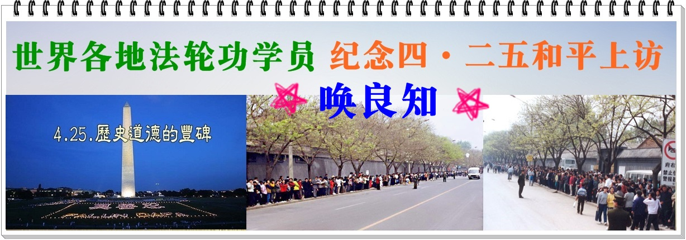

<h3>请收藏网址(新闻视频)  https://bit.ly/3ezRQKo 随时连上最新即时IP</h3>
 

<h3><b>中国禁闻 点击视频 https://bit.ly/2VIs51L </h3></b>
 

 
<h3>看更多真相 https://bit.ly/2RQM1hX </h3>

 
 
<h4>网页若出现〝你的连现不是私人连线″，点→进阶，再点→继续前往...，就可以看到视频了。 </h4> 

<h1><b><a href="https://github.com/mingop/faaap/blob/master/forfor.md">● 红潮即将倾覆  天之将明 ● </a></b></h1>

<table>

<!--<tr>
 <td>
 <a href="https://git.io/pamja">如何 “ 三退保命 ”</a>，<b>连上面→免翻视频 IP http://61.228.179.169/300  </b> →点 【三退大潮】--为什么要退党？ 可留言三退或用翻墙软件自己办理三退</td>-->
 
</tr> 

<tr>
 <td> <h3 align="center">➤ 退党、退团、退队（三退）方法 ( 可使用真名、化名、小名退 )</h3>
 
 <a href="https://git.io/pamja"> 如何 “ 三退保命 ”</a>，请点击翻牆网站  https://bit.ly/3asSXIA  下载 { 翻牆软件 }→找 { 大紀元網站 }  ( http://www.dajiyuan.com ) 三退</td>
</tr>
 </table> 

<a name=list><b>目录</b>
<table>
 
<tr>
<td width=900>
<a href="#003">➤ 费城法轮功学员纪念四·二五上访二十周年（图）</a></td></tr>  
  
  <tr>
<td width=900>
<a href="#002">➤ 韩国学员召开新闻发布会　纪念四·二五20周年（图）</a></td></tr> 
 
  <tr>
<td width=900>
<a href="#001">➤ 香港学员集会游行纪念四·二五（洪扬真善忍 反对中共迫害）</a></td></tr> 
 
 <tr>
<td width=900>
<a href="#00">➤ 乱世中的中流砥柱（写在“四·二五”二十周年之际）</a></td></tr> 
 
<tr>
<td width=900>
<a href="#0">➤ 纽约学员中领馆前纪念四·二五</a></td></tr> 
 
<tr>
<td width=900>
<a href="#1">➤ 纽约盛大游行纪念四·二五 民众感佩</a></td></tr>
 
<tr><td width=900>
 <a href="#2">➤ 台北千人集会炼功纪念四·二五（图）</a></td></tr>

<tr><td width=900>
 <a href="#3">➤ 新加坡学员纪念4·25和平上访20周年
</a></td></tr>

<tr><td width=900>
➤ 群体灭绝罪、反人类罪、酷刑罪在中国还在进行的罪行 https://git.io/ssbbaaa 
</td></tr>

<tr><td width=900>
 <a href="#4">➤ 多伦多学员纪念四·二五　政要到场支持(图)
</a></td></tr>

<tr><td width=900>
 <a href="#5">➤ 承接平和力量 传播真相传递希望
</a></td></tr>

<tr><td width=900>
 <a href="#6">➤ 中领馆前反迫害　马来西亚学员纪念四·二五
</a></td></tr>

<tr><td width=900>
 <a href="#7">➤ 西班牙法轮功学员呼吁制止迫害、法办元凶（图）
</a></td></tr>

<tr><td width=900>
➤ 迫害法轮功是死路 明白真相是生路 https://git.io/tr 
</td></tr>

<tr><td width=900>
 <a href="#8">➤ 芝加哥学员纪念四·二五和平上访二十周年
</a></td></tr>

<tr><td width=900>
 <a href="#9">➤ 澳门法轮功学员集会　纪念四·二五和平上访（图）
</a></td></tr>

<tr><td width=900>
 <a href="#10">➤ 纪念四·二五　日本法轮功学员举办集会游行（图）
</a></td></tr>

<tr><td width=900>
 <a href="#11">➤ 纪念四·二五　南澳法轮功学员市中心传真相（图）
</a></td></tr>

<tr><td width=900>
 ➤ 迫害大法弟子遭恶报   https://git.io/Eph
</a></td></tr>

<tr><td width=900>
 <a href="#12">➤ 墨尔本西人新学员：“四·二五”展现勇气激励人心（图）
</a></td></tr>

<tr><td width=900>
 <a href="#13">➤ 旧金山纪念四·二五　民众钦佩法轮功（图）
</a></td></tr>

<tr><td width=900>
 <a href="#14">➤ 迫害难维系　四二五精神永恒
</a></td></tr>

<tr><td width=900>
 <a href="#15">➤ 洛杉矶学员中领馆前集会纪念四·二五
</a></td></tr>

<tr><td width=900>
 <a href="#16">➤ 纪念四·二五　瑞士法轮功学员传真相（图）
</a></td></tr>

<tr><td width=900>
 <a href="#17">➤ 纪念四·二五和平上访　新西兰法轮功学员传真相（图）
</a></td></tr>

<tr><td width=900>
 <a href="#18">➤ 纪念四·二五　爱尔兰学员中使馆外集体炼功（图）
</a></td></tr>

<tr><td width=900>
➤ 18年前天安门那场大戏 为“秘密群体灭绝”开道 https://git.io/ssss2
</td></tr>

<tr><td width=900>
 <a href="#19">➤ 西雅图法轮功学员纪念四·二五和平上访（图）
</a></td></tr>

<tr><td width=900>
 <a href="#20">➤ 丹麦学员纪念四·二五和平反迫害二十周年（图）
</a></td></tr>

<tr><td width=900>
 <a href="#21">➤ 旧金山学员中领馆前纪念四·二五（图）
</a></td></tr>

<tr><td width=900>
 <a href="#22">➤ 堪培拉法轮功学员烛光夜悼 纪念四·二五（图）
</a></td></tr>

<tr><td width=900>
 <a href="#23">➤ 渥太华学员中使馆前集会纪念四·二五（图）
</a></td></tr>

<tr><td width=900>
 <a href="#24">➤ 正信唤醒良知　秉承四·二五精神（悉尼法轮功学员举办纪念四二五和平上访二十周年活动）
</a></td></tr>

<tr><td width=900>
➤ 他们的改变来自法轮大法 https://git.io/dadakk
</a></td></tr>

<tr><td width=900>
 <a href="#25">➤ 纪念四·二五　多伦多学员中领馆前烛光悼念（图）
</a></td></tr>

<tr><td width=900>
 <a href="#26">➤ 纪念四·二五　德国五城市学员中领馆前谴责迫害（图）
</a></td></tr>

<tr><td width=900>
 <a href="#27">➤ 巴黎学员纪念四·二五　传播法轮功真相（图）
</a></td></tr>

<tr><td width=900>
 <a href="#28">➤ 四·二五二十周年　达拉斯法轮功学员讲真相（图）
</a></td></tr>

<tr><td width=900>
 <a href="#29">➤ 荷兰学员纪念四·二五和平上访二十周年（图）
</a></td></tr>

<tr><td width=900>
 <a href="#30">➤ 纪念四·二五　英国学员中使馆前抗议迫害（图）
</a></td></tr>

<tr><td width=900>
 <a href="#31">➤ 瑞典学员纪念四·二五　中共干扰再次失败（图）
</a></td></tr>

<tr><td width=900>
 <a href="#32">➤ 墨尔本居民：迫害应立即停止（图）
</a></td></tr>

<tr><td width=900>
➤ 海外三退大潮 https://git.io/zbdodo
</a></td></tr>
</table>

<a href=#list><h4 align="right">回目錄</a></h4>
<a name=003><h2 align="center">费城法轮功学员纪念四·二五上访二十周年（图）</a></h2>

【明慧网二零一九年五月二日】二零一九年四月二十七日，美国大费城地区部分法轮功学员在位于美国国家历史公园的自由钟广场集会纪念“四·二五”和平上访二十周年。学员们祥和宁静的打坐炼功构成一道独特的风景线，吸引了来自世界各地的游客。

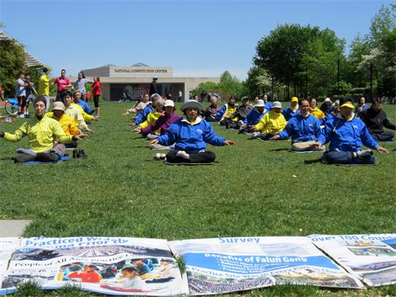

图1：2019年4月27日，部分大费城地区法轮功学员在自由钟附近草坪上以集体炼功纪念四·二五和平上访二十周年。

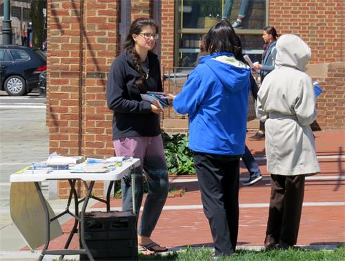

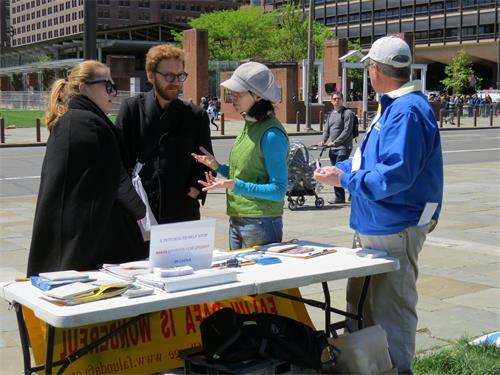

图2-3：附近居民与游客们驻足和学员交流，了解法轮功与在中国大陆发生的迫害

<b>当事人回顾四·二五经历</b> 

当年在北京清华大学读书的学员威廉·黄介绍说：“四月二十四日晚，我去食堂吃饭，碰到一位同学，得知有法轮功学员第二天要去国务院信访办上访，要求释放在天津被抓的学员。我感觉这个提议很好：天津学员和我们都同修一部大法，抓他们就等于抓我们；作为朋友，我们也有义务站出来说句公道话。而天津是直辖市，要想处理天津的事件，只能找它的上一级——国务院信访办上访。这一切都是合情合理合法的。”第二天早上，威廉与同学一起乘坐公共汽车到了国务院信访办的中南海附近，看到文津街和府右街的人行道上已经站了很多来上访的学员，机动车和自行车依然畅通，有一些警察在象征性的维持秩序。其实法轮功学员在哪里都是做好人，根本用不着警察维持秩序。学员在那里静静的站着，没有口号，没有标语，只是等候被信访办接待。后来有几位学员代表进去与工作人员会谈，提出了三点诉求：“立即释放天津被抓的法轮功学员；允许法轮大法书籍的正常出版；给学员一个合法的炼功环境”。

威廉回忆说：“学员们在中南海外静静的等待会谈结果。累了就换到后面坐一坐；饿了渴了就轮流去买点东西吃。现场秩序井然，充分体现了法轮功修炼者的风范。直到晚上八、九点钟的时候，听说信访办答应立即释放天津被非法抓捕的学员，在中南海上访的学员也就迅速离开了。我们临走的时候，把自己身边地上的垃圾都一并捡走，甚至包括警察的烟头。事件当天得以和平理性的解决。”

此次“四二五”法轮功学员和平大上访，震动了中国，也震惊了世界，把法轮功推向了世界舞台。法轮功学员在“四二五”事件中所展现的行为规范与道德风范，让世界看到了“中国的希望”。

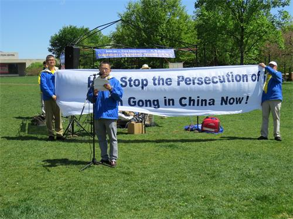

图4：清华大学毕业生黄先生回顾一九九九年四·二五和平上访的经历

<b>法轮功学员家属经历的迫害</b> 

在长达二十年的镇压中，不只是上亿修炼者经历了血雨腥风，他们的家人也倍受苦难。现在费城高中读书的谢冬觉讲述了他的经历，“当我四个月大时，母亲就被安徽合肥市警察诱骗绑架到洗脑班，并强行剥夺了婴儿享受母爱抚育的权利。我的父亲不堪压力，提出与母亲离婚。当母亲承受着这些巨大的心理痛苦时，洗脑班仍每日不停的向她灌输邪恶的谎言，她无法承受，终于精神崩溃。但恶警们仍继续对她施以药物和精神迫害。几个月后，当她终于被释放回家时，心力交瘁，虚弱到连自己的儿子都抱不动了。”

由于残酷迫害，谢冬觉小小年纪就饱尝凄苦。自他有记忆开始，便不断地亲眼目睹妈妈和外婆被抓，那些恶警野蛮粗暴的行径在他的心中留下了难以磨灭的烙印。当别的孩子在父母的呵护时，年幼的谢冬觉只能在孤独、寂寞、惊扰、害怕中度过。他与母亲一家的遭遇是中国大陆千百万法轮功学员遭中共迫害的一个缩影。

<b>过往游客的支持</b> 

通过介绍法轮功真相的横幅、展版等，以及与法轮功学员交谈，来著名景点参观自由钟的众多游客了解到了法轮大法的美好和中共对法轮功的残酷迫害。

来自加拿大的史蒂夫，看到学员们在集体炼功，禁不住上前观看。当了解到在中国发生的迫害，尤其是法轮功学员被中共活摘器官后，他十分震惊，毫不犹豫地签名表示支持。临走时，他表示会到网上阅读更多信息。

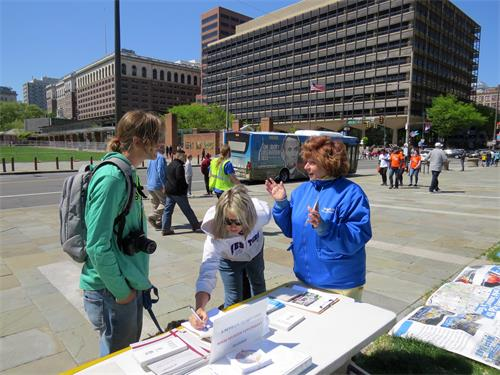

图5：来自加拿大的史蒂夫（Steve，左）在得知学员们因信仰所遭受的苦难后，非常震惊。

“我第一次看到那么多人坐在一起打坐！” 来自爱荷华州的佐伊（Zoe）惊叹地说，“在排队参观自由钟时，我一直在远远地看着他们，感到一种祥和、平安的气氛。我妈妈对我说，那些人看起来都很善良。他们有老人 、年轻人，还有一个可爱的小姑娘。为什么他们在这里打坐？”后来，当了解到这群善良人遭受了中共持续二十年的残酷迫害，今天聚集在这里是为了呼吁停止迫害时，她们表示，在今天还有这种事情在中国发生是不可思议的，应该立即停止。信仰自由是每个人的权利。佐伊说：“我回家就上网去了解更多的信息，看看我能为这些好人做点什么。”

康州的苏珊（Susan）在一周前听费城读书的女儿告诉她曾经在自由钟附近看到一批人在打坐，而且他们还有个名字叫做法轮大法。因此，苏珊这次来看女儿时就特意地到这里来转一转，结果真得碰到了学员们在炼功，心里十分高兴。她在签名反迫害后感谢学员们努力，“你们这样做很重要，要告诉更多人的这些事情。”

学员们安静的打坐也让不少人对炼功产生了兴趣。当费城居民阿利（Alley）与朋友们骑车经过时，停下来表示想学炼功法。在一位年轻学员的帮助下，他们学了约半小时的功法。阿利说他感到放松，内心很平静。他对在中国发生的迫害理解，希望这场悲剧早日结束。

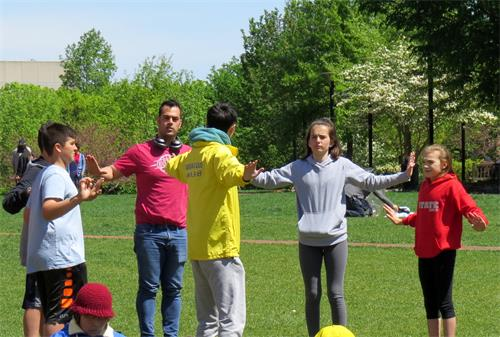

图6：附近居民阿利（Alley，穿红衣男士）与朋友们饶有兴趣地学功。

当天有三十多位中国游客，在与学员交谈后决定退出中共的党团队组织，不再与欺骗、镇压百姓的邪恶为伍。

<a href=#list><h4 align="right">回目錄</a></h4>
<a name=002><h2 align="center">韩国学员召开新闻发布会　纪念四·二五20周年（图）</a></h2>

【明慧网二零一九年四月三十日】二零一九年四月二十五日，韩国法轮功学员们在首尔中使馆、釜山和光州中领馆前同时举行新闻发布会，以纪念二十年前的今天，万名法轮功学员“四·二五”北京和平上访、争取信仰自由的历史性事件，揭露并抗议中共的迫害，呼吁各界共同解体中共，制止迫害。

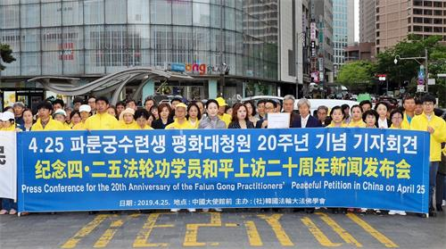

图1～2：二零一九年四月二十五日上午，法轮功修炼者在临近首尔中国使馆的明洞召开纪念“四·二五和平上访”二十周年新闻发布会。

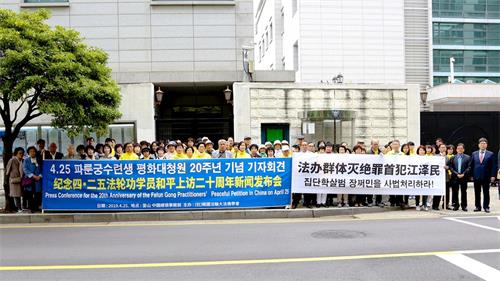

图3：二零一九年四月二十五日上午，法轮功修炼者在釜山中国领事馆前召开纪念“四·二五和平上访”二十周年新闻发布会。

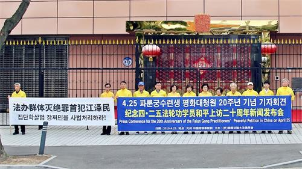

图4：二零一九年四月二十五日上午，法轮功修炼者在光州中国领事馆前召开纪念“四·二五”二十周年新闻发布会。

韩国法轮大法学会在新闻发布会上发表声明表示，中国大陆法轮功学员当时为了守护公民的基本信仰自由和人权，自发前往北京，以和平、理性的方式和平上访，展现出修炼者的高风亮节，为人类历史矗立起了一座不朽的道德丰碑。

<b>还原四‧二五事件的真相</b> 

法轮功，又称法轮大法，一九九二年五月十三日由李洪志先生在中国长春传出，其深深根植于中国传统文化，是以宇宙最高特性“真、善、忍”为修炼原则提高心性，并通过简单的五套炼功动作强身健体，达到身心健康的上乘佛家修炼功法。

在首尔的新闻发布会上，韩国法轮大法学会秘书长吴世烈回顾了当年“四‧二五”事件的经过。

吴世烈表示，法轮功一开始传出就因功效显著，在极短的时间内传遍全中国，修炼者与日俱增，时任中共党魁江泽民对此十分妒嫉，同时，同化“真善忍”的好人越来越多也引起了他的恐慌，于是江泽民开始搜罗证据以打压法轮功。

一九九八年下半年，部份全国人大离退休老干部对法轮功进行了详细调查、研究，得出“法轮功于国于民有百利而无一害”的结论，并于年底向中共党魁及政治局提交了调查报告。

尽管如此，法轮功的迅速传播，还是触动了以全面控制人的思想行为的中共独裁政权的敏感神经。一九九八年时任中共政法委书记的罗干命令公安系统在全国“秘密调查”，企图寻机取缔法轮功，然而调查结果均是“未发现有问题”。当时，各地基层公安部门在无任何证据的情况下，强行驱散炼功群众、私闯民宅、非法抄家、没收个人私有财产等侵犯人权事件。

同时，以罗干的连襟、中共御用学者何祚庥为首的一些人开始在各地不断发表诽谤法轮功的文章。一九九九年四月十一日，何祚休在天津教育学院办的《青少年博览》杂志上发表文章，无中生有诋毁法轮功。对此，部份天津市法轮功学员前往天津教育学院，要求修正不实内容，杂志社也承诺进行更正。但是，天津市公安局出动三百余名防暴警察，无故殴打澄清事实的法轮功学员，并逮捕四十五人。

四月二十五日，上万名法轮功修炼者前往国务院信访办（紧邻中南海）进行和平请愿，提出释放近期在天津等地被非法逮捕的法轮功学员的要求，当时没有任何口号和标语，请愿过程安静祥和。

时任国务院总理的朱镕基接见了学员代表，在双方的对话中，当局接受了学员代表提出的三点诉求：一，释放天津警察非法抓捕的法轮功学员；二，保障法轮功学员的合法炼功环境；三，允许法轮功书籍合法出版。

被逮捕的学员获释，参加上访的所有法轮功学员于当晚九时许各自平静散去。万余人停留的地方甚至没有留下一片纸屑，展示了他们维护正义良知的勇气和道德，获得世界各国媒体称赞。“四·二五”上访被称作“中国上访史上最理性平和、最圆满的上访”，也成为让法轮功走上世界舞台的重要事件。

而“四·二五”的和平解决，再次令急欲树权威的江泽民心生嫉妒。四月二十五日当晚，江泽民咆哮称要彻底“战胜法轮功”。他虽想迫害法轮功，却拿不出令人信服的证据， 就诬蔑“四·二五”是“围攻中南海”，进而不顾周围的反对，于当年六月十日成立了相当于纳粹盖世太保的“六一零办公室”，专门部署实施迫害法轮功，并于一九九九年七月二十日一意孤行地开始了对法轮功的惨绝人寰的迫害，给全中国人民带来了灾难 。

吴世烈呼吁，“现在必须立即终止江泽民和共产党在中国国内相互利用、迫害法轮功的不法行径，恢复法轮功的名誉，赔偿法轮功修炼者们蒙受的全部损失。同时，必须法律制裁迫害的主谋江泽民及其同伙，恢复中国社会二十年来沦丧的道德和正义。”

<b>通过四·二五上访　看出法轮功学员都是好人</b> 

曾于一九九九年四月二十五日参加北京上访的在韩朝鲜族法轮功学员玉先生参加了当天的首尔新闻发布会，他回顾表示，当时听说法轮功修炼者被冤枉，就想，“法轮功叫人修心向善，多好啊！信仰真、善、忍有什么错？一定是中央不了解真相，我得去北京说一句公道话”。

“当时到北京的法轮功学员非常多，互相都不认识，可是大家都自觉地把人行道和马路让出来，没有喧哗、没有口号，非常祥和。后来，听说事情得到妥善的解决，大家都静静地离开了。”

他说，过后，这件事情影响很大，各地方警察都知道。二零零零年十月的一天，玉先生因发放法轮功真相被绑架进沈阳龙山教养院洗脑班，该教养院“管教大队长”对他说，“我知道你们是好人。上万的人，都不需要人指挥，竟然没有人抽烟，离开时地上连个纸片都没有，我承认共产党做不到……”

<b>和平上访　只为争取修炼真、善、忍的自由</b> 

今年七十二岁的崔女士一九九四年走入法轮功修炼，她今天也来到了集会现场。当年“四‧二五”和平上访事件发生时，她正在前往北京的路上，她回忆道：“我们沈阳的一些同修听说天津那边抓了四十多名同修，认为（中共）不该抓修炼真、善、忍的好人，很多人一同去车站买票，准备去北京参加请愿，但在等火车的时候，听说被抓的人已经被释放，我们也就退票解散了。”

谈起当年的心情，她难过地表示，“觉得特别委屈和冤枉，只是想做好人，为什么会受到镇压？ 中国的宪法都明确地写着人有信仰自由 ，我们没有其它要求，只是要修炼的自由。”

她谈及，“有很多修炼者是因为身患肝癌、胃癌、肺癌等绝症，在医院没有治疗的希望，才开始修炼，并获得健康，可以说是死而复生。一般人都不该忘记他人的恩惠，作为修炼人，曾经拯救性命的大法背负着莫须有的罪名，我的命都是大法给的，我能做到袖手旁观吗？”

<b>“四‧二五”成典范　盼迫害早日结束</b> 

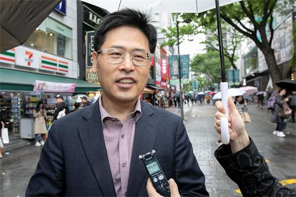

图5：韩国学员郑振铉参与了首尔的新闻发布会。

韩国法轮功学员郑振铉自二零零四年起修炼法轮功，至今已参加十余次四·二五新闻发布会，他说：“一九九九年的中国社会，在共产体制下居然能出现这样的请愿，用和平的方式解决问题，让人感到非常吃惊，很值得世人崇敬，具有划时代的意义。”

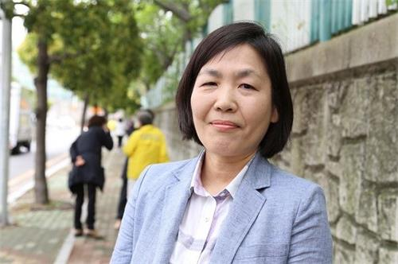

图6：韩国学员权恩淑参与了釜山的新闻发布会。

韩国学员权恩淑参加了当天釜山的新闻发布会，她表示，“我修炼之前，不明白生命的真正价值何在，经过修炼我发现，宇宙和万事万物，包括所有生命在内的本质、天性都带有真、善、忍，万物由此才得以存在，（大法）让我认识到了人生的意义和真理的价值。”

她对于法轮功学员目前还在大陆遭受迫害，非常痛心，并表示：“当时中国政府无视法轮功学员的和平请愿开始镇压，对此我感到非常遗憾”，“中国共产政权不仅在国内，还通过海外媒体歪曲了法轮功的真面目，蒙蔽了全世界的目光。我认为，能够证明歪曲事实的明确证据就是四·二五和平上访。”

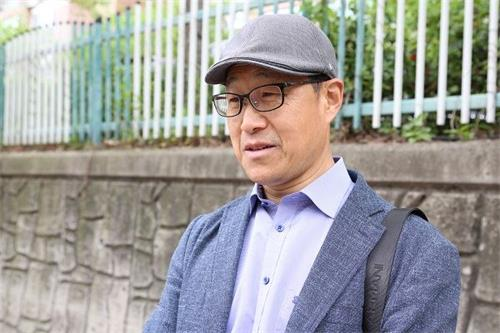

图7：韩国学员沈相信参与了釜山的新闻发布会。

大邱法轮功学员沈相信于二零零一年五月走入修炼，今天来到了釜山新闻发布会现场的沈先生说，当他明白了法轮功修炼的原理，按照修炼后，身体健康有了很大的改善，记忆力提高了，也戒掉了烟酒。全家人一起修炼后，亲身体验了法轮功的好处。

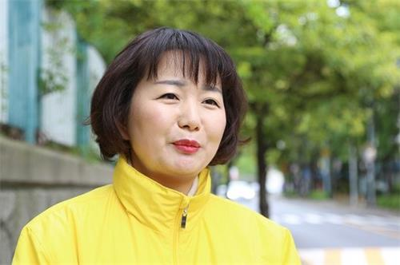

图8：韩国学员金顺玉参与了釜山的新闻发布会。

来自蔚山的韩国学员金顺玉说：“当时我虽然不在场，但一想到当时去上访的学员们是怎样的一个心情，心里就感动得直流眼泪。希望法轮功学员的愿望早日实现，迫害能够尽早结束。”

<a href=#list><h4 align="right">回目錄</a></h4>
<a name=001><h2 align="center">香港学员集会游行纪念四·二五</a></h2>

洪扬真善忍 反对中共迫害

【明慧网二零一九年四月二十九日】二零一九年四月二十七日，上千名香港及来自亚洲多个国家、地区的法轮功学员举行盛大的集会游行，纪念“四·二五”万人和平上访二十周年，声援三亿三千多万中国人退出中共党团队。多位政要与名人在集会发言，赞扬真、善、忍普世价值，与法轮功学员一起呼吁制止中共迫害，法办迫害元凶。

图1：法轮功学员在中环爱丁堡广场集会，纪念“四·二五”万人和平上访二十周年。

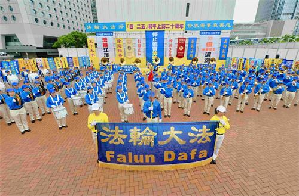

图2：天国乐团在香港纪念“四·二五”二十周年集会上奏乐。

<b>全球正气上扬反对迫害</b> 

纪念“四·二五”和平上访二十周年集会，早上十时在香港中环爱丁堡广场举行。香港法轮佛学会发言人简鸿章发言表示，随着真相广传，中共恶党遭到全球抵制，在中国大陆、在全世界以至香港展现末日疯狂，包括在香港强推被视作为二十三条立法铺垫的引渡恶法，以及近日施压港府非法遣返大批来港参加合法活动的外地法轮功学员等等。这些疯狂举动，将会促使越来越多的人觉醒。

简鸿章说：“全球正气上扬，一个结束邪恶迫害、尊崇正信信仰的世界新格局已经形成，解体中共邪恶迫害机制、结束迫害的日子越来越近了。”他呼吁各国政府及各界民众共同除恶扬善，加大力度制止中共的迫害，促成法办迫害元凶、和平解体共产组织并系统清理共产主义邪恶因素，让中国及全世界走向光明。

全球退出中共服务中心主席易蓉透过电话发言，她表示已有超过三亿三千多万中华儿女退出中共党、团、队组织，“退党大潮正在唤醒中国人的道德良知与勇气，正在凝聚中华民族的浩然正气，开创中华民族光明美好的未来。”

<b>香港前立法议员到场声援</b> 

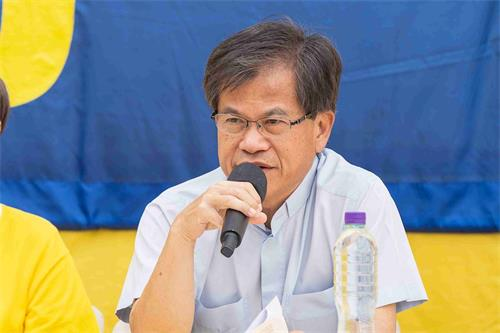

图3：香港前立法局议员冯智活牧师称赞法轮功学员面对长达二十年的迫害，始终保持善良。

香港前立法局议员冯智活牧师及前立法会议员梁国雄先后到场声援。冯智活牧师表示，中共邪恶政权已时日无多，岌岌可危，相信光明的日子不远了。他称赞法轮功学员面对长达二十年的迫害始终保持良善，是很好的典范。并强调真理必胜，尤其法轮功已在全球百多个国家地区盛行，更有超过三亿人退出中共组织，相信不需要很长时间，光明终会战胜黑暗。

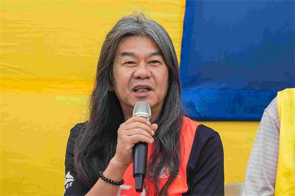

图4：香港前立法会议员梁国雄支持法轮功学员反迫害。

梁国雄批评港府配合中共在香港打压法轮功，又指近期港府强推的引渡条例修订将影响宗教及信仰团体，希望大家都发声反对。

<b>香港政要赞扬真善忍精神</b> 

多位香港政要也透过录像发言。公民党主席梁家杰强调宗教自由是最基本的人权保障，要求中共停止迫害法轮功。他支持法轮功学员坚持反迫害，“因为在古今中外历史，没有一个迫害人民、不尊重自由人权的政权可以千秋万世。只要我们有所坚持，不忘初衷，我相信会有守得云开见月明的一天。”

民主党主席、立法会议员胡志伟表示，法轮功发扬真、善、忍精神，同时能强身健体，“以和平的方式，推动讲真话、行善，要有忍让的美德，其实这些正正都是我们整个中国、中华文化里面很核心的价值。”

他说：“一个国家应该推动人民讲真话、向善、能互相包容，这也是中国未来必须要走向的一个国度。不应让人民生活在恐惧当中，不应让人民习惯讲大话，不应让人民处身在一个要互相斗争的社会。”他要求大陆当局停止打压法轮功，停止活摘器官罪行。

<b>中共倒行逆施遭人民唾弃</b> 

对于目前已有超过三亿三千万中国人退出中共党团队，胡志伟认为，当一个政党不断倒行逆施，不断打压人民，便会遭到人民的唾弃，“退出共产党的行为和做法，正好也都反映了人民越来越认清楚共产党的邪恶本质和它的真面貌。”

立法会议员梁耀忠称赞法轮功学员在过去二十年面对中共的打压毫不畏缩，过程中令世界各国明白中共迫害的真相。“我希望大家继续支持法轮功成员不断抗争，多谢法轮功朋友在世界各地宣扬，讲出中共政权的腐败。”

梁耀忠说：“由于中共政权管制下人民民主、自由、法治、人权受到很大打压，所以很多有志之士，他们本来担任中共政权下各政府组织或党的职务，也选择退出，估计已有三亿三千万人退出中共党团队，这反映中共政权的管治被人民唾弃。”

<b>前港府高官促制止活摘器官</b> 

前港府档案处处长朱福强烈谴责中共镇压迫害法轮功，他称赞法轮功学员秉持真、善、忍精神。他强调应将中共活摘器官的元凶绳之以法，“那真是恐怖主义、恐怖行为，谴责都不足够，应该将其绳之以法，用法律途径解决这些问题。”

追查迫害法轮功国际组织主席汪志远也透过录音发言表示，调查结果显示，中共大量活摘法轮功学员器官的国家犯罪还在继续，他呼吁世界各国全面追查和惩治中共的反人类罪恶。

<b>大陆知名人士：迫害法轮功是反人类罪</b> 

多位大陆知名人士透过录音发言，支持法轮功学员反迫害。前赵紫阳政治秘书鲍彤说：“江泽民迫害法轮功，这是一个罪行。法轮功维护自己的权利，是正当的，是合法的，是应该受到支持。法轮功二十年来，法轮功坚持维护自己的权利，这是很勇敢的。我声援法轮功要求维护自己合法权利的。”

安徽前检察官沈良庆表示，中共对法轮功的迫害完全是违法的，仅仅因为法轮功群体规模比较大，信众多，让中共当局感到恐惧。它是不容许有任何民间组织和民间信仰存在。“中共对法轮功这样一个特定群体的打压，它已经构成了群体灭绝罪、反人类罪。”

<b>千人壮观游行震撼大陆游客</b> 

集会中午结束后，下午二时，约一千二百人的游行队伍在天国乐团领头下，由北角英皇道游乐场出发，途经铜锣湾、湾仔及中环，前往终点中联办，沿途吸引许多香港民众及大陆游客观看。游行经过繁忙的闹市后，傍晚下起暴雨，逾千人继续走毕全程。

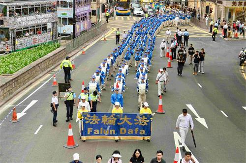

图5：在天国乐团领头下，游行队伍在港岛市区行进。

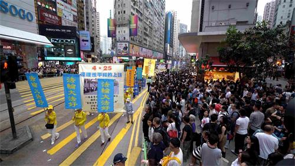

图6：纪念“四·二五”二十周年的反迫害游行，沿途吸引许多民众观看。

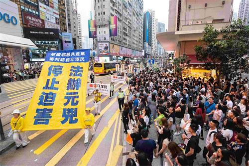

图7：游行队伍呼吁停止迫害，法办元凶。

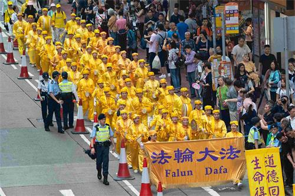

图8：腰鼓队在港岛区闹市行进。

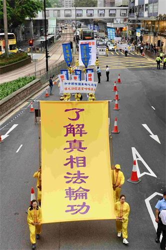

图9：游行队伍展示大型幡旗，呼吁世人了解法轮功真相。

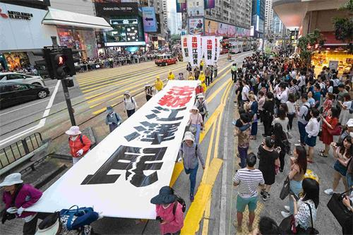

图10：法轮功学员要求法办迫害元凶江泽民。

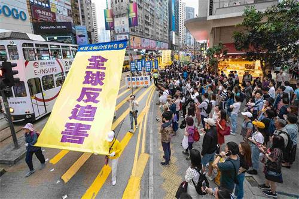

图11：游行队伍展示大型幡旗，呼吁全球反迫害。

游行分为“法轮大法洪传世界”、“和平理性反迫害”、“天灭中共 三退是福”、“弃恶扬善 清除迫害”等六大方阵。大型幡旗气势雄伟，各式横幅幡旗色彩鲜明，带出善恶必报、法办江泽民、法轮大法好等信息。队伍中还有炼功方阵、腰鼓队、旗鼓队等，沿路演示功法和奏乐，市民和中外游客纷纷拿出手机和相机拍下游行场面。

几位从广东茂名来的年轻女士第一次看到法轮功学员的游行，其中何小姐称赞游行队伍“很好啊，真的很好！”她表示支持法轮功学员本着真善忍的精神做好人，也觉得能看到游行很幸运。

从北京来的李女士也是第一次看到法轮功学员的游行，感到很震撼。她也认同真善忍精神，“发心向善就是好的。”

陆客促法办江泽民

一位年长先生西蒙（Simon）看着法轮功游行时感叹道：“中共会倒台的，一定要倒的。”他说，如今越来越多大陆人来到海外看到真相，认清中共的欺骗手段：“那么多人去外国留学，会看到外面的资讯，看到外面的世界是怎样，就知道它（中共）讲的那套就是欺骗。”

中共对法轮功的迫害已持续二十年，西蒙先生强调要将迫害法轮功的元凶绳之以法，“（迫害法轮功）是江泽民搞出来的，江泽民应该判坐监，判枪毙。”他谴责中共贪污腐败，利用活摘器官赚钱。

游行沿途，法轮功学员给大陆游客劝三退。当游行队伍进入金钟路段时，一个年约五十多岁、身材高大、看似来自上层社会的男士一边看着游行，一边对三退义工说：“共产党是最大的邪教，我不会给人收买的，我有自己的思想，好就是好，不好就是不好，法轮功的好我早就知道。”他爽快地接受了以“运景”的化名退党。

<a href=#list><h4 align="right">回目錄</a></h4>

<a name=00><h2 align="center">乱世中的中流砥柱</a></h2>

写在“四·二五”二十周年之际

【明慧网二零一九年四月二十四日】河南省三门峡黄河河段下遊河中心有一块巨石在河道中挺立，无论狂风暴雨、还是惊涛骇浪，屹立几千年而不倒，被人称为“砥柱”，中流砥柱一词由此而來，象征着中华民族的精神，也比喻能在动荡、险恶环境中刚强无畏、支撑危局、承担重任的超群人物或群体。公元638年，唐太宗李世民来到这里，写下了“仰临砥柱，北望龙门；茫茫禹迹，浩浩长春”的诗句，并命大臣魏征刻于砥柱之阴。

今年的四月二十五日是法轮功学员和平请愿二十周年的日子。二十年前，面对暴力和不公，法轮功学员没有听之任之、更没有退缩，而是秉承真善忍精神，和平、理智地讲出真相，维护基本人权、信仰和人类的尊严。在之后的二十年间，法轮功学员虽经受巨大的苦难，依然坚持不懈地将真善忍的光芒撒向人间，让世人在善恶之间做出正确的选择，为自己的未来开创美好和希望。

许多人称赞法轮功学员是乱世中的中流砥柱，面对强大的冲击，就象砥柱石一样，坚定地维护良知和信仰，屹立不倒。可以说，二十年来，法轮功学员用自己的行动，证实了真善忍。面对百余种酷刑、洗脑宣传、经济截断，甚至这个星球上前所未有的邪恶——活摘人体器官，他们都没有屈服、退却。

黄河上的艄工还流传着这样一个神话传说，一个老艄工为了能让在惊涛骇浪中的小船把握好方向，跳入湍急的黄河水中，喊道：“把好舵，朝我来！让船朝我这开，就不会触礁了。”在老艄工的引导下，小船化险为夷，船上的人们安然无恙，老艄工却消失在暴风骤雨中，化身为“中流砥柱”，从此以后，中流砥柱就成了峡谷中的航标，艄工们把砥柱石称为“朝我来”。

在迫害中，法轮功学员们最为难能可贵的是为了世人的安危，舍生忘死地、智慧地讲真相，传播传统的价值观，让人类摆脱共产邪灵的控制，重归精神的家园。
“四·二五”法轮功学员的和平上访行动在告诉世人，邪恶不会因为善良人的隐忍和无视而消亡，相反，沉默只能让邪恶更疯狂。近年来，国际社会上越来越多的国家也发现了中共对西方国家的渗透和无声影响，正改变着文明国家的基本价值和立国之本。正如澳洲学者汉密尔顿（Clive Hamilton）所言，中共对民主国家的主要威胁是，它一直在努力左右那些国家的精英舆论，试图让西方国家的决策者遵守中共的议程。

法轮功学员的不断讲真相，象激流中的航标，在凝聚着全球的正义力量。就在一周前的四月十八日，欧洲议会以压倒性多数票通过了一项谴责中共迫害人权的决议。决议声明，鉴于中国的人权状况越来越恶劣，欧洲议会谴责中共对宗教信仰团体的迫害，要求中共立即释放被非法关押的包括法轮功学员在內的受迫害的少数民族和信仰群体。

二零一九年三月十四日，欧洲议会压倒性通过决议，敦促欧盟与二十八个成员国，都各自制定类似美国的《全球马格尼茨基人权问责法》（The Global Magnitsky Human Rights Accountability Act），以期制裁迫害人权的外国政权政客。《全球马格尼茨基人权问责法》在美国、加拿大、欧洲与澳洲相继完成立法与生效，将震慑所有迫害参与者。

二零一六年六月，美国众议院通过了343号决议，呼吁终止在中国的强摘器官行径。

近日，在大纪元网站上声明退出中共党团队的中国民众已经突破三亿三千万。真相让人觉醒，也会让乱世中的中流砥柱更加强大。

<a href=#list><h4 align="right">回目錄</a></h4>

<a name=0><h2 align="center">纽约学员中领馆前纪念四·二五</a></h2>
【明慧网二零一九年四月二十四日】二零一九年四月二十日，夜幕低垂之时，纽约部份法轮功学员在纽约中领馆前，举行烛光夜悼活动，纪念“四二五”上万名法轮功学员和平上访二十周年，悼念因坚持真、善、忍信仰而被迫害致死的法轮功学员，同时呼吁国际社会共同解体中共，停止迫害。

 

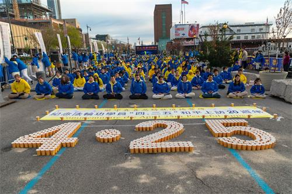

 

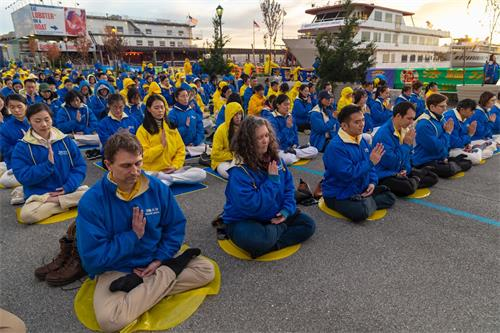

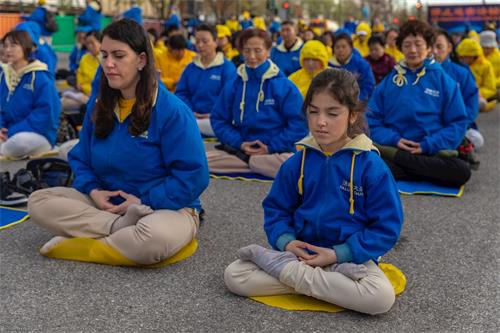

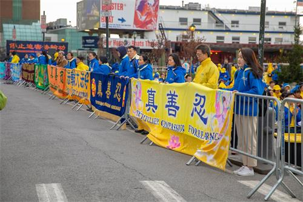

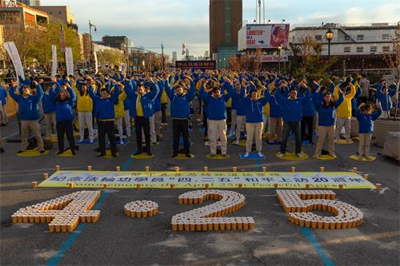

图1～5：二零一九年四月二十日傍晚，纽约部份法轮功学员在纽约中领馆前，举行烛光夜悼活动。当天下午六时许，法轮功学员开始集体炼功，场面庄严祥和。

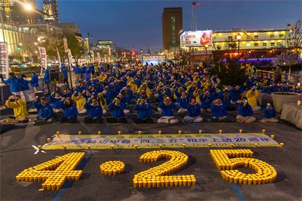

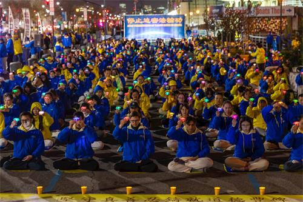

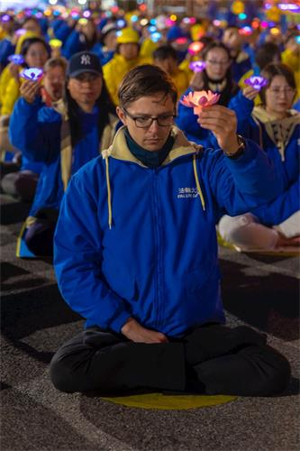

图6～8：华灯初上时，学员们手捧莲花灯，神情肃穆，默默哀悼被中共迫害致死的同修。

据明慧网报导，过去二十年中，通过突破重重封锁能够获悉的、有名有姓被迫害致死的法轮功学员有4296人。

在夜幕中，法轮功学员韩雨手举莲花灯，神情哀伤，她的父亲韩俊清于二零零四年五月四日被非法抓捕关押迫害三个月后撒手人寰，遗体在火化前，韩雨看到爸爸的脸上有许多伤痕，左眼底下的组织不见了，她的姑姑和她的叔叔在公安的严密监视下，还是把韩俊清衣服解开了，看到刀口一直开到肚子，他们用手压她爸爸的肚子，发现里面根本没有内脏，全是冰块……那天房山区上百个警察在旁边监视，并强行命令不准带相机、不准请记者，看完强行送去火葬场进行火化。

图9：当天活动中，部份法轮功学员面对街对面的中领馆，打出“法办江泽民”、“停止迫害法轮功”等抗议横幅；来自长春的法轮功学员，打出标语，要求中共当局立即释放目前被关押的长春法轮功学员李晶、穆君奎。

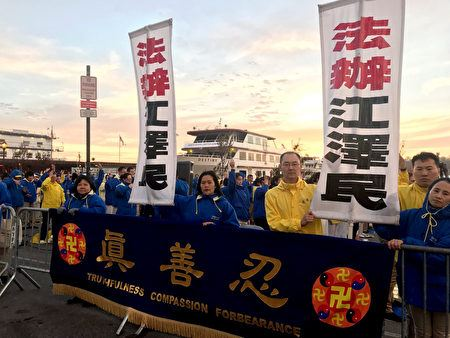

图10：来自山东的法轮功学员张袆（中间穿黄衣者）的母亲张爱丽，自去年十一月起被非法关押在看守所迄今，他要求中共立即无罪释放他的母亲。

<b>上访亲历者忆当年</b> 

当年曾参加“四·二五”上访的法轮功学员李殿琴表示，当时上万名法轮功学员，是抱着信任政府的诚意和澄清误解的心愿，自发地来到国务院和平理性、合法上访，没有喧哗没有吵闹声，更没有口号、标语，告诉政府法轮功对社会、对人民有百利而无一害，离开时他们连地上的垃圾都带走。她说当时她看到，一个女警察把手下警察都叫过来说：“你们往地上看看，这就是德。”
 

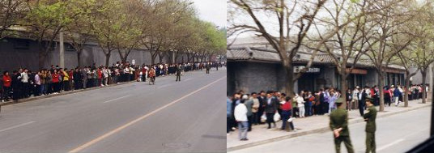

图11～12：当年“四二五”上访，站在北京府右街西侧便道上的上访的法轮功学员。

另一位当年参加“四·二五”和平上访的法轮功学员田天表示，当时上访的学员非常安静有序，还有人自发维持现场秩序，连附近的公共厕所里，都有同修在自愿地维护秩序和打扫现场卫生，这是修炼人发自内心的严格自律，以及不约而同所表现出来的对大法坚定维护的心。虽然迫害持续了二十年，但是中国大陆大法弟子对信仰始终坚定不移。

法轮功学员孔维京表示，整整十几个小时，无论是在府右街、文津街、西安门、北海还是长安街等，上万名法轮功学员和平地表达维护大法的心声，离去后，没有留下一张纸片，连执勤警察扔的烟头都给捡起来了，法轮功学员从大法“真善忍”中所修炼出来的非凡勇气和心性境界，铸就人类道德的丰碑。然而，江泽民以其卑劣至极的小人之心、妒嫉之心发动了空前残酷的迫害运动，把中华民族拖入到最黑暗的历史阶段。

<b>民众：这些人的抗议场面如此平静与平和</b> 

哈德逊河畔，不少民众被法轮功学员慈悲、感人的氛围所吸引。一位MTA的工作人员拿过法轮功的简介，并感动地说，“这些人的抗议场面如此平静与平和。”

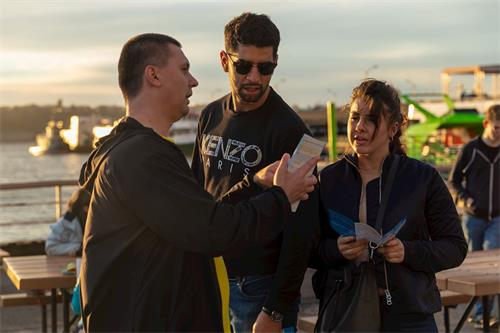

图13：路人正在了解真相

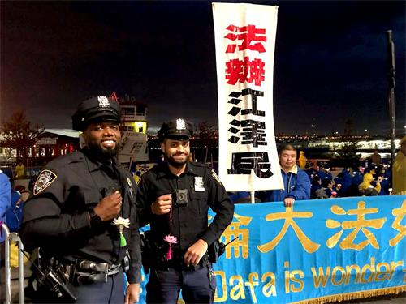

图14：执勤警察接过法轮功学员赠送的“法轮大法好”的小莲花，表示他们都知道法轮大法好，都知道共产党迫害法轮功。

一名在耶鲁大学就读的华人学生，看到了夜悼的情景，倾听法轮功学员讲述的真相，同意以“光明”为化名，退出曾经加入过的共青团。

<a href=#list><h4 align="right">回目錄</a></h4>
   

<a name=1><h2 align="center">纽约盛大游行纪念四·二五 民众感佩</a></h2>

【明慧网二零一九年四月二十二日】二零一九年四月二十日中午，纽约法拉盛，上千名法轮功学员举行了盛大的游行集会，纪念法轮功学员“四·二五”和平上访二十周年，并声援三亿三千多万中国人退出中共的党、团、队组织。

  

  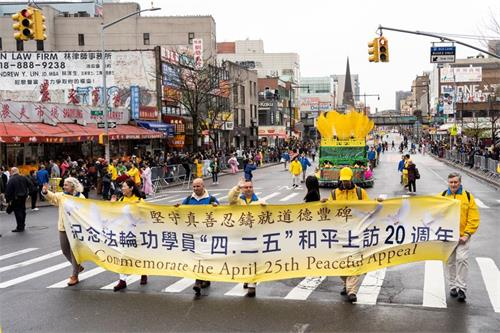

图1：上千名法轮功学员在纽约法拉盛举行盛大游行，纪念“四·二五”和平上访二十周年。

  
  

  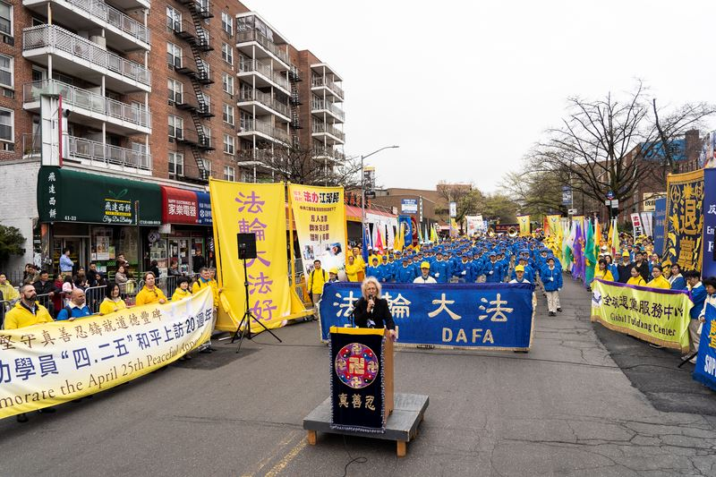

图2：法轮功学员在纽约法拉盛举行集会，纪念 “四·二五”和平上访二十周年

  
  当天早上一直下雨，在游行开始前一小时雨水戛然而止，天空放晴，人们涌上街头。缅街最热闹的街面上，法轮大法的旗帜迎风飘扬，学员们个个精神抖擞容光焕发。沿途观看的民众，为游行队伍的壮观所震撼，更为法轮功学员风雨二十载，勇气正信不变感到敬佩。有的当场流泪，对着记者的镜头说，“法轮大法好，这场迫害应该停止了。”

<b>游行队伍声势浩大</b> 
  
  

  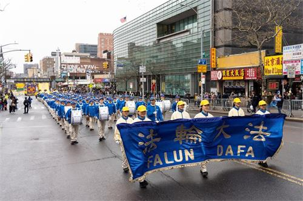

  
  

  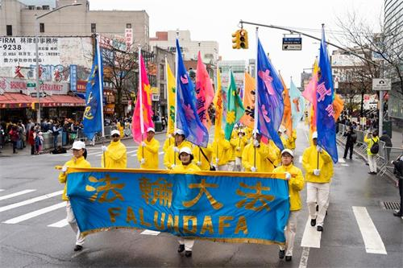

  
  

  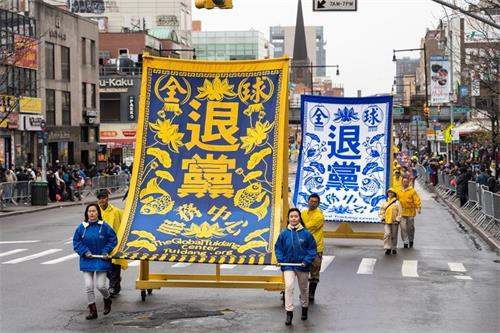

  
  

  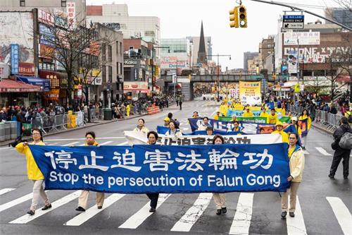

  
   

  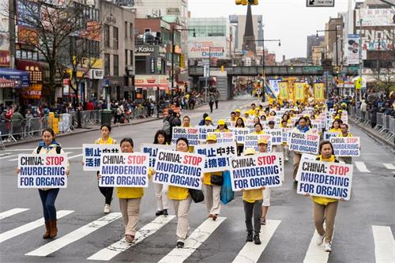

  
  

  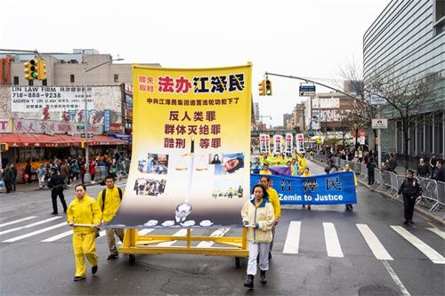

  
  

  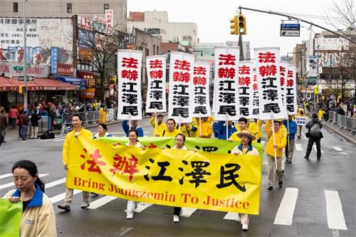

  
   

  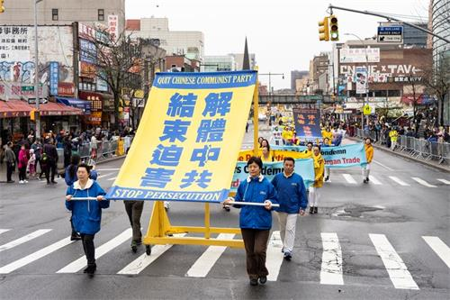

   
图3～10：法轮功学员在纽约法拉盛举行大游行，纪念 “四·二五”和平上访二十周年。

  

  游行队伍分成三大方阵：“法轮大法好”、“停止迫害法轮功”以及“声援三亿多勇士退出中共”。 

法拉盛中心最繁华的缅街上，十二点准时，“天国乐团”奏响了游行的号角，演奏了《法轮大法好》、《神圣的歌》、《法鼓法号震十方》等多首经典曲目。紧随其后的是中英文《转法轮》书模、巨型法轮图形、花车、法轮功功法演示队、舞龙队、舞狮队、小花船队、腰鼓队、旗阵、中英文横幅队……传递着“法轮大法好”、“世界需要真善忍”的福音以及反迫害、解体中共的真相。 

法轮功学员打出“坚守真善忍铸就道德丰碑”、“法轮功反迫害二十周年”、“解体中共结束迫害”、“三退顺天神灵护，九评进户福德随”等横幅。街道两旁的民众、包括维安的警察，纷纷接过法轮功学员派发的“法轮大法好”小莲花。

游行队伍所到之处，街上的民众目不转睛地观看，被法轮功学员身上散发的浩然正气和慈悲的能量场所笼罩和感染，很多人用手机拍照摄像。并且踊跃发声，支持法轮功。

<b>民众：我们支持真善忍　支持正义</b> 

原来在中国官方大媒体工作的刘女士，是大陆共产党家庭的红二代。她表示，她原来对法轮功不太了解，但是在二零零八年法拉盛图书馆门前亲眼看到共产党派出的一伙人打法轮功学员，而法轮功学员并没有还手，她说，相比之下，谁是善良的谁是邪恶的，一目了然。

看到这么多法轮功学员出来游行，她感到很震撼，“前几年法拉盛的五毛很多，但是今天你看，支持的人、看游行的人多很多了。其实中国人心里都有一杆秤，就是在国内被共产党统治怕的，有一种恐惧的心理。我没想到法轮功这么多人，我感到很震撼。我们支持真善忍，我们支持正义！”

看到街道一侧手里举着邪党血旗的几个人，她非常气愤。因为她有时候给政府做翻译，知道这些人的底细。“他们很多都是以政治庇护申请留在美国的，现在却替共产党干事；还有一些是五毛，共产党的代理人，他们都是邪恶的坏人！美国原来在奥巴马、希拉里治下就是太左了，对这些人太宽容了，现在川普正在拨乱反正。快让FBI来查查这些人的底细，一查一个准，把他们遣送回国，让他们到中国举红旗去！”

在山东媒体工作的刘先生从外州来，第一次看到法轮功的游行，一直用手机录像。“我很激动！这是国内看不到的。我支持善良的人，因为法轮功信仰真善忍，我一直支持他们。”

<b>民众落泪：法轮功一定是最好的</b> 

西语裔民众埃利亚娜·萨希克斯（Eliana Sasics）对着新唐人电视台的镜头，流着眼泪说，“我希望全球的民众都能听到（法轮功）的声音，这是很重要的。迫害不应该在世界上发生，不应该在中国发生。对人权的虐待持续了这么多年，我们在美国有平静的生活，但是在中国发生着残忍的迫害。因为法轮功学员受到迫害，我的心很痛。”

第一次看游行的李女士声音哽咽地说，“对于中共迫害法轮功学员，我很难受。我看着这队伍都想哭了，法轮功学员这么长时间还能坚持反迫害，很感谢，很震撼。”她又说法轮功是最好的，“法轮功受迫害这么长时间，现在还这么多人在学，而且还越来越壮大，说明（法轮功）一定是最好的。

  
   

  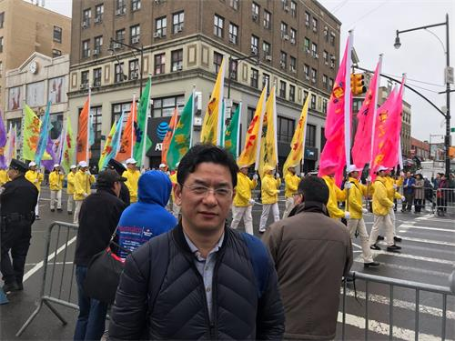

   
图11：李先生说，“法轮功被中共迫害，他们很不容易，我同情法轮功。”

  

  
  李比尔（Bill）先生说，自己因在大陆从事民主运动，被国安“请喝茶”。他说，法轮功学员在中国被迫害，他们很不容易。他同情法轮功，“共产党宣传的东西我们都不相信”，“如果中国信仰自由，谁愿意背井离乡呢？”

  
   

  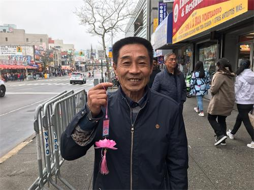

   
图12：陈先生说，他曾亲眼目睹了自己修炼法轮功的同事所遭受的迫害。”

  

  
  曾经在大陆“无锡造船厂”工作的陈先生眼睛湿润地说，“今年看了好激动，哭了，（他们）把法轮功的正气拿出来了。”他又说，当年无锡造船厂有几十人炼法轮功，他亲眼目睹了自己的同事所遭受的迫害，“有一个领导被打残了，他们把他关进监狱，后半生只能爬着走。还有的明明是好好的人被他们（中共）弄得呆呆傻傻的，不正常了。不让人说法轮功好，说好就打……单位的人都知道，都知道法轮功好，他们都偷偷地炼。现在的老百姓都不入党。”“他们（中共）为什么把法轮功（学员）迫害成这样？没有道理的事情。在这里我可以讲这些发生的事实，在大陆可不能讲，共产党抓你、整死你。”“共产党不下台，它就要迫害这些好人。” 

<b>民众：法轮功创造了一个奇迹</b> 

高女士在路边用一只手举着手机拍游行，一只手竖起大拇指，嘴里赞叹：“太壮观了！太震撼了！” 

观众陈先生说，他们（法轮功）很棒，体现中华民族传统。 

刚从中国来到美国的王清营说，第一次看到法轮功的游行和集会，“从来没有见过有这么多中国人反对共产党的。共产党是魔鬼，人类历史最邪恶的组织。古今中外没有一个组织干尽这么多坏事，屠杀成千上万的中国人。”他又说，“真正在海外形成规模的唯有法轮功，法轮功创造了一个奇迹，我最佩服！”

<b>“四·二五”和平上访　铸就道德丰碑</b> 

一九九二年五月法轮功传出后，神奇的祛病健身效果、注重道德和心性的修炼，使其在很短的时间内以“人传人、心传心”的方式，迅速传遍中华大地，到一九九九年已有上亿中国人在学炼。 

一九九九年四月，前政法委书记罗干的连襟、“科痞”何祚庥在杂志上发表了诬蔑法轮功的文章，天津的一些法轮功学员从四月十八日开始，前往天津教育学院向发表污蔑文章的杂志编辑部交涉和反映实情。但天津当局出动武警殴打法轮功学员，并抓捕了四十五人。为此，法轮功学员在四月二十五日到中南海附近（府右街）的国务院信访办公室和平上访，要求合法、宽松的修炼环境。 

上访的法轮功学员没有口号，没有标语，没有过激的行为，出于对政府的信任，平和理性去反映情况。当时的国务院总理朱镕基见状后，安排国务院信访局的官员与法轮功学员代表展开了对话。四月二十五日晚上，在获悉被抓的法轮功学员获释后，上访的法轮功学员迅速地离去。他们以修炼出来的高尚道德准则，以及为别人着想的心要求自己，他们离去时，地上干干净净，一片碎纸片也没有留下，连警察丢弃的烟头都捡起来带走。

“四·二五”和平上访，开创了中国政府首次和民众和平对话、解决分歧的先河。同时，法轮功学员为捍卫信仰所展现出的非凡道德勇气，铸就了一座永恒的道德丰碑。
  
 
  
  <a href=#list><h4 align="right">回目錄</a></h4>
  
  

<a name=2><h2 align="center">台北千人集会炼功纪念四·二五（图）</a></h2>
【明慧网二零一九年四月二十二日】（明慧记者郑语焉、黄宇生、沈容台湾台北报道）二零一九年四月二十一日，北台湾地区一千二百名法轮功学员，在台北市政府前的市民广场举行记者会和集体炼功，纪念“四·二五”法轮功学员和平上访二十周年，揭露中共残酷迫害的恶行及其邪恶本质，呼吁社会各界及联合国等国际组织持续关注中共对人权的迫害，制止迫害。

  
  

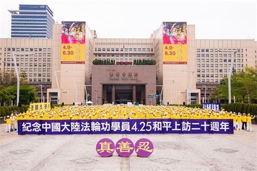

  
  

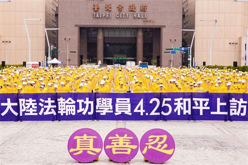

  
  

  
  

  
   

图1～4：逾千名法轮功学员于台北市民广场集会炼功，纪念“四·二五”上访二十周年。

  
  多位议员到场支持当天的活动，严厉谴责中共暴行，呼吁世人、尤其是生活在自由地区的台湾人认清中共谎言，千万不要对中共存有任何幻想。他们并对法轮功学员多年来坚毅卓绝的和平理性讲真相的风范，表达钦佩与敬意。

  
  

  
   

图5：台湾法轮大法学会理事长张锦华呼吁世人认清共产专政的邪恶本质。

  
  集会上，台湾法轮大法学会理事长张锦华表示，四·二五事件在世人眼前，所展现出的理性平和与道德文明，受到国内外一致肯定和赞扬。但不幸的是，中共党𣁽江泽民竟将和平上访歪曲造谣为“围攻中南海”，并发动党政暴力机器，滥权抓捕、酷刑迫害，无法无天的程度，国际社会已通过多项宣言或法案严辞谴责。

张锦华沉痛地说，二十年来，成千上万的法轮功学员失去亲人、健康、家庭、甚至生命，但依旧坚守真、善、忍的精神，理性、和平、勇敢地揭露迫害，呼吁世人认清共产专政的邪恶本质。她强调：“中共不等于中国，反共不等于反中，让我们持续的坚守慈悲良善，不断的揭露中共谎言，告诉世人真相。”

<b>市议员张茂楠：法轮功的精神值得大家实践</b> 
  
   

  
   

图6：台北市议员张茂楠强烈谴责中共暴行，并对法轮功学员表达敬意。

  
  台北市议员张茂楠首先对法轮功学员的勇气表达肯定与感谢，他说：“我与法轮功学员心中都流着正气与坚持的血，二十年来如果没有正气、坚持，我们没有办法走到今天。”张茂楠表示法轮功学员充满正气，没有违反任何国家的法令，却受到酷刑和虐杀，甚至被活摘器官。他对中共违反人权民主的作法，企图利用暴力政权无所不用其极的打压，予以强烈谴责，并称中共是“最烂的政权”。

张茂楠认为法轮功的精神值得大家去实践，在全球各地都不容许中共利用暴政企图消灭、抹黑法轮功。他并对法轮功表达十二万分的敬意，承诺明年、后年、每一年都会用行动来支持，和法轮功学员一起坚持往前走。

<b>市议员洪健益：无惧暴政　一定和法轮功站在一起</b> 
  
  

  
   

图7：台北市议员洪健益谴责中共罪行，呼吁国际关注中国人权问题。

  
  担任民意代表十三年的台北市议员洪健益表示，法轮功遭受迫害已二十年，今年是他第十二年参加制止迫害的集会活动。他谈到，中共默许活摘器官的存在，完完全全漠视人权，相较之下，台湾的民主、人权、自由非常可贵。法轮功学员之所以站在这里，无非是坚持正确的理念和信仰，让来自全世界的游客，特别是大陆旅客，认清中共根本毫无人权可言。

洪健益呼吁，我们要让全世界都知道中共漠视人权，甚至活摘器官残害生命。他表示自己对中共暴政无所畏惧，一定和法轮功学员站在一起！也希望更多朋友能站出来支持法轮功，共同谴责江泽民、谴责中共。

<b>新竹县议员余筱菁：千万不要对中共存有任何幻想</b> 
  
   

  
   

图8：新竹县议员余筱菁远道而来声援，呼吁勿对中共抱存任何幻想。

  
  新竹县议员余筱菁远赴而来，她说：“二十年前的和平上访，换来的却是中共大规模抓捕法轮功学员，使非常多的家庭失散、非常多的孩子没有家。”她呼吁：“在台湾享受自由民主空气的人们，千万不要对中共存有任何幻想。”

余筱菁表示法轮功学员一直在台湾和全世界扮演安定社会力量的角色，她要献上最高敬意：“法轮功学员在中共压迫之下，持续以和平、非暴力的方式说出真相，体现出慈悲与宽容。我希望受难者早日得救，也希望信仰自由的那一天早点来临。在台湾这片民主自由的土地上，我们会永远守护大家。”

<b>大陆游客明真相</b> 
  
  

  
   

  
   

  
  

 
  

 
  

 
 

 
  

 
  

  

图9～17：大陆游客为法轮功学员集会场景所吸引，不少人拍照摄影。

 
 法轮功学员集会炼功的场面庄严殊胜又祥和，深深吸引过路行人和旅客的目光，有的驻足、有的举起手机拍照，也有的在展板前细阅真相。一团接着一团的中国游客，有的打从国父纪念馆景点出来，经过市民广场走向距离不远的台北101大楼景点，有的则是从101大楼往国父纪念馆方向而来，看到集会场景惊呼：“法轮功！”不少人感叹这里真自由。许多人拿起相机拍摄或录像，即使队伍中有人嚷嚷着：不要拍、不要看；但也不乏明白真相的导游说：这是言论自由和集会自由的人权，在台湾是合法的。
 

 
  

 
 

 

图18～19：法轮功学员向游客讲真相。

 
 因受不明真相导游的箝制，一位五十来岁的女士把真相资料折叠成巴掌大小，递给法轮功学员并悄声说：“其实我们都明白真相，可惜这些资料我们没办法带走。”学员告诉她：“心里明白就好，这是最重要的。”围在身边的多位同伴用力点头，更有人竖起大拇指表示明白与赞同。

<b>议员助理：两岸大不同　台湾民主共产专制</b> 
 
 

 

图20：王牧民表示，法轮功在台湾能合法集会，见证台湾民主的珍贵。

 
 台北市议会议员助理王牧民，在集会现场一旁专注的照相。受访时表示，谈到对法轮功的认识，“是一种修炼团体，纯粹希望生活走向更正向的一个团体，但是因为中共不喜欢人民聚集在一起，以至于法轮功遭受很严重的迫害，甚至还被活摘器官的问题。”他进一步补充，“因为修炼法轮功，会让身体更健康，所以，成为中共摘取健康的最佳对像。”

同一种信仰，在海峡两岸被天壤地别的不同对待。对此，王牧民表示，“他认为台湾是一个民主自由的国家，这是和对岸共产专制制度最大的不同。”王牧民认为，这么多人在一起集会的画面，在中国大陆是不可能发生的，眼前的场景如果换成在中国，一定一群公安就冲出来了。“光是可以享有自由集会的这个制度，就可以见证台湾民主自由最美好、也是最可贵的地方。”

<b>西人游客：静坐画面祥和　充满正的能量</b> 
 
 

 

图21：史达吉·格迪克（Stage Geadink）和托马斯·范·霍尔德（Thomas Van Holder）来台旅游，第一次听闻法轮功的真相。

 史达吉·格迪克（Stage Geadink）和托马斯·范·霍尔德（Thomas Van Holder）两位外籍青年，经过集会的场合，不但拿起相机拍摄，更主动向在场学员询问集会诉求。他们表示，第一次来到台湾旅旅游，也是第一次听闻法轮功这个功法。他们后来明白，法轮功在台湾可以自由学炼；而在中国，却因为人多遭到中共的打压和迫害。他们表示：看到一群学员静坐的画面，他们感到法轮功是“祥和（Peaceful）”、“正的能量（Energy）”的功法。

<b>陆生：尊重信仰自由</b> 

在台湾知名大学修习资工相关课程的陆生曹同学（化名），和同学行经集会场合，并拿起相机拍摄眼前的画面。他表示，他母亲也修炼过法轮功，记忆中，因为修炼，一些反映在身上的不适，如感冒常不药而愈。

他本人没有修炼法轮功，但是认为信仰是个人意愿，他选择尊重。但是对于法轮功为何在大陆被迫害，曹同学的认识，仍停留在中共污蔑法轮功学员开膛剖肚，就会看到法轮等造谣的宣传。当知道法轮功书籍教人做“真、善、忍”，并且珍惜生命时，为此语塞而顾左右言他。看到眼前的画面，也许摄影留下的画面，让他震撼之余，也能重新思考真相为何。

<b>室内装潢工程师：得法后　人生转好运</b> 

板桥的吴光辉先生，在朋友推荐了十年，他才开始修炼法轮功，至今已八年。他表示，“修炼后，在思想上是突飞猛进。也因为学法，才知道社会就像一个大染缸，人人在其中被污染着；学法后才知道大染缸是同流合污，跳脱出来回头一看，才知道常人合法的事情，修炼人往往会用更高的理来对待。”

 

 

图22：吴光辉修炼法轮功，懂得用更高标准自我要求。

 
 吴光辉认为，人很渺小，以为自己可以主宰一切，其实，都是“神在安排，人为力量都有限。”得法前的他，工作不是很顺利，也不是常有工作。得法后，他按照李洪志师父的法理在生活实修，没想到人生跟着转运。一位长期包揽很多工程的朋友，便把关于室内设计装潢的工程全部交给吴光辉。“没想到说出那一句：以后工程都是我来做……”之后，生活条件变好，他深信：“那一念是善的，就会兑现。”为感谢大法的救度之恩，吴光辉运用自己的专长，负责相关证实大法、讲真相活动的前置作业，比如场地架设等设备。

士林区学员吴秉原，从小就对修炼感兴趣，也对灵修方面有所接触，但总觉过于粗浅，尤其没有人能把修炼讲得清楚，所以并不满意。二零零七年二月底，大学同学向他推荐法轮功，恭读完《转法轮》之后欲罢不能，又接着拜读各地讲法，因而得法修炼大法。

 

图23：吴秉原修炼大法后身心健康，也明白了真善忍对社会与世人的重要。

脾气和人际关系一向不错的吴秉原表示，尚未修炼之前，和一般年轻人一样，一听人说道德就不爱听，认为是冬烘唠叨，修炼大法之后，回头一看才知人类社会道德下滑得很厉害，黑浪滚滚，而自己内心也隐藏了很多不好的思想念头，没有修炼大法的话根本就体察不出来，因此对“世界需要真善忍”有深刻的认识，认为四·二五的纪念活动深具意义，他说更多人站出来让更多人明白真相，越多人心存真善忍，这个社会风气自然就导正过来，因此很荣幸参与这个活动。

<b>物理治疗师：修炼大法后，医病关系如亲友</b> 

新庄的杨琼宜看到同事老是抱着同一本书百看不厌，心生好奇，借来一阅之后深受触动，她说：“书中讲的道理，做人要非常正，要用善心对待旁人，行事作风反求诸己，深深触动了我。”二零零四年五月份，她走进大法修炼行列。

 

图24：物理治疗师杨琼宜修炼大法后，用真、善、忍标准要求自己，成为病人的朋友和讲心事的信任者。

担任物理治疗师的杨琼宜表示所照顾的对象大多是中风患者，需要很大的耐心，修炼前，尽量提醒自己但还是耐心度不够，有时病人没达到期望的标准，口气急了起来，无形中伤了患者的心。

得法后，时时刻刻把自己当作修炼人，凡事用真善忍的标准要求自己，善待对方，懂得观察病人的神色，讲出这句话、做出这个动作，对方是否承受的了。她一改往常一板一眼的严肃作风，怀抱善意用较轻松幽默的方式引导病人复健，医病关系变朋友，而病人也常会把她当成吐露心事的信任者。

杨琼宜表示只要人在台湾，她必定参加四·二五纪念活动，因为这是提醒世人，中共对善良人的迫害还在继续，并没有停止，它的邪恶本质未变，杨琼宜说：“我们希望藉由这个活动唤醒周遭的人们，甚至唤醒一些松懈的同修，所以觉得很有意义，也必定会来参加。”

 
   <a href=#list><h4 align="right">回目錄</a></h4>
   

  
  
  <a name=3><h2 align="center">新加坡学员纪念4·25和平上访20周年</a></h2>
  
  【明慧网二零一九年四月二十一日】二零一九年四月十五日，新加坡法轮功学员在芳林公园举办活动，纪念“四·二五”法轮功学员北京和平上访二十周年。

二十年前，一九九九年四月二十五日，在中国北京，一场震惊中外的和平上访，让国际社会意外的看到了一个善良平和的群体。在中南海国务院信访局附近，府右街、文津街旁，一万多民众排起了长长的队列，秩序井然、安静祥和。他们来自北京、天津、河北、东北等地，此行要求当局释放被抓捕的四十五名天津法轮功学员，及合法的炼功环境。四·二五上访是法轮功学员在中共迫害升级的情况下，为阻止全面迫害的发生，所采取的一次合法的反迫害努力。事件和平落幕，赢得国际社会的一致赞誉。

然而，中共江泽民一伙却把事件构陷成“围攻中南海”。三个月后，中共发动了对法轮功的镇压，残酷的迫害持续至今。二十年来在巨难中，世界各地的法轮功学员秉持“四·二五”精神，一如既往地向各界广传真相，今天，越来越多的世人站出来反对这场迫害，法轮功在和平反迫害中也传遍五洲四海。

  
  

  
  

 

图1～2：二零一九年四月十五日，新加坡部分法轮功学员在芳林公园纪念“四·二五”和平上访二十周年。图为学员们正在演示功法。

  
 <b>游客：四·二五精神应被发扬光大</b> 

当天途经芳林公园的各国游客和在新加坡工作生活的民众，有的停下脚步与法轮功学员攀谈，有的驻足观看展板，也有的录影拍照留念。不少人因初次听闻法轮功真相，希望了解更多资讯。

  
   

  
   

  
  

 

图3～5：人们停下脚步与法轮功学员攀谈，有的驻足观看展板，也有的录影拍照留念。

  
  来自澳洲的英语文学教师吉米（Jimmy）到新加坡旅游，恰巧路过活动现场，便驻足拍照。他表示自己早就知道中共践踏人权，强摘死囚器官，但这是他首次听闻法轮功被迫害的真相。他对着印有“法轮大法”的展板拍照，想要回去上网搜索相关信息。有学员递给他真相资料，他接受后表示，自己强烈反对中共迫害人权，他了解六四天安门武力镇压学生的事件。他也反对中共封锁网络，他认为人人都应有知情权、言论自由及信仰自由。

他说：“人不应该因自己的信仰遭到迫害。”他憎恶中共陷百姓于恐惧之中，因此此次六个月的亚洲之行，他没有选择去中国大陆，而是到了台湾和香港。他感到，如果更多中国人能觉醒，站出来反对强权统治，形成多数，中共就有可能解体，暴政就会终结。因此，他认为法轮功学员在“四·二五”事件中所展现的精神是应被发扬光大的。

在新加坡工作了三年的印度籍销售经理阿希什（Ashish）表示反对中共强摘器官。他接过了真相资料后说，会好好阅读，因为他想了解更多。

许多路人惊讶于在新加坡这个禁止游行抗议的社会，法轮功学员竟然能合法集会，举行揭露中共暴行的纪念活动。意外之余，他们都表示想要更多的了解法轮功真相。

来自中国西北的李先生说，自己的太太就炼法轮功，开始的时候他反对，看到太太的身体越炼越好，他转而支持。看到学员们祥和的炼功场面，他表示，如果在中国也能这样公开出来集体炼功就好了。

一对来自拉脱维亚的年轻夫妇也停下脚步，观看炼功场面，并与学员攀谈。

看到平静的炼功人群，他们询问中共为何要镇压这样的修炼人。学员告诉他们：“法轮功教人修心向善，同时祛病健身，功效显著，传播迅速，在迫害发生前已经吸引了七千万到一亿中国民众修炼，这使得时任中共党魁江泽民心生妒嫉和恐慌。”夫妇二人表示，他们年幼时经历过共产时代，共产党宣扬无神论，他们对那种压抑氛围仍有印象。女士谈到，她的父亲曾是共产党员，但在家里仍会谈论对神的信仰，所幸拉脱维亚终于摆脱了共产阴影，人民获得了信仰和言论的自由。

这对夫妇第一次听闻法轮功，愉快地接受了真相资料。他们还询问了炼功的一些具体问题，并说回去后会做进一步了解。

<b>亲历四·二五 平静中见坦荡</b> 

今年八十岁的孙先生是四·二五事件的亲历者。回忆当年上访的历史画面，他内心感受最深的是平静与坦荡。作为一位老北京，无数次见识了中共整人运动的恐怖，可那次的上访他心里却很踏实，很坦然。他说：“二十年前我六十岁，修炼法轮功已经五年了。我是在一九九四年去天津听师父传功讲法班得法的。早在上个世纪七十年代，我就开始练气功，可是一直不满意，一个深深的感觉就是那些功法都太小，就一直在找。直到有缘得大法，如获至宝，再也不找了，心里明白这就是我要找的。”

“通过学法炼功，不断提高心性，我的身心很快发生了巨变。此前我的身体状况是很糟的，如果不得法我可能早就不在世了，自己的身体自己知道。炼功前，五十多岁的我低着头弓着腰，象六十多岁的人，人家都叫我老孙头。炼功后身轻体健，腰板也直起来了，腿脚也灵活了，吃得香睡得好，看人看事的心态都变了。”“每当听到或看到谁病了住院了，谁得癌症了走了，自己心里总有一番滋味，一方面感叹人生之艰辛，另一方面又感到自己修炼大法简直太幸运了。修炼大法使我放下了这些烦恼，生老病死也自然置之度外。”

当年天津警察无理抓捕法轮功学员的事件发生后，“我们是在四月二十四日听说的，当时北京炼功的人也多，大家都在互相传，很快就传开了，去不去是自己决定的。我没有想那么多，就是一个目的去的，希望被抓的学员能尽快放出来。”“第二天一早去了很多人，我自己感觉有好几万人，人多但是不乱，很有秩序，气氛很祥和。”“有人自动拿着垃圾袋收垃圾，大法弟子谁都不会往地上扔东西。法轮功讲修心性，每个人都感觉自己是大法弟子的一员，也要做好。”“那天连警察都很少，有几个警察远远地在抽烟、聊天。”

孙先生说：“就是感觉自己做的堂堂正正，问心无愧，也没有伤害任何人，因此没有什么想法，也没有任何害怕，就是很坦荡，很平静。”“我们从早晨八、九点钟，一直站到大约晚上九点多，听说天津放人了，大家就自动从四面八方散去了，很快人就没了。虽然站了一整天，也不感觉累，我自己就慢慢往家走。”

在随后中共对法轮功的全面打压中，孙先生也经历过被非法关押迫害，二十年来历经风雨，他说：“一路走来完全靠大法在支撑着。我能够健康长寿都是大法的恩德。每每从书架上拿起大法书，越看越爱看，都不舍得往回放，师父的法讲得太好了，句句是真理。真希望更多的人能明真相，也能受益。”

<b>四·二五时，新加坡学员齐心讲真相</b> 

法轮功学员高女士在中国大陆开始学炼法轮功，已经修炼二十五年了。当年“四·二五”发生时，她正在新加坡进修。她记得，事件的第二天，新加坡学员自发前往《联合早报》和《海峡时报》向编辑记者们讲清法轮功真相。其后，学员们多次前往中国驻新加坡大使馆澄清事实，并致信中共领导人、中共驻新大使等官员说明法轮功有百利而无一害。与此同时，也有学员主动向新加坡政府部门反映真实情况。

她说：“（四·二五）那天傍晚我们在一个公园集体炼功，是个星期天，有同修告诉我们，北京、天津的学员去中南海附近的信访局反映情况，因为有学员被抓了。”“身在国外，我们很担心国内学员的安危，我们也知道中共迫害人的手段。”“当晚回到家看电视，就觉得很震惊，全世界都在关注，还有，这么多人去和平上访，这在中国社会是非常、非常罕见的，尤其在‘六四’以后，很多中国人都是明哲保身的心态。”

面对突如其来的事态，新加坡的同修们开始自发地向外界讲真相，“全世界都在报导北京法轮功的事情。那么我们很多人就自动自发地去了本地的华文报社、英文报社，要求见他们的编辑，因为我们是这里的法轮功学员，针对此事想反映情况。我们除了上门约谈，也投稿给报社，介绍法轮功是祛病健身、净化心灵的功法。我们的努力起到了一定效果，不少编辑和我们谈话时都点头称是，报社也刊发了一些学员投稿。”

当时法轮功学员们也不约而同地去了中国大使馆澄清事实。学员们善意的沟通和朴实的话语收到了很好的效果。高女士说：“我们也去过中共驻新加坡的大使馆，不同的学员自发、分头去过很多次。就是在靠近门口有个小厅，里面会有接待人员出来跟我们谈。一般是同一个炼功点的一组学员，或者住的靠近的，大家三五成群地去，到了大使馆才看到：你也来了，我也来了，他也来了，很感人的！其中有来自北京的、河南的、山东的，在这边工作、上学的，当然也有很多本地的新加坡学员，也有马来西亚学员。接待我们的使馆官员大多愿意倾听，我们的现身说法是很有作用的。后来在迫害发生以后，二零零一年十一月，大使馆举办攻击法轮功的邪恶展览，我们很多学员当场站出来说，这个展览是污蔑诽谤。当时有一名使馆的工作人员，他以前曾经接待过我们，他的目光中流露出钦佩和赞许，这给我留下很深的印象。”

“当时大家没有想到中共会发动镇压，而且迫害会那样惨烈，持续了这么长时间。而法轮功学员一直不放弃信仰，坚守正念，直到现在，海内海外齐心协力。法轮功在反迫害的同时，在世界各国蓬勃发展，这是人类历史上非常罕见的现象，可以说带动了中国民众和全人类道德良知的觉醒。回顾这二十年的历程，真的令人感慨，二十年对一个人来说，是很长的一段时间。这二十年的历史也记载了是非善恶的一切。又逢‘四·二五’，法轮功学员在世界各地举行纪念活动，不同种族的上亿的修炼人，在世间坚守和实践着信仰，这真的应当引起人们的关注和思考。”

  
 
   <a href=#list><h4 align="right">回目錄</a></h4>
   

  
  <a name=4><h2 align="center">多伦多学员纪念四·二五　政要到场支持(图)</a></h2>
  【明慧网二零一九年四月二十二日】（明慧记者章韵多伦多报道）二零一九年四月二十日，多伦多法轮功学员在加拿大安省议会大厦前集会举行“四·二五”二十周年的纪念活动。这一天多伦多是下雨天，上午十点半开始大炼功，学员们在风雨中以祥和的心态屹然不动地炼功。

  
  

  
   

  
   

   
图1～3：二零一九年四月二十日，多伦多法轮功学员在加拿大安省议会大厦前集会举行“四·二五”二十周年的纪念活动。早上十点半开始的冒雨大炼功。

  
  中午一点半开新闻发布会，在横幅“坚守正信的辉煌”前面站着的，是四十六位二十年前万名法轮功学员理性上访的亲历者。他们表示从当年的“四·二五”一起走到今天都是保持着大法弟子和平的风貌去给世人讲真相，让更多的人明白真相后退出中共邪党组织，达到平安美满的目的。几位长期支持法轮功学员的加拿大政要，冒雨来现场支持，并和法轮功学员一起欢呼：“法轮大法好！”

二十年前万名法轮功学员为争取他们的信仰权利，到北京上访，创造了一个人类和平争取权利的里程碑。二十年时光中，法轮功学员在持续争取这天赋人权，而且感动了国际社会。

一九九九年四月二十五日，是一个让所有人都难忘的日子，作为大法弟子，他不仅难忘，更是正法时期大法弟子整体跨出的第一步，具有辉煌的历史意义，法轮大法一下子走向了世界的舞台。那一天，风和日丽，天气格外好。上万人上访，古今仅有，平静的来，平静的走，没有喧哗，没有暴力，只想要求还给法轮功学员基本的人权、信仰自由。二十年大法弟子风风雨雨走过来了，不管镇压多么的邪恶，面对海外的环境里很多人的不理解，“四·二五”的那种和平的精神一直是大法弟子坚持到现在都是这样的一种状态去对待世人。
  
   

  
 

  
图5：几位长期支持法轮功学员的加拿大政要，冒雨来现场发言支持，并和法轮功学员一起欢呼“法轮大法好！”

 
  
  <b>国会议员称和法轮功学员站在一起是荣幸</b> 
  
  

  
图6：加拿大国会议员肯特（Peter Kent）到集会现场发言。”

 
  
  加拿大国会议员肯特（Peter Kent）是国会法轮功之友组织主席， 他说：“二十年前的四月二十五日，过万名法轮功学员和平上访，要求可以自​​由地修炼法轮大法。几个月后，中共开始迫害法轮功，手段包括酷刑，非法监禁，等等，这迫害已持续了二十年。”
 

“我们今天的集会很重要，是在提醒中共政府，数以百万计的人还在要求自由。”他说，法轮功学员仍在争取“信仰真、善、忍的自由”。
 

“今天和你们站在一起，是我的荣幸”肯特说，“我希望，那些可能在监视我们的中共代理人，将这信息传递给中共政府：尊重自由，人权，法治。”
 

<b>前参议员赞亲历者是英雄</b> 
   

  
图7：迪尼诺转身对前面的现场听众说：“他们是英雄。”

 
  
 加拿大前参议员迪尼诺（Consiglio Di Nino）首先面对着四十六位当年的亲历者说：“你们是见证人，欢迎你们来到自由的加拿大，请继续为人权和自由抗争。我们将和你们在一起。”然后，迪尼诺转身对前面的现场听众说：“他们是英雄。”
 

他说，是中国共产党犯下了这些反人类的罪。“我们将继续做这事（反迫害）。只要我还活着，我都会参加，因为我不想让这病魔扩散到我们的国家。我们不允许这些发生在中国的，反人性的事在这里出现。”迪尼诺表示，要想让中国人获得人权和自由，需要有人每天站出来，说迫害是错的。“我们会在这里，和被迫害的人在一起，我们将尽一切努力，结束这迫害。”

“我认为，自第二次世界大战以来，今天的世界更需要法轮大法。”他说，人们已看到世界上发生了很多没人性的事。“我为你们喝彩，因为你们持续站出来，以一种非暴力的形式，和平地展示对人权和自由的诉求。”迪尼诺最后说：“只要我还活着，我将和你们在一起，谢谢你们所做的这一切。”

<b>前国会议员期望反迫害成功 </b> 
  

  
图8：加拿大前国会议员李申（Wladslaw Lizon）在现场发言。

 
  
  加拿大前国会议员李申（Wladslaw Lizon）在演讲中说，他在当时的共产国家波兰长大，他父亲曾对他讲，这共产专制很强大，难以改变。后来，波兰出现了团结运动，并成功推翻了共产政权。
 

他说，在很多国家，在中欧和东欧，共产政权都倒塌了。“我们在这集会很重要。最重要的是，让那些在中国的法轮大法学员和其他中国人知道，他们不孤独。”“谢谢你们回顾二十年前所见证过的事件，谢谢你们的勇气。”李申说，“我们生活在自由国家，可以集会，抗议。当我们看到那些基本人权在其它国家被践踏时，我们必须做出反应，并团结在一起。”
 

他说：“真、善、忍将继续前行，我期望在不久的将来，当我们聚在一起时，我们庆祝胜利。”
 

<b>社区领袖：民主自由是最大保障</b> 
  
   

  
图9：世界民主自由联盟—海外发展委员会委员邢增辉冒雨来支持当天的活动。

 
  
 世界民主自由联盟—海外发展委员会委员邢增辉冒雨来支持当天的活动，他说民主自由最重要的理念是：“就算你的看法和我的不一样，我还是要尊重你的看法，甚至我要牺牲我的生命，去维护你的自由。”
 

“我觉得，人是最重要的。”邢增辉说，“我在越南出生，我看到过战争，看到过共产党，我知道（那些故事）。唯有民主自由能够给我们最大的保障。”
 

新闻发布会期间，政要们和法轮功学员一起高呼：“法轮大法好！”这呼声回荡在空中，雨也停了！
 

 <b>亲历者的回顾：中共江泽民之流所谓“围攻中南海”纯属诬陷 </b> 
  
   

  
图10：来自北京的法轮功学员杨秀华回顾了自己当年参加“四·二五”的场景。

 
  
  来自北京的法轮功学员杨秀华回顾了自己当年参加“四·二五”的场景，发言中她说：中共江泽民之流所谓“围攻中南海”纯属诬陷！法轮功学员向国务院信访办反映情况时，当时的总理朱镕基亲自出面安排工作人员与法轮功学员进行了会谈，并答复了法轮功学员提出的诉求，天津公安也不得不将非法抓捕的法轮功学员释放，法轮功学员立即撤离现场。那么，这是“围攻”吗？
 

法轮功学员只是静静地有秩序地站在府右街的西侧和西安门大街的北侧，而中南海的南面长安街，东面是水，根本就没有法轮功学员，这怎么说是“围”？至于说“攻”，更是无稽之谈，他们手无寸铁，没喊口号，没有标语，不大声喧哗，无任何过激的行动，只是静静的等待代表和朱总理安排的人会谈的结果。甚至在当天下午，罗干的连襟科癖何柞庥从中南海西门出来，阴阳怪气的向法轮功学员挑衅，大家都不理睬它，仍然静静的站着。
 

待到晚上九点多，大家一听到天津那边已释放了被非法抓捕的法轮功学员和朱总理重申了国家不会干涉群众炼功的政策后，一万多人大约半个小时即静静地迅速地离开了府右街。而且，大法弟子边走边捡沿街地上的纸屑，塑料袋和警察扔下的烟头等，这么多人走后，地上干干净净！不少在京的年轻大法学员还把外地的学员送到火车站或长途汽车站。这正是修炼真善忍的法轮大法学员的精神风貌的真实展现！

中共江泽民之流所谓“围攻中南海”只能说这是恶意的诬陷栽赃，为他们以后残酷迫害法轮功制造一个借口。

杨秀华学员强调：法轮功学员“四·二五”上访和平理性，是行使公民的权利，是面对强权暴政，坚持信仰、坚持对良心负责、坚持对社会负责。这一史无前例的最和平理性的上访事件，是一次法轮功学员践行真、善、忍的真实见证！是一个展现法轮大法弟子纯真善良的伟大历史事件！

新闻发布会结束后，下午学员们继续转到唐人街筑起了“真相长城”给路人讲真相，一直到晚上八点又回到省政府楼前举办烛光悼念，纪念二十年来被中共迫害致死的法轮功学员。
 
  
   

  
   

  
   

  
 

  
图11～17：晚上八点至十点，多伦多法轮功学员在安省政府楼前举办烛光悼念，纪念二十年来被中共迫害致死的法轮功学员。

 

  
   <a href=#list><h4 align="right">回目錄</a></h4>
   

  
  <a name=5><h2 align="center">承接平和力量 传播真相传递希望</a></h2>
  
  
英国法轮功学员纪念“四·二五”和平上访二十周年

  
  【明慧网二零一九年四月二十三日】（明慧记者方元伦敦采访报道）（明慧记者方元伦敦采访报道）四月二十一日的伦敦阳光普照，晴空万里，是二零一九年迄今最温暖的一天。当天，英国法轮功学员在伦敦市中心，以及中共大使馆前、伦敦唐人街和大英博物馆门前开展系列活动，纪念“四·二五”和平上访二十周年。

当天活动中，学员们通过炼功、发传单、讲真相和征签等活动，以理智平和的精神风貌向来自世界各地的广大民众展示法轮大法的美好，揭露中共二十年来残酷迫害法轮功、活摘法轮功学员器官的罪行。恰逢复活节假期，游客很多，了解真相后，人们纷纷签名支持制止迫害。有民众感受到祥和的能量场而现场学炼法轮功。

  
  

  
  

 
  
 

   
  
  

 
   
图1～4：二零一九年四月二十一日，英国法轮功学员在位于伦敦市中心的特拉法加广场（Trafalgar Square）北平台集体炼功、发传单、讲真相、征签反迫害，纪念“四·二五”和平上访二十周年。

  
  
 

 
   
  

 
   
  

   
图5～7：许多民众驻足了解真相 

 
   
  

   
图8：一群来伦敦旅游的法国年轻人在现场尝试学炼法轮功第二套功法动作。学员问他们第一次尝试炼功的感受时，她们回答：感到“美好”、“平和”、“愉悦”。 

  
   
<b>爱沙尼亚中学生：法轮功展示的平和带给我希望</b> 

四月二十一日适逢复活节，爱沙尼亚中学生玛利亚（Maria）和妈妈艾丽（Ela）利用复活节假期来伦敦旅游，在特拉法加广场第一次遇见法轮功。她们说：“看到人们因为炼功而被伤害，我感到难过，让我为未来感到非常担心。”“他们（法轮功学员）就是想变得更好，每个人都接受别人，互相善待，我认为这是非常美好的信息，真需要去传播这样的信息，世界，包括欧洲真需要了解这些。” 
  
   
 

   
图9：爱沙尼亚中学生玛利亚（Maria）和妈妈艾丽（Ela）在特拉法加广场签名支持法轮功反迫害。 

   
   
 玛丽亚很赞赏法轮功学员的平和理念：“他们很安静，很平和，这让我觉得很有希望，实际上看到有人这样做事，我感到高兴，这是非常好的传播信息的方式，他们（法轮功学员）应该继续做下去。”
  

她还说：“在家里我的祖父母给我讲过去的故事，我们非常了解在残酷统治者的国家里生活是啥样的，知道人权被侵犯的感受，因此我认为这（中共迫害法轮功）必须被改变，我们必须为此做出自己的努力。”

<b>伦敦女士：见到“真善忍”立即感觉自己很富有</b> 

五十七岁的伦敦女士莎伦（Sharron）在特拉法加广场第一次遇到法轮功，看到“真、善、忍”横幅，径直找法轮功学员要学炼法轮功。她说：“刚才我坐在广场那边觉得自己啥也不是啥也没有，而我一走上台阶看到这个我立刻感觉我有了巨大财富（I feel I am a big bearer）。”  
  
   
   

   
图10：法轮功学员正在给莎伦（Sharron）介绍法轮功。 

  
   
   原本要拄拐杖走路的莎伦回想自己似乎毫不费劲走上台阶来了解法轮功，她欣喜地说：“我坐在广场上，听到了音乐，我就想‘这是什么，我要去看看’，我就顺着音乐走了过来，回过头来才意识到自己轻松地走上了这么多台阶，而往日我每次上这些台阶可费劲呢。”
  

莎伦说正在炼功的法轮功学员让她感受到宁静和放松，她希望有平和的能量充满自己的世界：“我感到非常平静，我真想有个椅子在这我好坐在这里听上一天。”她要尽快找炼功点去学功， “这是我需要的。”

<b>印度裔退休教授：法轮功展示的平和对当今世界非常重要</b> 

嘉格迪西·卡可拉博提（Jagadish Chakraborty）是印度裔英国人，曾是教生物化学的大学教授，现在住在吉尔福德（Guilford）。他和妻子、儿子、儿媳全家人都喜欢冥想练习。当天，他与家人一起路径法轮功学员纪念“四·二五”二十周年的活动时，立即被法轮功功法展示吸引住了，非常认真地跟着炼了近二十分钟。有长期冥想打坐经验的他立即感受到法轮功功法不一般，蕴涵强大能量：“人们不明白，这（法轮功）是一个看似简单，但事实上非常深奥的事情”，“他们的思想如此集中，这可是不容易的，你的思想需要集中在你在做的这件事（炼功）上，你的心必须是清净的，你的身体里（能量）就可以在系统里流动起来。”
  
   
   

   
图11：嘉格迪西·卡可拉博提（Jagadish Chakraborty）（中）一边观看学员炼功，一边模仿炼功动作。 

  
  
“我认为这是因为他们清净的心与系统身体运动相结合， 让他们的思想非常平和。”卡可拉博提教授认为法轮功学员展示的平和对当今世界非常重要，有助于世人保持思考能力，恢复加强自我约束力：“当今社会人们为物质追求所奴役，很多人失去了思考能力，对金钱的无节制追求伴随着无处不在的挫折感失落感。”他希望更多的人能驻足感知一下法轮功带来的启示，他准备回去后继续了解法轮功。
  

卡可拉博提教授赞扬法轮功学员和平传递真相的努力：“他们（法轮功学员）没有在说教，不是在兜售什么，他们就是给你展示能做什么，告诉你有用的东西，你如果想受益，那你就自己去发现。”

<b>音乐人：世界上人人要为坚守“真善忍”普世价值而努力</b> 

 

   
图12：美国音乐人大卫·哈里斯（David Harris）在特拉法加广场（Trafalgar Square）北台阶认真了解真相后由衷赞叹法轮功。 

  

大卫·哈里斯（David Harris）介绍自己从事音乐创作演奏，研习佛教十年了，曾为特赦国际工作过，目前住在美国洛杉矶，利用复活节假日访问伦敦，今天路过广场，立即被“关”在模拟牢笼里的法轮功学员所吸引，“法轮功是世界最大的良心犯群体”的信息直击他的心灵。在随后大约一个小时里，他停下来认真观看法轮功学员的各种真相展示，并与多位法轮功学员交谈。
 

他称赞法轮功学员和平坚守和展示信仰的正义行为具有重大历史意义：“这样的和平抗议很好，这是正在遭受磨难的人们自己在冥想打坐，在专注地做着自己，而且做的非常非常好。在这样一个美丽天气里，在复活节礼拜日，他们在这里向每个人发出呼唤：请停一下，请想一想，不要错过这重大的历史画面。这是一个美好一刻：他们（法轮功学员）在做着他们该做的，做着他们选择做的，在自己的生命进程认真虔诚地实践信仰，他们做的百分之百正确。”

说到法轮大法教导的“真、善、忍”原则，哈里斯先生认为世界上每一个人都应该努力遵循这些理想的普世价值，而且是可以实现的：“一个人选择了‘真、善、忍’信仰并坚守下去，这样做没有任何错，因为不是为了个人的私利，而是为了给别人带来益处。这是为他的良心，每个人都该有良心。”

哈里斯先生强烈感受到正在炼功的法轮功学员发放着正面能量，正在积极地影响着环境：“这里的每一位（法轮功学员）看起来都那么宁静（tranquil），他们散发的能量影响着我”，说到此处时，一声洪亮庄重的钟声从正在打坐的法轮功学员那边传出，闻之，哈里斯先生停顿交谈，感受片刻后连声说：“这太神奇了，我喜欢，我绝对喜欢这个（钟响），让我清醒，我非常高兴我在这里，见证了这个时刻。我真希望我能在这多停留一些时间。”

哈里斯先生强烈谴责中共对信仰“真、善、忍”的法轮功修炼者的迫害，称赞法轮功学员坚持和平反迫害代表着人类的方向：“从长远看，他们（法轮功学员）正在做的是非常积极的事，平和，没有叫喊，没有嘈杂，非常宁静。看，看他们（正在打坐的法轮功学员）的手势，这是在展示和平，他们做得非常非常棒。”“内心的平静，这是世上每个人应该努力的目标。”

<b>在伦敦唐人街上　各国游客与法轮功真相相连</b> 

  

 

 

图13～14：二零一九年四月二十一日，英国法轮功学员在伦敦唐人街炼功、发传单讲真相，明白真相的民众签名支持法轮功学员反迫害

 

两名西班牙游客主动签名反迫害后告诉法轮功学员说，她们刚去过中国，留下的最深印象是在那里处处遇到警察，她们很高兴看到法轮功学员能够在伦敦唐人街上自由炼功，和平表达反迫害诉求。
 

有父母和儿子一家三口主动走过来签名，他们刚从南非搬到英国生活，第一次听法轮功，他们在真相展板前驻足认真阅读，听法轮功学员进一步讲真相，希望了解“法轮功是什么”、“中共为什么迫害法轮功”、“活摘器官罪行是怎么发生的”，他们对这么残酷的迫害在中国发生并持续二十年之久感到“非常悲哀”，他们感谢法轮功学员告诉他们真相，并表示“愿神保佑（法轮功学员）”。

<b>在大英博物馆前，更多民众主动找寻真相、反思历史</b> 

当天，多位英国法轮功学员照旧在大英博物馆门前炼功、发放法轮功真相资料和传单，讲真相，不时有人主动走过来签名支持法轮功学员反迫害。当天在进出博物馆料的人流中不乏华人面孔，他们当中有些人驻足观看展板，有些人在经过时脚步没停下，但法轮功学员展示的真相信息，“真善忍”、“法轮大法好”、“停止迫害法轮功”，还有正在炼功的法轮功学员双目微闭的平和神情触及到他们的目光。
 

图15：二零一九年四月二十一日，大英博物馆门前，两位法轮功学员在打坐，一位西人默默走过来签名。

 

图16：这位华人男士正在认真观看揭露中共“自焚”伪案的真相展板。

 

图17：希腊人安东尼（Anthony）在大英博物馆门前签名支持法轮功学员反迫害。

 

一位法轮功学员正在展示法轮功第二套功法，希腊人安东尼（Anthony）静静地走过来在征签表签名，支持法轮功学员反迫害。法轮功学员告诉他，中共活摘器官罪行是中共专制下的国家系统犯罪，中共企图消灭法轮功、二十年来残酷迫害法轮功修炼团体是中共大规模活摘法轮功学员器官的历史背景。闻此，安东尼感到震惊，认识到“共产党太邪恶了”，“人类要反对共产主义，反对法西斯主义”。
 

安东尼认为中国有着最古老最有神性的文化，法轮功学员告诉他中共怎样系统地破坏中华传统文化几近崩溃，安东尼马上说“这表示中国共产党是邪恶的。”他表示，看到“真、善、忍”三个字，他感受到无限的慈悲，他看到了光。
 
<a href=#list><h4 align="right">回目錄</a></h4>
   

  
  <a name=6><h2 align="center">中领馆前反迫害　马来西亚学员纪念四·二五</a></h2>
  
  【明慧网二零一九年四月二十三日】举世闻名的“四·二五”上万名法轮功学员和平上访，已经过去整整二十年。部份马来西亚法轮功学员于二零一九年四月二十日，来到中共驻马大使馆附近举行和平集会，揭露中共对法轮功学员的群体灭绝迫害，同时呼吁各界共同制止中共活摘法轮功学员器官罪行，法轮功学员代表再次向中领馆递交抗议信，抗议中共对法轮功长达二十年的残酷迫害。

  
  

图1：纪念“四·二五”和平上访二十周年，部份马来西亚法轮功学员在中共驻马大使馆前举行集会，吸引许多官员前来了解法轮功“四·二五”和平上访 真相。

 
  
   

图2：法轮功学员代表林先生现场宣读马来文文告。

 
  
   

 
  
   

图3～4：法轮功学员代表向中领馆递交抗议信，抗议中共对法轮功长达二十年的残酷迫害。

 
  
  在集会上，法轮功学员代表分别以中文和马来文回顾当年“四·二五”事件的经过，并指出：“四·二五”和平上访展示了法轮功修炼者的和平理性和善良，受到各界普遍的高度赞扬，法轮功所提倡的善良和宽容精神是解决社会纷扰的有效途径，而当时的中国总理对此事的开明处理获得海内外的赞誉。这些都让中共独裁者江泽民感到恐惧、嫉妒。当时，丧失理智的江泽民不顾其他六个政治局常委的反对，执意要迫害法轮功，于是在一九九九年七月二十日发动了这场对法轮功学员的血腥残酷迫害。
 

“四·二五”上访所展现的和平理性和无私无畏，一直贯穿于法轮功学员二十年反迫害、讲真相的历程中。目前真相已渐明，有三亿多中国人明真相后退出中共邪党组织，以及越来越多的中共官员在了解真相后，不再配合江泽民集团参与迫害法轮功，这说明中共的黑暗迫害已走向失败，光明的未来即将到来。
 

最后，法轮功学员郑重呼吁那些还在跟随江泽民迫害法轮功的人，在这历史时刻，给自己一个了解真相的机会，赶快清醒过来，停止迫害法轮功，举证罪恶、协助诉江、争取立功赎罪，为自己选择美好的未来。

马来西亚法轮功学员秉承“四·二五”精神，在中领馆前反迫害，风雨无阻已经持续了十多年，向人们展示法轮功的大善大忍，唤醒正义与良知，希望有更多的民众了解真实的法轮功，早日结束中共对法轮功的迫害。

卓女士是一九九八年得法的老学员，她说，“因为迫害已经持续二十年之久，大陆学员连最基本的按真善忍做好人的权利都被中共剥夺了，而我们这些身在国外正常社会的修炼者，更应该责无旁贷地走出来向世人揭露这种残酷的迫害。所以我今天来到中领馆和平请愿，借此机会向现场的警察及民众讲述当年‘四·二五’和平上访的经过及法轮功受迫害的真相，希望唤醒更多世人的良知与善念，共同制止这场迫害。”

以前从事屋业发展现已退休的张佩礼先生于十年前开始修炼法轮功。他表示，自己修炼不长时间，什么病症都一一消失了，身体顿时感觉轻松自在，人从此精神起来了，走多远都不觉得累。 “这些年的修炼中，我们一家人也跟着受益匪浅。”

张先生说，“今天我来到中领馆参与纪念‘四·二五’二十周年活动是为了延续‘四·二五’精神，维护正义良知及按真善忍做好人与强身健体的普世人权。虽然经历了二十年的迫害魔难，法轮功学员还是以平和理性大忍的胸怀去讲真相抵制迫害，没有以暴制暴，足以见证了真善忍的美好。希望不明真相的世人能够识破中共挑动民众仇恨和歧视法轮功和法轮功学员的卑鄙伎俩，早日为自己及家人选择一个美好的未来。”
 

 <a href=#list><h4 align="right">回目錄</a></h4>
   

  
  <a name=7><h2 align="center">西班牙法轮功学员呼吁制止迫害、法办元凶（图）</a></h2> 
  
  【明慧网二零一九年四月二十三日】为纪念法轮功学员“四·二五”和平上访二十周年，西班牙法轮功学员在首都马德里举行系列活动，谴责中共二十年来对修炼真善忍的法轮功学员的残酷迫害，让更多民众和游客了解法轮功及在中国所遭受的迫害，要求中共立即停止对法轮功的迫害，法办迫害元凶江泽民。

  
   

 
  
   

   
图1～2：西班牙法轮功学员在中国驻西班牙大使馆前集会，要求中共立即停止对法轮功的迫害

 
  
 

   
图3：当地民众在了解法轮功真相后签字支持法轮功反迫害

   
  
  <b>西班牙大使馆前呼吁停止迫害</b> 

二零一九年四月六日的马德里春风料峭。上午九点开始，在中国驻西班牙大使馆前的绿地上，法轮功学员们手举“法轮大法真、善、忍”，“制止中共活摘法轮功学员器官”，“停止迫害法轮功”，“法办元凶江泽民”等横幅标语，呼吁善良的人们共同制止中共对法轮功持续二十年的邪恶迫害，要求法办迫害元凶江泽民。法轮功学员伴随着优美的炼功音乐，向市民展示法轮功功法，并向路人征签，呼吁共同制止中共对法轮功的迫害。
  

西班牙维权律师卡洛斯·伊格莱西亚斯到现场发言，他谴责中共对法轮功持续二十年的疯狂迫害，尤其是中共在西班牙干扰神韵演出，干涉西班牙内政的可耻行径。卡洛斯律师告诫中共驻西班牙大使馆工作人员，西班牙是民主和法制国家，任何在西班牙领土上的犯罪都会受到法律的追究。

中午时分开始下雨，法轮功学员们在风雨中继续向人们讲述着真相，呼吁共同制止迫害。路人冒雨在征签簿上签名，场面十分感人。过往车辆的司机也在等待红灯的间隙纷纷拉下车窗接真相传单，迫不及待地了解真相。
  
  
 

   
  
  

   
  
   

   
  
  

    

   
图4～8：过往民众了解法轮功真相后纷纷签字声援法轮功，谴责中共暴行

   

<b>马德里市中心反迫害活动</b> 

四月二十日，法轮功学员在马德里市中心最繁华的卡约尔广场举行征签活动，当“法轮大法洪传世界”的横幅及法轮功真相展板刚摆放好，马上就有过往民众过来观看，当人们了解了法轮功及被中共迫害的真相后，纷纷签字声援法轮功反迫害。

签字的人中有年轻学生，有老人，有带着孩子的年轻父母，有本地市民也有各个族裔的外国游客。当人们得知在中国还在发生着对法轮功学员的残酷迫害甚至活摘器官，都感到万分震惊。

一个委内瑞拉旅游团经过，看了真相传单和反迫害展板后说：“我们知道共产党的邪恶，迫害自己的人民，把国家和人民搞得很惨，中共是慢慢渗透，西班牙也得小心。”

一个年轻人的团体来到真相展板前观看，当看到中共对法轮功学员实施残酷迫害并活摘法轮功学员器官贩卖的罪恶非常震惊和气愤，他们说：不可以让这样的罪恶再继续下去。他们表示要将中共迫害法轮功的罪恶行径放在他们的网页上，让更多的人知道真相。这一团体的每位成员都认真郑重地在征签表上签上了自己的名字。

<b>华人明真相三退</b> 

在来来往往的人群中，也不乏中国人，有两位留学生看到横幅后，其中一位看起来有些紧张，面对迎上来送给她真相报纸的法轮功学员连连摆手拒绝，拉着另一位同学想赶紧离开，但是另一位同学却停下脚步说：“我想了解一下法轮功。”学员抓紧时机给她们讲真相，从大法开传亿万人修炼获得身心健康道德回升，获得中外数千褒奖到中共迫害，天安门自焚伪案，活摘法轮功学员器官等，两位学生听得很认真，临走时对学员表示感谢，并接受了真相报纸。

还有一位中年人，学员告诉他三退保平安，他说自经过六四后，中共血腥屠杀手无寸铁的学生和市民后，就知道了中共的邪恶，所以他在那时就离开了中国，并且那时就坚决退出了中共。

 <a href=#list><h4 align="right">回目錄</a></h4>
   

  
  <a name=8><h2 align="center">芝加哥学员纪念四·二五和平上访二十周年</a></h2> 

  【明慧网二零一九年四月二十三日】二零一九年四月二十日，美国芝加哥法轮功学员在中领馆前集会，炼功，纪念“四·二五”法轮功学员万人和平上访二十周年。

一九九九年四月二十五日，逾万名法轮功学员自发前往北京国务院信访办和平请愿，要求释放被非法抓捕的45名天津法轮功学员，请求政府给予法轮功学员合法的炼功环境。整个过程中，法轮功学员安静祥和，时任国家总理亲自接见上访代表，释放了被非法抓捕的法轮功学员，当天晚上法轮功学员静静离去，和平上访圆满结束。“四·二五”和平上访事件将法轮功推上世界舞台，赢得国际社会的一致赞誉。

然而，中共江泽民一伙出于小人的妒嫉，将事件构陷成“围攻中南海”。三个月后，发动中共国家机器，开始了对法轮功的残酷镇压，这场对法轮功的迫害持续至今。

  
  

 
  
  

  
  
  

   
图1～3：芝加哥法轮功学员在中领馆前集会，纪念“四·二五”万人和平上访二十周年。

   
  
  <b>回忆“四·二五” 见证法轮大法真、善、忍普世价值</b> 

集会上，当年的北京清华大学学生王为宇和黄奎回忆了四·二五经过。
   

“一九九九年四月二十五日，周日。清晨我们如往常一样在清华大学的学生炼功点炼功。此时，我听说了天津同修被抓捕的消息，决定立即去北京府右街的上访办上访，让政府能够了解大法的实际情况。”
   

“天津学员和我们都同修一部大法，抓他们就等于抓我们；作为朋友，我们也有义务站出来说句公道话。”黄奎回忆着当时为什么要去上访，“天津是直辖市，要想处理天津的事件，只能找它的上一级――国务院信访办上访。这一切都是合情合理合法的。”

王为宇回忆道，当他坐公车到达府右街时，发现已经有很多法轮功学员在那里，人数虽多，但安静有序。他问一个学员为何不去府右街的信访办，回答说“信访办说人太多，站不下”，然后大家就被警察带着离开信访办，引导到中南海对面的人行道上。

“学员或安静站立，或静静地坐着，整齐有序，没有喧哗，更没有口号。”“大家都在等待政府部门的接待，从而可以反映实际情况。”

“武警和警察就跟大法学员面对面站着。大法学员慈悲、善良而又无畏的笑容和行为，慢慢感染了这些执行任务的武警和警察，他们懂得这些都是好人，于是从开始的紧张对立，慢慢松弛下来。”

“后来我听说几个同修被邀请进入中南海跟政府的领导人交谈……最后，我们听说总理同意让天津释放学员，大家都高兴的离去了，很多同修离开之前，特意将警察们留下来的烟头和垃圾一起清理或带走了。”

但他也注意到，当时有武警和便衣手持录像机沿街录像，“熟悉中共历史的人都知道，这是为‘秋后算账’所做的记录。”在他后来因坚持信仰被强制休学时，学校党委书记找他谈话时也提到，早在一九九八年就开始对他修炼法轮功进行调查了。

黄奎也说道：“法轮功学员在‘四·二五’事件中所展现的行为规范与道德风范，颠覆了外界对当代中国人不讲道德、不守秩序的负面印象。”然而中共前恶首江泽民“无法容忍法轮功学员的高风亮节，抛出一系列恶毒的造谣与诽谤”，“不到三个月后的九九年‘七·二零’，中共和江泽民迫不及待的发动了对法轮功的全面镇压。”

因修炼法轮功黄奎被多次非法抓捕，被非法判刑五年。其间经受过奴工生产、野蛮灌食、电棍电击、批斗会、剥夺睡眠、洗脑迫害等多种酷刑。

王为宇因修炼法轮功被国安特务秘密绑架，被非法判刑八年，在北京清河前进监狱受尽非人折磨，二零一三年逃离中国。

“四·二五”事件过去整整二十年了。但它就象一座历史的丰碑，记载着法轮大法修炼者大善大忍的胸怀。

正如黄奎所说：二十年在人类历史长河中只是短暂的一瞬，然而法轮功学员却走过了极不平凡的二十年。他们没有被邪恶吓倒，他们秉持真、善、忍的原则，多年来一直坚持用各种方式向人民讲清真相。当后人回顾这段历史的时候，会更加明白“四·二五”的伟大。历史终将走过这一页，作恶的坏人会遭到最严厉的惩罚，未来的人将无限感恩法轮功！

<b>了解真相，民众赞誉法轮大法</b> 

法轮功学员在中领馆对面打出“纪念四·二五法轮功学员和平上访二十周年”、“法轮大法好”、“停止迫害法轮功”等横幅，并在路边的人行道上平静的进行集体炼功，或派发法轮功真相传单，呼吁人们关注这场持续了二十年的迫害。很多行人驻足观看展板，对法轮功学员炼功的场面拍照录像，有的向法轮功学员拿取传单，希望了解更多资讯，并对法轮功和平反迫害表示支持。
   
  

   
图4，来自塞尔维亚的Jelena和Dragana被法轮功学员的活动所吸引，前来了解详情。

    
  
  来自塞尔维亚的Jelena和Dragana途经中领馆时，法轮功学员还在陆续到来，她们被法轮功炼功音乐和学员祥和的炼功场面所吸引，欣然拿出手机拍录，听到学员介绍法轮大法和当天活动的缘由，她们高兴的在“法轮大法教真善忍”横幅前合影留念。
    
  
  

   
图5：芝加哥居民Destiney 和Alfredo赞同法轮大法“真善忍”的原则。

  
  
  在附近上班的芝加哥居民Destiney 和Alfredo，一边观看学员炼功，一边拿出手机马上上网查询。当学员走到他们面前要讲真相时，他们说：我都知道了，我刚刚在网上都看到了。他们表达了对法轮大法“真善忍”原则的认同和赞誉。
  
  
   <a href=#list><h4 align="right">回目錄</a></h4>
   

  
  <a name=9><h2 align="center">澳门法轮功学员集会　纪念四·二五和平上访（图）</a></h2> 
  【明慧网二零一九年四月二十四日】二零一九年四月二十日，澳门法轮功学员于玫瑰堂前的步行街举行集会， 纪念一九九九年四月二十五日万名法轮功学员和平上访二十周年。同时向大陆及各国游客和澳门居民讲述法轮功被迫害的真相，并替民众声明退出党、团、队组织。

  
  

  
  

  
图1～2：澳门学员4.25集会现场吸引人山人海的游客驻足观看

  
  

  
  

 
  
   

   
图3～5：民众争先恐后地观看图片及横幅

 
  
  四月份开始，澳门连续下雨，前一天更是狂风暴雨，等到集会当天，风也停了，雨也停了，游客和居民都在玫瑰堂步行街游览购物。当澳门法轮功学员打开“纪念法轮功学员四·二五和平上访二十周年”、“法办江泽民 罗干 周永康 刘京 曾庆红 薄熙来”、“法轮大法好”的大幅横幅时，大批的游客及居民聚集过来，围成一圈又一圈，争先恐后地观看横幅和揭露中共恶行及讲述法轮大法美好的图片。
 
  
   

   
图6：游客听法轮功学员讲真相

 
  
  

   
图7：游客拍摄真相图片及横幅

  
  
  集会上，有三位大陆游客，认真地观看图片及横幅，很长时间都不愿离开，澳门学员就去和他们讲大法真相，并询问他们是否知道三退保平安？
  

“中共坏事做太多，不会有好下场，你们是好人，不要帮它背黑锅，要为自己选择美好的未来。”他们三人都爽快地同意了。并向学员表示，他们是浙江人。最后学员请他们记住“法轮大法好”，其中那个女游客说：“我知道。我十几年前就在巴黎见过你们。”
  

另一位很年轻的男士也一直认真地观看，久久不离开。学员就问他：“你知道我们今天在这里，是为了纪念四·二五和平上访，你听说过这件事吗？”他说不知道。于是学员就和他说明四·二五和平上访的来龙去脉，同时讲述中共迫害法轮功学员的真相，这位年轻人听明白真相、并进行三退后，面带笑容地离开了。

还有一位做了三退的大陆游客，一定要捐钱以表达对大法及大法学员的支持，学员表示我们不能收钱的，但游客还是一定要给，学员坚持不肯接受。最后学员发现，他人离开现场了，但钱还放着，未拿走。明白真相的众生，以各种方式表达自己的心意。

集会期间，更多的大陆民众除默默地观看图片外，还默默地观看大法学员和平及理性的风貌。也有很多民众，拿出他们的手机，不停地对集会进行拍摄和录影。 只要迫害一天不停止，澳门法轮功学员也将延续四二五和平上访的方式，持续反迫害，同时向民众讲述大法的美好，帮助大陆民众退出中共党、团、队组织，拥有美好的未来。
  
  
  
 <a href=#list><h4 align="right">回目錄</a></h4>
   

  
  <a name=10><h2 align="center">纪念四·二五　日本法轮功学员举办集会游行（图）</a></h2> 
  【明慧网二零一九年四月二十四日】二零一九年四月二十日，东京春光明媚，难得的好天气，日本法轮功学员在东京游人如织的浅草寺旅游景点附近集体炼功，集会和游行，纪念四·二五和平大上访二十周年。

浅草是东京著名富有日本传统氛围的观光景点，也是中国游客必到之处。在距浅草寺至近的花川户公园，众多中国游客从公园里的大巴上下来，目睹安详的法轮功学员集体炼功的场面，纷纷用手机拍照。学员立即去给游客讲真相、劝三退。学员也给当地的日本民众讲真相，民众了解真相后纷纷支持联署告发江泽民迫害法轮功罪行。

  
   

   
图1：四月二十日上午，日本法轮功学员在著名景点浅草寺附近的花川户公园炼功

 
  
  

   
图2：四月二十日日本法轮功学员在东京浅草集会游行纪念四·二五万名法轮功学员和平上访二十周年。

 
  
  

   
图3：正在施工的加藤先生签名声援告发江泽民迫害法轮功罪行

 
  
  

   
图4：来浅草游客的冈本先生签名声援告发江泽民非

 
  
  

   
图5：向大陆游客讲真相

 
  
   

   
图6：附近的居民川野表示回家仔细看资料

 
  
  <b>日本议员和民运人士参加集会声援</b> 

两个小时的集体炼功之后，中午时分开始集会。中国移植旅行考量会（SMG联盟）的丸山治章会长和野村旗守事务局长，中国民主团结联盟日本份部主席的王进忠先生，以及东京都NPO法人日本法轮大法学会会长稻垣兼太郎先生，相继在集会上致词，希望法轮功学员更加努力向日本社会讲清真相，让更多的日本民众加入制止中共活摘法轮功学员器官恶行的行列。
 

中国移植旅行考量会旨在督促日本政府尽早完善有关器官移植的法律，禁止海外不正当渠道的器官移植是其中的一个目标。丸山治章会长现任神奈川县逗子市议员，他说，“如果你看到正在参选的议员，一定要努力请他们支持我们，而且，希望你们组织更多的游行，因为有很多人不了解真相。如果没有人去向世人传播真相，更多的人会失去生命，所以你们要堂堂正正的走出来游行。”
 
  
   

   
图7：丸山会长在集会上致词

 
  
  事务局长的野村旗守先生是一名自由撰稿人，他说，“中国移植旅行考量会成立一年多了，我们举办了各种各样的活动。对于法轮功学员的迫害，不单单是活摘器官的问题，但是活摘法轮功学员器官的问题是全世界性的问题。因为媒体不积极报道，大部份的日本民众不了解真相。尽管如此，我们一直坚持不懈地努力，现在有一百零五名各地区的议员支持我们。为了让日本社会都了解发生在中国的真实的状况，每个月都在各地举办（暴露中共活摘法轮功学员器官的）放映会。因为我们希望更多的日本民众了解真相，所以今天的游行也很重要。”
 
  
   

   
图8：野村事务局长在集会上致词

  
  
  民运人士王进忠先生说：“八九年民运时我也是二十多岁，可现在已经满头白发了。你们的反迫害的坚持很了不起，今天现场有很多年轻人，今后我还会一如既往的声援你们，我希望你们的（真善忍）理念能早日回到中国大陆。”
 
  
  

   
图9：王进忠先生在集会上致词

  
  最后法轮大法学会会长稻垣兼太郎先生致词，他说，当初法轮大法在中国传出时，中国还是发展中国家，对有可能造成高额医疗费用的民众的健康状况的改善，做出了很大贡献，所以修炼人数很快达到了上亿人。当时的共产党员人数是7千万，当修炼法轮功的人数超过共产党员人数的时候，引起了当时的国家主席江泽民的妒嫉，一九九九年一意孤行开始镇压法轮大法。为了给镇压找借口和政党的理由，中国政府进行了铺天盖地的诽谤宣传。到现在对法轮功的镇压和对法轮功学员器官的活摘的罪恶还再继续。大量证据曝光了中国政府活体摘取法轮功学员器官的恶行，日本的大部份民众并不知道这个事实。我们希望通过这样的活动让更多的日本民众了解这个情况，加入支持我们反迫害的行列。
  

<b>游行声势浩大，震撼游客行人</b> 
  
   

  
  
  

  
  
   

  
  
   

  
  
  

  
图10～14：游行队伍经过浅草寺前边时的情景，沿途非常多中国游客及民众驻足观看拍照

  
  
  游行从下午两点从集会地点的花川户公园出发，绕景点的大道一周又回到出发点，大约一个半小时。队伍由警车开路，随后是近百人的天国乐团先行，接着是手持各种真相横幅队伍缓缓前行，部份法轮功学员沿途发放真相资料，征求告发江泽民迫害法轮功的签名。
  

穿着统一服装，队伍整齐的法轮大法天国乐团的队员演奏《法轮大法好》、《法正千坤》、《法轮圣王》、《欢乐颂》等九首曲目，鼓声阵阵，嘹亮而振奋人心的乐曲，引来行人和游客驻足观看。有的招手致意，有的伸出大拇指表示赞赏。众多日本民众和游客观看横幅，纷纷拍照留念。
  
  
  
   <a href=#list><h4 align="right">回目錄</a></h4>
   

  
  <a name=11><h2 align="center">纪念四·二五　南澳法轮功学员市中心传真相（图）</a></h2> 
  【明慧网二零一九年四月二十四日】二零一九年四月二十一日，南澳大利亚的部份法轮功学员在首府阿德莱德的文化商业中心北大街的亨利王子街心花园（Prince Henry Gardens），举办了纪念“四·二五”和平上访二十周年活动，传播大法真相，同时征集签名声援起诉江泽民，得到民众的支持与声援。

  
   

  
  
   

  
图1～2：二零一九年四月二十一日，南澳部份法轮功学员在首府阿德莱德的文化商业中心北大街的亨利王子街心花园集体炼功，传播法轮功真相。

   
  
 

  

  
图3～4：法轮功学员跟过往民众讲述法轮功真相。

   

  
图5：征集签名，制止迫害。

   

  

  
图6～7：了解真相后，民众签名制止迫害。

   

  
图8：感受到学员炼功的祥和场面，这位男士跟着模仿动作。

   

<b>华人明真相　三退好未来</b> 

当天的活动地点距离阿德莱德大学很近，一些中国留学生及其家长来来往往，他们经过时放慢脚步关注，观看展板和横幅，有人接过《明慧周报》，表示知道法轮功好，不支持中共对法轮功的打压。

十九岁的留学生小刘，礼貌地回应学员，他说知道中共的坏，来澳半年在互联网上能找到真相的内容，他认为打压迫害是不对的，他欣然用刘好运的化名退出曾经加入过的少先队组织。

看到有西人在炼功，他很好奇：“‘老外’也炼啊。”学员告诉他全球一百多个国家和地区都有人在学炼法轮功。西人学员芭芭拉过来跟他讲自己的经历：“我一直对东方文化感兴趣，练过太极，多年前我在市中心看到法轮功学员展示功法，非常吸引我，就取了一张法轮功简介，后来开始了炼功，直到今天。我很高兴与中国年轻人分享，修炼法轮功带给我平和的心态，遇事多替他人着想，身心轻松。”小刘高兴地道谢，并说会继续关注。

河南的一家人表示听说过法轮功，明白真、善、忍是中国的传统文化，教人向善。奶奶向学员介绍上大学的孙子，还问李老师还在美国吗？每年给你们讲课吗？学员告诉她有时参加法会可以聆听李老师讲法。每年五月十三日是世界法轮大法日，法轮功学员举办万人大游行，很壮观，很多华人和中国大陆去旅游的人看了，都觉得很自豪和为之骄傲。他们很高兴地在听，表情越来越和善。

李先生和子女坐在街心绿化带的长凳休息，两位学员上前攀谈，告诉他们二十年前的四月二十五日，发生在北京的和平理性的万人上访事件：“江泽民蓄意谋划在天津抓法轮功学员并让上访的学员都上北京去，想要制造事端借口发动镇压，但万名到北京上访的法轮功学员实践真善忍所展现出的理性平和与道德文明，使事情得到圆满解决，受到国内外一致肯定和赞扬。尽管这样，江泽民仍将和平上访歪曲造谣为‘围攻中南海’，在三个月后发动打压，并操控党政暴力机器，滥权抓捕、酷刑迫害，受到国际社会严辞谴责。”父子三人倾听学员的讲解，不时回应、提问，学员一一解答。学员接着说：“回顾历史，善恶自明。每年四月全世界的法轮功学员都会举行纪念活动，坚守真、善、忍的精神，理性、和平、勇敢地揭露迫害，帮助大家认清共产主义的邪恶本质。”李先生感叹：“在国外能公开纪念，在国内就不行，国内没有自由啊。”

当讲到三退，李先生说退团了，学员追问一句：“不是中共体系的超龄自动退，是在海外大纪元退党网站声明退，才能抹去把命交给中共、为它奋斗终身的毒誓，天灭中共的大难来时才能保命保平安。”他说接到海外三退义工的电话时已经退了。学员为他高兴，他们很愉快地拿过报纸道谢。

在路边等红绿灯的一对华人母子，开始不敢接真相资料，学员告诉他们天安门“自焚”伪案的真相：“你们知道吗？天安门“自焚”事件是江泽民一手制造的假案，当时中共央视播出的录像，放慢镜头，就看到那个所谓烧死的是被一个穿军大衣的人用重物猛击头部，倒地而死……。他们听进去了，慢慢明白了。学员给了他们一本《共产主义的终极目的》，告诉他们从高官到百姓许多人在看。

另一个华人青年，开始不接真相，也不敢看学员。学员给他讲天安门“自焚”伪案的真相，他抬起眼光，接过真相资料。

三位华人青年经过展位，接过学员递给的真相，他们停止脚步，跟学员说：知道中共迫害法轮功，但不明白你们为什么搞政治。学员告诉他，讲真相是反迫害，不是搞政治，并讲了天安门“自焚”伪案的真相，并告诉他们，此事件早已被联合国确定是中共一手导演的国家恐怖主义行为。他们听后看上去有所醒悟，在参观完南澳博物馆回来路过时，重新接过学员给的《共产主义的终极目的》一书，表示要回去看看。

<b>民众要学炼法轮功</b> 

早上学员们刚开始布置展位，一位叫瑟纳塔（Senaeta）印度女子就过来问学员：“你们教功吗？”一位学员教她炼功动作，她感觉能量场很强、很舒服，马上拿了资料，表示回悉尼后要继续炼。另一名印度女子也很感兴趣，看到几位小弟子专注炼功，表示也要带自己的孩子学，她拿了有关就近的炼功点及其他真相资料才开心离开。

来自墨尔本的罗兰（Roland）要去参观南澳艺术馆经过真相点，他告诉学员自己喜爱练太极，说：“我也打坐，我相信这能够帮助人放松心情，舒压，我一定会很好地看这些资料，很有兴趣。”谈到中共活摘器官的罪行， 罗兰表示略有耳闻，他说：“真是不明白中共为什么要害怕这样和平的团体，要如此残酷打压？只能说它是毫无人性的异类。”

  
图9：这位名叫本（Ben）的青年人（右）跟着学员学炼功动作。

   

一位叫本（Ben）的青年看到学员在炼功，也加入其中跟着学员学炼功动作，他说感觉很好，要继续了解更多。当得知这么祥和向善的修炼人在中国却不能自由学炼，并受到打压甚至失去生命，他表示一定要制止这迫害，他还叫上两名同伴一起在制止迫害请愿表上签名。
   

 <a href=#list><h4 align="right">回目錄</a></h4>
   

  
  <a name=12><h2 align="center">墨尔本西人新学员：“四·二五”展现勇气激励人心（图）</a></h2> 
  
  【明慧网二零一九年四月二十三日】（明慧澳洲墨尔本记者站采访报道）一九九九年四月二十五日，万名法轮功学员汇聚一起，男女老少、各个阶层，没有口号，也没有标语，在发生过“六四”屠城的北京、面对世界上最残暴的政权，学员们从早上到晚上，十几个小时的时间，只是静静地等待。透过整体的默契、祥和、坚定，法轮功（又称法轮大法）修炼人以和平理性达成诉求。

  
  

  
图1：墨尔本法轮功学员马克·贝特曼（Marc Bateman）在市中心城市广场征集民众的支持签名。

   

  这就是震动世界的“四·二五”万人上访，它铸就了在中共集权统治下展现真、善、忍普世价值的一座永恒的道德丰碑，也播下了和平理性反迫害的种子。二十年来，在中共竭尽全力的残酷迫害下，法轮功学员以大善大忍的胸怀证实法轮大法的美好，揭露中共的罪行，唤醒民众，这是惊天动地、史无前例的伟大壮举。迄今，法轮大法弘传到世界一百多个国家和地区，为世人带来光明与希望。
   

墨尔本营养师马克·贝特曼（Marc Bateman）是海外法轮功学员和平反迫害中的一员，他今年四十七岁，四年前走入大法修炼后不久，即加入了市中心城市广场（City Square）真相小组，每周三天、风雨无阻，向来来往往的市民和游客讲述法轮功真相，征集善良人士的签名。

临近“四·二五”二十周年纪念日，贝特曼和其他墨尔本法轮功学员每年都将于这时在市中心的王子桥上展示真相横幅、在城市广场举办烛光夜悼等活动。
   
  
  

  
图2：二零一六年四月二十五日，墨尔本法轮功学员马克·贝特曼（Marc Bateman）在市中心王子桥向民众讲解“四·二五”事件经过。

    
  
 <b> “四·二五”万人和平上访激励人心</b> 

贝特曼是在修炼法轮功后才听说了“四·二五”，回想第一次了解到万人上访事件的经过，他说：“上万的修炼人在整个事件中的表现，激励人心。在当时的情形下，能做到这一切，说明他们的境界之高，真的令人叹服。”他说，“面对一个残暴专制的政权，这是需要极大勇气的，真是太了不起了。”
   

“我觉得很受鼓舞，就是促使我更加精進，克服包括怕心在内的各种观念，不断在各方面有所突破、获得升华。”
   

提及每年“四·二五”当天在市中心举办的系列活动，他说：“我希望人们能知道四·二五，以及法轮功当年在三个月后遭受残酷迫害至今、遍布中国的法轮功学员们坚持和平反迫害的历程。”

“让人们有机会了解这一切是至关重要的。而当天经过真相横幅的民众很多，一旦弄明白我们在做什么，得知中共如何对待无辜的善良群体都感到震惊。他们感激学员们付出的努力，同时，他们也很高兴能通过签名表达自己对法轮功的支持立场，助一臂之力。”

“记得有一次，在四月二十五日的晚上，多数学员静坐在城市广场举办烛光悼念活动，我总是在道旁发资料。一个二十出头的西人小伙子骑着单车，速度很快，就这么突然在我面前停下来，想知道学员们静坐是为什么。我告诉他‘四·二五’的经过、以及法轮功反迫害的真相，他非常感动，立即在征签表上签了名。”
   
  
  

  
图3：墨尔本法轮功学员马克·贝特曼（Marc Bateman）在地方节庆活动中向民众介绍法轮大法。

    
  
  <b>修炼法轮功远胜任何营养食谱</b> 

贝特曼红光满面，额头宽阔饱满，加上灵动的眼神、浓重的澳洲口音、考究的衬衫和外套，给人以神采奕奕、又质朴真诚的感觉。被贝特曼和他特制的真相展板吸引而驻足聆听的人们，只能从他的叙述中得知，他的每日生活曾经如履薄冰，四十岁出头就已经白发苍苍、面无血色。
   

身为资深的营养顾问和作家，二十多年来贝特曼倡导并实践着简朴的生活方式和天然营养食谱。
   

“为了调制天然饮食，我每天都会花费三、四个小时种植绿色植物，包括调配鲜榨全素营养餐。很多东西比如水果，我都需要忌口。”但无论他多么精心研究、开发不同的食谱，多种疾病还是如影随形。

二零一五年，一位修炼大法的美国好友向贝特曼推荐法轮功，“这位学员具有非常好的个性，如此与众不同，因此我相信法轮功一定是非常好的。”

虽然如此，放弃多年的生活方式还是一个相当困难的抉择。 “对我来说这是一个重大的决定，意味着我要和过去的生活方式告别、经历刻骨铭心的情感波动，开始一个全新的生活。”

让他下决心的是对法轮功创始人李洪志先生的尊敬和信赖，他说：“我觉得我可以相信李老师，从一开始就很有信心。真善忍的原则是真理、是普世价值。”

修炼不长时间贝特曼就有很多非常美妙殊胜的经历，“刚刚听到师父的第三讲讲法，我就切身感受到身体发生了强烈的变化。”他说，“修炼十二个月后，我完全变了，脸色健康红润，可以吃所有食物，包括肉食，不需要严格依赖食谱了。”

“我的肠胃病、肝病、肾病不知不觉中就痊愈了；白发几乎完全变回年轻时的颜色。周围的人都说我皮肤白里透红。当我看到镜子中的自己是那么年轻，我感到非常震惊！”

“多年来我一直在努力尝试用未加工的食材调配健康食谱，而且也有些成效，但和修炼法轮功后获得的身体康复实在无法相比，修炼法轮功远胜任何营养食谱。”

“这些经历更让我相信，李老师教给人们的是真正的高德大法！”

贝特曼还表示：“我感到幸福、乐观以及精神层面的极大升华，随着心胸开阔我也感到自己更有智慧了。在我认真修炼法轮大法之前，我从没想过能有如此收获。”

“修炼大法让我变得更宽容，同时对所有人我也变得更友善慈悲。因为我不再以自我为中心了，我把对自己的注意力转变成对别人的宽容。这也让我特别注意自己对别人的说话方式。就是我要对我的任何话负责，我不能想说什么就说什么。”

“我会避免让我的任何言辞在人们心目中产生负面的感受。我体会到在这种和睦氛围里获得的结果太棒了。”
   
  
   

  
图4：墨尔本法轮功学员马克·贝特曼（Marc Bateman）在市中心城市广场向过往民众展示自制的中英文展板。

    
  
 <b> 让世人有机会了解法轮大法好</b> 

“真善忍”的美好、大法修炼的神奇、“四·二五”精神、大法徒悲悯的胸怀，让贝特曼数年来风雨无阻、坚持不辍在市中心的街头征签。
   

他每次去城市广场，都是带着装满资料展板的大箱子、坐公交车，不仅如此，还要放弃赚钱的机会和时间，并且已经坚持了四年。
   

“我想让世人了解，法轮大法好，修炼法轮大法的人都是好人。我也想告诉人们，二十年来中共对于法轮功的宣传都是可怕的谎言，中共对善良民众在进行最残忍的迫害，甚至活摘器官牟利。”

“我总是告诉人们‘真、善、忍’是多么美好，我这样做是希望使人们有机会得到我所得到的，得到大法，或者至少成为更好的人。”

通过贝特曼的讲解，人们获知真相，大多数市民和游客都欣然签名支持法轮功学员的反迫害。

贝特曼说：“对于受到过中共谎言欺骗的民众，通过讲解，我改变了他们对法轮功的看法。他们看着我的眼睛，相信我所说的一切，因为他们能感受到我告诉他们的是真相。”
   
  

<a href=#list><h4 align="right">回目錄</a></h4>
   

  
  <a name=13><h2 align="center">旧金山纪念四·二五　民众钦佩法轮功（图）</a></h2>   
  【明慧网二零一九年四月二十二日】（明慧记者贾维、王英旧金山采访报道）为纪念法轮功学员“四·二五”和平上访二十周年，二零一九年四月二十日，美国旧金山湾区部份法轮功学员一早来到旧金山旅游景点渡船大厦（Ferry Building）炼功和举行真相图片展，揭露中共二十年来对修炼真善忍的法轮功学员的迫害，让更多民众和游客了解法轮功及在中国遭受的迫害。

  
   

  
图1：法轮功学员在渡船大厦前炼功

    
  
 

  
图2：路人（右）在学功

     
  

  
图3：路人（右）在学功

       
  
  

  
图4：路人在了解真相

    
  
  

  
图5：路人在观看真相图片

  
  
   

  
图6：路人在观看真相图片

  
  
  

  
图7：路人（左）在了解法轮功真相

  
  一九九九年四月二十五日，万名法轮功学员和平上访事件被海外主流媒体广泛报道，让原本已有上亿人修炼但在国际社会还不为人知的法轮功受到世界的瞩目，不少人也因此而得知法轮功并走入修炼。
  
  
  

  
图8：旧金山居民杰里·史密斯

 
  
  <b>旧金山居民：活摘器官太可怕了</b> 

旧金山居民杰里·史密斯（Jerry Smith）对法轮功学员因坚持自己的信仰，在旧金山举行反迫害活动并不陌生，他同时也非常的支持法轮功学员的反迫害活动。史密斯先生表示，“我认为他们是一群坚持自己信仰的善良和平团体，令人无法理解为什么中共要迫害这群想做一个更好的人的善良佛家修炼团体，哇！二十年了，应该要停止这场迫害了。无论在世界的任何一个角落，每一个人都有信仰自由，中共应该尊重人民的信仰自由”。
 

他了解到中共活摘法轮功学员器官的暴行后感到非常震惊。他说：“太可怕了，我无法理解和想象中共怎么会做出如此恐怖的事情，他们只是一群坚持自己信仰的人啊！”

<b>旧金山居民：法轮功学员坚韧的信仰令人佩服</b> 

一名住在渡船大厦附近的旧金山居民，时常关注法轮功学员的活动，她对法轮功学员对自己信仰的坚定及坚韧的态度，感到万分的佩服。她说，“今年中国新年游行看到了法轮功学员在风雨中步行，展现了无比坚韧的信念，挺拔的走在游行队伍中令她感到佩服，她的朋友圈都在讨论。”
 
  
   

  
图9：佛罗里达游客惠特克

 
  
  从佛罗里达来旧金山旅游的彼得·惠特克 （Peter Whittakerr）首次听说法轮功在中国受迫害之事，也不敢相信在中国因没有信仰自由而遭受迫害，他感到震惊。随即拿起手中的传单和中共活摘法轮功学员器官的真相传单，拍照传到他的脸书告诉所有的朋友。
 

惠特克先生表示，“任何一个有道德之人，听到活摘法轮功学员器官贩卖这么可恶的事情，怎么能无动于衷？感谢他们在这里将在中国受迫害的事情告诉我们，真心希望更多人能知道这场迫害而制止邪恶迫害继续发生，让这群和平和坚持自己信仰的善良人，得到他们所应该得到的权利和自由，非常感谢你们告诉我。”

惠特克先生对法轮功修炼者以真善忍为修炼准则，表示非常赞同。他说，“世界需要真善忍，如果你将一群依照真善忍为准则的人和没有的人摆在一起，你将发现他们是如此的出类拔萃，与众不同。”
 
  
  

  
图10：盐湖城游客劳德对法轮功修炼者以真善忍为修炼准则，表示非常赞同

 
  
  从盐湖城来旧金山旅游的卡罗尔·劳德（Carol Louder）平时对东方信仰非常感兴趣，当看到法轮功炼功的场景，她驻足观看。她对法轮功修炼者以真善忍为修炼准则，表示非常赞同。她说，“如果全世界的人都能以真善忍为准则，那世界就会变的更美好。同时，我很感谢也支持你们的坚持，告诉全世界的人在中国发生的事情，希望迫害会有结束的一天。”
 

旧金山居民萨拉（Sara）和弟弟唐尼（Tony）中午经过活动现场，被法轮功祥和的炼功音乐吸引，情不自禁地走入炼功队伍，和学员坐一起学着炼第五功法。当学员经过时迫不及待的要求学员，可不可以教我炼功？当学了第五套功法的动作后，萨拉表示，“感觉太棒了，身心舒畅，好象整个身体溶为一体，非常特别的感觉。””弟弟唐尼表示，“感到非常的祥和和放松，好象每个动作都有不同的意义，非常地有趣，很难描述那种奇特的感觉，必须亲身体验才能感受到那种奇特的感觉，我会上网下载炼功录像带，也会了解更多的讯息。”
 
  
   

  
图11：法轮功学员黄大卫在渡船大厦前参加讲真相活动

 
  
  法轮功学员黄大卫（David Huang）参加了讲真相活动。他表示，当年四·二五发生时，他的父母参加了北京四·二五和平上访，当年他年仅十一岁。七·二零时，他的父亲和姑姑被抓捕。因为修炼法轮功，他父亲申请评教授的名额也被取消，还被非法关押了一个月。
 

黄大卫七岁时跟父母炼功，之后的修炼断断续续，直到来美国后，才正式开始修炼。他认为，很多参与迫害法轮功的人是被中共胁迫下干的，这些人需要了解真相。在中国，中共封锁消息，还有很多人不了解真相。我今天在这里，也是希望有更多的人了解真相。

下午四点，法轮功学员还在位于市中心的联合广场炼功，并举办烛光守夜，传播法轮功的美好，告诉民众法轮功的真相，悼念被迫害致死的同修，同时唤醒民众的正义良知。
 
  
  

 

  
  

 

  
 

 
 
  
  

 
  
图12～15：法轮功学员在联合广场举办纪念“‘四·二五’上万名中国法轮功学员北京和平上访二十周年”活动。图为法轮功学员正在演示功法。

 
 
  
  

 
  
图16：民众被祥和的功法吸引，跟着学员学炼功法动作。
 
 
  
  

 

  
  

 
 
  
 

 
  
  
   

 
  
  
  

 
  
   
   

 
  
  
   

  
  
图17～23：夜幕降临时，法轮功学员以烛光悼念被迫害致死的大陆法轮功学员，呼吁制止迫害。也希望点点烛光，能够唤醒世人的正义良知。
  
 
 
  
  <b>“四二五”走入法轮功修炼</b> 
  
   

  
  
图24：法轮功学员陈羽萧（左一）因“四·二五”走入修炼 
 
 
  
  加州首府财务官陈羽萧，驱车三个小时从沙加缅度赶来参加“四·二五”纪念活动。她表示，“四·二五”是一个意义非凡的日子。当年法轮功学员“四·二五”和平上访请愿，让人们非常感动。在中国大陆共产党极权统治的高压下，“还有这么一群人能够这么和平、这么理性，而且是不卑不亢，持久反迫害，这本身就是非常了不起的一件事。”
 

陈羽萧和她的先生就是听闻了当年的“四·二五”事件了解了法轮功，从而全家人走入了修炼。从一九九九年开始到现在，二十年来的修炼经历让她身心受益，自己能够成为其中的一员，让她感到骄傲，也感到非常幸运。

“修炼法轮功让我变得乐观，没有了以往的焦虑和担忧。”她说，“做一个好人，返本归真。这是件多么好的事情。佛家有句话‘人身难得，中土难生，正法难遇’。这三项自己全赶上了，真是很幸运。”

修炼不是件遥不可及的事，她表示，“当你把修炼的法理运用到日常生活当中，就会感受到实实在在的受益。”当初刚开始修炼，很多疾病的烦恼，如神经衰弱、失眠、频繁的感冒，很快就都不翼而飞了。让她体会到法轮功性命双修的奇效。

如今，中共对法轮功的迫害还在继续，她希望中共高层能够明白，打压正信是不可能的。那些残暴邪恶的打压手段，在法轮功这里都失败了。它们犯下的是人神共愤的罪恶。
 

<b>“四·二五”去当地政府请愿</b> 
  
   

  
  
图25：法轮功学员李雪松当年去省政府上访 
 
 
  
  一九九九年“四·二五”去过黑龙江省政府请愿的李雪松，回忆起当时的情形说，当时自己对法轮功学员被抓非常吃惊，觉得不可思议。便抱着对政府反映情况的心，去了省政府。“那时我在想，是不是政府不了解法轮功，是不是什么地方搞错了。”
 

随即发生了“七·二零”对法轮功的取缔，她也曾经迷茫。“大法这么好，真善忍没有错。”经历一番思考，她坚定了自己的信念，按真善忍做人没有错。
 

在中国大陆时，李雪松也曾经去过天安门请愿。遇到了善意的警察催她快走，可是警车很快就到了，把她带到了看守所。那时的经历还历历在目，她说，“屋里全是大法弟子。大家上访，也就是想要反映情况。法轮功学员的诉求，就是告诉政府，法轮功是好功法，修炼法轮功有百利无一害，不要打压法轮功，还法轮功师父清白。

来到海外后，李雪松也一直在思考这场迫害的究竟原因。当初，她怎么也不会相信一个政府可以利用媒体造假。阅读了《大纪元时报》的《九评共产党》社论后，才明白了为什么共产党要迫害法轮功的真正原因。

李雪松从一九九六年开始和母亲孟红一起修炼法轮功，如今母亲还被关押在中国的监狱里，已经长达七个年头。李雪松说，母亲出身地主家庭，在那样的社会环境下，家庭的背景曾经让母亲小心翼翼做人。修炼法轮功，亲身受益的母亲，面对如此的打压，为让人们了解法轮功真相，却能义无反顾的站出来。

李雪松表示，修炼法轮功，让她明白了自己从小就在寻求的人生答案“人为什么而来，为什么活着。”“更懂得了什么是对的，什么是错的。”在国内人事部门工作的她，修炼法轮功后，按照规定办事，不再接受他人的送礼。她说：“法轮功让我有了道德的准则。”

李雪松希望大家都能够了解法轮功究竟是什么，从而也能够从中受益。她也希望中国大陆对法轮功不公正的对待能早日结束。

<b>旧金山大学生谴责中共活摘器官</b> 
  
   

  
  
图26：旧金山州立大学学生卡里姆（左）、达纳和达吉斯（右）谴责中共活摘器官 
 
 
  
  旧金山州立大学学生塔特尔·达吉斯（Tatr Dagis）表示，他对于中共活摘法轮功学员器官的暴行并不感到震惊，他说，“谈到共产政权，你不会听到什么好的消息，它们不把人当人看待。中共所做的是非常不对的。”
 

当他看到真相材料上大陆医院网站上列出的身体器官价格时，他说，“这简直太疯狂了，我以为这只能出现在黑市上，没想到中共把它们放上网了。居然政府在干这种事，中共比我想象的还要疯狂。我觉得应该帮助那些受害者，至少应该不买中国货。”

他的同学达纳（Dana）说，“我觉得（活摘器官）太恐怖了，这种暴行应该受到谴责。媒体应该报道这些事。我今天来到这里，看待法轮功学员的活动，才知道这件事。太恐怖了，人们应该了解此事。人们太注重物质享受，不关注此事。”

另一位学生卡里姆（Kareem）表示，不应该进行新闻审查。如果我们在媒体上没有看到活摘器官的消息，就证明有新闻审查。“我支持言论自由。我们对这样的事情都不了解，这太可怕了。我们有权了解在中国发生了什么。我们绝不会与参与活摘的机构来往。”
 
  
  <a href=#list><h4 align="right">回目錄</a></h4>
  
  

  
  <a name=14><h2 align="center">迫害难维系　四二五精神永恒</a></h2>    
  
  【明慧网二零一八年四月二十五日】十九年前的四月二十五日，逾万名法轮功学员秉承真善忍的信念，面对不公和打压，采取和平、理智的上访方式，向政府和民众澄清真相，以争取基本的信仰权利。自那一天起，“四·二五”精神伴随着法轮功学员走过“这个星球上最邪恶的”迫害，十九年里，全世界的法轮功学员坚守信仰、和平讲真相、理智反迫害。

今年发生的一系列大事说明了以谎言、仇恨、酷刑为基础的迫害难以维系，中国民众在觉醒，在全球法轮功学员的和平反迫害、讲真相过程中，从中国到世界，人们越来越看清了中共的本质，在善恶之间做出正确的选择。

<b>迫害难维系：诉江潮从中国走向世界</b> 

中国最高法院从二零一五年起，将案件受理制度从“立案审查制”改为“立案登记制”，并称“有案必立，有诉必理”，于是从当年七月起，中国法轮功学员发起控告前中共党魁江泽民的“诉江大潮”，时至今日已有超过二十万中国法轮功学员及其家属以具名方式，控告迫害元凶江泽民。

世界各国民众也在依据本国法律起诉这个反人类罪元凶。截至二零一八年四月二十二日止，全球已有三十二个国家及地区、逾二百七十八万人参与刑事举报江泽民的连署行动，由于连署行动横跨欧亚大陆，被外界称为是二十一世纪“全球最大的人权义举”。

<b>明真相国人在觉醒：三亿民众三退</b> 

十九年前的“四·二五”，法轮功学员用行动为广大中国民众打开了一条理智、勇气、和平的希望之路。在法轮功学员不懈的讲真相过程中，越来越多的中国民众认清中共邪恶本质摆脱恐惧，对邪恶说不。

自二零零四年十一月《九评共产党》系列社论发表以来，在全球范围内掀起了“三退”大潮，至今已突破3亿人声明退出中共的党团队组织，在历史的巨变中，做出正确的选择。

<b>全球去共态势渐成</b> 

二零一八年神韵五大艺术团，携全新的原创节目，巡演全球五大洲一百三十多个城市，举行五百多场演出。在北美，绝大多数的演出场次均爆满，许多城市场场售罄，加座、加场后，仍一票难求。用神传文化恢复人类文明，用艺术的形式讲清真相，神韵是法轮大法在世间的创举。

去年年底，在《九评共产党》发表十三周年之际，《九评》编辑部发表新书《共产主义的终极目的》为全世界的民众打开一扇窗，让人们看清共产主义在剥夺人类道德和对神的信仰的同时毁灭人类的真实目的。

全球范围内，对中共意识形态和文化渗透的抵制，舆论谴责此起彼伏，去共态势渐渐形成。

历史将证明，基于真善忍理念的“四·二五”精神将为人类带来巨大福祉。

  
 <a href=#list><h4 align="right">回目錄</a></h4>
   

  
  <a name=15><h2 align="center">洛杉矶学员中领馆前集会纪念四·二五  </a></h2>    
  
  【明慧网二零一九年四月二十五日】二零一九年四月二十三日，美国大洛杉矶地区部份法轮功学员，陆续从各地赴中领馆，纪念“四二五”法轮功学员和平上访二十周年。晚七点，夜幕下，他们举起烛光，悼念被中共迫害致死的法轮功学员。他们打开“法轮大法好”、“停止迫害法轮功”、“活摘法轮功学员器官天理不容”、“法办江泽民”等横幅，表达心声和呼吁。当地主流媒体福克斯11电视新闻（Fox 11）电视台对活动进行了采访。

   

  
  
图1：Fox News（福克斯11电视新闻）采访法轮功学员达纳·丘吉尔（Dana Churchill） 
 
  
  
   

  
  
图2：Fox News（福克斯11电视新闻）对现场活动进行拍摄 
 
  
  
  

   
   

 

   
 
  
  

   
 
 图3～5：大洛杉矶地区部份法轮功学员，陆续从各地赴中领馆举办纪念活动
   
 
  
 

   
  
  
   

   
  

 

   
  

   
  

   
  

   
  

  

图6～12：洛杉矶法轮功学员在中领馆前举行烛光悼念，纪念“4.25”法轮功和平上访20周年
   

<b>中共“颠倒因果”　是先有迫害才出现四二五</b> 

洛杉矶法轮大法修炼团体发言人、加州大学洛杉矶分校教授吴英年表示，一九九九年四月二十五日，逾万名法轮功学员到北京国务院信访办公室和平上访，要求当局释放此前在天津遭当地警察暴力抓捕的四十五名法轮功学员；允许合法出版法轮功书籍；给予法轮功修炼民众一个合法的炼功环境。正是因为中共警察在各地驱赶法轮功学员、报纸文革式批斗法轮功、禁止法轮功书籍出版在先，才会引发和平、合法的“四二五”北京上访。 

他说，那种将“四二五”扭曲为中共迫害的借口的说法是“倒因为果”。 

<b>见证善的力量　退出中共党团队</b> 

洛杉矶退党中心负责人李海伦表示，“四二五”是一个值得人类深思的日子――二十年前，逾万名法轮功学员为了维护对“真、善、忍”的信仰，无畏强权、无畏生死，建立了中华民族道德勇气丰碑，让世界见证了善的力量。 

她说：“中共窃国后，用入了魔教的马克思那里搬来的邪术毒害中国人。对中国人进行‘无神论’洗脑、摧毁人对神的信仰。人们因此丧失道德底线、丧失做人的标准，当今中国社会弊病丛生、凶杀事件骇人听闻！社会已处在十分危险的境地！共产党在毁人。法轮大法以“真、善、忍”归正人心，挽救人。

“尽管中共掌握国家喉舌宣传系统，利用庞大的财政资源、行政体系，以严密组织迫害法轮功学员。但当初江泽民发下的妄语‘三个月消灭法轮功’，但事实证明；二十年过去了，法轮大法弘传世界一百多国，受到各族裔欢迎，不断有人走入法轮大法修炼，法轮大法获得众多国际褒奖、支持议案、支持信函。

“二十年反迫害，也见证了‘邪不压正’的宇宙真理。” 

<b>法轮功之友：法轮功得人心</b> 

洛杉矶资深民运人士郑存柱也特别来参加活动，他表示自己在二十年前就很佩服这个群体。他说：“四二五和平上访后，地上没有留下一片纸屑。” 

郑存柱的孩子当时刚上小学一年级，就随着学校要求写了批判法轮功的作文。但孩子们根本不了解什么是法轮功，郑存柱说，这就是中共彻底的洗脑教育。 

出国后，郑存柱在世界各国的城市都曾遇到过法轮功学员，他说：“看到他们风雨无阻地用事实讲述真相，非常让人感动。”

郑存柱的友人白明欣表示自己对法轮功认识不多，但他认为这个团体揭露了很多共产党邪恶的罪行，所以就临时起意一同来参加。白明欣表示，自己身边也有些修炼法轮功的朋友，他虽不了解为什么朋友们可以不畏打压，始终坚持修炼法轮大法，但白明欣说：“我想是因为法轮功得人心。”

二十年来，中共仍未停止迫害修炼“真、善、忍”的法轮功学员，烛光夜悼除了缅怀逝者，也象征点亮世界的明灯，让更多人了解法轮功真相。 

  <a href=#list><h4 align="right">回目錄</a></h4>
   

  
  <a name=16><h2 align="center">纪念四·二五　瑞士法轮功学员传真相（图）  </a></h2>    
  
  【明慧网二零一九年四月二十五日】二零一九年是法轮功学员“四·二五”北京和平上访二十周年。四月二十四日，瑞士法语区法轮功学员在日内瓦市中心商业步行街的两端，分别设立了讲真相摊位，向世人介绍法轮功，并揭露中共对法轮功学员残酷迫害，甚至活摘法轮功学员器官的罪行。

参加讲真相的法轮功学员，向世人发放介绍法轮功，以及揭露中共迫害法轮功的各种真相材料。许多世人在听取法轮功学员的讲真相后，纷纷签名表示对法轮功学员反迫害的支持。

  

  

图：瑞士民众签名支持法轮功反迫害
 

一位在联合国工作二十五年的先生表示，中国这场迫害延续了这么长时间，国际人权组织和其他国家没有采取实质性行动予以制止。他说他听法轮功学员这么多年来坚持不断地讲真相，非常感动，并鼓励法轮功学员继续做下去，直到迫害终止。 

一位穿制服的先生在真相摊位前停下，说他正在上班，然而他却仍然认真地听取了法轮功学员讲真相。他说：“现在西方各国只想着和中国做生意，忘记了人权问题。中国应该停止这场迫害。“ 

一位了解中国情况的先生表示，我希望你们能有人不停地讲真相，制止这一可怕的迫害。

一位女士说：“共产主义已经摧毁了人的良知，人们已经丧失了价值观。好在年轻人对讲真相还愿意听，因此我们应该继续做。”

一位行人在听完法轮功学员揭露中共当局对法轮功的残酷迫害后表示，“祝你好运，这太可怕了，你必须坚持下去，谢谢你们现场讲真相。”

许多人还表示了对学炼法轮功的浓厚兴趣，了解法轮功炼功点的地址和炼功时间。近年来，在日内瓦陆续不断地有新学员来炼功点学习法轮功，有的新学员还主动来摊位参加讲真相活动。 

<a href=#list><h4 align="right">回目錄</a></h4>

  
  <a name=17><h2 align="center">纪念四·二五和平上访　新西兰法轮功学员传真相（图）  </a></h2>    
【明慧网二零一九年四月二十五日】南半球新西兰仲秋时节，二零一九年四月二十日中午，在基督城的一战纪念桥边，法轮功学员集会纪念“四二五”万人和平上访二十年。集会上，学员们向市民、游客展示法轮功的功法、散发真相资料，揭露中共对法轮功学员的残酷迫害及活摘器官的暴行。很多行人主动在征签表上签字，表达对中共迫害善良民众的谴责。

<b>法轮功学员揭露中共的残酷迫害</b> 

集会现场，学员们以自身的经历，向人们揭露中共对法轮功学员施以酷刑折磨、药物迫害、人格侮辱、强制超负荷劳动、强制洗脑等迫害，不择手段地逼迫法轮功学员放弃对“真、善、忍”的信仰。

  

图1：法轮功学员发言揭露中共迫害
 

自一九九九年中共开始迫害法轮功至今已经二十年了，已经证实的有4296人被迫害致死，有的被迫害致疯、致残，无数的法轮功学员家庭妻离子散家破人亡，更爆出活摘法轮功学员器官谋取暴利—“这个星球上前所未有的邪恶”。

面对残暴的镇压，法轮功学员秉持对“真、善、忍”的信仰，坚持理性平和慈悲的广传真相，揭露中共的邪恶本质，唤醒民众的良知善念。

<b>明真相的民众踊跃签字呼吁停止迫害</b> 

纪念活动当天正值复活节假期，不少当地民众和外国游客来到雅芳河畔，有的吃饭聊天有的休闲赏景。法轮功学员的功法展示和发言引起了他们的注意，有人驻足观看，也有的人主动向法轮功学员了解情况。当得知善良平和的法轮功学员为了坚持信仰被迫害致死、甚至被活摘器官时，他们难以置信，纷纷表示必须制止这场迫害，同时对法轮功学员二十年坚持理性反迫害、传播法轮大法的美好表示钦佩。

 
 

 

图2～3：民众和法轮功学员交谈了解真相
 
 

两个三十岁左右的女士从会场路过，法轮功学员迎上前去向她们介绍法轮功真相及中共活摘器官用以牟利的邪恶，两位女士当时就惊呆了，善良的大眼睛里流露出同情哀伤。她们马上要求在征签表上签字，一再嘱咐该学员千万不要在回中国了。
 

这位学员说：“我很幸运能够来到这个美丽自由的国家，我感受到了这里的人们非常善良友好，不幸的是我的朋友目前还在中共的监狱里遭受迫害。”说着不由得流出了眼泪。这两位女士眼睛里充满了泪水，一下子把该学员搂了过来，不断地用手抚摸着她的背部安慰她。

与二人分手后，该学员继续发资料讲真相。一两分钟后，那两位女士又带了两个朋友跑回来，对法轮功学员说：“我已经告诉她们（这件事）了，她们也想要签字，我们必须帮助你们。”她们签了字又拿了两份真相资料，临走前说：“祝你们好运！”
 

<b>中国留学生明真相三退</b> 

一个中国留学生在街边派发广告，法轮功学员向他介绍真相，小伙子认真地听着，并询问“三退”的意义。学员向他讲了中共篡政七十年来欺骗百姓、镇压民众的杀人历史以及它的邪恶本质，小伙子明白了，自己起个化名退出曾经入过的“团、队”组织。
 

另一个小伙子刚到基督城不久，在集会现场对面听了一会儿发言，然后向学员询问他不理解的事情。他说，以前在中国大陆听到的政府宣传，都是说法轮功“自杀”、“自焚”之类的。但是到了海外才发现，法轮功并不像中共污蔑的那样，所以他想了解事实真相。

学员详细地给他讲了法轮功的基本真相及中共对法轮功的迫害事实，他又主动要了《九评共产党》、《共产主义的终极目的》和几本真相小册子。当建议他退出中共邪教组织时，他爽朗地说：“我会的，我会自己在网上做三退的，谢谢你们！”
 

<a href=#list><h4 align="right">回目錄</a></h4>

  
  <a name=18><h2 align="center">纪念四·二五　爱尔兰学员中使馆外集体炼功（图）  </a></h2>    
【明慧网二零一九年四月二十五日】二零一九年的四月二十五日是中国法轮功学员和平上访二十周年的日子，部份爱尔兰法轮功学员为了纪念这个不平凡的日子，在四月二十四日这天，来到都柏林的中使馆炼功。几位学员谈了自己修大法后的体悟，以及对“四二五”和平上访的意义的感想。

 
 

 
 

图1～3：部份爱尔兰法轮功学员为了纪念四二五和平上访二十周年，在中使馆前集体炼功
 
 

一九九六年就开始修炼、来自山东的王女士心情很激动。她说：“我们为了修炼真善忍，在这场迫害中受了无数的苦。打、骂、多次抄家。我们到了爱尔兰来，心里很踏实。同样是学真善忍，这里没有任何干扰、任何迫害。这个国家跟中国相比，同样是学法轮功，真是天地之别。我以前一身病，自从修了法轮大法，我一身病全都好了。我父母学法轮功也身体变好了，但是迫害后因为害怕不敢学了，后来都得病走了。所以说共产邪党就这么害人匪浅。”
 

张女士是因为儿子一家人在爱尔兰修炼而得法，得法快九年以来，很多疾病都不翼而飞，在国内也知道大法好，但是不敢炼。她说：“以前在国内，有皮肤病，怎么都没治好，掉头发，一块一块的掉，用中药什么也不好使。耳朵有中耳炎，多少年了，耳痰非常厚，堵得都听不到声音了。因为中耳炎过敏，海鲜什么的都不能吃。修炼以后，自然而然的（就都好了），啥时候好的都不知道。都是修炼给我带来的好处，那些疾病不翼而飞。我从心里说，谢谢师父！感谢大法！从我到这边开始修炼，九年了，一粒药也没吃过，也没上过医院，也没打过针。在国内老得吃药，一有流行感冒发烧，我保证就得，就得吃药，一盒药就好几十块钱。这一想，修炼太好太好了！我从内心里高兴。”

法轮功学员戴女士说：“‘四二五’和平上访已经二十周年了，法轮功学员这样大善大勇的行为，本来是一个非常好的机会，当时的政府总理也及时恰当的做了处理了。但是江泽民以一己之私，随后发动了这场历史上最邪恶最残酷的迫害，二十年来，中国大陆的法轮功学员冒着残酷的迫害，仍然坚信着‘真、善、忍’法理，同时在向世人讲着真相，挽救被中共谎言毒害的生命。我们作为海外的大法弟子，一直心系国内的同修们，希望全世界善良的民众，一起来制止这场血腥的迫害。也希望善良的中国人，能够敞开心扉聆听真相，给自己选择一条光明的路，一个美好的未来。“

看到平和炼功的法轮功学员，路上过往的车辆不断的鸣笛表示敬意和支持。一位为女儿办签证的爱尔兰男士对学员说，“我知道中共在迫害法轮功和其他团体。这太不应该了。”好几位中国同胞也办理了“三退”，退出中共邪党的“党团队”。
 

<a href=#list><h4 align="right">回目錄</a></h4>

  
  <a name=19><h2 align="center">西雅图法轮功学员纪念四·二五和平上访（图）  </a></h2>    

【明慧网二零一九年四月二十六日】二零一九年四月二十日，西雅图地区部分法轮功学员在西雅图市中心西湖公园（Westlake Park）集会，纪念“四·二五”法轮功和平上访二十周年。

图：二零一九年四月二十日，法轮功学员在西雅图西湖公园（Westlake Park）集会，纪念“四·二五”法轮功和平上访二十周年。
 
 

一九九九年四月二十三日，四十五位法轮功学员在天津遭警察非法抓捕。四月二十五日，为了营救学员，上万名法轮功学员自发地来到中南海信访局和平上访，要求释放在天津被警察非法抓走、关押的四十五名学员，保障合法的炼功环境，允许法轮功书籍出版发行。当时上访的法轮功学员，没有任何暴力举动，他们静静的向政府以和平的方式申诉冤屈，这就是著名的“四·二五和平大上访”。当时国际社会对法轮功学员在上访中表现出的理性、信任、自律和极高的道德情操深表震惊。
 

江泽民集团于一九九九年七月二十日开始，利用国家机器对法轮功进行镇压，并通过一言堂媒体控制对法轮功进行诬陷、抹黑，欺骗中国民众，二十年来对法轮功学员进行疯狂虐杀、判刑、劳教、洗脑、酷刑折磨，甚至活摘器官。
 

活动当天，几十位法轮功学员在祥和的音乐声中静静地炼功，和市中心喧嚣的人来车往形成鲜明对比，构成一道独特的风景线，许多路人都好奇地驻足观看，有的人和法轮功学员交谈，有的人仔细阅读学员们在旁边放置的法轮功真相展板。

一位来自美国蒙大拿州的中年男士和法轮功学员交谈了很久。法轮功学员向他解释了一九九九年在中国有一亿中国人炼法轮功，法轮功不但能使人身体健康，更使人道德升华。然而时任中共党魁江泽民不顾反对，丧心病狂地发动了对法轮功的残酷迫害，上百万的法轮功学员被非法拘捕，受到酷刑折磨。最令人发指的是中共系统地杀害法轮功学员，贩卖他们的器官以牟取暴利。这位中年男士听到这，难过地流下眼泪。后来他到真相展板前面仔细阅读了每一个展板。

一对从加拿大多伦多来的夫妇听完了法轮功学员讲的真相后说，中共必将为它所犯下的罪行受到惩罚。他们离开的时候，给了法轮功学员大大的拥抱，并表示非常感谢法轮功学员所讲的真相。

当天的来往的游客来自俄罗斯、加拿大、印度和美国其它州，当他们了解到法轮功真相后，都对中共对法轮功的残酷迫害感到震惊。他们纷纷感谢法轮功学员让他们了解了真相。
 

<a href=#list><h4 align="right">回目錄</a></h4>

  
  <a name=20><h2 align="center">丹麦学员纪念四·二五和平反迫害二十周年（图）  </a></h2>  
【明慧网二零一九年四月二十六日】（明慧记者林彤丹麦哥本哈根报道）二零一九年四月二十五日下午，丹麦部分法轮功学员来到中共驻丹麦使馆前，纪念二十年前的今天，发生在北京的法轮功学员“四·二五”和平上访，争取信仰自由的历史性事件。曾经与父母一起亲自参加过“四·二五”上访的丹麦法轮功学员陈喆女士回忆当年经历，表达心声。

图1：二零一九年四月二十五日，部分丹麦法轮功学员来到中使馆前，纪念“四·二五”和平上访二十周年。亲身经历过当年“四·二五”的丹麦法轮功学员，回顾历史，向中使馆工作人员劝善。
 
 

一九九九年的这一天，年仅十几岁的陈喆，与同是北京法轮功学员的父母，参加了在北京府右街国务院信访局附近的万名法轮功学员和平上访活动。今天，她和她的父母又一起来到丹麦中使馆门前，向中使馆的工作人员讲述历史真相，规劝向善。
 

陈喆回顾道，当年的“四·二五”和平上访，围绕中南海的过程其实是法轮功学员在配合警察安排下进行的。“大约在八点多钟，警察们引导着路口边的上访学员由北向南顺着马路两侧的人行道往府右街行进。当我们走到府右街一半时，就走不动了，原来从府右街南口也同样由警察引导着法轮功学员在由南往北走。不能再前行，上访学员们便站在马路两侧的人行道上等候上访。府右街的交通仍很正常，十四路公交车正常行驶，行人正常行走。过了一会儿，警察先是指挥上访学员全都站到府右街西侧人行道上；不久，又指挥着上访学员穿过马路全站到了东侧人行道上；可能不到半小时，上访学员们又被警察指挥着回到了西侧人行道，一直到上访结束。”她总结道：“不难看出：法轮功学员到国务院信访局上访时，时间、路线、等候上访的位置，全都是在警察的具体安排之下。而江泽民、罗干政治流氓集团事后用‘围攻中南海’来作为诬陷、迫害法轮功的罪状，恰恰反证了江罗集团有组织、有计划、有步骤地对法轮功蓄意诬陷迫害的阴谋和祸心。”

“四·二五上访，提出的诉求属于人身自由、言论自由、信仰自由，这是中国宪法明确规定受到保护的公民的基本权利，也是全世界公认的普世人权。四·二五上访，展现了法轮功学员无私无我、和平理性、祥和坦荡、堂堂正正的境界和风貌；展示了法轮功修炼者对正法的正信、正觉、正念、正行的力量；体现的是人类维系赖以生存的正义良知的道德勇气。历史已经证明，并将继续不断地证明：四·二五为人类历史矗立起了一座不朽的道德丰碑！”

陈喆代表丹麦法轮功学员再一次向中使馆的工作人员喊话：“如今二十年过去了，正的越正，邪的越邪。现在中国无论哪个阶层的人，都在中共的迫害之中。是退出中共做真正的中华儿女，还是跟中共走，做魔鬼子孙当陪葬品，最后时刻人人都得做出自己的选择，没有中立。当前，凡是明真相的人都在纷纷退出中共、抛弃中共，无声地解体着中共。这是每一个中华儿女进入新的纪元，做个真正的中国人的资本和自豪，也是中华儿女洗刷耻辱，告慰列祖列宗在天之灵的明智之举！”
 

图2： 二零一九年四月二十日，星期六，丹麦部分法轮功学员来到首都市中心最热闹的库尔广场，纪念“四·二五”和平上访二十周年。
 
 

早在几天前的四月二十日，星期六，丹麦部分法轮功学员来到首都市中心最热闹的库尔广场，纪念“四·二五”和平上访二十周年。初春的北欧天气风和日丽，步行街上行人很多。法轮功学员在广场一隅挂上了“法轮大法好！真善忍好！”和“纪念四·二五和平上访二十周年”的中英文横幅。悠扬的炼功音乐吸引了来来往往的路人们驻足观看。许多行人接过学员递上的传单，都会竖起大拇指，会心地笑着回答：已经听说过法轮功在中国遭受迫害的事，祝你们坚持下去，一切顺利！
 

一对穿着入时的中年夫妇，仔细聆听学员向他们讲述发生在二十年前的万名法轮功学员自发来到北京信访办和平请愿的故事，心中非常感动。那位女士说：“我一走近你们，就有一种不同的感觉。本来我的腰很痛，但是现在感到一种非常舒服的暖暖的感觉。这太神奇了！可以肯定，法轮功是一种非常好的功法。回家后我一定会上网查看更多信息，了解更多法轮功的情况，也许会来尝试炼法轮功。”

一位女士专注地看着学员们演示功法，她情不自禁地蹲下来仔细看着图片，拿着手机，拍下了让她感到不同寻常的场面。
 

图3：来自丹麦自治领域格陵兰岛的一位先生，与学员交谈一个多小时。他觉得自己寻求了一生的，就是法轮大法。
 
 

一位来自格陵兰岛的先生，与学员从什么是法轮功，到中共政权对法轮功的迫害，到中共现在对格陵兰岛虎视眈眈，妄想把魔爪伸到北极圈里，到庆幸没有让中共插手建造格陵兰岛机场的企图得逞……一直谈了一个多小时。他说，他和其他几位朋友一起经常交流共同关心的事。他说：“我一直在寻找着什么，寻找了很多很多年！今天我感到我在寻找的就是法轮大法！我回去以后一定会把这个消息告诉我的朋友们，我会来学法轮功的！”
 

图4：两位在大学就读的年轻女士，听到学员告诉她们法轮大法真相后说，在课堂上，高校学生们也在主动关注、聚焦、讨论中共渗透的问题，人们开始对中共的行径已经有所警觉了。
 
 

两位在大学就读的年轻女士与学员交谈。学员告诉她们法轮大法真相，与中共二十年来对真善忍的残酷迫害，甚至活摘器官的罪行，还告诉她们，中共现在在世界各地大搞渗透与输出中共腐败政治，想通过软实力潜移默化的改变世界普世价值与传统文化，让邪恶来统治全球。例如在丹麦，它们开办了数个孔子学院与孔子课堂，向西方学生灌输中共党文化。通过插手丹麦国家内部事务，采取经济施压与收买来摧毁丹麦的立国根本。这两位女士频频点头，她们说，现在在学校里，在课堂上，高校学生们也在主动关注、聚焦、讨论中共渗透的问题，人们开始对中共的行径已经有所警觉了。
 

<a href=#list><h4 align="right">回目錄</a></h4>

  
  <a name=21><h2 align="center">旧金山学员中领馆前纪念四·二五（图）  </a></h2>    
  
  【明慧网二零一九年四月二十六日】（明慧记者王英旧金山报导）二零一九年四月二十四日晚，旧金山湾区数百名法轮功学员来到中领馆前，举行烛光守夜，悼念被中共残酷迫害致死的法轮功学员，同时要求中共立即停止迫害。

  
  

  
 

 
  
 

  
  
 

    
  

   
  
  

  
  

    
  
 

    
  

   
  
 

 
  
图1～10：四月二十四日晚，旧金山法轮功学员在中领馆前纪念“四·二五”和平上访二十周年。

 
  
  <b>苏先生：和平理性讲真相</b> 

一九九三年得法的苏先生曾参加过李洪志师父的面授班。一九九九年四·二五发生的当天，住在北京郊区的苏先生没有得到上访的消息。他说，如果当时得到消息，一定会去上访。
 

他表示，中共警察在天津抓捕法轮功学员，然后让学员到北京上访，于是天津法轮功学员和北京法轮功学员到北京信访办，向政府说明真相，当时去了有一万多人。
 

“当时学员都站在路边上，向领导反映问题。当时总理也出来了。让派代表进去谈。法轮功学员提了三个要求：立即释放被抓捕的学员，因为学员没有错；允许出版法轮功书籍；有一个宽松的炼功环境。当天问题得到解决，学员就散去了。”他说。

谈到四·二五的意义，他说：“我们讲真善忍，当我们受到不公的对待时，我们采用的是和平、理性的方式，完全用善的一面，向政府部门讲清真相。我们认为他们可能不了解法轮功。我们要告诉他们：我们就是修炼，做好人。”

苏先生说：“四·二五至今已经二十年了。这么多年来，我们一直和平理性地讲真相，很多人已经明白真相了。法轮功学员遵照真善忍原则，善心地向政府反映情况，通过和平的方式捍卫自己的权利，树立了道德丰碑。”
 

 <b>王法官：四·二五展现了法轮功学员的风貌</b> 

原北京某法院法官、法轮功学员王崇明表示，四·二五当天，在炼功点负责放炼功音乐的学员没有来，我们就自己炼功。后来才知道，因天津学员被抓捕，他们去北京信访办上访了。“回来的学员告诉我们，上访的学员秩序很好，离开的时候，地面很干净，警察都深受感动。”
 

他说：“今天是‘四·二五’二十周年的日子，我们在这里向世人揭露中共对法轮功的迫害。同时，呼吁世人与我们一起制止中共对法轮功的迫害，要求释放被关押的法轮功学员。”

王先生表示，四·二五是和平的上访，向世人展示了法轮功学员的风貌。当时，上访使问题得到解决。但是到七二零时，中共对法轮功进行了全面迫害。“我们希望世人能够关注法轮功受到的迫害，共同制止迫害。”
 

 <b>熊江兰：要让世人了解中国到底发生了什么</b> 

湾区法轮功学员熊江兰表示，中共对法轮功的迫害已经二十年了，而且还在继续抓捕法轮功学员，“所以我一定要来参加活动，要让世人了解中国到底发生了什么事情。”

 
“我今天主要是向人们讲真相，刚才碰到一家人，他们还不知道中共对法轮功的迫害。他们了解真相后说：我们是基督徒，我们要为你们祈祷。”她说。
 

她表示，在中国大陆，要发生什么事，都是用对着干、暴力的行为，解决不了问题。“法轮功四·二五万人和平上访，在中国历史上也是很少见的。而且是用和平的方式。”

她说：“很多人了解了中共活摘器官的真相，觉得不可思议：怎么会有这样的事情！觉得很震惊。所以我们要让更多的人了解真相。”
 

 <b>西人学员：越来越多的人在觉醒</b> 

二零零零年开始修炼的公司老板史蒂夫（Steve）表示，修炼前，他容易发脾气。修炼法轮功后，他变得更加善良，每当遇到与他人发生矛盾时，他能冷静下来，马上向内找，然后发现冲突自然化解了。
 

他说：“我今天来这里，是要支持中国大陆的法轮功学员。中共对法轮功的迫害已经二十年了，而且还在继续。我们需要让更多的人了解真相，共同制止迫害。现在越来越多的人觉醒了，他们逐渐了解修炼法轮功的人都是好人，中共对法轮功的迫害是不对的。”

“中国大陆的法轮功学员在那样严峻的环境中非常坚忍，令人钦佩。我们在海外，与大陆法轮功学员一起，助师正法，让更多的人了解真相，有一个美好的未来。”他说。

 
 <b>工程师：民众了解真相后，都在谴责中共暴行</b> 

一九九六年开始修炼的硅谷工程师张东兵，修炼前常常患得患失，担心上司对自己的看法，感到不快乐，但是修炼法轮大法后把事情看淡了，放下了患得患失的心，认识到不失不得，成为一个快乐和真正的好人。
 

四·二五发生时，张东兵已在美国。当听到天津警察殴打法轮功学员，还不理解，怎么会这样？很不可思议。后来逐渐明白，中共做事不讲道德，它会下狠手，没有底线。
 

“所以我们在这里告诉人们真相，让大家都知道中共的暴行，让正的力量起来。很多人了解了真相，都在谴责中共的暴行。美国政府也通过了决议，谴责中共的迫害。如果没有国际上的声音，中共会更加肆无忌惮。”
 

 <b>民众：难道中共不喜欢人变成好吗？</b> 

从墨西哥来美国旅游的路易斯·马丁内斯（Luis Martinez）看到法轮功学员祥和的炼功场面，非常喜欢，他说：“这个功法看起来非常好，是自我提升的功法，我非常喜欢。几年前，我听说中共不让人们炼法轮功，这么好的功法，中共为什么要迫害？难道中共不喜欢人们变成好人吗？”
 

当他了解到中共迫害法轮功的真相后，他说，“这太可悲了，我祝你们好运。”
 

在旧金山上学的弗兰克·布莱斯（Frank Blythe）跟着法轮功学员的动作学炼起来，他说，炼功让他感到身体与心灵合而为一。“炼功时，我能感到手上和身体上的能量，当我变换姿势时，感到能量在身体里流动。”

他的朋友珍妮亚（Zinnia）也跟着学炼功法，她表示，想尝试一下，看有什么感觉。“感觉非常好，感到非常放松。”

当他们了解到中共迫害法轮功，并活摘法轮功学员器官的暴行时，感到不可思议。布莱斯说：“太残暴了，谢谢你们让我们知道。”
 
 
 <a href=#list><h4 align="right">回目錄</a></h4>
 

  
  <a name=22><h2 align="center">堪培拉法轮功学员烛光夜悼 纪念四·二五（图）  </a></h2>    
   【明慧网二零一九年四月二十六日】二零一九年四月二十五日晚，澳洲堪培拉法轮功学员来到中使馆前举行集会和烛光悼念活动，纪念“四·二五”和平上访二十周年，悼念二十年来因中共迫害而失去生命的法轮功学员。他们回顾了“四·二五”事件真相，揭露中共利用国家媒体向全中国和海外散播的谎言，谴责中共迫害法轮功，并要求中共当局立即停止迫害，释放被无辜关押的法轮功学员。

  
  

 
  
图：堪培拉法轮功学员在中使馆前举行集会和烛光悼念活动，纪念“四·二五”和平上访二十周年和二十年来因中共迫害而失去生命的法轮功学员。

 
  
 <b>回顾“四·二五”事件真相</b> 

堪培拉法轮大法学会发言人郝丽说：“二十年前的今天，一九九九年四月二十五日早晨，来自全中国各地的万名法轮功学员陆续赶到北京市国务院信访办和平请愿，要求释放在天津被无辜抓捕的法轮功学员，希望政府给予一个宽松的修炼环境和信仰自由的权利。对于一个政府来说，这本应是一个接受一亿信仰真、善、忍的民众、顺民意、得民心的好机会，然而时任中共党魁的江泽民出于对法轮功的恐惧和妒嫉，诬陷法轮功万人围攻中南海，利用国家媒体向全中国和海外散播谎言，并将这一亿善良民众作为政府的敌人并演变成对法轮功学员长达二十年的残酷折磨，迫害和谋杀。”

她说：“我们纪念那些在中国大陆为坚持真理而付出生命的法轮功学员。二十个春秋过去了，法轮功学员虽然经历了那笼罩着恐怖的时时刻刻，那充满着血腥的日日夜夜，承受了这个星球上前所未有的邪恶迫害，可是大法弟子却依然挺立着，坚守着对真、善、忍的信仰。我们坚信：善恶有报是天理，正义终将战胜邪恶。迫害法轮功的元凶以及它们的追随者所犯下的滔天罪行必将受到法律和天理的制裁！”

她最后表示，“四·二五”和平理性的大上访，是中国历史上最大规模的为争取信仰自由的和平上访活动，是举世无双的，“四·二五”精神的光辉将永照人间。

<b>悼念被迫害致死的法轮功学员</b> 

参加这次集会活动的法轮功学员吴凤春女士回忆自己当时在中国的经历时说：“二十周年前的今天，万名法轮功学员为争取信仰自由的权利，到北京和平上访，当时我们地区也有多名学员参加。当时我们听到消息是：法轮功学员向国务院信访办反映情况时，当时国务院总理亲自出面安排工作人员与法轮功学员进行了会谈，并答复了法轮功学员提出的诉求，天津公安也不得不将非法抓捕的法轮功学员释放，法轮功学员立即撤离现场。”

“我原以为我们又可以自由学法炼功了，可没几天我们学法点、炼功点，就多了几个陌生的身影。后来才知道他们是中共便衣警察，是受命于中共江氏集团，企图找到法轮功学员的不是，可是法轮功学员都是按真、善、忍的标准衡量自己，使那些企图搞破坏的人找不到任何借口。”

“这些都让中共独裁者江泽民感到恐惧、嫉妒。丧失理智的江泽民不顾其他六个政治局常委的反对，执意要迫害法轮功，于是在一九九九年七月二十日发动了这场对法轮功学员的血腥残酷迫害。”

近二十年的迫害使多少个家庭家破人亡，妻离子散，使多少法轮功学员被非法抓捕，劳教、判刑，遭受多少非人的酷刑折磨，甚至被活摘器官。

吴女士说：“我本人在中国大陆时，也多次遭到非法抓捕、酷刑迫害。当时上小学的儿子后来回忆说，我背上书包走出家门时， 很开心可以和爸爸妈妈说再见，到了学校我就害怕，怕晚上回家爸爸妈妈又被抓了。在他生日那天还许下一个美好的心愿：愿迫害早日结束，愿天下所有的小朋友都不要有我这样的遭遇。”

吴女士善良的父母因为她的一次次无辜被抓经受了巨大的压力，也为她的安全担忧，双双病倒先后离开人世。身边也有多名法轮功学员被中共迫害致死。

纪念活动当晚，吴女士带上了亲手制作的花圈，点燃蜡烛悼念那些为坚持真理而被迫害致死的法轮功学员。 

    
  <a href=#list><h4 align="right">回目錄</a></h4>

  
  <a name=23><h2 align="center">渥太华学员中使馆前集会纪念四·二五（图）  </a></h2>    
  
  【明慧网二零一九年四月二十六日】（明慧记者英梓渥太华报道）“二十年前的今天，上万名法轮功学员到北京国务院信访办和平上访，要求释放在天津遭非法抓捕的四十五名法轮功学员；允许合法出版法轮功书籍；给予法轮功学员一个合法的炼功环境。自此法轮功学员开启了维护真、善、忍的和平反迫害；彰显了中华民族道德勇气。目前，法轮功洪传上百个国家，让世界见证了真善忍的力量。”

图1～2：加拿大首都渥太华部分法轮功学员中使馆前纪念四·二五――法轮功学员和平上访二十周年。

二零一九年四月二十五日中午，加拿大法轮大法学会主席李迅在中使馆前，纪念四·二五――法轮功学员和平上访二十周年集会上的演讲时说：“疾风知劲草。正信经得起时间的考验。二十年后，面对持续的虐杀、酷刑、活摘器官、整部国家机器的全力打压，法轮功学员仍然坚持信仰。这种前无古人的浩然正气，为中华民族带来了美好的未来和希望。”

<b>回忆当年四·二五 感受善的力量</b> 

当天，加拿大首都渥太华部分法轮功学员参加了集会。吴安妮女士回忆自己参加四·二五的和平上访时说：“在信访办门口，看到了许多素不相识的法轮功学员，和我一样，都是自发来上访的，有来自石家庄的，还有来自山东的法轮功学员。”

她说，很多感人画面让她记忆犹新。“警察看到法轮功学员安静、祥和的景象很感动，还给法轮功学员们送水。一个警察说，我家也有亲朋好友炼法轮功。警察和法轮功学员交流的气氛非常友好，大家都很感动。看到法轮功学员如此祥和平静，防暴警察也撤离了现场。”

“傍晚时分，我们得到消息，国家领导人会见了法轮功学员，并倾听了我们的诉求。在离开前，大家把现场打扫的干干净净，看不到一片纸屑。”

<b>二十年迫害加速中共解体</b> 

李迅在集会上说：“中共的谎言和邪恶随着时间的推移不断被曝光，中共也因为迫害加速了解体。今天，我们在这里纪念四·二五的道德勇气的同时，谴责中共的迫害，呼吁国际社会帮助停止迫害，释放所有被非法关押的学员，包括加拿大公民孙茜和十名加拿大人亲属；将迫害法轮功的罪犯绳之以法。”

渥太华法轮功学员Jean接受采访时，讲述了自己两位亲人在中国遭受的迫害。她的表弟辽宁辽中县六间房乡化家村的韩宇，因信仰遭到迫害，曾被绑架和非法关押，并被迫流离失所，因身心受到巨大伤害，不到五十岁就含冤离世了。

Jean的表妹韩清曾是一名优秀的教师，因坚持信仰和向周围民众讲真相，于二零一七年被辽中区法院诬判三年半，目前仍被非法关押在辽宁女子监狱。

韩清从小体弱多病，有幸修炼了法轮大法之后，多年的疾病在修炼中完全消失了，而且很快有了可爱的孩子，家庭和睦，其乐融融。她担任班主任期间，所教的班级年年优秀。她被绑架，仅仅因为给六一零人员写了一封劝善信。

Jean说：如果没有这场迫害，作为修炼真善忍的修炼者，我的表弟和表妹，一定生活的很健康、幸福。因为他们知道做人的目的是要返本归真，做好人。

<b>呼吁中使馆人员从善如流</b> 

Jean说，迫害也让中共面临末日的到来。作为一名法轮功修炼者，我希望中使馆的工作人员了解更多的真相，从心里认同真善忍，在权力范围内，不参与迫害，并帮助营救国内受迫害的法轮功学员，为自己开创美好的未来。

画家Kathy Gillis女士在接受采访时说：我为自己能站在中使馆的街对面（抗议迫害）感到自豪。她也希望街对面的使馆工作人员清楚，“中共不能再继续迫害了。迫害一天不停止，我们就不会离开。中共的所为令人不齿，他们还在掩盖罪恶。参与迫害的人是可悲的，而我们是自豪的，因为我们修炼的是法轮大法――真善忍。”

<a href=#list><h4 align="right">回目錄</a></h4>

  
  <a name=24><h2 align="center">正信唤醒良知　秉承四·二五精神（图）  </a></h2>   
  
  
悉尼法轮功学员举办纪念四二五和平上访二十周年活动

  
  【明慧网二零一九年四月二十六日】（明慧澳洲悉尼记者站报道）为纪念“四·二五”法轮功学员万人和平上访二十周年，悉尼法轮功学员于二零一九年四月二十四日和二十五日，分别在悉尼市中心海关大楼门前广场和中领馆前和平静坐，秉持“四·二五”精神，展现法轮大法的慈祥美好风貌，同时继续呼唤良知、制止迫害。

二十年来法轮功学员秉持大善大忍的胸怀和慈祥的心态向世人讲清真相的壮举，法轮大法“真、善、忍”的普世真理，赢得了举世属目和赞颂。当天过路民众表示感谢法轮大法带给他们祥和慈悲的正的能量场，鼓励和期望法轮功学员继续努力，正义终究战胜邪恶！

  
 

 
  

 
  
 

 
    
图1～3：为纪念“四·二五”法轮功学员万人和平上访二十周年，悉尼法轮功学员于二零一九年四月二十四日在悉尼市中心海关大楼门前广场集会

  
  
   

   
图4：四月二十五日法轮功学员在悉尼中领馆前和平纪念“四·二五”法轮功学员万人和平上访二十周年

  
  
  

  
图5：悉尼过路民众学炼法轮功功法和拍照留念

 
  
  <b>世界各地民众的支持：‘真、善、忍’普世价值会改变世界 </b> 
  
  

  
图6：苏菲亚（Sofia Fominova）表示：法轮大法“真、善、忍”是普世真理，对我们来说非常重要，如果可能我很想和他们一直坐在一起

 
  
  苏菲亚·弗米诺瓦（Sofia Fominova）经过法轮功静坐现场她用手机认真的拍着视频，尽管家人来提醒她去晚宴时间到了，但她被此时的场景深深吸引住了。她表示：“我非常喜欢法轮功在这里展现这么美好的景象和这么祥和的能量场，如果能够的话，我很想和他们一直坐在一起，和他们的能量场融合在一起。可惜我今天才发现和找到这么祥和美好的功法，我一定回去了解更多。法轮大法‘真、善、忍’确实是普世真理，对我们来说非常重要。我们生活在这么繁杂的社会中，我们真的很需要关心自己和周围的人。我是搞技术的人但是我非常追寻灵性生活，我去世界各地寻觅和接触修行的人们。我常常静坐和内视寻找真我，我觉得这非常重要，这能使我每天更好的与社会众多的人融洽的工作在一起。”
 

苏菲亚正说的高兴，她的母亲走过来请她去晚宴，当她母亲发现这是法轮功团体在静坐时，她兴奋地说：“我曾在日内瓦看见法轮功在那里静坐时，我当时也和法轮功学员坐在一起。我将把今晚法轮功的活动信息发到我的脸书上，祝你们成功！”

能量教练佐伊·林赛（Zoe Lindsay）女士在法轮功静坐现场注视很久离开十分钟又带着男朋友再回来，佐伊女士表示：“我之前没有听说过法轮功，但是今天走过这里我能感受和相信他的正的能量。我非常感动他们今天能用这种方式表达他们在中国无法做到的期望。十分钟前我站在这里感受他们散发的正的能量场，如此祥和美好。我相信法轮大法‘真、善、忍’好并在影响着全世界。我相信只要一个人与他人传递他的‘真、善、忍’价值，可能会在全世界产生巨大的连锁反应，如果一百万人这么做，可以改变世界。”

当他们两位和法轮功学员深度交谈后，他们被二十年来法轮功学员不畏中共强暴，秉持大善大忍的胸怀和慈祥的心态向世人讲清真相的壮举深深触动，佐伊女士感动的表示：“我感谢法轮功学员，他们所做的，所承负的太勇敢了！他们对世界的正面影响是巨大的。我相信一个人能正视自我，勇敢的坚持他的信仰，虽然一时一刻还看不到效果，但是他对整个世界的影响将是难以置信的重要和伟大。”

佐伊的男朋友表示：“我在与中国做生意，我在中国时能感受到中国政府的这种对人民的控制和影响，所以我感觉在中国的法轮功学员太勇敢了，这是因为他们坚持法轮大法信仰才能做到的。我相信‘真、善、忍’价值，也认为法轮功学员坚持法轮大法信仰是一件伟大美好的事。我同时相信每个人所做的一点一滴汇聚在一起将改变现状和世界，尽管这看来艰难，但是法轮功学员已经走过了艰巨的二十年，相信再有二十年他们也能面对，并且将创造惊人的奇迹！”
 
  
 

  
图7：阿德莱德朱莉（Julie）的女士认为：每个人都有权利选择自己的信仰

  
  
  来自阿德莱德的朱莉（Julie）女士来悉尼探望自己的孩子，了解真相后，她说：“我自己深感愧疚之前一直没有听说过法轮功。我认为每个人都有权利选择自己的信仰从而做有利于社会的人。我觉得中国政府肆意杀害在中国的法轮功修炼者是大错特错的行为。我表示赞同今晚这种和平请愿的方式向世人诉说法轮功的处境，因为作恶的政府最害怕的就是把他们的罪行被社会曝光。我认为法轮大法的真、善、忍是无可争议的普世价值。中国政府对法轮功的迫害和‘六·四’在天安门用坦克血腥镇压请愿学生如出一辙，迫害者是因为恐惧而加害于受害者。”
  
  

  
图8：来自阿根廷的路易斯（Louis）表示：希望中国政府立即停止对法轮功学员的迫害。

  

来自阿根廷但在悉尼居住多年的路易斯（Louis）信仰天主教，他表示：“看到这么多人在这里打坐我觉得很平和，任何人以任何借口镇压无辜的老百姓都是极端错误的行为，每个人都应有权利自由选择自己的信仰，人失去了这个最基本的权利是很可悲的。所以我希望中共立即停止对法轮功学员的迫害。以这种打坐的方式向世人讲述法轮大法的真相是很好的，尤其在澳洲这个多元文化的社会里。像活摘器官这般如此残忍的罪行应该立即停止。每个人都有义务向他们的朋友家人讲述法轮功在中国的真相。”
 

  
图9：悉尼阿里女士（Ali）表示：我很喜欢这种祥和的打坐，感觉自己身体周围被正的能量包围着

  

悉尼阿里女士表示：“我很喜欢这种祥和的打坐，感觉自己身体周围被正的能量包围着。中国政府对法轮功的迫害是惨无人道的，必须立即停止。每个人都有选择自己信仰的自由，没有任何理由对信仰团体进行迫害。很多世人并不了解中共强行摘取法轮功修炼者活体器官的事情。我们应该通过社交媒体这种方式来曝光这种骇人听闻的罪行。和平打坐这种方式很宁静也很适合向世人讲述真相。法轮功的真善忍能够让人释放压力头脑清醒地寻找到生命的真谛是什么。”
  

  
图10：只有十七岁的马莱尼（Melanie）表示：很多路人支持法轮功学员在残酷迫害下，依旧坚持自己信仰的这种精神

 

只有十七岁的马莱尼（Maleny Ato）表示：“我听了法轮功在中国受迫害的真相之后觉得很心痛，因为无辜的善良好人因为坚守自己的信仰而遭受各种折磨甚至活体摘取器官。每个人都有信仰自由忠于自己信仰的权利。应该有更多类似的活动来向世人讲真相，让更多的人来帮助传播真相这样世界各国政府就会施压与中国政府来停止这场迫害。像今晚这样和平宁静的打坐是很好的一种方式，因为展现了法轮功修炼者的美好宁静，很多路人都停下脚步来聆听真相，支持法轮功学员在残酷迫害下依旧坚持自己信仰的这种精神。”
 

  
图11：年轻人杰慈（Jaz Demetri） 和亚历克斯（Alex Somentino）表示：“你们今天今天用静坐方式讲真相非常美好！我们也非常高兴支持你们每个人正在做的！”

 

年轻人杰慈（Jaz Demetri）和亚历克斯（Alex Somentino）在支持法轮功反迫害的签名本上签字后表示：“我们认为你们今天用静坐方式讲真相非常美好，并且我们认为每个人都有权力去争取和平！你们今天每个人都在为中国法轮功学员争取和平和信仰自由而努力，我们也非常高兴支持你们每个人正在做的。”
 

<b>悉尼法轮功学员感慨回忆亲历“四·二五”体会</b> 

悉尼数位法轮功学员亲历见证了“四·二五”的伟大壮举，今天回忆起来还是那么感慨。
 

原首都师范大学、教育科学学院副教授李元华先生和他母亲陶月芳、阿姨陶月兰都是一九九九年法轮功“四·二五”万人和平大上访的见证人。李先生回忆道：“当年四·二五万人和平上访时给政府官员和警察的印象都是自觉性很强，非常安静自律，没有人去组织什么的。今天在海外的法轮功学员的纪念活动时依然秉承着这一个精神，二十年来始终如一的，通过自己的修炼把美好的价值观传递给世人，愿意与人分享。所以在任何场合都表现出一颗善心，给社会带来一股祥和的力量，对社会是有益的。同时也在呼吁制止迫害，因为今天中共对法轮功群体的迫害还在延续。那么我们在海外的学员，包括象我这样亲临四·二五现场的人，更大的愿望是希望那些善良的中国人在明白真相的时候做出一个正确的选择，站在正义的、‘真、善、忍’一方共同向中共暴政说‘不’！”

艾丽（Ellie）夫妇回忆去四・二五和平上访时的情景也感慨如初。艾丽回忆道：“四・二五那天，看到那些男同修真的像中国的真正男子汉――中国的脊梁。当时已有警察开始录像和拍照，我看到自己炼功点和其它地区的男同修们，唰一下都主动站在了马路的最外边，腰板挺直，形成一堵人墙，把老幼妇女都保护在了里边。他们一脸的庄严和威严，没有惧怕，象金钢一样在那儿站着。老幼妇女们在后边都在学法，背论语，大家的心都非常齐。在那站的过程中，用肉眼还看到了法轮，满天满树枝上都是法轮，象雪花一样。”

“四·二五”上访所展现的那种和平理性及无私无畏的精神，持续贯穿于法轮功学员二十年反迫害、讲清真相的历程中。四·二五上访所展示的道德勇气是中国社会道德回升的希望，是中国未来的希望，也是全世界的未来希望。
 

<a href=#list><h4 align="right">回目錄</a></h4>

  
  <a name=25><h2 align="center">纪念四·二五　多伦多学员中领馆前烛光悼念（图）  </a></h2>   

【明慧网二零一九年四月二十七日】（明慧多伦多记者站报道）今年是法轮功学员反迫害二十周年，加拿大多伦多法轮功学员继上周六（四月二十日）在省议会大楼前举行了纪念“四·二五”的一系列活动后，二零一九年四月二十五日晚八点至十点，又在中领馆前举行烛光悼念活动。法轮功学员手捧被迫害致死的法轮功学员遗照，静坐缅怀，场面肃静而庄严。一盏盏烛光，一张张照片，多少人因不放弃自己的信仰而被迫害致死，二十年来法轮功学员坚持不懈，以和平理性的方式呼唤着世人的善念。越来越多的世人纷纷走出来秉持着正念，呼吁共同制止中共对法轮功的迫害。

图1～8：纪念“四·二五”二十周年，多伦多法轮功学员四月二十五日晚八点至十点在中领馆前会举行烛光悼念活动。

<b>执勤警察：法轮功学员的活动最平和</b> 

当晚三位执勤的警察一直默默地守护在法轮功学员的活动现场，他们看着一张张被迫害致死的法轮功学员的照片，脸上露出悲伤的神情。他们让所有经过的车辆都慢慢行驶经过，如果有开得比较快的车经过，他们会拦住并警告司机要慢行，他们似乎不想让车辆快速经过的嘈杂音影响这肃穆的场面。为了安全起见，他们还让记者穿上显眼的雨衣拍照。

其中一位警察说：“我参与过一些中国领事馆前活动维持秩序的工作，法轮功学员的活动最平和。”

<b>“我非常支持今天的活动”</b> 

图9：来自摩洛哥的伊斯梅尔（Ismail）先生感谢法轮功学员让他知道了真相

“当我看到这些法轮功修炼者坐在路的两旁，我觉得这是一幅非常美好的画面，我感到了一种平和，但是，也同时感到了一种悲伤，在情感上深刻地触动。”肃穆庄严的场面吸引了来自摩洛哥的伊斯梅尔（ISMAIL）先生，他特意驻足，并询问学员是什么活动。

学员向他讲述了这是法轮功学员为了纪念二十年前，发生在北京的法轮功学员“四·二五”的和平上访。他表示自己是第一次听说法轮功，他说：“我知道中国政府（中共）在中国大陆对人们控制很强，人们不能知道和了解被政府所封锁的、外界的任何消息。”他非常认真地听完了学员给他做介绍，当他了解到法轮功现在在中国大陆的实际情况，以及这些照片上的人都是被中共迫害致死的，原因只是因为他们坚持自己的信仰。他说：“这实在是太让人痛心啊，我非常支持你们今天在这里的活动！”他非常感谢法轮功学员让他知道了这么多的真相。

<b>“我今天终于知道了迫害的原因”</b> 

图10：来自印度的常德列席（Chandresh）先生表示当晚终于了解了法轮功被迫害的真相。

来自印度的常德列席（Chandresh）先生经过现场，停下来询问了很多问题。当他了解到法轮大法的美好和法轮功学员在中国被迫害的真相后，他非常吃惊的说：“我之前经常经过中领馆时，只是知道迫害这件事，今天我知道了这些人（法轮功学员）被迫害的原因。”

他说：“对中国的法轮功学员来讲这真是个很悲惨的遭遇，我非常理解他们的心情。”当谈到被迫害致死的学员时，常德列席先生表示：“我知道中国政府是不允许人有任何的自己的信仰。是一种独裁。”常德列席先生用手机录下法轮功学员在中领馆前这个烛光悼念活动的场景，他表示会让更多人知道来制止这场迫害。

<b>大纪元报纸忠实读者：要坚决制止这场迫害</b> 

多伦多居民迈克（Mike）先生经过现场停下来观看，迈克表示他知道法轮功的所有情况。他说：“我每天都阅读《The Epochtimes》（英文大纪元报纸），我还和我的母亲一起看。开始我向她提及法轮功在中国遭受的迫害时，她说‘这不可能发生'，但是当她阅读到大纪元报纸的相关文章后她改变了想法。”

“我在很早之前就听说过这场迫害，我知道中共是'假，恶，斗'，它很不可信。我还知道中共为了谋取利益还活体摘取法轮功学员的器官，这真的太残忍了。” 迈克表示要让更多的人站出来一起阻止这场残酷的迫害。

<a href=#list><h4 align="right">回目錄</a></h4>

  
  <a name=26><h2 align="center">纪念四·二五　德国五城市学员中领馆前谴责迫害（图）  </a></h2>   
【明慧网二零一九年四月二十七日】（明慧德国记者站报道）二零一九年四月二十五日上午，德国几大城市的法轮功学员不约而同，到各自所在城市的中领馆前集会，纪念四·二五和平上访二十周年，抗议中共迫害。

一九九九年四月二十五日，万名法轮功学员自发来到北京国务院信访办上访，要求当局释放在天津被当地警察抓捕的法轮功学员，同时要求当局允许法轮功的书籍合法出版，并给予法轮功修炼民众一个合法的炼功环境。这一刻起，法轮功学员的大善大忍为世人所见。二十年来法轮功学员在中共严厉残酷的迫害中坚持和平理性反迫害，让世人钦佩。

<b>慕尼黑学员：“二十年来的每一步都实践真、善、忍”</b> 

当天巴伐利亚州的部份法轮功学员在慕尼黑中领馆前举办活动。不少到中领馆办事的华人，虽然没有接资料，但他们对法轮功学员都表现出非常友好客气的态度。一位大约六十岁左右的男士告诉法轮功学员，《转法轮》“这本书很好，读了之后受益很多。”

图1：慕尼黑中领馆前，法轮功学员抗议中共迫害

组织这次活动的达尼拉（Daniela Dascalu）女士将近一年来，坚持每周到中领馆举办反迫害活动。今天她特意请假前来参加活动，希望能唤起人们的注意，法轮功学员是如何开始和平抗争的。“对我来说，恐怖的不仅是因为中共当时对法轮功学员的迫害，而是这二十年来，中共将这种迫害发展成最高形式的残酷迫害。”她坚持在领馆前的和平抗议，并坚信这种形式一定会成功。

法轮功学员赵女士表示，自己“今天一定要来参加活动”，当年四·二五和平上访时，她还是一位新学员，没有得到炼功点的通知。“二十年过去了”，她说，“二十年来法轮功学员走过的每一步，都在实践着真、善、忍，每一次在中领馆前的活动都是历史的见证。不管世界上发生了什么事情，大法弟子没有变过，就像一股清流。”

图2：不少孩子跟着法轮功学员学炼功法

赵女士还提到，“不管世上的人看上去多么的按部就班，上班、上学，工作和生活，实际上已经发生了天翻地覆的变化。”这种变化让她同样感受到了，她提到有一组由老师带队的孩子们看到法轮功学员炼功，也跟着学了很长时间，个个都要坐在那里炼双盘。这群孩子来自不同的文化背景，也非常认真的对法轮功学员提出了各种各样的问题，根本就不想离开。从孩子们的身上，也从中国人对法轮功学员客气的态度上，她都感受到了这种“天翻地覆”的变化。

法轮功学员陈纲曾经参加过四·二五和平上访。“六·四”的时候，他曾经目睹了被中共射伤的伤员和血流成河的场景，很后悔没有带照相机，因此四·二五和平上访的时候，他就带上了照相机，留下了历史永恒的见证。陈先生说，过往的行人很关注法轮功学员的活动，很多人询问原因，并祝法轮功学员成功。

“我今天到领馆，就是为了出来说一句公道话。”法轮功学员栾先生说自己今天无论如何也要参加这项活动，“二十年了！当年四·二五和平上访震惊了全世界，二十年来，大法弟子在全世界都站出来说，法轮功学员没有做错，我就是通过这种方式来制止中共的迫害。”

<b>法兰克福学员：参与迫害的人必将承担责任</b> 

图3：法兰克福法轮功学员中领馆前抗议迫害，纪念四·二五。

克里斯托夫·夏夫 （Christoph Schaaf）是法兰克福的法轮功学员，在一家国际银行的法务部门工作。他说：“我今天来到这里为了告诉那些至今中共政权体系内的人，那些至今仍在参与迫害法轮功的人：全世界都知道你们迫害法轮功。全世界都知道你们将善良无辜的民众（法轮功学员）关入监狱，并摘取他们的器官，杀戮他们 。没有哪个邪恶的政权可以无休止的迫害，杀戮民众。他们终将得到应有的惩罚，中共也将会灭亡。那时所有参与过迫害善良无辜民众的人也必须承担自己的责任。回顾历史，这一天必将到来。停止迫害虐杀无辜的民众，停止迫害法轮功，伸张正义。请找回你们的人性！”

吉拉（JeelaJamili）是达姆城工业大学建筑系的大学生，她说：“这是一个历史性的日子，人们不应该忘记的事情，因为大法被构陷。中共满嘴胡言，这是我想告诉全世界的，法轮大法对所有人都是平和的（修炼）道路。

法兰克福的学员丽红说：“我了解法轮功就是从（四·二五）这个事件去了解的，法轮功学员给我的印象非常震撼，都这么有教养，有素质啊，我觉得他们是不是都受过很好的教育，怎么在中国竟然有这么好的一群人，我都不相信。但是后来我就觉得我也想做一个好人，那就要做一个有素质的人了，那我就开始去了解法轮功和学功法，再后来去看《转法轮》，明白他们为什么让我如此震撼。“

<b>杜塞尔多夫学员：劝诫领馆人员弃恶从善</b> 

学员们上午九点钟聚集在杜赛尔多夫的中领馆对面，架起了纪念四·二五和平请愿和谴责中共活摘器官的大型展牌。那时领馆前有许多人正在排队等着进领馆办事，其中大部份是中国人。他们默默看着法轮功学员们搭展牌，发正念，演示功法。集会时，不时有当地居民经过。他们中有不少人主动停下来，向学员了解迫害真相。

图4～5：杜赛尔多夫法轮功学员们在中领馆前集会

图6：民众向法轮功学员们了解真相并为反迫害签名

学员们在中领馆前还通过扩音器向领馆工作人员朗读了一封公开信。信中，学员们要求中共立即停止迫害法轮功，并劝诫领馆工作人员，为了自己的未来，退出中共。

在这次领馆前的集会中，学员们向民众着重介绍了中共对法轮功学员吕桂玲长达十九年的残酷迫害。一位当地的学员说：“我曾跟吕桂玲一起被关押在一个牢房里，我是她被迫害经历的见证。我来海外就是为了让（中共对法轮功的）迫害曝光，让所有有良知的人共同制止中共的残忍迫害。”

当天下午，学员们又在当地著名商业街“国王大道“（Königsallee）边的科尼利维斯广场（Corneliusplatz）搭起了真相点。一位大约八十岁左右的现执政党之一的基民盟（CDU）成员对中共的迫害表示很震惊。她对学员说，她觉得人的价值观下滑的很厉害。法轮功学员有这么高尚的价值观，却因此而被迫害，这让她感到震惊和痛心。

<b>柏林民众：“真善忍”非常好</b> 

图7～8：柏林法轮功学员抗议中共迫害，纪念四二五和平上访。

柏林法轮功学员的活动受到很多民众的支持。

安东尼娅（Antonia）， 费路兹雅（Filuza）， 卡蒂亚（Katia）三位女孩都来自俄罗斯，在德国生活了很长时间了。

图9：从左到右费路兹雅，安东尼娅和卡蒂亚

安东尼娅说：“他们（的功法展示和炼功音乐）非常祥和，让我们感受到非常正面、能使我们心平气和的功效。我们第一次听说（迫害真相）。实在是很难想象，在二十一世纪的今天还有这样的事情发生――人们因为坚持自己的生活理念而被杀戮。重要的是了解到我们可以帮助停止这样的（迫害）继续发生。以暴治暴，通过暴力其实达不到什么效果。任何战争都不能带来什么好处。所以我们觉的你们按照真善忍的原则积极的展现自己，分享你们的观点，这非常好。我们觉得真善忍非常好，无论对哪个国家的人而言，这都对人们有益。”

图9：从左到右费路兹雅，安东尼娅和卡蒂亚

一个三十出头骑车经过的男子和法轮功学员交谈很久，他是助教，对当今世上发生的大事件非常关注，他表示：每个在这里静坐抗议的人，都对制止人权迫害做了很大贡献。

<b>汉堡法轮功学员：呼吁民众关注</b> 

图11：汉堡法轮功学员中领馆前抗议迫害，纪念四·二五。

四月二十五日，汉堡法轮功学员在中领馆前连续二十小时静坐抗议。中午到下午，来往车辆很多，天气十分晴朗，因而路人和来往自行车也多。很多人经过时向法轮功学员点头打招呼，竖大拇指鼓励，按喇叭表示支持。不少人说他们在中领馆前看到过学员的抗议。

汉堡学员莉阿娜（Liane） 说：“法轮功学员都是好人，为什么要被迫害。不是在那（九九年）之前的七年中，（中国）政府都是正面的态度吗？法轮功不是多次被褒奖吗？在中国大陆以外没有哪个政府和国家对法轮功学员害怕和关押，恰恰相反，他们因为善良和对自己有很高的道德标准而被当地民众乐于接受。我来中领馆前是想让大家了解中共是如何对待信仰真善忍的好人的，也希望引起大家对在大陆受迫害的法轮功学员的关注。”

<a href=#list><h4 align="right">回目錄</a></h4>

  
  <a name=27><h2 align="center">巴黎学员纪念四·二五　传播法轮功真相（图） </a></h2>   
【明慧网二零一九年四月二十七日】（明慧记者法国记者站报道）二零一九年四月二十五日星期四，法国巴黎部份法轮功学员来到中国驻法国大使馆前和平集会，纪念由大陆法轮功学员发起的和平上访请愿活动二十周年。要求立即停止对法轮功的迫害，还法轮功学员的信仰自由权。四月二十五日前夕，部份法轮功学员在巴黎战神广场集会讲真相。法国国际广播电台记者简·万恩曼得（Jan Vandermade）先生到活动现场采访了法轮功学员。

图1：法国巴黎部份法轮功学员4月25日来到中国驻法国大使馆和平抗议

1999年4月25日，万名法轮功学员到北京国务院信访办和平上访，开创了中国民众和平地向政府表达诉求、争取人权和信仰自由的典范，赢得了国际社会的一致赞誉。二十年后，国际社会仍然关注着这一事件的深远影响。法国法轮功学员也相继举办多次集会、讲真相纪念活动。

<b>在中使馆前抗议　立即停止对法轮功的迫害</b> 

图2：法国法轮大法学会主席唐汉龙先生在集会上发言。

国际反活摘器官医生组织法国负责人金先生（Harold King）在集会上说：“二十年前，中共党魁江泽民利用四二五事件，向当时其他当权者歪曲说：法轮功会对当局的共产思想形成威胁，必须尽快铲除。江泽民还设立了610办公室，并开始对法轮功学员进行各种形式的迫害（洗脑、酷刑折磨、抄家等等），目的就是要让放弃自己的信仰。对那些不放弃者，江泽民允许活体摘取他们的器官，并想以此来根除中国的法轮功学员。”他还说：“中国现在是人体器官移植领先的国家，但是器官移植医学是建立在法轮功学员的血和肉体上的。”

法国法轮大法学会主席唐汉龙先生在集会上发言说：“今天，在纪念四二五精神之际，我们在这里呼吁，把江泽民团伙的那些最后的‘大老虎’，特别是迫害法轮功的凶手绳之以法！”

一位正好路过集会的叙利亚记者费罗西（Ferrosi）了解了真相后说：“我是一名记者。全身心地支持你们，我要对你们说：勇敢地坚持下去。”

图3：国际反活摘器官医生组织法国负责人金先生（Harold King）在集会上演讲。

图4：叙利亚记者费罗西了解了情况后说我全身心地支持你们。

<b>在战神广场纪念4，25　法国媒体跟踪报道</b> 

图5：法国国际广播电台记者Jan Vandermade先生对法国法轮大法学会主席唐汉龙做了长时间采访并作出了正面报道

图6：法轮功学员在巴黎战神广场炼功将真相

在四月二十五日前夕，部份法轮功学员在巴黎战神广场集会讲真相。法国国际广播电台记者简·万恩曼得（Jan Vandermade）先生来到活动现场采访。

他表示，二十年前发生在北京的四二五和平请愿时，他就在北京，他说自己当时看到了和平请愿平静的场面。这次他对法国法轮大法学会主席唐汉龙做了采访，特别询问了法轮功是否禁止炼功人吃药和看病？法轮功是否是宗教？并在四月二十五当天在该电台播出了长篇正面的报道。

图7：法国国际广播电台报道（网页截图）

<b>在人权广场纪念四二五和平上访二十年</b> 

为纪念四二五和平上访二十周年，法轮功学员在巴黎人权广场讲真相。

欧力维·吉夏瓦（Olivier Guichaoua）从布列塔尼来巴黎与家人团聚，他在南特市工作。他说：“（活摘）这样的迫害是为了牟取暴利，我认为共产党是完完全全的盗贼，中国（共）给我们留下的印象很坏，今天知道这些，的确如此。世界上的任何一种迫害都应该立即结束才对。强行摘取人体器官，我不敢相信这是真的，一个人可以对另外一个人做出这样的事，无论是什么人种，肤色，何种信仰，宗教，这让我感到心痛，让人想哭。我希望这种状况会改变。”

在银行工作的玛丽爱莲娜纪岗（Marie Helene Gigant）女士来自印度洋上的留尼旺岛，到巴黎度假。“我无法理解二十一世纪的今天，还有活摘器官这样的事情发生，太恐怖了。”在留尼旺岛，不很久以前，那里人们经历了奴役制度，对迫害很敏感。她表示：“对人的这些种种的迫害，是不能容忍的。”她接着说，“真、善、忍是法轮功的修炼准则”，她认为：“真、善、忍是很重要和有意义的价值。真是理所当然的，善是我们每个人对待别人应持有的态度，忍是我们这个世纪严重缺乏的，因为人们都没有耐心，都想要立刻得到想要的。这些是非常有意义的价值，也是我们要去修炼的。”

图8：为纪念四二五和平上访二十周年，法轮功学员在巴黎人权广场进行了讲真相的活动。图为游人观看真相展板。

图9：法轮功学员集体炼功，展示法轮功功法。

<b>长春学员回顾4，25　把真相告诉人们</b> 

由中国吉林省长春市移居巴黎的法轮功学员陈先生，他回忆了二十年前的四月二十五日，感慨很多。他说：“天津法轮功学员被抓、被打，我们的第一感觉就是赶紧到北京去，当时这件事情是非常紧急的。天津警察没有权利抓人，也没有权利打人，他们就是执法犯法，他们就是用自己的行为把依法治国推翻了。”

“一九九九年大批的法轮功学员按照真、善、忍修炼，到今天为止，很多人为了坚持自己的信仰，献出了生命。很多人放弃了自己优越的生活条件，流落到海外。有的在中国被迫害致死，很多当年一起炼功的功友都不在了。法轮功是教我们做一个好人。江泽民迫害法轮功，罪恶滔天，罄竹难书。在国外很难理解国内的那种邪恶的程度，直到今天迫害还在延续。”

“只要对法轮功的迫害没有结束，我们就要把法轮功的真相传到全世界，传到不明真相的国家及民众，直到法轮功的问题得到公正解决。”最后他说：“无论是海外的华人还是外国人，千万不要相信中共的谎言，就是在这种严重的迫害和打压面前，还是有很多的人不明真相，做中共的帮凶，在国内、国外帮助中共迫害法轮功，这给他们自己造下重大的罪业。希望他们不要听信中共的谎言，了解真相，迷途知返，悬崖勒马，给自己留一条后路。一定要为自己选择一个光明的未来。”

<a href=#list><h4 align="right">回目錄</a></h4>

  
  <a name=28><h2 align="center">四·二五二十周年　达拉斯法轮功学员讲真相（图）  </a></h2>   

【明慧网二零一九年四月二十七日】（明慧网通讯员曾洪美国达拉斯报道）二零一九年四月二十五日中午，美国达拉斯部份法轮功学员在位于市中心的飞马广场（Pegasus Plaza），以集体炼功、打横幅和征集反迫害签名的形式来纪念法轮功学员一九九九年四·二五和平上访二十周年。

图1～2：二零一九年四月二十五日中午，达拉斯法轮功学员在市中心的飞马公园（Pegasus plaza）集体炼功、向过往的行人介绍法轮大法，曝光中共对法轮功的迫害，纪念四·二五和平上访二十周年。

一九九九年四月二十五日，万名法轮功学员到北京的国务院信访办公室上访，要求当局释放此前在天津被当地警察暴力抓捕的四十五名法轮功学员，同时要求当局允许法轮功的书籍合法出版，并给予法轮功修炼民众一个合法的炼功环境。四·二五上访，展示了法轮功学员和平理性的境界，展示了他们维护正义良知的道德勇气。

飞马广场是达拉斯市中心的一个小型公园，也是上班族外出用午餐途径的地方。法轮功学员随着悠扬的炼功音乐演示着优美、祥和的五套功法，吸引着人们的目光。一位男青年表示愿意马上学法轮功，并且他从第一套，一直学完了第五套，人变得精神气爽，面貌改变很大。还有一位先生表示很高兴看到这个活动，但今天没时间，问下次什么时候在这里教功。学员告诉了他当地法轮功学员联系方式及集体炼功时间安排，他非常高兴。

年轻女士玛丽雅（Maria）与考利（Cowley）在用餐的路上看到法轮功正在炼功，她们向法轮功学员询问情况，当得知在中国大陆炼这么平和的功法会遭到迫害时，觉得不可思议，她们愿意签名要求停止迫害。

麦克（Michael）先生在了解了中共对法轮功学员的迫害后，他不仅自己签名，还认为需要让更多的人知道。他告诉学员他非常感谢学员们所做的，他们的付出使得像他一样的不了解法轮功真相的人明白了，他鼓励学员们一定要坚持做下去。

来自德国的利波斯（T.Hibbos）先生说还没听说过发生在中国的对法轮功学员的迫害，及中共活摘法轮功学员器官的罪恶，他非常感谢学员告诉他这一切，虽不是美国公民，但他仍要签下自己的名字以表明他对这场迫害的态度和对法轮功学员的支持。

<a href=#list><h4 align="right">回目錄</a></h4>

  
  <a name=29><h2 align="center"> 荷兰学员纪念四·二五和平上访二十周年（图） </a></h2>   

【明慧网二零一九年四月二十七日】二零一九年四月二十五日，荷兰法轮功学员自发来到位于海牙的中共驻荷兰大使馆，举行和平抗议活动，以纪念“四·二五”万名法轮功学员北京中南海和平上访二十周年。一九九九年四月二十五日，万名法轮功学员到北京中南海和平上访，为了澄清事实，真诚地告诉政府，法轮功于国于民有百利而无一害，现场没有口号，没有标语，没有任何过激的言行，离开时连地上的垃圾都捡得干干净净。

  

  

图1～3：法轮功学员来到海牙的中共驻荷兰大使馆举行和平抗议活动，纪念“四·二五”上万名法轮功学员北京中南海和平上访二十周年

这一天，几十名来自荷兰各地的法轮功学员早早来到中共大使馆门前，正对着大使馆的建筑悬挂几条横幅，上书中英文大字：“法轮大法”、“世界需要真善忍”，“法办江泽民”、“全球控告江泽民”、“停止迫害法轮功”等。还有一幅图文并茂的展板，显示中共邪党迫害法轮功的真相，以及警察酷刑大法弟子的真相，活体摘取法轮功学员器官的真相。

现场播放着法轮功的真相录音，希望在中共大使馆内工作的中国人能够听到。有学员负责向路人发出大法传单。一切井然有序。布置好现场后，法轮功学员随着悦耳的炼功音乐，展示法轮功的五套功法。一如既往地和平理性，慈悲祥和，与二十年前上万名法轮功学员北京中南海和平上访一样，没有口号，没有过激的言论和行为，这些以“真善忍”为法理的修炼人心怀慈悲，只是希望被中共谎言毒害的众生能够明白真相，希望被中共邪党利用的中国人能够觉醒，停止迫害法轮功！

当日下午，荷兰法轮功学员又来到荷兰的国会大厦（Binnenhof）门前，向往来游人讲真相，发传单，功法展示，征集诉江、制止活摘器官的签名。很多游客了解了真相。当他们听到，活着的法轮功学员被盗取器官贩卖，都感到十分震惊，惊叹：“这太可怕了！”一些善良人主动在征签表上签字。

有一位荷兰人询问：“你们的反迫害什么时候截止？”一位法轮功学员立即回答：“迫害不停，我们（反迫害）也不停！”

<a href=#list><h4 align="right">回目錄</a></h4>

  
  <a name=30><h2 align="center"> 纪念四·二五　英国学员中使馆前抗议迫害（图） </a></h2>   

【明慧网二零一九年四月二十七日】（明慧记者方元伦敦采访报道）近日，世界各地法轮功学员纷纷举办活动纪念“四·二五”和平上访二十周年。英国法轮功学员继续着他们在伦敦中使馆前的烛光守夜和平抗议，传播真相，提醒西方社会关注中共残酷迫害法轮功以及活摘法轮功学员器官恶行，要求中共立即停止迫害。

图1： 二零一九年四月二十五日夜，法轮功学员高女士在伦敦中使馆前平抗议，法轮功学员在这里的持续和平抗议始于二零零二年六月。

<b>“在黑暗中守护光明”</b> 

“烛光是黑暗中的光明，烛光守夜，是在黑暗中守护光明。”“我们的出现，就是在明确表达法轮功学员的和平诉求：要求中共立即停止迫害。”法轮功学员高女士这样总结自己参与协调的已近十七年的和平抗议。

十七年来，面对着中使馆，不同族裔、不同年龄、不同性别的法轮功学员自愿来这里炼功、发放展示真相资料、发传单、征签，讲真相。

“我们法轮功学员遵循真善忍原则，我们努力按照真善忍原则去变成更好的人，就是在守护光明，我们法轮功学员在这里坚持和平理性反迫害，也在提醒人类坚守道德良知的重要。”

高女士介绍说，法轮功学员坚持在这里，希望让更多人知道中共在迫害法轮功，迫害“真善忍”普世价值。中共在跟宇宙中最纯最善的东西在较量。

“我们很明确的一个目的就是让西方社会知道法轮功正在遭受迫害”。高女士说，“人们在这里一走一过，哪怕脚没停下来，看到我们在这儿，他们就会想：为什么他们在这儿？下一个问题他们会想，什么是法轮功？我们在这儿炼功，会让路过的人对法轮功有最直观的感受，比如有些人的第一念头是法轮功是冥想打坐，有些人的初步印象是法轮功看起来与太极、瑜伽有些相象，有些人可能会进一步认识到法轮功是让人身心受益的中国传统修炼功法。”

“越来越多的人了解法轮功，支持法轮功反迫害，要求制止迫害，正义的力量在集聚在加强，正义必胜，阳光会驱散阴霾，真善忍普世价值光照寰宇。”

<b>“我们就是按真善忍去做”</b> 

图2：二零一九年四月二十一日，英国法轮功学员举行活动纪念“四·二五”和平上访二十周年，上午十一时，在伦敦中使馆对面，法轮功学员谢卫国、老于和里拉（Lilach）正在打坐发正念

图3：二零一九年四月二十一日，英国法轮功学员举行活动纪念“四·二五”和平上访二十周年，两位“四·二五”亲历者，法轮功学员谢卫国和老于站在伦敦中使馆对面进行和平抗议，要求中共立即停止迫害法轮功

“我今天到这里来，就是要求中共停止迫害法轮功。”四·二五亲历者谢卫国博士目前在英格兰南部一所大学工作，四月二十一日他来伦敦参加英国法轮功学员纪念“四·二五”和平上访二十周年活动，他首先来到中共使馆前进行和平抗议。

谢卫国表示，二十年来，无论中共如何残酷打压迫害法轮功，他对真善忍的信念从来没有动摇过：“我们坚持信仰，我们按照真善忍去做，任何的假恶斗终究会破灭的，对于正信，任何暴力、暴君都不会最终得逞。中共利用手中权力搞假恶斗来迫害正信，注定失败，而且它会是很惨的结局。”

谢卫国表示，参加“四·二五”和平上访的经历鼓励他二十年来努力讲清真相，反对中共迫害：“无论中共怎么污蔑诽谤，我们要跟世人讲清真相，之所以能够保持和平理性，是因为我们就是按真善忍去做的。”“法轮功学员抱着善念去讲真相，就会帮助人远离中共邪恶，使人能够选择善良、选择正的一面，而脱离邪恶。”“而我们回头再看受中共毒害的人，真是觉得他们非常可怜。他们受了中共的迫害，真是毁了自己的未来。如果不醒悟的话，实际上他们是非常非常可怜的。”

现居伦敦的法轮功学员老于在和平抗议真相点值班，二十年前他和年近八十的母亲一起参加了法轮功“四·二五”和平上访，当时他是中共政府某部委的工作人员。与谢卫国一起回忆“四·二五”，他感恩法轮大法赐予他真正的法理，给他和平理性反迫害的智慧和勇气。

老于说他和母亲当年“四·二五”去上访出于简单善良的愿望：“法轮功这么好，大家都受益，政府为什么要打压呢？政府应该实事求是地解决问题。”

老于说，通过学法同化真善忍法理，为他增添平和理性，帮助他更好地向中国人理智平和地讲真相。他认为邪恶中共改变大法修炼者正信的企图注定失败，因为“师父教给我们真正的法理，对照真善忍考虑我们应该怎样去做。”“人的法律制定的再完备，它管不了人的心，对人心是没有任何约束力的，作为一个人，开始修炼真善忍，就得到了心法的约束。”

<b>“我希望更多中国人来看真相”</b> 

图4：在伦敦中使馆对面，法轮功学员里拉（Lilach）在给两位路人讲真相，两人在明白真相后签名反迫害

图5：在伦敦中使馆对面，法轮功学员里拉（Lilach）自己准备的法轮功真相资料播放器，里面储存的节目包括介绍“四·二五”和平上访的节目

来自以色列的法轮功学员里拉（Lilach）过去十年来经常参加在伦敦中使馆前的二十四小时接力和平抗议。二零一九年四月二十一日上午，她来接班时遇到谢卫国和老于，三人一起集体打坐炼功，纪念法轮功“四·二五”和平上访二十周年。她说自己的愿望就是帮助更多人了解法轮功真相，她特别希望能帮助中国人走出中共的谎言，不再拒绝了解真相的机会。

为了突破语言不通的限制，她准备了一个法轮功真相资料播放器，并精心挑选了一系列真相新闻专题片，每到她来值班时就带来，摆放在真相展板前。“我希望更多的中国人来看我为他们准备的真相新闻和记录片”，里拉说。

几天前，一个过路中国女孩看了关于英国议会大厦内放映揭露中共活摘罪行纪录片«血刃»的新闻节目后，向里拉微笑并伸出大拇指称赞，里拉说这让她很开心。

<a href=#list><h4 align="right">回目錄</a></h4>

  
  <a name=31><h2 align="center"> 瑞典学员纪念四·二五　中共干扰再次失败（图） </a></h2>  

【明慧网二零一九年四月二十七日】（明慧记者站瑞典斯德哥尔摩报道）二零一九年四月二十六日阳光明媚，天气格外晴朗。上午九点半，瑞典法轮功学员来到中共驻瑞典大使馆前，打出“停止迫害法轮功”、“法轮大法好”醒目的横幅，纪念“四·二五”法轮功学员和平上访二十周年。

学员们整齐地排列在中使馆对面的草坪上，伴随着优美的炼功音乐向人们展示祥和的五套功法，有学员通过扬声器宣读致中使馆工作人员的一封劝善信，有学员向过往路人讲述中共迫害法轮功的事实真相并派发真相传单，呼吁人们共同关注这场持续了二十年的残酷迫害。

宁静祥和的活动现场，深深地打动着过往路人及执勤警察，来来往往的车辆都放慢了速度，缓缓地从活动场地前驶过，很多坐在车里的人都微笑着朝学员做手势以表支持。

图1：上午九点半，瑞典法轮功学员来到中共驻瑞典大使馆前，纪念“四·二五”法轮功学员和平上访二十周年。

图2：中共驻瑞典大使馆再次上演丑剧，引来更多路人了解法轮功真相

<b>中使馆再次上演丑剧　更多人了解法轮功真相</b> 

不到十点，突然从中使馆的院子里又传来了刺耳嘈杂的声音，紧接又是用多个高音大喇叭不停地播放着一系列的歌曲，其目的就是来阻止干扰法轮功学员的讲真相活动。中西方学员们不为所动，继续平静祥和地打坐炼功、发正念、同时给过往路人及执勤警察讲真相。

一对瑞典中年夫妇看到眼前这一幕令他们很惊愕，了解了真相后非常气愤。那位先生说：“如果我原来对中共迫害法轮功及活摘器官的事有疑问的话，那么今天，我看到中共在瑞典自由民主国家这么如此流氓、卑鄙的表演，就彻底的明白了，中共是多么如此邪恶，它是什么事情都能干得出来的。”

有很多骑自行车的路人都是从大老远的听到这吵吵嚷嚷的噪音，顺着声音赶过来的，了解了真相后，有一位穿灰色羽绒背心的人很生气。他说：“这不行、必须要制止！”于是他主动过去找执勤警察交谈。警察和法轮功学员一起去中使馆前按门铃，欲制止他们的干扰，中使馆大门不开，没人接待。

很多人了解真相后都用手机把学员的活动场面及使馆的噪音都录了下来，要放到各自的朋友圈里，把中共邪恶卑鄙行径告诉更多的人。

<b>中使馆流氓行径　激怒瑞典警察</b> 

中共如此流氓卑鄙的表演令瑞典警察很恼火，当天的执勤警察尼克拉斯（Niklas Lindqvist）认为今天中国大使馆的做法完全是在捣乱（骚扰）。在接受媒体的采访时，他说：“今天我到场的任务是维护瑞典的集会自由、演示自由（Demonstrationsfrihet）和言论自由。在瑞典，我们有很长的传统，人民享有言论和集会自由，就是每个人都可把自己的看法表达出来。今天从我个人来讲，非常生气，很恼火。本来我是不应该有个人的意见或言论的。我知道这里的人（指法轮功学员），因为这不是他们第一次来这里集会表达意见。其实我并不了解他们的看法，但是我们今天看到的，也就是第二次见证了（第一次干扰是二零一八年十一月二十四日）。我根本不明白中国政府到底为什么这么紧张，我不理解。”

尼克拉斯接着说：“今天执行任务结束后，我们要写一份中共大使馆工作人员干扰瑞典的集会自由和表达自由的申诉书，标题为干扰公众集会。我们要把这份申诉报告提交外交部，请外交部调查和交涉此案。我已经和我的上级沟通过了。”

图3：瑞典警察要写一份中共大使馆工作人员干扰瑞典集会自由和表达自由的申诉书，标题为干扰公众集会。

<b>自由媒体人支持法轮功学员反迫害</b> 

自由媒体人瑞克（Ric）也来到了活动现场，多年来他一直在关注着中国的人权问题。他去过中国八次，正准备做个大节目给瑞典电台，让更多人了解中共这个可怕的社会制度下发生的事情，今天他本想在现场采访法轮功学员，但由于干扰的噪声太大，他的采访不能进行，只能另找时间了。他对法轮功学员们面对如此邪恶的中共，多年来默默无私地付出，由衷地敬佩。他表示自己也要站出来做点什么了，用行动来支持法轮功学员反迫害。

下午两点，法轮功学员们又来到斯德哥尔摩市中心皇宫旁最热闹的钱币广场上，继续向当地民众和过往路人讲述法轮功真相，呼吁瑞典民众都来支持正义、帮助停止迫害。

图4：下午两点，法轮功学员们又来到斯德哥尔摩市中心皇宫旁最热闹的钱币广场上，继续向当地民众和过往路人讲述法轮功真相。

<a href=#list><h4 align="right">回目錄</a></h4>

  
  <a name=32><h2 align="center"> 墨尔本居民：迫害应立即停止（图） </a></h2>  
  
  【明慧网二零一九年四月二十九日】（明慧澳洲墨尔本记者站采访报道）二零一九年四月二十五日，在“四·二五”万名法轮功学员和平上访二十周年之际，墨尔本部份法轮功学员分别于午后及晚间，在市中心王子桥和城市广场（City Square），举行纪念活动，向市民和游客展示法轮大法学员和平理性反迫害的真相。

一九九九年四月二十五日，上万名来自各地的法轮功学员到北京国务院信访办和平上访，提出三点诉求：释放日前在天津遭非法抓捕的四十五名法轮功学员；允许合法出版法轮功书籍；给予法轮功学员一个合法的炼功环境。从早到晚平静等待十几个小时之后，当得知天津学员已被释放、提出的诉求得到圆满答复，学员们和平散去。

“四·二五”万人上访展现大法修炼人大善大忍的胸怀和崇高的道德勇气。面对中共的残酷迫害，在二十年和平反迫害、坚韧不屈的历程中，法轮功弘传世界一百多个国家和地区，让世界见证了真、善、忍的力量。

  
  

  
 

  
图1～2：二零一九年四月二十五日晚，为纪念“四·二五”万人上访二十周年，墨尔本部份法轮功学员在市中心王子桥上，展示真相横幅展。
  

  
  

  

  
图3～4：了解真相的人们签名支持法轮功学员和平反迫害。
  

  
当晚，来自各族裔的法轮功学员举行了烛光夜悼活动，悼念为坚持真、善、忍原则而被中共迫害致死的中国大陆大法弟子。在点点烛光映衬下，学员们和平静坐，场面庄严肃穆、纯净祥和，吸引市民和游客驻足了解真相。  
  
  
 

  
  
 

  
  

图5～7：二零一九年四月二十五日晚，为纪念“四·二五”万人上访二十周年，墨尔本部份法轮功学员在市中心城市广场（City Square），举行了烛光夜悼。

   

图8：过往民众正在了解真相。

   

 

  

 

  

  

  

 

 
图9～12：了解真相的民众纷纷签名支持法轮功学员制止迫害。

  

<b>“生命是无价的　迫害应立即停止”</b> 

 

 
图13：来自布里斯本的瑞诺德·罗宾（Renold Robin）钦佩法轮功学员和平反迫害的努力。

  

 移民到澳洲将近二十年，曾居住在墨尔本，目前在布里斯本工作生活的瑞诺德·罗宾（Renold Robin），利用假期来墨尔本拜访老友，当天他和太太是第一次看到法轮功学员和平反迫害的活动。当得知法轮功学员举办烛光悼念的原因后，他认为在市中心以这种方式唤起人们的关注非常好，因为明白真相的人越多，才能更快地改变现状。
  

“生命是无价的，我认为我们生活的世界，每个人都有权表达自己的感情、并做任何他们想做的事情，对此不应有任何限制。但直到今晚我才知道这些事，真的感到很难过。这些人为了坚守自己的信仰和更美好的生活而经历了如此可怕的事情，我认为这种迫害应立即停止。”

他还说：“我认为这种活动是一个很好的方式，因为我们传播真相越广，就能让更多的人了解并意识到这一切，共同制止迫害。 ”
  

<b>“如此宁静　展现法轮大法的精神”</b> 
 
 

 
图14：当地澳洲人克林特·迪肯（Clint Deacon）被法轮功学员祥和、宁静的烛光悼念活动深深吸引。

  
 
 当地澳洲人克林特·迪肯（Clint Deacon）在一家建筑设计公司做助理，也是一名摄影爱好者，当晚被法轮功学员祥和、宁静的烛光悼念活动深深吸引，用相机拍下了学员们的静坐场景。他形容现场有一种能量吸引他停下，真切地希望能了解真相。
  

“你可以看到坐在这里的人，如此宁静，非常谦虚，非常和平。他们正在展示法轮大法的实践究竟是什么，精神是什么，这是一种非常美好的方式。我认为这种能量也能打动在西方文化背景中长大的人，人们会感到很好奇。”
  

而在得知法轮功学员没有任何政治目的，只是想要修炼真善忍、做好人，但却在过去二十年中，遭受中共残酷迫害、甚至被活摘器官，迪肯先生感到非常痛心。

“他们的器官被摘取，这都是因为他们有一种精神信仰，我认为这绝对是野蛮的，我无法理解人们只是为了想要在世界上成为一个和平、正直的人，而在没有麻醉的情况下被谋杀，器官被强摘，这绝对让我心碎。”他说。

“这个功法不会伤害任何人，没有任何负面的东西。我简直无法相信这种迫害会发生在如此善良的群体身上。”

“共产主义的生活方式对我来说就象极权主义。他们害怕任何人拥有自己的思想，拥有自己独立的思维方式。如果你在思考方式上变得独立，他们害怕你会在他们的结构方式之外思考，那真的很邪恶。世界上每个人都有追求灵性的权利。”

他真切希望法轮功学员举办的活动能尽快制止这场惨无人道的迫害。
  
 
 
  
<a href=#list><h4 align="right">回目錄</a></h4>

