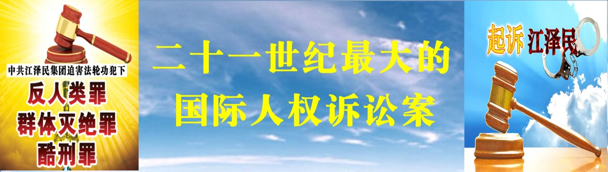

 <h3 align="center"> 翻牆必看 请收藏本网址 https://bit.ly/3ezRQKo 连上免翻视频即时IP   </h3>

 
 
<h3><b>最新评论、热门视频 https://bit.ly/2A4uPQb </h3></b>
 

 
<h3>看更多真相 https://bit.ly/2RQM1hX </h3>

 
 
<h4>网页若出现〝你的连现不是私人连线″，点→进阶，再点→继续前往...，就可以看到视频了。 </h4> 

<h3><b><a href="https://github.com/mingop/faaap/blob/master/forfor.md">● 红潮即将倾覆  天之将明 ● </a></b></h3>

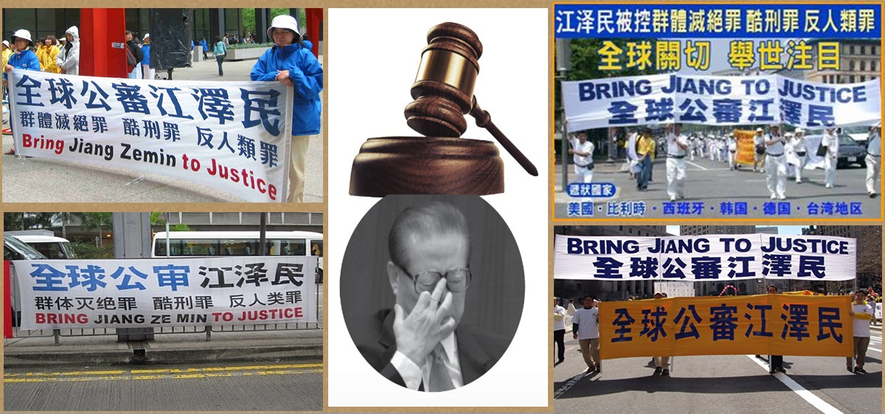

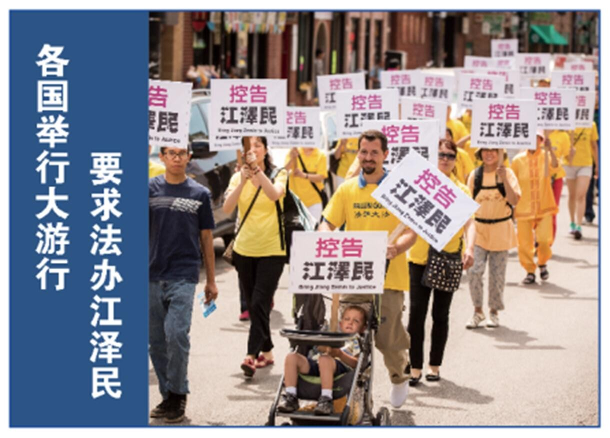

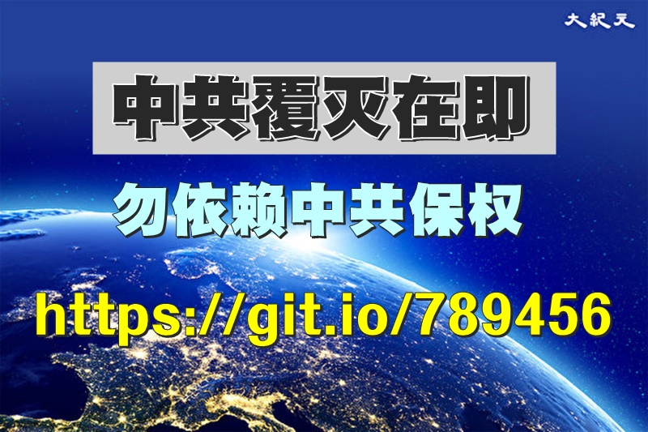

 

 
<a name=list><b>目录</b>
<table>
 
<tr>
<td width=900>
<a href="#01">➤ 迫害法轮功者 美拒发签证 新制裁震慑中共</a></td></tr>  
 
<tr>
<td width=900>
<a href="#0">➤ 美国务院将严审签证 震慑中共 意义重大</a></td></tr> 
 
<tr>
<td width=900>
<a href="#1">➤ 反人类罪、群体灭绝罪：在中国还在进行的罪行</a></td></tr>
 
<tr><td width=900>
 <a href="#2">➤ 群体灭绝罪、反人类罪、酷刑罪 一一 简介</a></td></tr>

<tr><td width=900>
 <a href="#3">➤ “群体灭绝罪”在国际刑法中是一种严重罪行，不受失效限制，作恶者受终生追诉。
</a></td></tr>

<tr><td width=900>
 <a href="#4">➤ 反人类罪”追责无限期，不得以“执行上级命令”为由免除责任。
</a></td></tr>

<tr><td width=900>
 <a href="#5">➤ 全球逾303万人举报江泽民反人类罪行
</a></td></tr>

<tr><td width=900>
 <a href="#6">➤ 反人类罪 服从命令既谋杀共犯
</a></td></tr>

<tr><td width=900>
 <a href="#7">➤ 江泽民集团对法轮功学员实施“名誉上搞臭、经济上截断、肉体上消灭”，“不查身源、直接火化”等系统的残酷迫害。
</a></td></tr>

<tr><td width=900>
➤ 迫害法轮功是死路 明白真相是生路 https://git.io/trtptp 
</td></tr>

<tr><td width=900>
 <a href="#8">➤ 法轮大法是正法
</a></td></tr>

<tr><td width=900>
 <a href="#9">➤ 参与各种迫害法轮功学员的事件，自己得承担罪责，冤判的“判决书”就是你的签名。
</a></td></tr>

<tr><td width=900>
 <a href="#10">➤ 报应如响，天无妄降之灾。
</a></td></tr>

<tr><td width=900>
 <a href="#11">➤ 迫害法轮功的急先锋 相继落马 报应已然现前
</a></td></tr>

<tr><td width=900>
 ➤ 迫害大法弟子遭恶报   https://git.io/Eph
</a></td></tr>

<tr><td width=900>
 <a href="#12">➤ 将功补过，为自己的未来预留后路。
</a></td></tr>

<tr><td width=900>
 <a href="#13">➤ 国际社会强烈谴责 中共活摘良心犯器官罪行
</a></td></tr>

<tr><td width=900>
➤ 海外三退大潮 https://git.io/ssoskk
</a></td></tr>
</table>

<a href=#list><h4 align="right">回目錄</a></h4>

<table>
<tr>
<td width=900>
<a name=01>
 
<h3 align="center"> 迫害法轮功者 美拒发签证 新制裁震慑中共</h3>
 

</a>

法轮功学员将迫害者名单递交美国务院，国务院官员透露，已有多人因迫害法轮功被拒发签证。 (ALASTAIR PIKE/AFP/Getty Images)

【大纪元2019年07月23日讯】（大纪元特约记者林澜、方净采访报导）法轮功学员近日将一批恶人名单递交美国国务院，要求根据相关法律对其拒发美国签证，将其列入限制入境特殊名单。国务院官员告知学员，名单收悉，会依法处理。国务院官员并透露，已有多人因迫害法轮功，被拒发美国签证。

资深中国问题专家横河接受新唐人采访时表示，这对于那些继续还在参与迫害法轮功和其他侵犯人权行为的中共官员，会有极大的震慑。同时也鼓励更多的受害者站出来揭露中共的罪行。

今年5月，据海外“明慧网”消息，美国国务院官员曾告知一些宗教和信仰团体，美国政府将严格地审核签证申请，对人权及宗教迫害者拒发移民和非移民签证（如旅游、探亲、商务等），已发签证者（包括绿卡持有者）也可能被拒绝入境。

美国国务院官员并告知美国法轮功学员，可以提交迫害者名单。

7月21日“明慧网”报导，法轮功学员近日已向国务院递交了一批迫害者名单。美国国务院官员告知，已收到名单，会进行审核并依法处理。

国务院官员并透露，不只是人权迫害者本人，连他们的配偶、子女，都在惩罚之列。美国国务院还透露，近年来中国已经有多人因为迫害法轮功学员被拒签了。

横河表示，美国国务院这次透露的信息量很大，意义也很重大。美国政府透露美国拒签的不是从法轮功学员这次提交的名单里面得到的，说明美国政府关注这件事情已经不是一天两天了。“一般情况下，美国政府不会披露拒绝签证的理由，这次是美国国务院主动告知，所以它的意义是非同小可的，就说明美国政府这次是认真的。”

国务院官员还明确提出，不看重迫害者涉及的案例数量，而看重具体事实。只要有一个案例事实充分，就可以把迫害者列入特殊名单。国务院官员还肯定，明慧网是可信赖、可引用的资讯来源。

横河对此表示，明慧网迫害案例，大多数都是受害者或者是目击者的亲身经历，经过明慧网核实的，“现在美国政府、美国国务院进一步地公开确认明慧网的信息来源，所以对于那些曾经在明慧网曝光过的迫害凶手，有极大的震慑力。”

对于国务院官员将人权迫害者的配偶、子女亦在惩罚之列。横河说，这对于迫害者的惩罚标准上也有了明确的变化。“我记得以前美国众议员、‘美国国会和行政当局中国委员会’前共同主席Chris Smith他就说过：怎么能够让一个严重迫害人权凶手的子女，到美国来留学？美国不应该是他们的安全天堂。那这次美国国务院的政策，正好反映了这个说法，把这个政策明确下来了。”

国务院官员还透露新近的一个调整，亦即对于严重侵犯人权的恶行（如酷刑、殴打），一个官员只要是恶行实施单位的负责人，即可列入惩罚之列，而不需像以往那样证明此官员对某次具体恶行下达了命令或进行了指挥。还强调，他们不看重迫害案例的数量，而看重具体事实，只要某恶人有一个案例具备足够的具体事实描述，就可将其放入特殊名单。

国务院官员称，相关办公室的人员已扩充一倍，以便加大力度审核、限制各国人权迫害者的签证申请。而且，目前有28个国家已经制定或准备制定类似于美国的“马格尼茨基法”，对人权迫害者拒发签证、冻结海外资产。

横河表示，“整个这些消息充分说明，这一届美国政府不是把人权作为一个筹码，或者是作为作秀的手段。而是把它看作美国政府必须承担的道义责任。这是建立在美国的立国原则和价值观的基础上。”他说，未来很多国家会跟进，对于那些继续参与迫害法轮功的中共官员会有极大的震慑。

<b>张而平：每个人都应觉悟 选择正义</b>

根据明慧网信息，在法轮功本次递交的迫害者名单中，有中共宣传部门负责人，有各级政法委、610负责人，有涉嫌活摘法轮功学员器官的医生，有监狱系统负责人，有法官，有劳教所恶警。既有直接实施迫害者，也有制定政策者及下达命令者。涵盖各个地区、各个行业及各个级别的恶人。包括中共宣传机构负责人刘云山、涉嫌活摘法轮功学员器官的医生黄洁夫等人。

法轮大法信息中心发言人张而平表示，“这个名单不仅仅是涉及到参与者本人，而是包括他的家属，包括他们家人前往美国要定居、要学习、旅游啊、经商啊，这些路全部都堵死了。所以这是一个很综合性的一个措举。”

“这个可能涉及的很广。因为中国大陆那些参与迫害法轮功的人，很多人他的家属是有绿卡，或甚至在海外有财产或者是在海外有各种身份啊、旅游签证啊等等，那么所有这些人如果核实的话，全部都会牵连的。”

张而平强调，中共迫害法轮功已经持续了20年，每个人都应该觉悟，选择站在正义的历史这边，对迫害政策不予配合、执行，一起把这个暴政结束。“人心在转变，整个社会都在转变，就是它迫害这个事情它维持不下去了。将来必定有一天，这些人将不仅仅受到道德法庭的谴责，也会受到人间法庭的审判。这一天不会远的。”

<b>民主人士：打开惩治中共邪恶官员的一扇窗</b>

中国民主党美国委员会美东负责人张健认为，美国国务院对中共迫害法轮功的官员依法惩治，“对中共来说是一个非常大的打击。这也是中国人民走向民主自由，对自己的信仰有一个安全保障的最好的消息。”

张健表示，“在这20多年当中，法轮功学员为了自己的信仰，遭受了史无前例的中共有组织的大屠杀。我一直在问自己，为什么中共要迫害这么好的一个人群呢？就是因为信仰，你不信仰邪的，你去信仰正的，追求真理的时候，就会遭受到迫害。”

张健强调，他非常尊敬法轮功学员，“法轮功展示给大家真、善、忍的行为，让各国人都对法轮大法有了更深刻的了解，深深的感动了这些政府，在他们身上，我看到了很多我们曾经失去的，和我们追求的一种人性的光辉。”

他同时表示，美国国务院对法轮功这封回信非常的重要，“因为这里面就是打开了惩治中共邪恶官员的一扇窗。所有的中国人，可能都会因为法轮功学员在美国得到了这样的一个高度的关注，美国政府强力出手打击迫害法轮功学员这些官员，通过这样一个政策，所有的中国人都会获益。”#

责任编辑：林诗远

</td></tr>
</table>

<a href=#list><h4 align="right">回目錄</a></h4>

<table>
<tr>
<td width=900>
<a name=0>
 
<h3 align="center"> 美国务院将严审签证 震慑中共 意义重大</h3>
 
俞晓薇

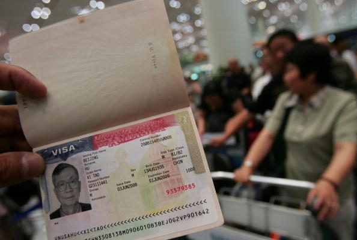
</a>

美国政府严审人权迫害者签证，一方面可将人权迫害者拒之门外，另一方面可排查那些正在申请居留权或已取得合法身份的不法之徒，将其驱逐出境。图为北京机场，一名中国民众护照上的美国签证。(China Photos/Getty Images)

【大纪元2019年06月01日讯】5月31日，明慧网发布了重要通告：“在美国的一些宗教及信仰团体日前被告知，美国政府意在更加严格地审核签证申请、对人权及宗教迫害者拒发签证，包括移民签证和非移民签证（如旅游、探亲、商务等），已发签证者（包括‘绿卡’持有者）也可能被拒绝入境。美国国务院官员并告知美国法轮功学员可以提交迫害者名单。”

众所周知，中共犯下了历史上最邪恶的人权侵害罪行，自建政以来持续迫害宗教信仰，尤其以始于1999年的对法轮功的迫害最为持久和惨烈。因此，美国政府的这一记重拳，对中共的人权迫害者，特别是迫害法轮功的江泽民集团产生强力震慑，也将对其它国家起到积极的示范作用。

美国政府严审签证，一方面可将人权迫害者拒之门外，另一方面可排查那些正在申请居留权或已取得合法身份的不法之徒，将其驱逐出境，保障国安。此举意义非常重大。

第一，据此，美国法轮功学员会根据美国入境、移民法律及总统公告，选取有可靠信息和确切事实的迫害者名单，提交给美国国务院，要求对恶人拒发签证、禁止其入境。迫害者不局限于迫害的直接实施者，也包括制定具体迫害政策、下达命令以及协同者。

第二，大批贪官的仕途发达都与迫害法轮功难脱干系，他们很可能已经向海外转移财产和安置亲属，因此，除了锁定具体迫害者以外，法轮功学员也会在全球范围内搜集迫害者亲属、子女、资产的信息，以便定位追查。

第三，中共从迫害法轮功之初即把谎言和仇恨向海外输出。近年来，中共使领馆操控部分华人团体，并派遣特务、流氓，在美国、韩国、西班牙、台湾、香港等国家和地区公然攻击法轮功学员在当地的正当活动，制造暴力和骚乱，甚为嚣张。比如，干扰神韵艺术团和神韵交响乐团的演出，攻击法轮功学员的真相点，骚扰法轮功学员的游行和讲真相活动，设立邪恶网站，散布诬蔑法轮功的恶毒谣言等等。

那些在海外替中共效力的特务、地痞、流氓，可能是所驻国的公民或绿卡持有者，但其实都是不折不扣的中共代理人。他们正是美国要严查的对象。他们个人、亲属、子女及资产的信息，也将会被系统地收集、整理、呈送美国政府。

第四，中共迫害法轮功者，多会选择西方国家作为退避“天堂”。美国务院此次强力出击，首开先例，对于加拿大、澳洲、新西兰、欧洲等国，都具有非常重要的示范作用。中共的渗透早已危及全球。当中共在海外肆无忌惮地挥舞红旗、攻击信仰团体时，当地政要和民众都看清了红色渣滓的祸害，都欲驱之以保安定。日后，他国也很可能效仿美国，赶走中共人权恶棍。

第五，天网恢恢，疏而不漏。纵观历史长河，作恶者终难逃法网。无论是国家元首、高级军官、还是九旬战犯，都必须面对正义的审判。

2004年7月10日，“追查迫害法轮功国际组织”协调建立了“全球监视追踪系统”。此网络系统分布于110多个国家近500个城市，在有效地监视、追踪在中国大陆参与迫害法轮功学员的中共各级党政官员。与此同时，该系统还负责追踪收集迫害法轮功的主要罪犯及其在海外的资产和家人逃匿的分布情况，以备用于将来经济赔赏和对其家人协同犯罪的全面清算。

明慧网已经收录了将近一万起迫害法轮功恶报实例，大批中共610、司法、监狱、文宣等系统的人员所遭逢的厄运触目惊心。2018年1月，大纪元网站发表了《二百中共公安局长派出所长遭恶报实录》，收集了从1999年7月至2017年的100个公安局局长及100个派出所所长遭到恶报的实例。

第六，中国现政权要如何做？当一批批中共人权迫害者被拒发签证，或从国外被遣返，他们难道还要在大陆继续为非作歹吗？中共迫害法轮功已经长达20年，这一场惨无人道的迫害夺走了众多善良修炼人的生命，拆散了无数幸福的家庭，摧毁社会道德，重创国民经济，造下无边罪业。停止迫害，抓捕江泽民，惩办人权凶手，释放被非法关押的法轮功学员，是广大人民的呼声。

川普总统就任以来，以实际行动捍卫宗教信仰自由，关注宗教信仰迫害，引领各国抵制中共渗透，极大地震慑了邪恶，鼓舞和帮助了受压迫的中国人民，也是在维护世界和平。

今时，中共迫害法轮功者正在被四面围堵，躲得过一时，逃不了永远。只有自首赎罪，主动交待案情，协助收集迫害证据，才能给自己开一条生路，也可为家人挽回未来。正义的大潮在迅猛地推进，一浪高过一浪。#

责任编辑：高义

</td></tr>
</table>

<a href=#list><h4 align="right">回目錄</a></h4>

<a name=1>
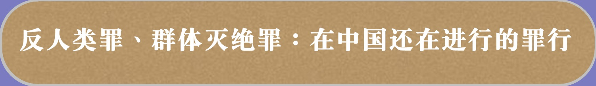</a>

<table>
<tr>
<td width=900>
【明慧网二零一六年十月八日】1945年，纽伦堡的法庭上，纳粹德国的官员、将领、集中营的负责人、盖世太保、党卫军，甚至医生、护士，还有14名法官，站在被告席上，被指控犯下了“反人类罪”和“种族灭绝罪”，主动甚至是积极地配合纳粹的邪恶的对犹太人的种族灭绝，造成了600万犹太人的死亡。绝大多数的被告为自己申辩的唯一借口是，我在执行国家的法律，在执行上级的命令。

对于这种辩解，美籍德国犹太哲学家汉娜阿伦特深刻指出：这是一种被正常化了的邪恶，它比没有以职责作为借口的邪恶更加可怕，因为没有借口的邪恶至少还会使罪犯在心灵深处受到谴责，可是有了职责作为借口，犯罪就成为某些人的职业——“正常”、“正当”甚至“高尚”的职业，罪犯们不但不以为耻，反以为荣。这样，许多人可能甚至为此而成为合法的犯罪狂，在他们眼里，这些罪恶能够成为他们谋生的手段和来源，在此基础上，罪恶必将迅速繁殖，如核裂变一般波及整个社会，久而久之，社会即便不走向灭亡，也会走向混乱和动荡。

电影《纽伦堡审判》中受审法官简宁在法庭上说：“我们虽然不是纳粹，但是我们的所作所为比纳粹更恶劣，因为我们知道他们是谁，正在干什么，却仍然选择为虎作伥”。

<b>“反人类罪”、“种族灭绝罪”——人类最严重的罪行</b>

一个人无论怎样邪恶，一个制度无论如何不合理，如果没有众多为了权力和利益而为虎作伥、助纣为虐的积极参与者，没有众多推波助流者、没有众多麻木不仁的协从者，没有众多胆小怕事、沉默不语的默许者，没有这些无数的“平庸之恶”（阿伦特语），大规模的、系统的迫害罪行不会发生。

爱因斯坦说：“制度要是得不到个人责任感的支持，从道义的意义上来说，它是无能为力的。”“我相信个人应该根据他的良心行事。”

这也就是良知自由的重要！

也正是基于上述观点，二战后的纽伦堡审判、东京审判把平等、正义、人权等作为国际司法领域的基本准则，首次确定和使用“反人类罪”、“种族灭绝罪”等罪名，伸张正义，并奠定了各国在人权方面的共识，进而建立了国际人权惯例。

联合国国际刑事法院罗马规约规定，“灭绝种族罪和危害人类罪属于整个国际社会关注的最严重的犯罪”。

罗马规约第六条中阐明，灭绝种族罪“是指蓄意全部或局部消灭某一民族、族裔、种族或宗教团体而实施的下列任何一种行为：1. 杀害该团体的成员；2. 致使该团体的成员在身体上或精神上遭受严重伤害；3. 故意使该团体处于某种生活状况下，毁灭其全部或局部的生命；4. 强制施行办法，意图防止该团体内的生育；5. 强迫转移该团体的儿童至另一团体”。

1945年的《纽伦堡宪章》和1946年的《东京宪章》首次以国际法律文件的形式规定危害人类罪是应当惩罚的犯罪。从1946年5月到1948年11月，远东国际军事法庭判决包括东条英机等7名战犯因战争罪和危害人类罪死刑。在2002年7月1日生效的《国际刑事法院规约》（《罗马规约》）将该罪名中文译名确定为危害人类罪（crimes against humanity）。重点“针对任何平民人口进行的攻击”着眼于国家或组织攻击平民人口的政策，或为了推行这种政策，针对任何平民人口多次实施的攻击行为。如针对民众实施的谋杀，种族灭绝，政治性的、种族性的或宗教性的迫害等行为。

<b>反人类罪非干涉内政，国际刑事法庭只审判个人而非国家；反人类罪是最为严重的国际犯罪，不论其犯罪期日，可进行无限期追诉。</b>为避免作为国际法上最重大罪行的反人类罪的犯罪分子逃避被追诉和惩罚的命运，联合国于1968年11月26日通过了《战争罪和反人类罪不适用法定时效公约》，该公约规定，战争罪和反人类罪等最为严重的国际犯罪，不论其犯罪期日，不适用法定时效，应当进行无限期追诉。随后，欧洲理事会也制定了《战争罪和反人类罪不适用法定时效的欧洲公约》，于1974年1月25日开放供欧洲各国签署。这两项公约的制定和实施，反人类犯罪不再适用普通刑事追诉时效制度的限制，亦即各缔约国或参加国刑事司法机关对反人类罪享有无限期的追诉权。

<b>反人类罪的惩罚原则之一是“罪责自负”，不会因行为人是“执行上级命令”而免除责任。</b>任何人实施了反人类罪这样违反国际刑法的行为，都不能以任何借口逃避国际刑事责任，而只能由其本人对自己的罪行负责。上级命令不能成为个人承担刑事责任的抗辩理由。

<b>“反人类罪”、“种族灭绝罪”在中国的体现――对法轮功群体的迫害</b>

人类历史上最惨绝人寰的恶行，不是一个人或一个组织作出的，而是掌权者以国家的名义，法律的名义，有组织、系统性地实施的，如纳粹德国对600万犹太人的种族灭绝；如波尔布特的红色高棉政权在1975年到1978年间，在人口不到800万的柬埔寨小国，屠杀了200万人；如在斯大林掌权时期的前苏联，以“肃反”的名义屠杀了占全国十分之一的人口共2千万，其中包括俄共前两届政治局委员（除了列宁已死及斯大林本人外），全部被处死或自杀，5名元帅毙了3个，5名集团军司令毙了3个，全部二级集团军司令全部被枪毙，85个军长毙了57个，195名师长毙了110个。如中国现在还在延续的对几千万以“真、善、忍”为准则的法轮功信仰者的迫害、甚至活摘器官贩卖，是人类有史以来最邪恶最残酷的群体迫害、人权灾难，被称为人类有史以来“这个星球上前所未有的邪恶”。

对纳粹大屠杀深有研究的英国学者鲍曼（Bauman Z.）在其著作《现代性与大屠杀》中说：“人类记忆中最耸人听闻的罪恶，并非一群无法无天的乌合之众所为，而是由身穿制服的唯命是从的人完成的；它不是源自秩序的败坏，而是源自一种完好的秩序统治。”

被迫害的群体可能是基于共同的种族（如二战时期德国的犹太人），或共同的信仰（如古罗马帝国时期的基督徒，现在中国法轮功信仰者），或者只是有共同的亚文化特征（如上世纪50年代中国的“右派”）而被掌权者所嫉恨，而这个国家又没有完善的法律和制度约束掌权者滥用权力，于是，整个国家机制被裹挟着参与罪恶的制造过程。宣传机构首先进行仇恨宣传，编造谎言，造谣污蔑，为迫害制造借口和理由，（如古罗马帝国的皇帝尼禄放火焚烧罗马城，然后嫁祸于基督徒；如2001年中国的中央电视台制造出“自焚伪案”，诬陷法轮功，欺骗世人，甚至教育系统把谎言编进教材，从小欺骗。）进而，成立凌驾于法律之上的非法权力机构，架空整个国家正式权力结构，具体组织实施迫害，如纳粹德国为迫害犹太人所成立的盖世太保组织；如江泽民为迫害法轮功于1999年成立的“610”办公室。

<b>（一）凌驾于法律之上的非法机构――“610”办公室</b>

在现代国家，任何一个行使公权力的机构都必须有法律的合法授权，如立法权授予议会、行政权授予政府、司法权授予法院，并且，每个权力主体的权力范围明确、具体，不可越权。如果没有法律明确规定而行使公权力，则是非法组织，其行为无效力，即所谓“法无规定及禁止”的法制原则。

但是，在1999年以后，江泽民为了迫害法轮功，非法成立了一个凌驾于国家之上、存在于法律之外的非法机构——610办公室，在法轮功问题上，所有的国家机构都必须听命于这个非法组织。

2005年，高智晟律师在给当时时任国家主席的胡锦涛和总理温家宝的公开信中说：“十几日的调查，我再次看到了令我痛彻心肺的真相，‘610’办公室，至少可以这样称谓它——国家政权内且高于政权力量的黑社会组织，它是可以操纵、调控一切政权资源的黑社会组织。一个国家宪法及国家的权力结构安排规范中没有的组织，却‘行使’着本只能由国家机关才能行使的权力及许多连国家机关都根本不能行使的‘权力’。它‘行使’着在这个星球上，人类有国家文明以来，作为国家从不能拥有的权力。 ……我们看到了，被以‘610’为符号化的权力，正在持续地以杀戮人的肉体及精神、以镣铐和锁链、电刑、老虎凳等形式与我们的人民‘打交道’，这种已完全黑社会化了的权力正在持续地折磨着我们的母亲、我们的姐妹、我们的孩子及我们的整个民族”（高智晟律师的公开信）。

在一个全能政府的框架下，政府，确切地说是掌权者个人，控制着一切的社会资源，于是，在江泽民的淫威之下，“610”非法组织遍及全国31个省、自治区、直辖市一直延伸到最基层的街道、乡镇、企业、学校。动用包括军队、武警、公安、检察院、法院、国安、看守所、劳教所、少管所、戒毒所、监狱等一切机构参与迫害，调动包括报纸、杂志、广播、电视、互联网在内的一切国家宣传机器，最优先地动用规模庞大的财政资金（中国政府四分之一的财政收入），在国际国内丧心病狂地抹黑法轮功，煽动仇恨法轮功，打压迫害法轮功。整个罪恶的犯罪链条让整个国家机构沦为犯罪的帮凶，一直延续着的且还在持续着的犯罪手段包括剥夺自由、强制洗脑、酷刑折磨、非法抄家、开除公职、甚至活摘器官。而所有这一切的罪行都用一个词掩盖而获得“正当性”---“政治问题”，尽管，法轮功自始至终也没有任何政治诉求，只是坚持信仰的权利和澄清那些政府诬陷的谎言，告诉世人事实真相，而巨大天文数字的财政支出和没有底线的残酷迫害竟都是为了满足一个当权者的变态嫉妒和掩盖为了欺骗世人而撒的弥天大谎。

<b>（二）“量体裁衣”、“因人设罪”的迫害“法律依据”</b>

中国的立法、司法机构，为了迎合江泽民的迫害政策，无视基本的法治原则和公平正义，无视中国宪法的明确规定（信仰自由）和世界普世规则，违背天理、违背道德、违背宪法和法律，匆忙通过公布了所谓的“法律依据”。

立法和司法解释对于打压法轮功后期配合无疑发挥了罪恶的功效：其一，初期，对一个善良平和的信仰群体进行诽谤、抹黑的同时，将能够真实表达该信仰内容的书籍、音像全部销毁，从根本上断绝了他人了解这一信仰并进行自我判断的可能；其二，后期，在栽赃、镇压之后，以立法的形式将被迫害者揭露恶意诽谤、抹黑、栽赃、镇压等恶劣事实的行为定性为犯罪，以进一步加大报复和彻底掩盖真相。”

十几年来，这些立法和司法解释成为迫害善良、制造冤案的所谓“法律依据”，公安绑架、拘留、抄家，检察院批捕、公诉，法院判决、执行，都堂而皇之的具有了“法律依据”。就象纳粹德国的司法官们一样，在对犹太人实施罪恶的灭绝政策时，是依据纳粹德国颁布的国家法律。

<b>（三）颠倒的是非－－本该维护公正的司法机关沦为犯罪的帮凶</b>

政府命令与个人良心之间的选择，爱因斯坦说：“一个人，如果政府指示他去做的事，或者社会期望他采取的态度，他自己的良心认为是错误的，那么他该怎么办，这实在是一个老问题。……”“制度要是得不到个人责任感的支持，从道义的意义上来说，它是无能为力的。”

如果，明知道是一个冤案，却身不由己地在某种无法抗拒的压力下不得不参与冤案的制造过程，但凡有一点良知的人，内心总是不安的。但是，如果被冤枉的不是一个单个的个体而是一个群体，而这个群体是被政府（政府中的掌权者）以国家的名义所排斥所迫害，参与其中的人就很少有人感到内疚或不安，甚至以执行命令为荣。

阅遍所有的法轮功书籍和音像，都是让人按照“真、善、忍”做好人，看看1999年迫害法轮功以后，法轮功学员持有条幅，制作、发放光盘、传单，喷涂标语、悬挂展板，全部是说明真相，揭露犯罪。

中国的公、检、法、司公权力系统，以刑法300条的名义，以两高的“司法解释”为依据，对法轮功学员绑架、非法抄家、非法拘留、非法逮捕、非法判刑。明知是在违法犯罪却在610非法组织的操控下麻木的参与迫害。为了掩盖罪行和欺骗国人，剥夺会见权、剥夺辩护权、剥夺旁听权，甚至，作为公职人员的警察伪造证据、栽赃陷害、敲诈勒索。

一位律师说：“人类有史以来的所有刑事案件中，恐怕没有比侦办法轮功案件（如果可以称为‘案件’的话）更简单、省事且无需虑及后果的了。法轮功信仰者不说假话，身份容易识别、确定；他们‘打不还手、骂不还口’，任何情况下不会使用暴力，办案者根本无须担心会发生一般案件可能存在的人身危险性；他们心地善良，遇事向内找，努力修去对任何人的仇恨，因此包括昧良心的盯梢者、报信者、抓捕者、幕后指使者在内的所有参与者甚至不用担心哪怕是言辞上的报复，显然，欺负一个好人总比得罪一个坏人容易且无需担心人身安全。”

“法轮功案件的荒唐性还在于：整个办案过程已经完全是流水作业化了的，各阶段办案人员无须动用智慧即可顺利完成任务。在侦查、起诉、审判的各个阶段和全部过程中，只要符合下述两条，第一：一个人具有法轮功信仰者身份；第二，该人持有或发放过与法轮功可能有关的物品或者甚至仅仅是对别人说过关于法轮功的真相，那么，这个人就将被冠以‘利用邪教组织破坏法律实施罪’并送进监狱。而丝毫无需考虑具体行为究竟是对社会有危害还是有着不可估量的深远意义。”

“大家想过没有，冒着生命危险，将大规模的几乎不受任何制约的在国家暴力支持和掩盖下的群体性、系统性的迫害揭露出来，让一切不愿被欺骗和蒙蔽的人知道真相，共同制止迫害的继续，防止悲剧蔓延到每个人头上，这究竟属应予限制的危害社会行为，还是应作为功盖千秋的大善之举给予大力提倡呢！”

高智晟律师在公开信中写道：“人类历史上没有哪个国家的人民，为了心灵中的信仰，会在有政府的和平时期经历着如此规模的、如此持久的、如此惨烈的灾难。这种仍在继续着的今天的灾难，使数以千计的无辜同胞丧失了宝贵的生命，数以十万计的人民被剥夺了自由。我们看到的真相表明，所有被非法剥夺自由期间的同胞，都遭到了令文明社会难以置信的对肉体的摧残过程和对精神的野蛮杀戮煎熬。这场完全丧失人的理性的迫害过程，还使的一亿多的法轮功信仰者，一亿多个家庭的数亿人遭受了传讯和恐吓，剥夺就业资格、工作机会、收入，被抢劫财产的不同程度的、不同性质的迫害和打压，这是多么的愚蠢、危险和不道德的恶举”。

这是典型的群体灭绝罪和危害人类罪，江泽民及其追随者、执行者、参与者，迫害法轮功所犯的不是其中的某些条款，而是多条多款，并且情节严重。

2002年10月22日，江泽民访问美国伊利诺依州芝加哥时，被当地法轮功学员告上伊利诺依州北区法庭。之后，法轮功学员在美国、加拿大、秘鲁、阿根廷、玻利维亚、智利、德国、比利时、西班牙、希腊、荷兰、瑞典、澳大利亚、新西兰、日本、韩国，中国台北、香港，均对江泽民提起法律诉讼。自2015年5月以来，全世界已有20多万法轮功学员实名向北京最高法院、最高检察院控告迫害法轮功的元凶江泽民，已有180多万海内外民众签名举报江泽民。等待江泽民的，必将是旷古未有的正义大审判。

1989年2月，在柏林墙，两个儿童，克利斯和高定，从东德逃出时遭士兵枪击，克利斯当场死亡，高定足踝中枪。1991年9月，德国统一后，柏林法庭对这起举世瞩目的柏林墙守卫案做出的判决结果是：以枪射击高定脚部的士兵判两年徒刑，可以假释；开枪射杀克利斯的士兵，判三年半徒刑，不得假释。法官这样解释他的判决：“东德的法律要你杀人，可是你明明知道这些唾弃暴政而逃亡的人是无辜的，明知他无辜而杀他，就是有罪。这个世界在法律之外，还有‘良知’这个东西。当法律和良知冲突的时候，良知是最高的行为准则，不是法律。尊重生命，是一个放诸四海皆准的原则；你应该早在决定做围墙士兵之前就知道，即使东德法律也不能抵触那最高的良知原则。”“即使东德法律也不能抵触那最高的良知原则”，这就是二战结束后纽伦堡国际法庭确立的注重对人权、人性价值保护原则的体现。

所有中国体制内的掌权者，在如何对待法轮功问题上，每个人所做的决定，代表着自己对未来的选择。迫害法轮功的元凶江泽民即将被以反人类罪、群体灭绝罪送上审判台，那些追随者、执行者、参与者将何去何从？

</td></tr>
</table>
<a href=#list><h4 align="right">回目錄</a></h4>

<a name=2>
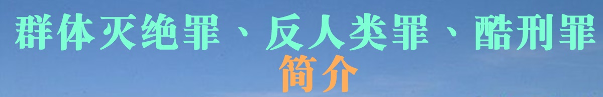</a>

<table>
<tr>
<td width=900>
<h3 align="center"><b>反人类罪</b></h3>

危害人类罪或反人类罪，旧译违反人道罪，于2002年7月1日生效的《国际刑事法院罗马规约》将该罪名中文译名确定为危害人类罪。 规约中的定义为“是指那些针对人性尊严极其严重的侵犯与凌辱的众多行为构成的事实。 这些一般不是孤立或偶发的事件，或是出于政府的政策，或是实施了一系列被政府允许的暴行。

危害人类罪- 维基百科，自由的百科全书 - Wikipedia   
https://zh.wikipedia.org/zh-tw/危害人类罪</td></tr>

<tr>
<td width=900>
 <h3 align="center"><b>群体灭绝罪</b></h3>

 种族灭绝（英语：genocide）或群体灭绝，是指人为的、系统性地、有计划地对一个或一些种族、民族、宗教或国民团体进行全体性或局部性的屠杀。但法律学者对于种族灭绝中局部性的程度，仍存在争议。该词最早由波兰籍犹太法律学者拉斐尔·莱姆金在1944年提出。其中“genos”来源于希腊语“genos”，意思为部落或家庭；后缀“-cide”来源于拉丁语“cidium”或法语“cide”，意思为杀害。

1948年12月9日，联合国大会通过第260A号决议《防止及惩治灭绝种族罪公约》，简称CPPCG条约。该条约于1951年1月12日生效，其中第二条对种族灭绝行为定义如下：

蓄意全部或局部消灭某一国族、族群、种族或宗教团体，犯有下列行为之一者：

◆ 杀害该团体的成员。 
◆ 致使该团体的成员在身体上或精神上遭受严重伤害。 
◆ 故意使该团体处于某种生活状况下，以毁灭其全部或局部的生命。 
◆ 强制施行办法，意图防止该团体内成员生育。 
◆ 强迫转移该团体之儿童至另一团体。 

种族灭绝- 维基百科，自由的百科全书 - Wikipedia  
https://zh.wikipedia.org/zh-cn/种族灭绝</td></tr>

<tr>
<td width=900>
<h3 align="center"><b>酷刑罪</b></h3>

 酷刑，属于一种会对人的肉体或精神造成极大痛苦的刑罚，其属于一种手段，目的往往在于处罚某种不法行为或是以此取得特定的资讯，后者也称为刑求。

根据联合国禁止酷刑和其他残忍、不人道或有辱人格的待遇或处罚公约第1条的定义：

“酷刑”是指为了向某人或第三者取得情报或供状，为了他或第三者所作或涉嫌的行为对他加以处罚，或为了恐吓或威胁他或第三者，或为了基于任何一种歧视的任何理由，蓄意使某人在肉体或精神上遭受剧烈疼痛或痛苦的任何行为，而这种疼痛或痛苦是由公职人员或以官方身份行使职权的其他人所造成或在其唆使、同意或默许下造成的。纯因法律制裁而引起或法律制裁所固有或附带的疼痛或痛苦不包括在内。

酷刑- 維基百科，自由的百科全書 - Wikipedia  
https://zh.wikipedia.org/zh-cn/酷刑</td></tr>

<tr>
<td width=900>
 <h3 align="center"><b>普遍管辖权</b></h3>

 普遍管辖权或普遍性原则是国际法“原则”之一。根据这一原则，无论被控犯罪之人的国籍、居住国或与起诉国关系如何，即使该罪行是在起诉国领土之外犯下的，该国也可以对该人行使刑事管辖权。由于所犯罪行被认为是危害全人类的，并且罪行极为严重，不容有管辖权投机，因此任何国家都有权对其加以惩罚。

普遍管辖权- 维基百科，自由的百科全书 - Wikipedia  
https://zh.wikipedia.org/zh-cn/普遍管辖权

</td></tr>

</table>

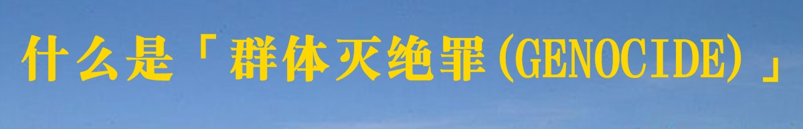

<table>
<tr>
<td width=900>
 <h3 align="center"><b>什么是“群体灭绝罪(GENOCIDE)”</b></h3>

【明慧网二零零三年五月十六日】在美国的词典里，Genocide——“ 灭绝种族罪”被解释为对一个种族，一个信仰群体，一个文化群体，或一个政治群体的一种蓄意地有系统的整体毁灭行为，所以对Genocide更确切的翻译应该是“群体灭绝罪”。

最典型的例子就是二战期间对犹太人的屠杀，对所有的犹太人，能找到的就杀，目的就是要在地球上彻底灭尽犹太种族。现在人们一想到“灭绝种族”这个词，马上就会联想到二战对犹太人的灭绝性屠杀。

二战时的东方战场，日本军队杀害的中国人比德国杀的犹太人还要多，可日本军队的所为并不算“灭绝种族罪”因为它并不是有目的、有计划、系统地杀掉所有中国人。

总而言之，“群体灭绝罪”(genocide)是有组织地对一群人的灭杀（并不仅限于种族），目的是灭除这一个群体。按惯例迫害者是国家机构。

在国际刑事法中，灭绝种族罪是这么定义的：“灭绝种族罪是指蓄意全部或局部消灭某一民族、族裔、种族或宗教团体而实施的下列任何一种行为：

1、杀害该团体的成员；2、致使该团体的成员在身体上或精神上遭受严重伤害；3、故意使该团体处于某种生活状况下，毁灭其全部或局部的生命；4、强制施行办法，意图防止该团体内的生育；5、强迫转移该团体的儿童至另一团体；”

2002年10月，部分法轮功学员以“群体灭绝罪”控告江泽民。江泽民迫害法轮功，实行的政策叫做“名誉上搞臭、经济上截断、肉体上消灭”，没有比这个法案更确切地定义江氏集团对法轮功修炼群体在过去三年里的迫害了。法轮功学员被迫害致死的报导几乎每天都在网站上读到，还有众多无法越过封锁传到海外的死亡案例。迫害更常用的手段是残酷的折磨，包括电刑、老虎凳、水牢、剥夺睡眠、曝晒、冰冻、火烙、强迫重体力劳动……等等，被迫害致残无数。更有甚者，将健康人强行送进精神病院，注射损害神经的药物，使人遭受精神上的严重伤害。以上已严重触犯了灭绝种族罪的前两条。

另外，江氏集团有系统的在国家控制的电视台、广播电台、报纸等媒体上大量造谣诬蔑和恶毒攻击法轮功，迫使学校、政府部门及各种企事业单位对法轮功学员进行迫害，使法轮功学员无法上学，无法工作，无法有正常的社会交往，无数的家庭破裂，无数人流离失所，众多的法轮功学员无法生存。这正是法案中所说的第三条。

其实这场灭绝法轮功的目的是针对法轮功的信仰。他们所采取的一切手段就是迫使所有的法轮功学员放弃法轮功的信仰，从而灭绝法轮功的存在。他们试图转化法轮功学员的思想，把所有坚持修炼的人都送去洗脑。转化的目的就是要从精神上消灭这种信仰。这场迫害是在江泽民所指导的610办公室有目的、有组织地系统地进行的，极尽群体灭绝罪行的最邪恶手段。

对犹太人的群体灭绝罪行是在迫害结束后二十多年里，才被人们逐渐地广泛认识的。今天，对法轮功所进行的种族灭绝，人们如果能够在迫害进行之中就能认识到它的存在，并尽力制止，人类的美好未来就指日可望了。

（本文2003年1月10日首发于明慧。）

</td></tr>
</table>
<a href=#list><h4 align="right">回目錄</a></h4>

<a name=3>
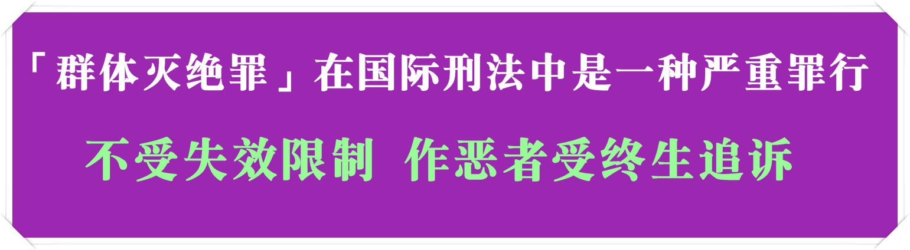

<table>
<tr>
<td width=900>
 <h3 align="center"><b>国际人权法上最重之罪——“群体灭绝罪”</b></h3>

【大纪元2013年05月21日讯】（大纪元记者陈熙暖荷兰报导）群体灭绝罪是国际人权法中最难以取证的罪行，同时也是最严重的罪行。

源自于希腊文的“种族”、“群体”(Genos)一词，加以拉丁词源的后缀“杀死(cide)”，形成“群体灭绝罪”一词，联合国对这一罪行的定义为“故意毁灭全部或部分国家、民族、种族或信仰群体的行为。”

这个名词在1944年以一位波兰犹太人——拉菲尔‧莱姆金(Raphael Lemkin)——为契机而出现，他当时在美国政治避难，向世界公开描述了德国纳粹的大屠杀。而“群体灭绝罪”首次在司法场合出现，是1945在纽伦堡国际军事法庭上对纳粹头子的审判中，但是这些受审战犯最后只被定罪反人类罪。1948年始，随着联合国公约的出现，群体灭绝罪开始受到关注。

1985年联合国正式宣布，1915年造成数十万人死亡的亚美尼亚大屠杀为群体灭绝罪，随后，诸多国家和组织正式使用并谴责这一罪行——1987年欧洲议会谴责亚美尼亚屠杀为群体灭绝罪、1998年比利时、2001年法国、2003年瑞士和希腊，俄罗斯的下议院在1994年也谴责亚美尼亚为群体灭绝罪。

1998年，“群体灭绝罪”开始成为具有法律效力的名词，2007年联合国最高司法机关——国际法院确认1995年发生的斯雷布雷尼察大屠杀为群体灭绝罪，这宗屠杀发生在波斯尼亚内战中，超过8000名穆斯林男性成人和青少年被塞族武装杀死。

巴尔干半岛战争的军事法庭——前南斯拉夫国际刑事法庭（ICTY）也宣判了数宗群体灭绝罪的起诉。

目前，在柬埔寨的金边(Phnom Penh)有3名前红色高棉政权的领导人正在接受群体灭绝罪名和其他战争罪行的审判，随后联合国将拨款进行正式审判。

苏丹总理巴席尔（Omar al-Bashir）因在达富尔（Darfur）地区对平民的屠杀，被国际刑事法庭以群体灭绝罪通缉。

成立于1992年位于海牙的国际刑事法庭是唯一常设的审判群体灭绝罪的国际法庭。

责任编辑：李云帆

</td></tr>
</table>

<table>
<tr>
<td width=900>
 <h3 align="center"><b>【玉清心】“群体灭绝罪”绞索全球收紧 江泽民难逃法网</b></h3>

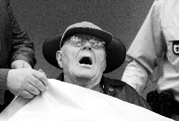

 <h4 align="center">“时间无法冲刷刽子手的罪恶，年迈也不是凶手的挡箭牌”。图为89岁的约翰•代姆扬尤克瘫坐在轮椅上，被推入慕尼黑法庭。（网络图片）</h4>

【大纪元2013年09月05日讯】最近有两条因犯“群体灭绝罪”而被指控的消息，都是几十年前的“老账”，现在被清算。一条是30名前纳粹集中营守卫面临被检察机关公诉；另一条是前罗马尼亚共产党极权时期的一名监狱长被检方指控犯有种族灭绝罪。

30名前纳粹分子，是臭名昭著的奥斯威辛集中营前守卫，他们是二战纳粹屠杀犹太人那场“群体灭绝罪”的犯罪嫌疑人；前罗马尼亚监狱长被控罪行，是前罗马尼亚共产党当政时对异议人士犯下的“群体灭绝罪”。纳粹极权和共产极权，两种邪恶意识形态下发生的“群体灭绝罪”都在被追诉。

二战期间纳粹政权对犹太人的大屠杀，目的就是要在地球上彻底灭绝犹太种族。灭绝种族罪行，这是“群体灭绝罪”中的一个部分。前罗马尼亚监狱长威西奈斯库（Visinescu）在掌管Ramnicu Sarat监狱期间，使关押的许多精英和知识份子囚犯被殴打、挨饿、受冻等，他还杀害了六名政治犯。他被罗马尼亚检察官指控犯下种族灭绝罪，这是犯有“群体灭绝罪”中的另一个部分。对一个信仰群体，一个文化群体，或一个政治群体，蓄意地、有计划有系统地整体毁灭行为，都属于“群体灭绝罪”。而中共迫害法轮功群体，从主客观要件上都完全符合这一罪名，中共不折不扣地犯有“群体灭绝罪”。

“群体灭绝罪”在国际刑法中是一种严重罪行，不受失效限制，作恶者受终生追诉。几十年来，全世界对罪犯、逃犯的追剿清算从未停止过。前柬共红色高棉领导人所犯的“群体灭绝罪” 仍在审理之中。2009年11月30日，89岁的约翰•代姆扬尤克瘫坐在轮椅上，面无血色地半闭着眼被推入慕尼黑法庭。他被指在控担任集中营警卫时参与谋杀了2.79万名犹太人。六十多年前集中营看守“恐怖伊万”，正是眼前这个弱不经风的老头儿。上个月死在医院里的98岁头号纳粹通缉犯拉斯洛•乔塔里，于2012年7月18日在匈牙利落网，全世界都在喜传这一消息。

今年8月，在德国柏林、科隆、汉堡的街头、地铁站，贴有约2000张海报，“通缉”在世纳粹战犯并悬赏征求线索。“通缉”活动由总部设于美国洛杉矶的非政府组织西蒙•维森塔尔中心发起。行动负责人苏罗夫估计，尚未归案的纳粹战犯不到一百人。

前罗马尼亚监狱长威西奈斯库87岁了。30名奥斯威辛集中营前守卫最年长的已经97岁。对“百岁纳粹战犯”的追捕意义何在？如苏罗夫所说，张贴海报，意在请求大家帮助。趁着这些罪犯还活着，找到他们，有被绳之以法的可能。“时间无法冲刷刽子手的罪恶，年迈也不是凶手的挡箭牌”，追缉他们可提醒世人不忘纳粹罪恶。

另外，法庭要追诉的目标范围，较之以前有宽泛的趋势。2011年，德国法院宣判91岁的德米扬鲁克在索比堡集中营谋杀犹太人罪名成立。法官裁定，尽管没有确凿证据证明他曾经直接参与杀害行动，但他在集中营工作就构成了谋杀罪。德国司法官员最近也说，他们正将数以千计曾经帮助管理纳粹集中营的人绳之以法。而此前，德国法庭只考虑接受那些指控亲自参与大屠杀纳粹分子的案件。

2002年10月开始，法轮功学员以“群体灭绝罪”在海外多国控告以江泽民为首的迫害法轮功的犯罪集团。江氏集团在14年里对法轮功修炼群体的迫害，所犯下的“群体灭绝罪”罄竹难书，如大批活摘法轮功学员器官牟利，它比当年纳粹和上世纪七十年代红色高棉所犯罪恶有过之而不及。在中共劳教所、监狱、看守所、洗脑班、武警及地方医院等等关押迫害法轮功的迫害处所，那些工作的人，无论你是监狱长，还是门卫，如果不悬崖勒马，为自己做出正义选择，清算之日，都将像那个监狱长一样被绳之以法。“我只有服从命令”的辩解不能为87岁的威西奈斯库免罪，他面临的是终身监禁。

迫害法轮功，对一个修炼“真善忍”的信仰群体犯下“群体灭绝罪”的人，罪孽深重，必遭法律严惩。薄熙来的下场是个很好的警示，这是人类维护普世价值的必然，也是天理昭昭。

</td></tr>
</table>

<a href=#list><h4 align="right">回目錄</a></h4>
<a name=4>
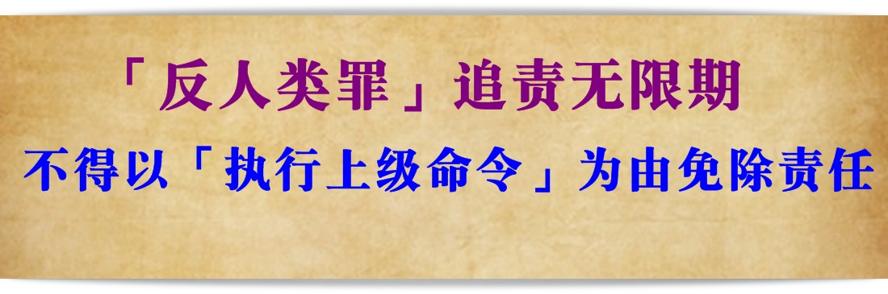

<table>
<tr>
<td width=900>
<h3 align="center"><b>「反人类罪」追责无限期 中国仍有罪行正在发生</b></h3>

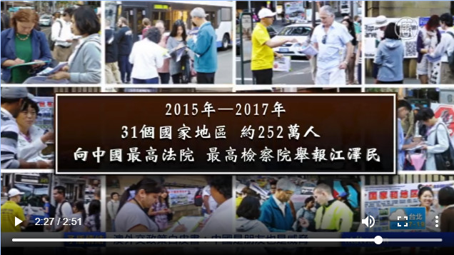

【新唐人2017年11月22日讯】穆拉迪奇因犯下反人类罪，被判无期徒刑。但是，此刻就在中国大陆，依然有反人类罪行正在发生，而这些可怕罪行的主犯们至今依然没有得到法律的制裁。

二战后的纽伦堡大审，第一次确立了“反人类罪”和“战争罪”等罪名。

1998年的《罗马规约》，进一步明确“反人类罪”是指，国家或组织，为推行攻击平民的政策，广泛而有系统地，对平民进行谋杀、酷刑、强奸，以及政治、种族或宗教迫害等。

朱婉琪：“我们从联合国一连串的酷刑报告可以了解到，今天在中国大陆对于法轮功学员所进行的灭绝、酷刑，可以说是当前还在进行，还没有被绳之以法的“反人类罪”的典型。”

中共党魁江泽民1999年下令镇压法轮功，并下达了“名誉搞臭、经济截断、肉体消灭”的灭绝政策。

18年来，联合国人权报告，以及人权组织“大赦国际”、“自由之家”等，记录下数以千计的法轮功学员遭酷刑、性侵、甚至虐杀的案例。

法轮大法明慧网统计，目前至少有4154位法轮功学员被迫害致死。但由于中共信息封锁，真实数字可能不止于此。

另外，多个医学法学专家及团体，也都调查证实，中共强摘法轮功学员等良心犯的器官用于移植。美国国会还因此通过了343号决议案，谴责中共强摘器官暴行。

“海牙国际法庭应调查中国无时不在发生的、粗暴践踏人权和反人类的罪行。”

活摘器官是反人类的罪行，太可怕了。

“正在进行的反人类罪行必须停止，那些参与者必须被绳之以法。”

为了中止这项反人类罪行，法轮功学员已在全球30多个国家，把江泽民等近60名中共高官告上法庭。

过去2年来，全球31个国家地区的252万人，也向中国两高刑事举报江泽民，要求审判江泽民的反人类罪。

朱婉琪：“我们必须严肃的说，法办江泽民结束迫害，不仅是中国的当务之急，也是全人类在20世纪，面对二次大战纳粹进行种族灭绝政策之后，再次面对中国的、中共的群体灭绝政策的一个重要的表态问题。”

反人类罪的原则之一，是“罪责自负”，不得以“执行上级命令”为由免除责任，并且无限期追诉。

新唐人记者林澜纽约报导

<a href=#list><h4 align="right">回目錄</a></h4>

<h3 align="center"><b>警察及社区人员　你违法了</b></h3>
 
 
【明慧网二零一九年五月三日】二零一七年年初到中共“十九大”召开前后，全国各地出现的大面积的针对法轮功学员的所谓“敲门行动”是违宪违法的。所有参与的警察及社区人员不仅严重侵犯了公民的众多权利，而且在程序上也存在众多的违法之处，对此我们也都一一作了阐述。

明白真相者，已弃恶从善，选择了美好未来；不听不看真相、尚未明白真相者，仍在参与对法轮功学员的迫害。

二零一九年进入三、四月份以来，在全国各地又出现了比“敲门行动”还过分的违法行动——对法轮功学员进行骚扰、绑架、抄家；提出对在他们黑名单上、失去跟踪（不在其所谓的监控范围内）的法轮功学员进行调查；要求：通过监控法轮功学员和家人及亲属的电话；或在乘坐交通工具出行使用身份证；以及各公共场所的人脸识别等监控手段，找到不在他们监控范围内的所谓“失联”者，等等。这里我们再一次指出：你们的“这次行动”违法。

为了完成所谓的上级命令、下达指标，各地区派出所警察或者社区工作人员入户调查、监控法轮功学员，并要填写表格、录像或照相。表格内容涉及提供个人敏感信息，如电话号码、微信号、登录社区通、生活照等个人隐私。在警察看来，这是正常工作，是在执行上面命令，但事实恰恰相反，其行为已经违法。

法轮功学员作为一名中国公民，依法享有法律所赋予的一系列公民权利，如“公民的住宅不受侵犯”、“公民的人格尊严不受侵犯”、“公民的合法的私有财产不受侵犯”、“公民有宗教信仰自由”、“自然人的个人信息受法律保护”等权利。这些公民权利不是哪个人恩赐的，更不准许任何人随意侵犯，尤其是掌握公权力的警察等人员。“这次行动”中，警察及所有参与的人员严重侵犯了公民的众多权利，而且在程序上也存在众多的违法行为：

首先，公安人员执法要出示工作证件及必要的法律文书。警察执法要有两人，并且首先出示警察证。如果要搜查住所，必须出示搜查证，而且该搜查证上要有“搜查原因”、“被搜查人姓名”、“搜查范围”、“发出搜查证的机关及负责人签字或盖章”等内容。搜查情况应当写成笔录，由搜查人和被搜查人签名或盖章。

在“这次行动”中，请问警察，你出示证件了吗？你们随意进入法轮功学员住宅乱翻、乱搜，你们有符合法律要求的搜查证吗？即使你有符合法律形式的搜查证，你也无权搜查法轮功学员的住所，因为搜查是针对已经立案的刑事案件在侦查期间所采取的措施，法轮功学员不是犯罪嫌疑人，也没有隐藏罪犯，你们依据什么事实和法律在“这次行动”中搜查法轮功学员的住所？你们无权搜查，当然更无权拿走（“扣押”）法轮功学员的个人财产。

其次，执法人员执法，要表明执法的事实依据。警察执法除了首先要出示证件外，还要有事实依据。比如说有人打架了，违章了，抢劫、偷盗了，警察可以针对其违法行为执法。法轮功学员都是守法公民，每天正常地工作、生活，没有任何违法行为，警察没有权力索要法轮功学员的个人信息或登门盘问。因为法律针对行为，而不能针对思想。

再次，警察执法，除了事实依据外，更重要的是要有法律依据。“法无授权即禁止”，这是“行政合法性原则”的基本要求。没有法律依据，不仅违法，而且侵权，应当承担侵权责任或国家赔偿责任。在“这次行动”中，警察称自己是执行上级的命令。但是这个上级命令是与宪法和法律相冲突的违法性命令，不仅不能作为执法的合法依据，反而是侵犯公民权利的罪证，因此，警察拿不出这个违法文件，即使有这个非法文件，警察也不敢出示。

在警察的任何执法过程中，都需要出示证件、说明执法的事实依据、提供执法的法律依据，没有事实和法律依据，警察随意传唤公民去派出所问话、随意登门采集个人信息、索要身份证明、驱逐公民在警察所辖地区居住等等行为全部为违法行为，被侵权人可以控告警察的违法行为。

“这次行动”不仅侵犯了众多法轮功学员的宪法权利及民事权利，严重违反了行政法中“依法行政”的基本要求，而且涉嫌刑法中的“非法搜查罪”、“非法侵入住宅罪”、“滥用职权罪”、“抢劫罪”、“非法剥夺公民宗教信仰自由罪”、“非法拘禁罪”等众多罪名。

<b>法轮功教人向善，修炼法轮功合法</b> 

二十年来，全国各地公检法机关在处理法轮功案件时，几乎不加思考地以涉嫌《刑法》第300条“利用邪教组织破坏法律实施”对法轮功学员非法刑事拘留、逮捕、起诉和审判，但事实上这个条文却与法轮功学员毫无关系，中国目前没有任何法律规定法轮功违法。

法轮功教人向善，是能够彻底改变人心的高德大法，与邪教根本不沾边。相反，法轮功教导修炼者以“真、善、忍”为准则，于民族、国家、社会有百利而无一害。正因如此，法轮大法至今弘传世界一百多个国家和地区（包括港澳台地区），法轮功及其创始人获得的各种褒奖、支持议案与支持信函超过3500项。

更重要的是，到目前为止，法轮功在中国是合法的，合乎宪法和法律，迫害法轮功是出于前党魁江氏的旨意，不能代替法律，中共本身迫害佛法和佛法修炼人，才是真正的邪教。

1999年10月30日全国人大常委会通过了《关于取缔邪教组织、防范和惩治邪教活动的决定》，只字未提法轮功，而且，这个立法解释与《宪法》第36条“宗教信仰自由”原则和精神相抵触，因而属于违宪解释、无效解释，不能作为处理法轮功案件的合法依据。

1999年10月30日和2001年6月4日，最高法院、最高检察院两次出台了“关于办理组织和利用邪教组织犯罪案件具体应用法律若干问题的解释”（简称“两高司法解释”），也没有提到法轮功，谁生拉硬套在法轮功学员身上，谁要承担责任。两高司法解释于2017年2月翻新，再次拿出。“两高”对所谓邪教问题的解释，扩大了刑法的范围，涉及到了对公民政治权利的剥夺和人身自由的限制，以司法解释之名，行立法或立法解释之实，明显越权，违反《立法法》的相关规定。同时违反了《宪法》中“公民有宗教信仰自由”的规定，属于违宪、违法、越权的无效解释。

退一步讲，中共“摆在台面”上的规章，如2000年、2005年公安部认定的14种邪教组织，2014年中央办公厅、国务院办公厅及公安部重新认定的14种邪教组织，根本没有法轮功。你们执行的迫害法轮功的“内部规定”，过去见不得光，现在将成为你们犯罪的证据。

最早将法轮功与“×教”扯在一起的是迫害元凶江泽民。1999年10月25日江泽民在接受法国《费加罗时报》记者采访时，第一次提出这个说法。第二天，《人民日报》便发表了同样标题的社论。需要说明的是江泽民的讲话和《人民日报》的社论不是法律，不具有任何法律效力，反而是一种违法行为。

法轮功学员是修炼真、善、忍的好人，法轮功学员也没有破坏法律实施。破坏法律实施的是江泽民及全国各级公检法机关及其工作人员。二十年来，公检法机关不加思考的对法轮功学员随意拘留、逮捕、起诉、判刑。可笑的是，即使警察、检察官和法官也说不出来法轮功学员到底破坏了哪部法律了，破坏其中的哪一条规定了，破坏到什么程度了？

事实上，法轮功学员根本没有破坏法律实施，他们也没有能力破坏法律实施。真正破坏法律实施的是江泽民。他裹挟全国各级公检法机关及其工作人员，共同破坏了《宪法》中“宗教信仰自由”、“言论自由”的实施，滥用《刑法》第300条非法拘留、逮捕、起诉和审判法轮功学员，破坏了《刑法》的实施。

<b>法轮功学员持有法轮功书籍和资料合法</b> 

长期以来，全国各地公检法机关将法轮功学员拥有的法轮功书籍和法轮功资料当作犯罪证据对法轮功学员非法拘留、逮捕和判刑。但事实恰恰相反，按照宪法35条规定，中华人民共和国公民有言论、出版、集会、结社、游行、示威的自由。法轮功学员拥有法轮功书籍及资料完全合法。法轮功书籍是教人向善的经典书籍，拥有法轮功出版物没有任何违法之处；法轮功资料是告诉人们如何在灾难中保平安的福音，散发这样的资料于社会及民众有百利而无一害。

<b>有一条规章不知道您是否注意到</b> 

2010年12月29日，国务院新闻出版总署第2次署务会议通过了第50号文件，该文件于2011年3月1日签发，自公布之日起生效。该文件废止了161个规范性文件，其中第99个废止的文件是1999年7月22日下达的《关于重申有关法轮功出版物处理意见的通知》；第100个废止的文件是1999年8月5日下达的《关于查禁印刷法轮功类非法出版物，进一步加强出版物印刷管理的通知》。这个50号文件在百度上查找“新闻出版署50号令”就可以查阅。

50号文件说明，按照现行的法律规定，拥有法轮功书籍及资料完全合法，拥有、复制、传播法轮功书籍，不能作为给法轮功学员定罪的依据。但是，实践中，仍有许多公检法机关的工作人员将这些合法的书籍和资料当作迫害法轮功的证据，这才是真正的执法犯法。

<b>警察违法意味着什么</b> 

警察作为公务员，既受《警察法》又受《公务员法》的约束。在这两部法律里，都明确规定了警察或公务员的义务和纪律以及奖惩和任免。法律规定公务员年年考核，连续两次不合格就辞退。在当今“有案必立，不立违法”的严管下，迫害法轮功案件的一系列违法环节，都能被控告起诉。一旦立案，永远写进档案，年度考核无法合格，只有下岗。

况且《公务员法》第54条规定：“公务员执行明显违法的决定或者命令的，应当承担相应的责任。”这已经堵死了公务员执行违法决定或命令而逃脱法律责任的退路。《公务员法》与“依法治国”、“依宪治国”、“错案终身追究制”、“责任倒查制”等新的规定，共同斩断了执行违法决定或违法命令而想逃避法律制裁的所有公务人员的任何希望。历史巨变在即，法律必将回归正义。明智的警察，请不要再做江泽民迫害法轮功的替罪羊，坚守自己的良知善念，清醒智慧地作出自己正确的选择。

 
</td></tr>
</table>

<a href=#list><h4 align="right">回目錄</a></h4>
<table>
<tr>
<td width=900>
<a name=5><h3 align="center"><b>全球逾303万人举报江泽民反人类罪行</a></b></h3>
 

【新唐人2018年12月10日讯】全球逾303万人举报江泽民反人类罪行

中国大陆法轮功学员2015年发起的“诉江大潮”，得到全球正义人士的声援，世界各地民众纷纷以刑事举报的方式参与。

在12月10号国际人权日前夕，“全球声援中国民众控告江泽民联署举报活动”的总协调人朱婉琪，公布最新联署数字。

朱婉琪表示, 截止到12月7号为止，全球已经有34个国家、超过303万人向中共最高检察院、最高法院举报江泽民迫害法轮功的反人类罪行，要求法办江泽民。

据朱婉琪透露，在亚洲, 台湾、日本及韩国民众参与举报江泽民的人数最多，其中台湾有106万人、日本有70多万人、韩国有67万多人。欧洲则有27国民众参与，其中乌克兰、以色列、西班牙、俄国及罗马尼亚联署举报的人数最多。

<b>中共活摘器官法庭听证会 伦敦首次开庭</b>

12月8号，全球首个针对中共活摘器官罪行进行听证的民间法庭，在英国伦敦举行第一次听证会。这个法庭名为“独立人民法庭”（Independent people’s tribunal），是由国际组织“终止中共移植滥用国际联盟”（ETAC）主导成立的。

据“大纪元新闻网”报导，这次法庭听证会为期三天，主要是针对中共活摘器官问题在全球范围内进行取证。

法庭由英国皇家御用大律师尼斯爵士（Sir Geoffrey Nice QC）担任主席。尼斯爵士曾主导海牙国际刑事法庭对前南斯拉夫总统米洛舍维奇的起诉。

法庭的其余六名成员也都是国际法、医学、商业、国际关系和中国历史方面的专家。
在8号的听证会上，有10人出庭作证，他们分别是独立调查者、医学专家、遭受中共非法关押的西方人和曾在中国被非法关押、现在流亡海外的法轮功学员和维族人。

<b>《世界人权宣言》70周年 香港团体集会</b>

今年是《世界人权宣言》出台70周年，12月9号，香港支联会等人权团体在西区警署集结后，游行前往中共驻港机构“中联办”，抗议中共政府借口维护国家安全侵犯人权，打压异见人士、宗教信仰人士及少数民众民族群体等，要求中共尽快实践《世界人权宣言》。

抗议人士抵达中联办后，高喊“落实人权公约”等口号，并将声明贴在中联办门外，然后和平散去。

编辑/周玉林

</td></tr>
</table>

<a href=#list><h4 align="right">回目錄</a></h4>

<a name=6>
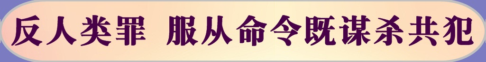</a>

<table>
<tr>
<td width=900>
<h3 align="center"><b>荣慧：反人类罪 服从命令既谋杀共犯</b></h3>
今年七月二十日，中共江泽民集团迫害法轮功整十六年之际，中国最大的门户网站之一网易在首页刊登了一篇文章—《纳粹集中营审判：服从命令即谋杀》。全文摘要如下：

近日，德国地方法院以谋杀共犯的罪名，判处前纳粹党卫军成员、曾于二战期间在波兰奥斯维辛集中营担任记账员的Oscar Goening四年监禁。虽然作为记账员，奥斯卡并未直接杀人，但是按照德国刑法，谋杀共犯的罪名并不冤枉。

一九四七年，波兰开始奥斯维辛集中营审判，四十个被告三十九人获刑，良心医生拒绝上级命令，被无罪释放。以此为代表，德国人开始反思纳粹罪行。

在波兰之后，德国也于一九六三年开始审判奥斯维辛集中营的管理人员，审判地点选在了联邦德国境内的法兰克福，主审法官为Fritz Bauer。二战后，他作为集中营幸存者一直试图清算纳粹，并将纳粹分子绳之以法。在一九五七年，了解到Adolf Eichmann（犹太人“最终解决方案”负责人）藏身阿根廷的他，因为不信任德国具有审判纳粹的能力，将这一情报交给了以色列情报机构摩萨德。正是通过Fritz Bauer的情报，摩萨德成功将Eichmann抓获，并判处其死刑。

Fritz Bauer于一九六三年主持了法兰克福审判，审判对像同样是奥斯维辛集中营相关人员。但波兰审判所根据的是国际法，特别是关于反人类罪的相关规定，以及《国际军事法庭章程》（Charter of the International Military Tribunal at Nuremberg）；而法兰克福审判因为是在德国境内进行，所根据的则是联邦德国的法律。

法兰克福审判针对集中营中下层军官，审判原则很简单：服从上级命令即谋杀共犯。

<b>在审判中，所有被告人都辩称自己“只是服从上级的命令”，而且因为自己仅从事看管或者甄别犯人的工作，并没有亲手杀人，故而不能构成犯罪。法庭则并没有网开一面。根据德国刑罚第二百一十一条关于谋杀罪名的规定，法庭宣布，如果被告人是出于上级命令而杀人，或者虽然没有杀人，但是因为服从上级的命令，参与了集中营日常的管理运作的，即须承担谋杀共犯的罪名。</b>

这样“服从上级命令也是犯罪”的原则，此后被用以指导类似审判。以一九六七年～一九六八年汉诺威地方法院对纳粹德国时期瓦斯车队（瓦斯汽车即Gaswagen，发明于苏联，后被纳粹德国采用，犹太人被关进卡车后方的密闭空间，排气管被接进此空间中，使卡车在行进时能够自然而然地毒死后方的犹太人）领队的审判为例。法院判决中写到：“被告人以领队身份维护瓦斯汽车安全，虽然并没有独立策划对他人的谋杀行为，但仍然构成谋杀共犯。”

一九七九年德国联邦法院规定，因种族原因杀人无追溯时效限制，自此德国对于纳粹罪行无视时间一追到底。

较之于纳粹对犹太人的迫害，中共、江泽民及其协从者对法轮大法信仰者的迫害，其迫害原因更加荒谬，迫害时间更长，迫害手段更加残忍，迫害形式更加隐蔽，直接、间接受迫害者更多，对人类的危害也更深刻。

<b>为什么说对中共、江泽民及其协从者的清算随时都可能发生？</b>

1，法轮大法信仰者十几年来不畏生死的讲述迫害真相，已经在国内、国际造成了巨大的影响。江泽民已经在几十个国家以“反人类罪”、“群体灭绝罪”遭到起诉；揭露中共当局活摘法轮功学员人体器官的电视纪录片已经在多个国家的公共电视台放映；多个国家的议会已经形成决议文件对中共的暴行加以谴责；明慧网、新唐人、大纪元等独立媒体在国内、国际已具有广泛的读者、观众，强大的影响力。

2，已经有超过两亿中国人彻底抛弃中共。中国人的人权意识、法律意识、自由意识已经充份觉醒，从知识份子到蓝领工人，从私营业主到普通打工者，包括所谓“体制内”的所有中国人几乎都在思考、探讨清算中共的话题。

3，中共派系内斗。在巨大的国际、国内压力下，在江系反扑的压力下，中国现任当权派系随时都有可能把江泽民集团的惊天罪恶公之于众，得以彻底的摧毁政敌。

曾经的迫害协从者仍然有救赎的机会，如今的“诉江大潮”就是这样的好机会。

很多派出所警员、社区人员对法轮功学员控告江泽民，乐观其成，他们已经站在了正义的一方，站在了“未来”。

可仍然还是有一些人，似乎失去了独立思考能力，对法轮功学员控告江泽民这种合法权益，进行无理、非法、麻木的打压。

河北省是阻挠法轮功学员起诉江泽民最严重的省份之一，其“省委书记”周本顺已经于今日（七月二十四日）被“双规”，他已经错过了命运为其安排的最后的救赎机会。

希望那些“六一零”人员，“国安”人员，“国保”人员，以及相关的法院、检察院、公安、街道、社区人员，看一看法轮功在国际上的威望，听一听真实的民意，想一想高层政治斗争的必然结局，切莫充当已行将就木的江鬼的家奴和打手，救赎自身的机会不可一失、再失。

文章来源：明慧网

</td></tr>
</table>

<table>
<tr>
<td width=900>
<h3 align="center"><b>反人类罪永不失效！波兰拟起诉共产党时期法官</b></h3>

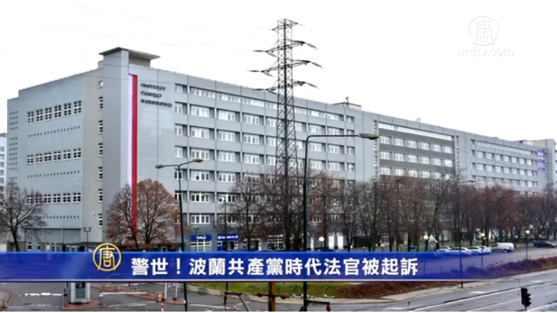

【新唐人2019年03月26日讯】波兰打算起诉一批共产党统治时期的前法官和检察官，他们曾参与迫害反对共产党的政见人士。波兰司法部长说，那些曾从事过卑鄙司法犯罪行为的法官和检察官，要为他们当年的行为承担责任。波兰政府称，反人类罪永不失效！

据美国之音报导，波兰民族记忆学院下属调查局3月20日向纪律法庭提交了诉状，要求取消7名共产党统治时期的法官和检察官的豁免权。

民族记忆学院是专门从事前共产党专制政权的犯罪历史调查和研究的机构。将被起诉的7人包括3名法官和4名检察官，他们曾在1981年∼1982年期间，对至少10名反对共产党的不同政见人士判刑。

波兰司法部长兼总检察长杰波罗当天表示，要让那些曾从事过卑鄙司法犯罪行为的法官和检察官，为他们当年的行为承担责任。

杰波罗说，其中有2人曾在波兰最高法院工作，当中有1人直到去年年末退休前还参与案件的裁决。

波兰在共产党执政时期曾实行军管，引发抗议浪潮，民主反对派“团结工会”发起的罢工运动，经常有数百万民众参加。当时一些反对派人士被抓捕、判刑。

波兰还试图从瑞典引渡前法官米赫尼克，85岁的米赫尼克已在瑞典定居，他曾判处一批反抗共产党的武装抵抗运动人士死刑。米赫尼克曾对自己的犯罪行为后悔，他说自己当时年轻，并没有意识到成为共产主义恐怖的工具。

去年10月，波兰一家法院对米赫尼克下达了逮捕令。今年1月，波兰司法当局请求瑞典方面能同意引渡米赫尼克回波兰受审。一个月前，波兰还特别为此事召见了瑞典大使。

但瑞典以米赫尼克已是瑞典公民及犯罪期已失效，拒绝了波兰的引渡请求。但波兰政府表示，米赫尼克犯下了反人类罪，这个罪行永远不会丧失时效。

大陆法学博士张杰认为，波兰打算起诉前法官的做法是正确的，具有警世作用，人们会减少做恶。他表示，法官是追求正义公平的使者，但却听从上级的指示迫害民主人士，无论从道义上，还是从法律上，他都是负有责任的。听从指示不是脱罪的理由。

张杰还表示，在中国大陆，参与北京天安门六四大屠杀的士兵是有罪的，对709律师迫害的法官和警察是有罪的，新疆集中营对维吾尔人的迫害是有罪的，相关人士都应该受到法律的制裁。通过波兰的案例可以警告中共体制内的官员、警察、法官，正义或许会迟到，但正义终究会到来。今天对别人行恶，迟早也会得到法律的制裁。

海外社交媒体推特上也有评论说，为波兰鼓掌，感觉摆脱了共产党独裁阴影的波兰人民最知道如何正确的追求民主自由。

还有评论称，中共司法系统的鹰犬当引以为戒了！中共独裁暴政倒台灭亡已成定局！不想陪葬的要现在开始行动，否则末班车就要开走了！

（记者罗婷婷报导/责任编辑：文慧）

</td></tr>
</table>

<table>
<tr>
<td width=900>
<h3 align="center"><b>【历史今日】:前纳粹高官危害人类罪被判死刑</b></h3>
【大纪元2013年12月16日讯】（大纪元记者马颖慧综合报导） 前纳粹德国高官，在犹太人大屠杀中“最终解决方案”的执行者，阿道夫•艾希曼（Adolf Eichmann，1906年3月19日－1962年5月31日）于1961年12 月15日在耶路撒冷被以色列法庭以危害人类罪等罪名判处死刑。

据悉，出生于德国索林根的艾希曼在奥地利度过了其童年时代，由于他小时候肤色较深，甚至还曾被同龄的孩子嘲笑为犹太人。

成年后一直碌碌无闻的希尔曼于 1932年加入了奥地利纳粹，由于奥地利纳粹于1933 年被奥地利政府定位非法组织，所以艾希曼离开奥地利前往德国。

1934年由于负责德国南部巴伐利亚州达豪镇达豪集中营（Konzentrationslager (KZ) ， Dachau）希尔曼受到被称为‘金色野兽’、‘铁心肠的人’的纳粹党卫队重要成员海德里希（Reinhard Tristan Eugen Heydrich）的赏识。

1942年1 月20 日，艾希曼在柏林西南部万湖的一个别墅出席了纳粹德国官员讨论犹太人问题最终解决方案的万湖会议，落实了对犹太人系统的大屠杀。 艾希曼在1960年以色列的审判中表示，在万湖会议上那些纳粹德国官员使用了“消灭”（extermination）和“毁灭”（annihilation）等词来形容他们针对犹太人的态度。 
万湖会议之后，艾希曼便被任命为负责屠杀犹太人的最终方案，负责将犹太人移送至集中营的和屠杀犹太人。六百万犹太人由于这个最终方案而死亡。

二战之后，艾希曼被美国俘虏，但是后来越狱逃跑，匿名藏匿在阿根廷的布宜诺斯艾利斯。

在那里，一位大屠杀幸存者的女儿与艾希曼的儿子成为情侣，但是女孩的父亲对于艾尔曼的身份起了疑心，并通报了以色列情报机构。

1960年5月， 十几位以色列情报人员开始了复杂的抓捕行动。 他们当时使用着假名“里卡尔多•克莱门特”的艾西曼偷偷拍照，并将获得的照片与其在纳粹党卫军档案中的照片进行对比，而其耳朵的轮廓透露了他的身份。

于是1960年5月11日，在希尔曼回家的路上，一组以色列情报机关人员将他蒙头塞入汽车中，他们从艾斯曼身上仔细查找档案记录的伤疤，当发现伤疤后，他们知道，他们逮到了希尔曼。

开始审问希尔曼时 ，艾尔曼先报了一个德国假名，后又报了一个阿根廷假身份， 直到第三次，他才承认：“ 我是阿道夫•艾希曼。”

随后以色列的情报人员通过以色列航空公司的一名前雇员悄悄将希尔曼伪装成一个生病的航空公司雇员带离阿根廷，整个过程完全没有惊动阿根廷政府。

当以色列首任总理大卫•本•古里安（David Ben-Gurion）在以色列议会上宣布抓获艾希曼的消息时，举世震惊。艾希曼被以反犹太人罪，反人类罪，战争犯罪和参加犯罪组织等15项罪行起诉。审批持续了8个月，期间99名大屠杀幸存者出庭作证。

但是艾希曼当年对于所有指控，皆以“ 一切都是以命令行事”作答，却引发了人们对于那些执行命令，掌控生杀之权的人的犯法行为的深思。因为二战之后，对纳粹战犯、间谍、告密者的惩办时，他们都自称自己是以服从命令为天职的军人，他们杀人是在执行命令，而按照当时的法律，其行为并不违法。

对此当年美籍德国犹太哲学家汉娜‧阿伦特表示，这是一种被正常化的邪恶，可以使行恶者以职责做借口而逃避灵魂的谴责甚而拒绝承担责任，他们甚至可以将犯罪（谋杀）视为自己的“正当” 甚至“高尚” 的职业，并以罪恶能够让他们升官发财，有利可图，是他们谋生的手段和来源等借口而变成合法的犯罪狂，造成这种反人类罪的罪恶在社会中迅速繁殖，最后波及整个社会，将整个社会拖入罪恶的深渊。

因此，以色列法官最后裁决“ 恶法非法”，表示法律必须体现人性、人道，否则无异于一群强盗制定规则在内部分赃。那些执行纳粹法律的纳粹军官，间谍， 告密者由于执行的是屠杀犹太人的残忍的恶法，出于人道和人的良知，他们都应该拒绝执行这种恶法，可是他们却执行了，这说明他们对于被害人没有最起码的同情心，而他们的行为给受害人带来的灾难性后果，足以定他们为有罪。

虽然艾希曼曾提出上诉，但以色列最高法院最后裁决维持原判，并于1962年5 月31 日夜间被处以绞刑，这是以色列有史以来第一次死刑判决。

（责任编辑：李缘）

</td></tr>
</table>

<table>
<tr>
<td width=900>

<h3 align="center"><b>李毅：由德国清算纳粹反人类罪想起</b></h3>
【大纪元2014年02月08日讯】二战结束至今的近70年里，德国朝野上下配合国际社会持续不断的反思，清算希特勒及纳粹分子在二战期间，对犹太人实施的灭绝人性的大屠杀，犯下的反人类罪。德国总理默克尔曾说：“世世代代的德国人，必须一而再的清楚表明，只要拿出勇气，公民的勇气，人人都可以确保种族主义和反犹太主义无法得逞。”并表示对二战期间，纳粹犯下的反人类罪，德国背负着“永恒的责任”。

德国在反思纳粹的罪行时，经过了由沉默回避、反复争论到公开讨论、深刻反思等不同的阶段，最终在德国形成坚决抵制纳粹思想的共识。尽管反思的过程，充满波折和复杂，但德国政府及民间反思纳粹暴力思想的力度之深，范围之广，时日之久，敢于承认纳粹反人类罪行的罪恶，并敢于承担这一历史责任的巨大勇气，受到国际社会的信赖和尊重。

1958年11月，德国建立了“追查纳粹罪行总部”，开始对数以10万计纳粹分子的罪行案件，进行深入调查和清算。1994年，为防止纳粹势力的死灰复燃，德国议会通过了《反纳粹与反刑事罪法》，该法明确规定：不准以任何形式宣传纳粹思想，严格禁止使用纳粹标志，即使是持“大屠杀否定论”的公开言论与行为也都将受到法律的严厉制裁。在德国领土上，没有希特勒和纳粹首要分子的坟墓及任何纪念物。

1995年，德国政府在柏林市中心修建了“恐怖之地”战争纪念馆，1999年又在柏林修建了纪念六百万遭到纳粹大屠杀的犹太人受害者纪念碑林。所有这些纪念馆，都旨在揭露希特勒和纳粹分子的罪恶和暴行，所有这些纪念活动，德国政要必须参加出席。无论纪念碑，还是纪念活动，都是为了使人保持警惕，看似经济强大文明的社会，都可以在一种暴力思想的控制下，迅速的蜕变成杀人的工具，野蛮的社会。

2004年1月26日，德国政府颁布了《柏林州学校法》，该法明文规定，学校教育的目的，首先是培养学生具有坚决抵制纳粹意识形态，抵制有其他有暴力统治倾向的政治学说。教育青少年一代，正视自己民族历史上的污点，勇于承担责任，已经成为德国社会的责任和共识。

德国在二战后，持续不断的反思，清算和抵制纳粹思想的善政与行为，受到国际社会的赞许和尊重，同时也带给世人很多参考和启迪，尤其至今依然受到共产主义余毒侵害的东欧国家。不久前，由于乌克兰政权迫于俄罗斯的压力，而搁置与欧盟的贸易协定，引发乌克兰大规模反政府示威活动，持续到今天为止（2月7号）已经是第78天，要求背离普世价值的亲俄总统下台。

这场由乌政权拒绝签署与欧盟的贸易协议引发的政治危机，乌克兰民众在大规模抗议中，为了抵制当今乌政权专制的作风，不仅宣布象征旧体制的列宁是土匪，是共产主义邪教头领，而且也数次推倒列宁雕像，并高喊“赶走土匪”，并打出抗议横幅“不要迫害，不要专政”。乌克兰民心民生渴望回归普世价值带来的自由与和谐。这一强烈的去共愿望，像是强大的精神支柱，支撑着乌克兰民众积极寻找解脱共产主义余毒的方式。

为了摆脱近百年来，共产邪恶思想的侵蚀和毒害，乌国民众在遭受了漫长的共产运动带来的苦难，禁锢的痛苦与沉默后，受全球去共运动大潮的影响，也开始积极不断的响应去共趋势。在二零零七至二零零八年，乌克兰共拆除了四百多个参与策划大饥荒和政治迫害的共产主义政权领导人的纪念碑，对三千个以苏共领导人命名的街道名称重新命名。乌克兰新版历史教科书开始反思谴责共产党极权暴政，乌克兰民间也以影视作品的文艺形式，刻画共产主义追随者的滥施酷刑，崇尚告密，灭绝人伦等没有人性的丑恶形象。

乌克兰政权要想摆脱今日政治危机的混乱局面，惟有遵从普世价值，像德国政府反思清算纳粹罪行一样，勇敢的面对苏共共产主义带来的民族灾难，正视苏共对乌克兰犯下的反人类罪，彻底抛弃共产主义余毒思想，及旧体制的专政统治方式，方可还民心以安康，国家以太平。

</td></tr>
</table>

<a href=#list><h4 align="right">回目錄</a></h4>
<a name=7>
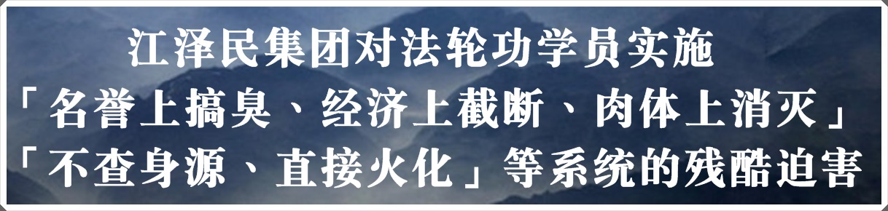</a>

<table>
<tr>
<td width=900>
<h3 align="center"><b>水刑、秒饭、禁止排泄、死亡护理</b></h3>

<h4 align="center">列举中共酷刑害人手段</h4>

【明慧网二零一九年三月十日】（明慧网通讯员综合报道）在中国大陆，通常应该受人尊敬的大学讲师、机关干部、成功商人、朴实农民，只因维护自己对真、善、忍的信仰、知情权而言论自由，就无辜被中共恶徒投进监牢，遭受着种种灭绝人性的虐待和侮辱。

在中共监牢里，法轮功学员不仅承受着一般刑事犯所遭受的打骂、超负荷奴役劳动，还被逼迫放弃信仰，骂大法、骂师父。而监狱里对法轮功学员搞“转化”迫害又是经常性的，“转化”指标层层压下来，和狱警的奖金奖励挂钩，和犯人的加分减刑挂钩，不“转化”就株连监室里所有在押人员，因此犯人和狱警都特别卖力，使每次迫害都极其残酷。对法轮功学员来说，几乎每一次“转化”迫害都是生与死的考验。

有的男法轮功学员被毒打后，脑袋严重变形，肿大得大出好几圈，呈紫黑色，眼睛只剩一条缝，有的犯人看到都非常震惊，气愤地说：“太狠了，这帮畜生！告他们！”也有的女警看到女学员被毒打后的样子惊异地说：“谁这么缺德，给打成这样，你不就是炼个功吗？！”很多善良人听到法轮功学员的遭遇，都气愤地说：“去告他们！”

有太多迫害真相还被中共掩盖着，本文仅将中共迫害手段中的“水刑”、“饿刑”与“禁止排泄”列举出来，让人们知道法轮功学员为坚持信仰、为了向人们讲述事实真相，付出了怎样的代价。

<b>一、水刑</b>

水刑，被称为世界上最残忍的酷刑之一。就是人平躺在地上，手背后面，双手双脚被胶带紧紧地捆住，嘴里塞满袜子，再用胶带封严。然后施刑人用胶皮管子，不停的往其脸上浇水。因为嘴被封住，手脚被捆住，只能用鼻子喘气，而不停的浇水，人就会被呛得……很容易被呛死，就象被反复溺水，大脑变得一片空白，然后背过气去。据说，上吊和溺水自杀的人，救过来后不会再以这种形式自杀，就是因为太痛苦。而水刑则是让人反复经受溺水之苦。受过此刑的人都不敢回忆那段痛苦的经历，实在太恐怖了，无法用语言形容。

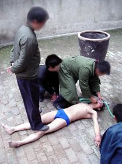

酷刑演示：浇凉水

这是辽宁马三家劳教所迫害法轮功学员的手段之一，黑龙江牡丹江监狱曾去学习“经验”，牡丹江监狱各监区转化法轮功学员的主要负责人到马三家劳教所学了一个月，回来后就给法轮功学员普遍实施这种水刑。

另一种水刑是冬天把衣服扒光后，让人站着或坐在地上，窗户都开着，再敞开门冻着，用水管长时间不停地往人头盖骨的百汇穴部位浇凉水，开始感到异常寒冷，渐渐的感到脑袋麻木，后来逐渐的脑袋象要裂开了一样，脑浆崩裂般剧痛，痛在脑仁里面。这种用小水流浇头盖骨持续时间非常长，比一盆盆泼凉水要残忍得多，难受得多，脑袋会象要裂开了一样。这种酷刑在黑龙江海林看守所和牡丹江看守所都有。

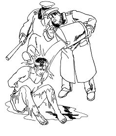

中共酷刑示意图：浇冰水

牡丹江市三十六岁法轮功学员王小忠曾遭此酷刑。他于二零零一年八月十七日被牡丹江阳明分局恶警绑架后，遭殴打与电棍电击，满身伤痕，被送进看守所后再用水管浇凉水，被非法抓捕后第十二天即被迫害致死。去世前一天他妻子去探视时，王小忠对妻子说，警察用电棍折磨他，伙食也极差。第二天王小忠便死在狱中，第三天家属才得到通知。看守所为推卸责任，谎称王小忠是得病而死，却将他的心、肝、肺都挖出来冷冻。据悉，王小忠死后，牡丹江看守所副所长被撤换，浇凉水酷刑被停止。

<b>二、饿刑</b>

一个好端端的人被长时间饥饿着、熬困着、冰冻着，一天、两天、一个月、两个月……最后瘦成皮包骨活活饿死，耸人听闻吗？而如此残忍的事实就发生在我们身边。

明慧网文章《鲜为人知的中共“饿刑”》中讲到嘉州监狱特有的刑罚吃“秒饭”，吃饭时间只给二十秒或十几秒：一般关押者被罚吃“秒饭”时间为三天、五天、十天、十五天不等。但是四川成都法轮功学员程怀根从二零一七年一月下旬直到二零一七年五月中旬，吃了三个多月的“秒饭”。在二零一七年五月二十九日被迫害致死，年仅五十四岁。程怀根就是被活活饿死的，而被饿死的实例在很多监狱都有，形式多样。

在黑龙江新肇监狱有个服刑的无期犯人于军修，是浙江人，他于一九九七年通过狱中警察介绍修炼了法轮功，曾将“法轮大法好”字条粘在监狱的大墙上。二零零零年于军修被转到牡丹江监狱迫害。

因坚持信仰真、善、忍，二零零三年春，于军修在十四监区（现九监区）被恶警林黎明和刘平长时间关禁闭，并被“定位”迫害。小号的恶警几乎都打过他，尤其林黎明、刘平、许树军最甚，经常用“小白龙”（白塑料管）抽他，许树军用电警棍电击，一电就是一个小时。那种高压电棍长时间灼烧很残忍，烤出大泡后再电，那时是最痛苦的，最后就能把皮肉烧熟、烧焦了。

酷刑演示：电棍电击

而最折磨人的却是长时间的冷冻与饥饿。在小号内没有被褥，每次只给小半块馒头，监区里没油带泥的白菜汤也不得喝，只能接暖气管里的水喝，还得限量，甚至多少天也不给水喝。一般的刑事犯，蹲小号几天就会被饿、被冻得叫他下跪磕头做什么都行了，被整得服服帖帖的。而法轮功学员因为坚持信仰，不写所谓“转化书”、“揭批书”，被长期关小号，经常被关一个月、两个月，甚至半年以上。

于军修就被关小号半年，等放出来没几天，就于二零零三年八月十日被迫害致死，还不到四十岁。和于军修一起被关押的法轮功学员于友、商贵民也备受恶徒折磨。

想想吧，独自一人被关在狭长、又高、又冷的禁闭房里，一次只给小半个馒头，这样一天天、一月月，一般人不被饿死也会疯掉，于军修是以惊人的毅力支撑了几个月的，已经是奇迹了。

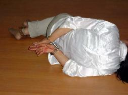

演示：关小号

按规定，关禁闭（关小号）是不能超过一个月的，否则很容易死人。但狱警经常是把法轮功学员关半月、一月后，放回监室呆几天，再关进去，又从新算起。牡丹江法轮功学员黄国栋就被关小号半年多，他后来绝食抗议迫害，就不那么饿着他了，才熬过了半年多的小号折磨。但终因多种酷刑摧残，黄国栋被放回家后于二零一七年十月三十一日含冤离世。

在牡丹江监狱，曾有个刑事犯想逃跑，被关小号惩罚。他是个年轻小伙子，长得很壮，关小号两个多月回来后，瘦得皮包骨，只见薄薄的一层皮紧紧贴在骨头上，骨头的所有棱角都清晰可见。

那种长时间饥饿不是一般人能想象得到的，因为生理反应，每个细胞都会感到饥饿，看什么都想吃，似乎吃成了唯一的欲望。有些人最后出现幻觉，看着灯泡变成了蛋糕，瞅什么都是蛋糕，都是好吃的。这时人已经快不行了，就如《安徒生童话》中卖火柴的小女孩在点燃的火柴中看到了烤鹅，然后很快就死去了。

更为阴险的是，监狱往往先多给吃的，每顿两三块发糕随便吃，让人吃得饱饱的，把胃撑大了，然后突然不给什么吃的，长时间饿着，胃撑大后再饿着，那种滋味……

在《中央美院毕业生许文龙被转入齐齐哈尔冯屯监狱》一文中详述了法轮功学员许文龙在泰来监狱被关小号的经历：“那是怎样的折磨啊？一月的泰来温度在零下二十五摄氏度以下，小号的窗户透风，格外冷，里面没有被子和枕头，只有一个饭盒，每天给两口面汤喝。”许文龙身上的衣服还是北京发的，很薄，又加上身上还有手铐与冰冷的脚镣，更是冷得无法睡觉。晚上偶尔能躺在冰冷的地上睡一会儿，又会被地面冻醒了。在饥寒交迫的折磨下，被迫害两个星期后，许文龙已经瘦得不成样子，但狱警仍不放过他。

又过了两周，二月十三日左右，指导员郑辉和武钢到小号里跟许文龙说：“你不写悔过书就别想出去。”许文龙还是坚持不写。

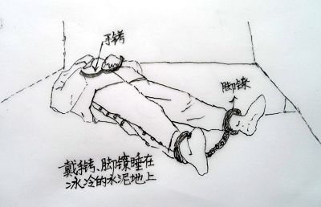

图：关在小号中，许文龙睡在冰冷的水泥地上

许文龙每天戴着手铐脚镣，身上没有热量，在冰冷的地上冻得瑟瑟发抖。每天那点面汤给的又少又没油，因吃的太少，他饿得躺在地上，两条腿却又不敢摞在一起，因为腿上的骨头会硌得生疼。许文龙被迫害得严重便秘，十九天都大便不出来。许文龙就这么长时间被冰冻着、饥饿着、熬困着，每分每秒都在死亡线上痛苦挣扎着，度日如年。

二零零四年九月九日，在牡丹江监狱，法轮功学员金宥峰、高云翔、关连斌再被关小号（禁闭室），脚戴三十八斤镣子，手戴手捧子，再用铁链穿上与脚镣一同被“定位”十五天。

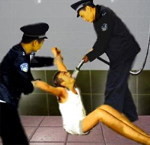

酷刑示意图：灌水

关小号第二天，他们就被强行灌食，灌大量的生玉米面、辣椒面等，都冒到体外，呛到气管，灌完就泻肚。姚国财被灌入气管，险些失去生命。金宥峰被自称“万魔之王”的狱警司海涛领犯人堵住鼻孔强行灌水，不知道灌了多少瓶水。小高喊了一句“法轮大法好”，有个脸上长黑痣的恶警拿起高压电棍就电他，把他浑身上下敏感部位电了个遍，最后把电棍停在他裆部电个不停。有一个姓宋的恶警用电棍长时间电小高，见没反应，气得把电棍扔在一边，对小高拳打脚踢，当时小高感觉自己的头都变形了。金宥峰、关连斌也遭到毒打、电击。电棍放电时发出刺耳的劈啪声，并可闻到肉皮被烧的焦糊味。

由于手脚都被锁着，大便都拉在了裤子里。最难以忍受的是寒冷，那时是九月下旬，小号里面和外面不一样，因铺面与四面墙都是水泥的，里面阴冷阴冷的。有的恶警晚上还故意把窗户打开，刑事犯穿棉衣都喊冷，可三位法轮功学员只让穿着衬衣衬裤，加上戴脚镣的原因，小高的腿冻得又红又肿。金宥峰高喊：“一定要坚持住！不然恶警会用这方法迫害其他人的。”

金宥峰

他们被如此折磨十四天时，一恶警问他们转不转化？三人异口同声地回答：“不转化！”恶警骂了一句就走了。第十六天他们被放回集训队，小高去卫生间时一下昏死过去，苏醒过来时看到一个犯人在给他头部止血。关连斌被迫害得更严重，刚三十岁的小伙子，上楼梯都费劲了。

金宥峰是原牡丹江师范学院体育系讲师，非常善良正义的一个人，于二零零九年一月二十一日被迫害致死，年仅四十六岁。

法轮功学员无辜陷冤狱，一般人可能觉得他们只是失去了自由，吃的差一些，偶尔被打，而他们实际经历的却是九死一生。很多法轮功学员都是都是凭着对大法的坚定信仰，一次次出现奇迹，才能以超凡的毅力走过那种种酷刑、种种屈辱，多少次在鬼门关前与死神擦肩而过。而他们遭受折磨的原因只是他们不放弃对真、善、忍的信仰，不“转化”。

<b>三、禁止排泄</b>

吃喝拉撒睡是人的生理需要，如今却都成了中共迫害法轮功学员的手段。据明慧网二零一二年六月二十八日《牡丹江中共人员迫害法轮功事实综述（三）》报道，牡丹江第二看守所规定大便三分钟，而在第一看守所则被限制在两分半，若不起来就拳打脚踢。很多时候刚开始排便就到点了，只好憋回去，有时候得憋很长时间才能憋回去，很多人憋的肚子痛。用手纸成了非分之想，谁能想到中共的看守所内如厕后是如何擦屁股的？！给一矿泉水瓶自来水，自己将水倒在右手心里，用手心盛着水去洗肛门排泄物，一边被拽着往上起一边洗。水用完了，可是还没有排泄完，就必须憋回去。被强行拽起来，这时手还没洗哪，甚至手上还粘有排泄物。被关押人员不乏艾滋病、性病、乙肝、开放性肺结核、疥疮、阴虱等传染病毒携带者，不时向那奇痒处抓挠，而且如厕后大多数人不洗手。而看守所强制奴役在押人员干手工活，装筷子、挑牙签等，这些包装精美却带有大量细菌、病毒的“卫生”筷子就从这里流向市场，到老百姓的餐桌 上！

在中共监狱里，长时间禁止排泄是一种隐形却很邪恶的迫害形式。有的犯人头声称“屎憋三天，尿憋一天，憋着！”不让排泄是非常难受的，那时真感到活人能让尿憋死。因身体生理反应，渐渐的越来越难受，坐着不行，站着也不行，怎么都难受，肚子憋得非常痛，膀胱和肠道都能给憋坏了。有些人实在憋不住了，就被迫便在裤子里。因为憋的时间太长，不是正常排泄，排泄量非常大，恶臭恶臭的，恶徒再反过来极力羞辱你、折磨你。

中共监狱的狱警为强制“转化”，还故意把凶悍的杀人犯、有暴力倾向的精神病犯人调到法轮功学员床铺边，构成死亡威胁，并且教唆精神病人：“你打死人也没事，不犯法。”还有的法轮功学员拒绝被狱警调过去的同性恋犯人侮辱，也被一次次毒打。

在监狱里患病很常见。因监狱劳动车间里产生的粉尘非常严重，长期吸入后，很多人患上肺结核，而在押人员的饭碗混用，并在一起洗碗，无任何消毒，加上长期重体力劳役又严重缺乏营养，造成肺结核泛滥。法轮功学员同时还因信仰被饿饭、强制灌食、灌水、呛水等，以致不少人也患上肺结核。而狱警和监狱医院交代，“不是特别严重的不要告诉本人”，以至于很多人被查出来患肺结核或肝腹水时就已经是晚期，没法治了。

患病住院后就更可怕了。监狱医院有一种“死亡护理”，极其恐怖。共有四个犯人，名义上是护理生病的在押人员，而实际上就是让病人在规定的时间内死亡。狱警交代给“死亡护理”的犯人，“三天死”，或者“四天死”，护理犯人就得按照警察规定的时间让其死亡，不能超期。那就是各种各样的折磨与虐待，比如，大冬天大便后给扔地上，用水管子没头没脑的往其身上一阵冲凉水，冻得透心凉，然后抬回去再往光板铺上一摔。病人往往都是很瘦的，用冷水冲完再这么一摔，会非常痛苦。为了不再承受这种折磨，有的人只得不吃不喝，不长时间人就会死了。也有的遭受各种殴打折磨，如若揭发，就会受到更加严重的折磨。

中共监狱里的种种酷刑，堪比“纳粹集中营”，法轮功学员在监牢里时时面临着死亡威胁，所承受的都远远超出人类所能承受的生理极限，没在那个环境中，是很难体会那种生不如死的痛苦的，也难以用语言准确描述出来。

自古制造酷刑的终将自尝恶果。真心希望中共监狱、看守所里的警察，静下心来想一想，你们是否也希望自己和孩子生活在一个真诚、善良的社会，是否希望父母和家人生活在一个平和、宽容、忍让的环境？法轮功学员所做的就是这些。哪怕你自己达不到这个境界，至少不要再伤害这些善良的好人吧，他们所做的一切是福益中国每位同胞的，其中包括你。

也希望公安局、检察院、法院的人静下心来想一想，当你抄家抓人的时候，当你“一锤定音”的时候，这些善良的法轮功学员将经历怎样炼狱般的折磨。虽然你没有直接参与殴打、折磨这些修心向善的好人，但他们的被迫害，却是因为你们的非法抓捕与构陷造成的，他们承受的每一种酷刑虐待，都有你的罪责在里面。一个修佛向善的好人，因为你们的抓捕、冤判，最后被折磨致死，这个罪过能小吗？人在做，天在看，好人被折磨死了，这个账上天可都在记着呢，你将怎么偿还？！

况且，即使按照中国现行法律，修炼法轮功也是合法的。二零一一年三月一日，《中国新闻出版总署署长柳斌杰发布第五十号令》，公布废除包括两个禁止法轮功书籍出版的相关性文件，法轮功书籍出版禁令也被废除。

诚心希望公检法人员，不要再因眼前利益驱使就做出这种违背天理良心的事。善待好人，就是善待自己和家人的未来。

更多请翻墙看明慧网 http://www.minghui.org/   

免費翻墙 https://git.io/opopop   

</td></tr>
</table>

<table>
<tr>
<td width=900>
<h3 align="center"><b>长夜将尽－－法轮功学员的故事</b></h3>

<h4 align="center">文 ◎ 齐先予 图 ◎ 明慧网</h4>

陈运川是河北张家口怀来县北辛堡镇蚕房营村的老农民，今年快七十了。一九九七年七月，陈运川听乡里人介绍法轮功，照着学炼后，多年的腰腿痛不治而愈。于是陈运川的两个双胞胎儿子陈爱忠、陈爱立，小女儿陈洪平，还有出嫁到北京延庆的大女儿陈淑兰和外孙女李颖都来学炼了。看着家人神奇的变化，起初不信法轮功的老伴王连荣九九年也开始尝试，几个月后老太太三十多年的关节炎、咳喘病没吃药也好了，脾气也好多了。村民们见状纷纷学炼法轮功，大家都羡慕老陈家勤劳忠厚、和美兴旺的好日子。

在中国东北的黑龙江华楠地区，今年七十三岁的曹倩老人（人称白妈妈）也有类似的经历。曹倩是名音乐教师，当年响应号召去了北大荒农场，一待就是一辈子。然而两个儿子很争气，先后成为全县高考文科状元。大儿子白晓钧考上了东北师范大学，小儿子白少华考上了中国人民大学。当地几乎人人都知道白妈妈家有两个才华横溢的好儿子。

白晓钧从小就博览群书，高中就开始钻研黑格尔、费尔巴哈的著作，他认定哲学是世间最高的学问，于是哲学系毕业后留在长春做了大学编辑。一九九三年正在研究道家和佛家理论的他，听完李洪志老师的学习班后，觉得法轮功才是真正的科学。那次他还亲眼看见一个肚子里有个十多斤肿瘤的人，全家跪在地上求李大师破例给他治病。只见李老师用手向那人肚子一抓，那人鼓鼓的肚子瞬间就扁下去了，肿瘤不见了，在场的人个个惊得目瞪口呆……

很快他们全家都学炼法轮功了。白妈妈的老年病好了，白少华更是从理性上认识到法轮功的珍贵。当时正在人大读书的白少华铭记师父的话：“一个修炼人你在哪里都必须是个好人。”他不但学习努力，同学们经常见他一手提两到三个开水瓶，满头大汗的楼上楼下跑好几趟，默默的帮周围寝室的同学打开水。毕业后在单位里他也被评为先进员工，总经理在大会上表扬他：“领导在不在时都一样肯干，指甲盖撞坏了，还跟大家一起搬货……”

在工作上他默默干的活是别人的五、六倍，同事们都说：“要都像你们炼法轮功的这么干，公司早好了！”公司总经理也感慨的说：“用人得看品德呀！我招聘了三十多个员工，只招了两个好员工……”他不知道除少华外，另一位女员工也是炼法轮功的。在少华的感染下，不少同事也成了法轮功学员。新奥特集团的老总曾公开表示他们招聘员工，法轮功学员优先，这在北京商业界成为佳话。

九九年四月二十五日，白妈妈全家都去了中南海上访，因为他们不能听任谎言欺骗那些不了解法轮功真相的世人。少华还感慨的写诗一首：“法轮大法好，世人会知道，何能鹿为马，谎言加残暴！”通过几年的修炼他渐渐明白，修炼人要站在有益众生的角度想问题，要修成“无私无我、先他后我”的正法正觉，要用自己对真善忍坚定的守卫，在众生心中立起一座永不坍塌的正念之塔。

跟老白家的经历相似，陈运川全家“四二五”也分头去了中南海。没想到从那以后，相同的厄运降临到这两个素不相识、也完全不同的家庭中。

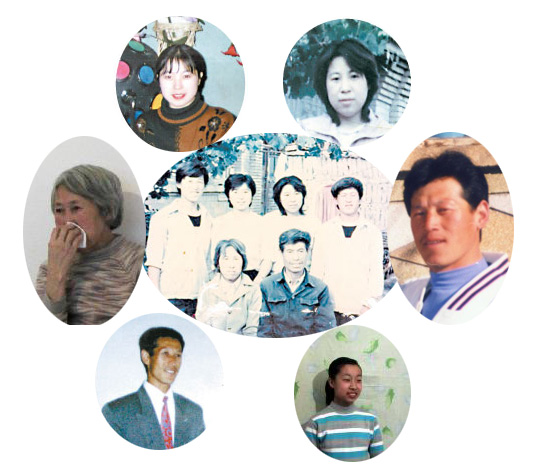

陈运川全家合影：失去三个儿女的王连荣二儿子陈爱立死时三十六岁、大儿子陈爱忠死时三十三岁、小女儿陈洪平死时三十二岁。唯一幸存大女儿陈淑兰。李颖（十三岁），陈淑兰的女儿，在母亲、外公外婆被关押、两位舅舅一位小姨被迫害致死后，被北京昌平“六一○”送入敬老院。（图片摄于二零零五年三月）

<b>一家七口的苦难</b>

九九年七月二十日，陈运川全家七口再次去北京上访。从那以后，绑架、毒打、遣返、抄家、罚款、监禁、劳教伴随着全家。为还法轮功清白，他们曾三次全家进京上访，二零零零年十月那次为了绕开封锁，全家人翻山越岭，走了三天三夜才到达北京。最后一次是二零零一年元旦。据公安内部消息，当时在北京上访的法轮功学员达一百多万人，北京看守所装不下，于是才有了大陆老军医举报的三十六个秘密集中营以及后来的活摘法轮功学员器官。

元旦那天陈家人全部被抓，从那以后，陈运川再也没有见过他的大儿子陈爱忠。在北京看守所里，陈爱忠被警察连续酷刑折磨了七天四夜，三十万伏高压电棍几次把他电击得昏死过去，上身、阴部、脸上、胳膊上大片水泡连成一片。警察还将他脱光衣服埋在雪里冰冻，还用一种叫“开锁”的酷刑，把他的手指折磨得皮开肉绽、血肉模糊。

即使这样，陈爱忠也一直高喊“法轮大法好”，在被判处三年劳教后，陈爱忠被转移到唐山市荷花坑劳教所。到那后的第八天他就被警察迫害致死，年仅三十三岁。人们看见他遗体肩膀到后背大片青紫，两个耳朵黑紫流血，嘴唇有血。

二零零一年六月陈洪平在讲法轮功真相时被警察抓捕，在经历了“老虎凳”、“吊挂门”等酷刑折磨后，她依然坚信“法轮大法是正法”。在河北高阳劳教所里，警察除了毒打、熬鹰（不许睡觉）外，还用精神药物摧残她。一年半的非人折磨使昔日健美的姑娘只剩下一包骨头，最后在二零零三年三月五日永远的闭上了眼睛，死时三十二岁。

陈爱立在唐山冀东监狱时，曾被持续绑在椅子上整整四十多天，给他灌食的管子也一直插在肚子里四十多天，等拔出来时管子都黑了。监狱还给他灌损害神经的药，每天六、七个人看着他。二零零四年在洗脑班里，他被折磨得生命垂危，从那出来不久就去世了，死时三十六岁。

陈淑兰是陈运川四个孩子中唯一幸存者。她二零零二年九月遭绑架后，被判刑七年半，至今仍被关押在北京大兴女子监狱，而她十三岁的女儿李颖则被北京昌平“六一○”送入敬老院。除上学外，这个敬老院中唯一的儿童没有任何人身自由。

在承受失去三个儿女巨大悲伤的同时，王连荣还不得不面对随时可能的抓捕。她多次被关进洗脑班，在精神和肉体上遭受过多种摧残。二零零六年八月四日，痛苦的老人停止了呼吸，终年六十五岁。

修炼法轮大法后精神焕发的白晓钧。

<b>不倒的正念</b>

二零零零年七月白晓钧去北京上访后被非法劳教一年，随后又被无故加刑三年。期间他遭遇了怎样的折磨，外人不得而知，直到二零零三年七月十八日他被折磨死后，白妈妈才接到劳教所通知去领尸体。被疥疮、肺结核和酷刑折磨得变了人形的他，半个肺全烂没了。大夫只敢悄悄告诉悲痛欲绝的白妈妈说：“这不是正常死亡。”高考状元、哲学才子，三十六岁时就这样走了。

正如当年林昭被枪决后，警察朝她母亲索要五分钱子弹费一样，劳教所害死白晓钧后，还朝白妈妈索要一万五千元医药费。此时白发人送黑发人的白妈妈，抱着大儿子的骨灰，想到的只有一件事：绝不能再让劳教所夺走二儿子的性命。

当时白少华正被关押在北京团河劳教所。自从九九年七二零以来他先后六次被抓。他曾被恶警打伤腿骨，他曾被掐住脖子差点窒息而亡，他曾被灌食浓盐水出现盐中毒，他曾用生命绝食抗议迫害一百多天……那血肉之躯的痛苦煎熬是没经历过的人很难想像的。

在被称为“人间地狱”的劳教所里，每一天都面临着生与死的考验，然而白少华的心是慈悲安详的，哪怕面对那些折磨他的恶警，他也用善心一遍遍的给他们讲述法轮功的美好，不少警察都发生了改变，他的环境也变得相对宽松。法轮功没有敌人，他们所做的只是为了帮助被谎言毒害的人。从白少华的诗词和画画中，人们不难看到他坚定祥和的心。

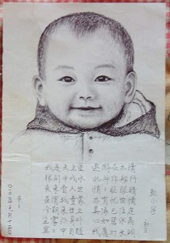

二零零三年白少华被非法关押在北京团河劳教所时画的女儿真宇画像。

<b>中领馆前和平抗议</b>

二零零二年六月五日，当高郁冬和其他英国法轮功学员决定在伦敦中国大使馆对面，轮流进行二十四小时不间断和平抗议时，他们想到的只是如何尽早结束这场绝对不该发生的悲剧。她说：“迫害一天不停止，我们的抗议一天不结束。”

从那以后快六年了，两千多个日日夜夜，无论零下十几度的风雪夜，还是摄氏四十度的烈日天，路过中使馆前波特兰大道的人们总是看见露天大街上，一两个法轮功学员静静的坐在那，他们或在祥和的音乐声中打坐炼功，或在路灯下捧书阅读，或在雨伞或帐篷下暂避风雪。他们中有白发苍苍的西人退休教师，有大学教师、医生、计算机公司老总、有博士、硕士、大学生，也有家庭妇女。

在伦敦某金融投资公司上班的高郁冬，她的每一天都是事先安排好的。有时她早上三点就得起床，坐一个多小时的夜班汽车赶到大使馆前接替守夜的同修，然后在九点前赶去上班。六年多来早已习惯风霜雨雪的她，总能在别人眼里的苦中找到欢乐。她说：“看着朝阳慢慢升起，我站在炼功，那种天地合一的感受非常美妙，仿佛我都融化在天地间了。能修炼法轮功真幸福。”

有时她下班后直接赶到使馆前，一直到深夜同修来替换时才回家吃饭。六年来她和朋友们就这样默默的坚持着。慢慢的伦敦人被感动了，连远在北部的爱丁堡人也都知道中国大使馆前法轮功在抗议。经常有人在寒冷的冬夜给他们送来衣物和热茶，还有西方人专门请假到使馆前陪他们一起静坐，不少民众赞叹说：这是世界上最能打动人心的和平抗议。

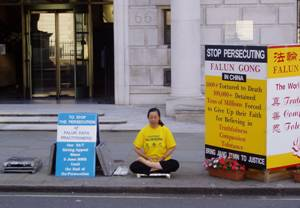

英国法轮功学员在中国驻伦敦大使馆前的二十四小时露天抗议已快六年了。

<b>为了世人承受折磨</b>

法轮功学员的故事还没有讲完。目前白少华的妻子季蕾还被关押在高阳劳教所，他们的女儿小真宇八岁了，只能和奶奶艰难的生活着。白少华最近一次被绑架是在今年二月二十日的开车路上，被警察以奥运“安检”为名拦住，随即被关进怀柔区看守所。警察将他用铁链吊打了五天五夜，一度出现生命危险。目前他已被转移到郑州市白庙劳教所继续遭受迫害。

陈运川老人尽管失去了所有亲人，但他对法轮功的坚定没有变，他对世人的热爱也没有变。据海外得知的消息，去年四月二十五日，他在讲真相时再度被抓。警察曾把他拷在“老虎凳”上三天三夜。

白少华离开劳教所后补做的“圣女泪”，又名《正法女神》。

面对酷刑，他们只要说一声“不炼了”，就能跟其他人一样的生活，只要他们不管那些被谎言毒害的世人，就能在家里过上你我他那样轻松的日子。

他们没有这样做。因为真善忍赋予的道德力量促使他们承担起为他人负责、为世间正的因素负责的道义担当。在迫害发生的每分每秒，他们坚守信念的每一举动都是反迫害的标志，在谎言与真相较量的日子，他们每一个唤醒世人良知的行为，都在为人间增加正义的力量。

暗夜终会过去，然而破晓前夕，迫害仍在持续，法轮功学员用生命实践着“真善忍”……

更多请翻墙看明慧网 http://www.minghui.org/   

免費翻墙 https://git.io/opopop   

</td></tr>
</table>

<a href=#list><h4 align="right">回目錄</a></h4>
<a name=8>
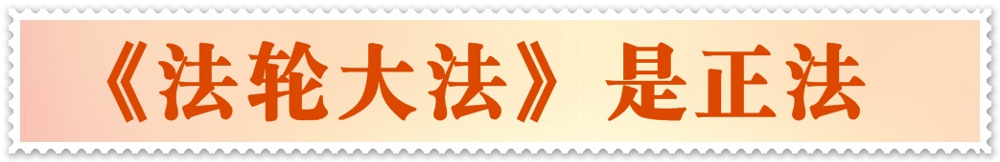</a>

<table>
<tr>
<td width=900>
<h3 align="center"><b>法轮大法是正法</b></h3>
<h4 align="center">——写于法轮大法洪传16周年纪念日</h4>
【大纪元5月12日讯】到今年5月13日，李洪志先生创立的法轮大法传出已经整整16个年头了。众所周知，1999年7月20日江氏集团利用中共恶党发动对大法的全面镇压之后，法轮大法的书籍在中国大陆被大量销毁，法轮功学员被彻底剥夺了申辩的权利，中国老百姓无从通过正常渠道得知法轮大法是什么，他们所能接触到的，都是官方媒体上蓄意编造的抹黑之词。在这些文革式的政治宣传中，法轮大法被颠倒黑白的扣上了“邪教”、“歪理邪说”等罪名，而修炼法轮大法的法轮功学员则统统被描绘成了精神不正常的怪物，或者是为了圆满升天不惜自杀或杀人的恶魔。从那时起到现在，经过全球法轮功学员坚持不懈的讲清真相，有越来越多的人已经明白了中共宣传的谎言性质，但遗憾的是，迄今为止仍有一些人还对这些谎言信以为真，或半信半疑。

为了进一步还事实以本来面目，不妨让我们借法轮大法传出将满16周年的机缘，一同来回顾一下这16年里的风风雨雨，从中再来看看法轮大法到底是什么？他究竟是“邪说”还是“正法”？

一

古往今来，人类对纯真美好的道德境界的向往与追求可谓源远流长，绵延不绝，她超越了民族、地域和文化的界限，是植根于人类心底最古老的梦想之一，而中华民族传统文化所洪扬的“真善忍”正是这种境界的集中体现。但到了近当代，特别是在中共恶党统治下的大陆，随着人类道德水平的不断下滑，这种向往和追求却渐渐被越来越多的人淡忘了，越来越多的人把对金钱、权力、享乐的追求当做了生存的唯一目的，不择手段地谋取私利。一个突出的表现就是，“正路”这个古往今来一直被社会肯定的人生坐标，如今显的越来越落伍，在追逐功利的时人眼中差不多已成了“迂腐”、“不开窍”的象征；“好人”这个过去一向受人尊重的称呼，如今也变的越来越贬值，在当今许多人的心目中更是成了“笨人”、“蠢人”的同义词。

与当今盛行的功利主义和享乐主义截然不同，李洪志创立的法轮大法乃是一种全新的精神信仰，他教人一心向善，返本归真，走正路，做好人。李先生反复强调，大法修炼不求名、不求利，他传功的目地就是要使炼功者做一个符合“真善忍”标准，有益于别人、有益于社会的好人，一个比好人还要好的人。只要是真心修炼法轮功的，无论在哪里都应该做到这一点。

在道德败坏，世风日下的今天，李洪志先生传出的法轮大法，宛如浊世里的清音，唤醒了沉睡在人类心底对真善忍美好境界的向往与追求，让“正路”这个已经落伍的字眼再度成为修炼者的人生坐标，让“好人”这个已经贬值的称呼重新成为修炼者做人的标准，从而培养出了千千万万象盛礼剑、陈儒庆这样心灵美好品行高尚的优秀公民。

正因为如此，法轮大法决非官方媒体所诬陷的“邪说”，而是名副其实的“正法”。
也正因为法轮大法是名副其实的“正法”，才以他给人类带来的美好，赢得了各国政府、海内外社会各界难以记数、越来越多的赞誉和褒奖。
1992年12月，李洪志先生率弟子参加北京92’东方健康博览会，成为该届博览会中荣获奖励最多的气功师。
1993年12月，李洪志先生在北京东方健康博览会上，获博览会最高奖，“边缘科学进步奖”和大会的“特别金奖”，及“受群众欢迎气功师”称号。
1993年12月27日，公安部所属中华见义勇为基金会授予李洪志先生荣誉证书。
1994年8月3日，美国德克萨斯州休士顿市授予李先生休士顿荣誉市民和亲善大使称号。
1996年10月12日，休士顿市市长宣布该日为休士顿市李洪志大师日。
1996年以来，李洪志先生和法轮大法因为对人类身心健康作出的杰出贡献，已陆续获得世界各国的一千多项褒奖。这是世界人民对“真，善，忍”的认同。
正如美国休士顿市市长在宣布“休士顿李洪志大师日”时所说，“法轮大法超越了文化和种族的界限，让宇宙真理响彻地球的每一个角落，并在东西方差异间架起桥梁。李洪志不知疲倦地将法轮大法从中国洪传至世界各地。沿着这条道路，他影响了许多国家难以计数的人的生活，赢得了崇高的国际声誉。”

二

<b>法轮大法的“正”，不仅体现在法的内涵上，也体现在创立者李洪志先生一点一滴的日常言行中。</b>

作为法轮大法的创立者，李洪志先生不仅教导他的弟子做一个符合“真善忍”标准的好人，走一条通向“真善忍”境界的正路，他自己的一言一行就是这个标准和这个境界的生动体现。

在刚刚开始传法的时候，李先生带着几个弟子，条件非常艰苦。在他第一次到达北京时，没有人知道他们是谁。他们在拥挤的北京火车站度过了抵京后最初的几个夜晚，在那里吃东西，并夜宿在长凳上。

李先生传功不求名不求利。据参加过他举办的气功功学习班的人说，先生办班的收费标准当时在全国是最低的，一个10天的气功学习班，仅收费40元，老学员还给减半,只相当其他气功师的二分之一到三分之一。因为收费太低，与其他气功师办班的收费标准反差很大,很多气功师对此都有意见。为此，中国气功科学研究会曾多次要求李老师提高学费，但李老师为照顾学员的经济能力始终没有答应。

尽管李先生自己非常节俭，但他对弘扬正义却非常慷慨。1993年12月27日，李先生在北京1993年东方健康博览会上做了一场气功科学报告，收入4000元，全部捐赠给中华见义勇为基金会。1994年5月14日、15日，李先生应邀为中华见义勇为基金会举行捐赠报告会，在北京公安大学礼堂做了两场气功学术报告，收入近6万元，全部捐赠给中华见义勇为基金会。同时，他还将他的专著《中国法轮功》1000本，捐赠给基金会代赠各图书馆，价值为6600元。1994年8月27日，李先生在延边朝鲜族自治州办班，收入7000元，全部捐赠给该州红十字会。

一位法轮功学员在给李先生的信中写道：“师父您知道吗？在您讲课结束后，我们曾悄悄地跟在您的身后，想看您进哪家饭店，吃什么山珍海味，结果我们看到您进了一家速食店，草草地吃了一碗面；还记得您的女儿拉着您的手要买鞋，这次我们又偷偷地跟在后边，等着看您进哪个大商场，买什么高档鞋，可您拉着女儿根本没进商场，只是在地摊上买了一双5元钱的鞋；还记得那天您冒着雨来给我们讲法，在会场外边，您看到弟子们的自行车倒了，您匆匆看了一下表（当时还有10分钟左右到点），然后您弯身把倒了的自行车一个个地扶了起来……”
当年北京有位名叫张琪的法轮功学员，曾在中国连续跟随李先生参加了20多次法轮功学习班，行程过万里。她回忆当时的情形说：“老师讲得越来越高，都是我从来没听过的全新的领域。那么信与不信呢？……我想人的生命是短暂的，经历也是有限的，不可能什么都亲身去体验。那么信与不信就看老师本人，老师可信那么老师讲的就可信。我仔细地观察老师，只要老师在场，我的眼睛就不离开，每一个音容笑貌，每一个细小的动作，都看在眼里，放在心上。所以下课了我总是磨磨蹭蹭的，走在后面。有一天从十二期班上下课回家，在五棵松地铁站等车，看到老师从后面走来，旁边有他的家人，还有一位学员，他们提着饭盒，车来了人们拥着进车门，我尽量向老师所在的这边挤，想和老师他们进一个车厢。人们本能地挤着，进了车门第一眼就瞟一下哪有位子，稍有可能就一步窜过去。等我进来发现老师他们进了隔壁的一节车厢，我赶紧走到两节车厢连接处的车门，隔着玻璃向那边望，见到老师一点不着急，让别人先进，几乎是最后进来。我注意到他进来时还有一两个位子，如果动作快就能坐上。我在心里着急，心想快点，可他静静的，似乎根本就没感觉。人们瞬间就挤着坐定了，几乎剩他一人站在那里。我的心在翻动，就感到他和我们那样地不同。我默默地想，他是以什么样的心态来对待周围的世界呢？渐渐的我心里升起了一个字，就是‘正’。”

三

<b>一身正气的老师也教出了千千万万一身正气的学生，他们的所作所为，从另一个侧面印证了法轮大法的“正”。</b>

法轮大法传出以来，凡真心修炼者，不论男女老幼，也不论来自哪个国家、民族，在身体素质和思想境界上都发生了巨大的可喜变化。他们在社会上恪守公德，热心助人；在工作单位，认真负责，勤勤恳恳；在家里，尊老爱幼，和睦相处。他们健康的身体、纯洁的心灵和善良的言行，生动形象的展现了法轮大法重新带给人类的美好，有效的净化了社会风气，带动了整个社会人心的回升。

一位长春市的法轮功学员向别人这样描述她修炼后的思想变化，“原来吧都在找别人对自己不好的地方。但是修炼了法轮大法以后，我发现，我现在心里想的，和所有的功友一样，都在找自己有什么对别人不好的地方…”另一位大陆法轮功学员说，“在知识份子中，最容易的就是那种对名和利的执著。所以在提职的时候，争啊，斗啊，抢啊，都是这样的。自从学了这个书以后，把这些都放淡了。”
法轮功学员、美裔华人科学家封莉莉在接受记者采访时说，“我说如果这个世界的混乱走到今天这一步的话，需要一群人有勇气的站出来说：我有一份责任。那么，谁做这第一批？我告诉你，法轮大法就让我很荣幸的做了这第一批人：我有责任，我先改好。我相信我改好了之后我就能带动周围的人，让他们都改好，这世界就好了。”

在湖南省山区，流传着一个“让水”的故事。南边村和水庄村共用一条水渠。因为水源有限，每到盛夏干旱季节，处在上游的南边村仗着优势，垄断稻田用水20多年。1995年7月，法轮功传到了南边村。全村176人学功，他们的道德观念、精神面貌很快发生了变化。大家一片善心待人，争水、霸水，变成了让水，两个村子从此消除怨恨，和睦相处。

1998年初夏，中国发生大洪水。在那段日子里，武汉电视台每天都在不断播放全国各地集体和个人捐款的消息。几乎每天都能看到：法轮大法修炼者，捐款多少多少元。在一个抗洪工地上，有十几个人，从早干到晚，好像不知道累一样。去视察的领导问他们是哪个单位的，他们说都是自愿来的，细问之下才发现，原来他们都是炼法轮功的。

<b>法轮功给修炼者带来的这种精神巨变同样体现在外国学员身上。</b>

加拿大法轮功学员泽农说，“我知道法轮功好是因为我自己已经修炼法轮功三年半了。因为炼法轮功，得以使我去掉了酗酒，抽烟，吸毒以及许多其他使我的身心受污染的恶习。就在我即将找到法轮功之前，我已准备离开我的家人，朋友，离开这个社会，因为我觉得很绝望。我决定到深山里去居住。然而在那之后不久，我就开始修炼法轮功了。我去掉了自己以前所有的瘾好，我过去肮脏，败坏的心灵也开始充满了‘真、善、忍’。”

法轮功学员卡洛斯说，“现在是我一生中最健康的时候，而且我的人生观也改变了，放弃了争强好胜的心态，学会了遇事向内去修向内去找。”
类似上面这样的事例，在海内外广大法轮功学员中可以说是比比皆是。如果你有缘亲自接触到他们，近距离的感受一下他们的精神风貌，你就不难体会，法轮大法究竟是什么，你也就不难发现，真实的法轮大法和大陆官方媒体的抹黑宣传完全是两回事。

正因为每个法轮功学员都亲身体验了刻骨铭心的精神巨变和心灵升华，9年来，面对江氏集团与中共恶党的血腥迫害与漫天谎言，他们才会顶着各种压力，冒着各种风险，甚至不惜献出自己宝贵的生命，在不同国家和地区，在不同的场合与场所，以各种不同的方式，不约而同的喊出了一个共同的心声——“法轮大法是正法！”

四

<b>法轮大法的“正”，不仅体现在在和平环境与正常社会中她教导修炼者要做一个好人，走一条正路，以及如何做一个好人，走一条正路，而且还体现在面对无辜的迫害与镇压时，她同样教导修炼者要做一个好人，走一条正路，以及如何做一个好人，走一条正路。</b>

1999年7月22日，江氏集团控制下的中国政府正式取缔法轮功的当天，李洪志先生在美国发表了一篇声明。李先生在声明中说，“中国法轮功只是个群众性炼功活动，没有什么组织，更没有任何政治目地，从来没有参与过任何反对政府的活动。”“我们现在和将来都不会反对政府。别人可以对我们不好，我们不能对别人不好，我们不能把人当成敌人。我们呼吁世界各国政府、国际机构、善良的人们能给予我们支持和帮助，解决目前在中国发生的危机。”

为了解决眼前的危机，法轮功学员首先想到了上访，用国家法律赋予公民的这一合法手段，向各级政府反映法轮功的真实情况，促使国家领导人尽快改变已经作出的错误决定。

在法轮功被正式取缔后的10天之内，数10万学员怀着对政府的信任，不顾重重阻挠，冒着被抓被打的危险，想方设法到北京上访。当时，因为所有通往北京的交通要道都被封锁了，他们中许多人是采用了步行、骑自行车的方式，穿山越岭，走了上千里甚至上万里路赶赴北京的。

一名吉林白山的妇女，在坐车去北京上访的途中被警察截在了辽宁，并被没收了所有的财物。她孤身一人，逃出警察局，从漫天风雪的塞外，沿路要饭，走到了北京。

一位年迈的农民在北京被捕时，他打开自己的包袱，将几双穿烂的布鞋送到警察面前，说：“我走了这么远才到这儿，就为了说一句心里话。法轮功好！政府错了！”

我们无法确切了解当时有多少人来到北京，只知道7月21日一天之内，北京最大的丰台和石景山体育场的草地上挤满了被抓捕的修炼人。当晚，北京下起瓢泼大雨，学员们纷纷拿出雨具为看守他们的警察挡雨。他们的善良和坚忍甚至感动了最铁石心肠的警察。

但是，正如历史反复证实的那样，民众的善良和诚意，从来都改变不了独裁者的意志。此时的江氏集团，早已铁了心要把对法轮功的镇压进行到底，不达目地他们是绝不会罢休的。在他们的操控下，当时的各级信访部门完全关闭了面对法轮功学员的大门，昔日百姓伸冤的庄严场所，如今却成了迫害民众的变相集中营!
当所有向政府申诉的渠道都被江氏集团蓄意堵死之后，为了打破官方的新闻封锁，让被蒙蔽的大陆民众了解真象，广大法轮功学员被迫走向了社会，以各种方式把江氏集团迫害法轮功的真象告诉世人。

1999年10月28日，镇压开始的3个月之后，约30位法轮功学员冒着被抓捕的危险，绕过严密监视，在北京举行了一次紧急新闻发布会。他们向在场的外国记者讲述修炼法轮功身心受益的情况和法轮功学员在中国受到残酷迫害的事实，使全世界的人第一次听到了重重封锁后面中国法轮功学员的心声。而参加新闻发布会的学员当中，绝大多数已经被判刑或劳教，丁延和蔡铭陶已经被迫害致死。
1999年10月，几百名法轮功修炼者在天安门举起了写有“法轮大法”和“真善忍”的横幅，告诉世人他们仍然坚持自己的信仰。在那之后的几年中，几乎每天都有学员用这种最平和的方式表达自己的心声，有时几个人，有时几百人甚至上千人……

在中国的大江南北，许多城市乡村，人们都不时会看到法轮功的标语或横幅，在自己的信箱或门前收到过真像传单和光碟，甚至在公共场合看到过散发真像资料的法轮功学员。

2002年3月5日晚8时，法轮功学员在吉林省长春市有线电视网络的八个频道插播了法轮功真像电视片，揭露天安门自焚伪案，很多长春市民因此明白了自焚的真象，并开始冷静地思考关于这场镇压的一切。

在中国大陆的法轮功学员冒着危险，面向中国政府和人民揭露邪恶、讲清真像的同时，海外的法轮功学员也纷纷投身到这一正义的洪流中，采用各种方式（如办网站、办报纸、走访政府官员、深入社团民间组织、开新闻发布会、派发传单等等），向海外华人、外国政府和人民揭露江氏集团对法轮功的残酷镇压和迫害，声援大陆学员的和平抗争，呼吁各国政府和全世界正义的人士起来共同制止这场迫害。

从1999年7月20日以来，海外的法轮功学员从来没有停止过呼吁停止镇压的和平努力。在镇压刚刚开始的头两个星期里，在盛夏的酷暑中，学员们就跑遍了世界170多个国家的驻美大使馆，各大媒体，和美国国会山庄的几百个议员办公室，希望能让更多的人们了解正在中国发生的这场镇压和迫害。

为了向可贵的中国人民表达自己的心声，也有一些西方法轮功学员，不远万里来到了中国的政治中心——天安门广场。

2001年11月20日下午2时许，来自12个国家和地区的36名名西人法轮功学员在天安门广场毅然打出了写着“真善忍”的横幅，为法轮功进行和平请愿。一位年青的法轮功学员向周围的游人高喊到，“法轮大法好，加拿大知道，美国知道，欧洲知道，全世界都知道!”这位青年是加拿大人，名叫泽农。他在去北京请愿之前，专门给大陆中国人民写了一封信，说明自己为什么要去天安门。信中说，“法轮大法来自于你们中国那块土地和中华民族博大精深而又美好的文化。如果没有他，我不会是今天这样一个人的。带着最深的敬意，我踏上了你们的国土，为了你们而支持真理。我希望我这一副外族的面孔和纯净的心，能够唤起你们心中依然存在的善良。”

这些西人法轮功学员在他们当天发表的声明中告诉人们，“我们今天到这里呼吁，是为了全体中国公民的利益，为了让他们知道法轮功是好的，全世界的法轮功学员都是好的。我们还向因上级政府的误导和强制而对无辜的人民犯下罪行的中国政府成员和警察发出呼吁。我们希望他们也能够认识到法轮功的和平性，改变他们的心，不再干出暴虐的行径。”

2002年2月14日，又有几十名西人法轮功学员不远万里来到天安门广场请愿。他们打开横幅，大声告诉围观的人们“法轮大法好！”。一时间，“法轮大法好！”的喊声在天安门广场上此起彼伏。

到目前为止，已有十多个国家的至少一百多名西方法轮功学员放下优越安定的生活，冒着被抓被打的危险，自发走上天安门广场，为法轮功鸣冤！他们的和平请愿，向全世界传达了一个清晰的声音，那就是：真善忍的精神是任何暴力和谎言都无法战胜的！

在中国历史上，老百姓没有机会，也没有地方，甚至想都不敢想要把对人民犯下血腥罪行的当权者们送上法庭。但是，为了使善良的人获得自由和尊严，也为了制止迫害者无度的行恶，经历无名苦难的法轮功学员克服重重困难，开始了利用法律手段寻求正义的历程。

继2000年8月大陆法轮功学员王杰和朱柯明向中国最高人民法院控告江泽民等人迫害法轮功后，海外法轮功学员也纷纷将镇压和迫害法轮功的罪魁祸首江泽民极其帮凶告上了海外法庭。如今，全球各地要求惩办江泽民等人的呼声正日益高涨，势如风起云涌。

截止目前为止，法轮功学员已先后在美国、比利时、西班牙、德国、台湾、韩国等地，以“群体灭绝罪”、“滥施酷刑罪”、“反人类罪”、“践踏人权罪”、“剥夺生存权利罪”、“密谋罪”和“剥夺良知及信仰自由”等罪行起诉了江泽民,控告他命令和授权逮捕、关押、用酷刑折磨并肆意杀害拒绝放弃信仰与修炼的法轮功学员,并汇同世界各国正义人士敦促国际法庭审判江泽民。除江泽民外，还有一些参与镇压和迫害法轮功的中国高官，如罗干、曾庆红、李岚清、赵志飞、刘淇、丁关根、夏德仁、周永康、吴官正、孙家正、宋法棠、杨光洪、王东华、唐宪强、徐有芳、闻世震、薄熙来、宋善云等等，也分别在美国、比利时、法国、冰岛、芬兰、摩尔多瓦、亚美尼亚、西班牙、台湾、韩国、德国等国家和地区被告上法庭，有的被判定罪名成立，有的已进入司法侦讯及调查程序，并发布了相关的追查通告。

自古以来，面对独裁者的强权和镇压，中国民众不是逆来顺受，就是暴力相抗。今天，江氏集团的残酷镇压和迫害，已使得无数法轮功学员被迫颠沛流离、妻离子散，甚至家破人亡。历史上像这样大规模的民间团体被迫害，早就要发生暴力和流血了。但法轮功学员既没有逆来顺受，也没有采用任何“以牙还牙”的暴力形式进行报复和反抗，更没有拿起刀枪，而是始终如一的遵循“真善忍”的原则，坚持以和平理性的方式进行抗争，坚定的维护自己的信仰和合法权利，走一条最纯最正的路。无论是上访、去天安门广场、还是发传单、办网站、搞请愿，他们采用的都是摆事实、讲道理的方法。

正如一些海外有识之士所评价的那样，法轮功的和平理性抗争，将在历史上树立一个好的样板，树立一个在“真善忍”原则下和平战胜暴力、善良战胜强权、正义战胜邪恶，从而使世界进入美好未来的样板，永为人类所遵循、为历史所记载。

五

9年来法轮功学员面对无辜镇压所进行的和平理性的抗争，不仅是为了维护法轮大法的的清白和修炼者自身的信仰权利，更是为了让全中国人民和全世界人民从江氏集团与中共恶党的谎言欺骗中尽快觉醒，从而拥有一个美好的未来，这同样有力的体现了法轮大法的“正”。

有些人认为，法轮功学员冒着危险向政府和世人揭露邪恶、讲清真象，是在拿鸡蛋碰石头，不值得；或者认为是多此一举，没必要。有的好心人还劝身边的法轮功学员，“你觉得好，你在家炼就是了，干吗冒那么大的风险到外面去跟别人去说呀？你知道江泽民在造谣，你自己明白就行了，管别人知道不知道呢？他受骗是他自己的事，与你又不相关。”但法轮功学员却不这样想。

从表面上看，在江泽民发动的这场对法轮功的镇压和迫害中，受害的只是法轮功学员，其他人好像都不在其中，其实不然。生活在今天这个社会中的人，尽管对许多事情的看法都不相同，但大家却都有一个共同的感受，那就是当今社会的道德正在一日千里的向下滑着，世风日下，人心不古，已变得相当可怕。恰恰正是在这样一个社会和时代里，许多人都在随波逐流法轮功学员却反其道而行之，发自真心的按照“真善忍”的标准在做一个好人，他们一心向善的言行，带动了人心的明显回升，强有力的稳定着社会。如果连这样的好人都要镇压和迫害，如果连“真善忍”都不准人相信，那么，谁还愿意真心向善，谁还愿意做一个好人呢？如果这个社会再没有人愿意真心向善，再没有人愿意做一个好人，那么这个社会的道德良知还怎么维持？如果连道德良知都无法维持，人人只顾自己，假话张口就来，昧着良心做人也不觉得有愧，那么这个社会还有何安全感可言？还有何幸福可言？所以，镇压和迫害法轮功，受害的绝不仅仅只是法轮功学员，而是全体中国人，最终也将包括镇压和迫害者自己；毁掉的是整个民族，伤害的是整个人类，而绝不只是一些人。作为一个信仰“真善忍”、一心向善的人，法轮功学员怎能只顾自己个人的安危，明知可能发生这场危害却置身局外、袖手不管呢？法轮功学员之所以要冒着危险去向政府和世人揭露邪恶、讲清真象，目地之一正是为了通过自己的努力制止这一切。

从另一个角度讲，病魔不会无故缠身，灾祸也不会无因而降，恶有恶报，善有善报，这是千古不变的真理，不管你信也罢，不信也罢，客观上它都在起著作用。当今世界，不管人们对法轮大法持何种态度，绝大多数人都认同“真善忍”是好的，是传统文化的精髓，是人类心中最美好的一面的体现，而法轮功学员信仰的正是“真善忍”，他们的目标也正是要做一个符合“真善忍”标准的好人。那么大家想一想，反对“真善忍”，不就是认可和提倡“假恶暴”吗？如果你听信了江氏集团对法轮功的诬陷，跟着他们一起仇恨和迫害对“真善忍”的信仰，一起仇恨和迫害信仰“真善忍”的好人，那你是在干好事还是在干坏事呢？如果是在做坏事，那么按照善恶有报的天理，又将会给你带来什么呢？即便你不认同“真善忍”，也不认同按照“真善忍”标准做好人的人，但宪法既然规定公民有信仰自由的权利，别人是不是可以按照自己的意志去信仰“真善忍”，做一个符合这个标准的好人呢？那么如果你否定、践踏别人的这种自由和权利，是不是同样是在做坏事呢？那么做了坏事等待你的又将是什么呢？显然，答案是不言而喻的。既然如此，那么作为一个信仰“真善忍”的法轮功学员，又怎能眼睁睁的看着自己的同胞、亲人受骗上当，无知的被独裁者所利用，做着有害自己有害家人的事，却不去尽一切可能让他们明白真象，阻止这一切的发生呢？

历史上，罗马帝国的当权者曾多次对善良的基督徒进行迫害，因此招致了接连不断的大瘟疫，最后整个强大的罗马帝国也被大瘟疫所毁。

据历史学家记载，公元54年至68年间，古罗马皇帝尼禄故意在罗马城纵火，然后嫁祸于基督徒。为了煽动民众的反基督教情绪，尼禄指使一些理论家编造了不少针对基督徒的谣言，诸如基督徒在拜神时要杀死婴儿并喝其血、吃其肉，还说基督徒狂饮、乱伦等等，把所有古罗马社会的恶行都强加在基督徒身上。尼禄还命令将不少基督徒投进竞技场中，罗马权贵们在大笑中看着这些人被猛兽活生生地撕裂咬死。此后，几任当权者步尼禄的后尘，又继续迫害基督徒。而每次迫害发生后，都会招来一场可怕的大瘟疫，迫害者和因受谣言蒙蔽跟着他们犯罪的人，无一不纷纷遭到报应，在瘟疫中残死。最后一次大瘟疫波及了整个欧洲大陆，死的人实在太多了，结果强大的罗马帝国也因此走到了尽头。而在每次大瘟疫中，那些没有迫害基督徒的好人却幸存了下来。

历史的规律是相同的。1999年7月江氏集团镇压法轮功以来，中国大陆天灾人祸接连不断，日盛一日，你不妨想想，这是不是当年罗马帝国大瘟疫的惨剧在今天中国的重演呢？是不是上苍在警示人？其实，这9年中，已有不少仇恨、迫害法轮功的凶手和协同他们犯罪的人遭到了这样那样的报应，这方面的事例在海外媒体上已有大量报导，只是由于官方严密的新闻封锁，而不为大陆民众所知罢了。正因为不忍心再看到更多的人遭到这样的报应，被历史淘汰，法轮功学员才要挺身而出，不惜冒着极大的风险去唤醒人们心底的良知和正念。

谁没有自己的夫妻儿女、父母兄弟？谁不懂得自由的可贵？谁又不向往幸福安定的生活？法轮功学员当然明白，去向政府和世人讲清真像将冒怎样的风险，这样的风险又会给自己和家人带来什么，如果只考虑自己的安逸，他们完全可以不这样做。谁也没有强迫他们，他们之所以甘愿去冒这样的风险，那完全是因为，李洪志创立的法轮大法一直教导他们要做一个“先他后我、无私无我的人”，而且明确无误的告诉他们，救度被中共恶党谎言欺骗的民众是他们的历史使命与神圣责任，所以他们才把别人的未来和幸福看的比自己的安危更重。如果能用自己的受难换来同胞的觉醒，让他们拥有一个充满希望的未来，他们宁愿把风险担在自己身上，宁愿拿鸡蛋去撞石头。这样的风险冒的再大，他们认为也值!

让全中国人民都有一个美好的未来，让全世界人民都有一个美好的未来，这就是所有法轮大法修炼者的最大心愿。

一位法轮功学员在给政府的公开信中写道：“亲爱的祖国，我们多希望在这片土地上，正气回升，人人善待，带给国家真正的希望。古往今来，多少忠义之士精忠报国，冒死进谏，丹心照千古。今天，为了国家的长远未来，请给真善忍应有的位置。我们不想太多说我们受到的不公对待，如果因此能唤起人们更多的正念和良知，我们无怨无悔。”

古往今来，邪的常假冒成正的，正的则常被诬陷为邪的，但假的迟早会被证明是假的，正的也终归将被证明是正的，这是谁也改变不了的客观规律。

回顾法轮大法传出16年的历史，无论是大法的内涵，还是创始人李洪志先生的言行与广大法轮功学员的修炼实践，无一不以确凿的事实证明，江氏集团及中共恶党强加给法轮大法的一切罪名，全都是彻头彻尾的欺世谎言，法轮大法决不是它们所诬陷的“歪理邪说”，而是名副其实的正法！
他将给全中国和全世界人民带来美好的未来！@
(http://www.dajiyuan.com)

</td></tr>
</table>

<a href=#list><h4 align="right">回目錄</a></h4>
<a name=9>
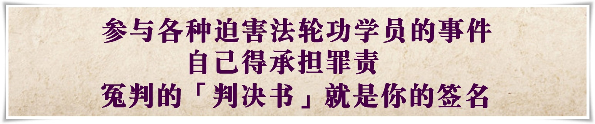</a>

<table>
<tr>
<td width=900>
<h3 align="center"><b>唐恩：忏悔赎罪 把握机缘</b></h3>
【大纪元2019年02月15日讯】据明慧网信息统计，二零一八年至少有68名法轮功学员被中共迫害致死。他们中有农民、工人，个体经营者，也有副教授、博士、工程师、校长、教师、农业专家、军队转业干部等社会精英人士。其中36人由监狱迫害致死，27人屡遭迫害骚扰致死，4人在看守所非法关押期间被迫害致死。

近期则有130多名公安局局长遭恶报。从二零一七年至今，已经有56名中共派出所所长（副所长、教导员）因参与迫害法轮功学员遭恶报死亡；自一九九九年七月中共迫害法轮功以来，已经有445名中共政法委书记遭恶报。

一九九九年七月，中共以洗脑、酷刑、虐杀等手段，逼迫法轮功学员放弃信仰“真、善、忍”。在江氏命令“六一零办公室”系统性的对法轮功学员实施“名誉上搞臭、经济上截断、肉体上消灭”、“打死白打、打死算自杀”与“不查身源、直接火化”的灭绝政策下，无数善良的法轮功学员被非法关押在劳教所与监狱中，长期遭受酷刑折磨与精神摧残。迄今至少有四千二百多名被迫害致死，难以计数的无辜百姓被绑架进看守所、劳教所、监狱、洗脑班、精神病院，被迫害致伤残、失学、失业、流离失所、家破人亡。大规模的活摘法轮功学员器官，更被称为“这个星球上前所未有的罪恶”。

据不完全统计，在十九年中，有20,784人遭恶报，其中包括，被殃及的亲友等4149人，在遭恶报形式的八项分类统计中死亡人数最多，高达7405人，占总人数的35.6%。在对遭恶报人员所分的九大类中，公安系统本人作恶遭恶报的最多，高达4540人，占公安系统总数的26.5%，他们殃及的亲友也最多，高达972人。

自古善恶有报是天理，证诸中外历史，迫害正信者最终都无好下场。从二零零二年以来，江泽民及罗干、周永康、薄熙来、夏德仁、赵致真、黄华华等近六十名严重参与迫害法轮功的中共官员，在四十多个国家及地区遭到刑事控告其触犯“反人类罪”、“酷刑罪”、“群体灭绝罪”。近年亚洲、欧洲、澳洲、北美的多国议会也陆续通过决议，谴责中共强摘法轮功学员器官的罪行，制止迫害成为国际社会的共同愿望，参与迫害者将面临全球的的追查和究责。

在中国大陆，自二零一五年五月起，逾二十万人向最高法院、最高检察院递交刑事控告书，控告江泽民迫害法轮功，由于网络封锁和信息传输的不便，实际数字不止于此。二零一七年四月二十日最高检察院举报中心的网上举报职务分类中首次公开表明可以举报“正国级”官员，最高检以这种迂回、“你懂的”方式，回应了海内外对迫害元凶的控告。堂堂正正在中国国内“诉江”，已将这股惩恶除奸、匡扶正义的呼声，推向另一波高峰。

如今，江氏集团已濒临覆灭：以周永康、徐才厚、薄熙来、郭伯雄、李东生为首的一大批替江泽民疯狂迫害法轮功的刽子手被以贪腐的名义法办，或死或抓，纷纷遭恶报锒铛入狱。包括谷俊山、苏荣、周本顺、奚晓明、马建、朱明国、张越、武长顺、赵黎平等许多曾经呼风唤雨的贪官污吏，急转直下，剩下的只是恶名昭著，只有身陷囹圄。继续把自己和江氏集团捆绑的中共各级官员，也不断地被抓，这场迫害显已走入末途。

另一方面，在法轮功学员近二十年如一日的讲真相中，大量海内外民众已经觉醒。迄今，三亿二千多万中国人退出了中共的党、团、队组织。各地释放法轮功学员的案例越来越多，仅从二零一六年上半年至今，中国大陆已有二十一个省、直辖市出现不予起诉、释放法轮功学员或退卷的案例。不愿参与迫害的中共各级人员以各种形式与江氏集团切割，这些释放无辜法轮功学员的案例，是很多公检法人员在明白真相后的自保和赎罪。

这种时候，只有那些最没有头脑的人，才继续积极参与迫害，被江氏集团利用着，他们不知道的是，目前得到的一点蝇头小利，和将来因此付出的惨痛代价远远不能相比。迫害法轮功的江氏集团已经失势，把希望寄托在它们身上的人都是自绝未来。

在各种迫害法轮功学员的事件背后可能真的有政法委、六一零人员，有“上头”在施压。但基层人员做了坏事，自己得承担罪责，不能以“我说了不算”当借口推脱。因为违法骚扰就是你上门干的，绑架的行为就是你实施的，冤判的“判决书”就是你的签名。

中国《公务员法》第五十四条规定：“公务员执行明显违法的决定或者命令的，应当依法承担相应的责任。”实际上把参与迫害者的推脱罪责的退路给堵死了。

同时警察已无职务犯罪免责条款。二零一六年三月一日新修订的《公安机关人民警察执法过错责任追究规定》删除了一九九九年六月十一日出台的同文件第十四条“执行上级命令的，不追究人民警察的责任”，这将使很多为江泽民卖命迫害法轮功且至今不明真相的公检法司人员要为自己的罪恶负责了。

身为公检法人员，如果上司命令你参与迫害，“枪口抬高一厘米”是人类面对恶政时的抵抗与良知的自救，也是明哲保身的智慧宝典。

柏林墙倒塌两年后的一九九二年二月，一名东德卫兵因为开枪杀死偷越柏林墙的青年接受审判。二十七岁的卫兵英格．亨里奇在法庭上为自己辩护时说：“那个时候我只是在遵循法律和执行上级的命令，根本没有选择的权利，罪不在己。”法庭最终的判决是：判处开枪射杀无辜平民的卫兵亨里奇三年半徒刑，不予假释。法官当庭指出：“作为士兵，不执行上级命令是有罪的，但是枪打不准是无罪的。作为一个心智健全的人，此时此刻，你有把枪口抬高一厘米的权利，这是你应主动承担的良心义务。”

尊重生命与维护人权，是放诸四海而皆准的普世原则。因为类似的辩护，早在二战后的纽伦堡审判法西斯战犯时，已有先例：不道德的行为不能以是奉政府的命令为借口而求得宽恕。

天网恢恢，疏而不漏。邪恶可能逞凶一时，但终究不能长久。迫害法轮功的江氏集团已呈土崩瓦解之势，迫害正信的恶徒已到了穷途末路。无论首恶或帮凶，都逃不过人间法律、道德法庭的终极审判。天理昭昭，报应不爽，那些仍在参与迫害法轮功学员的各级人员，应该赶快停止迫害，将功补过，才能弥补罪愆、赎罪自救。真诚奉劝所有行恶之徒不要再助纣为虐，赶紧悬崖勒马，珍惜救赎的机缘，否则恶报临身之际，悔恨晚矣。

责任编辑：萧明

</td></tr>
</table>

<a href=#list><h4 align="right">回目錄</a></h4>
<a name=10>
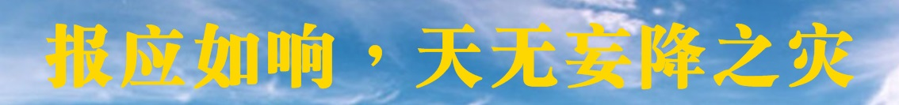</a>

<table>
<tr>
<td width=900>
<h3 align="center"><b>报应如响，天无妄降之灾</b></h3>

【明慧网二零一九年三月十二日】据明慧网信息统计，二零一八年共有508名参与迫害法轮功的人遭到恶报，其中有往年遭恶报但在二零一八年首次曝光的191人，二零一八年当年遭恶报的有317人。恶人遭恶报的形式以“被查处”的占最多，共309人。遭恶报最多的部门是公安系统，有150人遭恶报，其中许多案例恶者一人殃及多个家人。
自一九九九年七月，中共江泽民一伙残酷迫害修炼真、善、忍的法轮功学员，非法关押、毒打、滥施酷刑，乃至活摘器官，迄今至少有四千二百多名法轮功学员被迫害致死，难以计数的无辜百姓被绑架进看守所、劳教所、监狱、洗脑班、精神病院，被迫害致伤残、失学、失业、流离失所、家破人亡。

善恶有报是天理。古德有云：“报应如响，天无妄降之灾”，先贤莫不敬畏天地神明。近年因迫害法轮功而遭恶报的事情频频发生，明慧网上已公布了二万余实名案例，其中包括中共中央官员、省委官员、市委官员、公安科长、学校校长、办公室主任、“六一零”头目、派出所所长、居委会主任等，遭报者的分布与各地区迫害严重程度在地理上是惊人的一致。神目如电，报应不爽，正所谓“多行不义必自毙”。

从一九九九年迄今发生的各级政法委书记（包括副书记）遭恶报者至少有455人，仅二零一七年就有40名派出所所长在执行中共政法委、六一零、公安部专门迫害法轮功学员的所谓“敲门行动”中遭恶报死亡，并以突发心脏病、脑部疾病、车祸居多。

这些因迫害法轮功而遭恶报的事例，触目惊心。有被车撞死的，有翻车死亡的，有得怪病死的，有被雷击死的，有被电死的，有得癌症死的，有无缘无故倒地死亡的，有遭遇精神刺激上吊自杀的，有因其它罪行败露畏罪自杀的，还有因各种原因被判刑、撤职，或者突然一跤摔倒瘫痪的，更有自己作恶殃及家人的，不一而足。

承袭马列主义“唯物论”的中共，长期给中国人灌输“无神论”的邪恶思想，使现在许多人不相信神佛的存在，更视“三尺头上有神灵”为封建迷信。前述有据可查的明慧网实例，果报昭彰，不正是上苍在警示世人吗？

如今，江氏集团已濒临覆灭：以周永康、徐才厚、薄熙来、郭伯雄、李东生为首的一大批替江泽民疯狂迫害法轮功的刽子手被以贪腐的名义法办，或死或被抓，纷纷遭恶报锒铛入狱。包括谷俊山、苏荣、周本顺、奚晓明、马建、朱明国、张越、武长顺、赵黎平等许多曾经呼风唤雨的贪官污吏，如今身陷囹圄。继续把自己和中共江氏集团捆绑的中共各级官员，也不断地被抓，显然这场迫害已走入穷途末路。

在海外，从二零零二年以来，江泽民及罗干、周永康、薄熙来、夏德仁、赵致真、黄华华等近六十名参与迫害法轮功的中共官员，在三十多个国家及地区遭到刑事控告其触犯“反人类罪”、“酷刑罪”、“群体灭绝罪”。近年亚洲、欧洲、澳洲、北美的多国议会也陆续通过决议，谴责中共强摘法轮功学员器官的罪行，制止迫害成为国际社会的共同愿望，参与迫害者将面临全球的追查和究责。

大势已去，即使江氏集团余孽能在一定范围欺骗和胁迫公检法参与迫害，也已力不从心，最明显的就是目前各地众多的派出所、警察不受理或以各种理由，推脱对法轮功学员的举报并抵制迫害；许多检察院更出现不立案、撤诉、庭审后决定免于刑事处分、无罪释放法轮功学员等情况。

明慧网经常刊载许多因迫害法轮功遭到报应的事例，不是幸灾乐祸，而是慈悲劝诫。前述诸多因果报应的鲜明实例，值得人们深思。

遗憾的是，中共对法轮功的迫害仍继续发生着，很多公检法司人员尚未醒悟。仅仅己亥年新年前后，就有227名法轮功学员被非法判刑入狱。因中共网络封锁，很多被非法判刑案例不能及时曝光，实际人数还要多。

二零一九年中国新年前后，有16名老年法轮功学员被非法判刑，6人被非法庭审。被非法判刑的法轮功学员中，包括许多七、八十岁的长者。

“善有善报，恶有恶报，不是不报，时辰未到”，所有迫害法轮功学员的中共官员与其追随者，自己遭恶报，还殃及家属跟着受害。苍天有眼，善劝所有迫害法轮功的人不再助纣为虐，赶紧悬崖勒马、忏悔救赎，及时将功补过，以免它日恶报加身，悔恨已晚。

</td></tr>
</table>

<a href=#list><h4 align="right">回目錄</a></h4>
<a name=11>
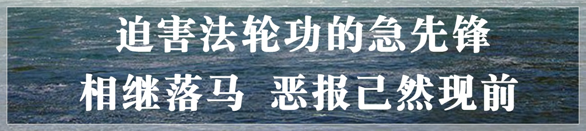</a>

<table>
<tr>
<td>
<h2 align="center">全球法轮功学员控告中共前党魁江泽民及其党羽一览表</h2>
<h4 align="center">（2001年至2010年10月）</h4>

江泽民及其党羽非法镇压迫害法轮功，在联合国等国际人权组织经过深入查证属实之后，已成为国际瞩目的人权事件。目前全球各地人权律师形成联合网，在各国法院对江泽民及其追随参与犯罪的中共官员进行迫害的刑事追诉或民事起诉，诉讼规模之庞大被称为「二十一世纪最大的国际人权诉讼」：

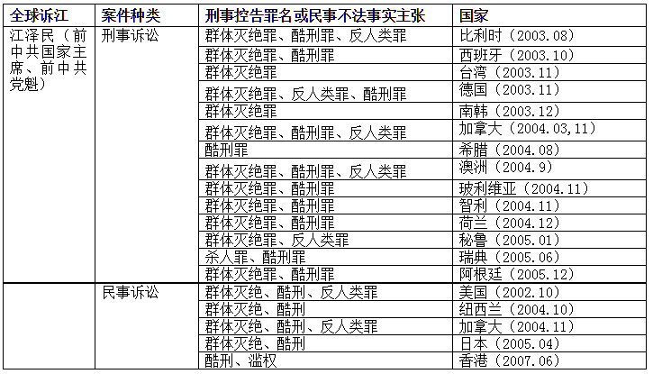

<h2 align="center">联合国人权组织、欧洲人权法庭及国际刑事法庭之控诉</h2>

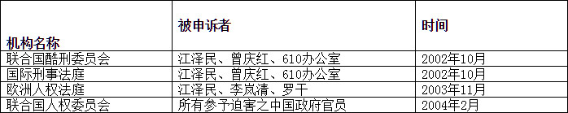

<h2 align="center">全球各地法轮功学员控告中国使领馆＆使馆官员一览表</h2>

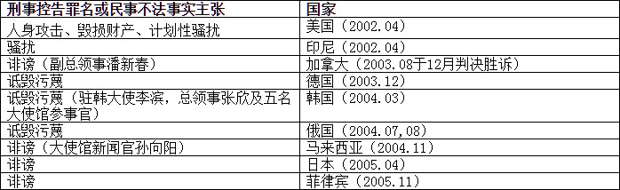

<h2 align="center">全球各地控告「处理法轮功问题领导小组办公室」及其首脑一览表</h2>

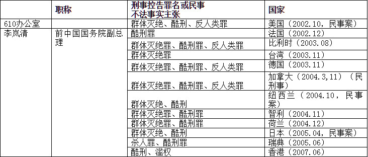

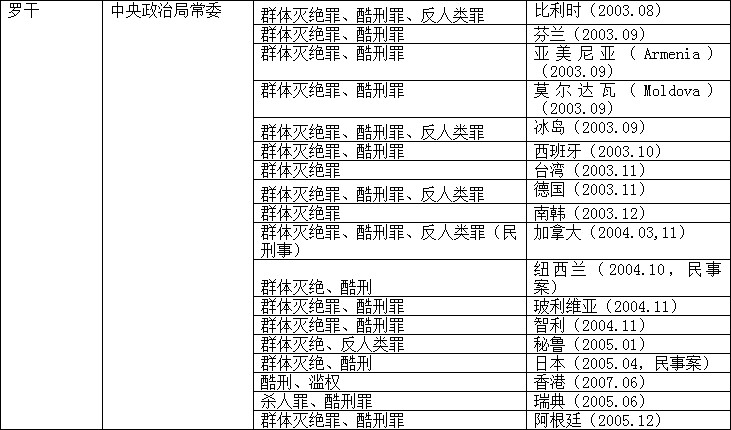

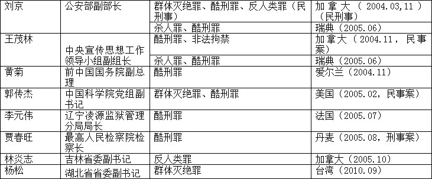

<h2 align="center">全球各地控告迫害法轮功学员之中共官员一览表</h2>

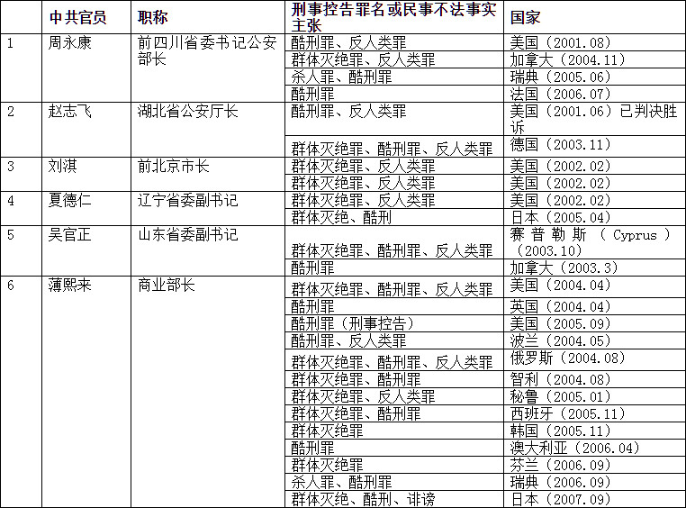

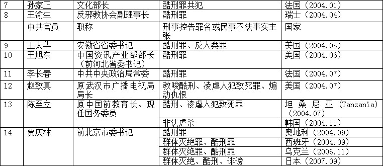

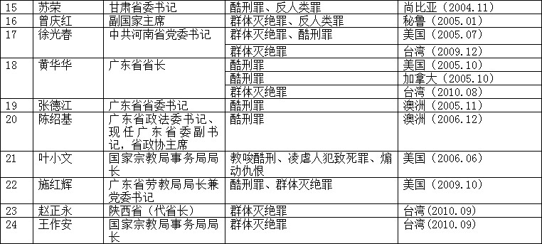

<h2 align="center">全球各地法轮功学员控告中共操控的媒体一览表 </h2>

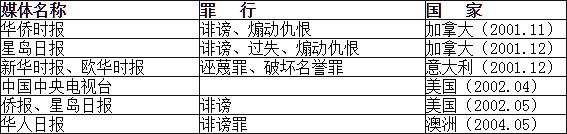

</td>
 </tr>
</table>

<a href=#list><h4 align="right">回目錄</a></h4>
<a name=12>
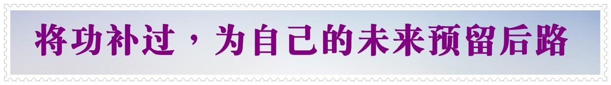</a>

<table>
<tr>
<td width=900>

<h3 align="center"><b>谁给法官量刑</b></h3>

【明慧网二零一九年五月四日】在中国大陆，法轮功被迫害二十年了，大法弟子一直坚持着自己的信仰，按真、善、忍做一个好人。从家庭，到单位，到社会，越来越多的人的良知、善念在一点点复苏着，他们对法轮功有了正面的认识，正确的认识。

但有这样一个“特殊”的群体，他们一直被操控着对大法弟子判刑，对一群没有违宪、没有违法、没有伤害到任何人、善良无争的大法弟子判刑，把他们送入监狱。而且被判刑的大法弟子年龄越来越大，刑期也越来越长。大家知道，善恶有报的天理从来都没有变过。作茧者自缚也从来都是这个道理。

在中国的传统文化中，一个人的一生，到最后只剩下一个善恶簿，那不是别人给你写的，是每个人自己写上去的。在对法轮功的迫害中，每一场对大法弟子的庭审时，都会有一个庭外庭，一定会有一个“书记员”在如实的记录着每一个细节，绝不会有半点遗漏。对没有违法的人的审判，也是对法官自己的审判。法官对大法弟子的量刑的依据（那些讲法轮功真相的资料），无疑都将成为法官违法的量刑依据，无可辩驳。

真心希望各位法官去看一看那些真相资料，轻落你们的法槌，对自己下手别太重！

<a href=#list><h4 align="right">回目錄</a></h4>
<h3 align="center"><b>作恶者终难逃法网</b></h3>

【明慧网二零一八年十一月十九日】二零一八年十一月十六日，联合国柬埔寨法院特别法庭判决，首次裁定红色高棉（Khmer Kraham，又译赤柬）两名前首领犯下种族灭绝罪，判处二人终身监禁，这是首宗判其种族灭绝罪的官方裁决。

九十二岁的农谢（Nuon Chea）是红色高棉政权领袖波尔布特（Pol Pot）的副手，他被控消灭占族（Cham）人。八十七岁的乔森潘（Khieu Samphan）是当时的国家元首，他被指控对越南裔民众实施种族灭绝。有华人血统的农谢是当时中央副书记，被称为“二号大哥”，在红色高棉主管意识形态，是杀人“总设计师”。

乔森潘则先后做过总理及国家主席，受波尔布特操控，在赤柬政权中属第五号人物。在一九七五年至一九七九年统治期间，柬埔寨共产党以暴力手段“清洗”城市，实行强制农业集体化，并展开全国性的大屠杀。大约有二百万人被迫害致死，占当时柬国人口的四分之一。除了种族灭绝，农谢和乔森潘还被判犯有一长串罪行，包括强迫婚姻、强奸和宗教迫害等。二零一四年他们二人已经因危害人类罪而被判终身监禁，这次再被判处终身监禁。

红色高棉的罪行长期以来被称为“柬埔寨种族灭绝”，波尔布特在一九七五年攻占金边后，展开三年多的恐怖统治，他的“杀戮场”（the killing fields）臭名昭著。波尔布特以毛泽东为导师，按照中共的指导方针进行大屠杀。红色高棉在夺权后即实现所谓纯粹的“共产主义”，获得了毛共在军事、政治、经济方面的全力支持。乔森潘本人曾多次访华，接受毛泽东和中共的指示。他在受审期间还揭露出中共支持赤柬的大量材料，柬共创造的酷刑手段如活取人脑机的制造，就是得到中共专家的指导。

赤柬头目犯行四十多年后，仍须受审判刑，并非罕例。二零一七年十二月二十九日德国联邦宪法法院做出裁决，前纳粹党武装亲卫队成员奥斯卡·格吕宁（Oskar Groening），遭法庭以协助、伙同（aiding and abetting）谋杀二战期间奥斯威辛集中营（Auschwitz concentration camp）三十万犹太人的罪名判刑四年。高龄九十六岁的格吕宁以健康理由申请“暂缓监禁”，遭到宪法法院驳回，必须入狱服刑。法院强调，特别重视该二战期间“协同谋杀”犹太人的案件，是因为格吕宁犯下了严重罪行，必须落实国家司法究责。

格吕宁担任奥斯威辛集中营守卫，他的具体案由包括涉及一九四四年的“匈牙利行动”等，当大批匈牙利犹太人被送到奥斯威辛时，他的任务是看管行李等，虽然格吕宁辩称没有“亲身参与”杀害任何犹太人，但法院认为他在知情下，“自愿执行”看管任务，且穿着制服、佩戴枪支而让被遣送者心生畏惧，因此实际上让犹太人被运往毒气室，遭屠杀的过程，得以“顺利、迅速”执行。

一个年近百岁的老人，必须为他七十多年前所犯下的罪行锒铛入狱。类似情节的另两件司法判决，其一为二零一六年五月十六日，瑞典斯德哥尔摩地方法院（Stockholm District Court）以曾参与一九九四年卢旺达种族大屠杀为由，将原籍卢旺达的六十一岁瑞典公民贝林金蒂（Claver Berinkindi）判处终生监禁，罪名包括种族灭绝，及在卢旺达进行谋杀、谋杀未遂与绑架等国际法的严重罪行。这是瑞典第二度以这起大屠杀的罪行判刑，瑞典法院曾在二零一三年依涉及卢旺达种族灭绝案，判处另一名男子终身监禁。

其二为二零一六年六月十七日，德国西部的德摩得法院将曾在纳粹德国党卫军（SS）麾下担任奥斯威辛集中营警卫的韩宁（Reinhold Hanning）判处有罪，刑期五年。检方指控九十四岁的韩宁当时负责看管，虽非正犯，仍系奥斯威辛集中营大屠杀的帮助犯。法院宣判时指出，“他（被告）知道奥斯威辛当时的大规模谋杀，毒气室里每天都有无辜的人遭杀害”。

上述四则陈年案例被国际媒体广泛报导的意义在于，贝林金蒂虽然隐瞒身份加入瑞典籍，瑞典和卢旺达远隔万里又时隔二十二年，凶手还是逃不过正义的审判。德国的韩宁与格吕宁都是近百岁老翁，但两人曾以警卫身份“协同谋杀”犹太人的罪行，逾七十年依旧无法抹灭。赤柬两首领的判决清楚标明，他们是大规模谋杀的罪犯，是残忍杀人机器的一环，无论首谋或从犯，若没有他们的积极参与，卢旺达与红色高棉的种族屠杀及奥斯威辛集中营惨案就不会成真。

尽管许多人权之士认为，这些判决太轻、太迟。但这四起看似不相关的独立事件，却给世人指引着同一结论：迫害法轮功，一辈子也逃不掉。江泽民与中共迫害法轮功，迫害之严酷惨烈，尤甚于卢旺达与赤柬种族屠杀及奥斯威辛集中营案，更值得世人关注。

一九九九年七月起，江泽民与中共动用整部国家机器迫害法轮功，对一亿名遵循“真、善、忍”的法轮功学员进行了残暴的迫害。在人权恶棍江泽民的“名誉上搞臭，经济上截断，肉体上消灭”的灭绝政策下，数千万名善良无辜的法轮功学员被非法关押在劳教所与监狱中，长期遭受酷刑折磨与精神摧残，更令人发指的是活体摘取法轮功学员器官这种骇人听闻、天地不容的暴行。十九年来，至少有四千两百多人被迫害致死，难以计数的人至今失踪。

在海外，从二零零二年以来，江泽民及罗干、周永康、薄熙来、夏德仁、赵致真、黄华华等近六十名严重参与迫害法轮功的中共官员，在全球五大洲三十多个国家及地区遭到刑事控告其触犯“反人类罪”、“酷刑罪”、“群体灭绝罪”。在中国大陆，自二零一五年五月起，已有超过二十万人向最高法院、最高检察院递交刑事控告书，控告江泽民迫害法轮功，由于网络封锁和信息传输的不便，实际数字不止于此。堂堂正正在中国国内“诉江”，三年多来已将这股惩恶除奸、匡扶正义的呼声，推向另一波高峰。

善恶有报是宇宙运行的法则，因果报应，如应斯响。那些积极参与迫害的党羽，恶报已然现前。迫害法轮功的急先锋，诸如薄熙来、周永康、苏荣、徐才厚、李东生、王立军、万庆良等中共高官锒铛入狱，也预告了首恶之徒的下场。从六年前的王立军、薄熙来事件，到中共劳教制度废除，再到李东生、周永康这些“六一零”头目的相继落马，“善恶终有报”的指向路径清晰而明确，迫害法轮功者必遭恶报的天理让歹徒惶恐不安，报应已直逼首恶元凶。

殷鉴不远。人类社会的正义，曾经将南斯拉夫的独裁者、红色高棉的杀人魔王都押上国际法庭，也同样可以将江氏集团与中共官员押上审判台，这一时刻不日即到。近期的四则国际判决，应让曾追随迫害元凶的附和之徒深思自己的未来。这些判例足以让曾受中共蛊惑的人们警醒，为中共卖命就如同为虎作伥者，都没有好下场，古云：“狡兔死，走狗烹”，被中共利用完了自己仍要承担苦果，那些短视近利的取巧之辈，给自己留条退路方为正办。

目前在大纪元退党网站公开表明“三退”（即退出中国共产党、共青团和少先队）的人数直逼三亿两千万人，越来越多的民众渐渐觉醒、不再对中共心存幻想，天灭中共是时势所趋。面对真相日益广泛传播，中共即将解体覆亡已经指日可待。对可贵的中国民众而言，退党保平安才是明智之举。

天理昭昭，报应不爽，走过漫漫长夜，正义终将战胜邪恶。无论首恶或帮凶，都逃不过人间法律、道德法庭的终极审判。那些仍在参与迫害法轮功学员的各级人员，应该赶快停止迫害，保护法轮功学员，收集其他人的犯罪证据，将功补过，为自己的未来预留后路，才能弥补罪愆、赎罪自救。

</td>
 </tr>
</table>

<a href=#list><h4 align="right">回目錄</a></h4>
<a name=13>
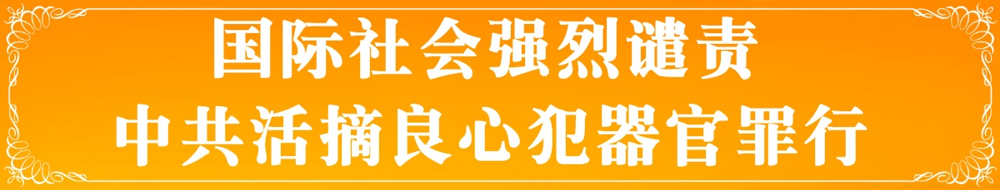</a>

<table>
<tr>
<td width=900>
<h3 align="center"><b>辩论会英国议会大厦召开 关注中共活摘</b></h3>
【明慧网二零一九年三月二十九日】（明慧记者方元英国伦敦采访报道）二零一九年三月二十六日上午，“中（共）国强摘活体器官（Forced live organ extraction in China ）”辩论会在英国议会大厦威斯敏斯特厅（WestminsterHall， Houses of Parliament）举行。

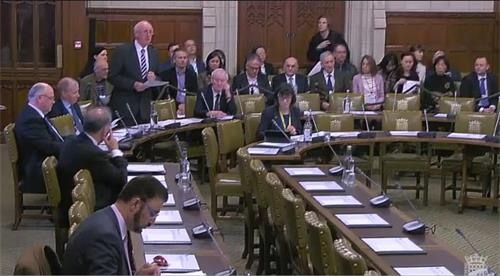

图1：二零一九年三月二十六日，“中（共）国强摘活体器官（Forced live organ extraction in China）”辩论会在英国议会大厦举行。

图2：国会议员吉姆·香农（Jim Shannon MP）。

辩论会由英议会多党派宗教和信仰自由小组主席、国会议员吉姆·香农（Jim Shannon MP，chair of the all-party parliamentary group on freedom of religion and belief）发起举办，十位来自多个政党代表不同区域的英国国会议员在辩论会上发言，强烈谴责中共活摘良心犯器官罪行及其对法轮功的长期迫害，呼吁英国政府与国际社会一起，迅速开展独立调查并进一步采取行动制止中共迫害，推动英国政府立法禁止英国公民去中国“器官旅游”。

英国外交部亚太事务次长马克·菲尔德（Mark Field，The Minister for Asia and the Pacific ）出席辩论会就此重大议题应答议员提问。关注支持中国宗教自由和人权事业的各界人士出席旁听了这场重要的辩论会，同时，在英国议会网站上可以看到辩论会的全程电视影像直播。

<b>强烈谴责中共邪恶暴行</b>

香农议员在开场发言中严正谴责中共对法轮功学员以及其他宗教和少数民族团体的人权迫害和宗教迫害：“我们这场关于活摘器官的辩论针对的是反人类罪（crimes against humanity），以及一个自二战纳粹以来最大规模迫害宗教团体的政权。”

“一个联合国安理会常任理事国，正在象对待牲畜一样对待人类信仰群体，这是完全不可接受的（邪恶暴行）。”

英国保守党人权委员会主席菲奥娜·布鲁斯议员（Fiona Bruce MP）在会上谴责中共活摘良心犯器官是“一个完全邪恶的行为（for an utterly sinister act）”，呼吁英国政府“采取具体行动来处理这一严重的人权问题，这是危害人类罪（a crime against humanity），而且证据指向为二十一世纪的群体灭绝（a 21st century genocide）”，“一种在现代医疗外衣掩盖下的群体灭绝（A form of genocide cloaked in modern medical scrubs）”，“罪大恶极（the crime of crimes）”。

来自北艾尔郡和阿兰（North Ayrshire and Arran）的苏格兰民族党议员帕特里夏·吉布森（Patricia Gibson）在辩论会上发言，呼吁英国政府采取措施并带动国际社会采取更多行动来应对中共的野蛮行径：“如果任何国家以如此残酷和卑鄙的方式对待一个民族，我们就需要与其他自由民主国家站在一起，并用最严厉和最明确的语言来谴责它。”“英国政府和联合国必须考虑到发生的这种恐怖事实的巨大工业化规模（the vast industrial scale of this horror），这是必须被归类为危害人类罪（crimes against humanity）的行径。”

<b>要求立即停止迫害，制止“活摘”</b>

香农议员在结束辩论发言时表示，举办这场辩论会的目的是希望看到变化，希望看到中共活体摘取良心犯器官恶行马上停止：“按需谋杀（murder on demand），我们永远不会接受它的发生，我们敦促中（共）国政府认清我们的这一立场并退缩。”

香农议员并呼吁英国政府，为了不重复历史悲剧，要勇敢面对眼前的棘手问题采取行动：“我们不该把头埋在沙里，去躲避闪烁在我们周围的真相的凛然光芒。”“如果我们放弃自己对那些遭受暴虐政权（tyrannical regimes）迫害的人本应承担的责任，历史将如何评判我们？是我们明确目标要求（中共）停止强制摘取器官的时候了。”

来自伯顿（Burton）的保守党国会议员安德鲁·格里菲斯（Andrew Griffiths MP）发言表示，中共强摘器官罪行令他回想到在二战纳粹集中营里发生的屠杀，西方社会必须要求制止中共的迫害，不能让罪恶再持续了：

“人们被关到集中营，被做实验并被摘取器官，大屠杀导致数百万人死亡。回顾历史，我们看到当时（英国）政府有机会进行干预和行动，可他们没有。现在，（针对中共的活摘器官罪行），是西方社会要求迫害‘必须停止（This must stop）’的时候了。”

“这是一起通过强行摘取器官进行的大规模屠杀和宗教迫害，是事关反人类罪的严重指控，它迫切需要关注解决，那些没有这样去认真对待的人有一天会被追究责任。”布鲁斯议员在辩论过程中这样说。

来自曼彻斯特（Manchester， Gorton）的工党议员阿夫扎尔·汗（Afzal Khan）希望英国政府立即采取行动，呼吁“部长敦促政府公开地，并以最强烈的措辞谴责（中共）强摘器官，并要求（中共）停止这一行径，世界对这个野蛮罪行的沉默必须结束（The world’s silence on this barbaric issue must end）。”

吉布森议员也表达了要求立即结束迫害的鲜明态度：“这种野蛮、不人道的做法必须结束。毫无疑问，这种做法对任何有尊严、在乎人类生命价值的国家都是不堪忍受的，对此表态不该模棱两可，找不到任何托词借口，也不能麻木不仁。”“与国际社会一样，英国政府需要加强其国际和道义责任。任何人都为（中共）强摘活体器官的证据和故事而感到震惊甚至恐惧，也感到一种愤怒，我们不能害怕这样说。全球的国际机构和政府必须对中（共）国施加尽可能多的压力（以制止中共恶行）。这是我们的责任，是我们的正直要求。”

<b>更关注中共对法轮功的长期迫害</b>

代表南考文垂（Coventry South）的工党议员吉姆·坎宁安（Jim Cunningham MP）在辩论中发言强调，认识发生在中国活摘器官罪行的真相，需要关注中共对法轮功的迫害：

“这个问题非常重要。在中（共）国政府的统治下，法轮功因其信仰而受到迫害和‘改造’，这影响到七千万乃至上亿人，我们是否又处在第二次世界大战时经历的历史情形，我们在那场战争后才了解在德国发生的（纳粹进行大规模种族灭绝）事情。”

来自恩菲尔德（Enfield， Southgate）的工党议员巴姆博思·查尔拉姆伯斯（Bambos Charalambous）认为，“（中共）强摘器官罪行主要针对法轮功，是停止这一（对法轮功）人权迫害的时候了。”

阿夫扎尔·汗议员在发言中提醒人们，有大量修行打坐的法轮功学员被活摘器官：“包括英国医学杂志在内的多个组织的可信研究表明，成千上万的人因其器官而被杀害，最引人注目的是法轮功学员——进行一种平和的打坐修行的人，另外还有西藏人、维吾尔人和家庭教会基督徒。”

吉布森议员在发言中指出，中共对法轮功的迫害及其群体灭绝政策是活摘器官罪行的恶源：“毫无疑问，中（共）国对其公民实行绝对和残酷的控制，这是国际社会应该关注的。以多种信仰和族裔群体为目标的特征可以被视为代表着（中共的）种族灭绝意图。”

“法轮功学员在中国被以这种方式成为攻击目标的事实就是问题的核心。如香农议员所言，对任何宗教自由的攻击是对所有自由的攻击。所有人享有平安敬拜神的权利，无论他们以何种方式敬仰自己心中的神，这是一项基本权利。从最广泛的意义上说，损害这种权利就是在威胁人类自由的基础。”

<b>提请政府重视“人民法庭”最新调查结果</b>

香农议员在发言中提请对仍在进行中的独立民间法庭——“中国法庭”（China Tribunal）调查结果的关注，指出“世界上许多不同的组织，包括意大利、西班牙、加拿大、以色列、台湾、爱尔兰、捷克和美国的议会机构，还有英国保守党人权委员会和中国法庭（China Tribunal）等非议会机构，都在全面审查有关（中共活摘器官罪行指证）证据”，“更广泛深入的研究将中共强制摘取活体器官与宗教迫害和大规模监禁联系起来，其中主要受害者包括法轮功、基督徒和维吾尔族穆斯林。

香农议员重视尼斯爵士（Geoffrey Nice QC）宣布的“中国法庭”临时判决：“在中国从良心犯身上强制摘取器官已经实施了相当长的一段时间，涉及大量受害者……实施者是（中共）国家组织或（中共）国家批准的组织或个人。”他还注意到“中国法庭”（China Tribunal）的案例研究证明中国良心犯受到酷刑，或被强行接受DNA、血液和器官扫描体检”，他特别例举了一名被关押和酷刑折磨多年的法轮功女学员在“中国法庭”的证词。

布鲁斯议员在发言中也反复提请政府对有关重要的独立调查结果的重视。她介绍说“中国法庭”已经听取了三十名证人的证词，法庭收集的证据一再显示各级政府需要严肃对待大卫·乔高（David Kilgour），大卫·麦塔斯（David Matas）以及伊森·葛特曼（Ethan Gutmann）在二零一六年发表的长达七百页的更新报告“血腥的收获/屠杀：更新报告（Bloody Harvest/The Slaughter：An Update）”，希望英国政府和联合国开展最高级别的调查。

<b>建议推动英国政府就禁止“器官旅游”立法</b>

香农议员在辩论中表示希望英国政府立即采取适当行动，“包括跟随许多其它国家的步伐，禁止英国居民到中国开展‘器官旅游’”，“不仅仅因为这是正确的做法，还因为有必要保护英国公民免于成为造成中国宗教或信仰团体苦难的角色。”

布鲁斯议员也赞同这一动议：“意大利、西班牙、以色列和台湾已经禁止‘器官旅游’，加拿大参议院已经批准了类似的立法，我们必须这样做，它将发出英国政府强烈关注（中共活摘良心犯器官指控）的信息”，“截至昨天（二零一九年三月二十五日），已有三十八位国会议员签署了2138号早期动议案（Early-day motion 2138），呼吁英国政府禁止该国的器官旅游。”

吉布森议员在发言中直接向部长建议推动英国尽快就禁止“器官旅游”立法：“这将表明我们的道德立场并设置一个标记，这是非常重要的。”“从道德上讲，我们采取这些措施非常重要，英国政府应该有办法将其付诸实施。”

<b>呼吁英国政府和国际社会立即开展独立调查</b>

阿夫扎尔·汗议员在辩论发言中也直接敦请英国政府开展独立调查：“据我所知，中国驻英国大使和一些参与器官移植的中国医生多次被邀请提供证据，但他们没有回应，这令人深感忧虑，我们需要对（活摘器官）这些公然侵犯人权的行为追究责任”，“联合国关于酷刑与宗教和信仰自由特派员都要求中（共）国政府解释这些器官的来源并允许他们进行调查，但没有回应。”“（在中国）医疗道德只是被放在一边，同时存在一种不受管制的制度。”“我强烈建议政府跟随欧洲议会和美国国会的脚步，两者都要求进行独立调查。”

来自格拉斯哥的苏格兰民族党议员卡罗尔·莫纳汉（Carol Monaghan）直接向部长发问：“鉴于第一份（有关中共活摘法轮功学员器官指控的调查）报告是在二零零六年出版的，可否认为英国要求开展政府调查的举措已被拖迟了十三年了？”

马克·菲尔德部长现场回复了国会议员提出的问题，对中国信仰自由和人权恶化状况，包括法轮功学员遭受酷刑迫害的事实表示关注，并表达了结束强摘器官恶行的愿望：“重要的是，我们所有人都要努力以任何方式利用我们的能量来解决今天提出的（中共活摘器官罪行）这一重要问题。希望各位议员与政府密切合作，努力确保在不久之后，不让强制器官摘取再发生。”

三月二十七日，对这次议会辩论的新闻广播报道出现在英国广播公司（BBC）BBC广播

四台（BBC Radio 4）“昨日议会”（Yesterday in Parliament）节目中，吉姆·香农、菲奥娜·布鲁斯等议员揭露谴责中共活摘良心犯器官的罪行并要求制止迫害的正义之声通过电波传给分布世界各地的BBC听众。

</td>
 </tr>
</table>

<table>
<tr>
<td width=900>
<h3 align="center"><b>独立法庭上　专家揭中共活摘器官罪行</b></h3>

【明慧网二零一九年一月二十三日】（明慧记者方元伦敦采访报道）“但是，再重复一遍，毫无疑问，强摘器官的情况曾大规模发生，而且是由国家组织的，或国家批准的组织或个人来进行的。”二零一八年十二月十日傍晚，在“独立人民法庭”首次公开听证会结束时，法庭主席杰弗里·尼斯爵士（Sir Geoffrey Nice QC）在宣布独立法庭暂定判决时说。

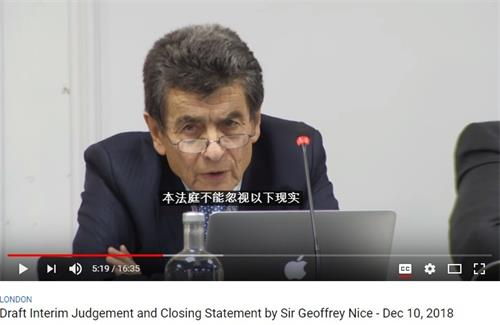

图1：“独立人民法庭”（Independent People’s Tribunal／China Tribunal）主席、英国著名律师席杰弗里·尼斯爵士（Sir Geoffrey Nice QC）在独立法庭首次公开听证会结束时宣布暂定判决。

二零一八年十二月十日傍晚，在“独立人民法庭”首次公开听证会结束时，法庭主席杰弗里·尼斯爵士（Sir Geoffrey Nice QC）宣布独立法庭做出了暂定判决：“作为本法庭成员，我们都一致确信，可以排除任何合理怀疑而认定，在中国，强制摘取良心犯器官的行为发生的时间已经相当长，涉及到很大数量的受害者，我们将在最终判决中申明这种做法是否犯下国际罪行，若是如此，谁是犯案者，并详细说明作案时间和受害者数。”

尼斯爵士还声明独立法庭将进一步开展证据收集、听证和审理：“本法庭正在调查中（共）国政府或政府认可的机构、组织或个人，是否犯下过参与强制摘取器官的罪行。”

“独立人民法庭”（Independent People’s Tribunal/China Tribunal）是全世界首个针对中共活摘器官罪行进行调查听证审理的民间法庭。二零一八年十二月八日至十日，“独立人民法庭”在伦敦举行公开听证会（Public Hearings），来自世界各地的三十位证人向独立法庭的听证陪审团和法律顾问组提供了证词，公开听证会也吸引法律、医学、人权领域的专业人士以及各界民众出席聆听。几位受访的与会专家学者谴责中共强摘良心犯器官罪行，警醒世界人民认清中共反人类的邪恶本质，呼吁用法律制裁和道德审判去震慑邪恶制止中共迫害。

至今“独立人民法庭”网站仍在公开征集证据。

<b>独立法庭法律顾问：让全世界知道中共犯下危害人类罪</b>

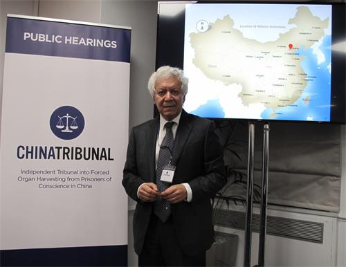

图2：“独立人民法庭”法律顾问、人权律师哈米德·萨比（Hamid Sabi）。

“独立人民法庭”法律顾问哈米德·萨比（Hamid Sabi）受访时表示：强摘良心犯器官（forced organ harvesting from prisoners of conscience）是彻底违反人性的，“是危害人类罪（crime against humanity）”，而且是在（中共）国家政策下执行的犯罪，是在（中共）迫害法轮功的政策下发生的，而且是针对法轮功学员在全国范围的系统性的操作，“是在中国掌握权力的最最邪恶的人给非常平和的人类造成的灾难，这是疯狂的行为”。“因为人们的信仰而要毁灭他们，这属于人权迫害，毫无疑问中共犯下危害人类罪，危害人类罪可涵盖谋杀、酷刑等罪行。”“中共强摘良心犯器官也发生在维吾尔族人、家庭教会成员以及其他少数族裔团体身上。”

萨比律师强调说，强摘良心犯器官罪行是在中共国家政策下的系统发生，罪责在国家（中共），江泽民是罪魁：“很多是军队医院干的，法轮功学员被关在（中共政权下的）国家拘留所和监狱，是这些国家机构干的，我们有证据是江泽民下的命令，他完全知情。”

萨比律师表示法轮功学员的证词让他感动，他希望世界上所有的人都能听到这些证词：“非常感动，我们都流泪了，他们每个人都经历了难以想象的苦难。读那些证词，你看到人们因为自己的信仰被关押监禁、被这样（非人）对待，这让人很难过”，“必须制止（活摘器官和对法轮功的迫害）”，“所有证词都记录下来了，全世界都会知道，很快会放到网站上”。

萨比律师认为，要制止和制裁中共反人类罪行，国际社会在利用法律手段的同时也要重视道德力量的重要：“对付中共，一个办法就是曝光它的丑行（name and shame it）”。“如果媒体和公众能把这个法庭的证词和结论传播出去，就可能促使中国（中共）停止强摘器官这个惊天骇人的罪行，公众的舆论压力会让跟中共打交道的人意识到这（中共所为罪行）不是人类的行为。”

<b>麦塔斯：建议用群体灭绝罪来制裁中共活摘器官罪行</b>

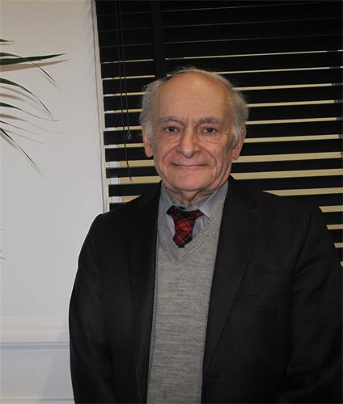

图3：二零一八年十二月八日，加拿大人权律师大卫·麦塔斯（David Matas）在伦敦向“独立人民法庭”作证。

二零一八年十二月八日，加拿大人权律师大卫·麦塔斯（David Matas）在伦敦向“独立人民法庭”出席作证，他是“独立人民法庭”的第一位证人。他向独立法庭介绍自己与大卫·乔高（David Kilgour）以及伊森·葛特曼（Ethan Gutmann）合作，就中共活摘法轮功学员器官指控开展独立调查的背景、过程和基本结论，并回答法庭提出的问题。

麦塔斯认为有必要考虑采用群体灭绝罪的国际法律来制裁中共活摘器官罪行，因为中共迫害法轮功就是在对法轮功进行冷酷的群体灭绝，“有大量法轮功学员被消失，有要定期消灭法轮功的政策”。

他还认为要制裁活摘罪行，世界上现有的法律标准和机制需要调整，因为存在制度性漏洞，在国际法和国家法律层面都有漏洞：“本来应该是一个国家的法院来处理在本国发生的犯罪指控，同时国际法庭有义务监督法院听证过程的正常进行以及法院判决结果的落实。而事实上，（就活摘器官指控）中共政府没有照规定做、国际机构也没有去做。”“独立人民法庭”是延续国际上采用过的‘人民法庭’的传统，人民法庭曾在越南、北朝鲜、伊朗等涉嫌暴政逃避法律制裁的国家建立和运作，起了弥补法律制度漏洞的作用。

<b>英国教授：活摘参与者面临刑事犯罪制裁和道德谴责</b>

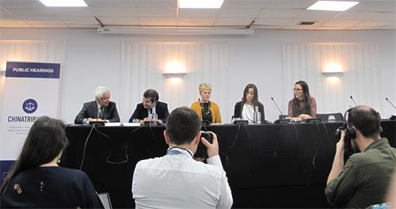

图4：二零一八年十二月八日上午，英国华威大学生物伦理学教授希瑟·德雷珀（Heather Draper，右三）在“独立人民法庭”新闻发布会上。

从事有关器官移植捐赠道德研究的英国华威大学生物伦理学教授希瑟·德雷珀（Heather Draper）是“制止在中国器官移植滥用国际联盟”（International Coalition to End Transplant Abuse in China，ETAC）国际咨询委员会成员，十二月八日上午，她在“独立人民法庭”新闻发布会上强调医学道德伦理对于器官移植非常重要，呼吁世界上所有参与器官移植的人，包括专业人士、伦理学家和潜在的器官接受者都必须认真对待这个独立法庭的调查结果，因为该法庭将判定在中国发生的器官移植是否涉及违反国际法的刑事犯罪。

德雷珀教授表示，器官移植事关生死，有相对高的医学伦理要求，而从她接触到的有关发生在中国的器官移植的公开信息资料里，她看到了很多非常不符合医学伦理的行为，这意味着有很多医学界人士在违背医学伦理，这让她关切，担心他们在犯罪。刚才听到法轮功学员现场证词中提到在被非法关押监禁期间被强制体检而又不给理由和结果，这种行为在英国是绝对不允许发生的。

她提醒她的医学同行，在无知中犯罪也将受到法律制裁和道德审判：“不蓄意、不有意伤害病人是医生的义务，这是共识；如果对健康的人进行不必要的手术，且知道手术将不可避免地导致他们死亡，那就是谋杀，也违背医学伦理，不该逃脱刑事制裁和道德谴责。器官移植外科医生和潜在器官接受者都可能成为犯罪同谋，如果他们对所用器官来源不闻不问，意味着在支撑（活摘器官）市场需求，从而让更多生命处于危险之中。”

<b>国际法律顾问：共产主义是人类的敌人</b>

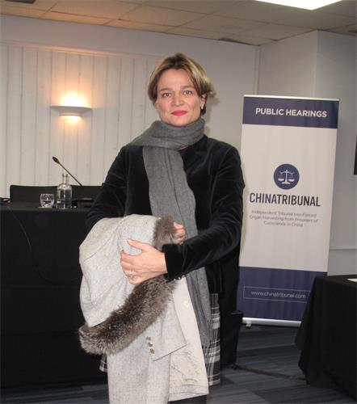

图5：二零一八年十二月十日，国际法律顾问丝塔芙·史碧娜（Steffi Spinae）出席“独立人民法庭”伦敦听证会。

瑞士女士丝塔芙·史碧娜是位律师，是住在伦敦的国际争议解决方面的国际专家，参与过世界上最大的能源诉讼和仲裁案件。她听了两位法轮功学员通过视频作证，认为证词非常有力、作证的法轮功学员了不起：“她们非常有勇气、非常有勇气、非常有勇气，能够站出来讲出来（自己遭受的迫害）是需要勇气的，因为那是很痛苦的，当你讲的时候会再次深陷痛苦。”“这些证词非常有力，这会让整个世界知道。”

史碧娜律师强调说自己是立场中立的瑞士人，是一个世界公民，但独立法庭上的证词让她清楚看到中共活摘器官罪行的邪恶、共产主义的邪恶：“太邪恶了，这是最坏的，比纳粹还邪恶，为什么这么说呢，因为它发生在现在，人类应该比六十年前更文明一些，应该有关于人权和国际法的基本概念，人类总得接受些历史教训吧，可这里事情却更糟糕。”“我来自瑞士，我中立，所以我明白这个，没错，共产主义是人类的敌人。”

<b>本·罗杰斯：独立法庭会让整个世界看到中共罪行</b>

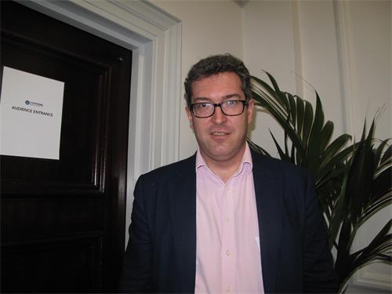

图6：二零一八年十二月八日，英国保守党人权委员会副主席、《香港观察》创始人和主席本尼迪克特·罗杰斯（Benedict Rogers）出席“独立人民法庭”伦敦听证会。

人权活动家、英国保守党人权委员会副主席本尼迪克特·罗杰斯（Benedict Rogers）近年来一直关注在中国发生的中共活摘良心犯器官罪恶，十二月八日，他来到“独立人民法庭”伦敦听证会，认为独立法庭的成立和运作有助于把中共侵犯人权、危害人类的恶行曝光给全世界。

他说：“这很重要，它吸引了人们的注意力，这是第一次以法律机构的名义来对待强摘器官指控的证据，这让活摘器官问题成为人们关注焦点”，“这是在国际法律框架下进行分析，是对（活摘指控）证据的法律分析。”

“与联合国等其它国际机构比较，这个法庭是独立的，虽然没有实施判决的行政权力，但是正得到媒体和公众广泛关注，在发出很强大的信息：“告诉中国（中共），整个世界在看着呢，中国（中共）应该停止这糟糕的犯罪。”

罗杰斯认为，发生在中国的活摘器官罪行的背景，是中共不断重复的反人类罪恶：“在中国，中共在不断侵犯人权，包括活摘器官这样的反人类的罪行，包括新近发生在新疆的事。”“我注意到独立法庭主要听证关于强摘器官的证据，但离不开了解对法轮功的迫害，也会关注发生在中国的其他人权侵犯。”

在世界上，人民法庭的建立通常是针对处理那些对某个国家或国家支持机构的极端严重罪行的指控，而且有关国家和国际机构未能正式处理这些指控。

“独立人民法庭”（Independent People’s Tribunal/ChinaTribunal）是全世界首个针对中共活摘器官罪行进行听证的民间法庭。由“终止中共器官移植滥用国际联盟”（ETAC）主导成立的，该法庭主要调查在中国发生的强摘器官（forced organ harvesting in China）过程中，国家或国家批准的机构、组织或个人是否刑事犯罪、罪责是什么、罪责由谁承担。

“独立人民法庭”于二零一八年十二月八日至十日在伦敦成功举行第一次公开听证。独立人民法庭”的最终判决预计于二零一九年春季做出，在此之前，法庭将继续收集证据。法庭也公开邀请中共当局加入这一法律程序中，目前中共当局对此没有做出任何回应。

</td>
 </tr>
</table>

<table>
<tr>
<td width=900>
<h3 align="center"><b>【禁闻】43位美国议员联署 敦促制裁新疆官员</b></h3>
 

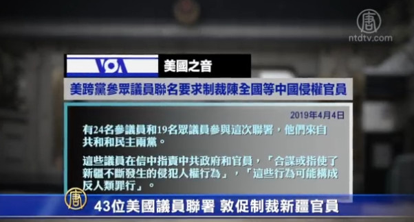

 
【新唐人2019年04月05日讯】4月3号，美国参、众两院43名国会议员，联名致信国务卿蓬佩奥、财政部长姆努钦和商务部长罗斯，呼吁制裁严重侵犯穆斯林人权的中共官员，包括主政新疆的中共政治局委员陈全国。

“美国之音”4月4号报导，有24名参议员和19名众议员参与这次联署，他们来自共和和民主两党。这些议员在信中指责中共政府和官员，“合谋或指使了新疆不断发生的侵犯人权行为”，“这些行为可能构成反人类罪行”。

去年8月，联合国的消除种族歧视委员会引述可靠报告，指控中共将近百万的新疆维吾尔人秘密拘留在“再教育营”强制洗脑。这迅速引发国际谴责。

尽管中共辩解这是为了打击所谓的“宗教极端主义”而设立的教育培训中心。但不断有幸存者揭穿“再教育营”里残酷的精神洗脑和肉体折磨。他们被迫歌颂和感激中共，被迫声讨自己的信仰、批评自己，并批评亲人。幸存者米娜在被关押的三个月中，目睹68人中9人死亡。她自己被上过“老虎凳”、被迫服下不明药物。

新疆再教育营幸存者米娜：“我承受着巨大的罪恶感和无力感，哭着求他们把我杀掉，剩下的事情我记不清了，我口吐白沫开始失去知觉。我印象中他们说的最后一句话是，你是维吾尔人这件事本身就是罪。”

43位国会议员在联名信中，要求美国政府迅速实施《全球马格尼茨基法》，制裁中共中央政治局委员、新疆维吾尔自治区党委书记陈全国，和其他侵犯人权的新疆官员。

中国人权问责中心发起人曹雅学：“这个制裁本身主要的意义是一个政治意义，而不是说具体就把他人怎么样。《全球马格尼茨基人权问责法》它实际上就是两项。一项是不许入境美国。第二是没收在美国一切，只要跟美国银行账户有任何关系的，他就要把你账户给冻结。”

在2017年1月10号成立的“中国人权问责中心”，主要在推动《全球马格尼茨基人权问责法》，是由中国海内外10位人权捍卫者发起。发起人之一的曹雅学表示，这个法案对陈全国等中共官员还是有震摄作用。

曹雅学：“即使是他不来美国，他也没有一分钱在美国。这个制裁仍然是有巨大的重大意义。因为陈全国他好像是政治局委员，他级别是很高的。就是说美国会对这样一个级别的中共官员去制裁，这个姿态非常重要。”

美国维吾尔人协会主席伊利夏提：“制裁早就应该进行，但是现在也不晚。制裁不一定立即就会改变维吾尔人的状况，但是对于被制裁的官员会有一种震慑作用。对他们儿女、家人的心理都会产生极大的影响。”

联名信还特别点名两家制造音视频监控设备的中国公司—— 海康威视公司 (Hikvision) 和大华技术股份有限公司(Dahua Technology)。

信中敦促美国商务部加强出口管制，以确保美国公司不会协助中共在新疆的镇压行动。同时建议美国制定严格规定，要求这些公司披露信息。这样才能提醒美国投资者注意，海康威视等其它中国企业可能造成国家安全危险，或参与侵犯人权行为。

伊利夏提：“如果对这两家进行制裁的话，这两家都会不同程度的遭遇损失。所以对中国的那些助纣为虐的，对大数据全面监控提供技术援助的这些公司，都会形成一种震慑作用。而且在国际上会把这个品牌都给它打掉。”
美国维吾尔人协会主席伊利夏提表示，美国国会参、众两院的议员已经提出了很好的建议，希望美国政府能尽快通过制裁对象的中共官员名单，将制裁尽快落实到行动中来。

采访/常春 编辑/尚燕 后制/陈建铭

</td>
 </tr>
</table>

<table>
<tr>
<td width=900>
<h3 align="center"><b>天主教新闻网：中共的群体灭绝罪行</b></h3>

 【明慧网二零一九年四月六日】（明慧记者王英编译报道）天主教新闻网UCANews.com四月四日刊登英国保守党人权委员会副主席本尼迪克特·罗杰斯(Benedict Rogers)题为“中共独一无二的群体灭绝罪行”(China's genocide unlike any other)的文章。文章说，中共以国家之力大规模杀害无辜者，以获取移植用的器官。国际社会必须采取行动，制止中共从良心犯身上强摘器官，阻止更多的无辜者被谋杀。

 
 

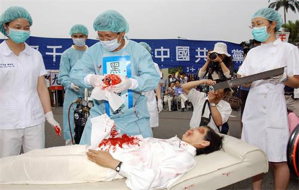

图：二零零六年四月二十三日，台湾法轮功学员在台北演示中共强摘中国法轮功学员器官的行动剧。

文章说，中共的罪行可能象《大屠杀》一书的作者伊森·葛特曼（Ethan Gutmann）描述的，是“一种隐藏在手术衣下的群体灭绝。”或是象英国保守党人权委员会主席、国会议员菲奥娜·布鲁斯(Fiona Bruce)在上周辩论中所描述的，是“反人类罪，不亚于二十一世纪的群体灭绝罪。”这是一种独一无二的罪行——从良心犯身上强行摘取器官。

主审塞尔维亚前总统米洛舍维奇的英国律师杰弗里尼斯爵士，正在一个独立法庭担任七人陪审团主席，陪审团成员包括律师、学者、高级医学专家和商人，他们将于四月六日和七日在伦敦举行进一步的听证。并将于今年六月进行最后宣判。

在去年十二月举行的听证会上，已经做出临时判决，陪审团“一致认定，无可置疑地认定，在中国，从良心犯身上强行摘取器官的做法已经实施了相当长的一段时间，而且涉及大量受害者。而且是由（中共）国家组织或批准的机构和个人干的。”

对于这样一个杰出的小组来说，采取不寻常的步骤发布临时判决肯定会引起注意。他们说，他们做出了决定，希望能“拯救无辜者免受伤害”。

然而，这是最难以证实的侵犯人权的行为之一，因为与许多其它虐待行为相反，唯一的证人是所涉及的医生、警察和监狱官员。在医院手术室中的证据可以清理掉。正如布鲁斯在上周的辩论中提出的那样，它“几乎是一种完美的犯罪”，因为没有受害者可以作证，“因为没有幸存者”。

出生于中国的前加拿大小姐林耶凡（Anastasia Lin）在英国议会的一次听证会上说，“在街上，如果有人袭击你，你可以尖叫寻求帮助。被绑在劳教所手术室的病床上，没有人能听到你的尖叫声。在中国，是国家在偷窃器官。”

指控说，不仅死刑犯，而且还有良心犯，特别是法轮功学员、藏传佛教徒和某些家庭教会基督徒，他们被要求接受体检，以进行器官匹配。许多人在未经他们同意的情况下器官被摘取。这些器官是为了满足巨大的器官移植交易的需求。

三年前，加拿大前亚太司司长大卫·乔高（David Kilgour）、加拿大人权律师大卫·麦塔斯（David Matas）和美国资深媒体人伊森·葛特曼（Ethan Gutmann）发表了报告《血腥的器官摘取/大屠杀：更新版》（Bloody Harvest/The Slaughter：An Update），该报告以先前的调查为基础，侧重于对中国712家从事肝肾移植手术的医院的公共记录进行研究。

他们发现，中国器官移植的数量远远超过此前报道的数量，因此他们得出结论，强迫器官摘取的规模也是如此。仅天津市第一中心医院一家医院每年就进行六千多例移植手术，他们推断，中国医院每年移植六万至十万个器官。这提出了一个问题：这些器官来自哪里？

中国没有自愿捐献器官的传统。在二零一八年，政府的官方数据显示，器官捐献者的人数约为六千，捐赠了一万八千个器官。然而，大卫乔高、麦塔斯和葛特曼表示，“几家医院的移植器官量就可以轻易超越这个数量”。

此外，在中国，包括外国人在内的患者被承诺在几天内就可以匹配到健康器官，而在大多数先进的西方国家，患者需要等待数月，有时甚至几年才能等到器官进行移植。冒充患者的研究人员给中国医院打电话，证实了这一点。

中国前卫生部副部长兼器官移植委员会主席黄洁夫，二零零五年在新疆做肝移植手术，他在重庆和广州两家医院订购两个备用肝脏，第二天早上就送来了。

简单的事实是，这些数字对不上。几天内就能为患者提供健康的匹配器官，全国有数百家医院进行移植手术，而每年只有几千名自愿捐献者，这意味着一定有另外的器官来源。

死刑犯可能是少量来源，由于中国法律要求被判处死刑的囚犯必须在七天内执行，这使得该来源的器官供应有限。这让调查人员得出结论：良心犯是器官来源。他们总结道：“这种反人类罪非常猖狂。”“最终的结论是：中共以国家之力大规模杀害无辜者，以获取移植器官。”

恩维尔·土赫提（Enver Tohti）曾是新疆一家医院的外科医生。他作证说，一九九五年，他在执行死刑现场强行从囚犯身上取下器官。在医院主治医生的指示下，他准备了设备并被带到现场。

他回忆说：“我们被告知要在一座小山后面等待，一听到枪声就马上过去。”“片刻之后，枪声响起。不是一声，而是很多声枪响。我们赶到了现场。一名武警告诉我去哪儿。他让我们靠近，然后指着一个身体说‘就是这个’。那时主治外科医生突然出现，他告诉我要摘取肝脏和两个肾脏。他催促我快点，然后主治外科医生把这些器官放进一个盒子里上了车。主治外科医生告诉我，回到医院后不要跟任何人讲发生的事情。”

专家们在世界各地的立法机构，包括在美国国会作证。美国国会、欧洲议会和其他立法机构通过了决议，谴责强摘暴行。一些国家和地区，特别是以色列、意大利、西班牙和台湾，已经禁止去中国进行“器官旅游”，加拿大参议院已经立法禁止“器官旅游”。联合国特派员呼吁中国对器官来源进行说明，但没有得到回应，世界上最受尊敬的器官移植伦理发声人安妮卡·蒂博尔(Annika Tibell)博士呼吁进行国际调查。

中国有回应吗？如果是这样，我们希望听到它。如果没有，国际社会的政府、媒体、律师、医疗从业者、专业协会和非政府组织都必须考虑他们的回应。如果独立中国法庭的临时判决曝光了真相，那么就要让正义得到伸张，责任者应当承担责任。如果是真的，则需要重新评估与责任人的关系。

其他国家应该效仿那些已经立法禁止去中国进行器官旅游的国家。联合国应任命一名中国人权问题特派员，并设立一个调查委员会。如果事实确实如此，则需要采取紧急行动，来阻止更多的无辜者被谋杀。

正如布鲁斯总结的：“当最终真相出来时，我们是否会再次遗憾的听到‘绝不能再发生’这句话？我们不是什么也做不了，事实并非如此，问题需要迫切解决。那些没有这样做的人有一天会被追究责任。”

本尼迪克特·罗杰斯是人权组织CSW的东亚团队负责人，英国保守党人权委员会副主席，以及终结滥用移植国际联盟（ETAC）的顾问。

</td>
 </tr>
</table>

<table>
<tr>
<td width=900>
<h3 align="center"><b>聚焦中共活摘器官 英媒争相报道</b></h3>

【明慧网二零一九年四月四日】（明慧记者方元英国综合报道）二零一九年三月下旬以来，英国广播公司（BBC）、《卫报》（The Guardian）、《周日快讯》（Sunday Express）和《苏格兰人报》（Scotsman）等多家英国主流媒体就“中共大规模强摘良心犯器官”为主题，制作新闻节目和发表文章；跟踪关注“中共活摘器官”这一重大指控而展开的多方调查研究；转载呼应英国国会议员近期在议会大厦举行的“中（共）国强摘活体器官（Forced live organ extraction in China）”辩论会上发出的谴责中共罪行、呼吁制止迫害的正义之声，并对立法禁止英国民众去中国开展“器官旅游”的举措建议提请社会关注和行动支持。

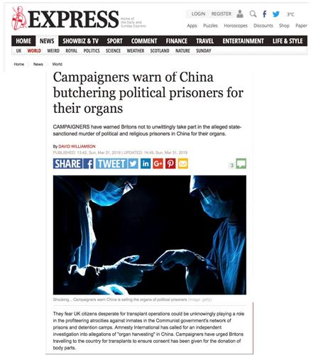

图：二零一九年三月三十一日，大卫·威廉姆森（David Williamson）在《周日快讯》（Sunday Express）报纸和网站发表文章：“活动人士警告中（共）国屠杀政治犯以取器官（Campaigners warn of China butchering political prisoners for their organs）”（网站截图）

<b>《周日快讯》：不要无意参与中共的谋杀</b>

《周日快讯》（Sunday Express）政治版副主编大卫·威廉姆森（David Williamson）在三月三十一日发表题为“活动人士警告中（共）国屠杀政治犯以取器官”的文章，说：“活动人士警告英国人不要无意参与（中共）国家批准的谋杀政治和宗教囚犯以取得器官（not to unwittingly take part in the alleged state-sanctioned murder of political and religious prisoners），他们担心迫切需要进行移植手术的英国公民可能会在不知情的情况下，在共产党政府对监禁拘留系统内囚犯实施暴行中扮演一个角色。”

文章中，威廉姆森指出国际特赦组织（Amnesty International）已经呼吁对有关中（共）国“强摘器官”的指控进行独立调查，而近日在英国议会大厦举行的辩论会上，多位国会议员谴责在中共专制下发生着“工业化规模的强制摘取器官（forced organ removals on an industrial scale）”，其中菲奥娜·布鲁斯议员（Fiona Bruce MP）指出这是“二十一世纪的种族灭绝（A 21st century genocide）”，“这种做法相当于杀人（manslaughter），或者说在大多数情况下是谋杀（murder）”；吉姆·香农议员（Jim Shannon MP）则提醒大家“我们面对的（中共）是一个自二战纳粹以来最大规模迫害宗教团体的政权”。

威廉姆森指出，看过大卫·乔高（David Kilgour）、大卫·麦塔斯（David Matas）以及伊森·葛特曼（Ethan Gutmann）在二零一六年发表的长达近七百页的报告的人，不难意识到自己正在关注一场暴行，在议会大厦举行的辩论会上就有国会议员表示自己被该报告的结论所震惊。文章中回顾乔高、麦塔斯和葛特曼二零一六年报告的结论：（在中国发生的）实际器官移植数量“远远超过中（共）国政府官方统计数据”，其中大部份都是“被杀害的无辜者。”“中（共）国的器官摘取是一种犯罪，其中共产党、国家机构、卫生系统、医院和相关器官移植职业人士都是同谋。 ”“在中（共）国允许对活摘良心犯器官罪行（过去的和现在的）开展全面调查之前，任何国家都不应允许其公民前往中国寻找移植器官。”

威廉姆森在文章中提醒人们关注“中国法庭（China Tribunal）”，称该独立人民法庭二零一八年十二月第一轮开庭取证，目前正在继续对良心犯取证，法庭主席尼斯爵士（Geoffrey Nice QC）宣布：“法庭成员都确定，无可置疑地一致确定，中（共）国从良心犯身上强摘器官已经实施了很长时间，而且涉及大量受害者。”

在文章结尾，威廉姆森列举“中国法庭（China Tribunal）”三位证人的证词，其中法轮功学员于新会和戴英们用自己亲身经历证明：因为坚持法轮功信仰，他们曾面对被中共活摘器官的威胁。

<b>《卫报》：呼吁英国禁止病人前往中国进行“器官旅游”</b>

二零一九年三月三十一日，《卫报》（The Guardian）刊登法律事务记者欧文·鲍福特（Owen Bowcott）的文章，题目是“呼吁英国禁止病人前往中国进行‘器官旅游’（Call for UK to ban patients travelling to China for 'organ tourism'）”，文章重点关注由部份国会议员近日发起支持并推动英国政府予以考虑的一项动议，即“在就从良心犯身上强摘器官指控进行调查之前，英国患者应被禁止前往中国进行器官移植手术”。

文章称，到目前为止，这一呼吁得到了四十位英国议员的支持，同时，“中国法庭”对有关被拘留者成为（中共）政权（活摘）目标的指控的调查正在进行中，而中共政府的态度是将这些指控统统称作恶意谣言，并自称遵守国际医疗标准。 ”

吉姆·香农议员三月二十六日在威斯特敏斯特厅（Jim Shannon MP）辩论会上呼吁英国政府考虑采取意大利、西班牙、以色列、台湾等的做法，禁止“器官旅游”，并在发言中强调这一议题的严肃性，文章引述香农议员发言说：“很难接受这意味着什么，它令人难以置信。”“这意味着有人可以坐在伦敦或纽卡斯特尔，按要求定购一个器官， 接着在一个月内就可以进行手术。”“我们要从制度管理入手，像其他一些国家那样”，“这不仅仅是必须要做的事情，是正确的事情，还因为有必要保护英国公民免于成为造成中国宗教或信仰团体苦难的角色。”

鲍福特在文章中也对“中国法庭（China Tribunal）”的宗旨和进展表示尊重和关注，她注意到该法庭的主席杰弗里·尼斯爵士（Geoffrey Nice QC）曾担任前南斯拉夫问题国际刑事法庭的检察官，该法庭针对（中共活摘器官）指控在向调查医疗专家、人权调查员和其他证人广泛收取证据。“中国法庭）”将于四月六日和七日在伦敦举行第二轮听证会。其最终判决将于六月十三日公布。“中国法庭”公开邀请中（共）国方的参与，但至今无回应。

鲍福特也在文章中复述“中国法庭”在二零一八年十二月发布的临时判决中的重要结论：“法庭成员都确定，无可置疑地一致确定，中（共）国从良心犯身上强摘器官已经实施了很长时间，而且涉及大量受害者。”“国家支持或批准的组织和个人大规模地强摘器官。”

<b>《苏格兰人报》：呼吁英国政府不要忽视有关中共杀人强取器官罪行</b>

二零一九年三月十九日，国会议员阿利斯泰尔·卡迈克尔（Alistair Carmichael MP）在《苏格兰人报》（Scotsman）上发文谴责中共活摘器官的骇人听闻罪行，呼吁英国政府别再忽视有关中共杀人强取器官，从法轮功学员、维吾尔穆斯林、西藏人、基督徒以及其他不愿意被中共洗脑的良心犯（prisoners of conscience who will not be brainwashed）身上强制摘取器官的指控，认为“我们不能坐着袖手旁观”。

文章中说，“强制摘取器官听起来简直令人难以置信，什么人可以为得到器官而杀死另一个人？ 这很容易被当作荒谬的夸张而被忽视，但这却是荒谬的事实。”

他谴责中共专制政权一直在侵害人权打压自由：“（在中共专制下）言论自由和新闻自由很少受到尊重，结社自由受到严重限制，残酷和有辱人格的虐待和任意拘留很普遍，大规模滥用死刑，对宗教仪式的密切监测也不是什么新鲜事。监控和打压的手段从秘密警察和线人扩展到监控摄像头和互联网追踪。 ”

卡迈克尔议员希望英国与国际社会一起努力制止中共的杀人和人权迫害。

</td>
 </tr>
</table>

<a href=#list><h4 align="right">回目錄</a></h4>

